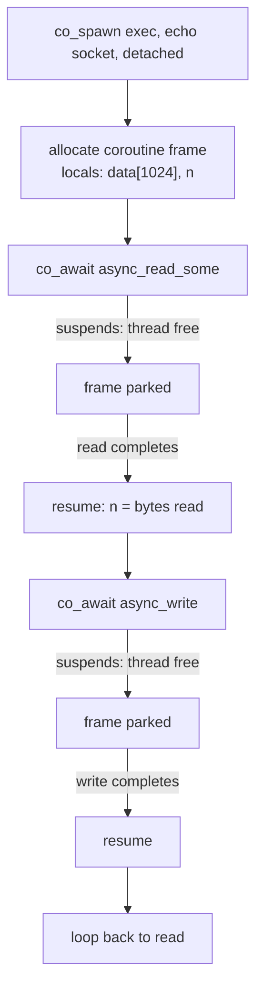

# Coroutines: Async/Await with Asio (C++20)

**Doc Source**: [C++20 Coroutines Support](https://think-async.com/Asio/asio-1.36.0/doc/asio/overview/composition/cpp20_coroutines.html)

## The Core Concept: Why This Example Exists

**The Problem:** The callback style of async Asio (Timer.2's `async_wait(&print)`) is correct but scales badly. A request handler that must "read header → parse → read body → process → write response → write trailer" becomes a five-deep nest of completion handlers, each capturing state by hand and each breaking the linear flow of the logic. The Proactor's documented downside — *"the separation in time and space between operation initiation and completion... inverted flow of control"* — is the callback pyramid.

**The Solution:** C++20 coroutines let you write async logic that *looks* synchronous but compiles to a chain of completion handlers under the hood. Asio provides three pieces: `asio::awaitable<T>` (the return type of a coroutine that runs on an executor), the `use_awaitable` completion token (which makes any `async_*` operation awaitable), and `co_spawn()` (which launches a coroutine onto an executor). The payoff: `co_await socket.async_read_some(buf)` reads like blocking code but suspends the coroutine and frees the thread, resuming only when the read completes. This is C++'s `async`/`await` — the direct analog of Rust's, TypeScript's, and Python's.

## Practical Walkthrough: Code Breakdown

### The echo coroutine: the official example

The [C++20 Coroutines doc](https://think-async.com/Asio/asio-1.36.0/doc/asio/overview/composition/cpp20_coroutines.html) leads with an echo server. This single snippet is the Rosetta Stone for Asio coroutines:

```cpp
asio::co_spawn(executor, echo(std::move(socket)), asio::detached);

// ...

asio::awaitable<void> echo(tcp::socket socket)
{
  try
  {
    char data[1024];
    for (;;)
    {
      std::size_t n = co_await socket.async_read_some(asio::buffer(data));
      co_await async_write(socket, asio::buffer(data, n));
    }
  }
  catch (std::exception& e)
  {
    std::printf("echo Exception: %s\n", e.what());
  }
}
```

Compare this to the callback equivalent (a read handler that initiates a write handler that initiates a read handler…). The `for (;;)` loop is *linear* — the inversion of control is gone, yet no thread is blocked. Each `co_await` suspends the coroutine; when the I/O completes, the runtime resumes it right where it left off, with `n` holding the byte count.

### The three roles: `co_spawn`, `awaitable`, `use_awaitable`

The docs explain each argument to `co_spawn`:

> The first argument to `co_spawn()` is an executor that determines the context in which the coroutine is permitted to execute. For example, a server's per-client object may consist of multiple coroutines; they should all run on the same `strand` so that no explicit synchronisation is required.

> The second argument is an `awaitable<R>`, that is the result of the coroutine's entry point function... The template parameter `R` is the type of return value produced by the coroutine. In the above example, the coroutine returns `void`.

> The third argument is a completion token, and this is used by `co_spawn()` to produce a completion handler with signature `void(std::exception_ptr, R)`... In the above example we pass a completion token type, `asio::detached`, which is used to explicitly ignore the result.

So `co_spawn(executor, coro, detached)` = "run this coroutine on that executor; I don't care about its result." Pass `asio::use_future` instead and you get a `std::future<void>`; pass a lambda and you get a callback on completion.

### How an `async_*` call becomes awaitable

Inside the coroutine, the magic is the completion token. The docs show two equivalent forms:

> When an asynchronous operation is called without explicitly specifying a completion token, the default completion token `deferred` is used. This causes the operation's initiating function to return a deferred asynchronous operation object that may be used with the `co_await` keyword:

```cpp
std::size_t n = co_await socket.async_read_some(asio::buffer(data));
```

> Alternatively, we can specify the `use_awaitable` completion token:

```cpp
std::size_t n = co_await socket.async_read_some(asio::buffer(data), asio::use_awaitable);
```

The rule for what the `co_await` yields:

> With either of those completion tokens, when an asynchronous operation's handler signature has the form `void handler(asio::error_code ec, result_type result);` the resulting type of the `co_await` expression is `result_type`. In the `async_read_some` example above, this is `size_t`. If the asynchronous operation fails, the `error_code` is converted into a `system_error` exception and thrown.

So `error_code` becomes an exception automatically — that's why the echo coroutine wraps the loop in `try/catch`. A `co_await` of an op with signature `void(error_code)` yields `void`.

### Explicit error handling without exceptions

If you'd rather not throw, two token adapters capture the error instead:

```cpp
asio::awaitable<void> echo(tcp::socket socket)
{
  char data[1024];
  for (;;)
  {
    auto [ec, n] = co_await socket.async_read_some(
        asio::buffer(data), asio::as_tuple);
    if (!ec)
    {
      // success
    }
    // ...
  }
}
```

Or capture the error into a variable with `redirect_error`:

```cpp
asio::error_code ec;
std::size_t n = co_await socket.async_read_some(
    asio::buffer(data), asio::redirect_error(ec));
if (!ec) { /* success */ }
```

`as_tuple` returns the whole `(ec, n)` as a `std::tuple` (great for structured bindings); `redirect_error` keeps the value as the result and writes the error into your `ec`. Choose based on whether you want value-or-error (redirect) or always-both (as_tuple).

### Per-operation cancellation

Coroutines integrate with Asio's cancellation system. The docs show how to inspect cancellation state from inside a coroutine:

```cpp
asio::awaitable<void> my_coroutine()
{
  asio::cancellation_state cs
    = co_await asio::this_coro::cancellation_state;

  // ...

  if (cs.cancelled() != asio::cancellation_type::none)
    // ...
}
```

> When first created by `co_spawn`, the thread of execution has a cancellation state that supports `cancellation_type::terminal` values only. To change the cancellation state, call `this_coro::reset_cancellation_state`.

This is how you make a long-running coroutine respond to "abort now" or "finish what you're doing then stop."

### Co-ordinating parallel coroutines (experimental)

A striking feature — `awaitable` overloads `&&` and `||` for parallel composition:

```cpp
std::tuple<std::size_t, std::size_t> results =
  co_await (
    async_read(socket, input_buffer, use_awaitable)
      && async_write(socket, output_buffer, use_awaitable)
  );
```

> When awaited using `&&`, the `co_await` expression waits until both operations have completed successfully. As a "short-circuit" evaluation, if one operation fails with an exception, the other is immediately cancelled.

And the race (`||`):

```cpp
std::variant<std::size_t, std::monostate> results =
  co_await (
    async_read(socket, input_buffer, use_awaitable)
      || timer.async_wait(use_awaitable)
  );
```

> When awaited using `||`, the `co_await` expression waits until either operation succeeds... the other is immediately cancelled.

This turns the classic timeout race (read vs. deadline timer) into one readable expression. Enable with `#include <asio/experimental/awaitable_operators.hpp>` and `using namespace asio::experimental::awaitable_operators;`.

## Mental Model: Thinking in Coroutines

**A coroutine is a callback chain you can read top-to-bottom.** When `co_spawn` launches your `awaitable<void>` function, it allocates a coroutine frame (on the heap, via the allocator associated with the executor), stores locals there, and runs until the first `co_await`. At each `co_await`, the coroutine *suspends* — returns control to the executor — and registers itself as the completion handler of the underlying async op. When the op completes, the runtime *resumes* the coroutine, restoring its locals from the frame, and the `co_await` expression yields the result. The thread is free the entire time the coroutine is suspended.



**Why It Beats Callbacks:** The locals (`data`, `n`) live in the coroutine frame, not captured piecemeal into nested lambdas. Control flow is the code's textual order — no "inversion." Error handling is `try/catch` instead of `if (ec)` in every handler. And, crucially for the buffer lifetime problem (`05-buffers.md`): a stack array `char data[1024]` *inside the coroutine* is safe across `co_await`, because the frame outlives each suspension. Coroutines dissolve the dangling-buffer footgun that haunts callback code.

## Pitfalls

- **The coroutine must run on an executor that's being driven.** `co_spawn` schedules onto an executor; if nothing calls `io_context::run()`, the coroutine never resumes past its first suspension point.
- **Default `detached` swallows exceptions silently except for a `printf`.** In production, pass a completion handler that logs or rethrows — an unobserved exception in a `detached` coroutine is a silent failure.
- **Mixing `use_awaitable` with the default `deferred` token.** The default completion token changed to `deferred` (awaitable-compatible); older code may assume `use_awaitable` is required. Both work, but be consistent within a codebase.
- **`co_return`-ing a value from an `awaitable<void>`.** The `R` in `awaitable<R>` must match. An `awaitable<int>` must `co_return 42;`; an `awaitable<void>` just falls off the end.
- **Forgetting `#include <asio/awaitable.hpp>` and `co_spawn.hpp`.** The headers aren't pulled in by `asio.hpp` in all configurations; the coroutine support is opt-in by header.
- **The `&&`/`||` operators need `use_awaitable` explicitly.** The docs warn: *"To use these operators we must explicitly specify the `use_awaitable` completion token."* The default `deferred` token won't compile with them.

## 🔗 Cross-references

**Within C++ (the expertise spine):**

- 🔗 `COROUTINES` (P4) — the language-level deep dive: the coroutine frame, `promise_type`, `co_await`/`co_yield`/`co_return`, `std::coroutine_handle`. Asio's `awaitable<T>` is a *client* of the C++20 coroutine machinery; this bundle's `06-coroutines.md` is the Asio-specific application of that foundation.
- 🔗 `FUTURES_PROMISES` (P4) — `awaitable<T>` and `std::future<T>` are both one-shot completion vessels. `co_spawn(..., use_future)` converts an awaitable into a future, bridging the coroutine world and the `std::async` world.
- 🔗 `STD_THREAD` (P4) — coroutines are *cooperative* (suspend at `co_await`); threads are *preemptive*. A coroutine needs an executor (a thread in `run()`) to resume it; it can't run on its own. One thread can host millions of coroutines.
- 🔗 `EXCEPTIONS_DEEP` — the `error_code`→`system_error` translation at each `co_await` means a coroutine propagates failures via C++ exceptions across suspension points, which callbacks cannot do natively.

**Cross-language parallels (the 5-language curriculum):**

- 🔗 [`../rust`](../rust) — **Rust's `async fn` / `.await` is the direct sibling.** `awaitable<T>` ↔ `impl Future<Output = T>`; `co_spawn(io, coro, detached)` ↔ `tokio::spawn(async move { ... })`; `co_await socket.async_read_some(..)` ↔ `socket.read(..).await`. The key contrast: Rust futures are *poll-based* (the executor drives them via `poll`), Asio coroutines are *callback-resumed* (the completion handler resumes the frame). Both compile down to state machines; Rust's are zero-allocation by default, Asio's frames are heap-allocated but can use a custom allocator.
- 🔗 [`../ts`](../ts) — **TypeScript/JS `async`/`await`** is the conceptual template Asio copied. `awaitable<void>` ↔ `Promise<void>`; `co_spawn` ↔ firing an async IIFE on the event loop; `co_await` ↔ `await`. The difference: JS promises are GC'd and microtask-scheduled on a single global loop; Asio coroutines live on an explicit executor you control, and integrate with strands for multi-threaded serialization.
