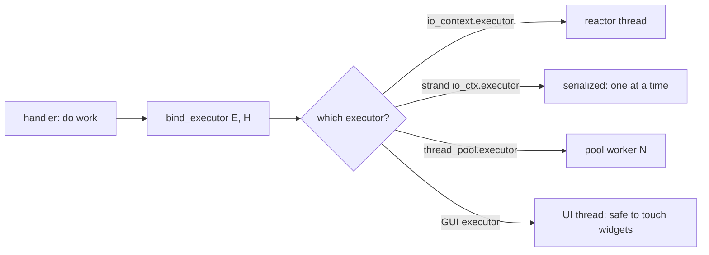

# Executors: Where Handlers Run

**Doc Source**: [Executors](https://think-async.com/Asio/asio-1.36.0/doc/asio/overview/model/executors.html) · [Strands](https://think-async.com/Asio/asio-1.36.0/doc/asio/overview/core/strands.html) · [Executor requirements](https://think-async.com/Asio/asio-1.36.0/doc/asio/reference/Executor1.html)

## The Core Concept: Why This Example Exists

**The Problem:** In an async system you can ask *what* work to do (read this socket) and *when* to do it (after it's ready), but there's a third, orthogonal question that's easy to overlook: **where** should the completion handler run? On the thread that initiated the op? On a background pool? On the GUI thread so it can touch widgets? Serialized so it can't race a sibling handler? If the answer is hard-coded ("always the reactor thread"), you lose the ability to write GUI apps, to serialize per-session, to prioritize, or to migrate work between cores.

**The Solution:** Asio makes "where a handler runs" a first-class, configurable property called the **executor**. Every asynchronous agent has an associated executor that *"determines how the agent's completion handlers are queued and ultimately run."* An `io_context` is an executor (run on whichever thread is in `run()`); a `strand` is an executor (run serialized); a `thread_pool` is an executor (run on any pool worker). You associate a handler with an executor via `asio::bind_executor`, or query it via `get_associated_executor`. The executor is the policy knob for *where, when, and how* handlers execute — separated from the logic of *what* they do.

Think of an executor as a dispatcher at a taxi company. The handler is a passenger with a destination (the work to do); the executor decides *which cab* (which thread) picks them up and *in what order* (serialized, concurrent, prioritized). Same passenger, different dispatch policies — without rewriting the passenger's itinerary.

## Practical Walkthrough: Code Breakdown

### What an executor is, in the docs' words

The [Executors doc](https://think-async.com/Asio/asio-1.36.0/doc/asio/overview/model/executors.html) is concise and definition-first:

> Every asynchronous agent has an associated *executor*. An agent's executor determines how the agent's completion handlers are queued and ultimately run.

It then lists the concrete use cases that motivate the abstraction:

> Example uses of executors include:
> - Coordinating a group of asynchronous agents that operate on shared data structures, ensuring that the agents' completion handlers never run concurrently.
> - Ensuring that agents are run on specified execution resource (e.g. a CPU) that is proximal to data or an event source (e.g. a NIC).
> - Denoting a group of related agents, and so enabling dynamic thread pools to make smarter scheduling decisions (such as moving the agents between execution resources as a unit).
> - Queuing all completion handlers to run on a GUI application thread, so that they may safely update user interface elements.
> - Returning an asynchronous operation's default executor as-is, to run completion handlers as close as possible to the event that triggered the operation's completion.
> - Adapting an asynchronous operation's default executor, to run code before and after every completion handler, such as logging, user authorisation, or exception handling.
> - Specifying a priority for an asynchronous agent and its completion handlers.

Each bullet is a real engineering need that a hard-coded "reactor thread" model couldn't serve: serialization (strands), NUMA locality, work-stealing hints, GUI-thread affinity, logging/tracing wrappers, priority scheduling.

### What the executor does for an async op

The docs spell out the three jobs an executor performs for the operations within an agent:

> The asynchronous operations within an asynchronous agent use the agent's associated executor to:
> - Track the existence of the work that the asynchronous operation represents, while the operation is outstanding.
> - Enqueue the completion handler for execution on completion of an operation.
> - Ensure that completion handlers do not run re-entrantly, if doing so might lead to inadvertent recursion and stack overflow.

> Thus, an asynchronous agent's associated executor represents a policy of how, where, and when the agent should run, specified as a cross-cutting concern to the code that makes up the agent.

The footnote ties the first bullet to strands:

> In Asio, this kind of executor is called a strand.

### The three concrete executors you'll meet

1. **`io_context::executor_type`** — the default. A handler "executed" on it is enqueued on the `io_context` and run by whichever thread is inside `run()`. Get it via `io.get_executor()`.

2. **`strand<Executor>`** — a serializing adapter over another executor. Handlers run on the underlying executor's threads, but never two at once. See `03-strands.md`. Create one with `asio::make_strand(io)`.

3. **`thread_pool::executor_type`** — a fixed pool of worker threads, each in its own `run()`-equivalent. A handler posted to the pool runs on whichever worker is free.

### Associating a handler with an executor: `bind_executor`

The [strands doc](https://think-async.com/Asio/asio-1.36.0/doc/asio/overview/core/strands.html) shows the universal association mechanism:

```cpp
my_socket.async_read_some(my_buffer,
    asio::bind_executor(my_strand,
      [](error_code ec, size_t length)
      {
        // ...
      }));
```

`bind_executor(executor, handler)` returns a wrapper whose *associated executor* is `executor`. This is how you say "run this completion handler on that executor" — for a strand (serialize), a GUI thread executor (touch widgets safely), or a priority executor.

### How a composed op inherits the executor

The strands doc explains the plumbing that makes executors propagate through composed operations:

> To achieve this, all asynchronous operations obtain the handler's associated executor by using the `get_associated_executor` function. For example:
> ```cpp
> asio::associated_executor_t<Handler> a = asio::get_associated_executor(h);
> ```
> The associated executor must satisfy the Executor requirements. It will be used by the asynchronous operation to submit both intermediate and final handlers for execution.

So when you `async_read(socket, buf, bind_executor(strand, handler))`, the `async_read` *internally* extracts the strand via `get_associated_executor` and runs its multi-step internal handlers on that same strand. You bind once at the boundary; the composed op threads the executor through.

### Customizing the executor for a handler type

For advanced cases you can embed an executor directly in a handler's type, the docs show both a nested-typedef style:

```cpp
class my_handler
{
public:
  typedef my_executor executor_type;

  executor_type get_executor() const noexcept
  {
    return my_executor();
  }

  void operator()() { /* ... */ }
};
```

…and an `associated_executor` partial specialization:

```cpp
struct my_handler
{
  void operator()() { /* ... */ }
};

namespace asio {
  template <class Executor>
  struct associated_executor<my_handler, Executor>
  {
    typedef my_executor type;

    static type get(const my_handler&,
        const Executor& = Executor()) noexcept
    {
      return my_executor();
    }
  };
} // namespace asio
```

This is the extension point: any handler type can declare its own executor policy, and every `async_*` op will honor it without the call site changing.

## Mental Model: Thinking in Executors

**The executor is the "where," decoupled from the "what."** Without executors, every async framework bakes in an answer: Node runs every callback on the one global loop; raw `epoll` code runs handlers on the polling thread. Asio refuses to commit — the executor is a parameter. The same `async_read_some` call, with the same handler body, can be made to run serialized (strand), on a pool (thread_pool), on the GUI thread (a wrapped executor), or with a logging wrapper — purely by changing the executor you bind, with zero edits to the handler logic.



**The Executor as a cross-cutting concern:** The docs' phrase *"a policy... specified as a cross-cutting concern"* is the key. Logging, serialization, priority, thread-affinity — these are classic cross-cutting concerns (like aspects in AOP). Asio models them as executors: you compose/wrap an executor to weave in behavior without touching the handler. A `strand` *is* a serialization aspect; a logging executor *is* a tracing aspect.

## Pitfalls

- **The default executor isn't always what you want in a multi-threaded program.** If you call `io_context::run()` from N threads and don't bind handlers to a strand, any handler can run concurrently with any other on the same socket/session — a data race. Bind a strand per session.
- **Forgetting to re-bind on re-arm.** Like strands, the executor association is per-initiation; each `async_*` call in a chain must re-bind (or rely on a composed op's propagation).
- **Confusing the executor with the execution context.** The `io_context` is a context (owns the loop); `io.get_executor()` returns an executor (a lightweight handle/value to it). Executors are cheap to copy; contexts are not. Pass executors around, not contexts.
- **`post` vs `dispatch`.** `asio::post(executor, h)` guarantees `h` runs *later* (never inline); `asio::dispatch(executor, h)` may run `h` *inline* if the current thread already belongs to that executor. Use `post` to break recursion, `dispatch` when you want immediate execution if legal.
- **An executor's lifetime must outlive the work.** Destroying a `thread_pool` while handlers are still queued aborts; `io_context` likewise. Keep the context alive until `run()` returns and work drains.

## 🔗 Cross-references

**Within C++ (the expertise spine):**

- 🔗 `STD_THREAD` (P4) — executors are the abstraction over "which thread runs this." A `thread_pool` executor maps handlers onto OS threads (`STD_THREAD`); a single-threaded `io_context` executor is effectively one logical thread. This bundle's `03-strands.md` is the headline executor use case.
- 🔗 `MUTEX_LOCK_GUARD` (P4) — a strand executor replaces the mutex for handler serialization. The executor is the higher-level, declarative alternative.
- 🔗 `COROUTINES` (P4) — `co_spawn(executor, coro, token)` runs a coroutine *on an executor*; the coroutine's resumption (after each `co_await`) happens on that executor. Executors and coroutines are orthogonal axes that compose. See `06-coroutines.md`.
- 🔗 `RAII` (P2) — the executor's "track the existence of work" job is the reference-counting that keeps `io_context::run()` from exiting early (`executor_work_guard` is the RAII tool for "keep the loop alive even with no pending ops").
- 🔗 `CONCEPTS` — the "Executor requirements" are a named concept-like set of syntactic/semantic constraints. Asio's executor model predates standard `concepts` but embodies the same idea.

**Cross-language parallels (the 5-language curriculum):**

- 🔗 [`../rust`](../rust) — **Tokio is the closest sibling.** Tokio's `runtime::Handle`/`tokio::spawn` let you pick *which* runtime a task runs on; `tokio::task::spawn_blocking` is a dedicated thread-pool executor for blocking work; per-task `Send` bounds are the executor-affinity analog. Rust's `Future` carries its executor implicitly via `poll`'s `Context`/`Waker`; Asio makes the executor an *explicit* associated property of the handler. The std::execution (P2300) proposal — see below — is unifying the C++ model toward what Rust/Tokio already has.
- 🔗 [`../ts`](../ts) — **Node has no first-class executor abstraction**: there's one global event loop, and `setImmediate`/`nextTick`/`queueMicrotask` are its only "where/when" knobs. Asio's executor model is strictly more expressive — you can have many loops, many pools, serialization per session. `worker_threads` + `postMessage` is Node's coarse-grained answer to "run on a different executor."
