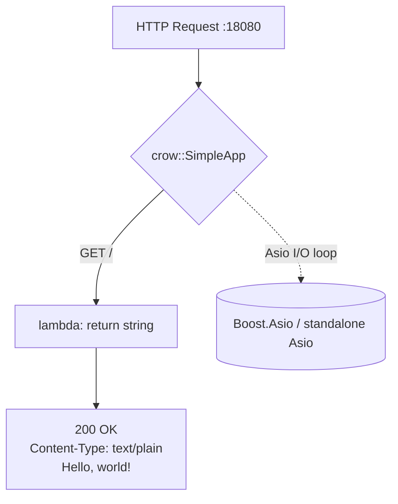

# Hello World: Your First Crow Web Server

**Doc Source**: [getting_started/your_first_application](https://crowcpp.org/master/getting_started/your_first_application/) · [examples/helloworld.cpp](https://github.com/CrowCpp/Crow/blob/master/examples/helloworld.cpp)

## The Core Concept: Why This Example Exists

**The Problem:** Every web framework needs to prove it can handle the most fundamental task: accepting an HTTP request and returning a response. The "Hello, World!" example is the simplest possible demonstration that a web server can listen for connections, process requests, and send back meaningful data.

**The Solution:** Crow approaches this with radical, Flask-like simplicity. Unlike frameworks that demand configuration files or build steps, Crow's design philosophy centers on three core principles:
1. **Macro-Based Routing**: `CROW_ROUTE(app, "/")` connects a URL to a handler with a single readable line
2. **Header-Only C++**: `#include "crow.h"` is all you compile against
3. **Asio Underneath**: Crow is a Flask-like skin on top of [Boost.Asio](https://www.boost.org/doc/libs/release/doc/html/boost_asio.html) (or its standalone cousin), so it inherits a proven async I/O core.

Think of Crow as a sophisticated traffic director. When a request arrives, Crow's router examines the request's path and HTTP method, then dispatches it to the appropriate handler lambda — all without you writing any networking code.

## Practical Walkthrough: Code Breakdown

Let's examine the canonical Crow "Hello, World!", taken verbatim from the official examples tree:

### The Whole Server

```cpp
#include "crow.h"

int main()
{
    crow::SimpleApp app;

    CROW_ROUTE(app, "/")
    ([]() {
        return "Hello, world!";
    });

    app.port(18080).run();
}
```
*(source: [`examples/helloworld.cpp`](https://github.com/CrowCpp/Crow/blob/master/examples/helloworld.cpp))*

Breaking this down step by step:

1. **`#include "crow.h"`** — the single header that pulls in the entire framework. If you built the amalgamated header, it's `#include "crow_all.h"`.
2. **`crow::SimpleApp app;`** — `SimpleApp` is `crow::App<>` with no middleware. The App "organizes all the different parts of Crow and provides the developer a simple interface." The full form `crow::App<MW1, MW2, ...>` lets you bolt middleware onto the type itself (see [04-middleware.md](./04-middleware.md)).
3. **`CROW_ROUTE(app, "/")`** — the macro registers a route on the root path. Under the hood it expands to a compile-time, type-checked `TaggedRule` (there's also `route_dynamic` for runtime evaluation, but it is **not** recommended).
4. **`([]() { return "Hello, world!"; })`** — the handler lambda. Returning a `std::string` (or anything convertible) sets the body; Crow infers `Content-Type: text/plain` for you.
5. **`app.port(18080).run();`** — binds to TCP port 18080 and enters the event loop. `port()` is optional (default 80); chain `.multithreaded()` to spread work across a thread pool.

> **Why `SimpleApp` and not `App`?** `crow::SimpleApp` is a typedef for `crow::App<>` — an app with zero middleware. The moment you need middleware you switch to `crow::App<YourMW>`, which is exactly the seam the middleware guide explores.

### The Fluent Builder for Startup

The official getting-started guide shows the production variant with the chainable builder API:

```cpp
int main()
{
    crow::SimpleApp app; //define your crow application

    //define your endpoint at the root directory
    CROW_ROUTE(app, "/")([](){
        return "Hello world";
    });

    //set the port, set the app to run on multiple threads, and run the app
    app.port(18080).multithreaded().run();
}
```
*(source: [getting_started/your_first_application](https://crowcpp.org/master/getting_started/your_first_application/))*

Each call returns a reference to `app`, so configuration reads left-to-right: pick a port → enable the thread pool → enter `run()`. Common knobs: `.loglevel(crow::LogLevel::Debug)`, `.bindaddr("127.0.0.1")`, `.concurrency(N)`.

## Mental Model: Thinking in Crow

**The Macro as a Switchboard Patch Cable:** Imagine your Crow application as an old telephone switchboard. The `crow::App` is the board itself; `CROW_ROUTE(app, "/")` is you plugging a patch cable from a labeled jack (the URL) into an operator (the handler lambda). When a call (HTTP request) comes in on that jack, the operator answers it and speaks the response. No XML, no annotations, no reflection registry — the route table is literally a list of `app.route<...>(...)` calls the macro emits.



**Why It's Designed This Way:** Crow picks a macro (`CROW_ROUTE`) rather than the fluent `.route()` style of axum/Hono because C++ lacks Rust's trait-based extraction. The macro instead generates a compile-time `get_parameter_tag` of the URL, so a mismatch like `<int>` in the path but no matching `int` parameter in the handler is a **compile error** (`"Handler type is mismatched with URL paramters"`). You get routing ergonomics *and* type safety from one symbol.

This design has practical implications:
- **Zero-runtime cost routing** for the static (default) case — the URL is parsed at compile time.
- **Header-only** means `crow.h` is your entire build dependency; link Asio and you're done.
- **Handler == function** — a lambda you can unit-test directly via `app.handle(req, res)` (see [06-testing.md](./06-testing.md)).

**Pitfalls:**
- The macro needs the literal URL **as a compile-time string** — a `std::string` variable won't work with `CROW_ROUTE`. Fall back to `app.route_dynamic(url)` only if you truly need runtime URLs.
- `run()` **blocks** the calling thread. To start it in a test or alongside other work, launch it on another thread (the testing guide shows `std::async` + `wait_for_server_start()`).
- Returning a bare string literal (`return "..."`) decays to `const char*`, which is fine; returning a `crow::json::wvalue` auto-sets `Content-Type: application/json` (see [03-json.md](./03-json.md)).

**Further Exploration:**
- Change the path to `CROW_ROUTE(app, "/hello/<int>")` and accept an `int` parameter — the macro will wire the URL segment into your handler argument automatically.
- Add `.methods("POST"_method)` after the macro to restrict the HTTP verb.
- Try returning `crow::response(503)` to send a custom status code.

## 🔗 Cross-References

**Curriculum (this C++ tree):**
- [`../STD_THREAD.md`](../STD_THREAD.md) — `.multithreaded()` runs Crow's internal thread pool; understand the underlying concurrency model.
- [`../COROUTINES.md`](../COROUTINES.md) — Asio is coroutine-native; Crow handlers can be written atop Asio coroutines for non-blocking I/O.

**Cross-language siblings:**
- [`../../rust/axum/01-hello-world.md`](../../rust/axum/01-hello-world.md) — axum is the closest sibling; compare `Router::new().route("/", get(handler))` with `CROW_ROUTE`.
- [`../../ts/hono/01-hello-world.md`](../../ts/hono/01-hello-world.md) — Hono's `app.get('/', (c) => c.text('...'))` mirrors Crow's macro ergonomics.
- [`../../python/FASTAPI_ROUTING_PARAMS.md`](../../python/FASTAPI_ROUTING_PARAMS.md) — FastAPI's `@app.get("/")` decorator is the Flask-style inspiration Crow explicitly copies.

**Next:** [02-routing.md](./02-routing.md) — paths, parameters, methods, and blueprints.
