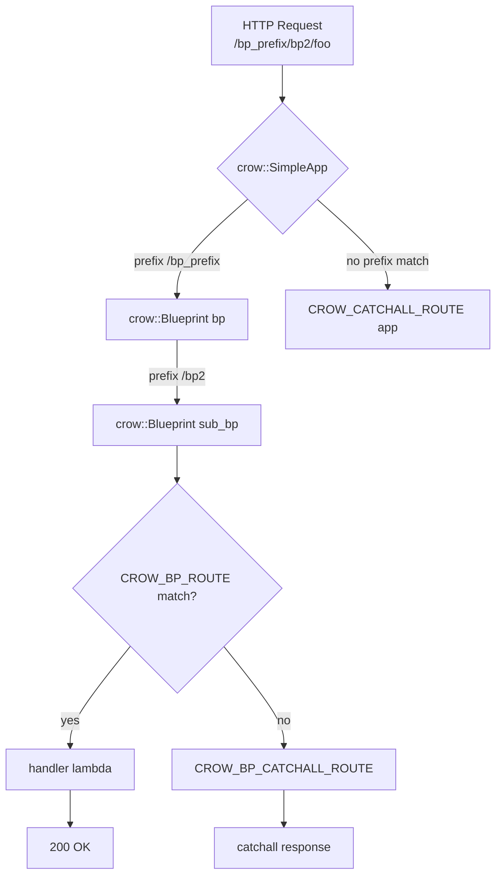

# Routing: Paths, Params, Methods, Blueprints

**Doc Source**: [guides/routes](https://crowcpp.org/master/guides/routes/) · [guides/blueprints](https://crowcpp.org/master/guides/blueprints/) · [examples/example.cpp](https://github.com/CrowCpp/Crow/blob/master/examples/example.cpp) · [examples/example_blueprint.cpp](https://github.com/CrowCpp/Crow/blob/master/examples/example_blueprint.cpp)

## The Core Concept: Why This Example Exists

**The Problem:** A single "Hello, World" route is fine for a demo, but real applications have dozens of endpoints: `/users/<id>`, `POST /orders`, `DELETE /items/<int>`. As the surface grows you need (a) a way to pull data *out of* the URL, (b) a way to restrict *which* HTTP verbs a route accepts, and (c) a way to *group* related routes so the file doesn't become a thousand-line `main()`.

**The Solution:** Crow borrows three ideas straight from Python's Flask:
1. **Path parameters** typed inline in the URL template — `"/hello/<int>"` parses the segment as an `int` and passes it as a handler argument.
2. **`.methods(...)` chaining** to bind a route to specific HTTP verbs, defaulting to `GET`.
3. **Blueprints** — "a limited app. It cannot handle networking, but it can handle routes" — letting you compartmentalize endpoints behind a shared prefix, static dir, and middleware stack.

The `CROW_ROUTE` macro generates a **compile-time** tag of the URL, so a route declared as `/add/<int>/<int>` is statically checked to map onto a handler taking two `int`s.

## Practical Walkthrough: Code Breakdown

### Typed Path Parameters

The official routes guide shows the canonical two-parameter adder:

```cpp
CROW_ROUTE(app, "/add/<int>/<int>")
([](int a, int b)
{
    return std::to_string(a+b);
});
```
*(source: [guides/routes — Path](https://crowcpp.org/master/guides/routes/#path-url))*

> "the first `<int>` is defined as `a` and the second as `b`. If you were to run this and call `http://example.com/add/1/2`, the result would be a page with `3`."

Crow supports five parameter types: `<int>`, `<uint>`, `<double>`, `<string>`, and `<path>` (the last greedily captures the rest of the URL including slashes). The matching example from the real `example.cpp` adds a guard and custom status:

```cpp
CROW_ROUTE(app, "/hello/<int>")
([](int count) {
    if (count > 100)
        return crow::response(400);
    std::ostringstream os;
    os << count << " bottles of beer!";
    return crow::response(os.str());
});

// Same as above, but using crow::status
CROW_ROUTE(app, "/hello_status/<int>")
([](int count) {
    if (count > 100)
        return crow::response(crow::status::BAD_REQUEST);
    std::ostringstream os;
    os << count << " bottles of beer!";
    return crow::response(os.str());
});
```
*(source: [`examples/example.cpp`](https://github.com/CrowCpp/Crow/blob/master/examples/example.cpp))*

`crow::status::BAD_REQUEST` is the v1.0 enum alias for the literal `400`; both are valid.

### HTTP Methods

By default a route answers `GET`. Restrict verbs with `.methods(...)`:

```cpp
CROW_ROUTE(app, "/add/<int>/<int>")
.methods(crow::HTTPMethod::GET, crow::HTTPMethod::PATCH)
// equivalently:
// .methods("GET"_method, "PATCH"_method)
```
*(source: [guides/routes — Methods](https://crowcpp.org/master/guides/routes/#methods))*

The string-literal form `"POST"_method` uses a Crow-defined user-defined literal. The real `example.cpp` uses it for a JSON POST endpoint:

```cpp
CROW_ROUTE(app, "/add_json")
  .methods("POST"_method)([](const crow::request& req) {
      auto x = crow::json::load(req.body);
      if (!x)
          return crow::response(400);
      int64_t sum = x["a"].i() + x["b"].i();
      std::ostringstream os;
      os << sum;
      return crow::response{os.str()};
  });
```
*(source: [`examples/example.cpp`](https://github.com/CrowCpp/Crow/blob/master/examples/example.cpp))*

> **Note (from the docs):** "Crow handles `OPTIONS` method automatically. The `HEAD` method is handled automatically unless defined in a route. Adding `OPTIONS` to a route's methods has no effect."

### Query Strings & Body Params

URL params come through `req.url_params`:

```cpp
CROW_ROUTE(app, "/params")
([](const crow::request& req) {
    std::ostringstream os;
    os << "Params: " << req.url_params << "\n\n";
    os << "The key 'foo' was " << (req.url_params.get("foo") == nullptr ? "not " : "") << "found.\n";

    if (req.url_params.get("pew") != nullptr)
    {
        double countD = crow::utility::lexical_cast<double>(req.url_params.get("pew"));
        os << "The value of 'pew' is " << countD << '\n';
    }

    auto count = req.url_params.get_list("count");
    os << "The key 'count' contains " << count.size() << " value(s).\n";
    for (const auto& countVal : count)
        os << " - " << countVal << '\n';

    auto mydict = req.url_params.get_dict("mydict");
    os << "The key 'dict' contains " << mydict.size() << " value(s).\n";
    for (const auto& mydictVal : mydict)
        os << " - " << mydictVal.first << " -> " << mydictVal.second << '\n';

    return crow::response{os.str()};
});
```
*(source: [`examples/example.cpp`](https://github.com/CrowCpp/Crow/blob/master/examples/example.cpp))*

`get()` returns `nullptr` if absent; `get_list` parses `?count[]=a&count[]=b`; `get_dict` parses `?mydict[a]=b&mydict[abcd]=42`. For `application/x-www-form-urlencoded` bodies, use `req.get_body_params()` with the same API.

### The Response-as-Parameter Pattern

Instead of *returning* a response, you can take `crow::response&` as a handler argument and write to it incrementally — useful for streaming or when you must call `res.end()` yourself:

```cpp
CROW_ROUTE(app, "/add/<int>/<int>")
([](crow::response& res, int a, int b) {
    std::ostringstream os;
    os << a + b;
    res.write(os.str());
    res.end();
});
```
*(source: [`examples/example.cpp`](https://github.com/CrowCpp/Crow/blob/master/examples/example.cpp))*

> **Pitfall:** "in order to return a response defined as a parameter you'll need to use `res.end();`." Forget `end()` and the client hangs until timeout.

### Blueprints — Grouping Routes

A blueprint is a "sub-app" with its own prefix, static dir, templates dir, and middleware. From the official guide:

> "A blueprint is a limited app. It cannot handle networking, but it can handle routes. In order for a blueprint to work, it has to be registered with a Crow app before the app is run. This can be done using `app.register_blueprint(blueprint);`."

The real `example_blueprint.cpp` shows nesting and a blueprint-level catchall:

```cpp
#include "crow.h"

int main()
{
    crow::SimpleApp app;

    crow::Blueprint bp("bp_prefix", "cstat", "ctemplate");

    crow::Blueprint sub_bp("bp2", "csstat", "cstemplate");

    CROW_BP_ROUTE(sub_bp, "/")
    ([]() {
        return "Hello world!";
    });

    CROW_BP_CATCHALL_ROUTE(sub_bp)
    ([]() {
        return "WRONG!!";
    });

    bp.register_blueprint(sub_bp);
    app.register_blueprint(bp);

    app.loglevel(crow::LogLevel::Debug).port(18080).run();
}
```
*(source: [`examples/example_blueprint.cpp`](https://github.com/CrowCpp/Crow/blob/master/examples/example_blueprint.cpp))*

Blueprint API surface:
- **Constructor** — `Blueprint(prefix [, static_dir [, templates_dir]])`. "Unlike routes, blueprint prefixes should contain no slashes."
- **`CROW_BP_ROUTE(bp, "/path")`** — define a route scoped to the blueprint; the prefix is auto-prepended (`/bp_prefix/bp2/`).
- **`CROW_BP_CATCHALL_ROUTE(bp)`** — a fallback for any unmatched URL under the prefix. Blueprint-level catchall takes precedence over the global one for URLs in the blueprint's space.
- **`bp.register_blueprint(child)`** — nest blueprints; child routes become `/prefix/child_prefix/...`.
- **`bp.CROW_MIDDLEWARES(app, MW)`** — attach middleware to *every* route in the blueprint (see [04-middleware.md](./04-middleware.md)).

### Catchall Routes (Global)

When no route matches, Crow returns a bare 404. Replace that with `CROW_CATCHALL_ROUTE(app)`:

> "Defining it is identical to a normal route, even when it comes to the `const crow::request&` and `crow::response&` parameters being optional." For versions > 0.3, the catchall handles both **404 and 405**; the handler can inspect `res.code` to distinguish.

## Mental Model: Thinking in Crow Routing

**Blueprints as Namespaces / C++ `namespace` for URLs:** A blueprint is best understood as a `namespace` for URLs — but one that also carries its own static-asset folder, template folder, and middleware policy. The prefix is the `namespace` name; `CROW_BP_ROUTE` is the `using`-style qualified route inside it; nesting blueprints mirrors `namespace outer { namespace inner {...} }`. The global app is just the root namespace.



**Why It's Designed This Way:** Routing ergonomics in C++ are constrained by the lack of reflection and runtime attribute metadata. Crow resolves this two ways: (1) the `CROW_*_ROUTE` macros bake URL → handler binding into *compile-time* code via `get_parameter_tag`, giving type-checked parameter extraction for free; and (2) blueprints are plain objects you compose by value (`app.register_blueprint(bp)`), so splitting a large app across translation units is just a matter of passing a `Blueprint&` around — no global registry, no service locator.

**Pitfalls:**
- A path like `/path/` (trailing slash) and `/path` are **distinct** to Crow; the former is *forwarded* to itself, the docs note. Pick one convention per route.
- `<path>` is greedy — "Use them as the last segment in your route pattern to avoid unexpected matching behavior with subsequent routes."
- `CROW_BP_CATCHALL_ROUTE` only fires for URLs *beginning* with the blueprint prefix; define a global `CROW_CATCHALL_ROUTE(app)` for everything else.
- Blueprint prefixes must be **slash-free**; Crow does not sanitize them for you.

**Further Exploration:**
- Build an `/api/v1` blueprint, register a sub-blueprint `/api/v1/admin`, and attach a `CORSHandler` + an auth middleware only to the admin child (patterns shown in [04-middleware.md](./04-middleware.md)).
- Use `CROW_ROUTE(app, "/x").name("hello")` to name a route; named routes are queryable from the router for URL generation in tests.

## 🔗 Cross-References

**Curriculum (this C++ tree):**
- [`../STD_THREAD.md`](../STD_THREAD.md) — Crow's router is shared across the `.multithreaded()` pool; understand the threading model behind route dispatch.
- [`../MOVE_SEMANTICS.md`](../MOVE_SEMANTICS.md) — `crow::request`/`crow::response` are move-aware; passing `response&` vs returning by value has different cost profiles.

**Cross-language siblings:**
- [`../../rust/axum/02-routes-and-handlers-close-together.md`](../../rust/axum/02-routes-and-handlers-close-together.md) — axum's `Router::new().route("/users/:id", get(handler))` and `Router::merge` are the typed equivalent of Crow routes + blueprints.
- [`../../ts/hono/02-routing-patterns.md`](../../ts/hono/02-routing-patterns.md) — Hono's `app.route('/api', apiApp)` sub-app is the JS analog of a Crow blueprint.
- [`../../python/FASTAPI_ROUTING_PARAMS.md`](../../python/FASTAPI_ROUTING_PARAMS.md) — FastAPI's `APIRouter(prefix="/users")` is *literally* the inspiration for Crow blueprints.

**Next:** [03-json.md](./03-json.md) — reading and writing JSON bodies.
