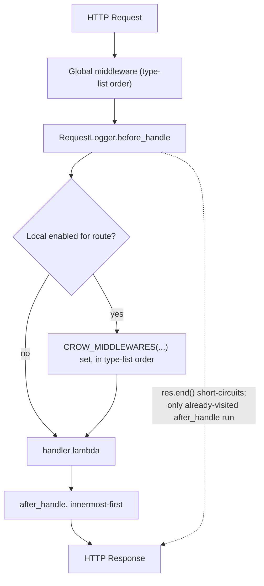

# Middleware & Plugins: The Request/Response Interceptor Chain

**Doc Source**: [guides/middleware](https://crowcpp.org/master/guides/middleware/) · [guides/included-middleware](https://crowcpp.org/master/guides/included-middleware/) · [examples/example_middleware.cpp](https://github.com/CrowCpp/Crow/blob/master/examples/example_middleware.cpp) · [examples/middlewares/example_cors.cpp](https://github.com/CrowCpp/Crow/blob/master/examples/middlewares/example_cors.cpp) · [examples/example_compression.cpp](https://github.com/CrowCpp/Crow/blob/master/examples/example_compression.cpp)

## The Core Concept: Why This Example Exists

**The Problem:** Cross-cutting concerns — logging every request, checking an auth token before admin endpoints, adding `Access-Control-Allow-Origin`, compressing the body — don't belong inside business handlers. Duplicating that code in every route destroys maintainability.

**The Solution:** Crow models middleware as **structs baked into the App's type** and invoked around every handler. The mechanism is unusual but principled:
1. **Middleware as type parameters** — `crow::App<FirstMW, SecondMW, ThirdMW>`. The order in the template list *is* the execution order.
2. **Three required members** per middleware — a `context` struct (request-local storage), `before_handle`, and `after_handle`.
3. **Local middleware** — extend `crow::ILocalMiddleware` to opt-in *per route or per blueprint* instead of globally.
4. **Bundled plugins** — `CORSHandler`, `SessionMiddleware`, `CookieParser`, and a compression layer ship in the box.

> **Warning (from the docs):** "As soon as `response.end()` is called, no other handlers and middleware is run, except for `after_handle` of already visited middleware." Calling `res.end()` inside `before_handle` is the canonical way to short-circuit (e.g., reject an unauthorized request).

## Practical Walkthrough: Code Breakdown

### The Anatomy of a Middleware

The official guide gives the minimal guard:

```cpp
struct AdminAreaGuard
{
    struct context
    {};

    void before_handle(crow::request& req, crow::response& res, context& ctx)
    {
        if (req.remote_ip_address != ADMIN_IP)
        {
            res.code = 403;
            res.end();
        }
    }

    void after_handle(crow::request& req, crow::response& res, context& ctx)
    {}
};
```
*(source: [guides/middleware — Example](https://crowcpp.org/master/guides/middleware/#example))*

Every middleware is a struct with exactly these three members. `context` is **per-request** scratch space — allocate whatever fields you want, Crow constructs one fresh `context` per request and threads it into both hooks.

### Two `before_handle` Signatures

```cpp
// (1) Access only this middleware's context
void before_handle(request& req, response& res, context& ctx)

// (2) Access every middleware's context
template <typename AllContext>
void before_handle(request& req, response& res, context& ctx, AllContext& all_ctx)
{
    auto other_ctx = all_ctx.template get<OtherMiddleware>();
}
```
*(source: [guides/middleware](https://crowcpp.org/master/guides/middleware/))*

The templated overload is how a later middleware reads state an earlier one wrote — e.g., an auth middleware stores the decoded user, a logging middleware reads it.

### Real Example: Logger + Local Guards + Context Passing

The full `example_middleware.cpp` exercises the whole surface — a global logger, two **local** guards, and one middleware that writes into its `context` for the handler to read:

```cpp
#include "crow.h"

struct RequestLogger
{
    struct context
    {};

    // This method is run before handling the request
    void before_handle(crow::request& req, crow::response& /*res*/, context& /*ctx*/)
    {
        CROW_LOG_INFO << "Request to:" + req.url;
    }

    // This method is run after handling the request
    void after_handle(crow::request& /*req*/, crow::response& /*res*/, context& /*ctx*/)
    {}
};

// Per handler middleware has to extend ILocalMiddleware
// It is called only if enabled
struct SecretContentGuard : crow::ILocalMiddleware
{
    struct context
    {};

    void before_handle(crow::request& /*req*/, crow::response& res, context& /*ctx*/)
    {
        // A request can be aborted prematurely
        res.write("SECRET!");
        res.code = 403;
        res.end();
    }

    void after_handle(crow::request& /*req*/, crow::response& /*res*/, context& /*ctx*/)
    {}
};

struct RequestAppend : crow::ILocalMiddleware
{
    // Values from this context can be accessed from handlers
    struct context
    {
        std::string message;
    };

    void before_handle(crow::request& /*req*/, crow::response& /*res*/, context& /*ctx*/)
    {}

    void after_handle(crow::request& /*req*/, crow::response& res, context& ctx)
    {
        // The response can be modified
        res.write(" + (" + ctx.message + ")");
    }
};

int main()
{
    // ALL middleware (including per handler) is listed
    crow::App<RequestLogger, SecretContentGuard, RequestAppend> app;

    CROW_ROUTE(app, "/")
    ([]() {
        return "Hello, world!";
    });

    CROW_ROUTE(app, "/secret")
      // Enable SecretContentGuard for this handler
      .CROW_MIDDLEWARES(app, SecretContentGuard)([]() {
          return "";
      });

    crow::Blueprint bp("bp", "c", "c");
    // Register middleware on all routes on a specific blueprint
    // This also applies to sub blueprints
    bp.CROW_MIDDLEWARES(app, RequestAppend);

    CROW_BP_ROUTE(bp, "/")
    ([&](const crow::request& req) {
        // Get RequestAppends context
        auto& ctx = app.get_context<RequestAppend>(req);
        ctx.message = "World";
        return "Hello:";
    });
    app.register_blueprint(bp);

    app.port(18080).run();
    return 0;
}
```
*(source: [`examples/example_middleware.cpp`](https://github.com/CrowCpp/Crow/blob/master/examples/example_middleware.cpp))*

Reading this top-to-bottom:
1. **`RequestLogger`** is *global* (no `ILocalMiddleware` base) → runs on every request, logging `req.url`.
2. **`SecretContentGuard`** extends `crow::ILocalMiddleware` → runs **only** where `.CROW_MIDDLEWARES(app, SecretContentGuard)` is attached. It short-circuits with `res.end()` after writing `SECRET!`.
3. **`RequestAppend`** also local; its `after_handle` *modifies the response* by appending to `res`. The handler reaches the middleware's `context` via `app.get_context<RequestAppend>(req)` and writes `ctx.message = "World"` *before* `after_handle` reads it.
4. **Blueprint-scoped** middleware — `bp.CROW_MIDDLEWARES(app, RequestAppend)` enables `RequestAppend` for every route (and sub-blueprint) under `bp`.

> **Ordering (from the docs):** "Local and global middleware are called separately. First all global middleware is run, then all enabled local middleware for the current handler is run. In both cases middleware is called strongly in the order listed in the Crow application."

### Bundled Plugin: CORS

The CORS middleware is registered as a normal middleware type and then configured fluently. Real example:

```cpp
#include "crow.h"
#include "crow/middlewares/cors.h"

// Warning!
// If you want to use CORS with OPTIONS cache on browser requests,
// be sure to specify each headers you use, please do not use "*"
// else otherwise the browser will ignore you
// Example:
//    .headers("Origin", "Content-Type", "Accept", *Your-Headers*)
//    .max_age(5);

int main()
{
    // Enable CORS
    crow::App<crow::CORSHandler> app;

    // Customize CORS
    auto& cors = app.get_middleware<crow::CORSHandler>();

    // clang-format off
    cors
      .global()
        .headers("X-Custom-Header", "Upgrade-Insecure-Requests")
        .methods("POST"_method, "GET"_method)
      .prefix("/cors")
        .origin("example.com")
      .prefix("/nocors")
        .ignore();
    // clang-format on

    CROW_ROUTE(app, "/")
    ([]() {
        return "Check Access-Control-Allow-Methods header";
    });

    CROW_ROUTE(app, "/cors")
    ([]() {
        return "Check Access-Control-Allow-Origin header";
    });

    app.port(18080).run();

    return 0;
}
```
*(source: [`examples/middlewares/example_cors.cpp`](https://github.com/CrowCpp/Crow/blob/master/examples/middlewares/example_cors.cpp))*

The fluent `.global()/.prefix(...)/.ignore()` builder lets you layer policy: a global rule, per-prefix overrides, and an explicit opt-out for `/nocors`. The same `CORSHandler` exposes `.blueprint(bp)` for blueprint-scoped rules.

### Bundled Plugin: Compression

Compression is configured at the **App level** via the builder, not as a middleware type:

```cpp
#include "crow.h"
#include "crow/compression.h"

int main()
{
    crow::SimpleApp app;
    //crow::App<crow::CompressionGzip> app;

    CROW_ROUTE(app, "/hello")
    ([&](const crow::request&, crow::response& res) {
        res.compressed = false;

        res.body = "Hello World! This is uncompressed!";
        res.end();
    });

    CROW_ROUTE(app, "/hello_compressed")
    ([]() {
        return "Hello World! This is compressed by default!";
    });


    app.port(18080)
      .use_compression(crow::compression::algorithm::DEFLATE)
      //.use_compression(crow::compression::algorithm::GZIP)
      .loglevel(crow::LogLevel::Debug)
      .multithreaded()
      .run();
}
```
*(source: [`examples/example_compression.cpp`](https://github.com/CrowCpp/Crow/blob/master/examples/example_compression.cpp))*

- `.use_compression(crow::compression::algorithm::DEFLATE|GZIP)` enables automatic compression of eligible responses.
- Per-response opt-out: set `res.compressed = false;` (as `/hello` does above).
- The commented alternative `crow::App<crow::CompressionGzip>` shows the middleware-type form.

## Mental Model: Thinking in Crow Middleware

**The Type List as a Compile-Time Onion:** Where axum/Hono/FastAPI build middleware as runtime layers stacked at `.layer()` time, Crow bakes the stack into the **App's template parameters**. `crow::App<A, B, C>` is literally an onion whose layers are named in the type — you cannot add a middleware at runtime, and the compiler errors if any layer is missing the required `context`/`before_handle`/`after_handle` trio. Global layers always wrap the whole request; local layers (those deriving `ILocalMiddleware`) are opt-in patches you sprinkle with `.CROW_MIDDLEWARES(...)`.



**Why It's Designed This Way:** Putting middleware in the type list means the per-request invocation is a **compile-time unrolled loop** — no virtual dispatch, no vector of `std::function`. The cost is rigidity: adding a middleware is a recompile and a signature change (`crow::App<>` → `crow::App<NewMW>`). Crow trades runtime flexibility for zero-overhead dispatch, which fits its "fast microframework" positioning. The `context` struct per middleware is the escape hatch for sharing data without global state — each request gets its own `context` instances, so you avoid the thread-safety headaches of shared mutable globals.

**Pitfalls:**
- **`res.end()` is final.** Calling it in `before_handle` skips the handler *and all later middleware*, but the `after_handle` of already-visited middleware still runs. If your guard writes a partial body then `end()`s, a downstream `after_handle` that *also* writes will append to a closed response — usually harmless, sometimes surprising.
- **Recompile to change the stack.** Unlike FastAPI's `add_middleware()`, Crow's middleware list is a compile-time constant. Plan your `App<...>` alias up front.
- **`get_context<MW>(req)` requires the MW be enabled for that route.** Calling it for a local middleware that wasn't attached is a bug.
- **CORS `"*"` headers + OPTIONS caching** — the example comment is explicit: when you cache preflight, browsers ignore `*`; enumerate the headers you actually use.
- **Compression + the handler API**: if a handler takes `crow::response&` and calls `res.end()` manually, set `res.compressed` explicitly or you may double-encode / miss compression.

**Further Exploration:**
- Write a timing middleware whose `context` stores a `std::chrono::steady_clock::time_point` set in `before_handle`, and whose `after_handle` logs the elapsed microseconds (combine with [`../CHRONO.md`](../CHRONO.md)).
- Build an auth middleware that stores a decoded JWT user in its `context`, then read it from a handler via `app.get_context<AuthMW>(req)`.
- Attach `CORSHandler` globally and override per-blueprint for `/api/public` vs `/api/admin`.

## 🔗 Cross-References

**Curriculum (this C++ tree):**
- [`../STD_THREAD.md`](../STD_THREAD.md) — the `context`-per-request design exists precisely because Crow runs `.multithreaded()`; understand why per-request state beats shared mutable globals.
- [`../MUTEX_LOCK_GUARD.md`](../MUTEX_LOCK_GUARD.md) — when middleware touches shared state (e.g., a rate-limit counter), this is the synchronization primitive you reach for.
- [`../TYPE_TRAITS.md`](../TYPE_TRAITS.md) — `ILocalMiddleware` and the `all_ctx.template get<MW>()` machinery are template-metaprogramming under the hood.

**Cross-language siblings:**
- [`../../rust/axum/05-middleware-from-functions.md`](../../rust/axum/05-middleware-from-functions.md) — axum's `from_fn` layers are the runtime-composable counterpart to Crow's type-list layers.
- [`../../ts/hono/04-middleware.md`](../../ts/hono/04-middleware.md) — Hono's `app.use('*', logger)` is the dynamic analog; compare the ergonomics.
- [`../../python/FASTAPI_MIDDLEWARE_LIFESPAN.md`](../../python/FASTAPI_MIDDLEWARE_LIFESPAN.md) — FastAPI's ASGI middleware + lifespan events; note how Crow's `before/after_handle` maps onto FastAPI's `dispatch`.

**Next:** [05-websockets.md](./05-websockets.md) — persistent bidirectional connections.
