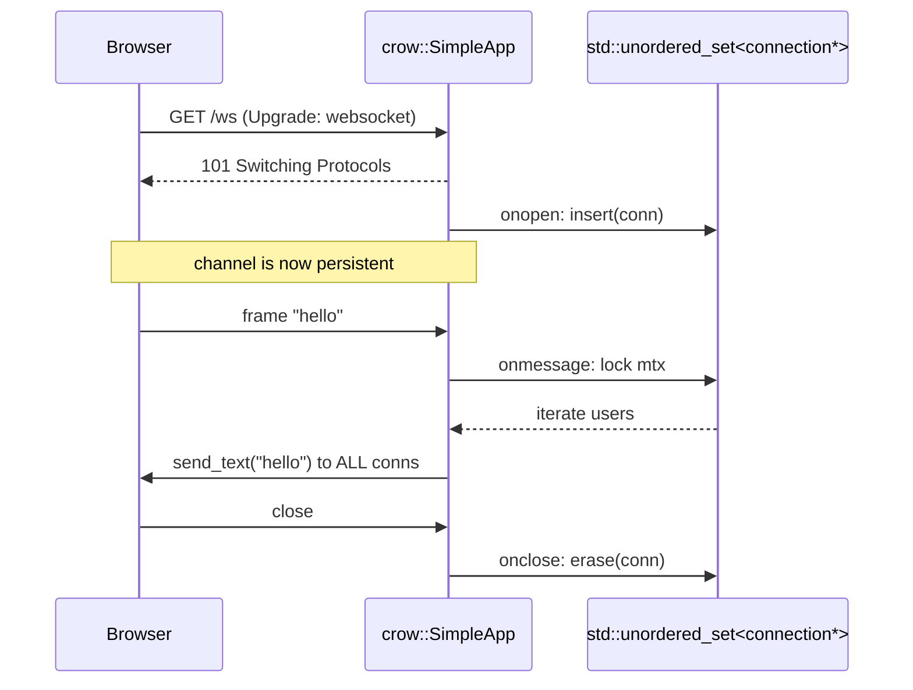

# WebSockets: Realtime Bidirectional Communication

**Doc Source**: [guides/websockets](https://crowcpp.org/master/guides/websockets/) · [examples/websocket/example_ws.cpp](https://github.com/CrowCpp/Crow/blob/master/examples/websocket/example_ws.cpp)

## The Core Concept: Why This Example Exists

**The Problem:** HTTP is fundamentally request/response: the client asks, the server answers, the connection closes. That model breaks for live data — chat, collaborative editing, dashboards, market feeds — where the server must *push* frames to the client without being asked, and where opening a fresh TCP/TLS connection per message is prohibitively expensive.

**The Solution:** WebSockets upgrade a single HTTP connection into a persistent, bidirectional, framed channel. Crow exposes this through a dedicated `CROW_WEBSOCKET_ROUTE` macro and a chainable set of event hooks (`onaccept`, `onopen`, `onmessage`, `onerror`, `onclose`). Each live connection is represented by a `crow::websocket::connection&` you can store, broadcast to, and write to at any time — independent of the request that created it.

> (from the docs) "Websockets are a way of connecting a client and a server without the request response nature of HTTP."

## Practical Walkthrough: Code Breakdown

### The Event Hook Chain

A WebSocket route is *not* a handler — it's a bundle of event callbacks. The docs enumerate them in execution order:

```cpp
CROW_WEBSOCKET_ROUTE(app, "/ws")
    .onopen([&](crow::websocket::connection& conn){
            do_something();
            })
    .onclose([&](crow::websocket::connection& conn, const std::string& reason, uint16_t){
            do_something();
            })
    .onmessage([&](crow::websocket::connection& /*conn*/, const std::string& data, bool is_binary){
                if (is_binary)
                    do_something(data);
                else
                    do_something_else(data);
            });
```
*(source: [guides/websockets — Routes](https://crowcpp.org/master/guides/websockets/#routes))*

The full hook set, in lifecycle order:

| Hook | Signature | Fires when |
|---|---|---|
| `onaccept` | `(const crow::request& req, void** userdata) -> bool` | Before the handshake completes; return `false` to reject the connection outright. |
| `onopen` | `(crow::websocket::connection& conn)` | The upgrade succeeded; the channel is live. |
| `onmessage` | `(connection& conn, const std::string& data, bool is_binary)` | A frame arrived. `is_binary` distinguishes text vs binary frames. |
| `onerror` | `(connection& conn, const std::string& error_message)` | A protocol/transport error occurred. |
| `onclose` | `(connection& conn, const std::string& reason, uint16_t status_code)` | The connection closed (cleanly or not). |

> **Note (from the docs):** "`onaccept` must return a boolean. In case `false` is returned, the connection is shut down, deleted, and no further communication is done."

The hooks are **chainable** in any order; you only define the ones you need.

### Real Example: A Broadcast Chat Server

The canonical Crow WebSocket example is a multi-user broadcaster — every message from any client is relayed to all connected clients. The whole thing is ~30 lines because the framework handles the framing:

```cpp
#include "crow.h"
#include <unordered_set>
#include <mutex>


int main()
{
    crow::SimpleApp app;

    std::mutex mtx;
    std::unordered_set<crow::websocket::connection*> users;

    CROW_WEBSOCKET_ROUTE(app, "/ws")
      .onopen([&](crow::websocket::connection& conn) {
          CROW_LOG_INFO << "new websocket connection from " << conn.get_remote_ip();
          std::lock_guard<std::mutex> _(mtx);
          users.insert(&conn);
      })
      .onclose([&](crow::websocket::connection& conn, const std::string& reason, uint16_t) {
          CROW_LOG_INFO << "websocket connection closed: " << reason;
          std::lock_guard<std::mutex> _(mtx);
          users.erase(&conn);
      })
      .onmessage([&](crow::websocket::connection& /*conn*/, const std::string& data, bool is_binary) {
          std::lock_guard<std::mutex> _(mtx);
          for (auto u : users)
              if (is_binary)
                  u->send_binary(data);
              else
                  u->send_text(data);
      });

    CROW_ROUTE(app, "/")
    ([] {
        char name[256];
        gethostname(name, 256);
        crow::mustache::context x;
        x["servername"] = name;

        auto page = crow::mustache::load("ws.html");
        return page.render(x);
    });

    app.port(40080)
      .multithreaded()
      .run();
}
```
*(source: [`examples/websocket/example_ws.cpp`](https://github.com/CrowCpp/Crow/blob/master/examples/websocket/example_ws.cpp))*

This single file demonstrates every pattern you need:

1. **Connection registry** — `std::unordered_set<crow::websocket::connection*> users`. `onopen` inserts the pointer; `onclose` erases it. The pointers are stable for the connection's lifetime.
2. **Mutex-guarded shared state** — because `.multithreaded()` means `onmessage` for different clients can fire concurrently. The `std::lock_guard<std::mutex>` wraps every access to `users`.
3. **Broadcast** — `onmessage` iterates the whole set and calls `u->send_binary(data)` or `u->send_text(data)` depending on the inbound frame type. **You can write to any connection at any time**, not just the one that triggered the callback — that's the whole point of "server push."
4. **A sibling HTTP route** serves the HTML page (`ws.html`) that contains the browser-side `new WebSocket("/ws")` client. The HTTP and WS routes coexist in one app on one port — the upgrade happens in-band.

### Connection API

Each `crow::websocket::connection` exposes:
- `send_text(std::string)` / `send_binary(std::string)` — enqueue an outbound frame.
- `get_remote_ip()` — peer address (used in the `onopen` log above).
- `close(...)` — initiate a clean shutdown.

You call these from **any thread**, including a background broadcast loop unrelated to a specific request.

### Sizing & Subprotocols

> **Max payload (master):** "adjusted either globally by using `app.websocket_max_payload(<value in bytes>)` or per route by using `CROW_WEBSOCKET_ROUTE(app, "/url").max_payload(<value in bytes>)`. … By default, this limit is disabled. To disable the global setting in specific routes, you only need to call `CROW_WEBSOCKET_ROUTE(app, "/url").max_payload(UINT64_MAX)`."

> **Subprotocols (master):** `CROW_WEBSOCKET_ROUTE(app, "/url").subprotocols(<values>)` — "If specified, the first match with the client's requested subprotocols will be returned in the `Sec-WebSocket-Protocol` header of the handshake response. Otherwise, the connection will be closed."

### Protocol-Conformance Macro

> **Warning (from the docs):** "By default, Crow allows clients to send unmasked websocket messages. This is useful for debugging, but goes against the protocol specifications. Production Crow applications should enforce the protocol by adding `#define CROW_ENFORCE_WS_SPEC` to their source code."

Add that `#define` *before* `#include "crow.h"` when shipping to production.

## Mental Model: Thinking in Crow WebSockets

**The Connection Set as a Pub/Sub Topic:** The single most important mental shift from HTTP handlers: **a WebSocket connection is an object you own a pointer to**, alive for minutes or hours, addressable from any thread. Where an HTTP handler is a pure function (request in → response out, then forget), a WebSocket handler builds and mutates **long-lived shared state** — typically a container of live connections. The pattern is invariably: `onopen` adds to the set, `onclose` removes from the set, `onmessage` writes to the set. That set *is* your pub/sub topic; "broadcast" is just "for each connection, send."



**Why It's Designed This Way:** Crow leans on the same Asio core that powers its HTTP server, so the WebSocket upgrade is **in-band on the same port** — no second listener, no separate process. The `connection&` abstraction lets you treat the channel as just another addressable object, which is exactly what you need for fan-out. The cost is that **concurrency is now your problem**: `onopen`/`onmessage`/`onclose` can all run on different worker threads, so any shared registry *must* be mutex-guarded (as the example shows). This is the C++-honest trade-off — no actor-model isolation, no event-loop serialization guarantee, just raw shared memory behind a lock.

**Pitfalls:**
- **Race on the connection set** — every read/write of `users` (or your equivalent) needs the lock. The example guards all three hooks; forgetting `onclose`'s guard corrupts the set if a close races with a broadcast.
- **Sending after `onclose`** — the pointer in the set is valid until `onclose` fires; after that, dereferencing it is UB. Erase in `onclose` *before* any background thread could use a stale pointer.
- **Unmasked frames in prod** — without `#define CROW_ENFORCE_WS_SPEC`, malformed clients work "by accident"; enable the macro before production.
- **No backpressure by default** — `send_text`/`send_binary` enqueue; a slow client can accumulate unbounded outbound buffers. Cap with `.max_payload()` and/or track per-connection queue depth yourself.
- **The HTTP page serving the WS client must be served too** — don't forget the sibling `CROW_ROUTE(app, "/")` that hands the browser the HTML/JS, or your client has nothing to connect from.

**Further Exploration:**
- Add per-room routing: `std::unordered_map<std::string, std::unordered_set<connection*>>` keyed by a room id parsed from `req.url_params` in `onopen` (store it via the `void** userdata`).
- Build a market-tick broadcaster: a background `std::thread` wakes every second, locks the set, and pushes a JSON frame to every connection (combine with [03-json.md](./03-json.md) for the payload).
- Use `.subprotocols(...)` to negotiate a custom binary protocol and frame `onmessage` on `is_binary`.

## 🔗 Cross-References

**Curriculum (this C++ tree):**
- [`../MUTEX_LOCK_GUARD.md`](../MUTEX_LOCK_GUARD.md) — non-negotiable for the shared connection registry; the example's `std::lock_guard<std::mutex>` is the canonical pattern.
- [`../CONDITION_VARIABLES.md`](../CONDITION_VARIABLES.md) — for push-from-background-thread designs (e.g., notify a broadcaster thread when a new connection arrives).
- [`../STD_THREAD.md`](../STD_THREAD.md) — `.multithreaded()` runs WS hooks across a pool; understand the memory-ordering implications.

**Cross-language siblings:**
- [`../../rust/axum/07-websockets-and-real-time-communication.md`](../../rust/axum/07-websockets-and-real-time-communication.md) — axum's `WebSocketUpgrade` extractor is the typed sibling; compare the channel/handle split to Crow's raw `connection&`.
- [`../../ts/hono/07-streaming.md`](../../ts/hono/07-streaming.md) — Hono/Web standard `WebSocket`/`WebSocketPair` on Workers.
- [`../../python/FASTAPI_ASYNC.md`](../../python/FASTAPI_ASYNC.md) — FastAPI/Starlette `WebSocket` endpoints with `await ws.receive_text()` / `await ws.send_json()`.

**Next:** [06-testing.md](./06-testing.md) — driving routes and WS handlers from in-process tests.
