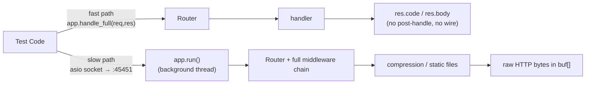

# Testing Crow Apps

**Doc Source**: [guides/testing](https://crowcpp.org/master/guides/testing/) · [tests/](https://github.com/CrowCpp/Crow/tree/master/tests) (Crow's own Catch2 suite)

## The Core Concept: Why This Example Exists

**The Problem:** Spinning up a real TCP socket, firing real HTTP bytes at it, and parsing the response is slow, brittle, and hides the framework's behavior behind networking noise. You want to assert "given request X, route Y produces response Z" *without* touching the network — both for speed (thousands of unit tests per second) and for isolation (a failing test means your handler is wrong, not that port 45451 was busy).

**The Solution:** Crow exposes an in-process entry point — `app.handle(req, res)` (and the fuller `app.handle_full`) — that walks the router and runs the handler against a `crow::request`/`crow::response` you construct by hand. The docs call this **"The handler method"** and contrast it with **"The client method,"** a real Asio socket client for when you need post-handle side effects (compression, static-file serving). Crow's own test suite uses both, layered on [Catch2](https://github.com/catchorg/Catch2).

> (from the docs) "Crow allows users to handle requests that may not come from the network. This is done by calling the `handle(req, res)` method and providing a request and response objects. Which causes crow to identify and run the appropriate handler, returning the resulting response."

## Practical Walkthrough: Code Breakdown

### Method 1 — The Handler Method (in-process, fast)

This is the workhorse. Build a `crow::request`, set its `.url`, call `app.handle_full(req, res)` (or `app.handle`), and inspect `res`:

```cpp
  CROW_ROUTE(app, "/place")
  ([] { return "hi"; });

  app.validate();  //Used to make sure all the route handlers are in order.

  {
    request req;
    response res;

    req.url = "/place";

    app.handle_full(req, res);
    // res will contain:
    // res.code == 200
    // res.body == "hi"
  }
```
*(source: [guides/testing — The handler method](https://crowcpp.org/master/guides/testing/))*

The recipe, step by step:
1. **Define routes** exactly as in production — no test-only registration.
2. **`app.validate();`** — sanity-checks that all route handlers are wired correctly (parameter counts match URL templates, etc.). Call it once after routes are declared; it catches the "Handler type is mismatched with URL paramters" class of errors *before* a request ever arrives.
3. **Construct `request`/`response`** as stack locals. Set `req.url` to the path under test (include query string and any `<int>` segments). Populate `req.body`, `req.headers`, `req.method` as needed.
4. **`app.handle_full(req, res);`** dispatches through the router and runs the handler synchronously, writing into `res`.
5. **Assert** on `res.code` and `res.body`.

> **Note (from the docs):** "This method is the simpler of the two and is usually all you really need to test your routes."

> **Warning:** "This method does not send any data, nor does it run any post handle code, so things like static file serving (as far as sending the actual data) or compression cannot be tested using this method."

That limitation is the motivation for Method 2.

### What Goes Into a `crow::request`

To test POST/JSON/param routes via the handler method, populate the request manually:

| Field | Purpose | Example |
|---|---|---|
| `req.url` | Path + query | `"/add_json"` or `"/items?foo=1"` |
| `req.method` | HTTP verb | `crow::HTTPMethod::POST` |
| `req.body` | Raw body bytes | `R"({"a":1,"b":2})"` |
| `req.headers` | Header map | `req.add_header("Content-Type", "application/json")` |
| `req.url_params` | Parsed lazily from `url` | accessed via `.get("foo")` in the handler |

So a full JSON-POST unit test looks like:

```cpp
CROW_ROUTE(app, "/add_json")
  .methods("POST"_method)([](const crow::request& req) {
      auto x = crow::json::load(req.body);
      if (!x) return crow::response(400);
      return crow::response{std::to_string(x["a"].i() + x["b"].i())};
  });

app.validate();

{
    crow::request req;
    crow::response res;
    req.url = "/add_json";
    req.method = crow::HTTPMethod::POST;
    req.body  = R"({"a":1,"b":2})";
    app.handle_full(req, res);
    CHECK(res.code == 200);
    CHECK(res.body == "3");
}
```

### Method 2 — The Client Method (real socket, full pipeline)

When you need post-handle behavior (compression, static files, the full `after_handle` chain including middleware that touches the wire), launch the app on a real port and talk to it over a loopback Asio socket:

```cpp
  static char buf[2048];
  SimpleApp app;
  CROW_ROUTE(app, "/")([] { return "A"; });

  auto _ = async(launch::async,[&] { app1.bindaddr("127.0.0.1").port(45451).run(); });
  app.wait_for_server_start();

  std::string sendmsg = "GET /\r\nContent-Length:3\r\nX-HeaderTest: 123\r\n\r\nA=B\r\n";
  asio::io_service is;
  {
    asio::ip::tcp::socket c(is);
    c.connect(asio::ip::tcp::endpoint(asio::ip::address::from_string("127.0.0.1"), 45451));

    c.send(asio::buffer(sendmsg));

    size_t recved = c.receive(asio::buffer(buf, 2048));
    CHECK('A' == buf[recved - 1]); //This is specific to catch2 testing library, but it should give a general idea of how to read the response.
  }

  app.stop(); //THIS MUST RUN
```
*(source: [guides/testing — The client method](https://crowcpp.org/master/guides/testing/))*

The structure:
1. **`std::async(launch::async, ...)`** runs `app...run()` on a background thread (it blocks).
2. **`app.wait_for_server_start()`** blocks the test thread until the listener is bound — critical to avoid a race where the client connects before the port is open.
3. **Format the raw HTTP request** as a string. The docs spell out the wire format:
   ```
   METHOD /
   Content-Length:123
   header1:value1
   header2:value2

   BODY
   ```
4. **Open an Asio TCP socket**, connect to `127.0.0.1:45451`, `send` the buffer, `receive` the response into `buf`, then assert on the bytes.
5. **`app.stop()` — THIS MUST RUN.**

> **Warning (from the docs):** "Be absolutely sure that the line `app.stop()` runs, whether the test fails or succeeds. Not running it WILL CAUSE OTHER TESTS TO FAIL AND THE TEST TO HANG UNTIL THE PROCESS IS TERMINATED."

Wrap it in a scope-guard or RAII type so an exception/assertion still triggers `stop()`.

### Picking a Test Framework

Crow's own suite (under [`tests/`](https://github.com/CrowCpp/Crow/tree/master/tests)) uses [Catch2](https://github.com/catchorg/Catch2), whose `TEST_CASE`/`SECTION`/`CHECK`/`REQUIRE` macros are what you see in the docs snippets. But `app.handle_full` is framework-agnostic — it works equally well with [GoogleTest](https://google.github.io/googletest/) (`EXPECT_EQ(res.code, 200)`) or [doctest](https://github.com/doctest/doctest). Pick whichever your build already links.

### Testing WebSockets

WebSocket routes have no in-process shortcut equivalent to `handle_full` — they require the upgrade handshake. The pragmatic approach (mirrored in Crow's own `example_ws.cpp` + `ws.html`) is: spin the app up on a port with Method 2's pattern, then use a WebSocket client library (e.g. [`websocketpp`](https://github.com/zaphoyd/websocketpp) or Boost.Beast) to connect, exchange frames, and assert on broadcasts. For pure logic, factor the broadcast/registry code *out* of the `onmessage` lambda into a free function you can unit-test directly (e.g. `void broadcast(const std::string& msg, std::unordered_set<connection*>& users, std::mutex& m)`).

## Mental Model: Thinking in Crow Testing

**Two Gears, Deliberately Priced Differently:** Think of testing as a two-speed gearbox. **First gear — `handle_full`** is fast, synchronous, in-memory: the router is real, the handler is real, but the network is bypassed and `after_handle` post-side-effects (compression bytes, static-file streaming) are skipped. Use it for 95% of cases: route matching, parameter parsing, JSON bodies, status codes, handler logic. **Second gear — the Asio socket client** is slow (a real TCP round-trip per test) but exercises the *entire* pipeline including middleware `after_handle` that writes to the wire and the compression layer. Shift into second gear only when first gear can't see the thing you're asserting.



**Why It's Designed This Way:** Exposing `handle_full` as a public method is the cheapest possible testability win — it costs the framework nothing (the router already needs an internal dispatch entry point) and turns every handler into a plain function `(request, response) → void` you can call. The Asio client exists as an escape hatch precisely *because* `handle_full` deliberately skips the post-handle I/O that would need a real socket to mean anything. Together they cover the spectrum without forcing you into a heavyweight test harness; the only framework-specific dependency is Crow itself plus (optionally) Catch2.

**Pitfalls:**
- **Forget `app.validate()`** and a malformed route table passes silently until a request actually arrives. Call it after declaring all routes in your test setup.
- **Stale app across tests** — `SimpleApp` holds router state; either construct a fresh app per test or `app.stop()` and recreate. Shared apps cause cross-test bleed.
- **`app.stop()` is mandatory** in Method 2. A thrown assertion skips it → the next test's `wait_for_server_start()` hangs. Use RAII/scope-guard.
- **`buf[2048]` overflow** — the example uses a fixed buffer; large responses will truncate. Size your buffer or loop on `receive`.
- **`handle_full` skips `after_handle` I/O** — don't assert on compressed bytes or served files there; switch to Method 2.
- **Header case** — HTTP headers are case-insensitive on the wire but `req.add_header` is literal; match the casing your handler reads.
- **Query-string testing** — `handle_full` parses `req.url_params` lazily from `req.url`; include the `?...` in the URL you set, don't populate `url_params` by hand.

**Further Exploration:**
- Build a `CrowClient` RAII helper that owns a `SimpleApp`, calls `validate()` in its constructor and `stop()` in its destructor, and exposes `get(url)`/`post(url, body)` returning a `response` via `handle_full` — your test files shrink to two lines per case.
- Add a Method-2 fixture for compression tests, asserting that the response carries `Content-Encoding: deflate` when the client sends `Accept-Encoding`.
- Property-test a JSON round-trip: generate random `wvalue`s, serialize, `load`, and assert structural equality (combine with [03-json.md](./03-json.md)).

## 🔗 Cross-References

**Curriculum (this C++ tree):**
- [`../TESTING.md`](../TESTING.md) — general C++ testing strategy (Catch2 / GoogleTest / doctest setup, link flags).
- [`../SANITIZERS_STATIC_ANALYSIS.md`](../SANITIZERS_STATIC_ANALYSIS.md) — run the Method-2 socket tests under AddressSanitizer to catch the `app.stop()`-forgotten hangs and buffer overruns.
- [`../STD_THREAD.md`](../STD_THREAD.md) — Method 2 is `std::async` + a background thread; understand the synchronization contract with `wait_for_server_start()`.

**Cross-language siblings:**
- [`../../rust/axum/06-dependency-injection-and-state.md`](../../rust/axum/06-dependency-injection-and-state.md) — axum handlers are also "just functions," testable via `oneshot` requests against the `Router`; compare the philosophy.
- [`../../ts/hono/08-testing.md`](../../ts/hono/08-testing.md) — Hono's `app.request('/path')` in-process helper is the direct analog of Crow's `handle_full`.
- [`../../python/FASTAPI_TESTING.md`](../../python/FASTAPI_TESTING.md) — FastAPI's `TestClient` (over Starlette) wraps the ASGI app in-process; same two-gear idea (sync `TestClient` vs async `httpx.AsyncClient`).

**Back to start:** [01-hello-world.md](./01-hello-world.md) — the full Crow walkthrough loop.
