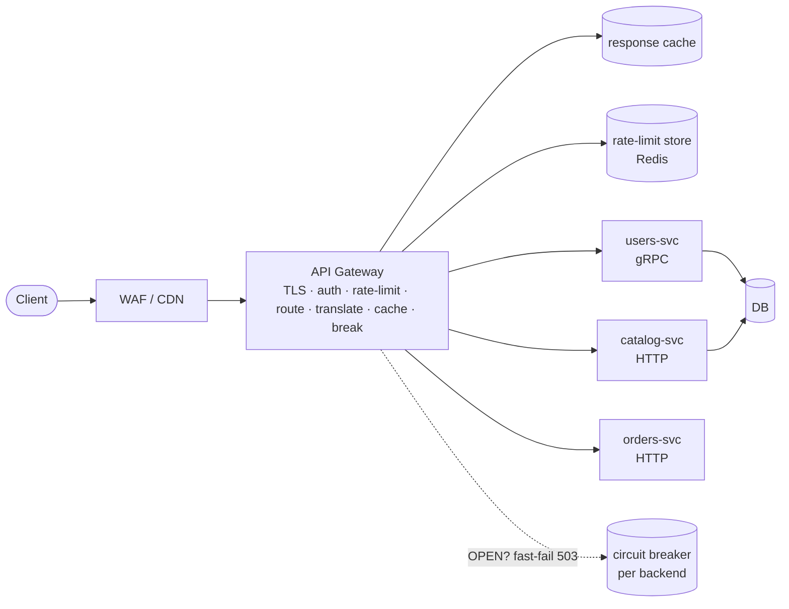
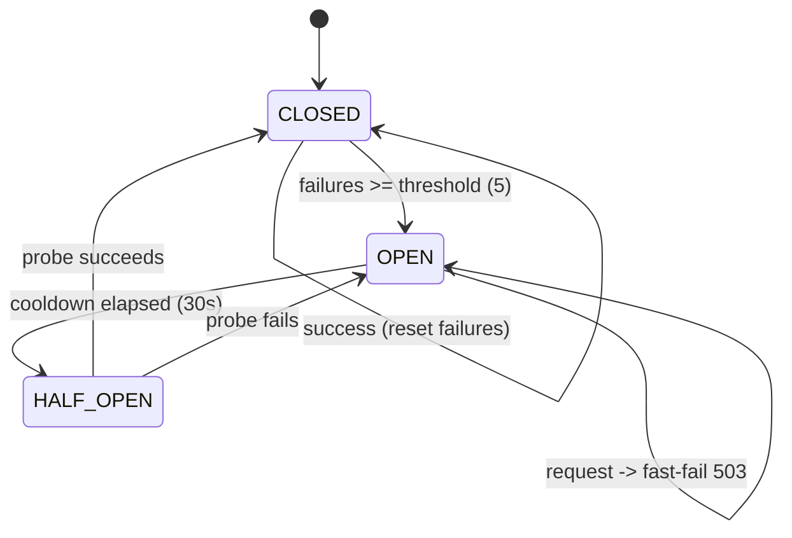

# API Gateway — A Visual, Worked-Example Guide

> **Companion code:** [`api_gateway.py`](https://github.com/quanhua92/tutorials/blob/main/csfundamentals/api_gateway.py).
> **Live demo:** [`api_gateway.html`](./api_gateway.html)

---

## 0. TL;DR — the one idea

> **The analogy:** An API gateway is the **reception desk of a large office
> building**. Every visitor (request) walks through the same front door. The
> receptionist checks their ID (**auth**), notes how many times they've visited
> today and turns away anyone who's been too often (**rate limit**), logs the
> visit (**observability**), then directs them to the correct floor by reading
> their destination off a directory board (**routing**). The visitor never sees
> the building's internal phone system — the receptionist translates "I'd like
> product 42" into an internal extension (**protocol translation**), and if a
> floor is on fire they hang a "do not send anyone to floor 3" sign until it's
> safe (**circuit breaker**). None of this is the visitors' job, and none of it
> is any single department's job — it is **cross-cutting infrastructure** owned
> once, at the front door.

A gateway centralizes the concerns that would otherwise be duplicated (and
drift) across every microservice:

| Concern | Without a gateway | With a gateway |
|---|---|---|
| **Auth** | each service validates JWTs (1ms/hop × N services) | validated **once**, claims injected as headers |
| **Rate limiting** | each service keeps its own counter (leaks quota) | one sliding-window counter per dimension |
| **Routing** | clients hardcode service URLs | path/host/header → service, declarative |
| **TLS** | every service manages certs | terminated **once** at the edge |
| **Observability** | ad-hoc logging per service | uniform access logs, metrics, trace headers |



This bundle simulates five pillars end-to-end in pure stdlib:

1. **Path-based request routing** — longest-prefix match to a backend service
2. **Middleware chain** — strip headers → auth → rate limit → logging → routing
3. **Protocol translation** — HTTP/REST ↔ gRPC (verbs, path params, body, codes)
4. **Response caching** — TTL cache with canonical hashed keys
5. **Circuit breaker** — CLOSED → OPEN → HALF_OPEN → CLOSED

---

## 1. How It Works

### 1.1 Path-based request routing

> **Idea:** The gateway holds a declarative **routing table** mapping path
> prefixes to backend services. On each request it does a **longest-prefix
> match** — the most specific rule wins, exactly like nginx/Envoy/Traefik
> `location` matching.

> From `api_gateway.py` Section 1:

```
ROUTING TABLE (sorted by specificity)
  prefix               service        host               auth  grpc
  /api/products/*      catalog-svc    10.0.2.10:8082     yes   no
  /api/orders/*        orders-svc     10.0.3.10:8083     yes   no
  /api/public/*        static-svc     10.0.9.10:8089     no    no
  /api/users/*         users-svc      10.0.1.10:8081     yes   yes
  /health              gateway-self   127.0.0.1:9000     no    no

RESOLUTION
  /api/users/123           -> users-svc (10.0.1.10:8081)
  /api/users/123/orders    -> users-svc (10.0.1.10:8081)   (nested still matches)
  /api/products/sku-77     -> catalog-svc (10.0.2.10:8082)
  /api/public/landing      -> static-svc (10.0.9.10:8089)
  /health                  -> gateway-self (127.0.0.1:9000)
  /api/unknown/x           -> 404 No matching route

longest-prefix wins (/api/users/* beats /api/*)? [check] OK
unmatched path returns None (-> 404)?                  [check] OK
```

Routes carry per-route policy: `auth_required`, `rate_limit_rpm`, `cache_ttl`,
and whether the backend speaks gRPC (drives translation). The whole table is
**versioned and testable** — a bad route is a config change, not a deploy.

---

### 1.2 Middleware chain (auth → rate limit → logging → routing)

> **Idea:** The gateway is a **pipeline**. Each request walks a fixed,
> ordered chain of middlewares. Each stage either **passes** the request along,
> **short-circuits** with an error response (401/404/429), or **skips** itself
> (e.g. public routes skip auth). The canonical order:

```
strip headers → auth → rate limit → logging → routing
```

> From `api_gateway.py` Section 2 — five scenarios traced through the chain:

**Request A — valid auth (with a header-injection attack):**
```
GET /api/users/123   Authorization: Bearer tok_alice   X-User-Id: hacker-injected
  [strip_headers] removed client ['X-User-Id']        <- attacker's header GONE
  [auth        ] verified user:alice                  <- gateway injects VERIFIED claims
  [rate_limit  ] key=acme:user:alice:users remaining=5 allow
  [logging     ] trace_id=trace_0001 emit access log
  [routing     ] -> users-svc (10.0.1.10:8081)
  -> 200  body={'user_id':'123','name':'user-123','tenant':'acme'}
```

**Request B — missing token short-circuits at auth:**
```
  [auth] missing/unknown token   -> 401 {'error':'unauthorized'}
  (chain never reaches rate_limit / routing)
```

**Request D — burst exceeds the limit, short-circuits at rate_limit:**
```
  burst of 8 from one user (limit=5):
  statuses = [200, 200, 200, 200, 200, 429, 429, 429]
  allowed=5  denied(429)=3
```

#### The #1 gateway security rule: strip client-injected internal headers

Before injecting verified claims, the gateway **must delete** any client-supplied
`X-User-Id`, `X-Tenant-Id`, `X-Roles` headers. If it forgets, an attacker sets
`X-User-Id: admin` and bypasses auth entirely. The simulation verifies this:

```
X-User-Id 'hacker-injected' stripped (not echoed)? [check] OK
```

The backend then sees the **verified** `tenant: acme` — never the attacker's
forgery. Downstream trusts the gateway via mTLS mesh or private VPC.

#### Where to validate JWTs

| Option | Cost | Used when |
|---|---|---|
| A. Every service validates | ~1ms/hop × N, inconsistent key rotation | never (redundant) |
| B. **Gateway validates once, propagates claims as headers** | 1 verify | **production standard** |
| C. Gateway validates + mints short-lived internal tokens | 1 verify + per-hop internal verify | zero-trust / cross-region |

This bundle models **Option B**: validate once, inject `X-User-Id`/`X-Tenant-Id`/`X-Roles`.

---

### 1.3 Protocol translation (HTTP/REST ↔ gRPC)

> **Idea:** Clients speak HTTP/JSON; backends speak gRPC/proto. The gateway
> translates in both directions using `google.api.http` annotations — a verb +
> path template maps to a fully-qualified RPC method, with path/query params and
> JSON body mapped onto proto fields. This is exactly what
> **grpc-gateway** and Envoy's **grpc_json_transcoder** do.

> From `api_gateway.py` Section 3:

```
GET     /api/users/123     -> users.UserService/GetUser        {user_id:"123"}
GET     /api/users         -> users.UserService/ListUsers      {page_size:"20", page_token:"abc"}
POST    /api/users         -> users.UserService/CreateUser     {name:"Dana", email:"dana@x.io"}
DELETE  /api/users/456     -> users.UserService/DeleteUser     {user_id:"456"}
GET     /api/products/sku-9-> catalog.ProductService/GetProduct{product_id:"sku-9"}

gRPC -> HTTP response translation:
  grpc code=0 (OK) -> HTTP 200     gRPC NOT_FOUND(5) -> HTTP 404   [check] OK
```

Note **gRPC has no 404** — a missing resource returns code 5 (`NOT_FOUND`), which
the gateway maps to HTTP 404. The full code map (3→400, 5→404, 6→409, 7→403,
13→500, 14→503) keeps REST semantics intact for clients that never see gRPC.

---

### 1.4 Response caching

> **Idea:** Idempotent GET responses are cached behind a **canonical hash key**
> of `method#path#query` with a TTL. The first request is a MISS (fetch + store);
> subsequent identical requests are HITs served from the gateway in microseconds.
> Mutating verbs (POST/PUT/DELETE) bypass the cache and invalidate related keys.

> From `api_gateway.py` Section 4:

```
WARM-UP SEQUENCE (4 identical GETs at t=FIXED_NOW):
  req #1  MISS  key=cec4d309f9ea93a7
  req #2  HIT   key=cec4d309f9ea93a7
  req #3  HIT   key=cec4d309f9ea93a7
  req #4  HIT   key=cec4d309f9ea93a7
  hits=3  misses=1

EXPIRY (same request at t=FIXED_NOW+TTL+1 -> MISS):
  MISS  key=cec4d309f9ea93a7  (entry expired, re-fetched)

QUERY VARIANCE:
  ?a=1&b=2  key=19b14f1fefcbea71
  ?b=2&a=1  key=19b14f1fefcbea71   (reordered -> IDENTICAL key)
  ?a=1      key=620be29df035984b   (different query -> different key)

summary: hits=3 misses=2 evictions=1 hit_rate=60.0%
```

The key is **canonicalized before hashing**: query params are sorted, so
`?a=1&b=2` and `?b=2&a=1` collapse to one entry. The gold value computed here
(`cec4d309f9ea93a7`) is recomputed by the live demo in pure JavaScript.

> The live demo (`api_gateway.html`) recomputes this exact cache key in pure
> JavaScript (hand-rolled SHA-256) and prints `[check: OK] JS == .py` — the hash
> is byte-for-byte identical to Python.

---

### 1.5 Circuit breaker

> **Idea:** When a downstream service starts failing, **stop hammering it**. The
> circuit breaker is a per-backend state machine that fast-fails requests (503)
> instead of queuing them against a dead backend, giving it room to recover.
> Pairs with bulkheads (per-backend pools) and retries (idempotent only, with
> exponential backoff + jitter).



> From `api_gateway.py` Section 5 — the full lifecycle, deterministic:

```
PHASE 1 — trip the breaker with a failure burst:
  failure #1..#4 -> CLOSED     failure #5 -> OPEN
OPEN after 5 consecutive failures? [check] OK

PHASE 2 — OPEN fast-fails (no backend call) until cooldown elapses:
  allow(t+5s)  -> False  (fast-fail 503, no backend hit)
OPEN rejects within cooldown? [check] OK

PHASE 3 — after cooldown, HALF_OPEN lets ONE probe through:
  allow(t+30s) -> True  state=HALF_OPEN     second probe blocked
half-open admits exactly one probe? [check] OK

PHASE 4 — probe SUCCEEDS -> back to CLOSED      [check] OK
PHASE 5 — probe FAILS   -> straight back to OPEN [check] OK
```

The key insight: **HALF_OPEN admits exactly one probe**. If the backend is still
sick, the probe fails and the breaker reopens instantly — no flood of retried
traffic onto a recovering service.

---

## 2. The Math

### Rate limit — sliding window counter (production default)

The simulation uses the **sliding window counter** algorithm. For a request at
time `t` in a window of size `W`:

```
curr_start = floor(t / W) * W
elapsed    = t - curr_start
weight_prev = 1 - elapsed / W          # how much of the previous window bleeds in
estimate   = prev_count * weight_prev + curr_count
allow if estimate < limit
```

This gives **near-exact** limits in **O(1) memory per key**, fixing the fixed
window's 2× burst-at-boundary problem without the O(N) memory of a sliding log.

```
window  = 60s       limit  = 5 req/window (demo)
at boundary (elapsed=0): estimate = prev*1.0 + curr   (full prev bleeds in)
mid-window (elapsed=30): estimate = prev*0.5 + curr   (half of prev)
```

| Algorithm | Accuracy | Memory | Burst behavior |
|---|---|---|---|
| Fixed window | coarse | O(1) | **2× at boundary** |
| Sliding window log | exact | O(N) per user | accurate |
| **Sliding window counter** | near-exact | **O(1)** | near-smooth |
| Token bucket | exact | O(1) | controlled bursts (AWS/payment APIs) |

### Distributed rate limiting — the local-counter leak

Fifty gateway pods each running a local counter of "100 RPM" admit **5000 RPM
total** — 50× over quota. The fix is **shared state** (Redis) with atomic
`INCR` + `EXPIRE`:

```
key = rl:{tenant}:{user}:{service}:{window}
INCR key   (atomic across all pods)
EXPIRE key W
```

At extreme scale, **approximate counting** with periodic sync reduces the load
on the central store. When Redis is down, the per-endpoint choice is **fail-open**
(availability, risk abuse) vs **fail-closed** (safety, risk outage).

### Cache hit rate economics

A cache that turns 1 backend read into 4 served responses (3 hits / 1 miss in
the warm-up) cuts backend load to **25%** of uncached. At 100K QPS that is the
difference between 100K and 25K backend calls/second — often the single biggest
lever for gateway-added latency (<5ms p99 budget).

### Circuit breaker recovery math

With `threshold=5` and `cooldown=30s`, a failing backend receives at most
**5 requests + 1 probe/30s** instead of the full QPS — a recovery-friendly
backoff. The probe is the canary: one success reopens the floodgates (CLOSED),
one failure reseals them (OPEN).

---

## 3. Tradeoffs

| Decision | Option A | Option B | When |
|---|---|---|---|
| **JWT validation** | Each service validates | Gateway validates once + claims as headers | >1 verifier → **gateway-once (B)**; zero-trust → mint internal tokens |
| **Rate-limit algo** | Fixed window (2× burst) | Sliding window counter (O(1), near-exact) | default → sliding counter; payment → token bucket |
| **Rate-limit store** | Local counters (leaks) | Redis atomic (shared) | single pod → local; >1 pod → **Redis** |
| **Aggregation** | Shared gateway aggregates | BFF per client type | shared → distributed monolith; **BFF per client** preferred |
| **Topology** | Single shared gateway | Layered (edge + domain) | <100 svcs → single; scale → **layered** |
| **Redis down** | Fail-open (availability) | Fail-closed (safety) | per-endpoint decision |
| **Caching** | Cache GETs at gateway | Cache at CDN/edge only | per-resource data → gateway; static → CDN |

**Decision tree:**
- More than one verifying service? → gateway validates once, inject claims (Option B)
- >1 gateway pod? → Redis-backed sliding window counter
- Teams want client-specific aggregation? → **BFF per client** (not the shared gateway)
- >100 services or political bottleneck? → **layered** edge + domain gateways
- Slow/failing backend? → circuit breaker + bulkhead + hedged requests

---

## 4. Real-World Usage

| System | Role | Notes |
|---|---|---|
| **Envoy** | Gateway + mesh + L7 LB | one binary, three configs (edge / gateway / sidecar) |
| **Kong / Tyk** | Plugin-based gateway | Lua/JS plugins for auth, rate limit, transformation |
| **AWS API Gateway** | Managed edge gateway | per-stage throttling, usage plans, Lambda integration |
| **NGINX / HAProxy** | L7 LB + gateway | `location` longest-prefix routing; Lua for logic |
| **Traefik Hub** | Cloud-native gateway | per-replica rate limiting needs shared store to avoid quota leak |
| **Apollo Gateway** | GraphQL BFF | federates schemas across backend teams |
| **grpc-gateway** | HTTP↔gRPC translator | `google.api.http` annotations (modeled in §1.3) |
| **Netflix Zuul** | edge + domain gateways | layered topology, per-domain ownership |

---

## Killer Gotchas

- **Forgetting to strip client-injected internal headers:** An attacker sets
  `X-User-Id: admin` and walks past auth. **Fix:** delete `X-User-Id`,
  `X-Tenant-Id`, `X-Roles`, `X-Trace-Id` from the incoming request **before**
  injecting the verified versions. The simulation verifies this in Request A.

- **Local rate-limit counters leak quota:** N pods × limit RPM = N×limit actual.
  **Fix:** Redis atomic `INCR`+`EXPIRE`, or approximate counting with sync.

- **The distributed-monolith trap:** teams sneak business logic into gateway
  config. **Fix:** only infra concerns (routing/auth/rate-limit/header-transform)
  belong in the gateway; product logic goes in a BFF or downstream service.

- **Cascading timeouts:** if inner timeouts exceed outer, requests pile up.
  **Fix:** decreasing timeouts inward — client 10s → gateway 8s → service 5s →
  DB 2s — so inner layers fail fast.

- **No circuit breaker = thundering herd on recovery:** when a backend comes
  back, all queued retries hit at once and knock it down again. **Fix:** breaker
  + bulkheads + jittered exponential backoff (idempotent requests only).

- **JWT key rotation must overlap:** publish the new key in the JWK set **before**
  signing with it; remove the old key only after `max_token_lifetime + buffer`.
  On unknown `kid`, refetch the JWKS before rejecting (rate-limited to prevent DoS).

- **gRPC has no 404:** a missing resource is code 5 (`NOT_FOUND`). **Fix:** map
  gRPC codes → HTTP status at the gateway (modeled in §1.3) so REST clients see
  familiar semantics.

- **Cache key must be canonical:** `?a=1&b=2` and `?b=2&a=1` are the same
  resource. **Fix:** sort query params before hashing, or you store duplicate
  entries and serve stale divergent copies.

- **Fail-open vs fail-closed is a per-endpoint decision:** when the rate-limit
  store is down, a payment endpoint should fail-closed (safety); a read-only
  catalog can fail-open (availability). Make it explicit in route config.

- **Gateway ≠ load balancer ≠ service mesh:** an LB distributes traffic (L4/L7)
  with no business awareness; a gateway adds auth/rate-limit/transform; a mesh
  handles east-west service-to-service (mTLS, retries, observability). Production
  runs all three (CDN/WAF → gateway → mesh).
