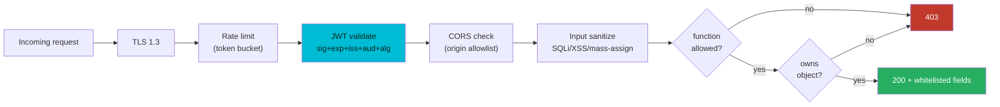

# API Security — A Visual, Worked-Example Guide

> **Companion code:** [`api_security.py`](https://github.com/quanhua92/tutorials/blob/main/csfundamentals/api_security.py).
> **Live demo:** [`api_security.html`](./api_security.html)

---

## 0. TL;DR — the one idea

> **The analogy:** API security is a **bank with layered checkpoints**. The
> front door checks *who you are* (AuthN: JWT signature). The teller checks
> *which account is yours* (AuthZ: `resource.owner == current_user` — BOLA).
> The vault checks *which fields you may touch* (BOPLA: field whitelist). The
> lobby limits *how often you can ask* (rate limiting). And the safe deposit
> room only opens for *your* box, even if you guessed someone else's number.
> No single checkpoint is enough — a missed check at any layer is a breach.

The OWASP API Security Top 10 (2023 edition, the current standard) lists the
ten API-specific risks. This bundle reproduces the five highest-impact ones as
**vulnerable vs hardened endpoint pairs**, then layers on JWT validation,
input sanitization, CORS, and rate limiting.

| Concern | Question | Frequency | OWASP |
|---|---|---|---|
| **Object AuthZ** | Do you own THIS resource? | Every data access | API1 (BOLA) |
| **Property AuthZ** | May you read/write THIS field? | Every response | API3 (BOPLA) |
| **Function AuthZ** | May you call THIS endpoint? | Every endpoint | API5 (BFLA) |
| **AuthN strength** | Can an attacker guess/break in? | Login + token issue | API2 |
| **Resource limits** | Can you consume unbounded cost? | Every request | API4 |



This bundle simulates five pillars end-to-end in pure stdlib:

1. **OWASP API Top 10** — BOLA, Broken Auth, Excessive Data Exposure, BFLA
2. **JWT validation** — signature, expiry, claims, algorithm confusion
3. **Input sanitization** — SQL injection, XSS, mass assignment
4. **CORS policy enforcement** — origin allowlist, credentials, preflight
5. **Rate limiting** — token bucket, sliding-window counter, 429 handling

---

## 1. How It Works

### 1.1 OWASP API1 — Broken Object Level Authorization (BOLA)

> **Idea:** The #1 API risk for three editions running. An API endpoint takes
> an object id (`/api/documents/1234`) but only checks *authentication*
> (logged in) — not *authorization* (owns THIS object). The attacker changes
> the id to `/api/documents/5678` and reads someone else's data.

> From `api_security.py` Section "OWASP API Security Top 10":

```
API1 — Broken Object Level Authorization (BOLA)  [#1 risk]
  Attack:  user:alice calls GET /api/documents/doc_002
  VULNERABLE endpoint -> returns Bob's doc? [check] OK (leak!)
  HARDENED   endpoint -> ownership check blocks? [check] OK
  Fix: ALWAYS check resource.owner == current_user on every data access
```

The hardened path is one line, checked on **every** data access:

```python
def safe_get_doc(store, doc_id, user):
    doc = store.get_raw(doc_id)
    if doc is None or doc["owner"] != user:
        return {}                       # fail closed: 404/403
    return doc
```

**Why UUIDs aren't enough:** UUIDs make ids unguessable, but they are **not
secrets** — they leak via logs, shared links, and enumeration of a partner's
data. Always enforce ownership checks *in addition* to using UUIDs.

---

### 1.2 OWASP API2 — Broken Authentication + API5 BFLA

> **Idea:** AuthN failure (no lockout → brute force) and AuthZ failure
> (BFLA: trusting a client-supplied role) are both about *the server not
> being the source of truth for identity and authority*.

```
API2 — Broken Authentication
  VULNERABLE: 4 guesses, no lockout -> cracked? [check] OK (cracked!)
  HARDENED: lockout after 5 fails -> real password rejected? [check] OK

API5 — Broken Function Level Authorization (BFLA)
  VULNERABLE: trusts client-supplied role -> admin granted? [check] OK (escalation!)
  HARDENED:   server-side session role check -> denied? [check] OK
```

Two anti-patterns, one root cause: **the server trusts data from the client**
(no lockout ceiling; a `role` field in the request body). The fix in both is
to derive authority from the **server-side session**, never the request:

- API2: `lockout[user] >= 5 → reject` + `hmac.compare_digest()` (constant-time)
- API5: `user.get("role") == "admin"` where `user` comes from the validated
  session, and **deny by default**.

---

### 1.3 OWASP API3 — Broken Object Property Level Authorization (BOPLA)

> **Idea:** Two failure modes under one risk: (a) **excessive data exposure**
> — the endpoint serializes the whole DB row including `password_hash` and
> `api_key`; (b) **mass assignment** — the server blindly binds every field
> in the request body, so `is_admin: true` gets persisted.

> From `api_security.py` Section "Input Sanitization" (3.3):

```
MASS ASSIGNMENT (API3 root cause)
  incoming = {title, content, visibility, is_admin:True, role:"admin", ...}
  VULNERABLE: is_admin persisted?  [check] OK (escalated!)
  SAFE:       whitelist = ['content', 'title', 'visibility']? [check] OK
  Fix: explicit input whitelist (Pydantic / additionalProperties:false)
```

The hardened path is an **explicit field whitelist** — never `dict(request.json)`:

```python
ALLOW = {"title", "content", "visibility"}
def assign_safe(data): return {k: v for k, v in data.items() if k in ALLOW}
```

For responses, apply the same idea: an output serializer that emits only the
public fields. `additionalProperties: false` in JSON Schema enforces this at
the framework boundary.

---

### 1.4 JWT validation — the fail-closed chain

> **Idea:** A JWT is `header.payload.signature`. The signature covers the
> first two parts, so tampering invalidates it. But a **valid signature is
> not sufficient** — you must also validate the *claims* (`exp`, `iss`,
> `aud`, `nbf`) and **hardcode the allowed algorithms** so an attacker can't
> swap the `alg` header.

> From `api_security.py` Section "JWT Validation":

```
reference token = eyJhbGciOiJIUzI1NiIs...ZYqvmeYJR_4z3H9cIvckA_gaX2cVL0XD9dabEpmwqg8

1. STRUCTURE + SIGNATURE
   valid token                                  [check] OK
   tampered payload (viewer->admin, no re-sign) [check] REJECTED (bad signature)
2. EXPIRY (exp)
   expired token (exp < now)                    [check] REJECTED (expired)
3. CLAIMS (iss / aud)
   wrong audience (confused deputy)             [check] REJECTED (bad audience)
   wrong issuer                                 [check] REJECTED (bad issuer)
4. ALGORITHM CONFUSION (CVE-2016-10555)
   forged 'alg:none' token rejected by default? [check] OK
   naive verifier that trusted 'none' -> passes [check] OK (vulnerable!)
```

The validation order matters and is **fail-closed** (return on first failure):

| # | Check | What it stops |
|---|---|---|
| 1 | structure (3 parts) | malformed garbage |
| 2 | **alg in hardcoded allowlist** | **algorithm confusion (CVE-2016-10555)** |
| 3 | signature (constant-time) | tampering / forgery |
| 4 | `exp > now` | replay of stolen tokens after TTL |
| 5 | `nbf <= now` | future-dated tokens |
| 6 | `iss == trusted` | tokens from a foreign IdP |
| 7 | `aud == THIS service` | **confused deputy** (token for A replayed at B) |

**The algorithm-confusion attack (CVE-2016-10555):** If the verifier trusts
the `alg` header, an attacker sets `alg: none` (no signature) or `alg: HS256`
and signs with the *RSA public key* as the HMAC secret. The naive library
verifies with whatever algorithm the header requests — so the forged token
passes. **Fix:** hardcode `algorithms=["HS256"]` (or `["RS256"]`); never read
`alg` from the header to decide *how* to verify.

> The live demo (`api_security.html`) recomputes this exact HS256 signature in
> pure JavaScript (hand-rolled SHA-256 + HMAC) and prints `[check: OK] JS ==
> .py` — the crypto is byte-for-byte identical to Python.

---

### 1.5 Input sanitization — SQLi, XSS, mass assignment

> **Idea:** Treat all input as **data, never code**. SQL injection happens
> when user input is concatenated into a query string (it becomes SQL syntax).
> Parameterized queries make the input a *value* the database binds — it can
> never alter the query structure.

> From `api_security.py` Section "Input Sanitization":

```
3.1 SQL INJECTION
  malicious input = "alice@example.com' OR '1'='1"
  VULNERABLE (string concat):
    SELECT id, email FROM users WHERE email = 'alice@example.com' OR '1'='1'
    -> tautology appended? [check] OK (injectable!)
  SAFE (parameterized):
    SELECT id, email FROM users WHERE email = %s
    params = ("alice@example.com' OR '1'='1",)
    -> input is data, not code?  [check] OK

3.2 XSS (stored / reflected)
  raw input    = <script>alert("steal-session")</script>
  escaped      = &lt;script&gt;alert(&quot;steal-session&quot;)&lt;/script&gt;
  escaped neutralizes tag?    [check] OK
```

Three layers, each catching what the others miss:

| Vector | Root cause | Primary defense | Backup layer |
|---|---|---|---|
| **SQLi** | string-concatenated query | parameterized queries / ORM | least-privilege DB user |
| **XSS** | unescaped output | output-escape (`html.escape`) | Content-Security-Policy header |
| **Mass assignment** | binding raw request body | field whitelist / `additionalProperties:false` | Pydantic model |

XSS defense is **output**-escaping (escape when you render), not input-stripping
(an admin may legitimately store HTML). Pair it with `Content-Security-Policy`
(restrict script sources), `HttpOnly`+`SameSite` cookies (so stolen tokens
can't be read/sent), and an input allowlist.

---

### 1.6 CORS — a relaxation, not a feature

> **Idea:** CORS is **not** a security feature. It is a controlled *relaxation*
> of the browser's same-origin policy, configured via response headers. The
> server decides which foreign origins may read its responses. Misconfiguration
> (reflecting the `Origin` header, or `*` + credentials) silently leaks data.

> From `api_security.py` Section "CORS Policy Enforcement":

```
allowed origins = ['https://admin.example.com', 'https://app.example.com']
  legit SPA, cookies   origin=https://app.example.com -> 200 ACAO=origin [ALLOWED]
  preflight legit      origin=https://app.example.com -> 204 + methods    [ALLOWED]
  evil origin          origin=https://evil.example.com -> 403 ACAO=(none) [BLOCKED]
  reflected-Origin bug origin=https://evil.example.com -> 403 ACAO=(none) [BLOCKED]

Rules:
  1. NEVER 'Access-Control-Allow-Origin: *' + Allow-Credentials: true
  2. NEVER reflect the Origin header without an allowlist check
  3. Reflect the EXACT allowed origin, not a pattern, not '*'
```

Key points often missed:

- The **browser** enforces CORS; `curl` and mobile apps ignore it entirely. So
  restrictive CORS protects browser-based clients, not your data from direct
  API calls (that's AuthN/AuthZ's job).
- `Access-Control-Allow-Origin: *` + `Access-Control-Allow-Credentials: true`
  is an **invalid combination** — browsers reject it. The real-world bug is a
  reverse proxy that strips and re-reflects the `Origin` header.
- **Preflight** (`OPTIONS`) is automatic for non-simple requests (PUT/DELETE,
  custom headers, non-form content-type). Answer it at the gateway/framework.
- Using `Authorization: Bearer` (not cookies) makes the API **CSRF-proof** —
  cross-origin requests can't set custom headers without a passing preflight.

---

### 1.7 Rate limiting — token bucket vs sliding window

> **Idea:** API4 (unrestricted consumption) is mitigated by rate limiting.
> **Token bucket** allows a burst up to capacity then a steady refill — good
> for LLM/payment APIs where a user legitimately fires several requests fast.
> **Sliding-window counter** fixes the fixed-window "2x burst at the boundary"
> problem with O(1) memory.

> From `api_security.py` Section "Rate Limiting":

```
5.1 TOKEN BUCKET (capacity=10, refill=1 token/sec)
  15 concurrent requests at t=0:  allowed = 10  denied = 5  [check] OK
  after 10s the bucket refills:  next 10 at t+10: allowed=10 [check] OK

5.2 SLIDING WINDOW COUNTER (limit=100/min)
  100 req filled window t=0.
  At t+61s (1s into next window):
    fixed-window (naive) would allow = 100
    sliding-window counter allows    = 35      [check] OK (no 2x burst)

5.3 429 RESPONSE
  server returns 429 with Retry-After: 60
  client backoff (s) = [2, 4, 8, 16, 32]
```

The **fixed-window burst problem:** with a 100/min limit split at a window
boundary, 100 requests in the last second of window 1 + 100 in the first
second of window 2 = **200 requests in 4 seconds**. The sliding-window
counter estimates the count in the trailing window as a weighted blend:

```
est = cur_count + prev_count * (1 - weight)
weight = (now % window) / window      # fraction of current window elapsed
```

At 1s into the new window, `weight = 1/60`, so the previous window's 100
counts as `100 * (1 - 1/60) ≈ 98` — leaving only ~2 more allowed, not 100.

**Per-dimension keys** (defense in depth): rate-limit per-IP (anonymous),
per-user (fair usage), per-tenant (SaaS ceiling), and a global hard cap. In a
distributed system, all pods share one counter via **Redis + an atomic Lua
script** (a single `INCR` across the cluster) — otherwise 50 pods each
allowing 100/min = 5000/min (50× the intended limit).

---

## 2. The Math

### Token bucket: burst vs steady-state

With capacity `C` and refill `R` tokens/sec, the bucket sustains `R`
requests/sec indefinitely but allows an instantaneous burst of up to `C`:

```
burst capacity  = 10 tokens      -> 10 concurrent requests pass instantly
steady refill   = 1 token/sec    -> sustains 1 req/sec forever
drain time      = C / R = 10 s   -> empty bucket fully refills in 10 s
```

This is why token bucket is the default for LLM/payment APIs: a user
legitimately typing 3 quick prompts gets a burst, but sustained abuse is
throttled to the refill rate.

### Sliding-window accuracy

The weighted estimate `est = cur + prev*(1-weight)` is an approximation of the
true count in the trailing window. It's within one window's count of exact,
with **O(1) memory per key** (vs O(N) for a sliding-window *log* that stores
every request timestamp). For 100M keys, the difference is 100M integers vs
billions of timestamps.

### JWT size vs exposure window

```
access_token TTL = 900 s (15 min)  -> max exposure window for a stolen token
HS256 demo token = 340 bytes       -> claims travel with every request
```

Short TTL bounds the damage of a leaked token; the cost is the request-size
overhead of carrying claims (vs ~32 B for an opaque session id — see the
[`auth_systems`](./AUTH_SYSTEMS.md) bundle for the session-vs-token tradeoff).

### Brute-force economics (API2)

With lockout after 5 failures and a 6-digit MFA code (10^6 space, ±1 window =
3 valid codes), the random-guess success rate is `5 / 10^6 ≈ 0.0005%` even
with full attempts — infeasible. Without lockout, an unthrottled endpoint at
10k attempts/sec cracks a 6-char password space (~2×10^9) in minutes.

---

## 3. Tradeoffs

| Decision | Option A | Option B | When |
|---|---|---|---|
| **Rate-limit algo** | Token bucket (controlled burst) | Sliding-window counter (smooth, O(1)) | Payment/LLM → token bucket; general API → sliding window |
| **JWT alg** | HS256 (shared secret; 1 leak = forge) | RS256 (asymmetric; public verifies) | Single verifier → HS256 ok; >1 service → **RS256** |
| **AuthZ model** | RBAC (role tables, O(1)) | ABAC (attribute rules, flexible) | Coarse roles → RBAC; context-aware → ABAC/ReBAC |
| **Response shaping** | Whitelist serializer | `additionalProperties:false` schema | Small API → whitelist; large → schema (enforced at gateway) |
| **Rate-limit store** | In-process (per-pod) | Redis (shared, atomic) | Single instance → local; distributed → **Redis + Lua** |
| **CORS** | Exact origin reflect | Bearer tokens (no cookies) | Browser SPA → exact origin; API → Bearer (CSRF-proof) |

**Decision tree:**
- More than one verifying service? → **RS256** (JWK set at `/.well-known/jwks.json`)
- Resource owned by a user? → **check `owner == current_user` on every access** (BOLA)
- Multi-tenant SaaS? → rate-limit **per-tenant** + global hard cap
- Distributed deployment (>1 pod)? → **Redis + atomic Lua** for rate limiting
- Browser client? → exact-origin CORS; otherwise prefer **Bearer tokens** (CSRF-proof)

---

## 4. Real-World Usage

| System | Pattern | Notes |
|---|---|---|
| **OWASP API Top 10** | The reference threat model | 2023 edition is current; API1 (BOLA) is #1 three editions running |
| **Stripe / AWS** | Token-bucket rate limiting | Controlled burst for payment/IaaS APIs; 429 + `Retry-After` |
| **Kong / Envoy / AWS API Gateway** | Gateway-level rate limit + auth chain | Redis-backed counters; per-consumer quotas |
| **Pydantic / JSON Schema** | `additionalProperties:false` | Prevents mass assignment at the framework boundary |
| **Auth0 / Okta / Cognito** | RS256 JWT + JWK set rotation | Publish keys at `/.well-known/jwks.json`; 15-min cache |
| **LLM gateways (LiteLLM/Portkey)** | Per-key quotas + cost caps | Mitigates OWASP LLM10/API4 (unbounded consumption) |
| **CVE-2016-10555** | Algorithm-confusion lesson | Hardcode `algorithms=`; never trust the JWT `alg` header |
| **Redis Cell / Lua scripts** | Distributed atomic counters | Single `INCR` across all pods avoids the N×limit bug |

---

## Killer Gotchas

- **BOLA is checked on every data access, not once.** The single most common
  API breach: the endpoint authenticates (logged in) but forgets to authorize
  (owns THIS object). **Fix:** `resource.owner == current_user` everywhere;
  centralize in middleware; write cross-user access tests.

- **Algorithm confusion (CVE-2016-10555):** A naive verifier that trusts the
  `alg` header lets an attacker forge `alg:none` or `alg:HS256`-with-public-key
  tokens. **Fix:** hardcode `algorithms=["RS256"]`; never branch on the header.

- **Missing `aud` = confused deputy:** A token minted for service A is replayed
  at service B. **Fix:** always validate `aud` against *this* service's id.

- **Reflecting the `Origin` header is a CORS breach.** `ACAO: ${origin}` lets
  any site read your API. **Fix:** check the origin against an allowlist, then
  reflect the *exact* allowed origin — never `*`, never unvalidated reflect.

- **`*` + credentials is invalid:** Browsers reject
  `Access-Control-Allow-Origin: *` with `Allow-Credentials: true`. The real
  bug is a proxy that strips and re-reflects the origin.

- **Mass assignment needs an input whitelist, not just a schema.** Binding the
  raw request body persists `is_admin`, `role`, `owner`. **Fix:** explicit
  field whitelist; `additionalProperties:false`; never `dict(request.json)`.

- **SQL injection is solved by parameterization, not escaping.** Escaping is
  error-prone and context-dependent. **Fix:** parameterized queries / ORM — the
  input becomes a *value*, never *syntax*.

- **Distributed rate limiting without a shared store is N× too lenient.** 50
  pods each allowing 100/min = 5000/min. **Fix:** Redis + an atomic Lua script.

- **Constant-time compare for secrets.** Naive `==` on passwords/codes/JWT
  signatures leaks how many bytes match via timing. **Fix:**
  `hmac.compare_digest()` (Python) / XOR-reduce (JS) — used throughout this
  bundle's JWT and login checks.

- **429 without `Retry-After` causes retry storms.** Clients that don't know
  when to retry will hammer the endpoint. **Fix:** always send `Retry-After`
  + `X-RateLimit-*` headers; clients must use exponential backoff with jitter.

- **CORS does not protect server-to-server or mobile clients.** Only browsers
  enforce it. Never rely on CORS as your AuthN/AuthZ — it's a browser policy,
  not an access control.
