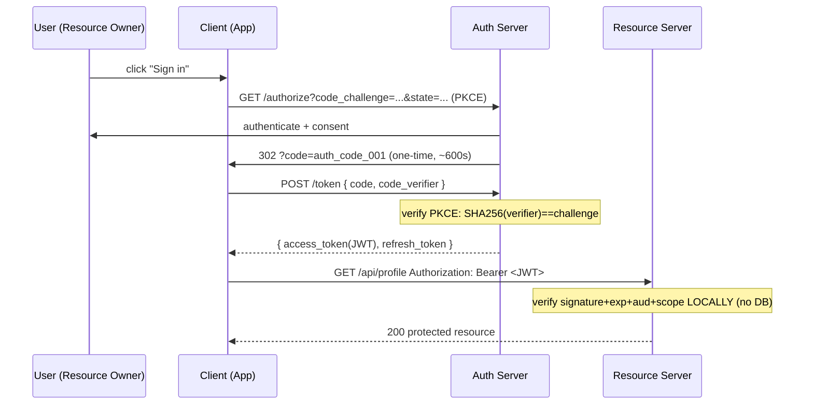

# Auth Systems — A Visual, Worked-Example Guide

> **Companion code:** [`auth_systems.py`](https://github.com/quanhua92/tutorials/blob/main/csfundamentals/auth_systems.py).
> **Live demo:** [`auth_systems.html`](./auth_systems.html)

---

## 0. TL;DR — the one idea

> **The analogy:** Authentication is a **two-part handshake at a secure building**.
> *AuthN* (who are you) is showing your ID at the front desk and getting a **day
> pass** (a short-lived access token). *AuthZ* (what can you do) is the access
> list on the pass — which floors, which rooms. The day pass is *self-validating*
> (a hologram a guard checks locally, no phone call to the desk), but it expires
> in 15 minutes. To avoid re-checking ID all day, you also get a **renewal
> voucher** (refresh token) — but each renewal *destroys* the old voucher, so a
> pickpocket who grabs a used one immediately sets off an alarm.

Two separable concerns, run by different services, checked on different cadences:

| Concern | Question | Frequency | Store | Failure mode |
|---|---|---|---|---|
| **AuthN** | Who are you? | Once per session (+ refresh) | users / password hashes | Impersonation |
| **AuthZ** | What can you do? | **Every request** | roles / relation tuples | Unauthorized actions |



This bundle simulates five pillars end-to-end in pure stdlib:

1. **OAuth 2.0 Authorization Code + PKCE** — the only correct user-facing flow
2. **JWT** (`header.payload.signature`) — build, decode, tamper-detect
3. **Refresh token rotation + reuse detection** — token-family revocation
4. **Session vs Token** — stateful vs stateless identity
5. **MFA (TOTP / RFC 6238)** — enroll, challenge, verify

---

## 1. How It Works

### 1.1 OAuth 2.0 Authorization Code + PKCE

> **Idea:** Never give the user's credentials to the app. The app bounces the
> user to the **Authorization Server**, which authenticates the user and hands
> the app a short-lived **authorization code**. The app exchanges that code (over
> a secure back-channel) for tokens. **PKCE** binds the code to the app via a
> challenge/verifier pair, so a stolen code (from the redirect URL or a browser
> history leak) is useless.

The four actors:

| Actor | Role | Holds |
|---|---|---|
| **Resource Owner** (user) | Has the data; grants consent | credentials |
| **Client** (3rd-party app) | Wants to act on the user's behalf | `client_id`, PKCE verifier |
| **Authorization Server** | Authenticates user, issues tokens | signing keys, refresh-token store |
| **Resource Server** | Serves protected data | the JWT public key (cached) |

> From `auth_systems.py` Section "OAuth 2.0 Authorization Code + PKCE":

```
Step 1 — Client -> Authorization Server (browser redirect):
  GET /authorize?response_type=code
    &client_id=app-client-001
    &redirect_uri=https://app.example.com/callback
    &scope=profile+email
    &code_challenge=UlmB1zwDcf5pUkdZ3xsL0u29k2t7qIT0wASTsF6hfx4
    &code_challenge_method=S256
    &state=xyz123csrf

Step 4 — Client -> Auth Server (back-channel token request):
  POST /token
    grant_type=authorization_code
    code=auth_code_001
    redirect_uri=https://app.example.com/callback
    client_id=app-client-001
    code_verifier=aB3dE6fH9jK2mN5pQ8sT0...   (never sent in step 1!)

Step 5 — PKCE check: SHA256(code_verifier) == stored challenge
    recomputed = UlmB1zwDcf5pUkdZ3xsL0u29k2t7qIT0wASTsF6hfx4
    stored      = UlmB1zwDcf5pUkdZ3xsL0u29k2t7qIT0wASTsF6hfx4
    match?        True
```

Two replay protections, both verified by the simulation:

```
Replay check: re-using auth code rejected? [check] OK
PKCE check: stolen code + wrong verifier rejected? [check] OK
```

**Why PKCE exists:** Before PKCE, a malicious app on the same device could
snatch the authorization code from the redirect (custom URL scheme, browser
history, log leak) and redeem it. With PKCE, the thief also needs the
`code_verifier` — which never left the legitimate client's memory.

> **Flow selection cheat-sheet:**
> - Web / SPA / Mobile → **Authorization Code + PKCE** (the only correct answer)
> - Service-to-service → **Client Credentials** (no user; secret in Vault/KMS)
> - TV / CLI → **Device Code** (approve on a second device while the first polls)
> - ~~Implicit~~ / ~~Resource Owner Password~~ → **deprecated** (OAuth 2.1). Proposing these is a strong negative signal.

---

### 1.2 JWT structure (header.payload.signature)

> **Idea:** A JWT is three base64url-encoded JSON blobs joined by dots. The
> **signature** covers the first two parts, so any tampering invalidates it.
> JWTs are **integrity-protected, not encrypted** — never put a secret in one.

```
header   = {"alg":"HS256","typ":"JWT","kid":"key-1"}
payload  = {"iss":"...auth.example.com","sub":"user:alice",
            "aud":"...api.example.com","role":"admin","scope":"profile email",
            "iat":1700000000,"exp":1700000900,"jti":"jti_abc123"}

JWT = base64url(header).base64url(payload).HMAC-SHA256(...)
```

> From `auth_systems.py` Section "JWT Structure":

```
signature = HMAC-SHA256(signing_input, secret)
  sig     = Zku2IAWQ_2saGNApqxbGe9OK1h8D-JnbJN3_vzBM9TU

structure: 3 dot-separated parts?            [check] OK
signature verifies + claims intact?          [check] OK

Tamper test: flip 'admin'->'super' in payload (no re-sign):
  signature now invalid, rejected?           [check] OK
```

**Standard claims to ALWAYS validate:**

| Claim | Meaning | Why it matters |
|---|---|---|
| `iss` | issuer | Reject tokens from other IdPs |
| `aud` | audience | **Confused deputy** — a token minted for service A replayed at B |
| `exp` | expiry | Limits exposure window |
| `iat` | issued-at | Detect future-dated tokens |
| `jti` | token id | Replay detection / blocklist membership |
| `sub` | subject | The user identity |
| `scope` | permissions | What the bearer may do |

> The live demo (`auth_systems.html`) recomputes this exact signature in pure
> JavaScript (hand-rolled SHA-256 + HMAC) and prints `[check: OK] JS == .py` —
> the crypto is byte-for-byte identical to Python.

---

### 1.3 Refresh token rotation + reuse detection

> **Idea:** Access tokens are short-lived (5–15 min) so a stolen one dies fast.
> But forcing re-login every 15 minutes is hostile. The **refresh token** is
> long-lived (days/weeks) and silently mints new access tokens. To keep it safe:
> **rotate on every use** (each refresh destroys the old token and issues a new
> one in the same *family*). If a *used* token ever reappears, the whole family
> is revoked — that's theft detection.

> From `auth_systems.py` Section "Refresh Token Rotation + Reuse Detection":

```
Step 1 — login issues:           rt_001 (family rt_001)
Step 2 — use rt_001 -> rotate:   rt_001=used,  rt_003=active  [check] OK
Step 3 — use rt_003 -> rotate:   rt_001=used,  rt_003=used,  rt_005=active  [check] OK
Step 4 — ATTACK: replay rt_001:
        -> REUSE DETECTED on rt_001; family rt_001 revoked
        rt_001=revoked, rt_003=revoked, rt_005=revoked  [check] OK
Step 5 — the still-valid rt_005 is now DEAD too (forced re-login)  [check] OK
```

The `family_id` column is the whole trick: every token descended from one login
shares a family. One reuse anywhere in the chain → revoke all of them. The
legitimate user (whose token was also stolen) is forced to re-authenticate — an
annoying-but-safe outcome.

---

### 1.4 Session vs Token — stateful vs stateless

> **Idea:** Two ways to prove identity on a request.
> - **Session:** server stores state keyed by an opaque cookie id. Every request
>   is a store lookup. Revocation = delete one row.
> - **JWT (token):** client carries signed claims. Verification is **local**
>   (no store hit). Revocation is *hard* — you can't un-mint a token, so you lean
>   on short TTL + an optional blocklist.

> From `auth_systems.py` Section "Session vs Token":

```
SESSION: store lookups over 5 requests = 5  (one per request)
         revocation = delete the key -> instant, global
TOKEN:   store lookups over 5 requests = 0  (zero — stateless)
         blocklist 'tok_001' -> token now denied  (extra store hit to revoke)

property            session             jwt
server state        yes (Redis/DB)      no (stateless)
per-request lookup  1 store hit         0 (local verify)
revoke instantly    yes (delete)        no (TTL/blocklist)
payload size        ~32 B (opaque id)   281 B (claims)
scales across svcs  shared store        any service verifies
logout everywhere   trivial             hard (hybrid needed)
```

**The production answer is HYBRID:** JWT for cross-service identity propagation
(every microservice verifies locally, no shared session store bottleneck) **plus**
a central session record in the AuthN service for global logout / forced
revocation.

---

### 1.5 MFA — TOTP (RFC 6238)

> **Idea:** After the password checks out, require a second factor: a 6-digit
> code derived from a **shared secret** and the **current 30-second window**.
> `counter = floor(unix_time / 30)`; the code is `HOTP(secret, counter)` via
> HMAC-SHA1 + dynamic truncation. Neither the server nor the app needs the
> network — both compute the code from the clock.

> From `auth_systems.py` Section "MFA Flow — TOTP":

```
shared secret (base32) = MNZWM5LOMRQW2ZLOORQWY4ZNORXXI4BNONSWG4TFOQWTEMBSGQ
now (epoch)   = 1700000000
TOTP counter  = 1700000000 // 30 = 56666666
current code  = 624452

correct code accepted?                [check] OK
previous-step code accepted (window)? [check] OK   (±1 step clock skew)
wrong code rejected?                  [check] OK
```

**Factor hierarchy (2024+):**

| Factor | Breach-proof? | Phishing-proof? | Status |
|---|---|---|---|
| Password (Argon2id) | if hashed well | no | baseline |
| **TOTP** | yes | **no** (real-time relay) | acceptable |
| SMS | no (SIM swap, SS7) | no | deprecated by NIST |
| **WebAuthn / Passkey** | yes | **yes** (domain binding) | preferred |

TOTP is strong against database breaches but weak against phishing — an attacker
on a fake login page can relay your code in real time. WebAuthn/passkeys bind the
private key to the legitimate domain, making phishing structurally impossible.

---

## 2. The Math

### Exposure window (why short TTL)

If an access token is stolen, the attacker can use it until `exp`. With a 15-min
TTL, the **maximum exposure window is 900 s**. Refresh-token rotation means the
long-lived credential is only valid for *one* use — reuse is the theft signal.

```
access_token TTL    = 900 s  (15 min)   -> max exposure window
refresh rotation    = every use         -> stolen refresh dies on first legit use
reuse-detection     = family revoke     -> forces full re-auth on confirmed theft
```

### JWT size cost

Claims travel with the client, so a JWT is larger than an opaque session id:

```
session id ~32 B      vs      demo JWT = 281 B
```

At 100M users × billions of requests, this 8.8× per-request overhead is the
price of **statelessness** (no DB lookup). Worth it when AuthZ must scale across
100+ microservices at <1ms p99.

### TOTP probability (why 30-second windows)

A 6-digit code has 10^6 = 1,000,000 possibilities. With a ±1 window (3 valid
codes at once) and a 30-second step, the **random-guess success rate** is
`3 / 1,000,000 ≈ 0.0003%` per attempt. Rate-limiting (lockout after 5 tries)
makes brute force infeasible: `5 / 1e6 = 0.0005%` even with full attempts.

```
TOTP space          = 10^6 codes
valid at once       = 3 (window ±1)
random-guess chance = 3 / 1,000,000 = 0.0003%
```

---

## 3. Tradeoffs

| Decision | Option A | Option B | When |
|---|---|---|---|
| **Session vs JWT** | Session (stateful, easy revoke, store per request) | JWT (stateless, hard revoke, local verify) | Monolith → session; microservices → JWT (or hybrid) |
| **HS256 vs RS256** | HS256 (shared secret; one leak = forge ability) | RS256 (asymmetric; public key verifies) | Single service → HS256 ok; >1 verifier → **RS256** |
| **AuthZ model** | RBAC (role tables, O(1)) | ReBAC / Zanzibar (relation graph) | Coarse roles → RBAC; resource sharing → ReBAC; most use hybrid |
| **Revocation** | Short TTL + rotation (lazy) | Blocklist (immediate, extra lookup) | Default → TTL+rotation; high-value ops → blocklist |
| **MFA** | TOTP (cheap, phishable) | WebAuthn (phishing-resistant) | Consumer → TOTP; high-security → passkeys |

**Decision tree:**
- More than one verifying service? → **RS256** (sign with private, verify with public via JWK set)
- User-facing client (web/SPA/mobile)? → **Authorization Code + PKCE**
- Need "sign out everywhere"? → **Hybrid** (JWT + central session record)
- Collaboration product (docs, drive)? → **ReBAC** (SpiceDB / Zanzibar)
- High-security MFA in 2024? → **WebAuthn / passkeys**

---

## 4. Real-World Usage

| System | Auth approach | Notes |
|---|---|---|
| **Google / GitHub** ("Sign in with…") | OIDC (OAuth 2.0 + `id_token`) | OAuth = delegation; OIDC = authentication layer on top |
| **Auth0 / Okta** | Hosted IdP, RS256 JWK set, refresh rotation | Publish keys at `/.well-known/jwks.json` |
| **AWS Cognito** | User pools (OAuth/OIDC) + identity pools (AWS creds) | Issues RS256 JWTs; rotation configurable |
| **Kubernetes** | mTLS (service-to-service) + OIDC (user) | ServiceAccount tokens are JWTs |
| **Stripe / Twilio** | Client Credentials (service-to-service) | Secret in Vault/KMS; no user involved |
| **Google Cloud CLI** | Device Code flow | `gcloud auth login` polls while you approve in browser |
| **SpiceDB / Zanzibar** | ReBAC (relation tuples) | ~2M permission checks/sec at <10ms p99 |
| **1Password / Apple** | WebAuthn / passkeys | Domain-bound keys; phishing-resistant by design |

---

## Killer Gotchas

- **Algorithm confusion (CVE-2016-10555):** If the verifier trusts the `alg`
  header, an attacker can swap `RS256`→`HS256` and sign with the *public* key.
  **Fix:** hardcode `algorithms=["RS256"]` — never trust the header's `alg`.

- **Missing `aud` validation = confused deputy:** A token minted for service A
  is replayed at service B. **Fix:** always validate `aud` against *this*
  service's identifier.

- **Refresh token reuse = the silent theft alarm:** If you rotate but don't
  *detect reuse*, a stolen refresh token lives forever. **Fix:** mark used tokens
  and revoke the whole family on any reuse (Section 1.3).

- **Never put a JWT in a URL:** Tokens leak via browser history, server logs,
  and `Referer` headers. **Fix:** use the `Authorization: Bearer` header or an
  `HttpOnly` cookie.

- **Timing attacks on password/code comparison:** Naive `==` leaks how many
  bytes match via response time. **Fix:** `hmac.compare_digest()` (constant-time)
  — used in this bundle's TOTP verify and PKCE check.

- **Key rotation must overlap:** Publish the new key in the JWK set *before*
  signing with it; remove the old key only after `max_token_lifetime + buffer`.
  Verifiers cache the JWK set (15 min–1 h TTL).

- **TOTP ≠ phishing-resistant:** A real-time relay attack (AiTM proxy) defeats
  TOTP. For admin/financial accounts in 2024+, deploy **WebAuthn/passkeys**.

- **Session fixation:** Regenerate the session id on every privilege escalation
  (login, role change) so an attacker-injected id can't ride along.

- **The `iat`/`exp` are epoch seconds, not ms:** A verifier expecting
  milliseconds will treat every token as far-future-expired (or vice versa).
  Confirm the unit against the issuer's docs.
