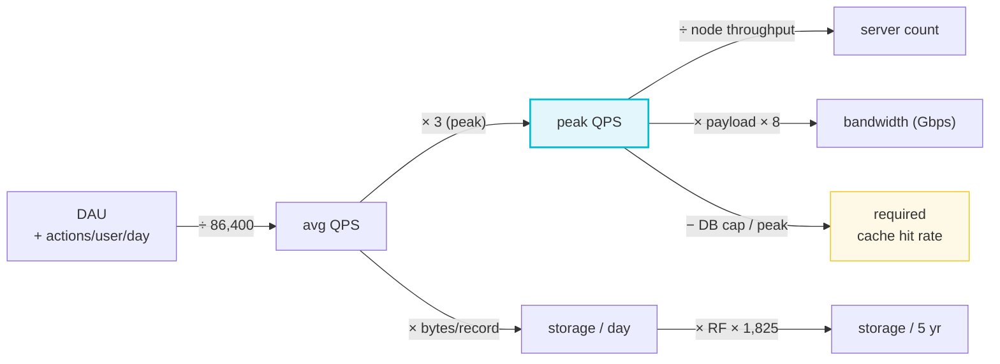
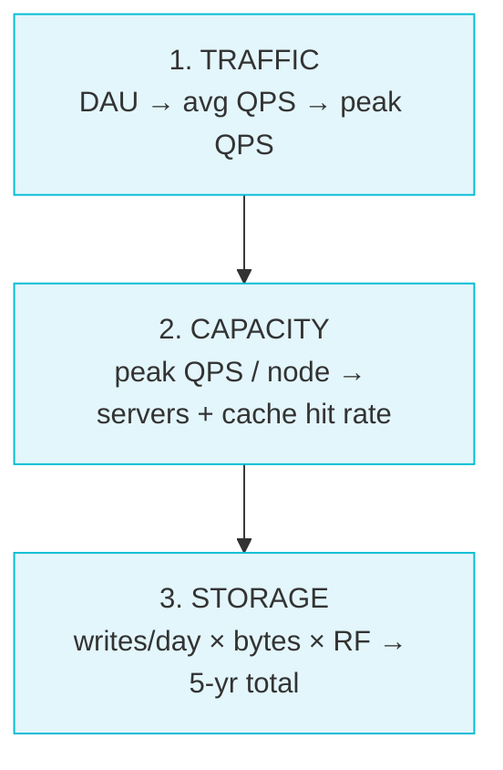

# Back-of-Envelope Estimation

> **Companion code:** [`back_of_envelope.py`](https://github.com/quanhua92/tutorials/blob/main/csfundamentals/back_of_envelope.py).
> **Live demo:** [`back_of_envelope.html`](./back_of_envelope.html) — open in a browser.
> Every number in this guide is printed by `python3 back_of_envelope.py` — nothing hand-computed.

---

## 0. TL;DR — the one idea

> **The analogy:** Back-of-envelope estimation is reading the odometer before you
> plan a road trip. You don't need the route to the metre — you need to know
> whether the trip is 50 km (one tank) or 5,000 km (fly instead). In system
> design, that odometer is three multiplications:
> **DAU → QPS → servers**, branching into **bytes/record → storage** and
> **payload × 8 → bandwidth**. Get the *exponent* right; the coefficient is noise.



**The four numbers that drive every estimate:**

| Driver | Question | Section |
|---|---|---|
| **Peak QPS** | How many requests hit the hottest second? | Section 3 |
| **Storage / 5 yr** | How much disk (with replication)? | Section 4 |
| **Bandwidth** | Does it saturate the NIC? | Section 5 |
| **Required hit rate** | How much must the cache absorb? | Section 6 |

---

## 1. The reference numbers (memorize these)

You cannot estimate from zero. Internalize this small table and the rest is
arithmetic.

### 1a. Power-of-2 table

> From `back_of_envelope.py` Section A:

| Power | Value | Unit |
|---|---|---|
| 2^10 | 1,024 | KiB |
| 2^20 | 1,048,576 | MiB |
| 2^30 | 1,073,741,824 | GiB |
| 2^40 | 1,099,511,627,776 | TiB |
| 2^50 | 1,125,899,906,842,624 | PiB |
| 2^60 | 1,152,921,504,606,846,976 | EiB |

**The trap:** storage/memory are **binary** (2^n), but networks and drive vendors
are **decimal** (1 GB = 1e9 B, 1 Gbps = 1e9 bps). A "1 TB" disk holds ~931 GiB.
Always state which unit family you're using.

### 1b. Latency hierarchy (L1 cache vs disk vs network)

> From `back_of_envelope.py` Section B. Six orders of magnitude span the table.

| Operation | Latency | If 1 ns = 1 s |
|---|---|---|
| L1 cache reference | 1 ns | 1 s |
| L2 cache reference | 4 ns | 4 s |
| L3 cache reference | 10 ns | 10 s |
| Main memory (DRAM) | 100 ns | 1.7 min |
| SSD random read (4 KB) | 100 us | 27.8 h |
| Intra-DC RTT (same DC) | 500 us | 5.8 days |
| SSD sequential read (1 MB) | 1 ms | 11.6 days |
| HDD random seek | 10 ms | 115.7 days |
| Cross-region RTT (US-EU) | 100 ms | 3.2 years |
| Cross-region RTT (US-Asia) | 200 ms | 6.3 years |

**Three anchors to memorize:** DRAM = **100 ns**, SSD random = **100 us**,
cross-region RTT = **100 ms**. Everything else interpolates.

> **Non-obvious insight:** the intra-DC network (500 us) is *faster* than a 1 MB
> SSD sequential read (1 ms). A distributed in-memory cache can therefore beat a
> local SSD cache on latency-sensitive paths.

### 1c. Single-node throughput anchors

| Component | Single-node QPS |
|---|---|
| Postgres complex query | ~1K-5K |
| Postgres simple PK select | ~50K |
| Redis GET/SET | ~100K-300K |
| Kafka broker (1 KB msgs) | ~500K msgs/s |
| Go/Java stateless API | ~10K-30K RPS |

---

## 2. The three-step drill



1. **Traffic:** `avg_qps = DAU × actions/user/day / 86,400`; `peak = avg × 3`.
2. **Capacity:** `servers = peak_qps / node_throughput`;
   `hit_rate = (peak − db_cap) / peak`.
3. **Storage:** `daily = writes/day × bytes`; `5-yr = daily × RF × 1,825`.

---

## 3. Throughput — QPS and peak QPS

> From `back_of_envelope.py` Section C:

| System | DAU | R/user/d | W/user/d | avg R/s | peak R/s | avg W/s |
|---|---|---|---|---|---|---|
| Twitter (consumer) | 200,000,000 | 10 | 0.1 | 23,148 | 69,444 | 231 |
| WhatsApp (messaging) | 1,000,000,000 | 0 | 40 | 0 | 0 | 462,963 |
| B2B SaaS dashboard | 1,000,000 | 5 | 1 | 58 | 289 | 12 |

### Walkthrough: Twitter

```
reads/day      = 200,000,000 × 10   = 2,000,000,000
avg read QPS   = 2,000,000,000 / 86,400 = 23,148.1
peak read QPS  = 23,148.1 × 3       = 69,444.4
avg write QPS  = 231.5              peak = 694.4
read : write   = 10 / 0.1 = 100 : 1   (reads dominate)
```

**Why peak × 3?** Consumer traffic concentrates into a ~8 h daytime window.
Spreading 24 h of activity over 8 h → `24/8 = 3×` concentration. B2B apps
concentrate into business hours → 5-10×. **Always state the multiplier aloud.**

---

## 4. Storage estimation

> From `back_of_envelope.py` Section D:

```
daily_raw   = writes/day × record_size
daily_total = daily_raw × replication × index_overhead
5-year      = daily_total × 1,825 days
```

| Twitter (20M tweets/day × 1 KB, RF=3) | Value |
|---|---|
| Daily raw | 19.1 GB |
| Daily w/ RF=3 | 57.2 GB |
| 5-year raw | 34 TB |
| **5-year w/ RF=3** | **102 TB** |

### Media dwarfs text

20% of tweets carry a 300 KB photo:

| Twitter media | Value |
|---|---|
| Daily media raw | 1.12 TB (vs 19.1 GB text) |
| 5-year media w/ RF | 5.98 PB |
| **media : text ratio** | **60×** |

> **Lesson:** estimate the *media* path separately — it is 1-2 orders of magnitude
> larger than the text path and routes to object storage (S3/GCS), not the DB.

### The three storage multipliers

| Multiplier | Factor | Applies to |
|---|---|---|
| Replication | ×3 | Kafka, HDFS, S3, Postgres + 2 replicas |
| Index overhead | ×1.5-2 | Relational B-tree indexes (3-4 ≈ table size) |
| Encoding variants | ×2-4 | Video platforms (5 resolution tiers) |

### Storage-tier selection

| Capacity | Tier |
|---|---|
| < 1 TB | single DB instance |
| 1-100 TB | S3 for blobs + DB for structured |
| 100 TB-1 PB | tiered hot/warm/cold retention |
| > 1 PB | distributed FS (HDFS/Colossus), multi-DC |

---

## 5. Bandwidth estimation

> From `back_of_envelope.py` Section E:

```
bandwidth_bps = ops/sec × payload_bytes × 8        (network is DECIMAL)
usable MB/s   = bps / 8 / 1e6
```

| NIC | Line rate | Throughput |
|---|---|---|
| 1 Gbps | 1 Gbps | 125 MB/s |
| 10 Gbps | 10 Gbps | 1,250 MB/s |
| 25 Gbps (c5n) | 25 Gbps | 3,125 MB/s |

### Twitter read egress

```
peak 69,444 reads/s × 1,024 B × 8 = 568.9 Mbps = 0.57 Gbps
→ fits a single 1 Gbps NIC
```

### Kafka replication (the bandwidth trap)

```
500,000 msgs/s × 1,024 B × RF=3 × 8 = 12.29 Gbps = 1,536 MB/s
→ needs a network-optimized 25 Gbps NIC (c5n)
```

> **Candidates forget network.** Always compute `writes/sec × record × RF` and
> compare to NIC throughput. If it exceeds ~50% line rate, upgrade the NIC or
> reduce the replication fan-out.

---

## 6. Connection count — the connection-tier problem

> From `back_of_envelope.py` Section F:

For persistent-connection systems (chat, realtime), the binding resource is
**file descriptors and kernel connection state**, not CPU or disk.

```
servers = concurrent_connections / connections_per_server
```

| WhatsApp scenario | Connections | Per server | Servers |
|---|---|---|---|
| Default (65K fd) | 1,000,000,000 | 65,000 | **15,385** |
| Tuned (1M fd) | 1,000,000,000 | 1,000,000 | **1,000** |

Tuning 65K → 1M connections/server cuts the fleet 15×. This forces a **dedicated
connection tier**:

- **Connection tier:** stateless TCP/WebSocket gateways — *no DB calls*.
- **Go preferred:** goroutine ~8 KB vs Java thread ~1 MB stack.
- **Routing index:** Redis hash `user_id → connection_server_id`.

---

## 7. Cache size + required hit rate

> From `back_of_envelope.py` Section G:

```
required_hit_rate = (peak_qps − db_capacity) / peak_qps
```

| Twitter cache | Value |
|---|---|
| Peak read QPS | 69,444 |
| Postgres complex capacity | 5,000 QPS |
| **Required hit rate** | **92.8%** |
| DB load after cache | 5,000 QPS |

> Below ~5K QPS, caching adds complexity without solving a bottleneck. Above
> ~300K ops/s, a single Redis node hits its ceiling → Redis Cluster.

**Cache memory sizing** (100M keys × 1 KB + 15% metadata): raw 95.4 GB,
w/ overhead 110 GB → **1 node @ 256 GB/node**.

---

## 8. Daily volume → architecture trigger

> From `back_of_envelope.py` Section H:

| Daily requests | avg QPS | peak QPS | Architecture |
|---|---|---|---|
| 100,000 | ~1.2 | ~3.5 | single server, no caching |
| 1,000,000 | ~12 | ~35 | single app + single DB |
| 10,000,000 | ~116 | ~347 | LB + 2-3 app servers, read replica |
| 100,000,000 | ~1.2K | ~3.5K | Redis caching, DB read replicas, ~5 apps |
| 1,000,000,000 | ~11.6K | ~34.7K | Redis mandatory, 3-5 replicas, ~30 apps |
| 10,000,000,000 | ~116K | ~347K | multi-tier cache, sharding, ~350 apps |

The **5K QPS Postgres-complex threshold** is the single most important line:
above it, caching is no longer optional.

---

## 9. Tradeoffs

| Choice | Pros | Cons |
|---|---|---|
| Estimate avg only (ignore peak) | simple numbers | under-provisions by 3×; cascading failures |
| Skip replication factor in storage | smaller headline | 67% data loss on a single failure |
| Treat DAU as peak | none | 3-10× over-provisioning, wasted cost |
| Use Postgres 50K QPS anchor | flattering estimate | that's *single-row PK select* only; joins drop it 5-10× |
| One big cache node | simple ops | 300K ops/s ceiling; single point of failure |

---

## 10. Real-world usage

- **Twitter/X:** ~200M DAU, 100:1 read:write → fan-out-on-read timelines; the
  cache must absorb ~92.8% of reads to keep Postgres under 5K QPS.
- **WhatsApp:** ~1B DAU, 1:1 read:write → the binding constraint is **1B
  persistent TCP connections** (15K servers at 65K each), not throughput.
- **YouTube:** ~500 h uploaded/min → encoding multiplier (~4× across 5 tiers)
  and 3× replication push daily storage into **petabyte** territory.
- **Kafka brokers:** throughput-bound on network — RF=3 replication at 500K
  msgs/s demands a 25 Gbps NIC, not a 1 Gbps one.

### Killer Gotchas

- **Get the exponent right, ignore the coefficient.** 10K vs 12K QPS is the same
  decision; 10K vs 100K changes the architecture.
- **Peak ≠ avg.** Always multiply by 3 (consumer) or 5-10 (B2B). The hottest
  second, not the average second, breaks the system.
- **Storage without replication is fiction.** `× 3` is the default for every
  durable distributed system.
- **Network is the forgotten axis.** `writes/sec × record × RF` can exceed a
  1 Gbps NIC long before CPU or disk saturates.
- **Postgres 50K QPS is a trap** — that's indexed single-row lookups; one JOIN
  drops it to ~10K, a non-indexed `ORDER BY` to hundreds.
- **Two-direction sanity check.** Derive a number two independent ways; if they
  agree within 10×, the math is sound. If they disagree by >100×, find the unit
  error.

---

## 11. How to cite numbers in an interview

Good pattern: **cite the number → apply to your QPS → conclude with the decision.**

- "A single Postgres handles ~1K-5K complex QPS — at our 69K peak, we need
  caching or ~14-69 read replicas."
- "Redis handles ~100K-300K ops/s. Our peak cache load is ~64K — well within a
  single node, no cluster needed."
- "Each connection server handles ~65K WebSocket connections default. At 1B
  concurrent users, that's ~15,385 servers — so we need a dedicated connection
  tier."

Never cite a benchmark as a constant. Always qualify: "for simple indexed
reads" or "this drops 5× with joins."

---

> **Interactive:** open [`back_of_envelope.html`](./back_of_envelope.html) for a
> live estimation calculator (DAU + read/write ratio → QPS, storage, bandwidth)
> and a latency comparison table, all recomputed in-browser to match
> [`back_of_envelope.py`](https://github.com/quanhua92/tutorials/blob/main/csfundamentals/back_of_envelope.py).
