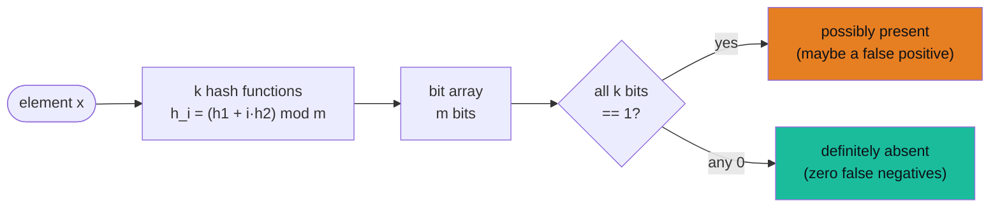

# Bloom Filters

> **Companion code:** [`bloom_filters.py`](https://github.com/quanhua92/tutorials/blob/main/csfundamentals/bloom_filters.py).
> **Captured output:** [`bloom_filters_output.txt`](https://github.com/quanhua92/tutorials/blob/main/csfundamentals/bloom_filters_output.txt).
> **Live demo:** [`bloom_filters.html`](./bloom_filters.html)

---

## 0. TL;DR — the one idea

> **The analogy:** A Bloom filter is a **smoke detector for "is this thing here?"** It never misses
> a fire (zero false negatives) but occasionally chirps when there's only burnt toast (bounded false
> positives). You pay with a tiny chance of a wrong "yes" to get a structure that uses ~10× less
> memory and answers in ~100 ns.



---

## 1. How It Works

A standard Bloom filter holds two things: a **bit array of `m` bits** (all `0` at start) and **`k`
hash functions**. Operations are symmetric — both hash the element `k` times:

- **`add(x)`** — compute the `k` positions and **set each bit to `1`**.
- **`contains(x)`** — compute the `k` positions; **if any bit is `0`, return *definitely absent***;
  if all are `1`, return *possibly present*.

### Hash derivation: Kirsch-Mitzenmacher

Storing `k` independent hash functions is wasteful. Kirsch & Mitzenmacher showed you can derive `k`
well-distributed hashes from **just two base hashes** `h1`, `h2`:

```
h_i(x) = (h1(x) + i · h2(x)) mod m     for i = 0 .. k-1
```

From `bloom_filters.py` (Section "Kirsch-Mitzenmacher") with `m = 32`, element `'apple'`:

```
h1('apple') = 28
h2('apple') = 6
  i=0:  h_i = (28 + 0*6) mod 32 = 28
  i=1:  h_i = (28 + 1*6) mod 32 = 2
  i=2:  h_i = (28 + 2*6) mod 32 = 8
```

The same trick is used in Google Guava, Cassandra, and RocksDB. Guard against `h2 == 0` (would make
every position collapse to `h1`) — `bloom_filters.py` flips it to `1`.

### Tiny demo (m = 32, k = 3)

Inserting three words flips 8 of 32 bits (positions overlap — that is *why* false positives exist):

```
add apple    -> set bits [28, 2, 8]
add banana   -> set bits [3, 11, 19]
add cherry   -> set bits [21, 8, 27]

bit array (32 bits):  00011000 00101000 00001001 00001100
bits set = 8 / 32

apple   -> possibly present      banana -> possibly present
cherry  -> possibly present      grape  -> definitely absent
```

---

## 2. The Math

> All values below are printed verbatim by `bloom_filters.py` (see `bloom_filters_output.txt`).

**The three sizing equations:**

| Symbol | Formula | Meaning |
|---|---|---|
| `m` | `-n · ln(p) / (ln2)²` | bits needed in the array |
| `k` | `(m/n) · ln(2)` | optimal number of hash functions |
| `p` | `(1 - e^(-kn/m))^k` | false-positive rate after `n` insertions |

### Worked example — 1,000,000 elements at 1% FPR

```
target n     = 1,000,000 elements
target p     = 0.01 (1.00%)
m (bits)     = -n*ln(p)/(ln2)^2  = 9,585,059 bits  (~1.14 MB)
k (hashes)   = (m/n)*ln(2)       = 7
bits/elem    = m/n               = 9.59
```

### Rule-of-thumb anchors (theoretical FPR at fixed bits/elem)

| bits/elem | FPR | optimal k |
|---|---|---|
| 7 | 3.4658% | 5 |
| 10 | 0.8194% | 7 |
| 14 | 0.1201% | 10 |
| 20 | 0.0067% | 14 |

Each extra ~3.3 bits/element cuts the FPR by ~10×; doubling bits/element cuts it ~100×.

### Empirical vs theoretical FPR (capacity 10,000, p = 0.01)

```
inserted          = 10,000 elements
absent trials     = 100,000
false positives   = 1,006
empirical FPR     = 1.0060%
theoretical FPR   = 1.0039%   (1-e^(-kn/m))^k, k=7
ratio emp/theo    = 1.002
```

Empirical matches theory to within 0.2% — the formula is reliable for sizing.

### Memory vs an exact hash set (`n` × 64-bit keys)

| config | bloom | hash set | savings |
|---|---|---|---|
| n=1,000,000, p=0.01 | 1.14 MB | 7.63 MB | 6.7x |
| n=1,000,000, p=0.001 | 1.71 MB | 7.63 MB | 4.5x |
| n=500,000,000, p=0.001 | 856.97 MB | 3.73 GB | 4.5x |
| n=1,000,000,000, p=0.0001 | 2.23 GB | 7.45 GB | 3.3x |

### Gold check (recomputed by `bloom_filters.html` in JS)

```
theoretical_fpr(m=200, k=5, n=30) = 0.040894
```

---

## 3. Tradeoffs

| Option | Pros | Cons |
|---|---|---|
| **Standard Bloom filter** | ~10 bits/elem, zero false negatives, sub-µs lookups | **No deletion** (unsetting a shared bit creates false negatives); FPR rises past capacity |
| **Counting Bloom filter** | Supports deletion via 4-bit counters | ~4× memory (~40 bits/elem); counter overflow risk |
| **Cuckoo filter** | ~8 bits/elem, true deletion, no overflow | **Hard failure** at ~95% capacity (vs graceful FPR increase) |
| **Exact hash set** | 0% FPR, supports enumeration/deletion | ~7× more memory; the cost Bloom filters exist to avoid |

### Sizing levers

- **Lower `p`** → more bits (`m ∝ -ln p`), nearly linear in capacity.
- **Wrong `k`** → FPR rises: too few hashes under-discriminate, too many saturate the array.
- **Overfilling** (`n` > capacity) → FPR degrades **gracefully**, but never produces false negatives.

---

## 4. Real-World Usage

- **Cassandra / HBase / Bigtable (LSM read path)** — each SSTable ships a companion Bloom filter in
  RAM. A guaranteed-miss goes from ~50 ms (10 disk reads) to ~1 µs (10 RAM lookups) — a **50,000×**
  latency win. Tunable via `bloom_filter_fp_chance` (default ~0.1% FPR).
- **Chrome Safe Browsing** — ~1.5–2 MB filter for 650K–2M malicious URLs, eliminating ~99.9% of API
  calls.
- **Akamai CDN "one-hit-wonder" filter** — only cache an object on its *second* request; lifts cache
  hit rate from ~25% to ~50%.
- **Medium / recommendation systems** — per-user "seen" dedup; sharded by `user_id` in Redis.
- **RedisBloom** — `BF.RESERVE key error_rate capacity` / `BF.ADD` / `BF.EXISTS` for distributed
  stream dedup that survives restarts via AOF/RDB.

> **Don't confuse with HyperLogLog.** Bloom filter answers *"is X in the set?"* (membership);
> HyperLogLog answers *"how many distinct elements are there?"* (cardinality, ~1.5 KB for up to 10¹⁸).

---

## 5. Killer Gotchas

```
1. Standard Bloom filters CANNOT delete.
   Unsetting a bit shared with another element introduces a FALSE NEGATIVE --
   which breaks the one mathematical guarantee the structure offers.
   Need deletes? Use a Counting or Cuckoo filter.

2. An in-RAM filter is lost on process restart.
   For crawlers / stateful dedup, back it with Redis (AOF) or checkpoint the bit
   array to disk, or you silently re-process everything.

3. Size for capacity at creation time.
   m and k are fixed once the filter is created. Inserting far beyond `n` makes
   the FPR climb (still never a false negative, just more wasted work).

4. Never use a Bloom filter when a false positive is security-critical.
   Access control, rate limiting, fraud detection -- an exact structure is required.

5. Fewer than ~10,000 elements?
   A plain hash set is smaller, simpler, exact, and enumerable. Don't bother.
```

---

## 6. Companion files

| File | Role |
|---|---|
| [`bloom_filters.py`](https://github.com/quanhua92/tutorials/blob/main/csfundamentals/bloom_filters.py) | Ground-truth implementation (pure stdlib) |
| [`bloom_filters_output.txt`](https://github.com/quanhua92/tutorials/blob/main/csfundamentals/bloom_filters_output.txt) | Captured stdout |
| [`bloom_filters.html`](./bloom_filters.html) | Interactive bit-array visualizer + FPR slider |
| [`./index.html`](./index.html) | CS Fundamentals dashboard |
