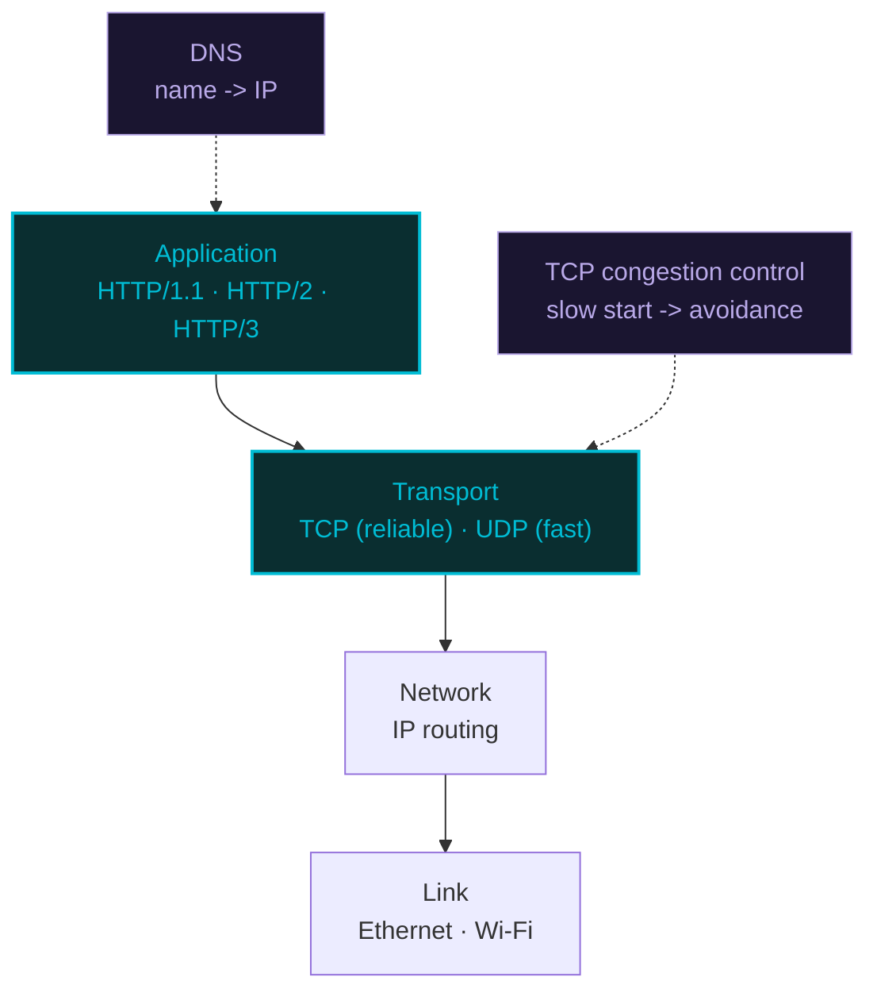

# Computer Networking — A Visual, Worked-Example Guide

> **Companion code:** [`computer_networking.py`](https://github.com/quanhua92/tutorials/blob/main/csfundamentals/computer_networking.py).
> **Live demo:** [`computer_networking.html`](./computer_networking.html)

---

## 0. TL;DR — the one idea

> **The analogy:** The internet is a **postal system for unreliable postcards**. Each postcard (packet) can
> be lost, duplicated, or arrive out of order. **TCP** is the certified-mail clerk that turns that chaos into a
> reliable, in-order byte stream: it shakes hands (`SYN`/`SYN-ACK`/`ACK`), numbers every postcard so the receiver
> can reassemble them, throttles the sender when the network gets congested (congestion control), and politely
> closes the conversation (`FIN`/`ACK`/`FIN`/`ACK`). **DNS** is the phonebook that turns `www.example.com` into an
> IP address by walking a hierarchy of name servers. **HTTP** is the application-level envelope format, which
> evolved from one-request-per-letter (HTTP/1.1) to many-things-per-letter (HTTP/2 multiplexing) to a whole new
> courier built on UDP (HTTP/3 over QUIC).



This bundle covers the four interview-tested networking mechanisms:

| # | Mechanism | Layer | Key Property |
|---|---|---|---|
| 1 | **TCP 3-way handshake** | Transport | Establishes reliable, bidirectional byte stream in 1 RTT |
| 2 | **TCP congestion control** | Transport | AIMD: probe for bandwidth, back off on loss |
| 3 | **DNS resolution** | Application | Recursive + iterative queries over a hierarchical namespace |
| 4 | **HTTP/1.1 → 2 → 3** | Application | Each version kills a bottleneck (HOL, setup RTT) of the previous |

---

## 1. How It Works

### 1.1 TCP 3-way handshake — establish a reliable connection

> **Idea:** Before any data flows, both endpoints agree on **initial sequence numbers (ISNs)** so they can detect
> lost, duplicated, and reordered segments. Three segments do it: `SYN`, `SYN-ACK`, `ACK`. Each of `SYN` and `SYN`
> consumes one sequence number; pure `ACK`s consume none.

> From `computer_networking.py` Section "TCP 3-Way Handshake" (client_isn=1000, server_isn=5000):

```
#   direction            flags     seq    ack   note
--  -------------------  --------  ----   ----  ----------------------
1   client -> server     SYN       1000   0    synchronize, client_isn
2   server -> client     SYN-ACK   5000   1001 synchronize + acknowledge
3   client -> server     ACK       1001   5001 finalize handshake

client final: client[ESTABLISHED] snd_nxt=1001 rcv_nxt=5001
server final: server[ESTABLISHED] snd_nxt=5001 rcv_nxt=1001
```

The handshake is **1 RTT**: segment 1 (SYN) flies out, segment 2 (SYN-ACK) is the reply — that's one round trip.
Segment 3 (ACK) can **piggyback data**, so the first byte of payload rides for free on the final ACK.

**State machine (connection establishment):**

```
client                                   server
  |                                        |
  | --- SYN, seq=1000 ------------------->|  LISTEN
  |                       SYN_SENT        |  -> SYN_RCVD
  |<-- SYN-ACK, seq=5000, ack=1001 -------|
  |  -> ESTABLISHED                        |
  | --- ACK, ack=5001 ( + data ) -------->|  -> ESTABLISHED
```

**4-way teardown** (graceful close): the active closer sends `FIN`, the other side `ACK`s, then later sends its
own `FIN`, which gets the final `ACK`. The closer that sent the last `ACK` enters `TIME_WAIT` for `2·MSL`
(maximum segment lifetime, typically 60-120s) to absorb stray retransmitted segments.

```
1   client -> server     FIN       active close (no more data)
2   server -> client     ACK       acknowledge client FIN
3   server -> client     FIN       passive close
4   client -> server     ACK       final ack, then 2*MSL wait
```

---

### 1.2 TCP congestion control — Reno AIMD

> **Idea:** The sender has no idea how much bandwidth the path supports, so it **probes** by increasing its
> congestion window (`cwnd`, in MSS segments) until it detects loss, then **backs off**. Reno uses **Additive
> Increase, Multiplicative Decrease (AIMD)**:

- **Slow start:** `cwnd` doubles every RTT (exponential) while `cwnd < ssthresh`.
- **Congestion avoidance:** `cwnd += 1` MSS per RTT (linear) once `cwnd >= ssthresh`.
- **Fast recovery** (3 duplicate ACKs): a "mild" loss — halve: `ssthresh = cwnd/2`, `cwnd = ssthresh`, stay in
  avoidance (no retransmit storm).
- **Timeout:** a "severe" loss — `ssthresh = cwnd/2`, `cwnd = 1`, restart slow start.

> From `computer_networking.py` Section "TCP Congestion Control" (ssthresh=16, loss @ RTT 9 & 16):

```
RTT  state                cwnd  ssthresh  event
  1  slow_start              1        16  -
  2  slow_start              2        16  -
  3  slow_start              4        16  -
  4  slow_start              8        16  -
  5  congestion_avoidance    16        16  -        <- crosses ssthresh, switch to linear
  6  congestion_avoidance    17        16  -
  7  congestion_avoidance    18        16  -
  8  congestion_avoidance    19        16  -
  9  congestion_avoidance    20        16  dup_ack  <- 3 dup ACKs: halve cwnd
 10  congestion_avoidance    10        10  -        <- cwnd=10, ssthresh=10
  ...
 16  congestion_avoidance    16        10  timeout  <- timeout: reset to 1
 17  slow_start              1         8  -        <- cwnd=1, ssthresh=8
 18  slow_start              2         8  -
 19  slow_start              4         8  -
 20  congestion_avoidance     8         8  -
  ...

peak cwnd = 20 MSS
cwnd sequence: [1, 2, 4, 8, 16, 17, 18, 19, 20, 10, 11, 12, 13, 14, 15, 16, 1, 2, 4, 8, 9, 10, 11, 12]
```

The classic **sawtooth** is visible: exponential ramp (1→2→4→8→16), linear climb (16→17→...→20), multiplicative
drop (20→10), linear climb again (10→...→16), then a timeout resets to 1 and the sawtooth restarts.

**Why AIMD is "fair":** if two flows share a bottleneck, the one with the larger `cwnd` loses more on each
multiplicative decrease, so they **converge** to equal shares. A flow that increases linearly but decreases
multiplicatively cannot dominate another identical flow long-term.

---

### 1.3 DNS resolution — recursive + iterative queries

> **Idea:** A hostname like `www.example.com` is a path through a **hierarchical namespace** read right-to-left:
> root (`.`) → TLD (`com.`) → authoritative (`example.com.`) → host (`www`). The **stub resolver** (in the OS)
> sends one **recursive** query to a **recursive resolver** (your ISP or 8.8.8.8), which then performs the
> **iterative** walk through root → TLD → authoritative and returns the final IP.

> From `computer_networking.py` Section "DNS Resolution" (resolving `www.example.com`):

```
#   querier               server                 query            result
1   stub_resolver          recursive_resolver     A (recursive)   please resolve fully
2   recursive_resolver     root_server            NS (referral)   referral -> com. TLD servers
3   recursive_resolver     tld_server             NS (referral)   referral -> example.com. auth servers
4   recursive_resolver     authoritative_server   A               referral -> ns.example.com
5   recursive_resolver     stub_resolver          A (answer)      93.184.216.34 TTL=3600

resolved IP = 93.184.216.34   TTL = 3600s   hops = 6

--- second lookup (answer now cached) ---
resolved IP = 93.184.216.34   hops = 1   path = ['browser_cache']
```

**The recursion vs. iteration distinction:**
- **Recursive** (stub → resolver): "I want the final answer; you do the walking."
- **Iterative** (resolver → each name server): "Give me the next hop; I'll continue myself."

Once resolved, the answer is **cached at every layer** (browser, OS, resolver) for its **TTL**. The second lookup
for the same name is a single browser-cache hit — zero network traffic.

**Cache hierarchy and TTL:**

| Cache | Typical TTL | When it's consulted |
|---|---|---|
| Browser | 60-300s (per-origin) | First |
| OS (`/etc/hosts`, resolver cache) | TTL from record | Second |
| Recursive resolver | TTL from record | Third (does the iterative walk only on miss) |
| Root / TLD / Authoritative | Days | Only the recursive resolver talks to these |

---

### 1.4 HTTP/1.1 vs HTTP/2 vs HTTP/3

> **Idea:** Each HTTP version removes a bottleneck of its predecessor. HTTP/1.1 serializes requests per
> connection (head-of-line blocking); HTTP/2 multiplexes many streams over one TCP connection with HPACK header
> compression; HTTP/3 moves to **QUIC over UDP** so that a lost packet no longer stalls unrelated streams
> (no TCP-level HOL) and connection setup collapses to 1 RTT (or 0-RTT on resumption).

> From `computer_networking.py` Section "HTTP Comparison" (1 HTML + 12 resources, each 1 RTT):

```
version   transport              setup fetch total  notes
-------   ---------              ----- ----- -----  -----
HTTP/1.1  TCP + TLS 1.2              3     2     5  6 conns, HOL blocking
HTTP/2    TCP + TLS 1.3              2     1     3  multiplexed
HTTP/3    QUIC (UDP) + TLS 1.3       1     1     2  multiplexed

totals: HTTP/1.1=5 RTT, HTTP/2=3 RTT, HTTP/3=2 RTT
```

- **Setup RTT:** HTTP/1.1 needs TCP (1 RTT) + TLS 1.2 (2 RTT) = 3. HTTP/2 over TLS 1.3 = 2. **HTTP/3 fuses the
  transport and crypto handshakes into QUIC's single 1-RTT handshake** (or 0-RTT with cached credentials).
- **Fetch RTT:** HTTP/1.1 opens ~6 parallel TCP connections and serves resources sequentially on each →
  `ceil(12/6) = 2` RTTs (head-of-line blocking per connection). HTTP/2 and HTTP/3 multiplex all 12 streams over
  one connection → **1 RTT**.

**Header compression:**

```
raw header size (HTTP/1.1) = 547 bytes
HTTP/2  HPACK              = 121 bytes  (22.1% of raw)
HTTP/3  QPACK              = 121 bytes  (22.1% of raw)
```

HPACK (HTTP/2) and QPACK (HTTP/3) replace repeated headers (`:method: GET`, `host:`, ...) with small static-table
indexes. QPACK exists because **HPACK assumes in-order delivery** — which TCP gives but QUIC's independent streams
do not, so QPACK adds explicit stream references to tolerate reordering.

**Feature matrix:**

| Feature | HTTP/1.1 | HTTP/2 | HTTP/3 |
|---|---|---|---|
| Transport | TCP | TCP | QUIC (UDP) |
| Multiplexing | no | yes | yes |
| Head-of-line block | per-connection | TCP-level | **none** |
| Header format | text | binary + HPACK | binary + QPACK |
| Server push | no | yes | removed |
| Mandatory TLS | no | no (in practice yes) | **yes (TLS 1.3)** |
| 0-RTT resume | no | no | **yes** |

---

## 2. The Math

### TCP handshake cost

Establishing a TCP connection costs **1 RTT** (SYN out, SYN-ACK back). Adding TLS 1.2 adds 2 more RTT; TLS 1.3
adds 1. QUIC merges both into 1 RTT (0 on resumption):

```
HTTP/1.1 (TCP + TLS 1.2): 1 + 2 = 3 RTT
HTTP/2   (TCP + TLS 1.3): 1 + 1 = 2 RTT
HTTP/3   (QUIC + TLS 1.3):       1 RTT   (0 RTT with 0-RTT resume)
```

### Slow-start doubling

With `cwnd` starting at 1 and doubling each RTT, the window after `k` RTTs is `2^k`. Reaching `ssthresh = 16`
takes `log2(16) = 4` RTTs (1→2→4→8→16). In **congestion avoidance**, growth is linear at +1 MSS/RTT, so climbing
from 16 to 20 takes 4 more RTTs.

### Congestion avoidance throughput

The average `cwnd` over a sawtooth from `W/2` to `W` (with periodic dup-ACK losses) is `(3/4)·W`. The loss rate
`p` that keeps a flow at window `W` is given by the **Mathis formula**:

```
throughput <= MSS · (8/RTT) / sqrt(p)
```

A 1% loss rate (`p = 0.01`) caps a 1500-byte-MSS, 50ms-RTT flow at `1500·8·(1/0.05) / ... ≈ 12 Mbps` — this is
why TCP performance collapses on lossy (e.g., wireless) links, motivating QUIC's smarter loss recovery.

### DNS lookup cost

A cold DNS resolution costs up to **4 RTT** (stub→resolver, resolver→root, resolver→TLD,
resolver→authoritative), but in practice the recursive resolver **caches** TLD referrals, so a warm lookup is
usually 1 RTT (stub → cached resolver). Browser + OS caching then makes repeat lookups **0 RTT**.

### HTTP fetch total

For `N` resources after the connection is established:

```
fetch_rtt = 1                 if multiplexed (HTTP/2, HTTP/3)
fetch_rtt = ceil(N / C)       if C parallel connections (HTTP/1.1)
total_rtt = setup_rtt + fetch_rtt
```

With N=12, C=6: HTTP/1.1 = 3 + 2 = 5; HTTP/2 = 2 + 1 = 3; HTTP/3 = 1 + 1 = 2.

---

## 3. Tradeoffs

| Choice | Pros | Cons | Best For |
|---|---|---|---|
| **TCP** | Reliable, ordered, flow + congestion control | Higher latency, head-of-line blocking | Web, email, file transfer, SSH |
| **UDP** | Fast, connectionless, no HOL blocking | No guarantees on order/reliability | DNS, streaming, gaming, VoIP |
| **HTTP/1.1** | Simple, universally supported | HOL blocking, verbose headers | Legacy, simple APIs |
| **HTTP/2** | Multiplexing, HPACK, server push | Still TCP-level HOL on packet loss | Modern web over TCP |
| **HTTP/3** | No TCP HOL, 1-RTT setup, 0-RTT resume | UDP blocked on some networks/firewalls | Mobile, lossy links, latency-critical |
| **Recursive DNS** | One round-trip for the client | Heavy load on the resolver | Stub resolvers (the norm) |
| **Iterative DNS** | Distributes load | Client does the walking | Resolvers talking to root/TLD/auth |

**Decision guide:**
- Need reliability + ordering over a flaky path? → **TCP** with modern congestion control (BBR).
- Real-time, can tolerate loss? → **UDP** (or QUIC if you also want reliability).
- New web service? → **HTTP/2** minimum; **HTTP/3** where supported (mobile, CDNs).
- Sticky DNS failover? → Anycast or low-TTL DNS; beware resolver TTL caching.

---

## 4. Real-World Usage

| System | Mechanism | Notes |
|---|---|---|
| **Linux TCP stack** | Cubic (default), BBR (optional) | Cubic is the default congestion controller; BBR (Google) models bottleneck bandwidth instead of loss |
| **Google QUIC** | HTTP/3 transport | ~50% of Google's traffic ran on QUIC before standardization; cut search latency ~8% |
| **Cloudflare** | HTTP/3 + 0-RTT | Edge terminates QUIC; 0-RTT resume on repeat visits |
| **BIND / Unbound** | Recursive DNS resolver | Unbound is a validating, caching resolver; BIND is the reference authoritative server |
| **DNS over HTTPS (DoH) / TLS (DoT)** | Encrypted DNS | Defeats ISP snooping and tampering at the cost of losing OS-level caching |
| **Anycast DNS** (8.8.8.8, 1.1.1.1) | Geo-distributed resolvers | The same IP is announced from hundreds of locations; BGP routes to the nearest |
| **Nginx / Envoy** | HTTP/2 + gRPC | gRPC uses HTTP/2 multiplexed streams for many concurrent RPCs over one connection |

---

### Killer Gotchas

- **TIME_WAIT exhaustion:** A server that opens/closes many short connections accumulates `TIME_WAIT` sockets
  (each held for `2·MSL`). At high churn this can exhaust ephemeral ports. **Fix:** `SO_REUSEADDR`, longer
  keep-alive, or let the *client* close first.

- **TCP head-of-line blocking still haunts HTTP/2:** HTTP/2 multiplexes streams over *one* TCP connection, so a
  single lost TCP packet stalls *all* HTTP/2 streams until retransmitted. This is the core motivation for
  HTTP/3's move to QUIC, where each stream has independent loss recovery.

- **SYN floods:** An attacker sends thousands of `SYN`s without completing the handshake, exhausting the
  server's half-open connection table. **Fix:** SYN cookies (stateless handshake), or front the server with a
  SYN-flood-aware load balancer.

- **Bufferbloat defeats congestion control:** Oversized router buffers let `cwnd` grow far past the true
  bottleneck, causing latency spikes (not loss), so loss-based congestion control (Reno/Cubic) under-reacts.
  **Fix:** BBR, which controls latency directly via bandwidth/RTT estimation.

- **DNS TTL caching defeats failover:** If you fail over to a backup IP but resolvers cached the old record for
  its TTL, users keep hitting the dead server. A 300s TTL can mean 5 minutes of misdirected traffic at
  corporate/ISP resolvers that ignore TTL. **Fix:** low TTLs *before* an incident, or Anycast (BGP-based,
  seconds reconvergence).

- **0-RTT is replay-vulnerable:** HTTP/3's 0-RTT resume retransmits early data, which an attacker can capture
  and replay. **Fix:** only allow 0-RTT for idempotent requests (GET); require 1-RTT for anything mutating.

- **NAT breaks TCP keep-alive:** Home/CGN NATs time out idle mappings after 60-120s, silently dropping the TCP
  connection. **Fix:** application-level keep-alive pings every 30s, or QUIC (designed to survive NAT migration
  via connection IDs).

- **HPACK is order-dependent, QPACK is not:** HPACK's dynamic table assumes in-order compressed-header delivery
  (TCP guarantees this). QUIC streams are independent, so HTTP/3 had to invent QPACK with explicit stream
  references. Don't assume "HPACK and QPACK are the same."

- **Slow start is brutal for short flows:** A small API response (2 KB) sent over a fresh connection spends its
  whole life in slow start (cwnd=1 → 2), never reaching the true bottleneck bandwidth. **Fix:** TCP Fast Open
  (data in the SYN), QUIC 0-RTT, or connection pooling / keep-alive to reuse warmed `cwnd`.

---

> **Companion code:** [`computer_networking.py`](https://github.com/quanhua92/tutorials/blob/main/csfundamentals/computer_networking.py)
> · **Live demo:** [`computer_networking.html`](./computer_networking.html)
> · **Output:** [`computer_networking_output.txt`](https://github.com/quanhua92/tutorials/blob/main/csfundamentals/computer_networking_output.txt)
> · ← back to [`index.html`](./index.html)
