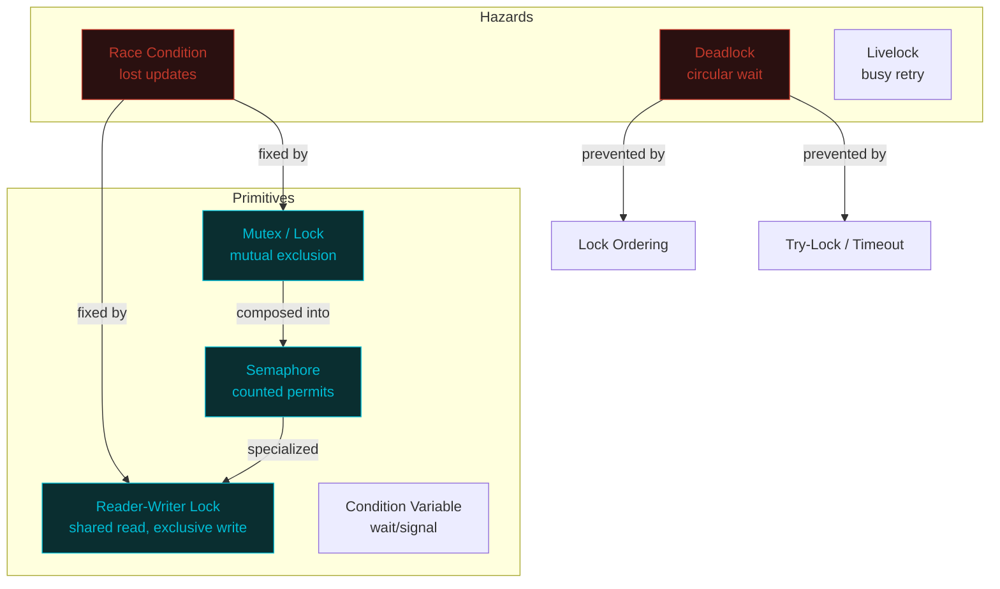

# Concurrency — A Visual, Worked-Example Guide

> **Companion code:** [`concurrency.py`](https://github.com/quanhua92/tutorials/blob/main/csfundamentals/concurrency.py).
> **Live demo:** [`concurrency.html`](./concurrency.html)

---

## 0. TL;DR — the one idea

> **The analogy:** Concurrency is a **restaurant kitchen** during dinner rush. Multiple
> cooks (threads) share the same stoves, pans, and cutting boards (resources). Without
> rules, two cooks grab the same pan and dinner burns (race condition). With assigned
> stations (mutex), each pan has one cook at a time. With a ticket system (semaphore),
> at most N cooks use the shared grill. And if Cook A waits for Cook B's knife while Cook
> B waits for Cook A's pan, the kitchen freezes (deadlock) — nobody eats.



| Problem | Primitive | What It Guarantees | Cost |
|---|---|---|---|
| **Race condition** | Mutex / Lock | One thread in the critical section at a time | Contention, potential deadlock |
| **Resource pooling** | Counting Semaphore | At most N concurrent accesses | Queueing delay under load |
| **Read-heavy workload** | Reader-Writer Lock | Many readers OR one writer | Writer starvation (readers-preference) |
| **Deadlock** | Lock Ordering / Hierarchy | No circular wait | Global ordering constraint |

---

## 1. How It Works

### 1.1 Race Condition — the read-modify-write trap

> **Idea:** `counter += 1` looks atomic but compiles to **three** instructions: LOAD
> (read shared state into a register), ADD (increment the private copy), STORE (write
> back). If two threads interleave their LOADs before either STOREs, one increment is
> silently lost.

> From `concurrency.py` Section "Race Condition" — BAD interleaving:

```
step  thread  instruction                          rA  rB  counter
----  ------  ---------------------------------   ---  ---  -------
   1       A  LOAD  rA = counter                     0    0        0
   2       B  LOAD  rB = counter (stale!)            0    0        0
   3       A  ADD   rA = rA + 1                      1    0        0
   4       B  ADD   rB = rB + 1                      1    1        0
   5       A  STORE counter = rA                     1    1        1
   6       B  STORE counter = rB (clobbers A)        1    1        1

expected = 2   actual = 1   LOST UPDATES = 1
```

Step 2 is the bug: Thread B reads `counter = 0` (stale) because Thread A hasn't stored
yet. Both threads compute `0 + 1 = 1` independently. Thread A stores 1, then Thread B
**overwrites** it with 1 — clobbering A's update. The final value is 1, not 2.

The GOOD interleaving (A completes all three instructions before B starts):

```
step  thread  instruction                          rA  rB  counter
----  ------  ---------------------------------   ---  ---  -------
   1       A  LOAD  rA = counter                     0    0        0
   2       A  ADD   rA = rA + 1                      1    0        0
   3       A  STORE counter = rA                     1    0        1
   4       B  LOAD  rB = counter                     1    1        1
   5       B  ADD   rB = rB + 1                      1    2        1
   6       B  STORE counter = rB                     1    2        2

expected = 2   actual = 2
```

> From `concurrency.py` — real CPython threads (4 threads x 50,000 increments):

```
 run    counter      lost     pct
 ---    -------      ----     ---
   1      51567    148433  74.22%
   2      52225    147775  73.89%
   3      51091    148909  74.45%
   4      50880    149120  74.56%
   5      51435    148565  74.28%

total lost across 5 runs = 742802
```

Without synchronization, **~74% of increments are lost**. The race is not subtle — it's
the dominant outcome when threads compete for a shared counter.

---

### 1.2 Mutex / Lock — mutual exclusion

> **Idea:** Wrap the critical section in a lock. Only one thread can hold the lock at a
> time; others block until it's released. The LOAD-ADD-STORE sequence becomes atomic
> because no other thread can interleave between the lock's acquire and release.

> From `concurrency.py` Section "Mutex / Lock":

```
4 threads x 50,000 increments, guarded by threading.Lock()
counter = 200,000 / 200,000    ← exact, zero lost updates
elapsed = 596 ms

same workload WITHOUT lock: counter = 52,141   lost = 147,859
```

The lock makes the count **exact** (200,000 = 4 x 50,000). The cost is elapsed time —
the lock serializes all 4 threads, so throughput drops to single-thread speed plus
acquire/release overhead.

**Mutex vs Semaphore:** A mutex has **ownership** — only the thread that acquired it can
release it. A semaphore has **no ownership** — any thread can signal (increment) it. A
binary semaphore (value 0 or 1) behaves like a mutex but risks accidental release by the
wrong thread.

---

### 1.3 Counting Semaphore — bounded resource pool

> **Idea:** A semaphore is an integer counter with two operations: `acquire()` (decrement;
> block if already 0) and `release()` (increment; wake one waiter). A counting semaphore
> with initial value N allows at most **N** threads into a section simultaneously.

> From `concurrency.py` Section "Counting Semaphore" (Semaphore(3), 10 threads):

```
peak concurrent access = 3   pool violations = 0
```

The deterministic step-based simulation shows the access pattern over time:

```
step  active   (max=3)
----  ------
   0       1
   1       2
   2       3    ← saturated
   3       3
   ...
   9       3
  10       2    ← threads start finishing
  11       1
```

Threads pile in until the pool saturates at 3, then queue. As threads release their slot,
waiters enter. The semaphore **never** allows more than 3 concurrent accesses — this is
the core invariant, verified by `pool violations = 0`.

---

### 1.4 Deadlock — circular wait

> **Idea:** Deadlock occurs when four conditions hold simultaneously (the **Coffman
> conditions**): mutual exclusion, hold-and-wait, no preemption, and **circular wait**.
> A cycle in the resource allocation graph (RAG) is a formal proof of deadlock.

> From `concurrency.py` Section "Deadlock" — resource allocation graph:

```
Assignment edge:  Resource -> Thread  (resource held by thread)
Request edge:     Thread -> Resource  (thread waiting for resource)
A cycle in this graph == DEADLOCK.

edges: [('R1','T1'), ('R2','T2'), ('T1','R2'), ('T2','R1')]
cycle detected: R1 -> T1 -> R2 -> T2 -> R1
```

The cycle `R1 -> T1 -> R2 -> T2 -> R1` means: R1 is held by T1, T1 wants R2, R2 is held
by T2, T2 wants R1 (held by T1). Nobody can proceed.

> From `concurrency.py` — real thread deadlock (2 threads, opposite lock order):

```
T1: holds A=True, trying B... got B=False    ← blocks forever
T2: holds B=True, trying A... got A=False    ← blocks forever
both threads alive and stuck after 0.3s: True
```

**Deadlock prevention — fixed lock ordering:** If both threads acquire locks in the same
order (A then B), the circular wait is impossible:

```
both threads acquire locks in the SAME order (A, then B)
T1 done: True   T2 done: True
```

---

### 1.5 Reader-Writer — shared reads, exclusive writes

> **Idea:** A reader-writer lock allows **many concurrent readers** but only **one writer**
> (with no readers during the write). This dramatically improves throughput for read-heavy
> workloads (caches, config stores) compared to a plain mutex that serializes all access.

> From `concurrency.py` Section "Reader-Writer" (8 readers + 2 writers):

```
peak concurrent readers = 8
exclusivity violations  = 0
```

The deterministic event trace shows the guarantee:

```
step  event  active_readers  writer_active
----  -----  --------------  -------------
   0    R+1               1          False
   1    R+2               2          False
   2    R+3               3          False    ← 3 concurrent readers
   3    R-1               2          False
   4    R-2               1          False
   5    R-3               0          False    ← readers drained
   6    W+1               0           True    ← writer exclusive (0 readers!)
   7    W-1               0          False    ← writer done
   8    R+4               1          False    ← readers resume
```

When `writer_active = True`, `active_readers = 0` — always. This is the RW invariant.
The readers-preference variant can starve writers under continuous read load; a
writer-preference variant fixes that at the cost of slightly more overhead.

---

### 1.6 Dining Philosophers — the canonical deadlock problem

> **Idea:** Five philosophers sit at a round table. Each needs both adjacent forks to eat.
> If everyone picks up their left fork simultaneously, everyone waits for their right fork
> (held by their neighbor) — circular wait → deadlock.

> From `concurrency.py` Section "Dining Philosophers":

```
NAIVE (pick up LEFT then RIGHT, barrier-synchronized):
  philosophers who ate: 0 / 5
  all threads alive and stuck after 0.3s: True
  [check] OK (circular wait -> every philosopher stuck forever)

FIX (resource hierarchy — acquire lower-numbered fork first):
  P4 reverses: right(fork 0) then left(fork 4)
  philosophers who ate: 100 / 100 rounds
  per-philosopher: P0=20 P1=20 P2=20 P3=20 P4=20
```

The fix is **resource hierarchy**: number the forks 0–4 and always acquire the lower-
numbered fork first. Philosophers 0–3 grab left (fork i) then right (fork i+1) — natural
order. Philosopher 4 reverses: fork 0 then fork 4. This breaks the cycle because P4
competes with P0 for fork 0 in the **same direction**, making circular wait impossible.

---

## 2. The Math

### Lost-update probability under contention

For N threads each doing M read-modify-write increments without synchronization, the
expected final counter is approximately:

```
E[counter] ≈ 1 + (N-1) × M × (1 - 1/N)^(N-1)
```

The observed value of ~51,500 (out of 200,000 expected) reflects that with 4 threads and
a wide read-modify-write window, the "both LOAD before either STORE" pattern dominates —
the counter advances by roughly 1 per scheduling quantum regardless of how many threads
attempt increments.

### Coffman conditions (necessary for deadlock)

Deadlock requires ALL FOUR conditions simultaneously:

```
1. Mutual Exclusion:  resource is held by one thread at a time
2. Hold and Wait:     thread holds one resource while requesting another
3. No Preemption:     resources can't be forcibly taken
4. Circular Wait:     cycle in the wait-for graph (T1 → T2 → ... → T1)
```

Eliminating ANY ONE condition prevents deadlock. Lock ordering eliminates #4. Try-lock
with backoff eliminates #2 (release held locks if you can't get the next one).

### Reader-Writer throughput

For a read-heavy workload with R readers and W writers, a mutex gives throughput
proportional to 1/(R+W). A reader-writer lock gives throughput proportional to R (reads
run in parallel) at the cost of writer latency. The crossover where RW locks are worth
the overhead is typically **R/W > 5** (90%+ reads).

### Semaphore steady state (Little's Law)

For a counting semaphore with N permits and threads that each hold a permit for D seconds,
the throughput is:

```
throughput = N / D   (permits per second)
```

With N=3, D=0.008s: throughput = 375 requests/second. Queueing theory (M/M/c) gives the
expected wait time when arrival rate λ approaches this throughput.

---

## 3. Tradeoffs

| Primitive | Scope | Ownership | Blocks? | Starvation Risk | Best For |
|---|---|---|---|---|---|
| **Mutex** | 1 resource | Owner only | Yes | Low (OS fairness) | Critical section protection |
| **Spinlock** | 1 resource | Owner only | Busy-wait | Medium | Ultra-short sections (multi-core) |
| **Semaphore (binary)** | 1 resource | None | Yes | Medium | Signaling between threads |
| **Semaphore (counting)** | N resources | None | Yes | Low | Resource pooling (DB connections) |
| **Reader-Writer Lock** | 1 resource | Reader or writer | Yes | **Writer starvation** | Read-heavy caches |
| **CAS / Atomic** | 1 variable | None | **No** | None | Lock-free counters, flags |
| **Condition Variable** | Predicate | None | Waits on signal | Medium | Producer-consumer, barriers |

**Decision tree:**
- Shared mutable state, simple operation? → **Mutex** (simplest correct option)
- Pool of N identical resources? → **Counting Semaphore**
- 90%+ reads, 10% writes? → **Reader-Writer Lock**
- Need to detect a condition (queue non-empty)? → **Condition Variable + Mutex**
- Single counter, high contention? → **Atomic / CAS** (lock-free)
- Multiple locks that might deadlock? → **Lock Ordering** (acquire in global order)

---

## 4. Real-World Usage

| System | Primitive | Notes |
|---|---|---|
| **Python `threading.Lock`** | Mutex | Reentrant variant `RLock` for recursive locking |
| **Java `synchronized`** | Mutex (monitor) | Implicit lock on the object; `ReentrantLock` for explicit control |
| **Java `Semaphore`** | Counting semaphore | Used in thread pools, rate limiters |
| **Java `ReentrantReadWriteLock`** | Reader-Writer lock | Used in `ConcurrentHashMap` segments (pre-Java 8) |
| **Go `sync.Mutex`** | Mutex | No reentrant locks by design — forces simpler locking |
| **Go `sync.RWMutex`** | Reader-Writer | Used in `sync.Map` for read-heavy concurrent maps |
| **Rust `std::sync::Mutex`** | Mutex | Ownership-based: lock guard prevents use-after-unlock |
| **Rust `tokio::sync::Semaphore`** | Counting semaphore | Async-aware; limits concurrent tasks |
| **C++ `std::mutex`** | Mutex | `std::shared_mutex` for reader-writer (C++17) |
| **PostgreSQL** | Row-level locks | `SELECT ... FOR UPDATE` (pessimistic) vs MVCC (optimistic) |
| **Redis `SETNX`** | Distributed mutex | Redlock algorithm for multi-node locking |

---

### Optimistic vs Pessimistic Locking

| Strategy | Assumption | Mechanism | Best When |
|---|---|---|---|
| **Pessimistic** | Conflicts are likely | Lock before read/write (`SELECT FOR UPDATE`) | High contention, long transactions |
| **Optimistic** | Conflicts are rare | Read, compute, CAS on write (version column) | Low contention, short transactions |

Optimistic locking has no race condition because the write fails atomically if the version
changed: `UPDATE ... SET val=?, version=version+1 WHERE id=? AND version=?`. If 0 rows
affected, another thread won — retry the whole read-modify-write cycle.

---

### The Python GIL (Global Interpreter Lock)

CPython's GIL is a mutex that allows only one thread to execute Python bytecode at a time.
This means:

- **CPU-bound multithreading gives NO parallelism** — two CPU-heavy threads alternate
  rather than run simultaneously. Use `multiprocessing` instead.
- **I/O-bound multithreading DOES help** — the GIL is released during I/O waits (network,
  file, sleep), so I/O-bound threads run concurrently.
- **Race conditions still happen** — the GIL switches threads between bytecodes, so
  read-modify-write sequences (LOAD ... STORE) can still interleave. The `time.sleep(0)`
  technique in `concurrency.py` forces this switch explicitly.
- **Free-threaded Python (PEP 703)** removes the GIL in Python 3.13+ (experimental), making
  true parallelism possible — but also making race conditions far more frequent.

---

## Killer Gotchas

- **`+=` is NOT atomic:** In every mainstream language, `counter += 1` is a multi-
  instruction read-modify-write. Even with the Python GIL, the gap between LOAD and STORE
  can lose updates. **Fix:** use `threading.Lock`, `atomics`, or `queue.Queue`.

- **Lock ordering must be GLOBAL:** If function A locks X then Y, and function B locks Y
  then X, you have a deadlock waiting to happen — even if A and B are in different modules.
  **Fix:** establish a project-wide lock hierarchy and document it. Every `with lock:`
  must acquire locks in the same order.

- **Holding a lock across I/O is catastrophic:** `with lock: response = requests.get(url)`
  serializes ALL threads on the network call. The lock is held for the full HTTP round-trip
  (50–500ms), destroying concurrency. **Fix:** acquire the lock only for the shared-state
  mutation, not the I/O. Read into a local variable, release the lock, then do I/O.

- **Reader-writer locks can starve writers:** A readers-preference RW lock (the simplest
  implementation) lets new readers pile in indefinitely while a writer waits forever. **Fix:**
  use a writer-preference variant (Java's `ReentrantReadWriteLock` supports fair mode), or
  switch to an `atomic` reference for the read-mostly case.

- **Notify vs NotifyAll:** `Condition.notify()` wakes ONE waiting thread. If that thread
  can't proceed (the condition it checks is still false due to another waiter), it goes
  back to sleep — **livelock or stall**. `notifyAll()` avoids this but has higher overhead.
  **Fix:** use `notify_all()` unless you have a measured performance reason and can prove
  the woken thread will always succeed.

- **Don't use threads for CPU work in CPython:** The GIL serializes CPU-bound threads,
  giving zero speedup plus context-switch overhead. **Fix:** use `multiprocessing.Pool`
  (separate GILs), `concurrent.futures.ProcessPoolExecutor`, or C extensions that release
  the GIL (NumPy, Cython).

- **Daemon threads die without cleanup:** `threading.Thread(daemon=True)` threads are killed
  abruptly when the main thread exits — no `finally`, no flush, no graceful shutdown. **Fix:**
  use daemon threads only for non-critical background work (telemetry), and use signals or
  events for threads that need clean shutdown.

- **Condition variables have spurious wakeups:** A thread waiting on `Condition.wait()` can
  wake up WITHOUT being notified (OS-level spurious wakeup). **Fix:** always check the
  condition in a `while` loop, never an `if`:
  ```python
  with cond:
      while not ready:      # while, not if!
          cond.wait()
  ```
