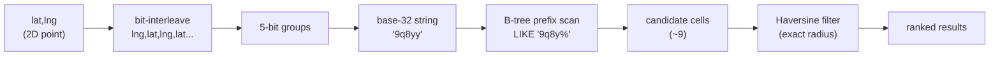
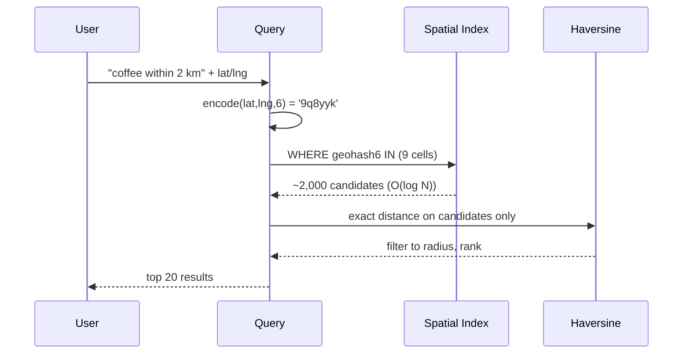

# Geohashing — Spatial Indexing with a 1D String

> **Companion code:** [`geohashing.py`](https://github.com/quanhua92/tutorials/blob/main/csfundamentals/geohashing.py).
> **Live demo:** [`geohashing.html`](./geohashing.html)

---

## 0. TL;DR — the one idea

> **The analogy:** a geohash is a game of 20 questions that shrinks a box around
> your location. *East or west?* (1 bit.) *North or south?* (1 bit.) Repeat,
> halving one axis each time. Every 5 bits becomes one base-32 character. The
> string is the **path** of nested boxes — and two strings that share a **prefix**
> live in the same bigger box, so they are **close**.

A B-tree index is 1D; geographic proximity is 2D. Geohash flattens the 2D surface
into 1D in a way that (mostly) preserves locality, so a prefix query
`WHERE geohash LIKE '9q8y%'` rides an ordinary B-tree range scan instead of an
O(N) full-table Haversine.



---

## 1. How It Works

### Encoding — interleave, then base-32

Longitude bits sit in **even** positions (bit 0, 2, 4, …), latitude bits in **odd**
positions. Each bit halves **one** axis; every 5 bits (one base-32 char) cut area
to **1/32**. From `geohashing.py` Section A, encoding `(42.6, -5.6)`:

```
pos  axis   bit   | char
  0  lng       0
  1  lat       1
  2  lng       1
  3  lat       0
  4  lng       1   -> 'e'      <- first char already pins a ~5000 km box
  ...
bitstream = 01101 11111 11000 00100 00010
encode(42.6, -5.6, 5) = 'ezs42'
```

The base-32 alphabet is `0123456789bcdefghjkmnpqrstuvwxyz` — note `a, i, l, o` are
**omitted** (they look like digits or each other when read aloud).

### Decoding — a geohash names a CELL, not a point

`decode('ezs42')` returns a rectangular box, not a coordinate:

```
lng range = [-5.62500, -5.58105]   width  = 0.04395 deg
lat range = [ 42.58301, 42.62695]  height = 0.04395 deg
centre    = (lat 42.60498, lng -5.60303)
```

Every point inside that box encodes to `ezs42`; the centre is just the canonical
representative. This is why round-tripping `encode → decode → encode` is stable:
the decode centre re-encodes back to the same string.

### Neighbours — the 9-cell query

A cell has 8 neighbours (N, S, E, W + 4 diagonals). `geohashing.py` computes them
by **decode → step one full cell over → re-encode** (robust to direction labels).
For San Francisco `'9q8yy'` (precision 5):

```
   9q8zj   9q8zn   9q8zp
   9q8yv   9q8yy   9q8yz
   9q8yt   9q8yw   9q8yx
```

A proximity query reads **all 9** of these: `WHERE geohash5 IN (?, ?, …, ?)`.

---

## 2. The Math

> From `geohashing.py` Section C. `lng_bits = ceil(5p/2)`, `lat_bits = floor(5p/2)`
> because the **first** bit is longitude. 1° ≈ 111.32 km at the equator.

| precision | lat bits | lng bits | cell size | what it pins |
|---|---|---|---|---|
| 1 | 2 | 3 | 5009 × 5009 km | continent |
| 3 | 7 | 8 | 156 × 157 km | state |
| 5 | 12 | 13 | 4.89 × 4.89 km | neighbourhood |
| 6 | 15 | 15 | 611 × 1223 m | city block (Yelp default) |
| 8 | 20 | 20 | 19.1 × 38.2 m | building / delivery pin |

**Each added character multiplies area by exactly 1/32** (2⁵ finer boxes):

```
[check] p5 area / p6 area = 32.00x   (== 32)
```

Longitude km scales with `cos(latitude)` — a cell near the poles is physically
**narrower** east-west than one at the equator at the same precision. The table
uses the equator value; at lat 60° a precision-6 cell is ~half as wide.

---

## 3. Tradeoffs

| Option | Pros | Cons |
|---|---|---|
| **Geohash (Z-order)** | One B-tree, trivial `LIKE` prefix scan; Redis `GEOADD` stores 52-bit geohash as a sorted-set score | Boundary discontinuity; non-uniform cell area near poles |
| **Google S2 (Hilbert)** | Better locality (no quadrant jumps); uniform-area cells at all latitudes; 30 levels | Heavier; custom cell ID encoding |
| **Quad-tree** | Adaptive (dense areas subdivide more); µs in-memory lookups | Not durable; periodic rebuild; per-region trees |
| **Uber H3 (hex)** | 6 equidistant neighbours; ~30% fewer false positives vs 9-cell | Hex math; fixed resolutions |
| **PostGIS GiST** | Full spatial SQL (`ST_DWithin`); up to ~10M points | Heavier than a plain B-tree; no built-in text+geo combo |
| **Elasticsearch BKD** | Geo + full-text + numeric in one Lucene pass; 50M+ points | Operational weight of ES cluster |

---

## 4. Real-World Usage

- **Redis `GEOADD` / `GEOSEARCH`** — stores a 52-bit integer geohash as a sorted-set
  score; prefix/range queries become `ZRANGEBYSCORE`. In-memory, sub-ms, not durable.
- **PostgreSQL + geohash column** — `WHERE geohash6 IN (…9 cells…)` on a plain B-tree;
  simplest path up to ~10M points.
- **Elasticsearch BKD tree** — log-structured k-d tree; geo + full-text + numeric
  filters in one query pass. Yelp, Booking.com (~10–20 ms for 50M points).
- **Google Maps / Foursquare** — migrated to **S2** (Hilbert curve) for uniform-area
  cells and better locality than Z-order.

### Killer Gotchas

- **The boundary problem.** Two points ~1 cm apart, straddling a cell edge, get
  geohashes that diverge at the **last** character. From `geohashing.py` Section E:
  ```
  point W (just inside centre): (37.770996, -122.3876954) -> '9q8yyu'
  point E (just inside east)  : (37.770996, -122.3876952) -> '9q8yzh'
  shared prefix = 4 chars (precision 6) -> LIKE '9q8yy%' MISSES point E
  ```
  **Fix:** always query centre + 8 neighbours (9 cells); let Haversine refine.
- **Adjacency ≠ shared prefix.** Even a neighbour can diverge well before the last
  char — for `'9q8yy'` the north row diverges at char 4. You cannot assume a long
  prefix; you must enumerate the 9 cells explicitly.
- **Polar distortion.** Cells near the poles shrink east-west; a query in Helsinki
  returns fewer candidates than an identical one in Miami. S2 fixes this with
  cube-face projection.
- **Large radii.** When the search radius exceeds ~2× the cell size, 9 cells are
  not enough — enumerate every intersecting cell at that precision.

---

## 5. The two-phase search



Phase 1 is **expensive I/O** but narrows 50M → ~2,000; Phase 2 is **cheap compute**
(Haversine) applied only to the candidate set. Never Haversine-scan the full table.

---

> **Verify:** `python3 geohashing.py` prints every number above; the
> [interactive demo](./geohashing.html) recomputes `encode`/`decode`/neighbours in
> JavaScript and re-asserts the gold pins (encode(42.6,-5.6,5)=`ezs42`,
> encode(37.7749,-122.4194,5)=`9q8yy`, precision-6 ≈ 0.611 × 1.223 km).
