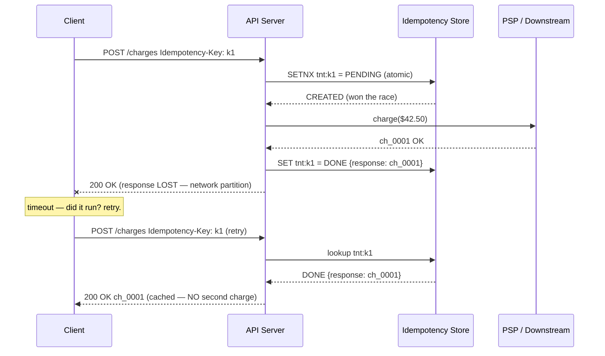

# Idempotency Patterns — A Visual, Worked-Example Guide

> **Companion code:** [`idempotency_patterns.py`](https://github.com/quanhua92/tutorials/blob/main/csfundamentals/idempotency_patterns.py).
> **Live demo:** [`idempotency_patterns.html`](./idempotency_patterns.html)

---

## 0. TL;DR — the one idea

> **The analogy:** Idempotency is a **coat-check with a numbered stub**. You hand
> in your coat once and get a stub. If you walk back up with the *same stub*,
> the attendant returns the *same ticket number* — they do **not** take a second
> coat. A **different** stub (or a stub with someone else's name scribbled over
> it) is refused. The stub is the **idempotency key**; the ticket number is the
> **cached response**; the scribble is a **request-hash mismatch**.

The whole field reduces to one invariant:

> **Retrying an operation must produce the same result as executing it once.**

Networks drop responses *after* the server has already done the work. A client
that times out cannot distinguish *"executed, response lost"* from *"never
received"*, so it **must** retry. Without idempotency that retry double-charges,
double-books, and double-sends. With it, the retry returns the cached result.



This bundle simulates five pillars end-to-end in pure stdlib:

1. **Idempotency key + dedup table** — the `PENDING`/`DONE` state machine,
   scoped keys, atomic reserve, cached-response replay
2. **At-least-once vs exactly-once delivery** — a broker that redelivers; naive
   vs idempotent consumer
3. **Retry with dedup** — the response-dropped-after-execution case
4. **Payment double-charge prevention** — the killer use case
5. **Request fingerprinting** — canonical-JSON SHA-256, key-reuse detection

---

## 1. How It Works

### 1.1 The dedup table — `PENDING` / `DONE` state machine

> **Idea:** Before doing *any* side effect, the server atomically reserves the
> client's idempotency key. The reserve is a single set-if-not-exists
> (`SETNX` / `INSERT ... ON CONFLICT DO NOTHING`), so among concurrent callers
> exactly one wins. The row then walks a two-state machine: `PENDING` while the
> work is in flight, `DONE` once the response is cached.

| reserve result | Meaning | Server action |
|---|---|---|
| `CREATED` | This caller won the race | Execute, then set `DONE` + store response |
| `PENDING` | Another worker is mid-flight | Return **409 Conflict** |
| `DONE` | Already completed | Return the **cached response** (no re-execution) |
| `HASH_MISMATCH` | Same key, **different** body | Return **422** (key reuse is a bug) |

The key is **scoped per tenant** (`{tenant_id}:{idempotency_key}`) so two
unrelated customers who happen to pick the same UUID cannot collide, and the row
carries a **24-hour TTL** aligned with the client retry window.

> From `idempotency_patterns.py` Section "Idempotency Key + Dedup Table":

```
Idempotency-Key = 9b3f1c2a-uuid-v4-key
request body    = {'amount': 4250, 'currency': 'USD', 'customer': 'cus_42'}
request_hash    = bf0d7a9898967ee1  (first 16)

Request 1 reserve -> CREATED      (execute, set DONE)
Request 2 reserve -> DONE         (same key, same body -> cached, NO exec)
Request 3 reserve -> CREATED      (different key reserves PENDING)
Request 4 reserve -> PENDING      (concurrent caller -> 409 Conflict)
Request 5: key reused with amount=4250 then amount=9999
           reserve -> HASH_MISMATCH  (422 — one key, two bodies)

PSP executions for 5 logical requests = 2
```

The proof that dedup works is a **count**: 5 logical requests produced only 2
PSP calls, because request 2 was served from cache.

> **Storage choice:**
> - **Redis `SETNX`** — fast (~1ms), built-in TTL, but idempotency state and the
>   business write live in *two* stores (a crash between them corrupts state).
> - **SQL `UNIQUE` constraint** — slower (~5ms) but the idempotency row and the
>   business write commit in the **same ACID transaction**. Correct by default.
> - **Dual (Redis + SQL)** — Stripe's pattern: Redis for speed, SQL for
>   durability. More operational complexity.
>
> For **payments, always prefer SQL** — correctness beats the 4ms.

---

### 1.2 At-least-once vs exactly-once delivery

> **Idea:** A message broker guarantees **at-least-once**: each message may
> arrive one or more times (ack lost, consumer rebalance, network blip).
> **Exactly-once *delivery* is provably impossible** (the Two Generals' Problem
> / FLP impossibility). The dominant production pattern is therefore
> **at-least-once delivery + an idempotent consumer** that dedups by event id —
> yielding **exactly-once *effect***.

> From `idempotency_patterns.py` Section "At-Least-Once vs Exactly-Once Delivery":

```
delivery log (9 deliveries, 5 unique events):
  ['evt_001','evt_001','evt_002','evt_003','evt_003','evt_003','evt_004','evt_005','evt_005']

NAIVE consumer (no dedup):     effects = 9   duplicates = 4   (evt_003 triple-processed!)
IDEMPOTENT consumer (dedup):   effects = 5   duplicates = 0

SUMMARY: 9 deliveries -> naive 9 effects, idempotent 5 effects
(the consumer owns idempotency, NOT the broker)
```

> **Kafka EOS scope:** Kafka's exactly-once-semantics applies **only** within
> Kafka-to-Kafka pipelines (producer → broker → consumer writing to another
> topic). External side effects — a Postgres write, an HTTP call — are **not**
> covered. The consumer must add its own idempotency at the boundary.

---

### 1.3 Retry with dedup — the response dropped *after* execution

> **Idea:** The dangerous case is not "the request never arrived" — it is "the
> server executed, then the response was lost." The client cannot tell the two
> apart, so it retries. Without an idempotency key, **every retry re-executes**;
> with one, the first attempt reserves + executes, and retries simply return the
> cached result.

> From `idempotency_patterns.py` Section "Retry with Dedup":

```
operations + retry patterns:
  create_order       attempts = ['drop', 'drop', 'ok']
  send_email         attempts = ['ok']
  update_inventory   attempts = ['drop', 'ok']
total attempts = 6      ('drop' = executed, response lost)

WITHOUT idempotency:  attempts = 6,  executions = 6   (3 duplicate side effects)
WITH idempotency:     attempts = 6,  executions = 3   (one per logical operation)

dedup saved 3 duplicate executions across 3 operations
```

The client retries with **exponential backoff** (`0.5s, 1.0s, 2.0s, 4.0s`,
capped) plus jitter. Retries always reuse the *same* idempotency key generated
before the first attempt.

---

### 1.4 Payment double-charge prevention — the killer use case

> **Idea:** A user clicks *Pay*. The PSP charges their card. The response never
> comes back (timeout). The user clicks again. **Without** an idempotency key
> the second click charges the card a second time — a double charge, the single
> most embarrassing bug in payments. **With** a key, the retry returns the cached
> charge.

> From `idempotency_patterns.py` Section "Payment Double-Charge Prevention":

```
charge = {'amount': 4250, ...}  ($42.50)
attempts = ['drop', 'ok']   (1st: charged, response lost; 2nd: retry)

WITHOUT Idempotency-Key:  ledger = [ch_0001:$42.50, ch_0002:$42.50]  total = $85.00  *** DOUBLE CHARGE ***
WITH Idempotency-Key:     ledger = [ch_0001:$42.50]                  total = $42.50  (safe)

PSP executions: without-dedup = 2, with-dedup = 1
customer overcharged without the key = $42.50
```

> The live demo (`idempotency_patterns.html`) lets you toggle the
> `Idempotency-Key` on/off and step through both attempts; the ledger rebuilds
> live and the total flips from `$42.50` (safe) to `$85.00` (double charge).

---

### 1.5 Request fingerprinting — key-reuse detection

> **Idea:** What if a client reuses an idempotency key with a *different* body?
> Silently honoring the new payload would be a silent bug; Stripe instead
> returns **409/422**. The dedup row stores `request_hash =
> SHA-256(canonical(body))`. On a second request with the same key, if the hash
> differs, the server refuses. The canonical form sorts keys and strips
> whitespace, so reordering or re-spacing cannot fool it.

> From `idempotency_patterns.py` Section "Request Fingerprinting":

```
body A = {"amount":4250,"currency":"USD","customer":"cus_42"}
body B = same values, reordered keys
body C = {"amount":9999,...}   (amount changed)

canonical(A) = {"amount":4250,"currency":"USD","customer":"cus_42"}
canonical(B) = {"amount":4250,"currency":"USD","customer":"cus_42"}   (identical)
SHA-256(A)   = bf0d7a9898967ee147d1077ccaa1fe83cf398dae06dbee72a63f2b97249929fd
SHA-256(B)   = bf0d7a9898967ee147d1077ccaa1fe83cf398dae06dbee72a63f2b97249929fd   (== A)
SHA-256(C)   = e4d40c1e8f21731cdbc059668581c94f2a1d908af46d7d0dfb8b00298e7fcda5   (!= A)

reordered keys hash identically?        [check] OK
changed amount produces different hash? [check] OK
digest is 64 hex chars (256 bits)?      [check] OK
```

> The live demo recomputes `SHA-256(A)` in pure JavaScript and prints
> `[check: OK] SHA-256 == .py` — the fingerprint is byte-for-byte identical to
> Python.

---

## 2. The Math

### Collision probability of an idempotency key

Clients generate a **UUID v4** (122 bits of randomness). The chance that two
independent requests collide is:

```
key space        = 2^122 ≈ 5.3 × 10^36
collision chance ≈ n² / (2 · 2^122)
```

At **1M requests/day** over a year (~3.65 × 10⁸ keys), the collision
probability is ~`1.3 × 10⁻²¹` — effectively zero. This is why UUID v4 is the
standard: you do not need a server-issued key.

### Why 24-hour TTL

A client retry window rarely exceeds minutes, but a background reconciliation job
may replay hours later. A **24h TTL** aligns the idempotency record lifetime
with the longest plausible replay while bounding storage growth:

```
TTL = 86400 s   →   record count ≈ QPS × 86400
```

At 1M requests/day that is ~1M rows/day, trivially handled by a sharded SQL
table or Redis with eviction.

### Delivery duplication rate

With at-least-once delivery and a redelivery rate `r`, a message is delivered
`1 + r` times on average. The naive consumer does `1 + r` units of work; the
idempotent consumer does exactly `1`:

```
redelivery rate r ≈ 0.001 (0.1%) in a healthy broker
naive effect multiplier   = 1 + r ≈ 1.001×  (and unbounded under rebalance storms)
idempotent effect multiplier = 1.0×         (constant, regardless of r)
```

In this bundle's deterministic scenario, `r = 4/5 = 0.8` (4 redeliveries over 5
unique messages) — a rebalance storm — making the difference dramatic: **9
deliveries → 5 effects**.

---

## 3. Tradeoffs

| Decision | Option A | Option B | When |
|---|---|---|---|
| **Key storage** | Redis `SETNX` (fast, ~1ms, split-state risk) | SQL `UNIQUE` (slower, ~5ms, ACID-safe) | Read-heavy → Redis; **payments → SQL** |
| **Delivery semantics** | At-most-once (drop on failure, lose work) | At-least-once + idempotent consumer (dominant) | Always at-least-once + idempotent consumer |
| **Concurrency race** | Return 409 while `PENDING` | Block until `DONE` | Low latency → 409; UX-critical → short block |
| **Distributed lock** | Lock only (Redlock) | Lock + **fencing token** | **Always pair with a fencing token** |
| **Multi-step txn** | 2PC (atomic, slow, blocks on partition) | Saga (compensating actions, eventually consistent) | Short span → 2PC; cross-service → Saga |
| **Compensation** | Rollback (undo) | Forward correction (new op) | Sagas are **forward-only**; compensations must be idempotent |

**Decision tree:**
- Critical side effect (money, inventory)? → **SQL idempotency table** + key header
- Async message consumer? → **dedup by event id** in a seen-set/DB
- Concurrent same-key requests? → atomic reserve, **409** for the loser
- Distributed lock protecting a write? → **fencing token** (monotonic); storage rejects stale tokens
- Transaction spans 3+ services? → **orchestrated Saga** (Temporal), each step + its compensation idempotent

---

## 4. Real-World Usage

| System | Idempotency approach | Notes |
|---|---|---|
| **Stripe** | `Idempotency-Key` header on all POSTs; Redis + SQL dual store | Returns cached response on retry; **409** on key+body mismatch |
| **AWS SQS** | At-least-once delivery; consumer dedups by `MessageDeduplicationId` | Content-based dedup hashes the body for FIFO queues |
| **Kafka** | Producer idempotence (PID + sequence number); EOS for Kafka-to-Kafka | External side effects need **separate** consumer idempotency |
| **Temporal** | Event-sourced workflows; Activities are auto-retried and must be idempotent | Replays history on crash; compensations are guaranteed to complete |
| **HTTP (RFC 9110)** | `POST` is non-idempotent by default; `GET/PUT/DELETE` are idempotent | Safe retry needs a key even on `PUT` if creation-vs-update matters |
| **Webhooks (Stripe/Square)** | Signed event id; receiver dedups by `event_id` | PSPs themselves retry webhooks on non-2xx — dedup is mandatory |
| **Postgres** | `INSERT ... ON CONFLICT (scoped_key) DO NOTHING` + `UNIQUE` constraint | Atomic reserve in the same transaction as the business write |

---

## Killer Gotchas

- **The TOCTOU race:** Two workers both read "key not found" before either
  writes, then both execute. **Fix:** the reserve MUST be atomic —
  `SETNX` or `INSERT ... ON CONFLICT DO NOTHING`. Never a read-then-write
  across two statements.

- **Response lost *after* execution is the whole problem:** If your mental model
  is "retry = request never arrived," you will under-design. The dangerous case
  is the server **already charged** and the client never saw the 200. The
  idempotency key is the only thing that makes the retry safe.

- **One key, one payload:** Reusing a key with a different body is a client bug.
  Store `request_hash` and return **422** on mismatch — silently honoring the
  new payload causes ghost charges. (Section 1.5.)

- **Distributed locks need fencing tokens:** A GC pause longer than the lock TTL
  leaves two processes believing they hold the lock. **Fix:** a monotonically
  increasing token (ZooKeeper zxid, etcd revision, Redis Lua CAS); storage
  rejects writes carrying a stale token. Redlock alone is insufficient.

- **Kafka EOS does not cross the boundary:** Exactly-once holds only for
  Kafka→Kafka. The moment your consumer writes to Postgres or calls an HTTP API,
  you are back to at-least-once and must dedup yourself.

- **Compensations are not rollbacks:** A Saga compensation is a **new, forward
  business operation** (refund the charge, release the seat) and must itself be
  idempotent — it can be retried if it fails.

- **Expire PENDING keys:** A crash between reserve and complete leaves a
  `PENDING` row forever. A background job reconciles `PENDING` rows older than
  the execution timeout — re-running or failing them.

- **Money is integers:** Store amounts in minor units (cents), never float.
  `$42.50` is `4250`. Floating-point money causes rounding drift and auditors
  will find it.

- **Forward the key downstream:** In a Saga, pass the idempotency key to every
  downstream service so the whole chain is dedup-protected, not just the
  entrypoint.
