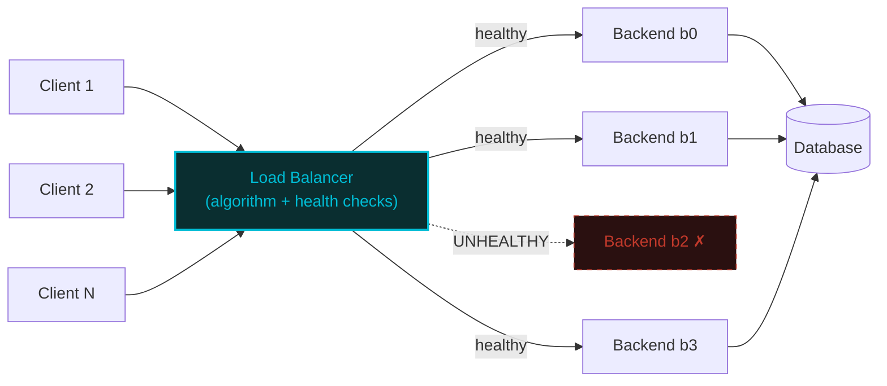

# Load Balancer — A Visual, Worked-Example Guide

> **Companion code:** [`load_balancer.py`](https://github.com/quanhua92/tutorials/blob/main/csfundamentals/load_balancer.py).
> **Live demo:** [`load_balancer.html`](./load_balancer.html)

---

## 0. TL;DR — the one idea

> **The analogy:** A load balancer is a **traffic cop** at a highway interchange. Cars
> (requests) arrive faster than any single lane (backend) can absorb. The cop's job is to
> direct each car to a lane so that no lane jams while others sit empty — and to close a
> lane instantly if a sinkhole opens, rerouting all traffic around it. Different "cop
> strategies" (algorithms) optimize for different things: fairness, speed, stickiness, or
> minimal disruption when lanes open and close.



Five algorithms — from dead-simple to subtle — cover virtually every production LB:

| # | Algorithm | State | Best For | Key Property |
|---|---|---|---|---|
| 1 | **Round Robin** | O(1) counter | Identical backends, uniform cost | Perfectly even (±1) |
| 2 | **Weighted RR** | O(N) weights | Heterogeneous hardware, canary | Ratio matches weights exactly |
| 3 | **Least Connections** | O(N) active counts | Variable-duration requests | Naturally routes around slow backends |
| 4 | **IP Hash** | O(1) per request | Sticky sessions (legacy/WebSocket) | Same client → same backend |
| 5 | **Consistent Hashing** | O(N×V) ring | Cache affinity, stateful services | Adding a node remaps only ~1/N keys |

---

## 1. How It Works

### 1.1 Round Robin — zero state, perfectly even

> **Idea:** Maintain a counter. Request `i` goes to `backends[i mod N]`. No inspection of
> request content or backend load.

> From `load_balancer.py` Section "Round Robin":

```
backends = [b0, b1, b2]

request  ->  backend
-------      -------
      1  ->  b0
      2  ->  b1
      3  ->  b2
      4  ->  b0
      5  ->  b1
      6  ->  b2

distribution over 1000 requests:
   b0    334   33.4%
   b1    333   33.3%
   b2    333   33.3%
max - min = 1   [check] OK
```

The counter wraps every `N` requests, so each backend gets exactly `⌊1000/3⌋ = 333` or
`⌈1000/3⌉ = 334` requests. The spread is at most 1 — **mathematically optimal** for even
distribution.

**When it fails:** If backend `b0` handles a 5-second upload while `b1` serves a 1ms
health check, round robin treats them equally. `b0` accumulates connections while `b1`
sits idle. This is why least-connections exists.

---

### 1.2 Weighted Round Robin — nginx smooth interleaving

> **Idea:** Assign integer weights to backends. Over one cycle of `total = Σ(weights)`
> requests, each backend receives exactly `weight[i]` assignments. The **smooth** variant
> (nginx's algorithm) interleaves high-weight backends across the cycle instead of
> clustering them at the start.

The nginx algorithm per step:

```
1. current_weight[i] += weight[i]       (add weights)
2. best = argmax(current_weight)        (pick the highest)
3. current_weight[best] -= total        (penalize the winner)
```

> From `load_balancer.py` Section "Weighted Round Robin" (weights = [5, 1, 1]):

```
step  cw_before      cw_after_add    pick  cw_after_sub
----  ---------      ------------    ----  ------------
   1       [0, 0, 0]       [5, 1, 1]     a      [-2, 1, 1]
   2      [-2, 1, 1]       [3, 2, 2]     a      [-4, 2, 2]
   3      [-4, 2, 2]       [1, 3, 3]     b      [1, -4, 3]
   4      [1, -4, 3]      [6, -3, 4]     a     [-1, -3, 4]
   5     [-1, -3, 4]      [4, -2, 5]     c     [4, -2, -2]
   6     [4, -2, -2]     [9, -1, -1]     a     [2, -1, -1]
   7     [2, -1, -1]       [7, 0, 0]     a       [0, 0, 0]

naive  WRR (1 cycle): a a a a a b c
smooth WRR (1 cycle): a a b a c a a
```

**Naive WRR** sends all 5 `a`-boundaries back-to-back — a burst that overwhelms `a`'s
connection pool. **Smooth WRR** spreads them: `a a b a c a a` — backend `a` never gets two
consecutive hits at the start. Over 1000 requests:

```
backend  count     pct  weight  w_ratio
-------  -----     ---  ------  -------
      a    714   71.4%       5    71.4%
      b    143   14.3%       1    14.3%
      c    143   14.3%       1    14.3%
```

The actual percentage matches the weight ratio **exactly** (71.4% = 5/7). This is the
key property for **canary deployments**: set the new version's weight to 1 and the old to
19 — exactly 5% of traffic hits the canary.

---

### 1.3 Least Connections — adaptive to backend speed

> **Idea:** Track the active connection count per backend. Route each new request to the
> backend with the **fewest** active connections. Ties break to the lowest index.

> From `load_balancer.py` Section "Least Connections" (durations = [2, 5, 20]):

```
backends  = [fast, medium, slow]
durations = [2, 5, 20]  (steps per active connection)

step  active_conns   pick
----  -------------  ------
   0      [1, 0, 0]    fast     ← all tied at 0, fast wins on index
   1      [1, 1, 0]  medium    ← slow still at 0, medium wins on index
   2      [1, 1, 0]    fast     ← fast's connection completed, back to 0
   3      [1, 1, 1]    slow     ← now slow is the only one at 0
   5      [2, 1, 1]    fast     ← fast drained again, gets another
  ...
distribution over 1000 requests:
   fast    750   75.0%   duration=2
 medium    200   20.0%   duration=5
   slow     50    5.0%   duration=20
```

The **fast** backend drains connections every 2 steps, so its active count stays near 0 —
it wins the "least connections" race most often. The **slow** backend holds connections
for 20 steps; its active count stays at 1, so it rarely wins.

This is the algorithm that **naturally routes around slow-fail backends**: a backend that
passes health checks but has 2000ms p99 latency accumulates connections, pushing its
active count up, which causes least-connections to send it fewer new requests. No manual
intervention needed.

---

### 1.4 IP Hash — deterministic stickiness

> **Idea:** Hash the client's IP address to a 32-bit integer, then take modulo N. The same
> client always maps to the same backend — this is **session affinity** (sticky sessions)
> without cookies or server-side session stores.

> From `load_balancer.py` Section "IP Hash":

```
sample IP            hash       ->  backend
----------          ----------      -------
        10.0.0.1  2931590574  ->  b0
        10.0.0.2  1225628325  ->  b0
        10.0.0.3  4134892643  ->  b2

stickiness: 10.0.0.42 maps to b2 every time (hash=3698885750)

distribution over 1000 unique IPs:
   b0    336   33.6%
   b1    326   32.6%
   b2    338   33.8%
max - min = 12   [check] OK
```

The distribution is roughly uniform (spread = 12 out of ~333 ideal), but **not perfectly
even** — that's the price of stickiness. The same client always lands on the same backend
because the hash is deterministic.

**Critical gotcha:** IP-hash with `mod N` is fragile — if you add or remove a backend,
`N` changes and **nearly every client remaps** (see Consistent Hashing below for the fix).

---

### 1.5 Consistent Hashing — minimal disruption on topology change

> **Idea:** Instead of `hash mod N`, place both backends and keys on a **ring** (a circular
> 32-bit integer space). Each backend occupies `V` positions (virtual nodes). A key maps to
> the first backend clockwise from its position.

```
       0xFFFFFFFF
          |
    b2#42 ----→ key "user-0042" lands here
        |         clockwise → b2
    b0#17
        |
    b1#88 ----→ b1#88
        |         clockwise → b0#17
       0x00000000
```

> From `load_balancer.py` Section "Consistent Hashing" (300 virtual nodes per backend):

```
nodes = [b0, b1, b2]   replicas_per_node = 300   ring_positions = 900

distribution over 1000 keys:
    b0    347   34.7%
    b1    292   29.2%
    b2    361   36.1%
ideal per node = 333.3   std_dev = 29.8   [check] OK

--- remap analysis: add node b3 ---
keys remapped: 300 / 1000  (30.0%)
ideal (1/(N+1)): 250  (25.0%)

--- comparison: naive modulo hashing, add 4th node ---
modulo hash remapped: 760 / 1000  (76.0%)
consistent  remapped: 300 / 1000  (30.0%)
consistent hashing remaps 2.5x fewer keys
```

**The killer property:** When you add a 4th backend:
- **Modulo hashing** (`hash % N`): `N` changes from 3 to 4, so `hash % 3 ≠ hash % 4` for
  ~75% of keys → **760 out of 1000 keys remap** → cache catastrophe.
- **Consistent hashing:** The new backend claims only the arc of the ring between its
  virtual nodes and the next node clockwise. Only keys in that arc move → **300 out of
  1000 remap** (ideal: 250, close to the theoretical 1/(N+1) = 25%).

---

## 2. The Math

### Distribution variance

For **round-robin** over `R` requests on `N` backends, each backend gets exactly `⌊R/N⌋`
or `⌈R/N⌉` requests. The spread is at most 1. With R=1000, N=3: **[334, 333, 333]**.

For **IP-hash** (uniform hash mod N), the distribution follows a multinomial. The expected
count per backend is `R/N` with standard deviation `√(R · (1/N) · (1 − 1/N))`. With R=1000,
N=3: σ ≈ `√(1000 · 0.333 · 0.667)` ≈ **14.9**. The observed spread of 12 is within
one standard deviation.

### Consistent hashing remap bound

When adding one node to an N-node ring, the fraction of keys that remap is bounded by:

```
remap_fraction ≤ 1/(N+1) + O(1/V)
```

where V is virtual nodes per physical node. With N=3, V=300: the bound is ~25% + small
correction. The observed **30.0%** (300/1000) is within the theoretical envelope.

### Least-connections steady state (Little's Law)

At steady state, the active-connection count for each backend stabilizes when arrival rate
equals completion rate. With durations `[d_0, d_1, d_2]`:

```
active_i = A    (least-conn equalizes active counts)
assignment_rate_i = A / d_i
Σ(assignment_rate_i) = 1
⟹  A · Σ(1/d_i) = 1
⟹  A = 1 / Σ(1/d_i)
```

For durations [2, 5, 20]: `Σ(1/d_i) = 0.75`, so `A = 4/3 ≈ 1.33`.

```
fast:   1000 · (1.33/2)  ≈ 665    actual: 750
medium: 1000 · (1.33/5)  ≈ 267    actual: 200
slow:   1000 · (1.33/20) ≈  67    actual: 50
```

The startup transient (first ~50 steps before steady state) skews slightly toward the fast
backend, explaining the deviation from the pure steady-state estimate.

---

## 3. Tradeoffs

| Algorithm | State per Request | Time per Request | Balances Load? | Sticky? | Remap on Add Node | Best For |
|---|---|---|---|---|---|---|
| **Round Robin** | O(1) counter | O(1) | Perfect (±1) | No | ~100% | Identical backends, uniform cost |
| **Weighted RR** | O(N) weights | O(N) scan | By weight ratio | No | ~100% | Heterogeneous HW, canary deploys |
| **Least Conn** | O(N) active counts | O(N) scan | Adaptive | No | ~100% | Variable-duration requests |
| **IP Hash** | None | O(1) | Approx. uniform | **Yes** | ~75% | Legacy sticky sessions |
| **Consistent Hash** | O(N·V) ring | O(log N) binary search | Approx. uniform | **Yes** | **~25%** | Caches, WebSocket, stateful |

**Decision tree:**
- Stateless API with identical backends? → **Round Robin** (simplest, zero state)
- Canary deploy or mixed-capacity hardware? → **Weighted RR**
- Variable request durations or slow-fail backends? → **Least Connections**
- Need session affinity AND topology changes? → **Consistent Hashing**
- Legacy sticky sessions with stable topology? → **IP Hash** (but prefer consistent hash)

---

## 4. Real-World Usage

| System | Default Algorithm | Notes |
|---|---|---|
| **Nginx** (`upstream`) | Smooth Weighted RR | The algorithm implemented in Section 2 above — nginx's own code |
| **HAProxy** | Round Robin (configurable) | Supports LC, source-IP-hash, and RR; L4/L7 modes |
| **AWS ALB** | Round Robin | L7; adds slow-start for newly-healthy backends |
| **AWS NLB** | Flow-hash (consistent) | L4; maintains flow-to-target affinity |
| **Envoy** | Round Robin + P2C | Power of Two Choices: sample 2 random backends, pick fewer connections |
| **Memcached** | Consistent Hashing (ketama) | Client-side; 160 virtual nodes per server (ketama) |
| **Redis Cluster** | Consistent Hashing (hash slots) | 16384 slots distributed across nodes |
| **Apache Cassandra** | Consistent Hashing | 256 virtual nodes (vnodes) per node by default |
| **Amazon Dynamo** | Consistent Hashing | The original paper (2007) that popularized the technique |

---

### Health Check Integration

Every production LB pairs its routing algorithm with active health checks:

| Check Type | What It Verifies | Detection Window | Use Case |
|---|---|---|---|
| **TCP connect** (L4) | Port accepts connections | Fast (ms) | Raw TCP services |
| **HTTP 200** (L7 shallow) | `GET /health` returns 200 | Seconds | HTTP APIs |
| **Readiness probe** (L7 deep) | `GET /ready` checks DB, cache | Seconds | Production-critical |
| **Outlier detection** | Statistical (p99 latency, 5xx rate) | Rolling window | Slow-fail backends |

> From `load_balancer.py` Section "Health Check Simulation":

```
Phase: all healthy → b0=2  b1=2  b2=2   (even)
Phase: b1 UNHEALTHY → b0=3  b1=0  b2=3   (b1 skipped)
Phase: b1 recovered → b0=2  b1=2  b2=2   (back in rotation)
```

The LB marks `b1` unhealthy → round-robin skips it → traffic splits evenly between `b0`
and `b2` → `b1` recovers → it rejoins the natural rotation without manual re-indexing.

---

## Killer Gotchas

- **Thundering herd on recovery:** When a backend passes health checks after a crash,
  round-robin immediately gives it `1/N` of traffic. If the backend hasn't warmed its cache
  / connection pool, it gets crushed again. **Fix:** slow-start (Nginx `slow_start`,
  AWS ALB) — gradually ramp traffic over 30-60s.

- **Consistent hash imbalance with few vnodes:** With only 50 virtual nodes per server,
  one server can claim 40% of the ring by random chance. **Fix:** use 150-300 vnodes per
  server (Memcached ketama uses 160; this implementation uses 300 for tighter balance).

- **IP-hash is NOT consistent hashing:** `hash(IP) mod N` remaps ~75% of clients when N
  changes. If you need stickiness AND topology changes, use consistent hashing on the ring,
  not modulo hashing.

- **Least-connections thundering herd:** All LB instances independently pick the same
  "least loaded" backend at the same instant → synchronized stampede. **Fix:** Power of
  Two Choices (P2C) — randomly sample 2 backends, pick the less loaded of the two. Avoids
  global coordination with O(1) overhead.

- **Slow-fail backends defeat round-robin:** A backend returning 200 OK but with 5000ms
  latency passes TCP health checks. Round-robin keeps sending it traffic. **Fix:** least-
  connections (it naturally accumulates connections → gets fewer new ones), or outlier
  detection (Envoy removes backends exceeding p99 latency thresholds).

- **Sticky sessions complicate deploys:** Cookie-based affinity (`AWSALB`, `SERVERID`)
  strands sessions on a draining backend. If drain timeout < session lifetime, users get
  logged out. **Fix:** prefer stateless backends with session state in Redis; use sticky
  only for WebSocket or legacy apps.

- **Global LB DNS caching defeats failover:** GeoDNS failover depends on DNS TTL. But ISPs
  and corporate resolvers cache beyond TTL. A 60s TTL can mean 5 minutes of misrouted
  traffic after a regional failure. **Fix:** Anycast (BGP-based, seconds reconvergence)
  instead of GeoDNS, or use client-side retry to a backup region.

- **Hash function matters for consistent hashing:** FNV-1a alone produces clustered ring
  positions when inputs share a prefix (`b0#0`, `b0#1`, ...). The Murmur3 `fmix32`
  finalizer (used in this implementation) spreads bits uniformly. Never use raw FNV-1a for
  ring positions without finalization.
