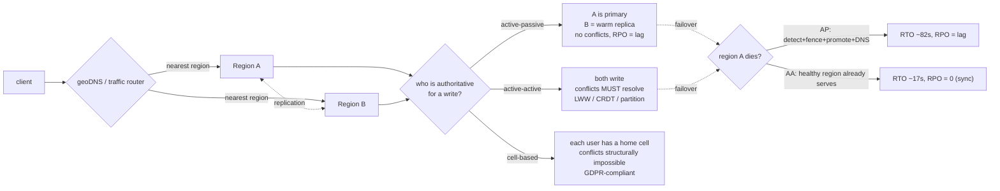

# Multi-Region Architecture — A Visual, Worked-Example Guide

> **Companion code:** [`multi_region.py`](https://github.com/quanhua92/tutorials/blob/main/csfundamentals/multi_region.py).
> **Live demo:** [`multi_region.html`](./multi_region.html)

---

## 0. TL;DR — the one idea

> **The analogy:** Multi-region is **two post offices in different cities that
> promise to forward each other's mail**. The question is never "can they
> forward mail?" — it is **"when they disagree about who handled a letter first,
> who is right, and what do we throw away to make them agree again?"** Every
> topology is a different answer to that question, priced in latency, cost, and
> lost letters.

The whole field reduces to one distinction:

> **Replication moves data; correctness is a *decision* about what happens when
> two regions accept conflicting writes.** You cannot avoid the decision — you
> can only choose how explicitly you state it.



This bundle simulates all six pillars end-to-end in pure stdlib:

1. **Region topology & latency** — haversine distance → the 60-150ms cross-region band
2. **Active-passive** — one primary, async lag, RPO = lag, the read-your-own-writes bug
3. **Active-active + conflict resolution** — LWW silently loses writes; CRDT merges correctly
4. **Latency-based routing (geoDNS)** — nearest-region selection cuts average client RTT ~82%
5. **Data residency** — GDPR requires *partitioning*, not replication
6. **Regional failover** — detect → fence → promote → DNS; RTO/RPO breakdown

---

## 1. How It Works

### 1.1 Region topology — great-circle distance is the lower bound

> **Idea:** The speed of light in fiber (~200 km/ms, 0.67c) is the **hard**
> lower bound on cross-region latency. Real fiber is not straight and routers
> add hops, so we model an effective **150 km/ms**. Round-trip =
> `2 × distance / speed`. This reproduces the canonical 60-150ms band every
> multi-region design lives with.

> From `multi_region.py` Section "Region Topology & Latency Model":

```
pairwise RTT (ms)           eu-west-1   ap-ne-1   us-west-2   ap-se-1
  us-east-1   <-> eu-west-1     74
  us-east-1   <-> ap-northeast        146
  eu-west-1   <-> ap-northeast              128
  us-west-2   <-> ap-southeast                          177   (longest)

core routes in 60-150ms band?  [check] OK
longest trans-Pacific > 150ms? [check] OK
```

> **Gotcha — Multi-AZ is NOT multi-region:** Multi-AZ = same region, ~1-5ms (HA
> *within* a region). Multi-region = 60-150ms (DR *across* region failure).
> Confusing them is a junior mistake in a senior interview.
>
> **Gotcha — great-circle is a lower bound:** real fiber follows coastlines and
> political routes; expect measured RTT to exceed the model by 10-30%.

---

### 1.2 Active-passive — one writer, no conflicts, dead time on failover

> **Idea:** One region (us-east-1) is **primary**: 100% of reads and writes. The
> secondary (eu-west-1) is a **warm replica**: it receives replicated data but
> serves no production traffic. Failover = promote the secondary and repoint
> DNS. No conflicts (single writer), but RPO = async lag and failover has a
> promotion dead-window.

> From `multi_region.py` Section "Active-Passive Replication":

```
primary = us-east-1   secondary = eu-west-1   replication = ASYNC (74ms cross-region)
normal lag = 5s        peak lag = 60s

READ-YOUR-OWN-WRITES PROBLEM (the invisible UX bug):
  T=0   user posts comment -> write to PRIMARY
  T=0+  user refreshes      -> LB sends read to REPLICA (5s behind) -> comment GONE
  user thinks site is broken, posts AGAIN -> duplicate.

RPO (data lost on failover):
  normal load  lag =   5s  ->     5,000 writes lost
  peak load    lag =  60s  ->    60,000 writes lost   (lag compounds under write pressure)

RTO (active-passive):
  detection(15) + fence(2) + promote(5) + DNS(60) = 82s
```

> **Gotcha — DNS failover is NOT instant:** a 60s TTL means some clients hit the
> dead primary for up to 60s *after* the DNS change. JVM apps with aggressive
> DNS caching can hold the stale record for minutes.
>
> **Gotcha — split-brain:** if the primary is *slow* (not dead) and the
> secondary is promoted, two primaries briefly accept writes. **Fencing**
> (revoke the old primary's DB creds *before* promotion) is mandatory — STONITH.

---

### 1.3 Active-active — zero-promotion failover, but conflicts must resolve

> **Idea:** Both regions accept writes simultaneously. Zero-RTO failover (the
> healthy region already serves traffic) and lower write latency for global
> users. The hard problem: if two regions write the **same** record at the same
> time, which wins when they sync?

#### Last-write-wins by wall clock — the broken default

> From `multi_region.py` Section "Active-Active + Conflict Resolution":

```
us-east writes 'user:42:email' = 'a@x.com'   true_t=1000ms, clock correct -> wall=1000
eu-west writes 'user:42:email' = 'b@y.com'   true_t=1010ms (NEWER), clock 50ms behind -> wall=960

LWW merge: max(1000, 960) = 1000
  -> WINNER = 'a@x.com' (us-east, OLDER)
  -> LOSER  = 'b@y.com' (eu-west, causally NEWER)  *** SILENTLY LOST ***
```

The causally-newer write lost because eu-west's clock was behind. Wall clocks
drift across servers by tens of milliseconds; LWW trusts them anyway. This is
nearly impossible to detect or debug in production.

#### CRDT — G-Counter, deterministic correct merge

```
G-Counter = vector with one slot per node. Each node only INCREMENTS its own slot.
  us-east local state = [3, 0]   eu-west local state = [0, 2]
  merge = [max(3,0), max(0,2)] = [3, 2]
  total = 5   (CORRECT: 3 + 2 = 5, no write lost)
```

Merge is commutative + associative + idempotent: order never matters, and
re-merging is stable. CRDTs work for counters, sets, flags. They do **not** work
for arbitrary business logic ("deduct inventory only if qty > 0" has a
precondition and cannot be a CRDT).

| Strategy | Correct? | Lost writes | Use for |
|---|---|---|---|
| **LWW (wall clock)** | NO | 1 of 2 | nothing that tolerates silent loss |
| **CRDT (G-Counter)** | YES | 0 | counters, sets, flags |
| **geo partitioning** | YES | 0 | any data (conflicts prevented) |
| **Operational Transform** | YES | 0 | collaborative text editing (very hard) |

> **Gotcha — `"active-active + async + LWW"` ends interviews at E5+:** always
> specify conflict *avoidance* (geo partitioning) or a data type that tolerates
> LWW (counters, session tokens).
>
> **Gotcha — vector clocks fix causality tracking but concurrent writes are
> STILL lost under LWW** — they just become *detectable*, not avoided.

---

### 1.4 Latency-based routing (geoDNS) — send each user to the nearest region

> **Idea:** geoDNS (Route 53 latency-based routing, Cloudflare) resolves the
> user's query to the region with the **lowest RTT** from their edge, NOT the
> fewest miles. Compare against the naive single-region hub (us-east-1).

> From `multi_region.py` Section "Latency-Based Routing (geoDNS)":

```
client        -> nearest region      geoDNS    -> hub (us-east)   saved
new_york         us-east-1              6ms           6ms             0ms
los_angeles      us-west-2             18ms          49ms            31ms
london           eu-west-1              6ms          80ms            74ms
osaka            ap-northeast-1         5ms         150ms           145ms
jakarta          ap-southeast-1        12ms         219ms           207ms
sydney           ap-southeast-1        84ms         209ms           125ms

average RTT, single-region hub  = 118.8ms
average RTT, geoDNS (nearest)   =  21.8ms
latency reduction               =  81.6%
```

> **Gotcha — lowest RTT, not fewest miles:** fiber topology means a city
> geographically farther can have lower latency (e.g. peered at the same IXP).
>
> **Gotcha — DNS TTL caps failover speed:** a 60s TTL responsive enough for
> failover adds ~60s of propagation; lower TTL raises DNS query volume and
> resolver cache pressure.

---

### 1.5 Data residency — GDPR requires *partitioning*, not replication

> **Idea:** GDPR requires EU residents' personal data to be stored and processed
> **in the EU**. This is a **legal** constraint, not a performance optimization.
> Replicating EU data to a US region **violates** GDPR even if it improves
> latency — the original still lives in the US. The data must be **partitioned**
> to an EU cell (born there, never leaves).

```
user -> home-cell assignment (set at registration, immutable):
  u_eu_001  Germany -> eu_cell   [OK]
  u_us_001  USA     -> us_cell   [OK]
  u_ap_001  Japan   -> ap_cell   [OK]

TRAP: "we satisfy GDPR by replicating EU data to an EU region."
  -> WRONG. Replication COPIES; the ORIGINAL still violates. Must PARTITION.

blast radius (10 cells, 900M users): per cell = 90M, a cell failure = 10% of users
  (vs a region failure in 2-region active-active = 100%)
```

> **Gotcha — CCPA (California), PIPL (China), LGPD (Brazil)** each add their
> own residency rules. Design the cell boundary **before** choosing the
> replication strategy.
>
> **Gotcha — cell architecture multiplies operational surface area:** N
> databases, N deployments, N metric sets. Heavy automation (Terraform,
> centralized monitoring) is a prerequisite, not an afterthought.

---

### 1.6 Regional failover — detect, fence, promote, propagate

> **Idea:** us-east-1 (primary) fails at T=0. Trace the failover. Health check
> every 5s; **3 consecutive misses** required to declare the region dead (avoids
> flapping). Then **FENCE** (revoke old primary's DB creds = split-brain
> prevention), **PROMOTE** the secondary, then propagate DNS.

> From `multi_region.py` Section "Regional Failover":

```
ACTIVE-PASSIVE failover timeline:
  T+ 5s   health check #1 FAIL
  T+10s   health check #2 FAIL
  T+15s   region declared DEAD (3 misses)
  T+17s   FENCE: revoke old primary DB creds (2s)
  T+22s   PROMOTE eu-west-1 to primary + DNS update (5s)
  T+22..82s   DNS TTL expiry; last clients switch (~60s)
  -> RTO (last client switched) = 82s
  -> user-visible outage       = 22s

ACTIVE-ACTIVE failover timeline:
  T+15s   region declared DEAD
  T+17s   FENCE (2s)
  T+17s   eu-west-1 ALREADY serves traffic (promotion = 0s)
  -> user-visible outage = 17s (only in-flight reqs to dead region drop)
```

```
TOPOLOGY COMPARISON:
  topology          RTO      RPO     cost    complexity    SLA
  active-passive    82s      5s      2x      low           99.9%
  active-warm       ~77s     5s      1.5x    medium        99.99%
  active-active     ~17s     0-5s    2x      very high     99.999%
  cell-based        ~17s     0s      Nx      highest       99.999%
```

> **Gotcha — an untested failover is not a failover, it is a hope:** run chaos
> drills (Chaos Kong, AWS FIS) quarterly under **production** load. A 2-minute
> staging failover can take 15 minutes in prod (cold caches, slow auto-scaling,
> connection-pool warmup).

---

## 2. The Math

### RTT from great-circle distance

For two regions at lat/lon `(φ₁, λ₁)` and `(φ₂, λ₂)`, the great-circle
distance (haversine) is:

```
a   = sin²(Δφ/2) + cos(φ₁)·cos(φ₂)·sin²(Δλ/2)
d   = 2·R·asin(√a)                         (R = 6371 km)
RTT = round( 2·d / SPEED_KM_PER_MS )       (SPEED_KM_PER_MS = 150)
```

The factor of 2 makes it round-trip; the 150 km/ms effective constant folds in
fiber path length + router hops (pure fiber is ~200 km/ms). From the simulation:

```
us-east <-> eu-west      5,530 km  ->  74ms   (transatlantic)
us-east <-> ap-northeast 10,959 km -> 146ms   (transpacific)
eu-west <-> ap-northeast  9,585 km -> 128ms   (europe-asia)
us-west <-> ap-southeast  13,254 km-> 177ms   (pacific rim, longest)
```

> The live demo (`multi_region.html`) recomputes each of these in pure
> JavaScript and prints `[rtt: OK] haversine == .py` — byte-for-byte identical
> to Python.

### RTO and RPO

```
RTO_passive = detection + fencing + promotion + DNS_TTL
            = (interval × misses) + fencing + promotion + DNS_TTL
            = (5 × 3) + 2 + 5 + 60  = 82s

RTO_active  = detection + fencing            (promotion = 0)
            = (5 × 3) + 2        = 17s   (user-visible outage)

RPO         = async_replication_lag          (seconds of writes at risk)
            = 5s  ->  RPS × lag = 1000 × 5 = 5,000 writes lost (normal)
            = 60s ->                       60,000 writes lost (peak)
```

### CRDT G-Counter merge

```
state = [slot_node1, slot_node2, ...]       each node increments only its slot
merge(a, b)  = [ max(a[i], b[i]) for i ]    element-wise max
total(c)     = Σ c[i]
```

```
us-east [3,0]  +  eu-west [0,2]  =  [max(3,0), max(0,2)]  =  [3, 2]  -> 5
```

Commutative (`a⊕b = b⊕a`), associative, idempotent (`a⊕a = a`). Order of merge
never matters; re-merging is stable. This is *why* CRDTs are conflict-free:
concurrent operations form a join-semilattice.

### geoDNS latency reduction

For `n` clients each routed to their nearest region vs a single hub:

```
geo_avg = (1/n) Σ client_rtt(c, nearest(c))
hub_avg = (1/n) Σ client_rtt(c, hub)
reduction = (hub_avg − geo_avg) / hub_avg × 100
         = (118.8 − 21.8) / 118.8 × 100  = 81.6%
```

### Cell blast radius

With `N` cells serving `U` total users:

```
users_per_cell   = U / N
blast_radius     = 1 / N          (a single cell failure affects 1/N of users)
                 = 1/10 = 10%     (vs 100% for a 2-region active-active failure)
```

### CAP theorem, stated literally

```
sync replication  -> RPO = 0, but a cross-region partition BLOCKS all writes
                  -> you cannot have RPO=0 AND 100% availability simultaneously
async replication -> availability preserved, but RPO > 0 (writes at risk)
```

---

## 3. Tradeoffs

| Decision | Option A | Option B | When |
|---|---|---|---|
| **Topology** | Active-passive (RTO ~min, 2x cost, no conflicts) | Active-active (RTO ~s, 2x cost, conflicts) | Small team / 99.9% SLA → A; global users / 99.999% → B |
| **Replication** | Synchronous (RPO=0, +60-150ms/write, blocks on partition) | Asynchronous (low latency, RPO = lag) | Financial / zero-loss → sync; social / loss-tolerant → async |
| **Conflict resolution** | Geo partitioning (prevented, any data) | CRDT (counters/sets/flags only) | Arbitrary business logic → partition; counters → CRDT |
| **Routing** | geoDNS latency-based (lowest RTT) | Single-region hub | Global users → geoDNS; single-region user base → hub |
| **Residency** | Cell partitioning (GDPR-compliant) | Cross-region replication | EU/China/CA data → cells; non-regulated → replicate |
| **Failover** | Automatic (3-miss quorum + fencing) | Manual (human promotes) | Critical path → automatic; regulated → manual with audit |

**Decision rules:**
- RTO > 5 min acceptable, RPO > 0 OK, small team → **active-passive**
- RTO 1-3 min, cost-sensitive, 50% standby OK → **active-warm standby**
- RTO seconds, global users, expertise + budget → **active-active**
- Blast-radius isolation + residency compliance → **cell-based**

---

## 4. Real-World Usage

| System | Topology | Notes |
|---|---|---|
| **AWS Aurora Global Database** | Active-passive (1 primary, ≤5 secondaries) | Strong on primary; secondaries replicate in <1s; <1-min cross-region failover |
| **DynamoDB Global Tables** | Active-active, ≤10 regions | Eventual consistency, LWW by internal timestamp; concurrent writes to same key silently discard one |
| **CockroachDB Multi-Region** | Active-active with home region per row | Serializable via Raft consensus; 60-150ms cross-region consensus, 5-10ms home-region writes |
| **Google Spanner** | Active-active, global | External consistency via TrueTime API; ~5ms commit for 2-region sync; premium pricing |
| **Cassandra Multi-DC** | Active-active, tunable DC count | `LOCAL_QUORUM` ~1ms; `EACH_QUORUM` 60-150ms; LWW with tunable consistency |
| **Stripe** | Cell-based ("data residency cells") | Merchant assigned to cell by legal-entity country; EU cell data never leaves EU; cross-cell via idempotency-keyed coordinator |
| **Cloudflare** | Cell-based (275+ PoPs) | Each PoP is a cell; a config error crashes ~1% of users, not 100% |
| **LinkedIn** | Cell-based (~1M members/cell) | Full social graph per cell; a cell failure affects 1M of 900M members |

---

## Killer Gotchas

- **Replication ≠ compliance:** GDPR is satisfied by **partitioning** EU data
  into an EU cell, not by copying it to an EU region. The original must never
  have existed outside the EU. Replication is a read-availability mechanism,
  not a compliance tool.

- **Multi-AZ is not multi-region:** Multi-AZ is ~1-5ms (HA within one region);
  multi-region is 60-150ms (DR across region failure). Confusing them is the
  fastest way to fail a senior design interview.

- **LWW silently loses writes:** Wall-clock drift means a causally-newer write
  can have an *earlier* timestamp and be discarded. Never use LWW for
  inventory, payments, or settings where loss is unacceptable. Use CRDTs
  (counters/sets) or geo partitioning (any data).

- **DNS failover is not instant:** TTL means clients cache the old IP for up to
  TTL seconds after the change. A 300s TTL = some clients hit the dead primary
  for 5 minutes. Use ≤60s TTL for critical services (and budget the extra DNS
  query volume).

- **Synchronous replication ≠ free zero-RPO:** Sync means the primary *blocks*
  until the secondary acks. During a cross-region partition you get RPO=0 but
  **zero availability** — CAP theorem, literally. You cannot have both.

- **Split-brain during promotion:** if the primary is slow (not dead) and the
  secondary is promoted, two primaries briefly accept writes. **Fence first**
  (revoke the old primary's DB creds / detach its LB) **then** promote. STONITH.

- **Replication lag compounds under load:** at 10k writes/s with replicas
  handling 8k/s, the replica falls behind 2k records/s — 1.2M records behind
  after 10 minutes. Monitor lag as a **product** SLI, not an ops metric; alert
  at 3× baseline and route reads to primary when it spikes.

- **Read-your-own-writes:** a write to the primary, followed by an immediate
  read load-balanced to a lagging replica, makes the user's data "vanish." Route
  reads to the primary for a 30-60s session window after a write.

- **Staging failover ≠ production failover:** staging traffic is an order of
  magnitude lower. A 2-minute staging drill can take 15 minutes in prod (cold
  caches, slow auto-scaling, connection-pool warmup). Test under realistic load
  — production traffic replay if possible — and repeat quarterly.

- **An untested failover is a hope, not a failover:** schedule chaos engineering
  (Chaos Kong, AWS Fault Injection Simulator) that kills the primary region and
  measures **actual** RTO/RPO. The drill is the only honest source of truth.

- **Cell architecture multiplies operational surface area:** N cells = N
  databases, N deployments, N metric sets. Invest in Terraform + centralized
  monitoring **first**. Most teams should not build cells until they have
  exhausted two-region active-active.

> **THE ONE IDEA:** every multi-region tradeoff is a bet on what "correct" means
> when two regions disagree. State it explicitly: who is authoritative for a
> write, what happens to concurrent writes, and how much data you are willing to
> lose when a region fails. The technology (CRDTs, Raft, vector clocks) merely
> enforces the decision you already made.
