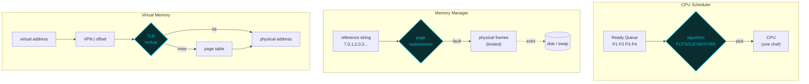

# Operating Systems — A Visual, Worked-Example Guide

> **Companion code:** [`operating_systems.py`](https://github.com/quanhua92/tutorials/blob/main/csfundamentals/operating_systems.py).
> **Live demo:** [`operating_systems.html`](./operating_systems.html)

---

## 0. TL;DR — the one idea

> **The analogy:** An operating system is a **restaurant manager** juggling three scarce
> resources. The **CPU** is a single chef — the *scheduler* decides which order (process)
> the chef works on next (FCFS by ticket order, SJF by shortest dish, Round Robin giving
> everyone a fair time-slice). **RAM** is a finite kitchen counter — the *page replacer*
> decides which ingredients (pages) to evict to cold storage (disk) when the counter fills
> (FIFO by age, LRU by staleness, Clock as a cheap LRU approximation). **Virtual memory**
> is a numbering trick — every process believes it has a private kitchen, but a *page table*
> silently remaps its "virtual" addresses to real shelves (frames), cached in a fast
> *TLB* lookup pad.



Three pillars, each simulated below with deterministic numbers:

| # | Pillar | Algorithms | Key Question |
|---|---|---|---|
| 1 | **CPU Scheduling** | FCFS, SJF, SRTF, Round Robin | Which process runs next, and for how long? |
| 2 | **Page Replacement** | FIFO, LRU, Clock/Second-Chance | Which page do we evict when RAM is full? |
| 3 | **Virtual Memory** | Page tables + TLB | How does a virtual address become a physical one? |

---

## 1. How It Works

All scheduling examples use the same 4-process workload so the Gantt charts are directly
comparable:

```
P1 (arrival 0, burst 7)   P2 (arrival 2, burst 4)
P3 (arrival 4, burst 1)   P4 (arrival 5, burst 4)
```

> **Definitions:** **waiting time** = time a process sits in the ready queue doing nothing
> (`finish − arrival − burst`). **turnaround time** = total time from arrival to completion
> (`finish − arrival`). **context switch** = the cost of swapping one process off the CPU for
> another (flush caches, save/restore registers).

### 1.1 FCFS — First-Come First-Served

> **Idea:** Run processes strictly in arrival order. Non-preemptive — once a process starts,
> it runs to completion. A **single long job blocks everyone behind it** (the *convoy effect*).

> From `operating_systems.py` Section "FCFS":

```
Gantt: P1[0-7] | P2[7-11] | P3[11-12] | P4[12-16]

 pid  arrive  burst  finish  wait  turn
----  ------  -----  ------  -----  -----
  P1       0      7       7     0     7
  P2       2      4      11     5     9
  P3       4      1      12     7     8
  P4       5      4      16     7    11
average waiting = 4.75    average turnaround = 8.75
```

The 1-unit `P3` arrives at t=4 but waits until t=11 because `P1` (7 units) and `P2` (4 units)
got there first. **FCFS is fair by order, brutal to short jobs.**

---

### 1.2 SJF — Shortest Job First (non-preemptive)

> **Idea:** Among all *arrived* processes, run the one with the smallest burst. Non-preemptive
> — a running job is never interrupted. Tie-break by arrival, then index.

> From `operating_systems.py` Section "SJF":

```
Gantt: P1[0-7] | P3[7-8] | P2[8-12] | P4[12-16]

 pid  arrive  burst  finish  wait  turn
----  ------  -----  ------  -----  -----
  P1       0      7       7     0     7
  P2       2      4      12     6    10
  P3       4      1       8     3     4
  P4       5      4      16     7    11
average waiting = 4.00
```

At t=7, `P2`(4), `P3`(1), `P4`(4) have all arrived — SJF picks `P3` (burst 1) first, then
`P2`/`P4` tie at 4 (broken by arrival: `P2` arrived earlier). **Average wait drops 4.75 →
4.00.** The catch: SJF needs to *know* the burst length in advance, which is impossible in
general — real systems estimate it from past behavior (exponential averaging).

---

### 1.3 SRTF — Shortest Remaining Time First (preemptive SJF)

> **Idea:** SJF with preemption. Whenever a new process arrives, if its remaining time is less
> than the currently running process's remaining time, **preempt** (interrupt) the running one.
> SRTF provably minimizes average waiting time.

> From `operating_systems.py` Section "SRTF":

```
Gantt: P1[0-2] | P2[2-4] | P3[4-5] | P2[5-7] | P4[7-11] | P1[11-16]

 pid  arrive  burst  finish  wait  turn
----  ------  -----  ------  -----  -----
  P1       0      7      16     9    16
  P2       2      4       7     1     5
  P3       4      1       5     0     1
  P4       5      4      11     2     6
average waiting = 3.00
```

Watch the preemptions: `P1` runs [0-2], gets interrupted by `P2` (shorter remaining). `P2` runs
[2-4], gets interrupted by `P3` (burst 1 < P2's remaining 2). `P3` finishes, `P2` resumes. The
**trade-off is more context switches and starvation risk** for long jobs — `P1` is shoved to
the back and doesn't finish until t=16.

---

### 1.4 Round Robin — fair time-slices (quantum)

> **Idea:** Every process gets a fixed **time quantum** (e.g. 2ms) on the CPU, then it's moved
> to the back of the ready queue. No process waits longer than `(N−1) × quantum`. As the
> quantum → ∞, RR degenerates into FCFS; as quantum → 0, context-switch overhead dominates.

> From `operating_systems.py` Section "Round Robin" (quantum = 2):

```
Gantt: P1[0-2] | P2[2-4] | P1[4-6] | P3[6-7] | P2[7-9] | P4[9-11] | P1[11-13] | P4[13-15] | P1[15-16]

 pid  finish  wait  turn
----  ------  -----  -----
  P1      16     9    16
  P2       9     3     7
  P3       7     2     3
  P4      15     6    10
average wait = 5.00   context switches = 9
```

**The quantum sweet spot matters:**

```
 q  total_wait  total_turn  ctx_sw
 1          22          38      16     ← tiny quantum: thrashing on switches
 2          20          36       9
 4          18          34       5     ← larger quantum: fewer switches, approaches FCFS
```

Rule of thumb: quantum should be **~10× longer than a context switch** (typically 1-10ms on
modern systems) so switch overhead stays under 10% of CPU time.

---

### 1.5 Scheduling comparison

> From `operating_systems.py` Section "Scheduling comparison":

```
       algorithm  avg_wait  avg_turn
            FCFS      4.75      8.75
   SJF (non-preem)     4.00      8.00
      SRTF (preem)     3.00      7.00   ← optimal average wait
            RR q=1     5.50      9.50   ← worst (switch overhead)
            RR q=2     5.00      9.00
            RR q=4     4.50      8.50

best  (min avg wait): SRTF (preem)  3.00
worst (max avg wait): RR q=1        5.50
```

No single algorithm wins everywhere. **SRTF minimizes average wait** but starves long jobs and
needs prediction. **FCFS is simplest** but suffers the convoy effect. **RR is fairest** for
response time but pays in context switches. Real OS schedulers (Linux CFS, Windows) are
priority-based hybrids that approximate fair sharing.

---

## 2. Page Replacement

> **Setup:** Physical memory holds a fixed number of **frames**. A process references a
> **reference string** of page numbers. On a **hit** the page is already in a frame; on a
> **fault** it must be loaded from disk, possibly evicting a resident page. We compare three
> eviction policies on the classic Silberschatz string `[7,0,1,2,0,3,0,4,2,3,0,3,2,1,2,0,1,7,0,1]`
> with **3 frames**.

> From `operating_systems.py` Section "Page replacement":

```
 algorithm  faults
       FIFO     15
        LRU     12   ← fewest faults
      Clock     14

FIFO=15, LRU=12, Clock=14   [check] OK   (LRU <= Clock <= FIFO)
```

| Algorithm | Evicts | Faults (3 frames) | Cost |
|---|---|---|---|
| **FIFO** | the page loaded longest ago (queue order) | **15** | cheapest, but ignores recency |
| **LRU** | the page used least recently | **12** | accurate, but expensive to track exactly |
| **Clock** | first page with use-bit = 0 (second-chance) | **14** | cheap LRU approximation |

**Clock (second-chance)** sweeps a circular buffer with a pointer. On a fault, it looks at the
pointer's page: if its **use bit = 1**, clear it to 0 and advance (a "second chance"); if **use
bit = 0**, evict it. Pages accessed recently keep their use bit set and survive a sweep. This
gives near-LRU quality at FIFO cost — which is why most real OSes (Linux, Windows) use Clock or
its variants.

---

### 2.1 Belady's anomaly

> **The surprise:** For **FIFO** only, adding a frame can **increase** the number of page
> faults. This cannot happen with LRU or Clock (they are *stack algorithms* — the set of pages
> in `n` frames is always a subset of those in `n+1` frames).

> From `operating_systems.py` Section "Belady's anomaly" (string `[1,2,3,4,1,2,5,1,2,3,4,5]`):

```
algorithm  3 frames  4 frames   delta
     FIFO         9        10     +1   ← ANOMALY: more frames, MORE faults
      LRU        10         8     -2   ← monotonic (stack algorithm)
    Clock         9        10     +1

FIFO: 3 frames -> 9 faults, 4 frames -> 10 faults  (+1, ANOMALY)
LRU:  3 frames -> 10 faults, 4 frames -> 8 faults  (-2, monotonic)
[check] OK   (only FIFO-style replacement shows Belady's anomaly)
```

This is why FIFO is rarely used in practice despite its simplicity — you can't even rely on
"buy more RAM" to reduce faults.

---

## 3. Virtual Memory & Address Translation

> **Idea:** Every process gets its own **virtual address space**. A **page table** maps each
> virtual page number (VPN) to a physical frame number (PFN). The CPU's MMU splits a virtual
> address into `VPN | offset`, looks up the PFN, and reassembles a physical address. A
> **TLB (Translation Lookaside Buffer)** caches recent VPN→PFN translations so most lookups
> skip the page table entirely.

> From `operating_systems.py` Section "Virtual memory" (4 KB pages, 16-bit addresses):

```
page size = 4096 bytes (2^12)
virtual address = 4-bit VPN | 12-bit offset
page table = {vpn: pfn} = {0:5, 1:9, 2:3, 3:7, 6:1, 7:12, 10:0, 11:8}

virtual addr   vpn   offset    pfn   physical addr
------------   ---   ------    ---   -------------
0x2C8A           2   0xC8A      3   0x3C8A        ← vpn2→pfn3, offset carried over
0x1A2F           1   0xA2F      9   0x9A2F
0x0710           0   0x710      5   0x5710
0x7005           7   0x005     12   0xC005
0xB300          11   0x300      8   0x8300
0x9000           9   0x000     --   PAGE FAULT (vpn 9 not mapped)

translate(0x2C8A) = 0x3C8A   [check] OK   (vpn2->pfn3, offset 0xC8A)
```

The **offset (low 12 bits) never changes** — only the page frame number does. A reference to
an unmapped VPN (9 above) raises a **page fault**: the OS either loads the page from disk or
kills the process (segfault).

### TLB simulation

With a **3-entry LRU TLB** and a working set `{vpn0, vpn1, vpn2}` that fits the TLB:

```
TLB size = 3   accesses = 16

  #     vaddr  vpn  result
  1  0x2C8A     2  TLB MISS     ← cold load
  2  0x2C8B     2  TLB HIT
  3  0x1A2F     1  TLB MISS     ← cold load
  4  0x0710     0  TLB MISS     ← cold load (working set now cached)
  5  0x2C8C     2  TLB HIT
  ...all subsequent accesses to {0,1,2} are HITs...

TLB hits = 13   misses = 3   page faults = 0   hit rate = 81.2%
[check] OK   (working set fits TLB -> hit rate exceeds miss rate)
```

After three cold misses the TLB holds the entire working set, so **81.2%** of accesses skip the
page table entirely. Exceed the TLB's capacity (working set > 3 pages here) and you get
**capacity misses** — the working-set thrashing that motivates larger TLBs and page coloring.

---

## 4. The Math

### Average waiting time (SRTF optimality)

For any preemptive or non-preemptive schedule, **SRTF minimizes mean waiting time**. Proof
sketch: any schedule where a longer job runs while a shorter job waits can be improved by
swapping their order, reducing total waiting time. The gap between FCFS (4.75) and SRTF (3.00)
on our workload — a **37% reduction** — quantifies the cost of ignoring job length.

### Round Robin context-switch overhead

With quantum `q` and `C` processes whose total burst is `B`, the number of context switches is
roughly `⌈B / q⌉`. Each switch costs `s` time units, so overhead ≈ `(⌈B/q⌉ × s) / B`. To keep
overhead below 10% with `s ≈ 10µs`, the quantum must exceed ~`100µs`. This is why typical OS
quanta are 1-10ms.

### Belady's anomaly bound

FIFO is **not** a stack algorithm: the set of pages in `n` frames is *not* always a subset of
those in `n+1` frames. LRU and Clock **are** stack algorithms (eviction depends only on access
order, not insertion order), so more frames monotonically reduce faults. Formally, for a stack
algorithm: `faults(n+1) ≤ faults(n)` always.

### TLB coverage

A TLB with `T` entries covers `T × page_size` of address space. With 64 entries and 4 KB
pages, that's 256 KB — far less than a modern process's working set. This is why CPUs use
**multi-level TLBs** (L1 TLB ~64 entries for 4 KB pages, L2 TLB ~1024 entries, plus huge pages
covering 2 MB / 1 GB each).

---

## 5. Tradeoffs

| Algorithm | Preemptive? | Starvation? | Needs Burst Info? | Avg Wait | Best For |
|---|---|---|---|---|---|
| **FCFS** | No | No | No | High (convoy) | Simple batch jobs |
| **SJF** | No | Yes (long jobs) | Yes (must predict) | Low | Batch with known durations |
| **SRTF** | Yes | Yes (severe) | Yes | **Optimal** | Theoretical minimum |
| **Round Robin** | Yes | No | No | Medium + switch cost | Interactive / timesharing |

| Page Replacer | Faults (3 fr) | Belady anomaly? | Overhead | Best For |
|---|---|---|---|---|
| **FIFO** | 15 | **Yes** | Lowest | Simplicity, not production |
| **LRU** | 12 | No | High (exact tracking) | Accuracy-critical |
| **Clock** | 14 | No | Low (use bit + pointer) | **Real OSes** (Linux/Windows variants) |

**Scheduling decision tree:**
- Interactive system needing low response time? → **Round Robin** (quantum ~10ms)
- Can predict burst lengths & accept starvation risk? → **SRTF/SJF** for min average wait
- Mixed priority workload? → **Multilevel feedback queue** (RR per priority, boost to prevent starvation)
- Modern general-purpose OS? → **CFS** (Linux: fair share via red-black tree of vruntime)

---

## 6. Real-World Usage

| System | Scheduler | Page Replacer | Notes |
|---|---|---|---|
| **Linux** | CFS (Completely Fair Scheduler) | Clock-Pro / Active/Inactive list | vruntime-based fair sharing; multi-gen LRU (MGLRU) since 6.1 |
| **Windows** | Multilevel feedback (priority) | Clock variant | 32 priority levels, foreground boost |
| **macOS (XNU)** | BSD + Mach timeshare | LRU-ish | QoS classes (utility, background, user-interactive) |
| **FreeBSD** | ULE scheduler | Clock | Per-CPU run queues |
| **x86-64 MMU** | — | — | 4-level page tables, 4 KB / 2 MB / 1 GB pages, PCID for TLB isolation |
| **ARM64** | — | — | 2-level TLB, ASID-tagged, Contiguous pages |

---

### Killer Gotchas

- **Convoy effect (FCFS):** One slow process causes all followers to wait, serializing the
  CPU around a single bottleneck. Even one misbehaving long job tanks average wait. **Fix:**
  preemption (RR/SRTF) or fair queuing (CFS).

- **Starvation (SJF/SRTF):** A continuous stream of short jobs can keep a long job waiting
  **forever**. **Fix:** aging — gradually raise a waiting process's priority so it eventually
  runs (Linux CFS encodes this via vruntime; MLFQ boosts starved processes).

- **Burst prediction is hard:** SJF/SRTF need future burst lengths, which nobody knows. Real
  schedulers estimate via **exponential averaging** (`τ_{n+1} = α·t_n + (1−α)·τ_n`), predicting
  the next burst from recent history. `α ≈ 0.5` is typical.

- **Round Robin quantum too small:** If quantum ≈ context-switch time, the CPU spends half its
  time switching and half running. Below ~1ms on a modern system, throughput collapses. Too
  large and you lose fairness (RR → FCFS). **Sweet spot: ~10ms** (10-100× switch cost).

- **Belady's anomaly (FIFO):** Adding RAM can *increase* faults. Never use pure FIFO for
  production page replacement. LRU and Clock are immune (stack algorithms).

- **Exact LRU is too expensive:** Tracking precise recency for every page requires a timestamp
  update on every access. Real hardware can't afford this, so OSes use **Clock/second-chance**
  (one use bit, swept by a pointer) — near-LRU quality at FIFO cost.

- **TLB flush on context switch:** Naively, switching processes flushes the entire TLB
  (different page tables). With ASID (x86 PCID, ARM ASID), multiple processes' translations
  coexist in the TLB, avoiding the flush. A TLB miss costs ~100-300 cycles; a flush on a
  context-switch-heavy workload is brutal.

- **Page faults cost ~millions of cycles:** A TLB hit is ~1 cycle, a page-table walk is ~100
  cycles, a page fault (disk I/O) is ~10⁶-10⁷ cycles. This 6-orders-of-magnitude gap is why
  working-set optimization and prefetching dominate real performance.
