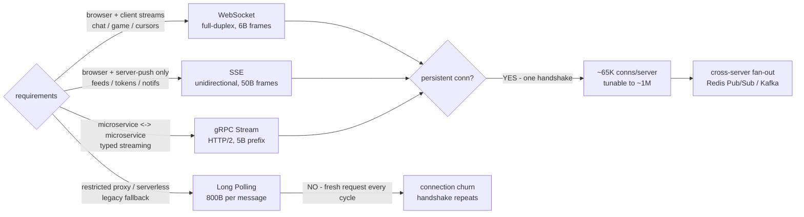

# Real-Time Protocols — A Visual, Worked-Example Guide

> **Companion code:** [`realtime_protocols.py`](https://github.com/quanhua92/tutorials/blob/main/csfundamentals/realtime_protocols.py).
> **Live demo:** [`realtime_protocols.html`](./realtime_protocols.html)

---

## 0. TL;DR — the one idea

> **The analogy:** Picking a real-time protocol is **choosing a phone** for the
> job. **WebSocket** is a **walkie-talkie** — both sides talk any time, one
> open channel, almost no per-message cost. **SSE** is a **radio broadcast** —
> the station pushes, you only listen, but it remembers where you dropped out
> and resumes. **Long polling** is **calling a friend, putting them on hold
> until they have news, then hanging up and redialing** every single time —
> it works through any switchboard but the dialing tax is brutal. **gRPC
> streaming** is a **leased corporate line** — one trunk carries dozens of
> typed, multiplexed calls between offices, cheapest of all, but the public
> (browsers) can't plug in directly.

The whole field reduces to two questions:

> **Which direction does the data flow, and how often?** Bidirectional and
> frequent → WebSocket (browser) or gRPC (service). Server-push-only → SSE.
> Restricted or serverless → long polling. Everything else is optimization of
> per-message overhead that only matters once directionality is settled.



This bundle simulates all four protocols end-to-end in pure stdlib:

1. **WebSocket** — full-duplex after an HTTP Upgrade + 101, 2-14 byte frames
2. **SSE** — single persistent stream, built-in auto-reconnect
3. **Long polling** — request → hold → response, full handshake per message
4. **gRPC streaming** — bidirectional over HTTP/2, length-prefixed protobuf
5. **Comparison** — overhead spans ~155x between best and worst

---

## 1. How It Works

### 1.1 WebSocket — the only browser-native full-duplex

> **Idea:** The client opens a normal HTTP/1.1 GET with `Upgrade: websocket`;
> the server replies `101 Switching Protocols`; from then on the TCP
> connection carries **bidirectional frames** (not HTTP). A 2-14 byte frame
> header per message makes it the lowest-overhead **browser** option once the
> one-time handshake is paid.

> From `realtime_protocols.py` Section "WebSocket":

```
one-time handshake = 800 bytes
per-message frame  = 6 bytes (masked client frame; range 2-14)
direction          = bidirectional (full-duplex)
steady latency     = 50ms (1 RTT, persistent)

connection lifecycle:
  1. [client -> server] GET /ws/chat  Upgrade: websocket  Sec-WebSocket-Key: ...
  2. [server -> client] 101 Switching Protocols  Sec-WebSocket-Accept: ...
  3. [both]             data frames (text/binary), 2-14 byte header each
  4. [both]             ping/pong heartbeat every 30s (detect dead TCP)
  5. [either]           close frame + ack (clean teardown handshake)

session (60s @ 10/s = 600 events):
  framing overhead = 4,400 bytes (800 handshake + 600 x 6B)
  overhead ratio   = 7.3% of payload
```

- **Direction:** bidirectional — the only browser option where the client
  streams back continuously.
- **Latency:** ~1 RTT after handshake (a persistent connection, immediate
  push).
- **Cost:** one 800-byte handshake, then 6-byte frames forever.

> **Gotcha — client frames are masked:** client→server frames carry a 4-byte
> mask key XOR'd into the payload, to defeat proxy-cache poisoning of
> intermediaries. Server→client frames are unmasked (2-byte header).
>
> **Gotcha — silently dead TCP:** a TCP connection can die without any signal
> (NAT timeout after inactivity). Send a WebSocket ping every ~30s and drop
> the connection if no pong returns within a timeout.
>
> **Gotcha — not serverless-friendly:** the gateway must be a long-lived
> process. On serverless, use a managed service (AWS API Gateway WebSocket,
> Ably, Pusher).

---

### 1.2 SSE — server-push, one-way, HTTP-native

> **Idea:** The server opens ONE persistent HTTP response with the MIME type
> `text/event-stream` and pushes text frames down it forever. The browser's
> `EventSource` API auto-reconnects on disconnect and replays missed events
> via the `Last-Event-ID` header. Strictly server → client.

> From `realtime_protocols.py` Section "SSE":

```
one-time handshake = 400 bytes
per-event frame    = 50 bytes (id:/event:/data: + blank line)
direction          = server -> client (unidirectional)
steady latency     = 50ms (1 RTT, persistent)

sample event frame:
  id: 42
  event: price-tick
  data: {"sym":"AAPL","px":178.34}
  <blank line>   <- the event terminator (\n\n)

session (60s @ 10/s = 600 events):
  framing overhead = 30,400 bytes (400 handshake + 600 x 50B)
  overhead ratio   = 50.7% of payload
```

If the client must send data back, it uses a separate `POST` (an SSE/REST
hybrid) — the stream itself is read-only to the client.

> **Gotcha — HTTP/1.1 connection cap:** browsers allow only **6** persistent
> connections per origin, and each SSE stream eats one slot. HTTP/2
> multiplexing removes this limit (many SSE streams share one TCP).
>
> **Gotcha — text only:** SSE is UTF-8 text. Binary needs base64 (33% bloat)
> or a separate channel.
>
> **Gotcha — not serverless-friendly:** a long-lived response. Use a managed
> SSE/Pub-Sub service on serverless.

---

### 1.3 Long polling — request → hold → response

> **Idea:** The client issues a normal HTTP GET. The server HOLDS it open
> until either (a) data is available, which it returns at once, or (b) a
> timeout (~30s) elapses, after which it returns empty and the client
> immediately re-GETs. Every message costs a FULL HTTP handshake. Stateless,
> proxy-friendly, works through anything.

> From `realtime_protocols.py` Section "Long Polling":

```
per-message cost   = 800 bytes (full req+resp headers; handshake repeats)
steady latency     = 100ms (RTT + reconnect gap)
burst latency (10) = 275ms (events drain one per cycle)

connection lifecycle (repeats forever):
  1. [client -> server] GET /poll?since=41 (hold me open)
  2. [server]           no data yet -> sleep
  3. [server -> client] event arrives -> 200 OK + payload
  4. [client]           immediately re-GET /poll?since=42 (repeat)

session (60s @ 10/s = 600 events):
  framing overhead = 480,000 bytes (600 x 800B; handshake repeats)
  overhead ratio   = 800.0% of payload  (WORST by far)
```

There is **no persistent connection** — the per-message cost IS a fresh HTTP
request/response. That makes it the heaviest option by a wide margin, but
also the most robust: it survives proxies that block Upgrade, and it works
on serverless where no long-lived process can run.

> **Gotcha — bursts queue:** the reconnect gap means a burst of 10 events
> takes **275ms** average to drain vs **50ms** on a persistent connection.
> WebSocket/SSE/gRPC multiplex all of them at once.
>
> **Gotcha — connection churn at scale:** at 100K clients polling once/sec,
> the fleet handles ~100,000 HTTP handshakes/sec (near an nginx box's limit),
> vs ~65,000 idle *persistent* connections on a WebSocket/SSE/gRPC gateway.
>
> **Gotcha — no built-in replay:** each cycle is a fresh request. The client
> must track a cursor (`since=N`) and tolerate gaps.

---

### 1.4 gRPC streaming — bidirectional over HTTP/2

> **Idea:** gRPC runs on a single long-lived HTTP/2 connection and multiplexes
> many concurrent RPCs over it. Each message is a length-prefixed protobuf:
> **1 byte** compressed-flag + **4 bytes** big-endian length + the binary
> payload. Three streaming modes each map to one HTTP/2 stream.

> From `realtime_protocols.py` Section "gRPC Streaming":

```
one-time handshake = 100 bytes (HTTP/2 preface + SETTINGS)
per-message frame  = 5 bytes (1B flag + 4B length prefix)
direction          = bidirectional (full-duplex streams)
steady latency     = 50ms (1 RTT, multiplexed)

streaming modes (each is one RPC method signature):
  server-streaming    one request  -> stream of responses   (price feed)
  client-streaming    stream of requests -> one response    (batch ingest)
  bidirectional       stream <-> stream (both send anytime) (chat, control plane)

session (60s @ 10/s = 600 events):
  framing overhead = 3,100 bytes (100 handshake + 600 x 5B)
  overhead ratio   = 5.2% of payload  (LOWEST)
```

> **Gotcha — NOT browser-native:** browsers cannot speak HTTP/2 trailers or
> the gRPC framing; you need **grpc-web + an Envoy proxy**, or a
> REST/Connect-JSON gateway. For browser→server realtime, use WebSocket or
> SSE instead.
>
> **Gotcha — strict schema:** protobuf evolution is forward/backward-
> compatible when you ADD fields, but changing a field TYPE or number is
> breaking. Evolve the contract carefully.
>
> **Gotcha — HTTP/2 head-of-line blocking:** multiplexing many streams on one
> TCP connection means one slow stream can block others under packet loss —
> the exact problem WebTransport/QUIC was designed to solve.

---

## 2. The Math

### Framing-overhead model — `session_overhead`

For a protocol with one-time **handshake** `h` (bytes), **per-message** frame
overhead `m` (bytes), delivering `N` events each of `P` payload bytes:

```
is_persistent = (proto != long_polling)
one_time      = h if is_persistent else 0        # long polling has no persistent conn
session_overhead = one_time + N * m
payload_total = N * P
overhead_ratio = session_overhead / payload_total
```

From the simulation (`N = 600`, `P = 100`, so `payload_total = 60,000`):

```
websocket:    800 + 600*6   =   4,400 B   ( 7.3%)
sse:          400 + 600*50  =  30,400 B   (50.7%)
long_polling:   0 + 600*800 = 480,000 B   (800.0%)   <- handshake repeats
grpc:         100 + 600*5   =   3,100 B   ( 5.2%)
```

The worst/best ratio is `480,000 / 3,100 ≈ 155x`.

> The live demo (`realtime_protocols.html`) recomputes each `session_overhead`
> in pure JavaScript and prints `[overhead: OK] session == .py` — the math is
> byte-for-byte identical to Python.

### Latency model

On a persistent connection (WebSocket/SSE/gRPC), delivery is ~1 RTT — the
server pushes the moment data exists. Long polling pays an extra **reconnect
gap** between each request/response cycle:

```
steady_latency(proto) = BASE_RTT                            (persistent)
                      = BASE_RTT + RECONNECT_GAP            (long polling)

burst_latency(K, proto) = BASE_RTT                          (persistent — multiplexed)
                        = BASE_RTT + (K-1)*RECONNECT_GAP/2  (long polling — one in-flight)
```

With `BASE_RTT = 50ms`, `RECONNECT_GAP = 50ms`, `K = 10`:

```
websocket / sse / grpc : steady 50ms,  burst(10)  50ms
long_polling           : steady 100ms, burst(10) 275ms   <- events drain one per cycle
```

Long polling can hold only **one** in-flight request per stream, so a burst of
K events drains one per reconnect cycle: the i-th waits i gaps, and the mean
adds `(K-1)/2` gaps. Persistent protocols multiplex all K at once.

### Scalability budget

```
~65,000     concurrent TCP connections per server (default Linux, tunable to ~1M)
1M conns  => ~15+ gateway servers at 65K each
7.5M conns (Discord) => ~120-200 gateway servers with Redis/Kafka fan-out
100K long-polling clients x 1 poll/s => ~100,000 HTTP handshakes/sec (connection churn)
```

### Reconnection-storm backoff

When a gateway crashes, every client reconnects simultaneously (thundering
herd). Exponential backoff with jitter spreads them:

```
delay = min(base * 2^attempt + jitter(0..1s), max_delay)

base = 100ms, cap = 8000ms  ->  schedule (deterministic part):
  attempt 0:   100ms   attempt 4: 1600ms
  attempt 1:   200ms   attempt 5: 3200ms
  attempt 2:   400ms   attempt 6: 6400ms
  attempt 3:   800ms   attempt 7: 8000ms (cap)
```

SSE has **built-in** retry (`EventSource` `retry:` field + `Last-Event-ID`);
WebSocket and gRPC require client-side backoff implementation.

---

## 3. Tradeoffs

| Decision | Option A | Option B | When |
|---|---|---|---|
| **Direction** | WebSocket / gRPC (bidirectional) | SSE (server→client) | Client streams back → A; push-only → SSE |
| **Per-message overhead** | gRPC 5B / WebSocket 6B | Long polling 800B / SSE 50B | High frequency → low overhead; infrequent → any |
| **Browser support** | WebSocket / SSE (native) | gRPC (needs grpc-web + proxy) | Browser client → native; service→service → gRPC |
| **Restricted networks** | Long polling (plain HTTP) | WebSocket/SSE (may be blocked) | Corporate proxy / firewall → long polling |
| **Serverless** | Long polling (stateless) | WebSocket/SSE (long-lived process) | Lambda/functions → long polling or managed service |
| **Auto-reconnect** | SSE (built-in EventSource) | WebSocket/gRPC (roll your own) | Need replay with no client code → SSE |
| **Connection churn** | Persistent (1 handshake) | Long polling (handshake per msg) | High concurrency → persistent |
| **Binary payloads** | WebSocket / gRPC (native) | SSE (base64 +33%) | Binary streams → WS/gRPC |

**Decision tree:**
- Browser + client also streams (chat/game/cursors)? → **WebSocket**
- Browser + server-push only (feeds/tokens/notifs)? → **SSE**
- Browser + restricted proxy / serverless / legacy? → **Long Polling**
- Microservice ↔ microservice (typed, streaming)? → **gRPC**
- Need sub-10ms + packet-loss tolerance (2025+)? → **WebTransport** (QUIC)

---

## 4. Real-World Usage

| System | Protocol | Notes |
|---|---|---|
| **Discord** | WebSocket | ~7.5M concurrent connections across ~120-200 gateway servers; Kafka fan-out to the server holding each user's connection |
| **Slack** | WebSocket | >1B WebSocket messages/day; pub/sub fan-out across gateways |
| **ChatGPT (OpenAI)** | SSE | Token streaming server→client; SSE's auto-reconnect + simplicity beat WebSocket for one-way token push |
| **Figma / Google Docs** | WebSocket | Bidirectional cursor + edit streams; CRDT/OT sync needs full-duplex |
| **gRPC (Google)** | gRPC streaming | Polyglot microservices; HTTP/2 multiplexing + protobuf contracts; Envoy/proxy meshes |
| **Envoy / Istio** | gRPC (xDS) | Control-plane streaming (bidi) pushes config to every sidecar over one HTTP/2 stream |
| **AWS API Gateway** | WebSocket (managed) | Serverless-friendly managed WebSocket; routes via `$connect`/`$default` integrations |
| **Ably / Pusher** | WebSocket + SSE | Managed realtime; fallback transport chain (WS → SSE → long polling) |

---

## Killer Gotchas

- **HTTP/2 Server Push is NOT a realtime protocol:** it is for **asset
  preloading** (pushing CSS/JS before the browser requests it), not live data.
  Deprecated in Chrome 106 (Oct 2022) due to cache duplication. Use
  `rel=preload` instead. Do not confuse it with SSE or WebSocket.

- **Direction first, overhead second:** the biggest lever is picking the right
  *directionality* (bidirectional vs server-push). The per-message overhead
  (~155x spread) only matters *after* that choice; a wrong-direction protocol
  forces an awkward hybrid (e.g., SSE + REST POST) that is worse than just
  using WebSocket.

- **Long polling is a fallback, not a default:** its ~800-byte-per-message
  handshake repeats every cycle. At 100K clients polling once/sec you generate
  ~100,000 HTTP handshakes/sec — near an nginx box's limit — vs ~65,000 *idle*
  persistent connections on a WebSocket/SSE/gRPC gateway. Use it only when
  WebSocket/SSE are blocked or you are on serverless.

- **SSE's HTTP/1.1 connection cap:** only 6 persistent connections per origin,
  and each SSE stream consumes one. A dashboard with many feeds stalls under
  HTTP/1.1. HTTP/2 multiplexing removes the limit entirely — serve SSE over
  HTTP/2.

- **Silently dead TCP:** NAT gateways and proxies drop idle connections
  without notice. WebSocket ping/pong every ~30s (or SSE's `retry:`/comment
  keepalive) detects dead peers; otherwise you discover the break only when a
  message never arrives.

- **Reconnection storms:** when a gateway crashes, every client reconnects at
  once. Exponential backoff **with jitter** (`delay = min(base * 2^attempt +
  random(0,1s), cap)`) spreads the thundering herd. SSE has built-in retry +
  `Last-Event-ID` replay; WebSocket/gRPC must implement it client-side.

- **gRPC is not browser-native:** browsers cannot emit HTTP/2 trailers or the
  gRPC framing. Use **grpc-web + an Envoy proxy** or a Connect-JSON gateway.
  For browser→server realtime, reach for WebSocket or SSE instead.

- **Serverless incompatibility:** WebSocket and SSE require long-lived
  processes; serverless functions terminate after each invocation. On
  serverless, use a **managed** WebSocket/SSE service (AWS API Gateway
  WebSocket, Ably, Pusher) or fall back to long polling.

- **Cross-server fan-out is the #1 scaling problem:** a message published on
  Server A must reach a client connected to Server B. The production standard
  is a **shared Pub/Sub layer** (Redis Pub/Sub, Kafka): each gateway
  subscribes to channels for its connected users; any server publishes; the
  holding server delivers. Sticky sessions alone break on every server
  restart.

- **WebTransport (QUIC) is the 2025+ frontier:** it solves TCP head-of-line
  blocking (one lost packet stalls every multiplexed stream) by running over
  QUIC, and offers both reliable streams AND unreliable datagrams for sub-10ms
  gaming/trading. Browser support is still limited (Chrome/Edge 97+; Firefox/
  Safari lagging) — treat as forward-looking, not default.
