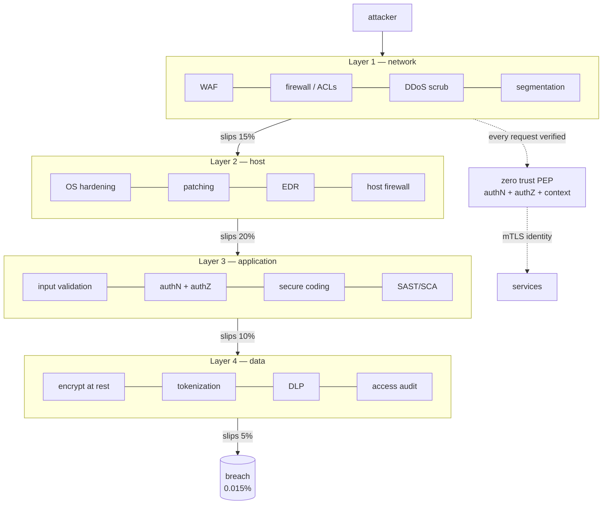

# System Security — A Visual, Worked-Example Guide

> **Companion code:** [`system_security.py`](https://github.com/quanhua92/tutorials/blob/main/csfundamentals/system_security.py).
> **Live demo:** [`system_security.html`](./system_security.html)

---

## 0. TL;DR — the one idea

> **The analogy:** A medieval castle. One outer wall is never enough —
> attackers scale it eventually. So you build **concentric walls**: a moat, an
> outer curtain, an inner keep, and finally a locked treasury. Each wall is
> independently imperfect, but an attacker must defeat **all** of them to reach
> the gold. The **TLS handshake** is the messenger's sealed scroll that proves
> he's really from the king. **mTLS** makes the king prove it **back**. **Secrets
> management** is rotating the lock on the treasury every 90 days so a stolen key
> goes stale. **Zero trust** is the rule that *every* servant shows their badge at
> *every* door — even inside the keep — because the real threat is the traitor
> who already got past the moat.

The whole field reduces to one principle:

> **Never trust a single control. Layer independent defenses so a breach of any
> one is caught by the next, and verify identity on every request regardless of
> where it comes from.**



This bundle simulates all five pillars end-to-end in pure stdlib:

1. **Defense in depth** — four independent layers, multiplicative breach probability
2. **TLS handshake** — TLS 1.2 (2-RTT) vs TLS 1.3 (1-RTT) vs 0-RTT resumption, ECDHE
3. **mTLS** — mutual authentication, workload identity (SPIFFE/SPIRE)
4. **Secrets management** — the rotation lifecycle, a leak-risk model, dual-key overlap
5. **Zero trust** — castle-and-moat vs per-request verification, blast-radius math

---

## 1. How It Works

### 1.1 Defense in depth — independent layers multiply

> **Idea:** No single security control is reliable enough to stand alone.
> Defense in depth stacks **independent** layers (network → host → application →
> data), each with its own controls. Because the layers are independent, the
> probability an attack breaches **all** of them is the **product** of the
> per-layer leak rates — so a stack of good-enough layers leaks far less than any
> one perfect layer.

> From `system_security.py` Section "Defense in Depth":

```
layer     stop_prob   leak_rate   controls
network       85%          15%      WAF, firewall + ACLs, DDoS scrubbing, segmentation
host          80%          20%      OS hardening, patching, EDR / antivirus, host firewall
app           90%          10%      input validation, authN + authZ, secure coding, SCA / SAST
data          95%           5%      encryption at rest, tokenization, DLP, access audit log

combined breach = 0.15 x 0.20 x 0.10 x 0.05 = 0.00015  (0.015%)  = 15 per 100,000 attacks
best single layer (data 95%) leaks 5% = 5,000 per 100,000   ->   333x improvement
```

The attack simulation (100,000 attacks through the stack) confirms the analytic
model: 12 breaches vs an expected 15, with the per-layer stop counts matching
the stop probabilities.

> **Gotcha — independence is everything:** If the same misconfigured IAM role
> grants access at the network, host, AND app layers, those layers are
> **perfectly correlated** and provide the defense of only ONE layer. The
> multiplicative benefit evaporates.
>
> **Gotcha — the floor dominates:** A 99% stack with one 40% layer leaks ~60%.
> The weakest layer sets the user-facing risk — fix the floor before polishing
> the strong layers.

---

### 1.2 TLS handshake — encrypt, authenticate, verify integrity

> **Idea:** TLS provides three guarantees on a channel: **confidentiality**
> (encryption — intermediaries cannot read the data), **authentication** (the
> server proves its identity via an X.509 certificate signed by a trusted CA), and
> **integrity** (tampering is detected). TLS 1.3 collapsed the handshake to a
> single round trip and added 0-RTT resumption.

> From `system_security.py` Section "TLS Handshake":

```
TLS 1.2 full handshake (2 RTT = 100ms before app data):
  C->S  ClientHello                                (version, random_c, ciphers, SNI)
  S->C  ServerHello + Certificate + ServerKeyExchange + HelloDone
  C->S  ClientKeyExchange + ChangeCipherSpec + Finished
  S->C  ChangeCipherSpec + Finished

TLS 1.3 full handshake (1 RTT = 50ms before app data):
  C->S  ClientHello (+ key_share)                  (ECDHE public key in the first flight)
  S->C  ServerHello + {EncryptedExtensions, Cert, CertVerify, Finished}  (encrypted from here)
  C->S  {Finished}

TLS 1.3 0-RTT (resumed session, 0 RTT):
  C->S  ClientHello (+ key_share) + early_data      (app data in the FIRST flight)
  S->C  ServerHello + {Finished}
```

The critical TLS 1.3 trick: the client sends its **ECDHE public key** in the
`ClientHello`, so the server can derive the shared secret immediately and encrypt
its very first response. This is what removes the second round trip.

> **Forward secrecy (ECDHE):** Each session derives **ephemeral** keys from a
> fresh Diffie-Hellman exchange. If the server's long-term private key is stolen
> tomorrow, **past** recorded sessions **cannot** be decrypted — the ephemeral
> keys were destroyed at session end. TLS 1.3 makes ECDHE **mandatory**.
>
> **Gotcha — 0-RTT is replayable:** An attacker who records the early-data flight
> can replay it (a duplicate POST). Only allow 0-RTT for **idempotent**
> operations, or enforce an idempotency key server-side.
>
> **Gotcha — TLS authenticates the channel, not the user:** A valid TLS
> connection to `api.evil.com` still reaches the attacker's server. Always
> validate the certificate's hostname (SAN), not just that a CA signed it.

---

### 1.3 mTLS — mutual authentication

> **Idea:** Standard TLS authenticates only the **server**. mTLS (mutual TLS)
> requires the **client** to also present a certificate, signed by a CA the server
> trusts. The server verifies it — now **both** sides are authenticated and the
> channel is encrypted. This is the identity backbone of service meshes and
> zero-trust internal networks.

> From `system_security.py` Section "mTLS":

```
server-only TLS:
  - Client validates SERVER certificate against trusted CA
  - Server authenticated; client anonymous (auth via app layer)

mTLS (adds the client-cert flight):
  - Client validates SERVER certificate against trusted CA
  - Server requests + validates CLIENT certificate against internal CA
  - Server maps client cert to a workload identity (SPIFFE ID)
  - Server authorizes the request based on that identity

handshake cost: server-only 3,500 bytes  ->  mTLS 5,564 bytes (+2,064, still 1 RTT)
```

The cost of mTLS is ~2 KB more on the wire (the client certificate + a
`CertificateVerify` signature) and one extra verification step — but it stays at
**1 RTT** in TLS 1.3, because the client cert rides in the same encrypted flight
as the client `Finished`.

> **Workload identity (SPIFFE/SPIRE):** A **SPIFFE ID** is a URI-shaped identity
> (e.g. `spiffe://prod.acme.com/payments/service`) issued as a short-lived X.509
> **SVID**, rotated automatically. The certificate **is** the identity — no
> shared passwords, no long-lived keys. Istio and Linkerd implement this in their
> sidecar control plane.
>
> **Gotcha — the internal CA is now a critical root of trust:** If its private key
> leaks, every workload identity it issued is forgeable. Protect it in an HSM and
> rotate its root.
>
> **Gotcha — mTLS authenticates the workload, not the end user:** A compromised
> pod has a valid cert. Pair mTLS with per-request **user** authZ (zero trust) so
> a stolen workload identity cannot impersonate arbitrary users.

---

### 1.4 Secrets management — the rotation lifecycle

> **Idea:** A secret (API key, DB password, signing key) is valuable only while
> it is secret. The lifecycle keeps it that way: generate outside the app,
> distribute via a sidecar, rotate on a schedule, revoke on compromise, and audit
> every access. **Never** bake secrets into images, env vars, or source control.

> From `system_security.py` Section "Secrets Management":

```
lifecycle:  generate -> distribute -> use -> rotate -> revoke -> audit

LEAK-RISK MODEL (daily leak rate = 0.1%):   risk(days) = 1 - (1 - 0.001)^days
  1 day    -> 0.10%
  30 days  -> 2.96%
  90 days  -> 8.61%    (canonical rotation interval)
  365 days -> 30.6%    (a year-old key is risky)

short-lived token (TTL 1h) -> 0.0042%   ->   2066x lower leak risk than a 90-day key
```

The risk model is a compounding probability: each day the secret lives, the
chance it has **already** leaked grows. A 90-day key has an 8.6% cumulative leak
risk; a 1-hour token has 0.0042% — a **2066x** reduction, not because the crypto
is stronger but because the window of compromise is shorter.

**Dual-key rotation** keeps rotation zero-downtime: create the new key alongside
the old (both can **decrypt**), switch writes to the new key, re-encrypt old data
in the background, then revoke the old key after the overlap window (7 days).
Rolling deploys never see a key the other instances cannot decrypt.

> **Gotcha — env vars leak:** Secrets in `ENV` are exposed via
> `/proc/<pid>/environ`, process listings, and crash dumps. Inject via a mounted
> volume or a sidecar that fetches on demand and caches with a short TTL.
>
> **Gotcha — git is forever:** A secret committed to git is compromised forever —
> the history is forever. Rotate **immediately** AND scrub history
> (`git filter-repo`), because anyone may have already cloned the repo.

---

### 1.5 Zero trust — never trust, always verify

> **Idea:** Castle-and-moat security trusts anything **inside** the network (a
> VPN or office IP grants broad access). Once an attacker breaches the perimeter
> — a phished credential, a vulnerable pod — they move **laterally** with little
> resistance. Zero trust (BeyondCorp, NIST SP 800-207) eliminates implicit trust:
> **every** request is authenticated and authorized, regardless of where it
> originates, based on identity + device posture + context — not network position.

> From `system_security.py` Section "Zero Trust":

```
estate = 100 internal services, compromised cred authorized for 2% (least privilege)

castle-and-moat: attacker is "inside" the VPN -> reaches ALL 100 services, ~7 days to detect
zero-trust:      every request hits a PEP -> authN + authZ + continuous eval
                 attacker reaches only 2 services, ~5 min to detect

blast-radius reduction = 50x smaller   (+ ~2016x faster detection)
compromise cost:  castle 100 svc x 168h = 16,800 svc-hours
                  zero-trust 2 svc x 5min = 0.2 svc-hours   ->  84,000x lower impact
```

The unifying insight: in a flat network, a **single** compromised credential
unlocks the whole estate; under zero trust, the same credential unlocks only what
least-privilege grants it, and continuous evaluation flags the anomalous access in
minutes instead of days.

> **Gotcha — zero trust is a property, not a product:** Buying a ZTNA appliance
> while services still accept shared tokens with no per-request authZ changes
> nothing. The architecture must enforce verification on **every** request.
>
> **Gotcha — bootstrap identity:** The first request still needs to be verified.
> Workload identity (mTLS + SPIFFE) is what makes per-request authZ possible
> without a password on every call — the certificate proves who is calling.

---

## 2. The Math

### Defense-in-depth — multiplicative breach

For layers with stop probabilities `s_1, s_2, ..., s_n` (each layer independently
stops an attack with probability `s_i`), the combined breach probability is the
product of the complementary leak rates:

```
leak_i       = 1 - s_i
combined     = leak_1 × leak_2 × ... × leak_n
             = (1 - s_1)(1 - s_2)...(1 - s_n)
```

For the four-layer stack:

```
network: (1 - 0.85) = 0.15
host:    (1 - 0.80) = 0.20
app:     (1 - 0.90) = 0.10
data:    (1 - 0.95) = 0.05

combined = 0.15 × 0.20 × 0.10 × 0.05 = 0.00015  (0.015%)
```

This is **15 breaches per 100,000 attacks** — versus **5,000** for the best
single layer alone, a **333x** improvement. The benefit compounds with every
independent layer added.

> The live demo (`system_security.html`) recomputes this and the LCG attack
> simulation in pure JS and prints `[check: OK]` — the math is byte-for-byte
> identical to Python.

### TLS handshake latency

```
handshake_latency = flights × RTT

TLS 1.2:        2 × RTT
TLS 1.3:        1 × RTT       (halved — key share in ClientHello)
TLS 1.3 0-RTT:  0 × RTT       (resumed — early data in first flight)
```

At `RTT = 50ms`: TLS 1.2 = 100ms, TLS 1.3 = 50ms, 0-RTT = 0ms. TLS 1.3 saves
**one full round trip** (50ms) on every new connection.

### Secrets leak risk

```
risk(days) = 1 - (1 - leak_rate)^days        (compounds daily)

reduction(short vs long) = risk(long_days) / risk(short_days)
                         ≈ long_days / short_days     (for small leak_rate)
```

For `leak_rate = 0.001` (0.1%/day): a 90-day key has risk 8.61%; a 1-hour token
has risk 0.0042% — a **2066x** reduction, which approximates the ratio of the
windows of exposure (90×24 = 2160 hours).

### Zero-trust blast radius

```
castle_reach = resources                        (flat network, full lateral movement)
zt_reach     = scope × resources                (least privilege, per-request authZ)
reduction    = castle_reach / zt_reach = 1 / scope

compromise_cost = reach × detect_hours
```

For `resources = 100`, `scope = 2%`: castle reaches 100 services over ~168 hours
(7 days to detect) = 16,800 service-hours; zero trust reaches 2 services over
~0.083 hours (5 min) = 0.2 service-hours — an **84,000x** lower impact.

---

## 3. Tradeoffs

| Decision | Option A | Option B | When |
|---|---|---|---|
| **Defense layers** | Many independent layers (multiply) | One perfect layer | Always layer; the product beats any single control |
| **TLS version** | TLS 1.3 (1-RTT, mandatory FS) | TLS 1.2 (legacy clients) | Default to 1.3; keep 1.2 only for un-upgradable clients |
| **0-RTT** | Allow (fast resumed sessions) | Disable | Idempotent reads → allow; mutating POSTs → disable (replay risk) |
| **Client auth** | mTLS (workload identity) | App-layer tokens (user identity) | Service-to-service → mTLS; user-to-service → tokens (often both) |
| **Secret lifetime** | Short-lived tokens (1h) | Long-lived keys (90d) | Blast-radius-sensitive → short TTL; infra keys → rotate 90d |
| **Trust model** | Zero trust (per-request verify) | Castle-and-moat (trust by location) | Always zero trust for internal; flat network is the default to escape |
| **Key rotation** | Dual-key overlap (zero downtime) | Big-bang swap | Always overlap; a hard switch breaks rolling deploys |

**Decision tree:**
- New connection, latency-sensitive? → **TLS 1.3** (1-RTT); 0-RTT only for idempotent resumed reads
- Service-to-service inside the mesh? → **mTLS** with SPIFFE identity, sidecar-enforced
- Storing an API key / DB password? → **secrets manager** (Vault/KMS), sidecar-injected, rotate 90d
- Granting access to an internal resource? → **zero trust**: authN + authZ on every request, least privilege
- Layering defenses? → ensure layers are **independent** (different IAM, different failure modes) or they don't multiply

---

## 4. Real-World Usage

| System | Mechanism | Notes |
|---|---|---|
| **Cloudflare WAF** | Layer 1 (network) | Managed rulesets, bot mitigation, DDoS scrubbing at the edge |
| **AWS WAF + Shield** | Layer 1 (network) | Layer-7 filter + Layer-3/4 DDoS protection, integrated with CloudFront |
| **TLS 1.3** | Channel encryption | Mandatory in modern browsers; ECDHE-only ciphers for forward secrecy |
| **Istio / Linkerd** | mTLS service mesh | Sidecar transparently enforces mTLS pod-to-pod; SPIFFE identity via control plane |
| **SPIFFE / SPIRE** | Workload identity | Short-lived X.509 SVIDs; the cert IS the identity, no shared passwords |
| **HashiCorp Vault** | Secrets management | Dynamic secrets (short-lived), automatic lease revocation, audit log |
| **AWS KMS / Secrets Manager** | Secrets + envelope encryption | Automatic rotation (RDS/Redshift), envelope encryption for app data |
| **Google BeyondCorp** | Zero trust | Per-request access proxy; identity + device posture, no VPN trust |
| **NIST SP 800-207** | Zero-trust architecture | The reference model: PEP/PDP separation, continuous verification |
| **OpenZiti / Tailscale** | Zero-trust networking | Identity-based overlay; deny-by-default, per-service authorization |

---

## Killer Gotchas

- **Layers must be independent to multiply:** If one IAM role, one key, or one
  misconfiguration spans multiple layers, they are **correlated** and collapse to
  the defense of a single layer. Audit for shared dependencies across layers.

- **The weakest layer dominates user-visible risk:** A 99% / 99% / 99% / 40%
  stack leaks ~60% — the floor sets the risk. Fix the worst layer before
  polishing the strong ones.

- **0-RTT is replayable:** Early data can be captured and replayed. Restrict
  0-RTT to idempotent operations (GET) or enforce idempotency keys on writes.

- **TLS authenticates the channel, not the user:** Always validate the cert's
  hostname (SAN), not just the CA chain. A valid cert for `api.evil.com` still
  reaches the attacker.

- **The internal CA is a critical root of trust:** Under mTLS, a leaked CA key
  forges every workload identity it issued. Protect it in an HSM and rotate the
  root on a schedule.

- **mTLS authenticates the workload, not the user:** A compromised pod has a
  valid cert. Pair mTLS with per-request **user** authZ so a stolen workload
  identity cannot impersonate arbitrary users.

- **Env vars leak secrets:** They surface in `/proc/<pid>/environ`, `ps -e`,
  crash dumps, and container inspect. Inject via a mounted volume or sidecar.

- **Git is forever:** A committed secret is compromised forever — rotate it
  immediately and scrub history with `git filter-repo`; assume it was already
  cloned.

- **Zero trust is a property, not a product:** A ZTNA appliance in front of
  services that still accept shared tokens changes nothing. The architecture must
  verify every request.

- **Bootstrap identity:** The first request still needs verifying. Workload
  identity (mTLS + SPIFFE) is what makes per-request authZ possible without a
  password on every call — the cert proves who is calling.
