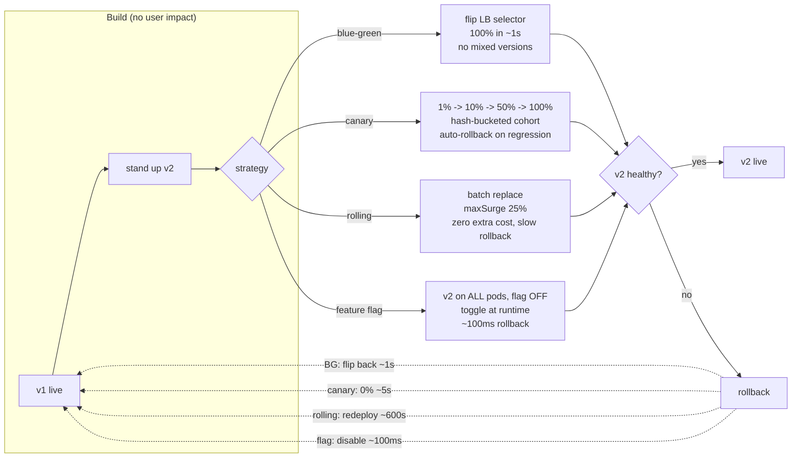

# Zero-Downtime Deployments — A Visual, Worked-Example Guide

> **Companion code:** [`zero_downtime.py`](https://github.com/quanhua92/tutorials/blob/main/csfundamentals/zero_downtime.py).
> **Live demo:** [`zero_downtime.html`](./zero_downtime.html)

---

## 0. TL;DR — the one idea

> **The analogy:** Zero-downtime deploy is **changing a tire while the car is
> moving**. You cannot stop the car (users are driving on it 24/7), so you
> either (a) bolt a **whole new wheel on** and switch the weight in one snap
> (blue-green), (b) let a **few cars test the new wheel** before everyone
> switches (canary), (c) swap **one lug nut at a time** (rolling), or (d)
> **ship the new wheel to every car but keep it locked** until you radio the
> unlock command (feature flags). The **rollback** is how fast you undo it
> when the new wheel wobbles.

The whole field reduces to one distinction:

> **Deploying code** (shipping the bits) **and releasing a feature** (turning
> it on for users) are **different events**. Confusing them is the source of
> almost every "we took the site down" story.



This bundle simulates all five pillars end-to-end in pure stdlib:

1. **Blue-green** — two full fleets, atomic LB flip, instant rollback, 2x cost
2. **Canary** — deterministic hash bucketing, the 1%→10%→50%→100% rollout
3. **Rolling update** — batch replacement with health checks, `maxSurge`
4. **Feature flags** — deploy ≠ release, runtime toggle, millisecond rollback
5. **Rollback + impact comparison** — one bad v2 replayed under all four

---

## 1. How It Works

### 1.1 Blue-Green — the atomic flip

> **Idea:** Run two **identical** production environments side by side
> ("blue" and "green"). At any moment exactly one serves 100% of traffic.
> Deploy = build the new version on the **idle** color, health-check it with
> **zero** real traffic, then atomically flip the load balancer's selector
> label. Rollback = flip back.

> From `zero_downtime.py` Section "Blue-Green Deployment":

```
INITIAL   blue  = v1.0 (100%)   green = v1.0 (0%)     active = blue
STEP 1    green = v2.0 (0%)     -- health-check, ZERO real traffic
STEP 2    flip selector blue -> green (atomic, ~1s)    active = green  (100% on v2.0)
ROLLBACK  flip selector back to blue (~1s)             active = blue   (100% on v1.0)

BAD-DEPLOY IMPACT: exposure 100%, window 61s, failed 61,000, downtime-equiv 61s
```

- **Cost:** 2x fleet during the swap window (both colors provisioned).
- **Mixed versions:** none — only one color is ever live.
- **Rollback speed:** ~1s (an LB selector update). Fastest of any strategy
  *that has already flipped*, but **all** traffic was already exposed.

> **Gotcha — bi-directional schema compatibility:** At the flip instant the
> schema must work for **both** v1 (the rollback target) and v2. v2 cannot
> `DROP` a column v1 still reads. Use **expand-contract** across releases.
>
> **Gotcha — shared cache poisoning:** key the cache by version
> (`v2:user:123`) or run separate cache clusters during the swap, else v2
> reads v1's stale objects.

---

### 1.2 Canary — deterministic cohort, advance gate by gate

> **Idea:** Route a small slice of traffic to the new version; watch real
> production metrics; only advance if the canary is statistically clean.
> The cohort is chosen by a **deterministic hash** so a given user is always
> in or always out — no sticky-session bias, no flapping between versions.

The bucketing rule is the heart of canary (and feature flags):

```
in_canary(flag, user) = fnv1a(flag + ":" + user) % 100  <  rollout_pct
```

> From `zero_downtime.py` Section "Canary Deployment":

```
flag = 'checkout_v2'      schedule = [1, 10, 50, 100]

per-user buckets (deterministic, never change):
  u_1001  bucket = 78      u_1006  bucket = 35
  u_1002  bucket = 59      u_1007  bucket = 16
  u_1003  bucket = 40      u_1008  bucket = 45
  u_1004  bucket = 73      u_1009  bucket = 26
  u_1005  bucket = 54      u_1010  bucket = 88

progressive rollout (cohort grows monotonically):
  1%   -> 0/10 users      50%  -> 5/10 users
  10%  -> 0/10 users      100% -> 10/10 users

BAD-DEPLOY IMPACT: exposure 1%, window 35s, failed 350, downtime-equiv 0.35s
```

Because bucketing is **monotonic** — `bucket < 1` implies `bucket < 10` — a
user who sees the canary at 1% still sees it at 10%. No user flaps between
versions as you advance.

> **Canary analysis (Netflix Kayenta):** compare the canary cohort against a
> baseline cohort on error rate, p99 latency, and **business metrics**
> (conversion, session duration) using the **Mann-Whitney U test** (non-
> parametric — no normality assumption). Auto-rollback when p-value < 0.05.
>
> **Gotcha — business metrics matter most and are omitted most often:** error
> rate can be flat while revenue quietly drops 2%. Always include a money
> metric.
>
> **Gotcha — cohort by user ID, not session:** sticky sessions skew the
> canary toward returning users and hide new-user bugs.

---

### 1.3 Rolling update — zero cost, longest mixed window

> **Idea:** Replace pods in **batches**: spin up new ones up to `maxSurge`,
> wait for readiness, then terminate old ones down to `maxUnavailable`.
> **Zero** extra fleet cost, but the **longest** mixed-version window of any
> strategy. Kubernetes default. Rollback is **slow** — you must redeploy the
> old version back through the same batches.

> From `zero_downtime.py` Section "Rolling Update":

```
fleet = 500 replicas   maxSurge = 25%   maxUnavailable = 0   wave = 300s
batch = 125 pods/wave   waves = 4

wave  action        v1 pods   v2 pods   elapsed
start initial           500         0        0s
 1    replace 125        375       125      300s   health OK
 2    replace 125        250       250      600s   health OK
 3    replace 125        125       375      900s   health OK
 4    replace 125          0       500     1200s   health OK

mixed-version window = 1200s (20 min)
BAD-DEPLOY IMPACT: exposure 25%, window 690s, failed 172,500, downtime-equiv 172.5s
```

`maxUnavailable: 0` guarantees capacity never drops below the desired count;
`maxSurge: 25%` bounds the extra capacity during rollout to 625 pods.

> **Gotcha — forward-compatible migration:** for the whole 20-minute window,
> old code (rollback target) and new code read the **same** schema. `DROP
> COLUMN` in this release breaks rollback. Use expand-contract across releases.
>
> **Gotcha — readiness probe depth:** the probe must validate DB + cache
> connections, not just return HTTP 200, else broken pods pass and start
> failing real requests.

---

### 1.4 Feature flags — deploy ≠ release

> **Idea:** Ship the new code to **every** instance with the flag **OFF**.
> Activation is a runtime config change — **no deploy, no pod restart**. This
> **decouples deploy** (ship the bits) **from release** (turn it on). Rollback
> = disable the flag (~100ms). Negligible infra cost.

The bucketing rule is identical to canary — the difference is **when** you
shift traffic: canary shifts via deploy/replica-ratio, flags shift via a
config fetch every request already makes.

> From `zero_downtime.py` Section "Feature Flags":

```
deploy state: ALL 500 replicas run v2.0 code; flag checkout_v2 = OFF  -> 0% active

flag lifecycle (runtime toggles, NO deploys between steps):
  set checkout_v2 =   1%  -> 0/10 active
  set checkout_v2 =  10%  -> 0/10 active
  set checkout_v2 =  50%  -> 5/10 active
  set checkout_v2 = 100%  -> 10/10 active

INSTANT ROLLBACK: set checkout_v2 = 0%  -> 0/10 active   (~100ms)
BAD-DEPLOY IMPACT: exposure 1%, window 15.10s, failed 151, downtime-equiv 0.151s
```

> **Gotcha — flag lifecycle discipline:** every flag needs a **removal date**
> at creation. Flags older than 90 days without an owner should block builds.
> **Permanent config** (pool sizes, timeouts) belongs in env vars, **not**
> feature flags — flags are temporary release controls.
>
> **Gotcha — coordinated multi-service flips:** for an all-or-nothing protocol
> change across two services, deploy **both** with old behavior, then enable
> the flag in the **caller** only after both are healthy.

---

### 1.5 Rollback + impact — one bad v2, four strategies

> **Idea:** Take the **same** defective v2 (fails 100% of the traffic it
> receives) and ship it under each strategy. The only difference is how fast
> the blast is contained. The unifying metric is **downtime-equivalent** =
> `failed_requests / RPS` — the number of seconds of a *full* outage with the
> same user-visible impact.

> From `zero_downtime.py` Section "Rollback + Impact Comparison":

```
traffic model: 1000 req/s, v2 fail rate = 100%

strategy         exposure  detect  rollback   failed     down-eqv
Blue-Green          100%     60s        1s     61,000     61.00s
Canary                1%     30s        5s        350      0.35s
Rolling              25%     90s      600s    172,500    172.50s
Feature Flags         1%     15s     0.1s        151      0.15s

BEST  = Feature Flags   151 failed  (0.15s)
WORST = Rolling     172,500 failed  (172.5s)
ratio = 1,142x  (worst / best)
```

The impact spans **four orders of magnitude** across strategies. The choice of
strategy is, by itself, the single biggest lever on user-visible downtime.

---

## 2. The Math

### Impact model — `failed_requests` and `downtime-equivalent`

For a strategy with traffic **exposure** `e` (fraction on v2), **detection**
latency `d` (seconds to notice the regression), and **rollback** latency `r`
(seconds to revert), at `RPS` requests/sec with v2 failing at rate `f`:

```
window            = d + r                         (seconds the bug is live)
failed_requests   = RPS × e × f × window
downtime-equiv    = failed_requests / RPS
                  = e × f × window                (seconds of full outage)
```

Downtime-equivalent factors out `RPS`, so you can compare strategies on one
axis regardless of absolute traffic. From the simulation:

```
blue-green:    1.00 × 1.0 × (60 + 1)   = 61.00s
canary:        0.01 × 1.0 × (30 + 5)   =  0.35s
rolling:       0.25 × 1.0 × (90 + 600) = 172.50s
feature flags: 0.01 × 1.0 × (15 + 0.1) =  0.15s
```

> The live demo (`zero_downtime.html`) recomputes each of these in pure
> JavaScript and prints `[check: OK] impact == .py` — the math is byte-for-byte
> identical to Python.

### Deterministic bucketing — FNV-1a

User cohort assignment uses **FNV-1a 32-bit** (`h = 0x811c9dc5`; for each byte
`h ^= byte; h *= 0x01000193`), then `bucket = h % 100`. Properties:

```
determinism   : bucket(flag, user) is constant for all time
monotonicity  : bucket < 1  =>  bucket < 10  (no user flaps when advancing)
uniformity    : over many users, buckets distribute ~uniformly over [0,99]
no stickiness : keyed on user ID, not session, so cohorts are unbiased
```

At 1% rollout, the expected cohort is exactly `floor(100 × 0.01) = 1` bucket
out of 100 — so a 10-user sample may show **0** users (as in this bundle:
the smallest bucket is 16), which is correct, not a bug. At scale (1M users)
the cohort is ~10,000.

### Rolling-update batch math

With fleet size `N`, `maxSurge = s%`, `maxUnavailable = 0`:

```
batch         = floor(N × s / 100)            (pods replaced per wave)
waves         = ceil(N / batch)               (waves to full rollout)
max pods      = N + batch                     (peak during a wave)
mixed window  = waves × wave_seconds
```

For `N = 500, s = 25`: batch = 125, waves = 4, peak = 625 pods, mixed window
= 4 × 300 = 1200s (20 min).

### 99.9% uptime budget

A 99.9% SLA allows ~**8.7 hours** of downtime per year. A single 60-minute
botched deploy consumes:

```
60 min / 8.7 h ≈ 11.5%   of the YEARLY budget in one incident
```

This is why blast-radius control (canary/flags) — not just speed of recovery
— matters: a blue-green flip that exposes 100% for 61s eats ~0.2% of the
budget; a rolling rollback that leaks 25% for 690s eats ~0.5% *per incident*.

---

## 3. Tradeoffs

| Decision | Option A | Option B | When |
|---|---|---|---|
| **Rollback speed** | Blue-green (~1s LB flip) / flags (~100ms disable) | Rolling (~minutes, redeploy old) | Critical path / kill switch → A; cost-sensitive stateless → B |
| **Blast radius** | Canary/flags (1% cohort) | Blue-green (100%) / rolling (25%/batch) | High-risk change → 1%; safe patch → wider |
| **Infra cost** | Rolling (zero extra) | Blue-green (2x during swap) | Cost-sensitive → rolling; mission-critical → blue-green |
| **Mixed versions** | Blue-green/flags (none at runtime) | Canary/rolling (concurrent) | Breaking schema → avoid mixed; forward-compatible → mixed OK |
| **Decouple deploy/release** | Feature flags (separate events) | All others (deploy IS the release) | Product launches / A-B / kill switches → flags |
| **Schema migration** | Expand-contract (multi-release) | Big-bang `ALTER TABLE` | **Always** expand-contract on large tables |

**Decision tree:**
- Stateless + critical path + schema pre-applied? → **blue-green**
- High-risk change / ML model / new feature? → **canary**
- Cost-sensitive + backward-compatible? → **rolling**
- Product launch / A-B test / kill switch / multi-service protocol? → **feature flags**
- Need to rename/drop a column on a 100M-row table? → **expand-contract**, then any of the above

---

## 4. Real-World Usage

| System | Strategy | Notes |
|---|---|---|
| **Kubernetes** | Rolling (default), blue-green, canary via Argo/Istio | `maxSurge`/`maxUnavailable` knobs; Istio `VirtualService` weighted routing for canary |
| **Netflix** | Canary with Kayenta | Mann-Whitney U statistical canary analysis; auto-rollback on p < 0.05 |
| **Facebook** | Feature flags (Gatekeeper) + dark launches | Code on all machines; activated for 0%, dark period lasts days/weeks |
| **Twitter** | Shadow traffic (Diffy) | Mirror production traffic to new service; cluster response diffs; zero-risk validation |
| **AWS CodeDeploy** | Blue-green, canary, all-at-once | First-class deployment strategies; automatic rollback on alarm |
| **Spinnaker** | All four + automated analysis | Pipeline orchestration; integrates Kayenta for canary verdicts |
| **LaunchDarkly / Flagsmith** | Feature flags | Runtime targeting rules; percentage rollouts; audit log + TTL enforcement |
| **Stripe** | Feature flags + batched backfill migrations | Backfill jobs as low-priority workers with pause/resume + progress table |

---

## Killer Gotchas

- **Deploy ≠ release:** The #1 source of outages. Ship code to everyone with
  the flag **off**, then release on your schedule. Feature flags make this
  explicit; the other strategies conflate the two.

- **Schema must survive mixed versions:** During any window where old and new
  code run together (canary, rolling), the schema must serve **both**. `RENAME
  COLUMN` is always breaking. `DROP COLUMN` cannot happen in the same release
  that stops using it — the rollback target still references it. **Always
  expand-contract** across 2+ releases.

- **`ADD COLUMN NOT NULL` rewrites the table:** On a 100M-row table this holds
  an exclusive lock for minutes. Add as `DEFAULT NULL`, batch-backfill (5K
  rows, 50ms sleep), then add the constraint in a later step.

- **Business metrics, not just error rate:** A canary can show identical error
  rates while conversion drops 2%. Always include a money/business metric in
  the canary verdict — it is the most important and the most often omitted.

- **Cohort by user ID, never by session:** Sticky sessions bias the canary
  toward returning users and hide new-user bugs. Hash on a stable user ID.

- **Readiness probe depth:** The probe must check **all** critical dependencies
  (DB connection pool, cache reachability), not just return HTTP 200 — else
  broken pods pass the gate and start failing real requests.

- **Shared cache poisoning (blue-green):** v2 reading v1's cached objects
  causes silent corruption. Key by version (`v2:user:123`) or run separate
  cache clusters during the swap.

- **Rolling rollback is slow:** You cannot "flip" — you redeploy the old
  version back through the same batches. For a 500-pod fleet that is ~10 min
  of continued exposure. Plan the blast radius accordingly.

- **Feature flags need a TTL:** Every flag gets a removal date at creation.
  Flags older than 90 days without an owner block builds. Permanent config
  (pool sizes, timeouts) lives in env vars, **not** flags.

- **`CREATE INDEX` blocks writes:** Use `CREATE INDEX CONCURRENTLY` (Postgres)
  so the build does not hold a write lock — at the cost of taking longer and
  not running inside a transaction.

- **Shadow traffic is read-only:** Istio `mirror` copies production traffic to
  the new service and **discards** the responses. It validates the new code
  against real load with zero user impact — the safest possible pre-canary
  step.
