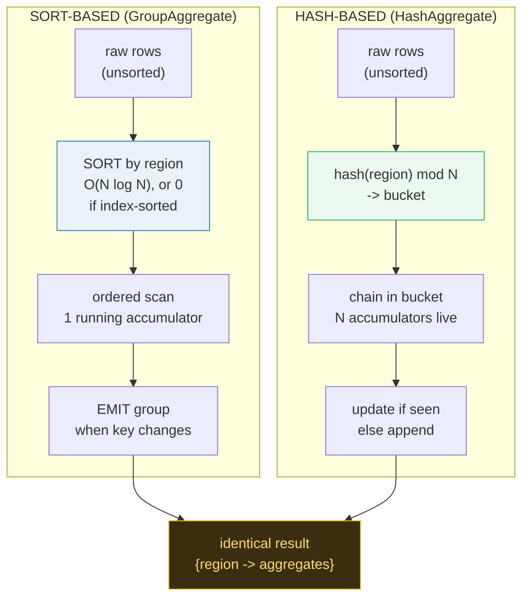

# Aggregation Pipeline (GROUP BY / HAVING) — A Visual, Worked-Example Guide

> **Companion code:** [`aggregation_pipeline.py`](./aggregation_pipeline.py). **Every
> table, hash bucket, and aggregate number in this guide is printed by
> `python3 aggregation_pipeline.py`** — change the code, re-run, re-paste. Nothing
> here is hand-computed.
>
> **Live animation:** [`aggregation_pipeline.html`](./aggregation_pipeline.html) — open
> in a browser; it steps through each input row feeding BOTH strategies side by
> side, recomputes in JS with the *identical* formula, and gold-checks against
> the `.py`.
>
> **Source material:** PostgreSQL docs §7.5 `GROUP BY`/`HAVING`, §76.1 *How
> PostgreSQL Executes a Query* & the `GroupAggregate`/`HashAggregate` nodes,
> §20.4 `work_mem`; PostgreSQL 10 release notes (parallel aggregate /
> `combinefunc`); Silberschatz/Korth/Sudarshan, *Database System Concepts*
> §16 (Query Processing — sort-based & hash-based aggregation); Hellerstein,
> *Architecture of a Database System* ch. 5.

---

## 0. TL;DR — one contract, two machines

A `GROUP BY` clause is a **contract** ("collapse the table into one row per
group, with the columns folded by group key"). It says *nothing* about how to
compute the fold. Two completely different execution engines can honour that
contract, and they produce **byte-identical output**:

> *Picture 12 sales slips scattered on a desk. You must report total sales per
> region. You can either **(a) sort the slips into region piles first, then run
> down each pile adding up** (sort-based), or **(b) put a row of 8 pigeonholes
> on the wall; for each slip, hash its region to pick a hole, and drop it into
> that hole's running tally** (hash-based). Either way the four region totals at
> the end are the same. The planner just picks whichever is cheaper: if the
> slips are already sorted (an index did it) sort-based is free; if not and the
> holes fit in memory, hashing skips the whole sort.*



- **Sort-based** = sort by the group key, then a **single linear scan** keeping
  one running accumulator; **emit** a group the instant its key ends. O(1) live
  state per group *in scan order*. PostgreSQL node: **`GroupAggregate`**.
- **Hash-based** = **skip the sort**; hash each row's key into a bucket of
  accumulators (separate chaining). All distinct groups live at once. PostgreSQL
  node: **`HashAggregate`**.
- **The planner's rule of thumb**: pre-sorted input (from an index or an
  explicit `Sort`) → sort-based; unsorted input that fits in `work_mem` →
  hash-based. Section 4.
- **The lineage**: `raw GROUP BY` → choose `Sort + GroupAggregate` *or*
  `HashAggregate` → on top, `HAVING`, `DISTINCT`, and parallel `Partial +
  Final Aggregate` are all the *same* machinery (Sections 5–8).

### Why it matters

The choice is not cosmetic. A `SUM ... GROUP BY` over 10M rows: sorting costs
~10M·log operations; hashing is a single O(N) pass. If the data is already
sorted by an index, the sort is free and you save the hash table's memory. And
when distinct groups exceed `work_mem`, the hash path must **spill to disk** —
get that wrong and a query goes from milliseconds to minutes (Section 7).

### Glossary

| Term | Plain meaning |
|---|---|
| **GROUP BY key** | the column(s) collapsed on (here `region`). Rows sharing it form one **group**. |
| **aggregate function** | `COUNT`/`SUM`/`AVG`/`MIN`/`MAX` — the per-group fold. Split into a **transfunc** (fold one row) + **finalfunc** (final value; `AVG` = sum/count). |
| **accumulator** | per-group running state. Here `{count, sum, min, max}`. One per distinct group. |
| **sort-based agg** | sort by key, ordered scan, emit on key change. 🔗 the free-sort case rides an index: [`BTREE.md`](./BTREE.md) / [`COVERING_INDEX.md`](./COVERING_INDEX.md). |
| **hash-based agg** | hash key into bucket of accumulators; no sort. 🔗 hashing concept: [`HASH_INDEX.md`](./HASH_INDEX.md). |
| **HAVING** | a `WHERE` that runs **after** aggregation; filters whole **groups**, can reference aggregates. |
| **DISTINCT** | collapse duplicate keys. Implemented with the **same** operator as GROUP BY, no aggregate fns. |
| **work_mem** | per-operation RAM budget (PostgreSQL default 4 MB). Hash table must fit or it **spills**. |
| **spill / batch** | when the hash table exceeds `work_mem`, partition rows by a hash bit into **batches**; keep one in memory, write the rest to temp, re-probe each. 🔗 buffer/memory siblings: [`FREE_SPACE_MAP.md`](./FREE_SPACE_MAP.md), [`PAGE_EVICTION.md`](./PAGE_EVICTION.md). |
| **partial agg** | in a parallel query each worker aggregates its slice ("partial"); the leader **combines** partials via **combinefunc**. |

---

## 1. The worked example — 12 sales records

The whole guide runs on this tiny deterministic table (`id, region, product,
total`). Small enough to print every number, big enough to exercise collisions,
spilling, and parallel combine.

```sql
SELECT region, COUNT(*), SUM(total), AVG(total), MIN(total), MAX(total)
FROM sales
GROUP BY region;
```

The 4 regions fold 12 rows into 4 groups. As we'll see, the answer is always:

> From `aggregation_pipeline.py` Gold Check — the answer, no matter the strategy:

| region | COUNT(*) | SUM(total) | AVG(total) | MIN(total) | MAX(total) |
|--------|----------|------------|------------|------------|------------|
| East   | 3        | 1060       | 353.33     | 280        | 460        |
| North  | 3        | 1040       | 346.67     | 250        | 410        |
| South  | 3        | 645        | 215.00     | 175        | 290        |
| West   | 3        | 1000       | 333.33     | 150        | 540        |
| TOTAL  | 12       | 3745       |            |            |            |

The rest of this guide is **how** each engine arrives there, and why they agree.

---

## 2. Strategy A — sort-based (GroupAggregate)

Sort all rows by the group key, then one linear scan with a single running
accumulator. **Emit** the finished group the instant the key changes.

> From `aggregation_pipeline.py` Section A — sorted input + ordered scan:

**Phase 1** sorts by `region` (stable, so ties keep input order; East < North <
South < West alphabetically):

| step | id | region | product | total |
|------|----|--------|---------|-------|
| 1    | 3  | East   | Widget  | 320   |
| 2    | 7  | East   | Gadget  | 280   |
| 3    | 11 | East   | Widget  | 460   |
| 4    | 1  | North  | Widget  | 250   |
| 5    | 5  | North  | Gadget  | 410   |
| 6    | 9  | North  | Widget  | 380   |
| 7    | 2  | South  | Gadget  | 180   |
| 8    | 6  | South  | Widget  | 290   |
| 9    | 10 | South  | Gadget  | 175   |
| 10   | 4  | West   | Gadget  | 150   |
| 11   | 8  | West   | Widget  | 540   |
| 12   | 12 | West   | Gadget  | 310   |

**Phase 2** is the ordered scan. Watch the accumulator accumulate, then `EMIT`
on the key boundary:

```
step  region  total   action                 acc.count  acc.sum
 1    East    320     start 'East'              1         320
 2    East    280     fold row                  2         600
 3    East    460     fold row                  3        1060
                       >>> EMIT group 'East' (count=3, sum=1060)
 4    North   250     start 'North'             1         250
 5    North   410     fold row                  2         660
 6    North   380     fold row                  3        1040
                       >>> EMIT group 'North' (count=3, sum=1040)
 7    South   180     start 'South'             1         180
 ...
```

> From `aggregation_pipeline.py` Section A — sort-based result:

| region | COUNT(*) | SUM(total) | AVG(total) | MIN(total) | MAX(total) |
|--------|----------|------------|------------|------------|------------|
| East   | 3        | 1060       | 353.33     | 280        | 460        |
| North  | 3        | 1040       | 346.67     | 250        | 410        |
| South  | 3        | 645        | 215.00     | 175        | 290        |
| West   | 3        | 1000       | 333.33     | 150        | 540        |
| TOTAL  | 12       | 3745       |            |            |            |

**Memory:** exactly **one** accumulator live at a time (plus the one being
emitted). That is the whole appeal of sort-based: O(1) state per group in scan
order, **no hash table, no spill** — but you paid for the sort.

> The "free sort": if the input already arrives sorted — e.g. an **Index Scan**
> on a B-tree over `(region)` — Phase 1 is **0 cost** and `GroupAggregate` is
> strictly better than hashing. 🔗 [`BTREE.md`](./BTREE.md),
> [`COVERING_INDEX.md`](./COVERING_INDEX.md).

---

## 3. Strategy B — hash-based (HashAggregate)

Skip the sort. For each row: `bucket = hash(region) mod N_BUCKETS`; look in that
bucket's **chain** for the region; seen it → update its accumulator, new →
append a fresh one.

> From `aggregation_pipeline.py` Section B — the hash function and bucket
> assignment. `hash(region) = (hash*31 + ord(c)) mod 2^32`, then `mod 8`:

| region | full hash | bucket mod 8 |
|--------|-----------|--------------|
| East   | 2152477   | 5            |
| North  | 75454693  | 5            |
| South  | 80075181  | 5            |
| West   | 2692559   | 7            |

**A collision:** three distinct regions (`East`, `North`, `South`) all land in
bucket 5. They are disambiguated by a **chain** (linked list) inside the bucket
— this is **separate chaining**. Bucket 7 holds `West` alone; the rest are
empty. (We use a *deterministic* polynomial hash, not Python's built-in
`hash()`, which is randomized by `PYTHONHASHSEED` and would give different
buckets every run.)

> From `aggregation_pipeline.py` Section B — streaming build (one row at a time):

| step | region | total | bucket | action          | chain after                          |
|------|--------|-------|--------|-----------------|--------------------------------------|
| 1    | North  | 250   | 5      | NEW → append    | b5=[North]                           |
| 2    | South  | 180   | 5      | NEW → append    | b5=[North, South]                    |
| 3    | East   | 320   | 5      | NEW → append    | b5=[North, South, East]              |
| 4    | West   | 150   | 7      | NEW → append    | b7=[West]                            |
| 5    | North  | 410   | 5      | update existing | b5=[North, South, East]              |
| 6    | South  | 290   | 5      | update existing | b5=[North, South, East]              |
| ...  | ...    | ...   | ...    | ...             | ...                                  |
| 12   | West   | 310   | 7      | update existing | b7=[West]                            |

Final hash table (bucket → chain → accumulator):

```
bucket 5: North{cnt=3,sum=1040} -> South{cnt=3,sum=645} -> East{cnt=3,sum=1060}
bucket 7: West{cnt=3,sum=1000}
buckets 0,1,2,3,4,6: (empty)
```

> From `aggregation_pipeline.py` Section B — hash-based result (note: identical
> to sort-based, Section 2):

| region | COUNT(*) | SUM(total) | AVG(total) | MIN(total) | MAX(total) |
|--------|----------|------------|------------|------------|------------|
| East   | 3        | 1060       | 353.33     | 280        | 460        |
| North  | 3        | 1040       | 346.67     | 250        | 410        |
| South  | 3        | 645        | 215.00     | 175        | 290        |
| West   | 3        | 1000       | 333.33     | 150        | 540        |
| TOTAL  | 12       | 3745       |            |            |            |

**Memory:** *all* distinct groups live **simultaneously** (one accumulator
each). If that exceeds `work_mem` we can't just emit-and-forget like the sort
path — we must **spill** (Section 7).

---

## 4. The planner's choice + the GOLD CHECK

PostgreSQL picks between the two using the **estimated number of distinct
groups** and `work_mem`:

| Condition | Planner picks | Why |
|---|---|---|
| Input already sorted (index / explicit `Sort`) | **GroupAggregate** (sort-based) | the sort is free; minimal memory |
| Unsorted, distinct groups fit in `work_mem` | **HashAggregate** (hash-based) | avoids the O(N log N) sort entirely |
| Unsorted, groups **don't fit** in `work_mem` | **HashAggregate + spill**, *or* **Sort + GroupAggregate** | hashing stays hash-based but batches to disk; sort guarantees streaming memory |

### Gold check — the two strategies produce identical aggregates

The whole point: the execution strategy is **invisible to the answer**. We
verify every region, every aggregate:

> From `aggregation_pipeline.py` Gold Check:

| region | sort (count,sum,min,max) | hash (count,sum,min,max) | match |
|--------|--------------------------|--------------------------|-------|
| East   | (3,1060,280,460)         | (3,1060,280,460)         | OK    |
| North  | (3,1040,250,410)         | (3,1040,250,410)         | OK    |
| South  | (3,645,175,290)          | (3,645,175,290)          | OK    |
| West   | (3,1000,150,540)         | (3,1000,150,540)         | OK    |

> `[check] ALL aggregates match across strategies: OK`

---

## 5. HAVING — filter groups, not rows

`WHERE` filters **rows before** grouping; `HAVING` filters **groups after**.
Because it runs on finished accumulators, `HAVING` can reference aggregates
(`WHERE` cannot):

```sql
... GROUP BY region HAVING SUM(total) > 1000
```

> From `aggregation_pipeline.py` Section C — `HAVING SUM(total) > 1000`:

| region | SUM(total) | SUM > 1000 ? | kept by HAVING |
|--------|------------|--------------|----------------|
| East   | 1060       | TRUE         | KEEP           |
| North  | 1040       | TRUE         | KEEP           |
| South  | 645        | false        | drop           |
| West   | 1000       | false        | drop           |

12 rows in (4 groups) → **2 groups out** (`East`, `North`). Note `West` (sum
exactly 1000) is **dropped** — `>` is strict. The filter is a trivial extra pass
over finished groups; it changes nothing about *how* aggregation ran.

---

## 6. DISTINCT — literally GROUP BY with no aggregates

`SELECT DISTINCT region` collapses duplicate keys. The engine implements it with
the **identical** operator as GROUP BY (a hash table or sort+dedupe) — just with
no aggregate functions attached. "GROUP BY region with no aggregates" **is**
"SELECT DISTINCT region".

> From `aggregation_pipeline.py` Section D — streaming DISTINCT (hash dedupe),
> same bucket layout as Section 3:

| row | region | bucket | first time? | distinct set so far                |
|-----|--------|--------|-------------|------------------------------------|
| 1   | North  | 5      | yes         | [North]                            |
| 2   | South  | 5      | yes         | [North, South]                     |
| 3   | East   | 5      | yes         | [North, South, East]               |
| 4   | West   | 7      | yes         | [North, South, East, West]         |
| 5   | North  | 5      | no (dup)    | [North, South, East, West]         |
| ... | ...    | ...    | ...         | ...                                |

`DISTINCT region` → `{East, North, South, West}` (**4 distinct** out of 12
rows). `|DISTINCT region| == |GROUP BY region| == 4`.

---

## 7. Memory management — spill when `work_mem` overflows

The hash table must fit in `work_mem`. If it doesn't, PostgreSQL does **not**
give up on hashing — it **partitions** rows by a higher hash bit into
**batches**, keeps one batch in memory, spills the rest to a temp file, and
re-probes each batch. Bounded memory, same answer.

> From `aggregation_pipeline.py` Section E — `work_mem=200B`, `80B`/group →
> budget = 2 groups at once. We have 4 → **OVERFLOWS**.

`batch(region) = (hash(region) >> 8) mod 2` — note this uses bits **above** the
in-table bucketing, so batch routing and bucket chaining are decorrelated:

| region | hash(region) | (>>8) mod 2 | batch |
|--------|--------------|-------------|-------|
| East   | 2152477      | 0           | 0     |
| North  | 75454693     | 0           | 0     |
| South  | 80075181     | 1           | 1     |
| West   | 2692559      | 1           | 1     |

```
BATCH 0: groups [East, North]  (6 rows in memory, 6 spilled to temp)
BATCH 1: groups [South, West]  (read the 6 spilled rows back, aggregate)
```

> From `aggregation_pipeline.py` Section E — re-assembled result (union of
> batches), identical to single-pass:

| region | COUNT(*) | SUM(total) | AVG(total) | MIN(total) | MAX(total) |
|--------|----------|------------|------------|------------|------------|
| East   | 3        | 1060       | 353.33     | 280        | 460        |
| North  | 3        | 1040       | 346.67     | 250        | 410        |
| South  | 3        | 645        | 215.00     | 175        | 290        |
| West   | 3        | 1000       | 333.33     | 150        | 540        |

> `[check] spilled (multi-batch) result == single-pass result: OK`

**Skew:** if one batch *still* overflows (one bucket is huge — classic "group
key skew"), PostgreSQL raises `n_batches` and repartitions that batch
recursively. Spilling trades disk I/O for **bounded memory**: write other
batches out, read them back per batch.

---

## 8. Parallel partial aggregation — workers + leader combine

In a parallel query, a parallel scan splits the input across workers. Each runs
a **Partial Aggregate** on its slice (one accumulator per region it sees). The
leader runs a **Final Aggregate** that **combines** the partials per region via
**combinefunc**: `SUM`/`COUNT` add, `MIN`/`MAX` take the extreme.

> From `aggregation_pipeline.py` Section F — 2 workers, halves of the 12 rows:

| region | worker0 (count,sum) | worker1 (count,sum) | combined (count,sum) |
|--------|---------------------|---------------------|----------------------|
| East   | (1,320)             | (2,740)             | (3,1060)             |
| North  | (2,660)             | (1,380)             | (3,1040)             |
| South  | (2,470)             | (1,175)             | (3,645)              |
| West   | (1,150)             | (2,850)             | (3,1000)             |

> `[check] combined-partials == single-worker result: OK`

**Why this works:** `SUM`/`COUNT`/`MIN`/`MAX` are **associative** — the order in
which partials combine does not matter, so two-phase (partial → final) always
equals one-phase. `AVG` is *not* directly associative, so the partial state
stores **(count, sum)** and the final does `sum/count` — **never** fold to an
average early. (Get this wrong and `(1+2)/2` averaged with `(3+4)/2` = 2.5, but
the true mean of {1,2,3,4} is 2.5 only by luck; with unequal group sizes it's
just wrong.)

---

## 9. Cheat sheet, pitfalls, and cross-links

### Cheat sheet

| Aggregate | transfunc (per row) | combinefunc (partial+partial) | finalfunc |
|---|---|---|---|
| `COUNT(*)` | `c + 1`              | `c0 + c1`   | `c` |
| `SUM(x)`   | `s + x`              | `s0 + s1`   | `s` |
| `MIN(x)`   | `min(x, state)`      | `min(a, b)` | `s` |
| `MAX(x)`   | `max(x, state)`      | `max(a, b)` | `s` |
| `AVG(x)`   | store `(count,sum)`  | add both    | `sum / count` |

| Strategy | When the planner chooses it | Memory | Spills? |
|---|---|---|---|
| **GroupAggregate** (sort) | input pre-sorted (index/Sort) | O(1) per group, streamed | no |
| **HashAggregate** (hash)  | unsorted, groups fit `work_mem` | O(distinct groups) | only if overflow → batches |
| **HashAggregate + spill** | unsorted, groups exceed `work_mem` | O(`work_mem`) | yes, per-batch temp files |

### Pitfalls

1. **Python's `hash()` is randomized** (`PYTHONHASHSEED`) — never use it for a
   bucket layout you need to reproduce. Use a deterministic polynomial/FNV hash.
2. **`HAVING` vs `WHERE`** — `WHERE` cannot reference aggregates; it runs before
   grouping. Putting `SUM(x) > 1000` in `WHERE` is a syntax error.
3. **`AVG` parallelism** — partial state must be `(count, sum)`, not an average.
   Averaging averages is only correct when group sizes are equal.
4. **Skew kills hashing** — if 90% of rows share one group key, that one
   bucket's chain dominates and may force recursive repartitioning. A skewed
   `GROUP BY` can make the hash path slower than a plain sort.
5. **`work_mem` too small** — each spilled batch is extra disk I/O. Raising
   `work_mem` so the hash table fits turns a spilling query into a pure in-memory
   one (often 10–100× faster).
6. **DISTINCT ≠ free** — `SELECT DISTINCT` is a full aggregation under the hood.
   On a high-cardinality column it builds a huge hash table / sorts the whole
   input.

### Cross-links 🔗

- **[`BTREE.md`](./BTREE.md)** / **[`COVERING_INDEX.md`](./COVERING_INDEX.md)** —
  the "free sort": an index scan already yields sorted input, making
  `GroupAggregate` zero-sort.
- **[`HASH_INDEX.md`](./HASH_INDEX.md)** — the hashing primitive this pipeline
  rides on (`hash(key) mod N`, separate chaining, collisions).
- **[`FREE_SPACE_MAP.md`](./FREE_SPACE_MAP.md)** / **[`PAGE_EVICTION.md`](./PAGE_EVICTION.md)** —
  siblings in bounded-memory management (per-page bitmaps; buffer eviction).
- **[`HEAP_VS_CLUSTERED.md`](./HEAP_VS_CLUSTERED.md)** — where the raw rows
  being aggregated physically live.
