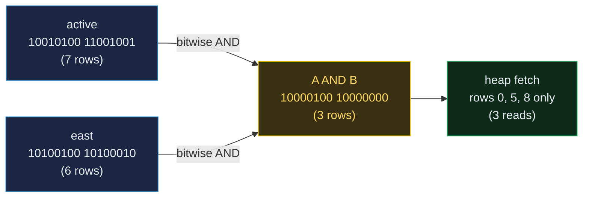
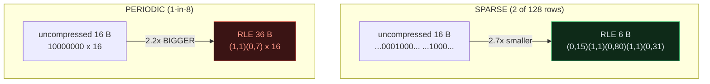
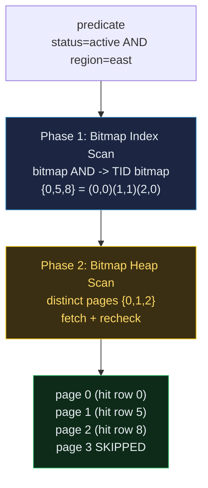

# Bitmap Index

> A database-internals concept bundle. This guide is the static, rigorous half;
> every number below is printed by the ground-truth
> [`bitmap_index.py`](./bitmap_index.py) and pasted **verbatim** — never
> hand-computed. The playable companion is [`bitmap_index.html`](./bitmap_index.html).
>
> Lineage: **full scan → B-tree → bitmap index** (O'Neil 1987); PostgreSQL's
> on-the-fly **Bitmap Index Scan → Bitmap Heap Scan** pipeline.

---

## 0. The one-paragraph idea

A **bitmap index** stores, for every distinct value of a column, a vector of
bits with **one bit per row**: bit `i = 1` iff row `i` holds that value. To
answer `WHERE status='active'` you read the `active` bitmap — every set bit is
a matching row, and its position *is* the tuple id. No heap reads needed.

The real power shows up with **multiple predicates**. `WHERE status='active'
AND region='east'` becomes a **bitwise AND** of two bitmaps — `O(N/word)` CPU,
**zero** heap I/O — and only the few surviving bits ever get fetched. That is
the whole reason bitmap indexes exist: collapse several predicates to one set
of TIDs *before* the (expensive, random-I/O) heap fetch.

> **Analogy — the wall of push-buttons.** A column has a wall of buttons: one
> *column* per distinct value, one *row* of buttons per tuple. "Which rows are
> ACTIVE?" → read the ACTIVE column. "ACTIVE **and** EAST?" → take the ACTIVE
> column and the EAST column and AND them, button by button. The buttons that
> stay lit are the answer — no walking the shelves.

**Where it fits** 🔗: a bitmap is a *TID set*. Compare with the
[`free_space_map`](./FREE_SPACE_MAP.md) max-tree (which indexes *pages by free
space*, not rows by value) — both are compact maps that turn an O(N) scan into
something cheap, but over very different domains.

---

## 1. Why it exists — the lineage

| Approach | Find rows for one value | Combine two predicates | Cost |
|---|---|---|---|
| **Full table scan** | O(N) heap reads | re-scan + filter in memory | unusable on big tables |
| **B-tree index** | O(log N) + matches | fetch predicate-A rows, filter by B (discard many) | great for high cardinality; wasteful for several low-selectivity predicates |
| **Bitmap index** (O'Neil 1987) | read one bitmap, O(N/8) bytes | **bitwise AND/OR**, zero heap I/O, then fetch survivors | ideal for low cardinality + many predicates |
| **Bitmap SCAN of B-tree** (PostgreSQL) | build TID bitmap from a B-tree on the fly | same bitwise AND/OR | ad-hoc bitmap-AND benefit with no persistent bitmap index to maintain |

A B-tree is *excellent* at "find the few rows with `user_id = 42`" (high
cardinality). It is *wasteful* for "find rows where `status='active'`
(7/16) **and** `region='east'` (6/16)": each predicate alone matches many rows,
so you'd fetch a lot and throw most away. Bitmaps AND/OR the predicates in the
index first, so you fetch only the **intersection**.

---

## 2. The bitmap — one bit per row per value

For a column with `D` distinct values over `N` rows, the index holds **`D`
bitmaps of `N` bits each**. The bitmaps for one column form a **partition**:
every row position is `1` in exactly one of them.

```
bitmap[v][i]   = 1 if row i == v else 0
AND(A,B)[i]    = A[i] & B[i]          # intersection
OR(A,B)[i]     = A[i] | B[i]          # union
NOT(A)[i]      = 1 - A[i]             # complement over N rows
index size     = D * N / 8  bytes     # uncompressed
```

> From `bitmap_index.py` Section A — the 16-row worked table, indexed on
> `status` (D = 4):

```
| row | 0  | 1  | 2  | 3  | 4  | 5  | 6  | 7  | 8  | 9  | 10 | 11 | 12 | 13 | 14 | 15 |
|status| acti| pend| clos| acti| dele| acti| pend| clos| acti| acti| clos| pend| acti| dele| clos| acti|
|region| east| west| east| north| south| east| west| north| east| south| east| west| north| south| east| west|

| value   | bitmap (16 bits, grouped 8)          | #1s | rows (TIDs)        |
|---------|--------------------------------------|-----|--------------------|
| active  | 10010100 11001001                    | 7   | [0, 3, 5, 8, 9, 12, 15] |
| pending | 01000010 00010000                    | 3   | [1, 6, 11]         |
| closed  | 00100001 00100010                    | 4   | [2, 7, 10, 14]     |
| deleted | 00001000 00000100                    | 2   | [4, 13]            |

Total index size (uncompressed) = D x N = 4 x 16 = 64 bits = 8 bytes.
[check] every column position sums to 1 across the 4 bitmaps (partition):  OK
```

Total cost for the `status` index: **8 bytes** for 16 rows. That compactness is
why low-cardinality columns are a perfect fit.

---

## 3. Bitmap AND — the killer operation

`WHERE status='active' AND region='east'`: fetch each predicate's bitmap, AND
them bit-by-bit. The result bitmap's set bits are the answer TIDs.

> From `bitmap_index.py` Section B:

```
  active  : 10010100 11001001   (popcount 7)
  east    : 10100100 10100010   (popcount 6)

  A      : 10010100 11001001
  B      : 10100100 10100010
  A AND B: 10000100 10000000

Result bitmap has popcount 3 -> matching rows (TIDs) [0, 5, 8].
That is the entire query: 16 bitwise ANDs, ZERO heap tuple reads.

  bitmap AND rows  : [0, 5, 8]
  linear scan rows : [0, 5, 8]
[check] bitmap AND == linear scan  (both -> [0, 5, 8]):  OK
```



The two inputs match **7** and **6** rows respectively — expensive to fetch
either. Their AND matches **3**, and that is all the heap ever sees.

> **Gold check** 🔗: `bitmap_and(active, east) == linear_scan(status=active,
> region=east) == {0, 5, 8}`. Verified identically in Python (Section B) and in
> the browser (`bitmap_index.html` → **check: OK**).

---

## 4. RLE compression — sparse bitmaps shrink dramatically

Within a low-cardinality column, **rare** values produce **sparse** bitmaps
(long runs of `0`s). **Run-length encoding** (RLE) replaces each run of
identical bits with one `(value, length)` pair, so the cost tracks the **number
of runs**, not `N`.

```
rle_encode([0,0,0,1,0,0])   = [(0,3),(1,1),(0,2)]
rle_encode([1,0,0,0,0])     = [(1,1),(0,4)]
```

> From `bitmap_index.py` Section C — two 128-bit examples (uncompressed = 16 B):

```
Example 1 -- SPARSE (status='deleted' on a 128-row table, 2 rows):
  RLE runs (5 pairs): [(0, 15), (1, 1), (0, 80), (1, 1), (0, 31)]
  RLE bytes = 5 run-lengths + 1 packed value-bits = 6 bytes
  -> 16 B -> 6 B  =  37.5% of original  (2.7x smaller)

Example 2 -- PERIODIC '1 in every 8' (16 ones, evenly spaced):
  RLE runs (32 pairs): (1,1),(0,7) x 16  ->  32 runs = 36 bytes
  -> 16 B -> 36 B  =  225.0% of original  (2.2x BIGGER)
```



**Lesson:** naive RLE wins when runs are **long** (very sparse or clustered
`1`s). Regular/periodic patterns have many *short* runs, so RLE makes them
*bigger*. Production systems avoid this with hybrid encodings:

- **BBC** (Byte-aligned Bitmap Code) — Oracle's byte-aligned RLE.
- **Roaring** (Chambi 2015, arXiv:1402.2485) — the modern standard. Splits the
  row range into 65536-row chunks and lets each chunk pick whichever of
  `{sorted array | 1024-bit bitmap | RLE runs}` is *smallest*. That adaptivity
  is why Roaring beats plain RLE on both sparse and dense regions.

---

## 5. Bitmap Index Scan → Bitmap Heap Scan (PostgreSQL's two-phase pipeline)

PostgreSQL has **no on-disk bitmap index**. Instead, at query time it builds a
**TID bitmap** on the fly from any B-tree/GIN index, then runs the bitmap
through a two-phase executor:

1. **Bitmap Index Scan** (phase 1) — turn the predicate(s) into a **TID
   bitmap**: a set of `(page, offset)` locations. With several predicates, it
   AND/ORs their bitmaps first.
2. **Bitmap Heap Scan** (phase 2) — walk the **distinct pages** in the bitmap,
   fetch each, and **re-check** the predicate on each tuple. Pages with no hit
   are never read.

If the TID bitmap would exceed `work_mem`, it degrades from **exact** (one bit
per TID) to **lossy** (one bit per **page**). Lossy mode trades memory for
extra recheck work: every tuple on a set page must be re-tested.

> From `bitmap_index.py` Section D — the Section B result `{0, 5, 8}`, with
> 4 rows/page:

```
Phase 1 (Bitmap Index Scan): the predicate's bitmap IS the TID set.
  result TID bitmap: 10000100 10000000
  matching rows     : [0, 5, 8]

| row | page | offset | TID    |
|-----|------|--------|--------|
| 0   | 0    | 0      | (0,0)   |
| 5   | 1    | 1      | (1,1)   |
| 8   | 2    | 0      | (2,0)   |

Phase 2a (EXACT bitmap): collect the DISTINCT pages that own a hit:
| page | rows on page   | has hit? | tuples to fetch & recheck |
| 0    | [0, 1, 2, 3]   | YES      | 1                         |
| 1    | [4, 5, 6, 7]   | YES      | 1                         |
| 2    | [8, 9, 10, 11] | YES      | 1                         |
| 3    | [12, 13, 14, 15] | skip   | 0                         |
  -> visit 3 of 4 pages, recheck 3 tuples. Page 3 is NEVER read.

Phase 2b (LOSSY bitmap): a PAGE-level bitmap (1 bit/page):
  page bitmap over 4 pages: [1, 1, 1, 0]
  -> still visit 3 pages, but now must RECHECK ALL 12 tuples on them
     (vs 3 in exact mode) -- trading CPU/IO for bounded memory.
```



### ⚠️ Pitfall — the recheck is not optional

The phase-2 **recheck** does two jobs, both essential:

1. **Lossy recovery.** A lossy page-bit promises "a hit *might* live here", not
   "every tuple is a hit." Without rechecking, you'd return false positives.
2. **MVCC correctness.** A TID in the bitmap may belong to a tuple that was
   updated or deleted after the index entry was made. Phase 2 re-tests
   **visibility** *and* the predicate before returning any row.

> From `bitmap_index.py` Section D — gold check:
> ```
> [check] exact TID set [0, 5, 8] == lossy recheck result [0, 5, 8];
>         recheck count 12 >= hits 3:  OK
> ```

---

## 6. Cardinality — when bitmap wins, when it loses vs B-tree

Bitmap index size = `D × N / 8` bytes — **linear in `D`**. A B-tree on the same
column is `~O(N)` regardless of `D`. So the choice is governed by the ratio
`D / N`:

> From `bitmap_index.py` Section E — `N = 1,000,000` rows:

| column example   | D (distinct) | bitmap size = D·N/8 | verdict       |
|------------------|--------------|---------------------|---------------|
| gender (D=2)     | 2            | 244.1 KB            | WIN (tiny, low D) |
| status (D=4)     | 4            | 488.3 KB            | WIN (tiny, low D) |
| country (D=200)  | 200          | 23.84 MB            | ok (warehouse) |
| category (D=1k)  | 1000         | 119.21 MB           | borderline    |
| user_id (D=N)    | 1000000      | 116.42 GB           | LOSE (D~N, huge) |

```
[check] gender idx = 250,000 B; user_id (D=N) = 116.4 GB (quadratic blowup):  OK
```

**Rule of thumb:**

- **WIN** — low `D` (gender, status, boolean, country); **AND/OR of several**
  low-selectivity predicates; read-mostly / warehouse workloads.
- **LOSE** — high `D` (near-unique keys → `N²/8` bits); **OLTP with frequent
  writes** (each update flips bits = rewrites compressed runs); a **single
  high-selectivity** predicate where a B-tree reaches the few TIDs directly
  with no bitmap needed.

> PostgreSQL deliberately ships **no** persistent bitmap index because of the
> write penalty: instead it builds the TID bitmap on the fly from a B-tree/GIN
> and still gets the bitmap-AND benefit for ad-hoc queries. Real on-disk bitmap
> indexes live in **Oracle**, **DB2**, and **ClickHouse** (sparse-encoding /
> bitset columns).

---

## 7. AND / OR / NOT — why combining predicates in the index wins

The headline benefit: AND/OR/NOT of bitmaps costs `O(N/word)` CPU and **zero**
heap I/O, so you only fetch rows that survive *all* predicates.

> From `bitmap_index.py` Section F — heap-tuple fetch counts for
> `WHERE status='active' AND region='east'`:

| plan                                   | heap tuples fetched | discarded |
|----------------------------------------|---------------------|-----------|
| sequential scan, filter in memory      | 16                  | 13        |
| B-tree(status) then filter region      | 7                   | 4         |
| B-tree(region) then filter status      | 6                   | 3         |
| **BITMAP AND, then fetch survivors**   | **3**               | **0**     |

A single-predicate index fetches every row matching *that* predicate, then
discards the ones failing the other. The bitmap AND fetches only the
**intersection** — and on random I/O, fetches are the expensive part.

**OR** is symmetric (`status='pending' OR status='closed'`):

```
  pending : 01000010 00010000   (popcount 3)
  closed  : 00100001 00100010   (popcount 4)
  P OR C  : 01100011 00110010   (popcount 7)  -> rows [1, 2, 6, 7, 10, 11, 14]
```

One bitmap op yields the union — no merge-sort of two TID lists, no duplicate
elimination (bitwise OR is idempotent by construction).

**NOT** inverts (`status != 'active'`):

```
  active    : 10010100 11001001   (popcount 7)
  NOT active: 01101011 00110110   (popcount 9)  -> rows [1, 2, 4, 6, 7, 10, 11, 13, 14]
```

A `NOT` predicate is **cheap** on a bitmap (flip every bit) and **murderous**
on a B-tree ("everything except these" → scan). That asymmetry is another
reason OLAP workloads love bitmaps.

```
[check] AND=intersection, OR=union, NOT=complement, popcount(A)+popcount(NOT A)=16:  OK
```

---

## 8. Cheat sheet

| Quantity | Formula | Worked value |
|---|---|---|
| Bitmap for value `v` | `bitmap[v][i] = 1 iff row i == v` | `active → 10010100 11001001` |
| AND (intersection) | `A[i] & B[i]` | `active & east → 10000100 10000000` |
| OR (union)         | `A[i] \| B[i]` | `pending \| closed → 01100011 00110010` |
| NOT (complement)   | `1 - A[i]` (over N rows) | `NOT active → 01101011 00110110` |
| popcount / matching rows | `sum(bitmap)` | `active → 7` |
| TIDs of matches    | `ones(bitmap)` | `active → [0,3,5,8,9,12,15]` |
| Index size (bytes) | `D × N / 8` | status (D=4, N=16) → 8 B |
| RLE bytes          | `~ #runs` (1 B/run-length + packed value bits) | sparse → 6 B (from 16 B) |
| Page of row `i`    | `i // rows_per_page` | row 5, 4/page → page 1 |
| Bitmap Heap Scan   | visit `{page_of(i) : i in TID_bitmap}`, recheck | pages {0,1,2}, recheck 3 |
| Win vs B-tree      | low `D`, AND/OR of several predicates | gender, status, country |
| Lose vs B-tree     | high `D` (`N²/8`), frequent writes | user_id, email |

---

## 9. Operations summary (the three primitives + the scan)

```
BUILD(values, distinct):                 AND / OR / NOT:
  for v in distinct:                       AND: [a & b for a,b in zip(A,B)]
    index[v] = [1 if x==v else 0             OR: [a | b for a,b in zip(A,B)]
               for x in values]             NOT: [1 - a for a in A]

BITMAP HEAP SCAN(tid_bitmap):           RLE_ENCODE(bitmap):
  rows = ones(tid_bitmap)                 cur=bitmap[0]; n=1; runs=[]
  pages = {page_of(r) for r in rows}      for b in bitmap[1:]:
  for p in sorted(pages):                   if b==cur: n+=1
    fetch page p                            else: runs.append((cur,n)); cur=b; n=1
    for t in tuples(p):                   runs.append((cur,n))
      if visible(t) and matches(t):     RLE_BYTES(runs) ~= len(runs)   # 1 B/run
        yield t
```

---

## 10. Sources

1. **O'Neil, P. (1987)** — *Model 204 Architecture and Performance*, HPTS
   Workshop. The canonical origin of the commercial bitmap index.
2. **Chan & Ioannidis (1998)** — *Bitmap Index Design and Evaluation*. An early
   rigorous comparison of bitmap encoding schemes.
3. **PostgreSQL docs** — *Bitmap Scans* (planner/executor + `EXPLAIN`):
   *"the bitmap index scan ... produces a bitmap of tuple TIDs ... If the
   bitmap would be too large to keep in memory, it becomes lossy: a page level
   bitmap ... the bitmap heap scan must then recheck the quals."*
4. **Chambi, Lemire, Kaser, Daniels (2015)** — *Better bitmap performance with
   Roaring bitmaps*, arXiv:1402.2485. The hybrid array/bitmap/RLE container.
5. **Kleppmann (2017)** — *Designing Data-Intensive Applications*, Ch. 3, on
   column-family and bitmap-style encodings for analytics.

---

### 🔗 Companion files & siblings

- **[`bitmap_index.py`](./bitmap_index.py)** — ground-truth reference impl (run: `python3 bitmap_index.py`).
- **[`bitmap_index_output.txt`](./bitmap_index_output.txt)** — captured stdout, for auditing this guide without running.
- **[`bitmap_index.html`](./bitmap_index.html)** — interactive bitmap grid, AND/OR query builder, RLE toggle, cardinality slider (**check: OK**).
- **[`FREE_SPACE_MAP.md`](./FREE_SPACE_MAP.md)** — another compact "map" structure, indexing *pages by free space* instead of rows by value.

> Part of the database-internals tutorial series. See
> [`HOW_TO_RESEARCH.md`](./HOW_TO_RESEARCH.md) for the bundle workflow.
