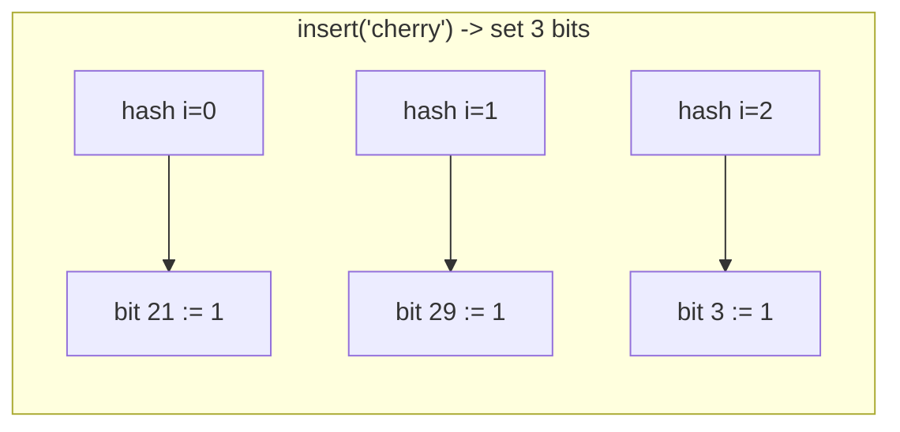
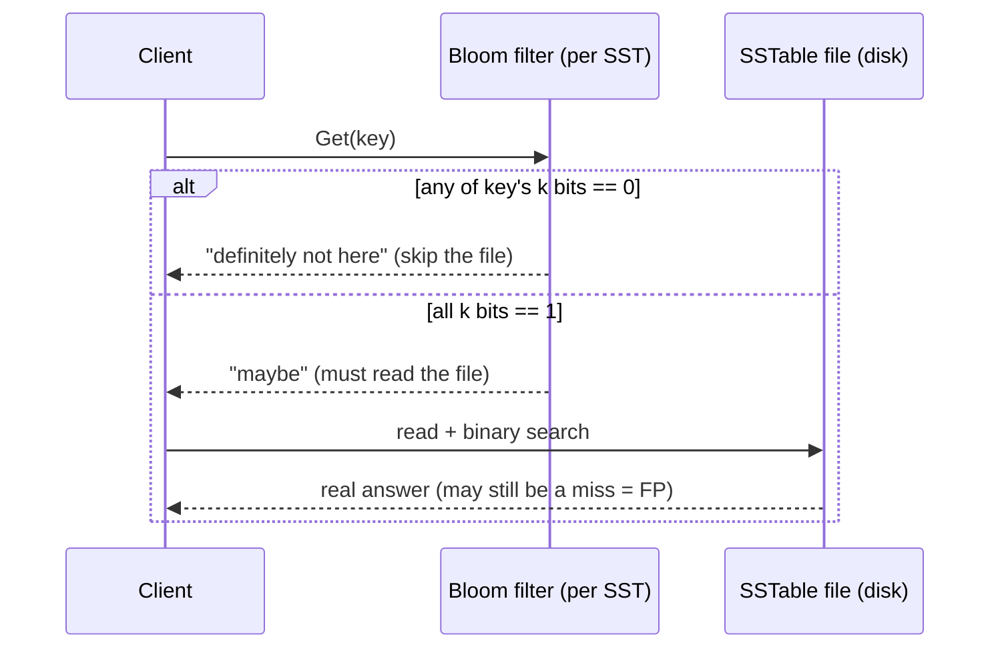

# Bloom Filter

> A database-internals concept bundle. This guide is the static, rigorous half;
> every number below is printed by the ground-truth
> [`bloom_filter.py`](./bloom_filter.py) and pasted **verbatim** — never
> hand-computed. The playable companion is [`bloom_filter.html`](./bloom_filter.html).
>
> Lineage: **Bloom 1970** → counting filters (Fan 1998) → per-SSTable filters in
> every LSM store (RocksDB, Cassandra, HBase) → the PostgreSQL `bloom` extension.

---

## 0. The one-paragraph idea

A **Bloom filter** answers one question — *"might `x` be in the set?"* — using
**`m` bits and `k` hash functions, and storing NO keys**. To insert `x` you set
the `k` bits `h₀(x)…h_{k-1}(x)` to 1. To query `x` you check those same `k` bits:

- **all `k` are 1 → "maybe"** (a true member, *or* a stranger whose `k` bits
  were all set by *other* inserts = a **false positive**);
- **any bit is 0 → "definitely not"** (you only ever set bits, never clear them,
  so a missing bit is *proof* `x` was never inserted = **no false negatives,
  ever**).

That asymmetry — *never wrong on NO, occasionally wrong on YES* — is the whole
trick. It lets a database skip a heap fetch / SST read / RPC *for free on every
true negative*, paying only a ~1% lie rate on the rare false positive.

> **Analogy — the row of padlocks.** A notice board can only say "was this word
> ever pinned here?" For each word you pin, you hang `k` numbered **padlocks** on
> `k` hooks (chosen by `k` hashes of the word). "Was X pinned?" → check X's `k`
> hooks: all have locks → *maybe*; any hook empty → *definitely not*. You never
> remove locks, so a present word can never be missed — but a stranger can be
> mistaken for one if its `k` hooks all happen to carry locks left by others.

**Where it fits** 🔗: a Bloom filter is a **lossy set summary** — probabilistic
membership, `O(n·1.44·log₂(1/p))` bits. Contrast the
[`bitmap_index`](./BITMAP_INDEX.md) (a *lossless* set of TIDs — exact membership,
`O(N)` bits) and the [`hash_index`](./HASH_INDEX.md) (exact membership + lookup,
but it *stores the keys*). A Bloom filter stores **no keys** and **no values** —
just `m` bits of "presence fingerprint". In [`lsm_tree`](./LSM_TREE.md) it is the
thing that lets a `Get()` skip reading an SST file it provably doesn't need.

---

## 1. Why it exists — the lineage

| Approach | Membership answer | Stores keys? | Size | Cost |
|---|---|---|---|---|
| **Hash set / hash index** | exact YES/NO | yes (the keys) | `O(n)` words | a lookup is exact but the structure holds the data |
| **Sorted set / B-tree** | exact YES/NO | yes | `O(n)` | `O(log n)`; great for range, overkill for pure membership |
| **Bloom filter** (Bloom 1970) | **"maybe" / "definitely not"** | **no** | **`O(n·1.44·log₂(1/p))` bits** | one-sided error: never wrong on NO |
| **Counting Bloom** (Fan 1998) | same, + deletion | counters, not keys | `~4×` a Bloom | supports removal (web-proxy "summary cache") |

The motivation is always the same: you want to **avoid an expensive operation**
(heap fetch, SST read, network RPC, cache probe) when the answer is *probably*
NO, and you are willing to be wrong ~1% of the time on YES to make the structure
**tiny and key-less**.

```
insert(x)   :  for i in 0..k-1:  bit[ pos_i(x) ] = 1
query(x)    :  "maybe" iff for ALL i: bit[ pos_i(x) ] == 1,  else "definitely not"
pos_i(x)    :  mix32( fnv1a(x || byte(i)) ) mod m          (k independent hashes)
```

---

## 2. The bit array and the false-positive formula

After inserting `n` elements with `k` hashes into `m` bits:

```
P(a specific bit is still 0)   p0   = (1 - 1/m)^(k·n)  ≈  e^(-k·n/m)
fill ratio                     1 - p0
false positive rate            FPR  = (1 - p0)^k  =  (1 - e^(-k·n/m))^k
optimal k (fixed m, n)         k*   = (m/n) · ln 2
optimal m for target FPR p     m*   = -n · ln(p) / (ln 2)^2          [bits]
bits per element               m*/n = -ln(p) / (ln 2)^2  ≈  1.44 · log₂(1/p)
```

Two things to notice up front (both verified in Section D):

1. **bits-per-element depends only on `p`, not `n`.** Pick your lie rate first;
   the size is then just `bits_per_element × n`.
2. **`k` and `m` pull in opposite directions.** More hashes → more bits set per
   insert (faster fill, *raises* FPR) but also more bits that must *all* be set
   for a false positive (*lowers* FPR). The optimal `k* = (m/n)·ln 2` is where
   those two forces balance.

> **Hash quality matters.** The FPR formula *assumes the `k` positions are
> independent*. Plain FNV-1a has weak low-bit diffusion, so this bundle pipes
> every FNV output through a 32-bit **avalanche finalizer** (`mix32`,
> "lowbias32"). Without it the measured FPR drifts far from the formula — see
> the pitfall in §9 and the comment in `bloom_filter.py:hash_positions`.

---

## 3. Build — `m = 32`, `k = 3`, five inserts

> From `bloom_filter.py` **Section A** — the tiny worked example, bit array
> shown after every insert (newly-flipped bits in `[brackets]`):

```
  start        :  0  0  0  0  0  0  0  0   0  0  0  0  0  0  0  0   0  0  0  0  0  0  0  0   0  0  0  0  0  0  0  0
  insert 'apple'      : positions [12, 19, 11] -> flips [11, 12, 19]
  insert 'banana'     : positions [10, 23, 25] -> flips [10, 23, 25]
  insert 'cherry'     : positions [21, 29, 3]  -> flips [3, 21, 29]
  insert 'date'       : positions [10, 25, 9]  -> flips [9, 10, 25]
  insert 'elderberry' : positions [9, 4, 13]   -> flips [4, 9, 13]

After 5 inserts: 12/32 bits are 1 (fill ratio = 0.375).
```

A 32-bit filter over 5 keys is **deliberately tiny** — collisions show up
immediately (`date` and `banana` both touch bits 10 and 25; `date` and
`elderberry` both touch bit 9). That overlap is precisely what later becomes a
false positive: a stranger whose `k` hashes land *only* on already-shared bits
will read "maybe" even though it was never inserted.



---

## 4. Query — check all `k` bits

> From `bloom_filter.py` **Section B** — a true member and a true non-member:

```
Query a TRUE MEMBER: 'cherry'
  positions = [21, 29, 3]
    bit[21] = 1
    bit[29] = 1
    bit[ 3] = 1
  all k bits set? True  ->  verdict: maybe in set (true member)

Query a NON-MEMBER:  'mango'
  positions = [4, 29, 31]
    bit[ 4] = 1
    bit[29] = 1
    bit[31] = 0
  all k bits set? False  ->  verdict: definitely NOT in set
```

`cherry`'s three bits were all set *by cherry's own insert*, so "maybe" is
correct. `mango` shares two bits with inserted keys by coincidence, but **bit 31
is still 0** — and a single 0 is *proof* mango was never inserted. This is the
guarantee a Bloom filter sells you:

- **true member → always "maybe"** (its own insert set ≥1, hence all `k`, bits).
  No false negatives, by construction.
- **non-member → "definitely not"** if even one of its `k` bits is 0; "maybe"
  (a false positive) only if all `k` happened to be set by others.

```
[check] all 5 inserted keys report 'maybe':  OK
[check] true member 'cherry' reports 'maybe' (no false negatives):  OK
```

---

## 5. The false-positive rate — measured vs the formula

> From `bloom_filter.py` **Section C** — `m=1024, k=7`, insert 100 keys, probe
> 2000 guaranteed-non-members:

```
  measured FPR = 17/2000 = 0.85%
  theory    FPR = (1 - e^(-kn/m))^k = (1 - e^(-7*100/1024))^7
                = 0.73%

  cross-check via FILL RATIO (deterministic, uses ALL bits):
    actual fill   = 0.4941
    expected fill = 1 - (1-1/m)^(kn) = 1 - e^(-kn/m) = 0.4954
    |diff|        = 0.0012  (small -> formula is sound)
```

The measured 0.85% lands within ~16% of the formula's 0.73% — the residual is
just finite-sample noise (the count is `Binomial(2000, 0.0073)`, std ≈ 3.8).
The **tighter** validation is the fill-ratio cross-check: it uses *every* bit
(not just query hits), and it matches `(1-1/m)^(kn)` to **0.0012** — which is the
real proof that the hash positions are independent and the formula is sound.

> The guarantee is **one-sided**: `measured_FP ≥ 0` is always fine; a measured
> **false negative** would be a bug (and is impossible — see §4).

---

## 6. Optimal parameters — pick `p`, read off `m` and `k`

Given a target false-positive rate `p` and `n` elements, two closed forms give
the optimal `m` and `k`:

> From `bloom_filter.py` **Section D**:

```
| target p | bits/elem (m*/n) |  n=1,000 m* |  k* (rounded) | FPR at rounded k |
|----------|------------------|-------------|---------------|------------------|
| 10.00%   | 4.793            | 4793        | 3   (k*=3.32)  | 10.07%           |
| 5.00%    | 6.235            | 6235        | 4   (k*=4.32)  | 5.03%            |
| 1.00%    | 9.585            | 9585        | 7   (k*=6.64)  | 1.00%            |
| 0.10%    | 14.378           | 14378       | 10  (k*=9.97)  | 0.10%            |
| 0.01%    | 19.170           | 19170       | 13  (k*=13.29) | 0.01%            |
```

The headline worked example — `n = 1000`, target `p = 1%`:

```
  m* = -1000 * ln(0.01) / (ln 2)^2 = 9585.1 bits (1198.1 bytes)
  k* = (m*/n) * ln 2 = 6.644  ->  round to k = 7
  At m=9585, k=7, n=1000: FPR = 1.00%  (meets the 1% target after rounding)
```

**Read the table as a dial on `p`.** Each extra `log₂` of certainty roughly
**adds 1.44 bits per element** (because `m*/n ≈ 1.44·log₂(1/p)`). Going from 1%
to 0.1% costs ~50% more memory; going from 1% to 10% *saves* half. The optimal
`k` grows in lockstep (`k* ≈ 0.693 · bits_per_element`).

---

## 7. Space savings — Bloom vs an exact set

> From `bloom_filter.py` **Section E** — membership for 1,000,000 keys at 1% FPR:

```
  Bloom filter : m* = -n*ln(p)/(ln2)^2 = 9,585,058 bits = 1.14 MiB
  Exact hashset: 8 B per key (one pointer-sized slot) = 7.63 MiB   (ignores the key strings)

  -> Bloom uses 6.7x LESS memory than the set, at the cost of a 1.00% false-positive rate.
```

The "~1.2 MB per million keys at 1% FPR" everyone quotes is exactly
`-ln(0.01)/(ln 2)² = 9.585` bits/element → `9.585 Mbit = 1.198 MB (decimal) =
1.14 MiB`. The hash-set number is *generous* to the set — it counts only one
pointer-sized slot per key, **not the key strings themselves**, which a Bloom
filter never stores at all. The true gap is far larger than 6.7×.

This asymmetry is priceless when the filter is **shipped or checked billions of
times**: a CDN peer-check, a "could this row be cached?" front-end, or — the big
one — a per-SSTable filter that lets an LSM `Get()` skip a whole file read.

---

## 8. Where Bloom filters live inside real databases

> From `bloom_filter.py` **Section F**:

```
| system            | what it indexes                      | what the filter prevents                      |
|-------------------|--------------------------------------|-----------------------------------------------|
| PostgreSQL bloom  | multi-column equality tuples         | heap fetches for WHERE a=? AND b=? AND c=? (no single-col index helps) |
| RocksDB per-SST   | the keys of each SSTable file        | reading a whole SST file on a Get() that misses (the big LSM win) |
| Cassandra / HBase | row keys per SSTable                 | opening/reading an SST for a row that is not there |
| Cassandra row cache| rows currently cached                | a hash lookup to ask 'could this row be cached?' before probing |
| CDN / proxy cache | URLs held by peer caches             | a remote RPC just to learn 'do you have this URL?' (summary cache) |
| LSM compaction    | the output range of each level       | touching a level that provably cannot contain the key |
```

The shared shape: a Bloom filter is a **cheap, lossy summary** that lets the
system say *"definitely not here"* **without doing the expensive thing**. The
~1% lie rate is worth it because the filter is checked billions of times and is
tiny.



---

## 9. Pitfalls

- **You cannot delete.** Setting a bit is irreversible; clearing it would also
  clear it for every other key that shares it. Need removal? Use a **counting
  Bloom filter** (a small counter per slot; Fan 1998) — at ~4× the space.
- **Saturation kills you.** As `n` grows past `m / k*`, the fill ratio → 1 and
  FPR → 1: the filter starts answering "maybe" to *everything*. Size it for the
  **peak** element count up front, or rebuild when it fills.
- **Bad hash = silently wrong FPR.** The formula assumes independent positions.
  A weak hash (plain FNV-1a, `hash()` with correlated seeds, double-hashing of a
  low-diffusion primitive) can give a *correct-looking fill ratio* but a
  **measured FPR 10×+ the formula**. Always pipe through a mixing finalizer (this
  bundle's `mix32`), or use a real hash (Murmur3, xxHash). See
  `bloom_filter.py:hash_positions`.
- **`k` too large is as bad as too small.** Past `k*` each extra hash sets more
  bits than the "all must be 1" gate saves, so FPR *rises*. Use `k* = (m/n)·ln2`.
- **Not a general index.** A Bloom filter answers membership only — no range
  scan, no iteration, no value retrieval. It is a *front door* to an index, not
  a replacement for one. 🔗 For exact membership with keys stored, see
  [`hash_index`](./HASH_INDEX.md); for range, [`btree`](./BTREE.md).
- **No count, no ordering.** Inserting the same key twice is a no-op (the bits
  are already 1). A Bloom filter can't tell you *how many* or *which*.

---

## 10. Cheat sheet

```
m  = bits, k = hash functions, n = elements inserted
insert(x)   bit[ mix32(fnv1a(x||byte(i))) mod m ] = 1     for i in 0..k-1
query(x)    "maybe" iff ALL k bits are 1, else "definitely not"
FPR         (1 - e^(-k·n/m))^k
optimal k*  (m/n)·ln2
optimal m*  -n·ln(p)/(ln2)^2          [bits, for target FPR p]
bits/elem   -ln(p)/(ln2)^2 ≈ 1.44·log₂(1/p)        [depends on p ONLY]
1% FPR      ~9.585 bits/elem  =>  ~1.2 MB / million keys, k=7
GUARANTEE   no false negatives, ever; false positives bounded by FPR
DELETE?     no (use a counting Bloom filter)
DB HOMES    RocksDB/Cassandra per-SST, PostgreSQL bloom ext, cache front-ends
```

| Want… | Tune |
|---|---|
| smaller filter | raise `p` (each `log₂` of slack ≈ 1.44 bits/elem saved) |
| fewer false positives | lower `p` (≈ 1.44 bits/elem per `log₂`), then `k* = (m/n)·ln2` |
| deletion | counting Bloom filter (~4× space) |
| skip an SST read | one filter **per file**, checked before any disk I/O |

---

## Sources

1. B. H. Bloom, 1970, *"Space/Time Trade-offs in Hash Coding with Allowable
   Errors"*, CACM 13(7) — the original.
2. Kirsch & Mitzenmacher, 2006, *"Less Hashing, Same Performance"*,
   arXiv:cs/0508024 — two hashes suffice (double hashing).
3. Fan, Cao, Almeida, Broder, 1998, *"Summary Cache"* — counting filters.
4. Mitzenmacher & Upfal, *Probability and Computing* — FPR derivation.
5. PostgreSQL docs — the `bloom` extension (`contrib/bloom`).
6. RocksDB wiki — *"Bloom Filter"* (per-SSTable).
