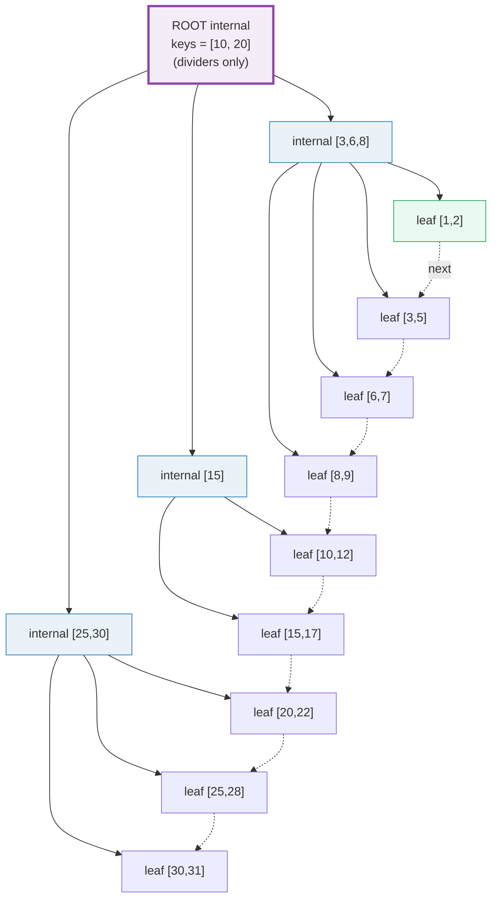
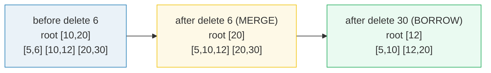

# B+tree Index — A Visual, Worked-Example Guide

> **Companion code:** [`btree.py`](./btree.py). **Every tree, split, lookup
> trace, and number in this guide is printed by `python3 btree.py`** — change the
> code, re-run, re-paste. Nothing here is hand-computed.
>
> **Live animation:** [`btree.html`](./btree.html) — open in a browser; it
> rebuilds the tree in JS with the *identical* insert order and gold-checks
> `search()` against the `.py`.
>
> **Source material:** Bayer & McCreight, *"Organization and Maintenance of
> Large Ordered Indexes"* (1972) — the original B-tree; Comer, *"The Ubiquitous
> B-Tree"* (1979) for the B+tree variant; Lehman & Yao, *"Efficient Locking for
> Concurrent Operations on B-Trees"* (1981) — the B-link-tree PostgreSQL
> implements; Ramakrishnan & Gehrke, *Database Management Systems* §10;
> PostgreSQL docs §73.4 *B-Tree Indexes*.

---

## 0. TL;DR — the sorted notebook with tab dividers

A B+tree is a **balanced multi-way search tree** where the data lives **only in
the leaves**, and the leaves are **chained into one sorted linked list**.

> *Imagine a giant sorted notebook. Flipping every page to find one value is
> O(N). So you tape **tab dividers** across the top — each says "keys below this
> go left, keys at/above go right." One strip of dividers only helps a little,
> so you stack **another strip on top** that points at the strips below, and so
> on. That stack of divider-strips is the B+tree: internal nodes are the
> dividers, leaves are the data pages, and the leaf chain is the "+" of B+tree.*



- **Internal nodes** = divider strips. They store **only separator keys + child
  pointers**, never values. `key < k_i` routes to child `i`; `key >= k_i` routes
  right.
- **Leaf nodes** = the bottom pages, holding the actual `(key -> value)` pairs in
  sorted order. **This is where data lives.**
- **The "+"** = every leaf links to its right neighbour via a `next` pointer. A
  range scan finds the start leaf, then **walks the chain** — no re-traversal.
- **Balanced** = every root→leaf path has the **same** length, so a lookup is
  *always* `height` page-reads, no matter the key.

> From `btree.py` **Section A** (order `m = 4`, 18 keys inserted):
>
> ```
>  L0 INT : [10,20]
>  L1 INT : [3,6,8]   [15]   [25,30]
>  L2 LEAF: [1,2]   [3,5]   [6,7]   [8,9]   [10,12]   [15,17]   [20,22]   [25,28]   [30,31]
>  CHAIN: [1,2] -> [3,5] -> [6,7] -> [8,9] -> [10,12] -> [15,17] -> [20,22] -> [25,28] -> [30,31]
> height = 3 levels (2 internal + 1 leaf); leaves = 9; total keys = 18
> ```

### Why it scales (the punchline)

A 4 KB page holds **~256** children per internal node (the **fanout**). Three
levels of 256-way branching index `256³ ≈ 16.7 million` rows. So **1 million
rows live in a tree just 3 pages tall** — a point lookup reads exactly **3
pages**. Height grows as `log_fanout(N)`, and the fanout is huge, so height stays
tiny. (Section F works the numbers.)

### Glossary

| Term | Plain meaning |
|---|---|
| **order `m`** | max **children** an internal node may hold (= max keys + 1). Here `m = 4`. |
| **fanout** | children per internal node. `~ page_size / (key+ptr)`. Big fanout ⇒ short tree. |
| **internal node** | divider strip: separator keys + child pointers; stores **no values** |
| **leaf node** | bottom page holding sorted `(key,value)` pairs; where lookups end |
| **separator key** | a key pushed to a parent to tell children apart. A divider, not data |
| **page split** | on overflow (insert), split in half, push median to parent. Tree grows **up** |
| **page merge / borrow** | on delete underflow: borrow from a sibling, else merge. Tree can shrink |
| **next pointer** | right-sibling link on every leaf — the "+" of B+tree |
| **height** | number of levels (root = 1). A point lookup costs `height` page reads |
| **Lehman-Yao / B-link** | concurrency scheme (PostgreSQL): per-page "high key" + right link, so readers move right past concurrent inserts with only short page latches |

🔗 *This guide is the index-structure companion to
[`HEAP_VS_CLUSTERED.md`](./HEAP_VS_CLUSTERED.md) (what an index points AT — a TID
into a heap, or a PK into a clustered B-tree) and to
[`SLOTTED_PAGE.md`](./SLOTTED_PAGE.md) (the fixed-size page a B-tree node is
stored in).*

---

## 1. The invariants

A B+tree of order `m` keeps every node within occupancy bounds; splits/merges
exist to **preserve these invariants on every update**.

| Invariant | Rule | Value at `m = 4` |
|---|---|---|
| **max keys** per node | `≤ m - 1` | `≤ 3` |
| **min keys** per non-root leaf | `≥ ⌈(m-1)/2⌉` | `≥ 2` |
| **min children** per non-root internal | `≥ ⌈m/2⌉` | `≥ 2` |
| **children = keys + 1** (internal) | always | — |
| **all leaves same depth** | balanced | height = 3 here |
| **leaves chained left→right** | the "+" | see CHAIN above |
| **keys sorted within every node** | always | — |

The **root is exempt** from minimums: it may hold as few as 1 key (or even be an
empty leaf). When the root loses its last child, the tree shrinks; when the root
splits, the tree grows taller by one level.

---

## 2. Section A — build the tree

Insert `[10, 20, 5, 6, 12, 30, 7, 17, 25, 31, 1, 3, 8, 22, 9, 28, 15, 2]` into
an order-4 B+tree. Keys land in sorted order within each page; when a page fills
it splits.

> From `btree.py` **Section A**:
>
> ```
>  L0 INT : [10,20]
>  L1 INT : [3,6,8]   [15]   [25,30]
>  L2 LEAF: [1,2]   [3,5]   [6,7]   [8,9]   [10,12]   [15,17]   [20,22]   [25,28]   [30,31]
>  CHAIN: [1,2] -> [3,5] -> [6,7] -> [8,9] -> [10,12] -> [15,17] -> [20,22] -> [25,28] -> [30,31]
> height = 3 levels (2 internal + 1 leaf); leaves = 9; total keys stored = 18
> ```

Note the leaf chain, read left-to-right, reproduces the **globally sorted** key
order. That single property is what makes range scans cheap (Section D) and what
makes a clustered B-tree's data sequentially scannable.

---

## 3. Section B — page split, step by step

A leaf **overflows** when an insert makes it hold `max_keys + 1` keys. It then
splits at the median and pushes a separator to the parent. There are **two
different "push up" rules** — the most common source of confusion:

| Node type on overflow | Median handling | Why |
|---|---|---|
| **leaf** splits | **COPY** the smallest key of the right half up | every key must *stay in a leaf* (data lives only in leaves) |
| **internal** splits | **MOVE** the median key up | internal keys are just dividers; moving is fine |

If the parent also overflows, the split **propagates upward**; if the **root**
splits, a new root is made and the tree **grows taller by one level**. (Splits
grow the tree **up**, never down.)

> From `btree.py` **Section B** (insert `[10, 20, 5, 6, 12, 30, 7, 1, 8, 9]`,
> `trace` on):
>
> ```
> --- insert 6 ---
>     [SPLIT leaf]   overflow [5, 6, 10, 20] -> left=[5, 6] right=[10, 20]; COPY sep 10 up
>     [NEW ROOT] new root keys=[10] -> height grows to 2
>   L0 INT : [10]
>   L1 LEAF: [5,6]   [10,20]
> --- insert 30 ---
>     [SPLIT leaf]   overflow [10, 12, 20, 30] -> left=[10, 12] right=[20, 30]; COPY sep 20 up
>   L0 INT : [10,20]
>   L1 LEAF: [5,6]   [10,12]   [20,30]
> --- insert 1 ---
>     [SPLIT leaf]   overflow [1, 5, 6, 7] -> left=[1, 5] right=[6, 7]; COPY sep 6 up
>   L0 INT : [6,10,20]
> --- insert 9 ---
>     [SPLIT leaf]   overflow [6, 7, 8, 9] -> left=[6, 7] right=[8, 9]; COPY sep 8 up
>     [SPLIT internal] overflow keys [6, 8, 10, 20] -> MOVE 10 up; left keys=[6, 8] right keys=[20]
>     [NEW ROOT] new root keys=[10] -> height grows to 3
>   L0 INT : [10]
>   L1 INT : [6,8]   [20]
>   L2 LEAF: [1,5]   [6,7]   [8,9]   [10,12]   [20,30]
> ```

**Trace the cascade on `insert 9`:** the leaf `[6,7,8]` overflows → splits,
**copies** `8` up → the root `[6,8,10,20]` now overflows → splits, **moves** `10`
up → the root split makes a brand-new root `[10]` and the tree becomes 3 levels
tall. Notice `10` is **still in the leaf** `[10,12]` (leaf copy-up) but `10`
*also* appears as the root divider (internal move-up) — that duplication between
internal dividers and leaf data is normal in a B+tree.

> **Pitfall:** forgetting the copy-vs-move distinction. If you *move* (not copy)
> on a leaf split, the median key vanishes from the leaves → lookups for that key
> fail. If you *copy* (not move) on an internal split, the divider appears in
> *both* children → routing breaks. The `.py` asserts this is done right and the
> gold-check confirms every key is still findable.

---

## 4. Section C — point lookup (root → leaf, count comparisons)

A lookup descends one node per level: at each internal node, compare the search
key against the separators to pick the child; in the leaf, scan for the key. The
**page-touch count is exactly `height`** regardless of the key; the
*comparison* count varies with how many separators sit in each node.

> From `btree.py` **Section C** (on the Section-A tree):
>
> ```
> search(12):
>   L0 INT  [10, 20]: 12>=10; 12<20 -> child 1
>   L1 INT  [15]: 12<15 -> child 0
>   L2 LEAF [10, 12]: 12>10; 12==12 FOUND@1
>   -> FOUND, value = 12; comparisons = 5
> search(1):
>   L0 INT  [10, 20]: 1<10 -> child 0
>   L1 INT  [3, 6, 8]: 1<3 -> child 0
>   L2 LEAF [1, 2]: 1==1 FOUND@0
>   -> FOUND, value = 1; comparisons = 3
> search(99):
>   L0 INT  [10, 20]: 99>=10; 99>=20; past all -> child 2
>   L1 INT  [25, 30]: 99>=25; 99>=30; past all -> child 2
>   L2 LEAF [30, 31]: 99>30; 99>31; end of leaf (absent)
>   -> NOT FOUND; comparisons = 6
> ```

Every lookup above touched **3 pages** (one per level). In a real engine each
page is read once and **binary-searched internally**, so the per-page cost is
`O(log(keys_in_node))`, not linear — the total is `O(log_fanout N)` comparisons.

> **Routing rule (the routing comparison):** `child_index = bisect_right(keys,
> key)`. Equivalently, child `i` holds keys in `[k_{i-1}, k_i)`, child 0 holds
> keys `< k_0`, the last child holds keys `>= k_{last}`. Because absent keys also
> route correctly (a search for `13` lands in leaf `[10,12]`, finds nothing, and
> returns absent), the structure answers both point existence and value in one
> descent.

---

## 5. Section D — range scan (walk the leaf chain)

This is where the B+tree's "+" earns its keep. To answer `[lo, hi]`:

1. **Descend once** to the leaf that would hold `lo` (a normal point-lookup
   descent using `lo` as the probe).
2. **Scan that leaf**, then **follow `next` pointers rightward**, emitting keys
   in `[lo, hi]`, until a key exceeds `hi`.

No second traversal of the tree — the leaf chain is the globally sorted order.

> From `btree.py` **Section D** (range `[6, 22]`):
>
> ```
>   leaf 0: keys=[6, 7]  <-- matched [6, 7]
>   leaf 1: keys=[8, 9]  <-- matched [8, 9]
>   leaf 2: keys=[10, 12]  <-- matched [10, 12]
>   leaf 3: keys=[15, 17]  <-- matched [15, 17]
>   leaf 4: keys=[20, 22]  <-- matched [20, 22]
>   leaf 5: keys=[25, 28]
> results (10 keys): [6, 7, 8, 9, 10, 12, 15, 17, 20, 22]
> ```
>
> (`leaf 5` is entered because the scan walks the chain one page at a time; its
> first key `25 > 22` stops the walk immediately — no matches emitted there.)

The chain walk is **sequential I/O** on (often physically contiguous) leaf pages
— cheap on disk and SSD. This is exactly why a **clustered** PK range scan is so
fast: the rows themselves live in those leaves in PK order. 🔗 See
[`HEAP_VS_CLUSTERED.md`](./HEAP_VS_CLUSTERED.md).

---

## 6. Section E — delete (borrow from a sibling, else merge)

Delete removes the key from its leaf. If the leaf then drops **below min** (here
`< 2`), it **underflows** and must rebalance, trying in order:

1. **BORROW** one entry from an adjacent sibling that has more than the minimum
   (update the parent separator).
2. If no sibling can spare, **MERGE** with a sibling (pull the separator down
   from the parent; if the parent then underflows, recurse the same logic
   upward).

> From `btree.py` **Section E** (starting tree `root=[10,20]`, leaves
> `[5,6,7] [10,12] [20,30]`):
>
> ```
> --- delete 7 ---   leaf [5,6,7] -> [5,6]  (2 keys, still >= min) -> NO rebalance
> --- delete 6 ---   leaf [5,6] -> [5] underflows; right sibling [10,12] is also
>                    at min (2) so cannot lend -> MERGE [5]+[10,12]=[5,10,12];
>                    separator 10 pulled down from the root -> root now [20]
>   REBALANCE: merge-right-into-child -> now [5, 10, 12]
> --- delete 30 ---  leaf [20,30] -> [20] underflows; left sibling [5,10,12] has
>                    3 keys (> min) -> BORROW 12 over -> leaf [12,20];
>                    separator updated to 12
>   REBALANCE: borrow-left -> now [12, 20]
> ```



> **Subtlety (stale separators are harmless in a B+tree):** when you delete a key
> that is also used as a separator somewhere up the tree, you do **not** need to
> chase and fix that separator. A future search routes by the `bisect_right`
> rule and lands in the right child regardless; once there it scans the leaf and
> simply does not find the deleted key. Correctness is preserved — only space is
> momentarily imperfect. (PostgreSQL's vacuum reclaims the space later.)

---

## 7. Section F — the fanout, and how tall 1 million rows really is

This is the whole reason B+trees dominate OLTP indexes. Fix a page size and key
width; the **fanout** is how many children fit in one internal page.

> From `btree.py` **Section F** (4 KB page; 8-byte key, 8-byte value, 8-byte ptr):
>
> ```
> internal node: M keys + (M+1) child pointers
>   M = (page - ptr) / (key + ptr) = (4096 - 8) / 16 = 255 keys
>   fanout (children per internal node) = M + 1 = 256
> leaf node: 256 (key,value) entries per page
> N = 1,000,000 rows -> leaf pages needed = ceil(1e6/256) = 3,907
>
> | height | max rows addressable              |
> | 1      |          256   (root is the leaf) |
> | 2      |       65,536   (1 internal level) |
> | 3      |   16,777,216   (2 internal levels)  <-- 1M rows live here
> | 4      |4,294,967,296   (3 internal levels) |
> height for N=1,000,000: 1 + ceil(log_256(3,907)) = 3 levels
> [check] 1M rows fits in 3 levels: 256^2*256 = 16,777,216 >= 1,000,000: OK
> [check] 2 levels would cap at 65,536 < 1,000,000 -> need 3: OK
> ```

**Read it once and remember it:** with a few-hundred-way fanout, height barely
moves as the table grows. Going from 1 row to **1 million** rows only takes you
from 1 to 3 page reads per lookup. That logarithm, plus the leaf chain for range
scans, is the entire economic case for the B+tree.

### Cost formulas (cheat sheet)

| Operation | I/O cost (pages) | Notes |
|---|---|---|
| **point lookup** | `height` | one descent; `height = 1 + ⌈log_fanout(N/leaf_cap)⌉` |
| **range scan** `k` rows | `height + O(matched leaves)` | descend once, then **sequential** leaf walk |
| **insert** | `height` reads + `O(1)` writes | may trigger splits propagating up (extra writes) |
| **delete** | `height` reads + `O(1)` writes | may trigger borrow/merge propagating up |
| **full scan** | `#leaves` | walk the entire leaf chain in sorted order |

---

## 8. Concurrency: Lehman-Yao / B-link (what PostgreSQL actually does)

The `btree.py` implementation is single-threaded. A real multi-writer index
cannot lock the whole tree on every insert (that serializes all writes). The
scheme PostgreSQL (and SQLite, InnoDB) uses is the **B-link-tree** of Lehman &
Yao (1981):

- Every page stores a **high key** — the largest key it is allowed to hold — and
  a **right-sibling link** (on internal pages too, not just leaves).
- Readers **lock (latch) only the page they currently read**, then release it
  before locking the child. If a concurrent insert *split* the page and pushed
  the searched key into the new right sibling, the reader simply **moves right**
  along the link until it finds the right page.
- Writers do a **crabbing** latch pattern down the tree, holding at most a couple
  of latches at once.

Net effect: reads are essentially lock-free (short latches, optimistic "move
right" recovery), and inserts only ever block other inserts touching the *same
leaf*. The page-split / borrow-merge mechanics in this guide are unchanged — the
B-link additions are purely about *concurrency* on top of the same structure.

---

## 9. Gold check — search matches a flat sorted-list binary search

The `.py` rebuilds the tree from the insert sequence and checks `find(k)` against
a plain sorted-list `binary_search` for **every** inserted key plus a sweep of
absent keys. The `.html` runs the identical check in JS.

> From `btree.py` **GOLD CHECK**:
>
> ```
> checked 18 present + 11 absent keys.
> for every k:  BPlusTree.find(k)  ==  binary_search(sorted_inserts, k)
> [check] btree.search matches flat sorted-list binary search:  OK
> ```

---

## 10. Pitfalls (things people get wrong)

1. **Copy-up vs move-up on split.** Leaves *copy* the separator (data must stay
   in leaves); internals *move* it (it is only a divider). Swap them and the tree
   silently loses keys or misroutes. (Section B.)
2. **Forgetting the leaf chain.** A B-tree (no `+`) has no leaf links, so range
   scans must re-traverse from the root. The `+` is what makes ranges cheap
   *and* what enables Lehman-Yao's rightward "move right" recovery.
3. **Chasing separator "fixes" on delete.** Stale separators do not break
   correctness in a B+tree (Section E subtlety). Don't write code that walks the
   tree to patch them — it is wasted work and adds lock contention.
4. **Counting comparison cost as the I/O cost.** The I/O cost is the **height**
   (pages touched); comparisons within a page are cheap CPU. Don't confuse the
   two when reasoning about performance.
5. **Assuming a fixed height.** Height is *balanced* (every leaf same depth) but
   not *constant* — it grows by one on a root split and shrinks on a root merge.
   The guarantee is "every path is equal length", not "always exactly 3".

---

## 11. Sources & verification

1. **Bayer & McCreight (1972)**, "Organization and Maintenance of Large Ordered
   Indexes" — the B-tree. Verified: balanced, multi-way, page-splitting.
2. **Comer (1979)**, "The Ubiquitous B-Tree" — the B+tree: data in leaves, leaves
   linked. Verified: the structure implemented here.
3. **Lehman & Yao (1981)**, "Efficient Locking for Concurrent Operations on
   B-Trees" — the B-link-tree with high keys + right links that PostgreSQL uses.
4. **PostgreSQL docs §73.4** *B-Tree Indexes* — confirms Postgres uses a
   Lehman-Yao B-tree; `https://www.postgresql.org/docs/current/btree.html`.
5. **Ramakrishnan & Gehrke**, *Database Management Systems*, §10 *Indexing*;
   **Silberschatz/Korth/Sudarshan**, *Database System Concepts*, "Indexing and
   Hashing" — occupancy invariants, split/merge mechanics.
6. **Printable model** — `btree.py` uses `order = 4` so every split/merge fits on
   a screen; real indexes use the page-derived fanout from Section F (~256).

---

### 🔗 Companion files & siblings

- **[`btree.py`](./btree.py)** — ground-truth reference impl (run: `python3 btree.py`).
- **[`btree_output.txt`](./btree_output.txt)** — captured stdout, for auditing this guide without running.
- **[`btree.html`](./btree.html)** — interactive tree with insert animation, search-path highlight, order slider, and **check: OK**.
- Sibling bundles: [`HEAP_VS_CLUSTERED.md`](./HEAP_VS_CLUSTERED.md) (what an index points at — TID vs PK), [`SLOTTED_PAGE.md`](./SLOTTED_PAGE.md) (the fixed-size page a node lives in), [`FREE_SPACE_MAP.md`](./FREE_SPACE_MAP.md), [`OVERFLOW_PAGES.md`](./OVERFLOW_PAGES.md), [`PAGE_EVICTION.md`](./PAGE_EVICTION.md), [`TUPLE_FORMAT.md`](./TUPLE_FORMAT.md).

> Part of the database-internals tutorial series. See
> [`HOW_TO_RESEARCH.md`](./HOW_TO_RESEARCH.md) for the bundle workflow. Every
> number above traces to a `> From btree.py Section X:` callout.
