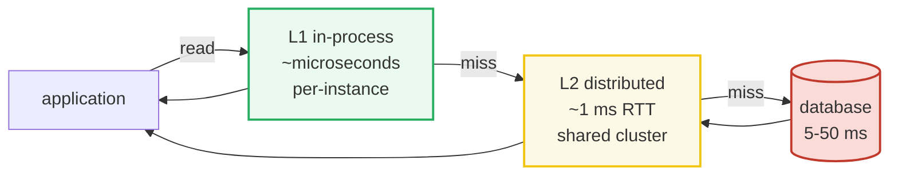

# Caching Strategies — Tiers, Eviction, Write Paths, Stampede, Coherence

> **Companion code:** [`caching_strategies.py`](https://github.com/quanhua92/tutorials/blob/main/db/caching_strategies.py). **Every
> table, hit-rate, and number in this guide is printed by
> `python3 caching_strategies.py`** — change the code, re-run, re-paste. Nothing
> here is hand-computed.
>
> **Live demo:** [`caching_strategies.html`](https://github.com/quanhua92/tutorials/blob/main/db/caching_strategies.html) — open in
> a browser; it replays access streams through LRU/LFU/FIFO live, compares write
> strategies, and recomputes the PER probability and L2 sizing in JS with the
> *identical* formulas, gold-checking against `.py`.
>
> **Source material:** Mattson, *"Evaluation of Multi-program Memory Systems"*
> (1970) — the LRU stack algorithm; Megiddo & Modha, *"ARC: A Self-Tuning, Low
> Overhead Replacement Cache"* (2003); Johnson & Shasha, *"2Q"* (1994); Vattani
> et al., probabilistic early expiration (Twitter, 2015); Fitzpatrick,
> *Memcached* (2003); Kleppmann, *Designing Data-Intensive Applications* ch.1,3,5.

---

## 0. TL;DR — the desk drawer vs the filing cabinet

A cache is a small, **fast** store in front of a large, **slow** store. Your desk
drawer (cache) holds the few folders you're working on; the filing cabinet
(database) holds everything. A drawer hit is instant; a cabinet trip is slow.

The economics are absurd: a Redis lookup is ~1 ms, a DB lookup ~5–50 ms, and a
cache node is ~1–5% the cost of a DB node. A cache at **95% hit rate** cuts DB
load **~20×** for pennies. That ratio is why caching is the first lever you reach
for under load — and the most tested topic in HLD interviews.

But caches introduce hard problems the DB didn't have: **what to evict**, **how
to write**, the **stampede**, and **invalidation** ("there are only two hard
problems in CS: cache invalidation and naming things").



---

## 1. The multi-tier cache

Each tier out from the app adds latency but **widens scope**. Each layer absorbs
what the previous missed.

> From `caching_strategies.py` **Section A** (the four tiers):
>
> | Tier | What | Examples | Latency |
> |---|---|---|---|
> | L1 | Process-level in-memory | Caffeine, Guava Cache | ~microseconds |
> | L2 | Distributed cache | Redis, Memcached | ~1 ms network RTT |
> | L3 | CDN edge cache | CloudFront, Cloudflare, Fastly | ~5–50 ms (PoP proximity) |
> | L4 | Browser cache | (every browser) | 0 ms (no network) |

| Tier | Scope | Caveat |
|---|---|---|
| L1 | hundreds of hot objects per instance | invalidation is LOCAL to one instance |
| L2 | millions of objects, shared cluster-wide | network + cluster management overhead |
| L3 | billions of objects, global | can't cache dynamic/user-specific content |
| L4 | hundreds of MB per user | controlled by Cache-Control headers only |

**Sizing principle:** target **95%+ hit rate** on L2 — then the DB only sees 5%
of reads (a 20× reduction, see Section 4). L1 absorbs the hottest per-instance
keys; L3/L4 absorb static assets so they never hit your origin.

---

## 2. Eviction policies — same stream, different survivors

When the cache fills, who leaves? The **access pattern** decides.

> From `caching_strategies.py` **Section A** — the eviction menu:
>
> | Policy | Evicts | Redis flag |
> |---|---|---|
> | LRU | item not accessed for the longest time | `allkeys-lru` |
> | LFU | item with the lowest access frequency (count decays) | `allkeys-lfu` |
> | FIFO | oldest INSERTED item regardless of access | (not native; approximated) |
> | ARC | adapts the LRU/LFU split online from hit-rate feedback | (ZFS, DS8000 internal) |
> | TTL | item after a fixed expiration regardless of access | `SET key val EX seconds` |
> | noeviction | nothing — returns an ERROR when full | `noeviction` |

| Policy | Best for | Avoid when |
|---|---|---|
| LRU | general web, sessions, social feeds | bursty scans (one scan evicts the hot set) |
| LFU | skewed media (popular stays popular) | new items (start at freq 0, evicted at once) |
| FIFO | queue-like caches, rotating logs | most production caching (ignores recency) |
| ARC | unknown/mixed access patterns | (rarely available outside ZFS/IBM DS8000) |
| TTL | API responses, auth tokens, rate-limit windows | when freshness doesn't matter (pure overhead) |

### Worked example: the policy ranking flips with the access pattern

**Workload 1 — temporal locality** (80% of reads hit 20 hot keys; cache cap = 25):

> From `caching_strategies.py` **Section B**:
>
> | policy | hits | misses | hit rate |
> |---|---:|---:|---:|
> | LRU | 1361 | 639 | 0.6805 |
> | LFU | 1592 | 408 | 0.7960 |
> | FIFO | 1180 | 820 | 0.5900 |
>
> ```
> [check] LRU (0.6805) > FIFO (0.5900) on temporal stream: OK
> ```

FIFO ignores re-accesses, so a cold key inserted before a hot-key re-read can
evict the hot key. LRU's `move_to_end` keeps the hot set resident. (LFU wins
outright here because the hot keys are accessed very frequently.)

**Workload 2 — scan pollution** (a 60-key one-shot sweep through a 30-slot cache,
then re-reads of 10 hot keys):

> | policy | hits | misses | hit rate |
> |---|---:|---:|---:|
> | LRU | 80 | 80 | 0.5000 |
> | LFU | 90 | 70 | 0.5625 |
> | FIFO | 80 | 80 | 0.5000 |
>
> ```
> [check] LFU (0.5625) > LRU (0.5000) on scan-pollution: OK
> ```

The 60-key sweep is 60 one-shot misses; **LRU evicts every hot key** to make
room, so the post-sweep hot reads all miss. **LFU keeps the high-count hot set.**
This is the classic LRU failure mode — a single full-table scan can flush the
entire working set. (Redis mitigates this with an approximate LRU + a sampled
clock algorithm; production LFU adds **time-decay** so a once-popular key that's
now cold eventually leaves.)

### ARC — the self-tuning compromise

**ARC** (Adaptive Replacement Cache) keeps a **recent** list *and* a **frequent**
list. A hit in the recent list promotes that key to the frequent list. It tunes
the split between the two from hit-rate feedback: on workload 1 it behaves like
LRU; on workload 2 like LFU. That self-tuning is why ZFS uses ARC.

---

## 3. Write strategies — latency vs consistency vs safety

Every write strategy picks a point on the **latency / consistency / safety**
triangle. There is no free lunch.

> From `caching_strategies.py` **Section C**:
>
> | Strategy | Write path | Latency |
> |---|---|---|
> | cache-aside (lazy) | write DB only; optionally invalidate cache key | miss = 3 hops |
> | write-through | write cache AND DB synchronously, then ack | write latency doubles |
> | write-behind (write-back) | write cache, ack IMMEDIATELY; flush to DB async | lowest write latency |
> | read-through | (write handled separately) | miss = cache-side load |
> | refresh-ahead | (write handled separately) | zero extra read latency |

| Strategy | Consistency | Risk |
|---|---|---|
| cache-aside | milliseconds of staleness | cache miss spike; stale until TTL |
| write-through | strong (reads see latest write) | fills cache with data never read |
| write-behind | eventual (until flush lands) | **DATA LOSS** if node dies before flush |
| read-through | always warm after first access | cold-start: first read of a key always misses |
| refresh-ahead | fresh if access is predictable | refreshes items that won't be read again |

**Decision rules:**

- **cache-aside** — the default for read-heavy (>80% reads) workloads where ms
  of staleness is OK. Most common pattern. Miss penalty = **3 hops**
  (read cache → read DB → fill cache).
- **write-through** — payment systems, inventory counts, any data where reads
  must reflect the latest write immediately.
- **write-behind** — counters (likes, views), leaderboards, shopping carts.
  **Never** for financial transactions.

### The write-behind data-loss window

Write-behind acks the client *before* the DB write. If the cache node dies in the
window between ack and flush, that write is **lost**. Window = flush interval.

> From `caching_strategies.py` **Section C** (1000 writes/sec):
>
> | flush interval (sec) | writes/sec | writes at risk |
> |---:|---:|---:|
> | 1 | 1000 | 1,000 |
> | 5 | 1000 | 5,000 |
> | 10 | 1000 | 10,000 |
> | 30 | 1000 | 30,000 |
> | 60 | 1000 | 60,000 |

At 1000 wps a 10-sec flush window risks **10,000 unflushed writes**.

### The cache-aside miss penalty (the seed of the stampede)

```
miss = (1) read cache -> miss, (2) read DB, (3) write cache.
```
If 1000 requests miss the **same** key at once, that's 1000 DB reads — the
**stampede**. See Section 4.

---

## 4. The stampede (thundering herd) + coherence

A stampede happens when a hot key expires and **every** request misses at once.
The fix is to make sure only **one** request rebuilds the cache.

> From `caching_strategies.py` **Section D** — 1000 simultaneous misses:
>
> ```
>   naive          : 1000 DB reads (one per miss)
>   mutex lock     : 1 DB read  (only the lock holder)
>   PER (beta=1)   : ~1 DB read  (first refresher warms it; no lock, scales out)
> [check] naive 1000 vs mutex 1 DB reads: OK
> ```

- **Mutex lock (distributed lock):** on a miss, acquire a lock (Redis `SETNX`);
  only the holder queries the DB and fills the cache; everyone else waits and
  hits. Exactly one DB read, at the cost of lock contention and a single point of
  failure if the holder crashes.
- **Probabilistic Early Expiration (PER):** near TTL expiry each request
  independently refreshes with probability `p = exp(-β · time_remaining / TTL)`.
  The **first** refresher warms the key; later requests then hit it — expected
  rebuilds ≈ 1, like the mutex, but **with no lock and it scales horizontally**.
  Twitter uses this for timeline caches.

> PER refresh probability (Section D):
>
> | time_remaining/TTL | p (β=1) | p (β=3) |
> |---:|---:|---:|
> | 1.00 | 0.3679 | 0.0498 |
> | 0.75 | 0.4724 | 0.1054 |
> | 0.50 | 0.6065 | 0.2231 |
> | 0.25 | 0.7788 | 0.4724 |
> | 0.10 | 0.9048 | 0.7408 |
> | 0.00 | 1.0000 | 1.0000 |
>
> ```
> [check] p at expiry=0 -> 1.0; p at full TTL=1.0 -> 0.3679 (<0.5): OK
> ```

A bigger β sharpens the curve (refreshes cluster closer to expiry); β=1 is the
common default.

### Coherence — cache invalidation

Phil Karlton: *"There are only two hard things in Computer Science: cache
invalidation and naming things."*

> From `caching_strategies.py` **Section D**:
>
> | Strategy | How | Pro / Con |
> |---|---|---|
> | TTL-based | let items expire after N seconds | simple, no coordination / stale up to TTL seconds |
> | event-driven | DB change publishes invalidation event (Kafka/CDC) | fresh within seconds / lost event = permanently stale |
> | write-through | update DB + cache atomically on every write | strong consistency / write latency doubles |
> | versioned keys | key includes a version: `user:123:v7`; bump on update | old keys expire naturally / must store/serve current version |

Pick by your freshness SLA: **TTL** for "seconds of staleness OK", **event-driven**
for "must-be-fresh", **write-through** for "must-never-be-stale". There is no
perfect strategy — every approach trades latency, consistency, and complexity.

### Sizing L2 — hit rate → DB load reduction

> From `caching_strategies.py` **Section D** (100,000 reads/sec):
>
> | L2 hit rate | reads hitting DB | DB load reduction |
> |---:|---:|---:|
> | 0.50 | 50,000 | 2x |
> | 0.80 | 20,000 | 5x |
> | 0.90 | 10,000 | 10x |
> | 0.95 | 5,000 | 20x |
> | 0.99 | 1,000 | 100x |
>
> ```
> [check] 95% hit rate -> 5,000 DB reads/sec (20x reduction): OK
> ```

The jump from 90% → 99% is another **10×** DB reduction. The last few percent of
hit rate is where the engineering effort pays off most.

---

## 5. Memcached vs Redis (quick pick)

| Aspect | Redis | Memcached |
|---|---|---|
| Data structures | 8 types (String, Hash, List, Set, ZSet, HLL, Stream, Bitmap) | String only |
| Persistence | RDB snapshots + AOF WAL | none (pure in-memory) |
| Replication | master-replica + Sentinel + Cluster | no native replication |
| Memory efficiency | higher overhead per key (~64–100 B) | lower overhead (~40 B) |
| Multi-threading | single-threaded commands (6.0+ I/O multi-thread) | natively multi-threaded |

Use **Redis** when you need persistence, complex data structures, pub/sub, atomic
ops, or Lua scripting. Use **Memcached** when you need maximum raw throughput on
simple key-value and it's already deployed.

---

## 6. Pitfalls & interview cheat sheet

| Pitfall | Why it bites | Fix |
|---|---|---|
| LRU on a scan workload | one full scan flushes the hot set | switch to LFU / ARC, or a sampled-clock LRU |
| LFU on new content | new keys start at freq 0 and get evicted at once | add time-decay to the frequency counter |
| cache-aside on a cold/hot key | the miss herd hammers the DB | mutex lock or PER |
| write-behind for money | node crash loses the flush window | use write-through for financial data |
| Invalidation message lost | event-driven cache stays permanently stale | use a periodic reconcile + TTL as a backstop |
| Thundering reload after deploy | all nodes warm the same keys at once | pre-warm / stagger / use read-through |
| Treating "cached" as "consistent" | reads may be stale until TTL | document the staleness SLA; pick write-through if not OK |

**One-liner answers:**

- *cache-aside vs write-through?* aside is lazy (fill on read, ms of staleness,
  default for read-heavy); through is eager (write both sync, strong consistency,
  double write latency).
- *Thundering herd?* a hot key expires, all requests miss at once → DB spike. Fix
  with a mutex lock (one rebuild) or PER (probabilistic early refresh, no lock).
- *LRU vs LFU?* LRU on recency (wins on temporal loops, dies on scans); LFU on
  frequency (survives scans, cold-starts new keys). ARC self-tunes the split.
- *Why multi-tier?* each layer absorbs what the previous missed — L1 (µs,
  per-instance) → L2 (1 ms, shared) → L3 (CDN, global) → L4 (browser). Size L2
  to 95%+ so the DB sees ~5% of reads.

---

## 7. Gold check

`caching_strategies.py` ends with a self-consistency check;
`caching_strategies.html` re-derives the same numbers in JS and shows a
`[check: OK]` badge:

- LFU > LRU on scan pollution (frequency protects the hot set); LRU > FIFO on
  temporal locality (recency matters).
- PER `p(0) = 1.0`, `p(1.0) < 0.5` (monotone, increasing near expiry).
- Stampede: naive fans out N reads, mutex/PER collapse to 1.
- Sizing: 95% hit rate → 5000 DB reads/sec on 100k QPS (20× reduction).

> *This overview pairs with [`BLOOM_FILTER.md`](https://github.com/quanhua92/tutorials/blob/main/db/BLOOM_FILTER.md) (membership
> filtering before a cache) and the DB internals suite generally.* 🔗
> [`./index.html`](https://github.com/quanhua92/tutorials/blob/main/db/index.html)
