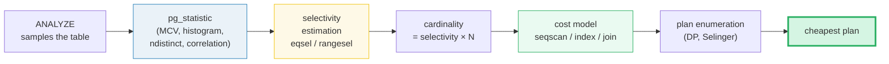
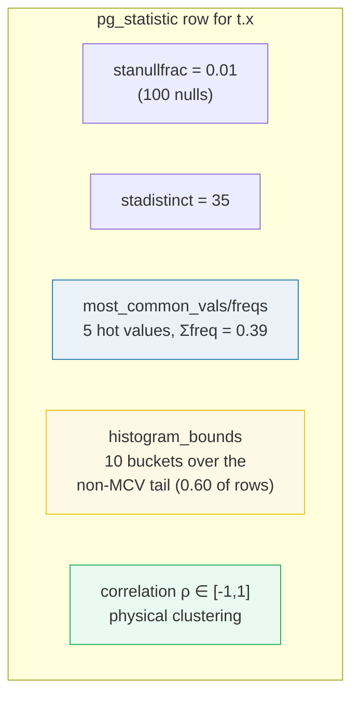
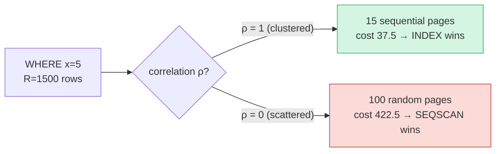

# Query Optimizer Cost Estimation — A Visual, Worked-Example Guide

> **Companion code:** [`cost_estimation.py`](./cost_estimation.py). **Every
> statistic, selectivity, cost, and DP number in this guide is printed by
> `python3 cost_estimation.py`** — change the code, re-run, re-paste. Nothing
> here is hand-computed.
>
> **Live animation:** [`cost_estimation.html`](./cost_estimation.html) — open in
> a browser; it recomputes the selectivity + cost model in JS with the
> *identical* formulas and gold-checks against the `.py`.
>
> **Source material:** PostgreSQL docs §76.1 *How the Planner Uses Statistics*
> & §52.18 *pg_statistic*; PostgreSQL source `src/backend/optimizer/path/
> costsize.c` (cost_seqscan, cost_index, cost_nestloop, cost_hashjoin,
> cost_mergejoin) and `src/backend/utils/adt/selfuncs.c` (eqsel, scalargtsel);
> Selinger 1979 *"Access Path Selection in a Relational Database Management
> System"* (the cost model + DP); Mackert & Lohman 1986 *"Index Caching..."*
> (the scattered-pages formula); Silberschatz/Korth/Sudarshan, *Database System
> Concepts* §16.

---

## 0. TL;DR — the travel agent pricing a holiday

A query can run in many ways (a **plan**): scan the whole table, hop through an
index, hash-join, sort-merge… The **optimizer** is a travel agent that must
quote a price for *every* plan and book the cheapest. Its currency is the
**cost unit**, defined as the price of one sequential page fetch **= 1.0**.

> *The agent cannot count how many rows the query returns (that IS running the
> query). So it reads a small per-column **sample** the database keeps — the
> **statistics**, in catalog table `pg_statistic` (user view `pg_stats`), rebuilt
> by `ANALYZE`. Four numbers per column do almost all the work: the most-common
> values + frequencies (**MCV**), the **histogram bounds**, the **distinct
> count**, and the **correlation**. From these it **estimates selectivity** (the
> fraction of rows a predicate keeps), turns that into a **cardinality** (row
> count), prices each plan with a **cost model**, then **enumerates** plans and
> picks the minimum. Cardinality error is the single biggest cause of bad plans:
> every downstream cost inherits the mistake.*



- **The pipeline (one line):** `ANALYZE → pg_statistic → selectivity →
  cardinality → plan cost → enumerate → pick min`.
- **The unit:** `seq_page_cost = 1.0`. A random fetch is 4× that
  (`random_page_cost = 4.0`). A tuple inspect is 0.01, an index compare 0.005.
- **The lesson:** **cardinality estimation drives everything**. Get the row
  count right and the cost model picks well; get it wrong and even a perfect
  cost model books the wrong trip.

### Glossary

| Term | Plain meaning |
|---|---|
| **cost unit** | the price of ONE sequential page fetch. `seq_page_cost == 1.0`. |
| **startup / run cost** | cost before the first output row (sort/spool) / cost to deliver all rows. Total = startup + run. |
| **cardinality** | estimated rows a step produces. The most error-prone input. |
| **selectivity** | fraction of rows a predicate keeps, in `[0,1]`. `cardinality = selectivity × N`. |
| **pg_statistic** | catalog table holding per-column statistics (view: `pg_stats`). `ANALYZE` refreshes it. |
| **MCV** | most-common-values + frequencies. Hot values → exact-ish equality estimate. |
| **histogram_bounds** | equal-depth bucket edges over the non-MCV values. Range estimates read it (default ~100 buckets). |
| **n_distinct** | distinct value count. Drives the "rare equality" estimate. |
| **correlation** | physical clustering of the column (`-1..1`). Decides **seq vs random** I/O pricing for an index scan — the key index-scan dial. |
| **Mackert-Lohman** | formula for distinct heap pages touched when index matches are scattered. |
| **DP (Selinger)** | dynamic programming over subsets to find the cheapest join order. `O(3ⁿ)` vs `O(n!)` brute force. |

---

## 1. Statistics — the `pg_statistic` structure

Consider a table `t` with **10,000 rows**, column `x`. `ANALYZE` samples it and
writes, per column, a handful of **slot statistics**. For `x` they are:

> From `cost_estimation.py` **Section A**:
>
> ```
> stanullfrac   = 0.0100   (100 nulls / 10000 rows)
> stadistinct   = 35   (positive = absolute distinct-value count)
>
> [slot 1] most_common_vals / most_common_freqs (MCV):
>    value |  count | frequency (count/N)
>    ------+--------+------------------
>        5 |   1500 | 0.1500
>       10 |   1000 | 0.1000
>       20 |    600 | 0.0600
>        1 |    500 | 0.0500
>       99 |    300 | 0.0300
>    ------+--------+------------------
>    sum MCV freq = 0.3900   (covers 3,900 rows)
>
> [slot 2] histogram_bounds (10 equal-depth buckets over the non-MCV values):
>    [100, 103, 106, 109, 112, 115, 118, 121, 124, 127, 129]
>    each bucket holds ~600 rows; bounds are the bucket edges.
>    histogram covers the non-MCV, non-null rows = 0.6000 of the table.
>
> [slot 3] correlation = rho in [-1, 1] (physical clustering).
> ```

Three facts to internalize:

1. **MCV frequencies are fractions of TOTAL rows** (nulls counted in the
   denominator). `nullfrac + Σ(MCV freq) + tail_mass = 1.0` — verified above.
2. **The histogram excludes the MCV values.** It is built only over the
   *less-common* rows, split into **equal-depth** buckets (≈equal row counts per
   bucket, *not* equal value ranges). The default `statistics_target` is 100
   buckets; we use 10 for readability.
3. **`n_distinct`** is stored *positive* = absolute count (here 35). It can also
   be stored *negative* = a fraction of rows when the planner suspects the
   column has more distinct values than the sample saw.



> 🔗 Statistics are consumed by the **index** decisions in [`BTREE.md`](./BTREE.md)
> and [`COVERING_INDEX.md`](./COVERING_INDEX.md); the heap pages they describe
> live in [`HEAP_VS_CLUSTERED.md`](./HEAP_VS_CLUSTERED.md).

---

## 2. Selectivity estimation — `eqsel` and `rangesel`

**Rule:** `cardinality = selectivity × N`. There are two estimators.

### (a) Equality — `WHERE x = v` (`eqsel`)

- **If `v` is a most-common value → use its stored frequency.** Exact-ish
  (subject to ANALYZE sampling).
- **Otherwise → spread the remaining non-null, non-MCV probability mass evenly
  across the remaining distinct values** (uniformity assumption):
  `selectivity = (1 − Σ mcv_freq − nullfrac) / (ndistinct − n_mcv)`.

> From `cost_estimation.py` **Section B**:
>
> ```
> (1) WHERE x = 5  -> 5 IS a most-common value -> use its frequency.
>     eqsel(x=5) = mcv_freq(5) = 0.1500
>     estimated rows = 0.1500 * 10000 = 1500
>     actual rows    = 1500
>     [check] estimate == actual: OK
>
> (2) WHERE x = 100 -> 100 is NOT in MCV -> spread the remaining mass.
>     remaining mass = 1 - sum(mcv) - nullfrac = 1 - 0.3900 - 0.0100 = 0.6000
>     remaining distinct = ndistinct - n_mcv = 35 - 5 = 30
>     eqsel(x=100) = 0.6000 / 30 = 0.0200
>     estimated rows = 0.0200 * 10000 = 200
>     actual rows    = 200
>     [check] estimate == actual: OK
>
> (3) WHERE x = 537 -> not in MCV, not even in the table -> same formula.
>     eqsel(x=537) = 0.6000 / 30 = 0.0200
>     estimated rows = 200.0   actual rows = 0
> ```

**The pitfall (Section B example 3):** `x = 537` matches nothing, yet the
estimate is **200 rows**. The optimizer *cannot tell "absent" from "rare"* — a
value unknown to `ANALYZE` is assumed as common as the average rare value. This
is the classic source of cardinality mis-estimation, and it cascades into every
cost. (🔗 `pg_stats` `most_common_vals` lists what ANALYZE *saw*; anything else
is assumed average.)

### (b) Range — `WHERE x > c` (`rangesel`)

Combine MCV + histogram:
`selectivity = (MCV rows with value > c) + (histogram fraction right of c) × tail_mass`,
with **linear interpolation** inside the bucket containing `c`.

> From `cost_estimation.py` **Section B** (`x > 115`, `115` is a bucket edge):
>
> ```
> histogram_bounds = [100, 103, 106, 109, 112, 115, 118, 121, 124, 127, 129]
> 115 sits at bucket edge b[5]. Buckets fully to the right: buckets 6..9 = 4 buckets.
> bucket 5 [115,118): fraction > 115 = (118-115)/(118-115) = 1.0
> hist_frac = (4 full + 1.0) / 10 = 0.5
> mcv_part  = 0   (all MCV values < 115)
> rangesel(x>115) = 0 + 0.5 * 0.6000 = 0.3000
> estimated rows = 3000   actual rows = 2800
> ```
>
> The estimate **overshoots** actual (3000 vs 2800): linear interpolation prices
> bucket 5 as fully matched, but the 200 rows *equal to* the edge value `115`
> should not be (they are excluded by `>`). **Histograms are an approximation;
> MCV-equality is exact.**

| Predicate | Estimator | Result here | Note |
|---|---|---|---|
| `x = <MCV>` | MCV frequency | exact | best case |
| `x = <rare/absent>` | `(1−Σmcv−nullfrac)/(ndistinct−n_mcv)` | 200 rows for **any** rare value | uniformity assumption |
| `x > c` | MCV-part + interpolated histogram | approximate | overshoots at bucket edges |
| `x IS NULL` | `nullfrac` | 0.01 | stored directly |

---

## 3. The cost model — seqscan vs index scan

**Cost constants** (units; `seq_page_cost = 1.0` by definition):

| constant | value | meaning |
|---|---|---|
| `seq_page_cost` | **1.0** | one sequential page fetch (the unit) |
| `random_page_cost` | **4.0** | one random page fetch (4× sequential) |
| `cpu_tuple_cost` | **0.01** | inspect one heap tuple |
| `cpu_index_cost` | **0.005** | compare one index entry |

### (a) SeqScan — `seq_page_cost × P + cpu_tuple_cost × N`

> From `cost_estimation.py` **Section C** (10,000 rows, 100 pages):
>
> ```
> cost = seq_page_cost * P + cpu_tuple_cost * N
>      = 1.0 * 100 + 0.01 * 10000
>      = 100 + 100 = 200.0
> ```
>
> This is **fixed regardless of the predicate** — a seqscan always reads every
> page. So 200 is the bar every index scan must beat.

### (b) Index Scan — the correlation dial

An index scan's I/O cost depends on **how scattered the matching heap tuples
are**, which `correlation` measures:

- **ρ = 1 (clustered):** matches pack onto consecutive pages → priced at
  `seq_page_cost`. `pages = ⌈R / tuples_per_page⌉`.
- **ρ = 0 (scattered):** matches jump around → priced at `random_page_cost`.
  Distinct pages touched = the **Mackert-Lohman** formula
  `P × (1 − (1 − 1/P)^R)` (capped at `P`).

> From `cost_estimation.py` **Section C** (`WHERE x = 5`, R = 1500 matches):
>
> ```
> (2) rho = 0 (scattered):
>     pages_scattered = 100*(1-(1-1/100)^1500) = 100 pages (capped)
>     io  = 4.0 * 100 = 400 ;  cpu = 0.015 * 1500 = 22.5
>     index scan cost (rho=0) = 422.5   vs seqscan 200.0 -> SEQSCAN wins
>
> (3) rho = 1 (clustered):
>     pages_clustered = ceil(1500/100) = 15 pages
>     io  = 1.0 * 15 = 15  (sequential!) ;  cpu = 22.5
>     index scan cost (rho=1) = 37.5    vs seqscan 200.0 -> INDEX wins
> ```
>
> **Correlation flips the verdict.** A clustered index makes 1500 matches cheap
> (sequential pages); a scattered one pays 4×. This is the single biggest lever
> on index-scan cost. (`CLUSTER`/`ORDER BY` + `INSERT` order raise ρ.)

### (c) Break-even — when does the index win?

> From `cost_estimation.py` **Section C** (uncorrelated index, ρ = 0):
>
> ```
> | selectivity | R (rows) | pages_scattered | index cost | winner  |
> |-------------|----------|-----------------|------------|---------|
> |      0.0001 |        1 |             1.0 |        4.0 | index   |
> |      0.0010 |       10 |             9.6 |       38.4 | index   |
> |      0.0050 |       50 |            39.5 |      158.7 | index   |
> |      0.0070 |       70 |            50.5 |      203.1 | SEQSCAN |
> |      0.0100 |      100 |           100.0 |      401.5 | SEQSCAN |
> |      0.1500 |     1500 |           100.0 |      422.5 | SEQSCAN |
> |      1.0000 |    10000 |           100.0 |      550.0 | SEQSCAN |
>
> -> uncorrelated index wins for R <= ~68 (selectivity ~0.7%).
> -> a CLUSTERED index (rho=1) wins until R ~= 8000 (80%+).
> ```

**The rule of thumb "an index wins below ~5% selectivity"** assumes *partial*
correlation. With ρ = 0 the crossover is ~0.7%; with ρ = 1 it is ~80%.
`random_page_cost` (often tuned down to ~1.1 on all-SSD storage) shifts the
crossover too — on SSD a scattered fetch is barely dearer than a sequential one,
so indexes win more often.



---

## 4. Join cost — nested loop vs hash vs merge

Join two tables: **ORDERS (10,000 rows, 100 pages)** ⋈ **CUSTOMERS (1,000 rows,
10 pages)** on `customer_id`. Equality-join selectivity =
`1 / max(ndistinct_left, ndistinct_right) = 1/1000`; join cardinality = 10,000.

> From `cost_estimation.py` **Section D**:
>
> ```
> (1) NESTED LOOP  cost = outer + outer_rows * inner_per_row
>     ORDERS outer   : 200 + 10000 * 4.015 = 40350
>     CUSTOMERS outer: 20 + 1000 * 4.015 = 4035   <- put the SMALL table outside
>
> (2) HASH JOIN  cost = build(smaller) + probe(larger) + output
>     build (customers): 20 + 0.01*1000 = 30
>     probe (orders)  : 200 + 0.01*10000 = 300
>     output          : 0.01*10000 = 100
>     hash join = 30 + 300 + 100 = 430
>
> (3) MERGE JOIN  cost = sort(both) + merge   (if inputs not pre-sorted)
>     sort(orders)=2193 ; sort(customers)=169 ; merge=430
>     merge join (with explicit sort) = 2793
>
> COMPARISON:
>   | plan                         |   cost | winner?           |
>   |------------------------------|--------|-------------------|
>   | nested loop (orders outer)   |  40350 | (terrible)        |
>   | nested loop (customers outer)|   4035 |                   |
>   | merge join (with sort)       |   2793 |                   |
>   | hash join                    |    430 | WINNER            |
> ```

| Join | Cost formula | When it wins |
|---|---|---|
| **Nested loop** | `outer + outer_rows × inner_per_row` | small outer + indexed inner; or one side tiny; or an index-driven "lookup join" |
| **Hash join** | `build(smaller) + probe(larger) + output` | large equi-joins, no sorted input — the default workhorse |
| **Merge join** | `sort(both) + merge` (≈0 sort if pre-sorted) | inputs already sorted (index / pre-ordered), or needs sorted output anyway |

**Why hash join wins:** each side is scanned **once**; cost does **not**
multiply by the other side's size. Nested loop pays an inner probe **per outer
row**, so it explodes on large inputs. Merge join needs a sort unless inputs are
already ordered (🔗 [`BTREE.md`](./BTREE.md) can supply the order for free).

---

## 5. Plan enumeration — DP over join orders (Selinger)

For `A(10000) ⋈ B(1000) ⋈ C(100)` on a chain `A–B–C` (A-C has no predicate),
the optimizer must pick a join **order** and **method**.

### (a) Brute force: all `3! = 6` left-deep orderings

> From `cost_estimation.py` **Section E**:
>
> ```
> | order      | step 1            | step 2            |  total cost |
> |------------|-------------------|-------------------|-------------|
> | A->B->C    | (A⋈B) = 1000  (340)| (⋈C) = 100 (354)|             |
> | A->C->B    | (A⋈C) x 1000000   | cartesian         | CARTESIAN   |
> | B->A->C    | (B⋈A) = 1000  (340)| (⋈C) = 100 (354)|             |
> | B->C->A    | (B⋈C) = 100   (34)| (⋈A) = 100 (336)|             |
> | C->A->B    | (C⋈A) x 1000000   | cartesian         | CARTESIAN   |
> | C->B->A    | (C⋈B) = 100   (34)| (⋈A) = 100 (336)|             |
>
> cheapest brute-force order: B->C->A  cost = 336
> ```

Two orderings (`A→C→B`, `C→A→B`) force a **cartesian product** (1,000,000 rows)
because A and C share no predicate — catastrophically expensive. Brute force
evaluates them anyway.

### (b) Dynamic programming (Selinger 1979)

Build the answer **bottom-up by subset**, keeping only the cheapest plan per
subset:

> From `cost_estimation.py` **Section E**:
>
> ```
> Level 1: {A}=200 (10000), {B}=20 (1000), {C}=2 (100)
> Level 2: {A,B}=340 (1000), {B,C}=34 (100), {A,C}=10303 (1,000,000) <- cartesian, pruned
> Level 3 ({A,B,C}):
>    ({AB}) join C: 340 -> 354  (100 rows)
>    ({AC}) join B: 10303 -> 30333  (cartesian)
>    ({BC}) join A: 34  -> 336   (100 rows)
> DP cheapest: ({BC}) join A  cost = 336
> ```

DP finds the same optimum (336) but **prunes** the cartesian `{A,C}` and never
re-explores a commutatively-equivalent pair separately (`A⋈B` and `B⋈A` are one
subset). It also scales far better:

> From `cost_estimation.py` **Section E**:
>
> ```
> | tables n | brute force (n!) | DP subsets (~3^n) |
> |----------|------------------|-------------------|
> |        3 |                6 |                27 |
> |       10 |        3,628,800 |            59,049 |
> |       15 | 1,307,674,368,000 |        14,348,907 |
> ```

PostgreSQL caps standard DP at `geqo_threshold` (default **12** tables); above
that it switches to a **genetic algorithm** (GEQO) for the join order.

---

## 6. Cheat sheet

| | formula |
|---|---|
| cardinality | `selectivity × N` |
| `eqsel(x = MCV)` | MCV frequency |
| `eqsel(x = rare)` | `(1 − Σmcv − nullfrac) / (ndistinct − n_mcv)` |
| `rangesel(x > c)` | `mcv_part(c) + hist_frac(c) × tail_mass` |
| join selectivity | `1 / max(ndistinct_left, ndistinct_right)` |
| seqscan cost | `seq_page_cost × P + cpu_tuple_cost × N` |
| index scan cost | `ρ·seq·pages_clust + (1−ρ)·rand·pages_scatt + cpu·R` |
| pages scattered (Mackert-Lohman) | `P·(1 − (1 − 1/P)^R)`, cap P |
| nested loop | `outer + outer_rows × inner_per_row` |
| hash join | `build(smaller) + probe(larger) + output` |
| DP complexity | `O(3ⁿ)` subsets vs `O(n!)` brute force |

**Decide in 4 questions:**
1. Is the predicate on a **hot value**? → MCV frequency (exact). Otherwise the
   uniformity assumption kicks in — watch out for **data skew** and values
   `ANALYZE` never saw.
2. Is the index **clustered** (ρ ≈ 1)? → cheap sequential reads; it'll win even
   at coarse selectivity. Scattered (ρ ≈ 0)? → it needs high selectivity.
3. Large equi-join? → **hash join**. Inputs already sorted? → **merge join**.
   One side tiny + indexed inner? → **nested loop**.
4. Many tables? → trust DP, but **feed it good statistics** — cardinality error
   is inherited by every cost and can flip the chosen plan.

**Tuning levers:** `ANALYZE` (refresh stats), `statistics_target` (more MCV +
histogram buckets = more accurate, more planning time), `random_page_cost`
(SSD ≈ 1.1), `geqo_threshold` (DP→genetic switch). `CLUSTER`/natural insert
order raises `correlation`.

**Cross-links:** statistics feed the index choice in [`BTREE.md`](./BTREE.md) 🔗
and [`COVERING_INDEX.md`](./COVERING_INDEX.md) 🔗; the heap pages priced here
are described in [`HEAP_VS_CLUSTERED.md`](./HEAP_VS_CLUSTERED.md) 🔗; the
visibility of those pages to scans is covered in [`MVCC.md`](./MVCC.md) 🔗.
