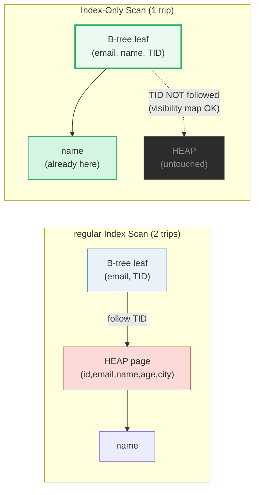
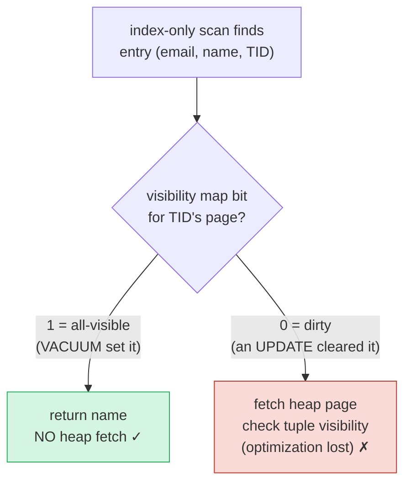

# Covering Index (Index-Only Scan) — A Visual, Worked-Example Guide

> **Companion code:** [`covering_index.py`](./covering_index.py). **Every access
> path, leaf layout, and I/O number in this guide is printed by
> `python3 covering_index.py`** — change the code, re-run, re-paste. Nothing
> here is hand-computed.
>
> **Live animation:** [`covering_index.html`](./covering_index.html) — open in a
> browser; it recomputes the I/O model in JS with the *identical* formula and
> gold-checks against the `.py`.
>
> **Source material:** PostgreSQL docs §11.2 *Indexes* & §73.3 *How PostgreSQL
> Uses Indexes* (Index-Only Scans) & §70.4 *Visibility Map*; PostgreSQL 11
> release notes (`INCLUDE` clause); Silberschatz/Korth/Sudarshan, *Database
> System Concepts* §14; MySQL reference manual §15 (InnoDB clustered & secondary
> indexes); Microsoft SQL Server docs *Create Indexes with Included Columns*.

---

## 0. TL;DR — the index card that already has the answer

A **covering index** is an index that contains **every column the query needs**,
so the database can answer the query **from the index alone** and **never reads
the heap tuple**. The scan the planner picks is called an **Index-Only Scan**.

> *You want Cara's name and only know her email. There are two buildings: the
> **Index Building** (a wall of sorted cards `email -> shelf position`) and the
> **Heap Building** (the warehouse of full folders). A normal query walks to
> BOTH: flip a card to find the shelf position (`TID`), then cross campus to
> pull the folder and read `name`. A covering index **photocopies `name` onto
> the card itself** — now the card reads `(email, name -> TID)` and the query
> never leaves the Index Building. The expensive heap trip is gone. That is the
> whole trick: pay a little index storage to delete a random heap read from
> every lookup.*



- **Regular Index Scan** = traverse the index to a `TID`, then **fetch the heap
  page** for every matching row (a random page read). Cost = `height` index
  reads **+ 1 heap fetch per matching row**.
- **Index-Only Scan** = the leaf entry *already contains* every column in the
  `SELECT` list and `WHERE`, so the heap is **skipped**. Cost = `height` index
  reads **+ 0 heap fetches** (when the visibility map cooperates — §3).
- **The lineage** (🔗 builds on [`BTREE.md`](./BTREE.md)):
  `regular index (key -> TID -> heap read)` → `covering index (INCLUDE extra
  columns -> skip the heap)` → **Index-Only Scan**.

### Why it matters

On a 1M-row table, a single `SELECT name WHERE email=X` drops from **4** page
reads (3 index + 1 heap) to **3** — and a 1,000-row range scan drops from
**1,011** to **15**. The heap fetch was *the* dominant cost, and covering
indexes delete it. (§5 has the full I/O tables.)

### Glossary

| Term | Plain meaning |
|---|---|
| **heap** | the table itself — the unordered pile of full tuples, one per row, on fixed-size **pages**. The "slow" building. 🔗 [`HEAP_VS_CLUSTERED.md`](./HEAP_VS_CLUSTERED.md) |
| **TID** | tuple id = `(page, offset)`. The index card's "shelf position". `key -> TID`. |
| **B-tree index** | the sorted card wall. 🔗 [`BTREE.md`](./BTREE.md) covers the tree; here we only care about the **leaf** entry. |
| **key column** | the column the index is **sorted** on (the `WHERE` predicate). B-tree comparisons happen here. |
| **INCLUDE column** | a column **stored** in the leaf but **not** sorted on (PostgreSQL 11+ `INCLUDE`). Rides along for free reads, zero comparison cost. |
| **heap fetch** | following a `TID` to read a heap page = 1 random page I/O. The thing covering lets you **avoid**. |
| **visibility map** | a 1-bit-per-heap-page bitmap: is the page visible to all transactions? Set by **VACUUM**. Index-only needs this to skip the heap (§3). 🔗 [`FREE_SPACE_MAP.md`](./FREE_SPACE_MAP.md) is a sibling per-page bitmap. |
| **Index-Only Scan** | PostgreSQL's planner node that reads only the index leaf and (when the visibility map allows) skips the heap. |

---

## 1. The regular access path — key → TID → heap (2 trips)

Consider `SELECT name FROM users WHERE email = 'cara@x.com'` with a **plain**
index on `(email)`. The leaf only stores `(email, TID)`. To get `name` the
engine **must** follow the `TID` into the heap.

> From `covering_index.py` **Section A** (5-row trace table):
>
> ```
> leaf (sorted by email):
>   (alice@x.com  , tid=(0, 0))
>   (bob@x.com    , tid=(0, 1))
>   (cara@x.com   , tid=(1, 0))
>   (dave@x.com   , tid=(1, 1))
>   (eve@x.com    , tid=(2, 0))
>
> ACCESS PATH (regular Index Scan):
>   STEP 1 [index traversal]  : walk the B-tree to the leaf,
>                              find entry (cara@x.com, tid=(1, 0))
>                              -> this is `height` index page reads
>   STEP 2 [heap fetch]       : follow tid=(1,0) -> read HEAP page 1
>                              heap page 1 holds (3, 'cara@x.com', 'Cara', 41, 'Da Nang')
>   STEP 3 [project]          : extract name = 'Cara' from the tuple
> ```
>
> ```
> I/O model (point lookup):
>   regular_index_scan  =  height(index pages)  +  1 heap fetch
>   The heap fetch is a RANDOM page read of a (big, cold) page.
>   For 1 matching row this is the dominant cost - see Section E.
> ```

**Step 2** is the villain. It is a *random* read of a heap page that is usually
much larger and colder than the index leaf — and you pay it **once per matching
row**. Range scans that match 1,000 rows pay it 1,000 times (§5).

---

## 2. The covering index — INCLUDE(name) → skip the heap

Add `INCLUDE (name)` to the index:

```sql
CREATE INDEX users_email_idx ON users (email) INCLUDE (name);
```

Now each leaf entry is `(email, name, TID)`. The `name` column rides along on
the card. The query **finds `name` right there** and never touches the heap:

> From `covering_index.py` **Section B** (same 5-row table):
>
> ```
> Covering leaf entries: (email, {name}, tid)  - name rides along
>
>   leaf (sorted by email):
>     (alice@x.com  , name=Alice , tid=(0, 0))
>     (bob@x.com    , name=Bob   , tid=(0, 1))
>     (cara@x.com   , name=Cara  , tid=(1, 0))
>     (dave@x.com   , name=Dave  , tid=(1, 1))
>     (eve@x.com    , name=Eve   , tid=(2, 0))
>
> ACCESS PATH (Index-Only Scan, visibility map = all-visible):
>   STEP 1 [index traversal]  : walk the B-tree to the leaf,
>                              find entry (cara@x.com, name=Cara, tid=(1, 0))
>                              -> `height` index page reads
>   STEP 2 [skip heap]        : name IS ALREADY on the card -
>                              NO heap fetch. (visibility map OK)
>   STEP 3 [project]          : return name = 'Cara' directly
> ```
>
> ```
> I/O model (point lookup, all-visible):
>   covering_index_scan  =  height(index pages)  +  0 heap fetches
>   The random heap read from Section A is GONE. That is the win.
> ```

The heap fetch (the expensive random read) has been **deleted**. That is the
entire benefit, expressed as one I/O removed per matching row.

---

## 3. The visibility map — index-only is *conditional*

There is a catch. An index entry carries a `TID` but **does not know** whether
the tuple it points at is **visible to the current transaction** (MVCC — a row
may have been updated/deleted by a concurrent transaction). PostgreSQL answers
"do I still need to check?" with the **visibility map**: a 1-bit-per-heap-page
bitmap.

> From `covering_index.py` **Section C**:
>
> ```
> bit = 1 (all-visible) : every tuple on the page is visible to ALL
>                         transactions -> index-only scan may SKIP
>                         the heap fetch for entries on this page.
> bit = 0 (not all-visible): at least one tuple may be invisible ->
>                         index-only scan MUST fetch the heap page to
>                         check visibility -> the optimization is
>                         LOST for that row (it degrades to a fetch).
> ```

| Who | Effect on the bit |
|---|---|
| **VACUUM** | **sets** the bit once it confirms all tuples on the page are visible to all transactions. *This is why VACUUM is essential for index-only scan performance.* |
| any **UPDATE / DELETE** on the page | **clears** the bit (the page is no longer guaranteed all-visible). |

The effective heap reads for an index-only scan degrade smoothly with the
visible fraction `f`:

> From `covering_index.py` **Section C** (`R = 1000` matching rows):
>
> ```
> EFFECTIVE heap reads for an index-only scan over R matching rows:
>   heap_reads  =  R * (1 - f)     where f = fraction of pages all-visible
>
> | vacuum state        | f (visible) | fallback heap fetches = R*(1-f) |
> |---------------------|-------------|----------------------------------|
> | just VACUUMed (fresh) |        1.00 |                                0 |
> | light write churn   |        0.90 |                              100 |
> | heavy UPDATE workload |        0.50 |                              500 |
> | never VACUUMed      |        0.00 |                             1000 |
> ```

**Takeaway:** a covering index delivers **0** heap reads only when the
visibility map is healthy. On a write-heavy table that is never `VACUUM`ed,
index-only scan silently degenerates back toward the regular cost. Tune
`autovacuum` on tables you rely on for index-only scans. (🔗 A sibling
per-page bitmap is the free space map — see [`FREE_SPACE_MAP.md`](./FREE_SPACE_MAP.md).)



---

## 4. INCLUDE vs key columns — what lives in the leaf entry

Two ways to get `name` *into* an index on `email`:

- **(a) compound KEY** — `CREATE INDEX ... ON users (email, name)`. `name`
  **is** part of the sort order; the B-tree compares on `(email, name)` pairs.
  Use this when you *also* filter/range-scan on `name`. Cost: every comparison
  carries `name`, and the sort fanout is narrower.
- **(b) INCLUDE column** — `CREATE INDEX ... ON users (email) INCLUDE (name)`.
  `name` is **stored** in the leaf but **never compared**. Sort order is still
  just `email`. No comparison overhead, same key fanout. Cost: a bigger leaf
  entry → fewer entries per leaf → marginally more leaves / taller tree.

> From `covering_index.py` **Section D** (8 KB page, email key + name include):
>
> ```
> LEAF ENTRY LAYOUT (bytes):
>
>   +-----------------------------------------+----------+
>   | field                                   | bytes    |
>   +-----------------------------------------+----------+
>   | key: email (the sort column)            |       50 |
>   | [INCLUDE] name (stored, not compared)   |       30 |   <- only in covering/compound
>   | TID (page, offset)                      |        6 |
>   | index tuple header                      |       16 |
>   +-----------------------------------------+----------+
>   | plain leaf entry    (email, TID)        |       72 |
>   | covering leaf entry (email, name, TID)  |      102 |
>   | compound KEY entry  ((email,name), TID) |      102 |   same bytes, different ROLE
>   +-----------------------------------------+----------+
>
> plain leaf cap    = 8192 // 72  = 113 entries/page
> covering leaf cap = 8192 // 102  = 80 entries/page
> compound leaf cap = 8192 // 102  = 80 entries/page  (same bytes -> same cap, but comparisons cost more)
> ```

**Rule of thumb:**
- Need to **filter / range-scan** on the column? → make it a **KEY**.
- Only need to **read it back** in the `SELECT`? → **INCLUDE** it. Same
  covering benefit, no comparison cost, no key-fanout narrowing.

### InnoDB & SQL Server notes

- **InnoDB (MySQL)** stores the **entire row** in the clustered (primary-key)
  index, so a **PK lookup is naturally covering** for any column set. A
  *secondary* index stores `(key -> PK)`, so reading a non-PK column needs
  `secondary index → PK → clustered lookup` — an extra "heap-like" fetch.
  Covering a secondary index (key INCLUDE the columns) avoids that bounce.
- **SQL Server** has had `INCLUDE` since 2005; the semantics match PostgreSQL's
  11+ clause. SQL Server calls these *included (non-key) columns*.

---

## 5. When covering helps — the I/O comparison tables (N = 1,000,000)

Same physical model as [`BTREE.md`](./BTREE.md) §F: 8 KB pages, 1,000,000 rows,
40 tuples/heap page → **25,000 heap pages**.

> From `covering_index.py` **Section E** (index layouts):
>
> ```
> PLAIN    (email)              : entry=72 B, leaf_cap=113, leaves=8,850, height=3
> COVERING (email INCLUDE name) : entry=102 B, leaf_cap=80, leaves=12,500, height=3
> index size: plain = 8,910 pages, covering = 12,584 pages (+3,674, 41.2%)
> ```
>
> Both indexes are **height 3**, so a point lookup reads 3 index pages either
> way. The difference is **only** in the heap fetch.

### (1) Point lookup — `SELECT name WHERE email = X` (1 row)

| plan | index reads | heap reads | **TOTAL I/O** |
|---|---|---|---|
| regular Index Scan | 3 | 1 | **4** |
| Index-Only Scan | 3 | 0 | **3** |

Covering saves **1 page read** per lookup — the heap fetch. On a hot point
lookup path (logins, profile views) this is large in aggregate.

### (2) Range scan — `SELECT name WHERE email BETWEEN …` (1,000 rows, heap NOT clustered)

| plan | index reads | heap reads | **TOTAL I/O** |
|---|---|---|---|
| regular Index Scan | 11 | 1,000 | **1,011** |
| Index-Only Scan | 15 | 0 | **15** |

> ```
> -> covering saves 996 page reads on a 1000-row range (all 1000 heap
>    fetches vanish). Range scans are where covering indexes pay back the most.
> ```

This is the dramatic case: 1,000 heap fetches collapse to zero. **Range scans
are where covering indexes earn their keep.**

### (3) Aggregation

> From `covering_index.py` **Section E**:
>
> ```
> (3a) SELECT COUNT(*) FROM users  (NO predicate, needs NO column):
>      any index supports index-only COUNT (no data column needed).
>      full heap scan = 25,000 reads ; index-only scan (plain idx) = 8,910 reads ; saves 16,090 reads
>      NOTE: pure COUNT(*) needs no column, so even the PLAIN index
>      is already 'covering' for it. The INCLUDE earns its keep the
>      moment a stored column appears in the SELECT list:
>
> (3b) SELECT MIN(name), MAX(name) FROM users WHERE email BETWEEN ... (1000 rows):
>      MIN/MAX over name needs name in the index -> only COVERING:
>        regular: must fetch 1000 heap pages for the names = 1011 reads
>        covering: scan 13 index leaves, take min/max = 15 reads  (index-only, sorted -> first/last leaf)
>      -> covering saves 996 reads on a min/max aggregation.
> ```

Two flavors:
- **`COUNT(*)`** needs *no* data column, so **any** index (even the plain one)
  already gives an index-only scan: 25,000 → 8,910 reads. `INCLUDE` is *not*
  needed here — but it is still an index-only-scan win.
- **`MIN(name)` / `MAX(name)`** *do* need `name`: only the **covering** index
  can do it index-only. Because the leaf is sorted, MIN/MAX come from the
  first/last leaf — 15 reads vs 1,011.

---

## 6. When it hurts — write amplification, HOT loss, cache pressure

A covering index is **not free**. Three costs.

### (1) Write amplification + loss of HOT (Heap-Only Tuple) updates

PostgreSQL **HOT** updates: when you `UPDATE` a row and **no indexed column**
changes, the new tuple is placed in the **same heap page** and **no index is
touched** (fast, no index bloat). The moment an **indexed** column changes, HOT
is **disabled** and every index pointing at the row must be updated.

> From `covering_index.py` **Section F** (`UPDATE users SET name='Carol' WHERE id=3`):
>
> ```
> | index on (email)               | name in index? | extra index I/O | HOT? |
> |--------------------------------|----------------|-----------------|------|
> | PLAIN   (email)                | no             |               0 |  YES |
> | COVERING(email INCLUDE name)   | YES            |            ~2* |   NO |
> (* delete old entry + insert new; can be 1-2 page writes)
> ```

Adding `name` to the index turns a **free** HOT update into ~2 index page
writes — *and* clears the visibility-map bit (§3), so the page stops being
index-only-friendly until the next VACUUM.

### (2) Index size / cache pressure

> From `covering_index.py` **Section F**:
>
> ```
> | index            | leaf entry | pages      | vs plain     |
> |------------------|------------|------------|--------------|
> | plain (email)    |         72 |      8,910 | baseline     |
> | covering         |        102 |     12,584 | +3,674 (41.2%) |
> ```

A **41%** bigger index means 41% more pages competing for the buffer cache. If
the heap gets evicted more often, your *other* queries (the ones that *do* need
the heap) get slower — the read win on the covered query can be offset by cache
misses elsewhere.

### (3) Break-even — reads saved vs writes added

> From `covering_index.py` **Section F**:
>
> ```
> Each covered point-lookup saves ~1 heap read.
> Each name-UPDATE costs ~2 extra index writes.
> Covering wins on I/O when  reads / updates  >  2.0
>
> | workload                         | covering worth it?            |
> |----------------------------------|-------------------------------|
> | read-heavy (logins, profile view)| YES - saves a fetch every read|
> | write-heavy (name updated often) | NO  - 2 writes per update     |
> | range-scan heavy on name         | YES - saves N fetches         |
> | never VACUUMed dirty table       | MAYBE - visibility map hurts  |
> ```

**Rule of thumb:** `INCLUDE` columns that are **read** in hot query paths but
**rarely updated**. Never `INCLUDE` a churn-heavy column.

---

## 7. Cheat sheet

| | regular index | covering index (`INCLUDE`) |
|---|---|---|
| leaf entry | `(key, TID)` | `(key, INCLUDE cols…, TID)` |
| sort order | on the key | still on the key (INCLUDE not compared) |
| point lookup I/O | `height + 1` (heap fetch) | `height + 0` (all-visible) |
| range scan I/O (R rows) | `height + L − 1 + R` heap | `height + L′ − 1` |
| needs visibility map | no | **yes** (else degrades to fetch) |
| write cost on INCLUDE-col update | 0 (HOT ok) | ~2 index writes (HOT lost) |
| best for | equality/range on key only | `SELECT` columns that are read often, updated rarely |

**Decide in 3 questions:**
1. Does the query `SELECT` a column that is **not** the key? → candidate for `INCLUDE`.
2. Is that column **updated often**? → if yes, do **not** include it (write amp + HOT loss).
3. Is the table **`VACUUM`ed** / `autovacuum` tuned? → if no, index-only will degrade; fix that first.

**Cross-links:** built on [`BTREE.md`](./BTREE.md) (the leaf is a B+tree leaf) 🔗
and [`HEAP_VS_CLUSTERED.md`](./HEAP_VS_CLUSTERED.md) (the heap fetch you are
avoiding) 🔗; the visibility map is a sibling of the free-space map in
[`FREE_SPACE_MAP.md`](./FREE_SPACE_MAP.md) 🔗.
