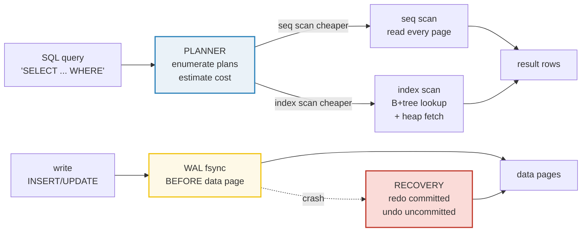

# Databases Overview — Types, ACID, Indexing, Query Optimization

> **Companion code:** [`databases.py`](https://github.com/quanhua92/tutorials/blob/main/db/databases.py). **Every table, WAL trace,
> and number in this guide is printed by `python3 databases.py`** — change the
> code, re-run, re-paste. Nothing here is hand-computed.
>
> **Live demo:** [`databases.html`](https://github.com/quanhua92/tutorials/blob/main/db/databases.html) — open in a browser; it
> recomputes the WAL crash recovery, the B+tree-height formula, and the planner
> cost model in JS with the *identical* formulas and gold-checks against `.py`.
>
> **Source material:** Haerder & Reuter, *"Principles of Transaction-Oriented
> Database Recovery"* (1983) — the ACID acronym and WAL model; Mohan et al.,
> *"ARIES"* (1992) — analysis/redo/undo recovery; Selinger, *"Access Path
> Selection in a Relational DBMS"* (1979) — the cost-based optimizer every
> RDBMS descends from; Brewer's CAP conjecture (2000), Gilbert & Lynch's proof
> (2002); Silberschatz et al., *Database System Concepts*; Kleppmann,
> *Designing Data-Intensive Applications*.

---

## 0. TL;DR — the filing cabinet and its card catalog

A database is a system that stores rows **and** lets you find them fast. The
naive version — one big file, scan every query — is `O(N)` and fine for a
hundred rows. Real databases add three things on top of "a file of rows":

- **Indexes** = a card catalog. Look the key up in a sorted/hashed
  side-structure and jump straight to the row. Cost: slower writes + more disk.
- **Transactions (ACID)** = a group of changes that are all-or-nothing and
  survive crashes. The mechanism is a **write-ahead log (WAL)**: every change is
  `fsync`'d to the log *before* the data page, so crash recovery can replay it.
- **A cost model** = the query planner. It enumerates physical plans, estimates
  each one's **cost** (predicted I/O + CPU), and runs the cheapest.

> *Different database families exist because no single recipe wins every
> workload. Row + B-tree + WAL (PostgreSQL/MySQL) is a great generalist. But
> analytics want **columnar**, write-heavy want **LSM**, traversals want
> **graph**, events want **time-series**, point reads want **key-value**.*



---

## 1. The database families

Pick a family by matching the **workload** to its strengths. There is no "best"
database — only the right tool for an access pattern.

> From `databases.py` **Section A** (the six families):
>
> | Family | Data model | Examples |
> |---|---|---|
> | Relational | tables of typed rows; schema-first; SQL | PostgreSQL, MySQL, Oracle, SQLite |
> | Document (NoSQL) | self-describing JSON/BSON docs; flexible schema | MongoDB, CouchDB, DynamoDB |
> | Columnar | columns stored contiguously, not rows | ClickHouse, BigQuery, Redshift, Snowflake |
> | Graph | nodes + edges as first-class pointers | Neo4j, Dgraph, TigerGraph |
> | Time-series | append-only events keyed by timestamp | InfluxDB, TimescaleDB, Prometheus |
> | Key-value (NoSQL) | opaque blob keyed by id; O(1) get/put | Redis, Memcached, Riak, etcd |

| Family | Strengths | Weak for |
|---|---|---|
| Relational | ACID transactions, ad-hoc SQL, mature tooling | rigid schema; horizontal scaling is hard |
| Document | evolving schemas, nested data, horizontal scale | no joins across docs, weaker transactions |
| Columnar | fast aggregates over few columns, high compression | slow point lookups, poor single-row updates |
| Graph | multi-hop traversal in O(hops) not O(JOIN^hops) | sharding is hard, not for tabular analytics |
| Time-series | huge write rates, cheap downsample/retention | not general-purpose; updates/deletes are rare |
| Key-value | microsecond reads, extreme QPS, simple | no queries, no range scans (blob-only) |

### Decision shortcut

- Need **ACID + SQL + joins** → **relational** (PostgreSQL/MySQL).
- Need **100K+ writes/sec** → **LSM-tree** (Cassandra/RocksDB) — turns random
  writes into sequential ones. 🔗 [`LSM_TREE.md`](https://github.com/quanhua92/tutorials/blob/main/db/LSM_TREE.md)
- Need **SUM over billions of rows on a few columns** → **columnar**
  (ClickHouse/BigQuery).
- Need **multi-hop relationships** → **graph** (Neo4j).
- Need **microsecond point reads** → **key-value** (Redis).
- Need **timestamped events at high rate** → **time-series** (InfluxDB/Timescale).

### Row vs columnar — why layout matters

A row store (PostgreSQL) writes `(id, name, age, email, ...)` contiguously, so
fetching one whole row is one read but `SUM(age)` scans every column of every
row. A columnar store (ClickHouse) writes all `age` values contiguously, so
`SUM(age)` reads *only* the age column — often **10–100× less I/O** for
analytics, at the cost of slow single-row point lookups.

### CAP theorem (distributed systems)

Across multiple nodes you keep **at most two** of:

- **C**onsistency — every read sees the latest write (linearizability).
- **A**vailability — every request gets a non-error response.
- **P**artition-tolerance — the system works despite network splits.

Partitions are **unavoidable** on a network, so the real choice is **C vs A**:

| Pick | Example | During a partition |
|---|---|---|
| **CP** | MongoDB (strong), HBase | rejects writes to stay consistent |
| **AP** | Cassandra, DynamoDB | accepts writes, may serve stale reads |
| **CA** | standalone PostgreSQL | only works on one node (no partition) |

🔗 For replication/sharding details see [`STREAMING_REPLICATION.md`](https://github.com/quanhua92/tutorials/blob/main/db/STREAMING_REPLICATION.md)
and [`SHARDING_PARTITIONING.md`](https://github.com/quanhua92/tutorials/blob/main/db/SHARDING_PARTITIONING.md).

---

## 2. ACID — the transaction contract

ACID is the contract a transaction gives you. Each letter is delivered by a
**concrete mechanism** and exists to prevent a **concrete failure**.

> From `databases.py` **Section B**:
>
> | Letter | Guarantee | Mechanism |
> |---|---|---|
> | **Atomicity** | a txn is all-or-nothing | WAL + rollback of uncommitted txns on recovery (ARIES undo) |
> | **Consistency** | txn moves DB from one valid state to another | constraints + triggers checked at commit; reject violators |
> | **Isolation** | concurrent txns don't observe each other's uncommitted writes | 2PL / MVCC snapshots / SSI; isolation levels tune the trade-off |
> | **Durability** | a committed txn survives a crash/power loss | WAL fsync before COMMIT returns; redo on recovery (ARIES redo) |
>
> | Letter | Failure it prevents |
> |---|---|
> | Atomicity | partial transfer: debit without credit |
> | Consistency | account balance going negative |
> | Isolation | lost update: two txns read 0, both write 1, counter stuck at 1 |
> | Durability | ATM says "deposited" then a power cut loses it |

### Atomicity + Durability via the WAL (worked crash recovery)

The WAL is an append-only log of every change. **Durability rule: a txn is not
"committed" until its COMMIT record is `fsync`'d to the WAL.** On crash,
recovery replays the survived log prefix: **REDO** every write whose txn
committed *inside* the prefix, **DROP** every write whose txn didn't (atomicity).

> From `databases.py` **Section B** — a 10-record WAL with two committed and two
> in-flight txns:
>
> ```
>  [0] ('BEGIN', 'T1')
>  [1] ('WRITE', 'T1', 'x', 100)
>  [2] ('COMMIT', 'T1')
>  [3] ('BEGIN', 'T2')
>  [4] ('WRITE', 'T2', 'x', 200)
>  [5] ('BEGIN', 'T3')
>  [6] ('WRITE', 'T3', 'y', 7)
>  [7] ('COMMIT', 'T3')
>  [8] ('BEGIN', 'T4')
>  [9] ('WRITE', 'T4', 'z', 9)
> no crash  -> data = {'x': 100, 'y': 7}
> crash after record 8 (T2,T4 never committed) -> data = {'x': 100, 'y': 7}
>   committed txns surviving = ['T1', 'T3']
> [check] T1 + T3 (committed) survived; T2 + T4 (in-flight) dropped: OK
> crash after record 7 (T3's COMMIT lost, its WRITE undone) -> data = {'x': 100}
> [check] T3's write existed in WAL but without a commit it is undone: OK
> ```

The second crash is the sharp case: T3's **write** (record 6) is in the log, but
its **COMMIT** (record 7) was lost in the crash. ARIES therefore **undoes** the
write — T3 reverts as if it never happened. That is atomicity and durability
working together.

### Isolation — the lost-update anomaly

Two txns each increment a counter from 0. Correct answer is 2. Without locking,
both **read** 0, both **write** `read+1 = 1`, and the second write clobbers the
first — a **lost update**, final value 1.

> From `databases.py` **Section B**:
>
> ```
>   no locking (READ_UNCOMMITTED) schedule -> final counter = 1  (LOST UPDATE)
>   2PL (lock-read-write-unlock) schedule -> final counter = 2  (CORRECT)
> [check] no-lock gives 1 (lost update), 2PL gives 2 (correct): OK
> ```

**Two-phase locking (2PL)** fixes it: a txn acquires all its locks in a growing
phase before releasing any in a shrinking phase, serializing conflicting writes.
Modern MVCC databases (PostgreSQL) instead give each txn a **snapshot** so
readers never block; serializable isolation adds **SSI** predicate locks to catch
write-skew. 🔗 [`MVCC.md`](https://github.com/quanhua92/tutorials/blob/main/db/MVCC.md), [`SNAPSHOT_ISOLATION.md`](https://github.com/quanhua92/tutorials/blob/main/db/SNAPSHOT_ISOLATION.md),
[`TWO_PHASE_LOCKING.md`](https://github.com/quanhua92/tutorials/blob/main/db/TWO_PHASE_LOCKING.md), [`SERIALIZABLE_SSI.md`](https://github.com/quanhua92/tutorials/blob/main/db/SERIALIZABLE_SSI.md).

### Consistency — constraints reject bad writes

A `CHECK (balance >= 0)` constraint turns consistency into a machine check: a
txn that would drive the balance negative is **rejected** at commit, so the DB
never enters an invalid state.

> From `databases.py` **Section B**:
>
> ```
>   starting balance = 50; invariant balance >= 0
>   proposed txn: balance - 100 = -50 -> REJECTED (violates constraint)
>   decision: ABORT; balance stays 50; DB remains consistent
> [check] constraint-violating txn is aborted, balance unchanged: OK
> ```

---

## 3. Indexing — turn O(N) scans into O(log N) or O(1) jumps

An index is a side-structure mapping a key to its row. Three families:

- **B+tree** — sorted; great for ranges and `ORDER BY`. Lookup =
  `⌈log_fanout N⌉` pages. 🔗 [`BTREE.md`](https://github.com/quanhua92/tutorials/blob/main/db/BTREE.md)
- **Hash** — unordered; `O(1)` exact-match only, no ranges. 🔗 [`HASH_INDEX.md`](https://github.com/quanhua92/tutorials/blob/main/db/HASH_INDEX.md)
- **(no index)** — a full table scan is `O(N_pages)`. Cheapest if you read most
  rows anyway.

> From `databases.py` **Section C** (fanout = 256):
>
> | N rows | pages (full scan) | B+tree point lookup | hash point lookup |
> |---:|---:|---:|---:|
> | 1,000 | 50 | 2 | 1 |
> | 10,000 | 500 | 2 | 1 |
> | 100,000 | 5,000 | 3 | 1 |
> | 1,000,000 | 50,000 | 3 | 1 |
> | 10,000,000 | 500,000 | 4 | 1 |
> | 100,000,000 | 5,000,000 | 4 | 1 |
>
> ```
> [check] 1M rows -> 3 levels; 100M rows -> 4 levels: OK
> ```

At 100M rows a full scan reads 5,000,000 pages; a B+tree lookup reads **4**.
That ~1,000,000× is why every OLTP database indexes primary and hot foreign keys.

### When an index actually helps: selectivity

The planner uses an index only when it filters **out** most rows. The metric is
**selectivity** = fraction of rows a predicate returns (lower is better):

- equality: `sel = 1 / distinct`
- range:    `sel = (hi - lo) / (max - min)`

> From `databases.py` **Section C**:
>
> | predicate | distinct | selectivity | verdict |
> |---|---:|---:|---|
> | `user_id = 12345` (PK) | 10,000,000 | 0.000000 | use index (unique) |
> | `country = 'US'` | 250 | 0.004000 | maybe (depends) |
> | `status = 'active'` | 4 | 0.250000 | seq scan cheaper |
> | `created_at` range, 1 day | — | 0.002738 | use index (range) |

Rule of thumb: an index is worth it below **~1–5% selectivity**. Above that, the
random I/O of fetching scattered heap rows costs more than one sequential sweep.
🔗 [`COST_ESTIMATION.md`](https://github.com/quanhua92/tutorials/blob/main/db/COST_ESTIMATION.md), [`COVERING_INDEX.md`](https://github.com/quanhua92/tutorials/blob/main/db/COVERING_INDEX.md),
[`BITMAP_INDEX.md`](https://github.com/quanhua92/tutorials/blob/main/db/BITMAP_INDEX.md), [`GIN_GIST.md`](https://github.com/quanhua92/tutorials/blob/main/db/GIN_GIST.md).

---

## 4. Query optimization — the planner picks the cheapest plan

You write declarative SQL. The planner enumerates **physical plans**, estimates
each one's **cost** (predicted I/O pages + CPU tuples), and runs the cheapest.
Cost units are arbitrary but **consistent** — the planner only needs a correct
*ranking*, not absolute time. PostgreSQL defaults: `seq_page_cost=1.0`,
`random_page_cost=4.0`, `cpu_tuple=0.01`.

```
seq scan cost   = N_pages * seq_page_cost + N_tuples * cpu_tuple
index scan cost = N_index_pages * random_page_cost
                  + sel * N_tuples * (random_page_cost + cpu_tuple)
```

> From `databases.py` **Section D** — a 1M-row table, predicate on a near-unique
> column (distinct = 1,000,000):
>
> | plan | selectivity | rows fetched | cost |
> |---|---:|---:|---:|
> | seq scan | 1.000000 | 1,000,000 | 60000.00 |
> | index scan | 0.000001 | 2 | 16.01 |
>
> ```
> planner picks: INDEX SCAN
> [check] index scan (16.01) < seq scan (60000.00): OK
> ```

Now the **same table** but `WHERE status = 'active'` with only 4 distinct values
(25% selectivity):

> | plan | selectivity | rows fetched | cost |
> |---|---:|---:|---:|
> | seq scan | 1.000000 | 1,000,000 | 60000.00 |
> | index scan | 0.250000 | 250,000 | 1002512.00 |
>
> ```
> planner picks: SEQ SCAN
> [check] seq scan (60000.00) < index scan (1002512.00): OK
> ```

Fetching 250,000 rows via **random** I/O (4 cost each) is ~16× more expensive
than one sequential sweep. This is why you don't index low-cardinality columns.

### The break-even selectivity

Solving `index_scan_cost == seq_scan_cost` for `sel` gives the crossover. Below
it the index wins; above it seq scan wins.

> From `databases.py` **Section D**:
>
> ```
> index wins while selectivity < 0.0150 (~1.50% of rows)
> [check] at crossover sel=0.0150: index 60000.00 == seq 60000.00 (within 1e-6): OK
> ```

This single number (~1.5% for the default cost ratios) is the most useful
planner intuition in interviews: **below ~1–2% selectivity, index; above, scan.**

🔗 For the full pipeline — parsing → planning → execution — see
[`QUERY_PARSING.md`](https://github.com/quanhua92/tutorials/blob/main/db/QUERY_PARSING.md), [`COST_ESTIMATION.md`](https://github.com/quanhua92/tutorials/blob/main/db/COST_ESTIMATION.md),
[`JOIN_ALGORITHMS.md`](https://github.com/quanhua92/tutorials/blob/main/db/JOIN_ALGORITHMS.md), [`AGGREGATION_PIPELINE.md`](https://github.com/quanhua92/tutorials/blob/main/db/AGGREGATION_PIPELINE.md),
[`VECTORIZED_EXECUTION.md`](https://github.com/quanhua92/tutorials/blob/main/db/VECTORIZED_EXECUTION.md).

---

## 5. Pitfalls & interview cheat sheet

| Pitfall | Why it bites | Fix |
|---|---|---|
| Indexing a low-cardinality column | 25% selectivity → random I/O > seq scan | drop it; or make it the **second** column of a composite index |
| Leftmost-prefix violation | `INDEX(a,b)` can't serve `WHERE b=?` | add a separate index on `b`, or reorder |
| `SELECT *` defeats covering indexes | forces a heap fetch per row | list only the columns you need |
| No WAL fsync tuning | every commit waits for disk → low TPS | tune `synchronous_commit`, group commits |
| Assuming "NoSQL = no transactions" | stale; MongoDB/Cassandra now support them | check the per-db guarantees, don't assume |
| CAP misframed | "pick 2 of 3" hides that P is mandatory | the real choice is C-vs-A **under partition** |
| Treating isolation as binary | "serializable or not" misses anomalies | know the level: read-uncommitted → … → serializable |

**One-liner answers:**

- *When NoSQL over SQL?* evolving/unstructured schema, horizontal write scale,
  simple access patterns, microsecond point reads.
- *ACID in one breath?* all-or-nothing (A), state-to-state valid (C), concurrent
  txns don't interfere (I), committed survives a crash (D) — delivered by the WAL.
- *Why use an index?* turn `O(N)` scans into `O(log N)` (B+tree) or `O(1)`
  (hash) lookups, *when* selectivity is below ~1–2%.
- *How does the planner choose?* estimate cost of each physical plan (I/O pages ×
  page cost + tuples × CPU cost) and run the cheapest.

---

## 6. Gold check

`databases.py` ends with a self-consistency check; `databases.html` re-derives
the same numbers in JS and shows a `[check: OK]` badge:

- B+tree height: 1 row → 1, 1M → 3, 100M → 4 (fanout 256).
- Selectivity identities: `sel_eq(10) = 0.1`, `sel_range(10,20,0,100) = 0.1`.
- WAL recovery: committed survives, uncommitted dropped; T3 undone when its
  COMMIT is lost.
- Cost model: index wins for PK selectivity, seq scan wins for a 4-value enum.

> *This overview is the front door to the rest of the `db/` suite — every deep
> dive above links out to a dedicated bundle.* 🔗 [`./index.html`](https://github.com/quanhua92/tutorials/blob/main/db/index.html)
