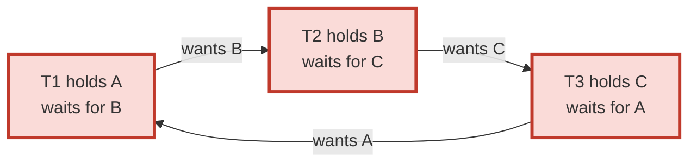
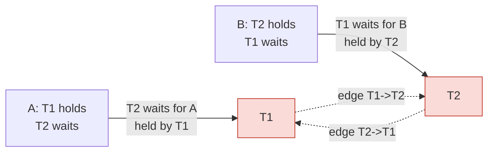
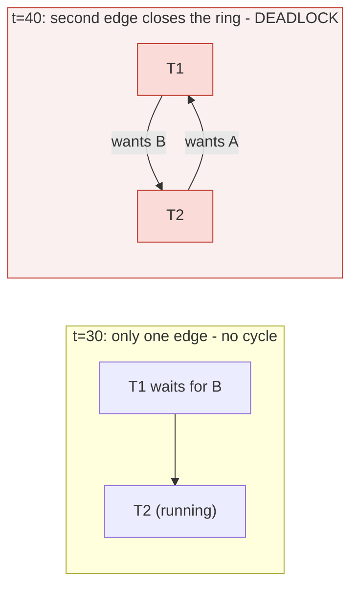
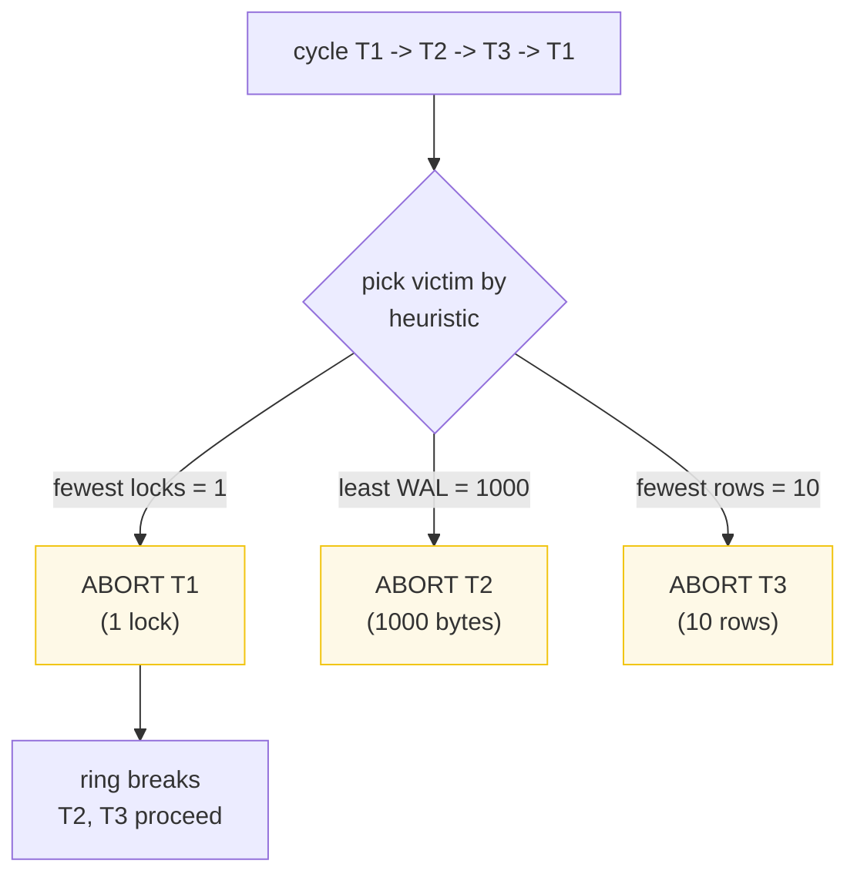
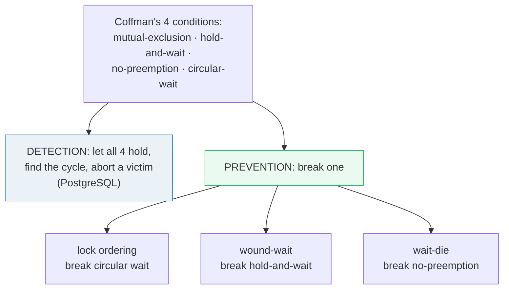
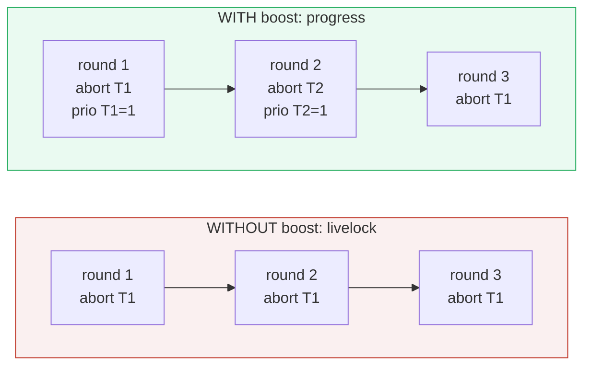

# Deadlock Detection — A Visual, Worked-Example Guide

> **Companion code:** [`deadlock_detection.py`](./deadlock_detection.py). **Every
> timeline, wait-for graph, DFS trace, and victim-selection result in this guide
> is printed by `python3 deadlock_detection.py`** — change the code, re-run,
> re-paste. Nothing here is hand-computed.
>
> **Live animation:** [`deadlock_detection.html`](./deadlock_detection.html) —
> open in a browser; it draws the wait-for graph, highlights the cycle when the
> deadlock forms, and re-runs DFS cycle detection + victim selection in JS with
> the *identical* logic, gold-checked against the `.py`.
>
> **Source material:** Coffman, Elphick & Shoshani, *System Deadlocks* (ACM
> Computing Surveys, 1971) — the four necessary conditions; Silberschatz, Korth
> & Sudarshan, *Database System Concepts* §16.3–16.6 — wait-for graph, victim
> selection, wound-wait/wait-die; Rosenkrantz, Stearns & Lewis, *System Level
> Concurrency Control* (ACM TODS 1978) — wound-wait & wait-die; PostgreSQL docs
> §13.3.4 *Deadlocks* + `deadlock_timeout` + `src/backend/storage/lmgr/deadlock.c`
> (`DeadLockCheck`).

---

## 0. TL;DR — the ring of stuck transactions

A **deadlock** is a ring of transactions where each is **holding** a lock the
next one **needs**, and each is **waiting** for a lock the previous one holds.
Nobody can move. The whole problem reduces to one shape: a **cycle in the
wait-for graph**.

> *Think of four people in a circular hallway, each holding one door shut, each
> wanting to walk through the door the person ahead is holding:*
>
> `T1` holds door `A`, wants door `B` (held by `T2`) · `T2` holds door `B`,
> wants door `C` (held by `T3`) · `T3` holds door `C`, wants door `A` (held by
> `T1`). That ring **is** a cycle, and a cycle is the **only** shape that can
> freeze everyone. So *"is there a deadlock?"* becomes *"is there a cycle in the
> wait-for graph?"* Turn the lock table into a graph, then hunt for a cycle (§1–§3).



- **Detect:** build the wait-for graph, run DFS; a **back edge to an on-stack
  node** = a cycle = a deadlock (§3). Necessary **and** sufficient.
- **Resolve:** break the ring by aborting **one** transaction — the **victim**.
  Which one? Heuristics: fewest locks held, least WAL written, fewest rows
  modified — whichever is cheapest to roll back (§4).
- **Prevent (the cheaper-than-cure path):** make a cycle impossible. Lock
  **ordering** breaks circular wait; **wound-wait** / **wait-die** use timestamps
  so wait edges can never loop (§5).
- **Watch out for livelock:** if the *same* txn is always the victim, it never
  finishes. A **priority boost** rotates the victim so everyone commits (§6).

### How PostgreSQL actually does it

PostgreSQL does **not** check continuously. A blocked backend just sleeps. Only
after **`deadlock_timeout`** (default **1 second**) does it wake up, **build the
wait-for graph** of currently-blocked backends, and run DFS. The backend that
finds a cycle **it is part of** aborts **itself** — PostgreSQL is a
*"detector-sacrifices-itself"* design, not a global heuristic victim selector
(`src/backend/storage/lmgr/deadlock.c`, `DeadLockCheck`). The general heuristics
in §4 are the textbook algorithm (Silberschatz 16.3), used by other engines;
this guide models them so the trade-offs are visible.

### Glossary

| Term | Plain meaning |
|---|---|
| **lock** | a claim on a resource (row, page, table). This guide models **exclusive** locks only: one holder at a time. |
| **holder / waiter** | the txn currently holding a lock / a txn blocked waiting to acquire a held lock. |
| **wait-for graph** | directed graph `G = (V, E)`. `V` = active txns. Edge `Ti → Tj` iff `Ti` is **waiting** for a lock **held** by `Tj`. This is the structure cycle detection runs on. 🔗 Lock acquisition is the engine; see [`SNAPSHOT_ISOLATION.md`](./SNAPSHOT_ISOLATION.md) for the isolation level that sets *when* you wait. |
| **cycle** | a path `Ti → Tj → … → Ti`. A cycle in the wait-for graph ⟺ a deadlock. |
| **deadlock** | a set of txns each blocked waiting for a resource held by another in the set. Everyone stuck forever. |
| **victim** | the one txn in the cycle chosen for **abort**, to break the ring. |
| **heuristic** | the rule that picks the victim. Common: fewest locks held, least WAL written, fewest rows modified. Ties broken by tid. |
| **wound-wait** | **prevention**, preemptive. An OLD txn may **wound** (abort) a younger holder; a young txn must **wait** for an older holder. |
| **wait-die** | **prevention**, non-preemptive. An OLD txn may **wait** for a younger holder; a young txn **dies** (aborts) if it needs a lock held by an older one. |
| **lock ordering** | **prevention**. All txns acquire resources in one fixed global order. The graph is acyclic by construction. |
| **livelock** | a txn keeps being picked as victim → retries → re-deadlocks → picked again, forever. Never stuck, never commits. |
| **priority boost** | anti-livelock. Each time a txn is a victim, increment its priority; victim selection then prefers the lowest priority, rotating the victim. |
| **deadlock_timeout** | PostgreSQL setting (default **1 s**). How long a blocked backend waits before running the deadlock check. |

---

## 1. The wait-for graph — the lock table becomes a directed graph

The single rule that turns a lock table into a graph:

```
edge Ti -> Tj  <=>  Ti waits for a resource R  AND  Tj holds R   (exclusive locks)
```

> From `deadlock_detection.py` **Section A**:
>
> ```
> LOCK TABLE (exclusive locks):
>   | resource | holder | waiters |
>   |----------|--------|---------|
>   | A        | T1     | T2      |
>   | B        | T2     | T1      |
>
> WAIT-FOR GRAPH (one edge per waiter->holder):
>   T1 -> T2
>   T2 -> T1
>
> Read it as: T1 waits for T2 (needs B), T2 waits for T1 (needs A).
> That is a 2-cycle:  T1 -> T2 -> T1. The ring of stuck txns.
>
> [check] detect_cycle -> ['T1', 'T2', 'T1']  (cycle found): OK
> ```

Resource `A` is held by `T1` with `T2` waiting → edge `T2 → T1`. Resource `B`
is held by `T2` with `T1` waiting → edge `T1 → T2`. Two edges, one ring. The
graph-building step is mechanical: one edge per *waiter → holder* pair.

> **Why exclusive locks are enough for the model:** with shared/read locks, a
> waiter may also wait behind *other waiters* queued ahead of it, so an edge can
> point at a fellow waiter, not just the holder. The waiter→holder rule is the
> common simplification and is exact for exclusive locks (the case that actually
> deadlocks in row-level locking).



---

## 2. The classic 2-resource deadlock — the circular wait forms

Two txns, two rows `A` and `B`. Each grabs one, then asks for the other:

> From `deadlock_detection.py` **Section B**:
>
> ```
> EVENT TIMELINE (logical time t ->):
>
>   t=10  T1 LOCKS A        (A held by T1)
>   t=20  T2 LOCKS B        (B held by T2)
>   t=30  T1 requests B     -> B held by T2  -> T1 WAITS for T2
>   t=40  T2 requests A     -> A held by T1  -> T2 WAITS for T1
>
> Wait-for graph after t=40:
>   T1 -> T2
>   T2 -> T1
>
> CYCLE DETECTION: ['T1', 'T2']  ->  closes T2 -> T1
> DEADLOCK: YES  (a cycle in the wait-for graph
>           is BOTH necessary and sufficient for a deadlock).
> ```

At `t=30` the graph still had only one edge (`T1 → T2`) — `T2` was running, no
problem. At `t=40` the **second** edge (`T2 → T1`) closes the ring. The instant a
cycle appears, the set of txns is deadlocked. This is why deadlocks are a
*runtime* phenomenon: two schedules that each run fine alone, interleaved the
wrong way, form a ring.

> **PostgreSQL mechanism** (`src/backend/storage/lmgr/deadlock.c`): both `T1` and
> `T2` backends sleep on their lock queue. After `deadlock_timeout` (**default
> 1 s**) each backend wakes and runs `DeadLockCheck`: it builds the wait-for
> graph and runs DFS. **Whichever backend finds a cycle it is part of aborts
> itself.** So PostgreSQL's victim = the detecting (timed-out) backend, **not**
> a global heuristic. Section 4 shows the general heuristic version.



---

## 3. Cycle detection — 3-color DFS, step by step

A cycle ⟺ a **back edge to a node still on the DFS stack**. Standard 3-color
DFS: `WHITE` (unvisited) → `GRAY` (on the stack) → `BLACK` (finished). Hitting a
`GRAY` node is a back edge; that is a cycle.

> From `deadlock_detection.py` **Section C** (graph `T1→T2→T3→T1` + acyclic side
> branch `T1→T4`):
>
> ```
> GRAPH:
>   T1 -> T2, T4
>   T2 -> T3
>   T3 -> T1
>   T4 -> (none)
>
> DFS trace (root order = T1, T2, T3, T4):
>
>   enter T1   [stack: T1]
>     T1 -> T2: WHITE -> recurse
>   enter T2   [stack: T1 -> T2]
>     T2 -> T3: WHITE -> recurse
>   enter T3   [stack: T1 -> T2 -> T3]
>     T3 -> T1: T1 is GRAY (on stack) -> BACK EDGE
>     CYCLE = ['T1', 'T2', 'T3']  (closes T3 -> T1)
>
> RESULT: cycle = ['T1', 'T2', 'T3', 'T1']
>         distinct nodes = ['T1', 'T2', 'T3']  (len 3)
> The DFS went T1 -> T2 -> T3, then saw edge T3 -> T1 where T1 was still
> GRAY (on the stack) -> back edge -> cycle T1->T2->T3. T4 (acyclic side
> branch) was never even visited: we stop at the FIRST cycle found.
>
> [check] cycle found, 3 distinct nodes: OK
> [check] acyclic graph T1->T2->T3 returns None: OK
> ```

The walk: enter `T1` (`GRAY`, stack `[T1]`) → recurse to `T2` (stack `[T1,T2]`)
→ recurse to `T3` (stack `[T1,T2,T3]`) → examine edge `T3→T1`; `T1` is `GRAY`
because it is **still on the stack** → **back edge** → cycle
`[T1, T2, T3]`, closing with `T3 → T1`. The acyclic branch `T1 → T4` was never
explored: we report the first cycle and stop (any one cycle is enough to declare
a deadlock).

| Edge type (DFS) | Target color | Meaning here |
|---|---|---|
| tree edge | `WHITE` | descend (recurse) |
| **back edge** | **`GRAY`** | **cycle found — deadlock** |
| cross / forward edge | `BLACK` | already finished, skip |

> **Cost:** DFS is `O(V + E)`. The wait-for graph of a busy DB has `V` = number
> of *blocked* backends (small) and `E` ≤ one edge per blocked backend, so the
> check is cheap. The real cost is the **1 s** `deadlock_timeout` you pay before
> the check even runs — that delay is deliberate, to avoid running DFS on every
> transient wait.

---

## 4. Victim selection — three heuristics, three different victims

Once a cycle is found you must abort **one** txn in it to break the ring. Which
one is a **policy** trade-off: roll back the txn that is *cheapest* to undo.

> From `deadlock_detection.py` **Section D** (cycle `T1 → T2 → T3 → T1`):
>
> ```
> CANDIDATES (members of the cycle):
>   | txn | locks held        | #locks | WAL bytes | rows modified |
>   |-----|-------------------|:------:|:---------:|:-------------:|
>   | T1 | {A}               |   1    |   5000    |      40       |
>   | T2 | {B,C,D}           |   3    |   1000    |      100      |
>   | T3 | {E,F}             |   2    |   9000    |      10       |
>
> | heuristic        | minimize       | metric per txn (T1,T2,T3)        | VICTIM | reason                 |
> |------------------|----------------|----------------------------------|--------|------------------------|
> | fewest_locks     | #locks held    | (1,3,2)                          |   T1   | fewest locks -> cheapest to release |
> | least_wal        | WAL bytes      | (5000,1000,9000)                 |   T2   | least WAL     -> cheapest to roll back |
> | fewest_rows      | rows modified  | (40,100,10)                      |   T3   | fewest rows   -> least work lost |
>
> Different heuristics pick DIFFERENT victims - the choice is a
> policy trade-off, not a fact.
> ```

Three heuristics, **three different victims**:

| Heuristic | Minimize | Why it is "cheap to abort" | Victim |
|---|---|---|:---:|
| **fewest locks** | `#locks held` | fewest locks to release | **T1** (1) |
| **least WAL** | `wal_bytes` | least undo log to roll back | **T2** (1000) |
| **fewest rows** | `rows_modified` | least user work lost | **T3** (10) |

> **PostgreSQL note:** PG sidesteps this entirely — the backend that times out
> and runs the check aborts **itself**, so the victim is simply *"whoever
> noticed"*. The heuristics above are the general textbook algorithm
> (Silberschatz 16.3) used by engines that pick globally. A tie is broken
> deterministically (here, by tid) so the choice is reproducible.



---

## 5. Prevention — make a cycle impossible in the first place

Coffman et al. (1971): a deadlock needs **four** conditions to hold
simultaneously — **mutual exclusion**, **hold-and-wait**, **no-preemption**, and
**circular wait**. **Prevention** breaks one of them, so the wait-for graph can
never contain a cycle and detection becomes unnecessary.

> From `deadlock_detection.py` **Section E** (timestamp rule: **smaller =
> older**):
>
> ```
> (1) LOCK ORDERING - break circular wait
>     Rule: every txn acquires resources in one fixed order: A < B < C.
>     ...
>     t=10  T1 grabs A             (A held by T1)
>     t=20  T2 wants A             -> A held by T1 -> T2 WAITS
>     t=30  T1 grabs B             (B free; T1 already holds A, ordering OK)
>     t=40  T1 commits, releases A,B
>     t=50  T2 gets A, then B      -> commits. NO deadlock.
>     wait-for graph under ordering is acyclic BY CONSTRUCTION.
>
> (2) WOUND-WAIT - break hold-and-wait (preemptive)
>     Old txn may WOUND (abort) a younger holder; young txn must WAIT for
>     an older holder. Holder can be preempted.
>     | requester | holder | ts(req) vs ts(hold) | action               |
>     |-----------|--------|----------------------|----------------------|
>     | T1        | T2     | 1 < 2 (older)        | WOUND(T2)            |
>     | T2        | T1     | 2 > 1 (younger)      | WAIT                 |
>     => edge req->hold only when req is YOUNGER, so ts strictly
>        DECREASES along every wait edge -> no cycle possible.
>
> (3) WAIT-DIE - break no-preemption (non-preemptive)
>     Old txn may WAIT for a younger holder; young txn DIES (aborts) if it
>     needs a lock held by an older one. Holder is never preempted.
>     | requester | holder | ts(req) vs ts(hold) | action               |
>     |-----------|--------|----------------------|----------------------|
>     | T1        | T2     | 1 < 2 (older)        | WAIT                 |
>     | T2        | T1     | 2 > 1 (younger)      | DIE(T2)              |
>     => edge req->hold only when req is OLDER, so ts strictly
>        INCREASES along every wait edge -> no cycle possible.
> ```

| Scheme | Condition broken | Who waits? | Who is aborted? | Edge `Ti→Tj` requires |
|---|---|---|---|---|
| **Lock ordering** | circular wait | whoever is second for the lower resource | no one (no aborts) | resource-order(Ti's want) > resource-order(Tj's hold) |
| **wound-wait** | hold-and-wait | young waits for old | old **wounds** (aborts) young holder | `ts(Ti) > ts(Tj)` (young→old) |
| **wait-die** | no-preemption | old waits for young | young **dies** (aborts) on old's lock | `ts(Ti) < ts(Tj)` (old→young) |

**Why wound-wait and wait-die can never deadlock:** a wait edge is only ever
allowed in one timestamp direction, so going around any supposed cycle would
require timestamps to strictly increase *and* strictly decrease at once —
impossible. Restarted txns keep their **original** timestamp, so a txn eventually
becomes the oldest and either waits through (wait-die) or wounds everyone
(wound-wait).

> **Detection vs prevention trade-off.** Detection has near-zero overhead when
> idle but pays `deadlock_timeout` (~1 s) on every real deadlock. Prevention
> never waits that second but causes more aborts/restarts. **PostgreSQL uses
> detection** (wait + timeout + DFS); prevention is left to the application —
> the classic advice *"lock rows in a consistent order"* is lock ordering in
> disguise.



---

## 6. Livelock + priority boost — the victim must rotate

Pick the wrong victim every time and a txn retries, re-deadlocks, and gets
picked **again** — never stuck waiting, but never commits. That is a **livelock**.

> From `deadlock_detection.py` **Section F** (cycle `T1↔T2`; fewest-locks always
> prefers `T1`, which has fewer locks):
>
> ```
> Cycle T1<->T2 recurs every round. fewest-locks: T1 has 1 lock, T2 has 2.
>
>   | round | WITHOUT boost (fewest locks) | WITH priority boost               |
>   |-------|------------------------------|-----------------------------------|
>   | 1     | victim = T1                    | victim = T1          (prio T1=1,T2=0  ) |
>   | 2     | victim = T1                    | victim = T2          (prio T1=1,T2=1  ) |
>   | 3     | victim = T1                    | victim = T1          (prio T1=2,T2=1  ) |
>   | 4     | victim = T1                    | victim = T2          (prio T1=2,T2=2  ) |
>
> WITHOUT boost: victims = ['T1', 'T1', 'T1', 'T1']  -> T1 aborted EVERY round ->
> T1 never commits. LIVELOCK.
> WITH    boost: victims = ['T1', 'T2', 'T1', 'T2']  -> victim rotates; after being
> aborted once, a txn's priority rises so the OTHER txn is picked next.
> Both eventually commit. Progress restored.
> ```

**The fix:** each time a txn is a victim, increment its **priority**; victim
selection then prefers the txn with the **lowest** priority. Round 1 picks `T1`
(tie at priority 0, broken by fewer locks); `T1`'s priority rises to 1. Round 2
picks `T2` (priority 0 < 1); `T2` rises to 1. The victim **rotates** `T1, T2,
T1, T2`, and both make progress.

> **PostgreSQL note:** PG's anti-livelock is **structural**, not a priority
> counter — because the **timed-out backend is always the victim**, and different
> backends time out on different cycles, the victim naturally varies. The
> priority-boost model above is the textbook fix used by heuristic-based
> selectors and is what the `.html` animates.



---

## 7. Gold check — 3-txn circular wait (re-implemented in JS)

The `.html` rebuilds the 3-txn ring, runs DFS, and gold-checks against the `.py`.
This is the canonical "must find it" case: a clean ring of three, no side
branches.

> From `deadlock_detection.py` **GOLD**:
>
> ```
> LOCK TABLE:
>   | resource | holder | waiter |
>   |----------|--------|--------|
>   | X        | T1     | T3     |
>   | Y        | T2     | T1     |
>   | Z        | T3     | T2     |
>
> WAIT-FOR GRAPH:
>   T1 -> T2
>   T2 -> T3
>   T3 -> T1
>
> DETECTED CYCLE: ['T1', 'T2', 'T3', 'T1']
> distinct nodes (sorted): ['T1', 'T2', 'T3']  (len 3)
>
> GOLD values (pinned for deadlock_detection.html):
>   cycle_found        = True
>   cycle_nodes_sorted = ['T1', 'T2', 'T3']
>   cycle_length       = 3
>   closes_edge        = T3 -> T1
>   graph_edges        = [('T1', ['T2']), ('T2', ['T3']), ('T3', ['T1'])]
>   victim_fewest_locks = T1   (locks T1=1, T2=3, T3=2)
>   victim_least_wal    = T2   (wal T1=5000, T2=1000, T3=9000)
>   victim_fewest_rows  = T3   (rows T1=40, T2=100, T3=10)
>
> [check] 3-cycle found, 3 distinct nodes, victims T1/T2/T3: OK
> ```

`X` held by `T1` with `T3` waiting → `T3 → T1`. `Y` held by `T2` with `T1`
waiting → `T1 → T2`. `Z` held by `T3` with `T2` waiting → `T2 → T3`. The three
edges close into `T1 → T2 → T3 → T1`; DFS reports all three distinct nodes and
the closing edge `T3 → T1`. The same three txns then triangulate the victim
heuristics: fewest-locks → `T1`, least-WAL → `T2`, fewest-rows → `T3`.

> **Decision recipe:** given a lock table, (1) emit one edge `waiter → holder`
> per resource; (2) run 3-color DFS; (3) any back edge to a `GRAY` node is a
> deadlock — break it by aborting the cheapest txn in the cycle; (4) boost the
> victim's priority so you never abort the same one twice in a row.

---

## 8. Pitfalls & cheat sheet

**Pitfalls:**
- **"A long wait is a deadlock."** — No. A long wait is *one* wait edge; only a
  *cycle* is a deadlock. `T1 → T2 → T3` (a chain) is a queue, not a deadlock.
  The deadlock appears the moment the chain closes back on itself.
- **"Victim selection is deterministic."** — Only up to the heuristic. Different
  heuristics (fewest locks / least WAL / fewest rows) pick *different* victims
  (§4). Pick one and break ties deterministically (by tid), or you get
  non-reproducible aborts.
- **"PostgreSQL picks the txn that did the least work."** — Not in general. PG's
  victim is the backend that *ran the timeout check*, i.e. whoever noticed the
  cycle. The heuristic victim selector is the textbook/other-engine design.
- **"Prevention is free."** — Lock ordering needs application discipline (easy to
  violate by mistake); wound-wait/wait-die add aborts/restarts. Prevention trades
  the ~1 s `deadlock_timeout` for more transaction restarts.
- **Forgetting the `deadlock_timeout` lag:** a real deadlock in PostgreSQL is not
  resolved for ~1 s by design. If your latency budget is tighter, lower
  `deadlock_timeout` (it makes real deadlocks resolve faster but raises DFS
  overhead on transient waits).
- **Livelock masquerading as progress:** the system is busy aborting and
  retrying, CPU is high, but no txn commits. The tell-tale sign is the *same*
  victim over and over. A priority boost (or PG's detector-sacrifices-itself
  rotation) breaks it.

**Cheat sheet:**

| | Detection (PostgreSQL) | Lock ordering | Wound-wait | Wait-die |
|---|:---:|:---:|:---:|:---:|
| lets deadlocks form? | **yes** | no | no | no |
| needs DFS / graph? | **yes** | no | no | no |
| aborts the holder? | (aborts self) | never | **yes** (old wounds young) | never |
| aborts the requester? | (aborts self) | never | never | **yes** (young dies on old) |
| precondition broken | — (detects, doesn't prevent) | circular wait | hold-and-wait | no-preemption |
| extra cost | ~1 s `deadlock_timeout` per deadlock | app discipline | restarts of young txns | restarts of young txns |
| livelock risk | low (rotating detector) | none | none | none |

**Pick the strategy in 2 questions:**
1. Can you impose a global order on the locks your app takes (e.g. always lock
   parent row before child, lock tables A→B→C)? → **lock ordering**; deadlocks
   become impossible and you never pay the 1 s.
2. Order is impossible / you want the DB to just cope? → rely on **detection**
   (PostgreSQL's default), keep `deadlock_timeout` sane, and retry aborted
   transactions. Reserve wound-wait/wait-die for systems that need *provable*
   deadlock-freedom (some distributed lock managers).

**Cross-links:** deadlocks are the failure mode of *lock-based* concurrency
control — see [`SNAPSHOT_ISOLATION.md`](./SNAPSHOT_ISOLATION.md) for the
multi-version model that decides *when* two txns conflict and one must wait 🔗,
and [`MVCC.md`](./MVCC.md) for the tuple-version machinery underneath those
waits 🔗.
