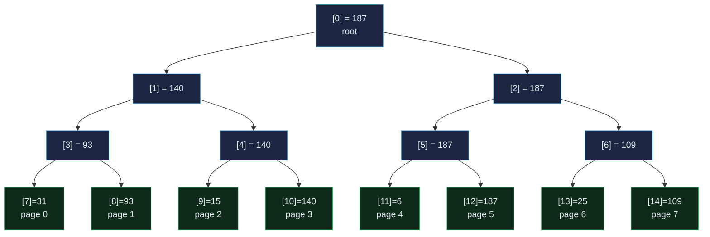
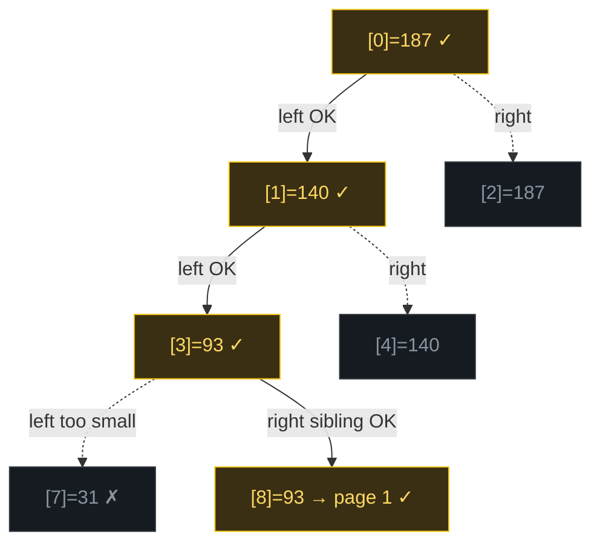
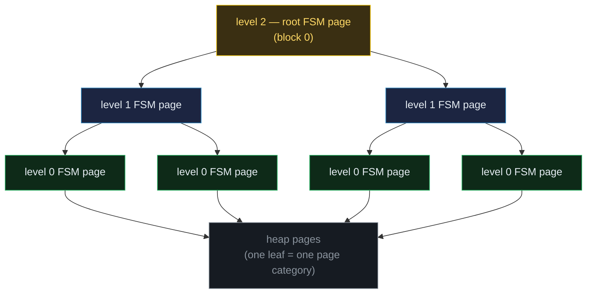

# The Free Space Map (FSM)

> A database-internals concept bundle. This guide is the static, rigorous half;
> every number below is printed by the ground-truth
> [`free_space_map.py`](./free_space_map.py) and pasted **verbatim** — never
> hand-computed. The playable companion is [`free_space_map.html`](./free_space_map.html).
>
> Lineage: **linear scan O(N) → FSM max-tree O(log N)**.

---

## 0. The one-paragraph idea

PostgreSQL never moves a tuple once it is placed, and every heap page is only
8 KB, so an `INSERT` must constantly find a *half-empty* page to write into.
Scanning the whole heap on every insert is unthinkable on a billion-row table.
The **Free Space Map (FSM)** turns that O(N) scan into an **O(log N)** tree
walk, while costing only **one byte per page**. It does this with two tricks:

1. **Quantize** each page's free space to a coarse **1-byte category** (0–255),
   so the whole map is compact.
2. **Stack** those bytes into a **max-tree**: every internal node holds the
   *best* (maximum) free space in its subtree. The **root** alone answers *"does
   **any** page have room?"* in O(1); a descent following only nodes that are big
   enough lands on a fitting page in O(log N).

> **Analogy — the warehouse with the shelves.** A table is a warehouse; each
> 8 KB page is a shelf. A new box (tuple) needs a shelf with enough empty room.
> The FSM is the *directory by the entrance*: each shelf's free space is rounded
> to a grade 0–255; the directory records the **best** grade per aisle, and the
> building entry records the best in the building. To seat a box, read the
> building entry first (know instantly if *any* shelf fits), then follow the
> path down to a fitting shelf.

---

## 1. Why it exists — the lineage

| Approach | Find a fitting page | "Does any page fit?" | Cost |
|---|---|---|---|
| **Linear scan** of every page | O(N) page reads | must scan all N | unusable on big tables |
| **Per-page byte array** (just the map) | still O(N) to *find* a fit | still O(N) | the map alone doesn't help search |
| **+ max-tree above the bytes (FSM)** | **O(log N)** tree walk | **O(1)** — read the root | one byte/page + ~one tree node/level |

The byte array by itself is necessary but not sufficient: you still have to
*scan* it to find a fitting page. The **max-tree** is what makes *search* fast,
because at every internal node you can discard the *entire* subtree whose best
is below your need.

> PostgreSQL 8.4+ stores each relation's FSM in its own extensible **`_fsm`
> fork** (a separate file), eliminating the old shared fixed-size map.

---

## 2. The category — free space → 1 byte

PostgreSQL folds each page's free space into a single byte using
**integer division by `BLCKSZ/256 = 32`** (verified against the source README
\[1] and docs \[2]):

```
category(fs)    = min(255, floor(fs / 32))      # free space  -> grade
cat_to_space(c) = c * 32   (c == 255 -> 8191)   # grade       -> min bytes it represents
```

So **category N ⟺ "at least N×32 bytes free"** — a bucket of width 32 bytes.
A page with 6000 B free is category `floor(6000/32) = 187`; one with 200 B is
category 6. The granularity is deliberately coarse: 256 buckets is plenty to
route inserts, and one byte per page keeps the whole map tiny.

> From `free_space_map.py` Section A — the 8 worked pages:

| page | free space (B) | category = floor(fs/32) | bucket >= (B) |
|------|----------------|--------------------------|--------------|
| 0    | 1000           | 31                       | 992          |
| 1    | 3000           | 93                       | 2976         |
| 2    | 500            | 15                       | 480          |
| 3    | 4500           | 140                      | 4480         |
| 4    | 200            | 6                        | 192          |
| 5    | 6000           | 187                      | 5984         |
| 6    | 800            | 25                       | 800          |
| 7    | 3500           | 109                      | 3488         |

---

## 3. The max-tree — the search accelerator

The categories are stacked into a **binary max-tree** stored as a flat
**heap-array** (root at index 0; children of `i` are `2i+1`, `2i+2`; parent is
`(i-1)//2`). **Every internal node = `max(left, right)`** — the best free space
in its entire subtree. The 8 pages above become a 15-byte tree:

> From `free_space_map.py` Section A:

```
        [0]=187 (root)
      [1]=140            [2]=187
    [3]= 93        [4]=140        [5]=187        [6]=109
  [7]= 31 (page 0)    [8]= 93 (page 1)    [9]= 15 (page 2)    [10]=140 (page 3)    [11]=  6 (page 4)    [12]=187 (page 5)    [13]= 25 (page 6)    [14]=109 (page 7)

Flat array  tree[15] = [187, 140, 187, 93, 140, 187, 109, 31, 93, 15, 140, 6, 187, 25, 109]
Root (tree[0]) = 187  =  MAX category in the whole table  = page 5's free space (the emptiest page).
```



**Key invariant:** each internal node is the max of its children. Therefore
`tree[0]` (the root) is the best free space category in the *whole table*.

---

## 4. Search — "I need 2000 bytes" → O(log N)

```
need_cat = floor(bytes_needed / 32)
```

1. **Read the root.** If `tree[0] < need_cat`, *no* page fits → PostgreSQL
   **extends the relation** by one page. This is the killer O(1) win.
2. **Descend**, always stepping to a child whose value `≥ need_cat` (prefer the
   *left* child = lower page number). Because each parent = `max(children)`, at
   least one child always qualifies once the parent does — the walk never
   dead-ends.

> From `free_space_map.py` Section B — descending for 2000 bytes (`need_cat = 62`):

```
1. need_cat = floor(2000 / 32) = 62
2. Read root tree[0] = 187 >= 62?  YES -> a fitting page exists.
3. Descend, always stepping to a child whose value >= 62 (prefer left = lower page #):
     node tree[0] = 187  (root)  OK
     node tree[1] = 140  (internal)  OK
     node tree[3] = 93   (internal)  OK
     node tree[8] = 93   (leaf -> page 1)  OK
4. RESULT: insert into page 1  (free space = 3000 B, category 93).
   Visited 4 tree nodes out of 15 total  -> O(log N), NOT O(N) page reads.
```



The path `[0]→[1]→[3]→[8]` shows the elegant case: at node `[3]` the **left**
child `[7]=31` is too small, so the search takes the **right sibling** `[8]=93`
— it never has to backtrack to the root, because the parent's `max` guarantee
means the right sibling *must* qualify.

> **Gold check** 🔗: `search(2000)` returns page 1 with category 93 ≥ 62, free
> space 3000 B ≥ 2000 B. Verified identically in Python (`Section B`) and in the
> browser (`free_space_map.html` → **check: OK**).

### ⚠️ Pitfall — the FSM is a *filter*, not an exact ledger

A category is a **floor** in 32-byte buckets. So the FSM guarantees the result
page has `≥ cat_to_space(need_cat)` bytes — *not* strictly `≥` what you asked.
A category-62 page could hold as little as `62×32 = 1984` B while you asked for
2000 B. PostgreSQL handles this correctly: after the FSM points at a candidate,
it **re-checks the real free space** on the page (`pd_upper - pd_lower`) before
inserting; if the map is stale or the page is now too full, it lowers that leaf
and retries (or extends). The FSM narrows the search; it does not lie about
*which* page, only approximates *how much*.

---

## 5. Update — insert shrinks a page, the max bubbles UP

When a tuple lands in a page, that page's free space drops. Update is the
mirror of search and is equally cheap:

1. Set the **leaf** to the new (smaller) category.
2. **Bubble up**: walk to the parent, recompute it as `max(children)`. If it
   **didn't change**, **stop** — no ancestor above can change either (its max
   depended only on this now-stable subtree).

> From `free_space_map.py` Section C — inserting a 3000-byte tuple in page 3
> (free space 4500 → 1500 B, category 140 → 46):

```
AFTER setting leaf and bubbling max up to the root (stop on no-change):
        [0]=187 (root)
      [1]= 93            [2]=187
    [3]= 93        [4]= 46        [5]=187        [6]=109
  [7]= 31 (page 0)    [8]= 93 (page 1)    [9]= 15 (page 2)    [10]= 46 (page 3)    ...

BUBBLE-UP path (nodes recomputed): [10, 4, 1]
  leaf tree[10] = 46
  tree[4] = max(tree[9]=15, tree[10]=46) = 46
  tree[1] = max(tree[3]=93, tree[4]=46) = 93  <- unchanged, STOP
```

Notice the root `[0]` **does not change** (page 5 still holds 6000 B = cat 187),
so the bubble-up correctly halts at `[1]` — that is the **early-stop
optimization**: we touch only the changed branch, never the whole tree.

> From `free_space_map.py` Section C — the consequence:

```
[check] every internal node == max(children) after update:  OK
need_cat(4000) = 125; search now returns page 5 (free space 6000 B, cat 187).
(before the update, the same query returned page 3; now its category 46 < 125
 so the tree correctly routes elsewhere.)
```

---

## 6. The array representation — a page is header + flat bytes

The tree is **not** a pile of pointers. A single **8 KB FSM page** is laid out
as a tiny header followed by the tree as a **flat byte array**, and all
navigation is **arithmetic** (the binary-heap trick) — there are zero per-child
pointers, so a search streams through contiguous bytes with perfect cache
locality.

```
parent(i)     = (i - 1) // 2
left_child(i) = 2*i + 1
right_child(i)= 2*i + 2
```

> From `free_space_map.py` Section D — the FSM page layout + the 15 bytes on disk:

```
+---------------------------+  byte 0
| FSMPageHeaderData         |     (one int: fp_next_slot, the
|   fp_next_slot (int32)    |      round-robin search hint)
+---------------------------+  byte ~8
| fp_nodes[0..14]           |     the max-tree as a flat byte
|   root, then internal,    |      array -- no child pointers!
|   then the 8 leaves       |
+---------------------------+

index:     0    1    2    3    4    5    6    7    8    9   10   11   12   13   14
value:   187   93  187   93   46  187  109   31   93   15   46    6  187   25  109
role:   root    .    .    .    .    .    .   L0   L1   L2   L3   L4   L5   L6   L7
(role: root | . = internal | Lk = leaf for page k)

Worked index math:
  page 0 -> leaf index 7, parent index 3 = max(tree[7]=31, tree[8]=93) = 93
  page 5 -> leaf index 12, parent index 5 = max(tree[11]=6, tree[12]=187) = 187
```

`fp_next_slot` is a **round-robin start hint**: instead of always starting the
search at the leftmost slot, PostgreSQL rotates the entry point so many
concurrent backends insert into *different* pages, reducing contention while
still filling pages roughly in order (good for OS prefetch). The math of search
is identical; only the entry point shifts.

---

## 7. Extension — millions of pages → a 3-level tree of FSM pages

One FSM page is itself an 8 KB page, so it can only hold a finite tree. To scale,
PostgreSQL applies the **same max-tree idea *across* pages** — a tree of trees,
stored in the `_fsm` fork:

- **Level 0** FSM pages: leaves are heap pages (one category each).
- **Level 1** FSM pages: leaves are the **root values** of level-0 pages.
- **Level 2** (root) FSM page: leaves are the root values of level-1 pages.

A page's root is *copied* into a leaf of its parent, so the cross-page invariants
are exactly the in-page ones: search walks **down** through the page tree,
update bubbles **up** the same way.

> From `free_space_map.py` Section E:

```
One FSM page is itself an 8 KB page. After the 8-byte header,
the tree array holds ~(BLCKSZ-header)/2 = 4092 leaf bytes,
so ONE FSM page tracks the free space of ~4092 heap pages.

fanout F ~ 4092 heap pages per FSM page
F^1 = 4,092  pages
F^2 = 16,744,464  pages
F^3 = 68,518,346,688  pages   >  2^32 - 1 = 4,294,967,295

-> THREE levels cover the maximum relation size (4092^3 = 68,518,346,688 > 2^32). Postgres fixes the tree height at 3.
```



**Storage cost:** one byte per heap page (the leaf) plus the upper levels, which
add only ~`1/F + 1/F² + …` overhead. A 1 TB table of ~130 M pages pays ~130 MB
for a complete, O(log N)-searchable free map.

---

## 8. Cheat sheet

| Quantity | Formula | Worked value |
|---|---|---|
| Page size | `BLCKSZ` | 8192 B |
| Categories | `FSM_CATEGORIES` | 256 (one byte) |
| Bucket width | `FSM_CAT_STEP = BLCKSZ/256` | 32 B |
| free space → category | `category(fs) = min(255, floor(fs/32))` | `floor(6000/32)=187` |
| category → min bytes | `cat_to_space(c) = c×32` (255→8191) | `187×32 = 5984` |
| bytes wanted → search grade | `need_cat(X) = floor(X/32)` | `floor(2000/32)=62` |
| Parent / children (heap-array) | `parent=(i-1)//2`, `L=2i+1`, `R=2i+2` | — |
| Internal node value | `max(left, right)` | root = best in table |
| Leaves per FSM page | `~(BLCKSZ-header)/2` | ~4092 |
| Levels for max relation | `F³ > 2³²` | 3 levels suffice |
| **Search** | descend to first leaf with cat ≥ need_cat | **O(log N)** |
| **Update** | set leaf, bubble max up, stop on no-change | **O(log N)** |
| **"Any page fits?"** | read root vs need_cat | **O(1)** |

---

## 9. Operations summary (the two primitives)

```
SEARCH(need_cat):                       UPDATE(page, new_cat):
  if root < need_cat: extend table        leaf = LEAFBASE + page
  node = root                            tree[leaf] = new_cat
  while node is internal:                node = parent(leaf)
    pick a child whose value ≥ need_cat  while node ≥ 0:
      (prefer left)                        v = max(left, right)
  return page at that leaf                 if tree[node] == v: STOP
                                            tree[node] = v
                                            node = parent(node)
```

Both touch only **one root-to-leaf path** — never the whole tree.

---

## 10. Sources

1. **PostgreSQL source** — `src/backend/storage/freespace/README`:
   *"the stored value is the free space divided by BLCKSZ/256 (rounding down)"*;
   *"a non-leaf node stores the max amount of free space on any of its children"*;
   *"(BLCKSZ − headers) / 2, or ~4000 with default BLCKSZ"*;
   *"three levels is enough … (4000³ > 2³²)"*.
2. **PostgreSQL docs** — §70.3 *Free Space Map* (`storage-fsm.html`):
   *"Within each FSM page is a binary tree, stored in an array with one byte per
   node. Each leaf node represents a heap page … In each non-leaf node, the max
   of its children's values is stored."*
3. *The Internals of PostgreSQL* (H. Suzuki, interdb.jp) — Heap / FSM structure.

---

### 🔗 Companion files & siblings

- **[`free_space_map.py`](./free_space_map.py)** — ground-truth reference impl (run: `python3 free_space_map.py`).
- **[`free_space_map_output.txt`](./free_space_map_output.txt)** — captured stdout, for auditing this guide without running.
- **[`free_space_map.html`](./free_space_map.html)** — interactive max-tree (search slider, click-to-insert, array toggle, **check: OK**).

> Part of the database-internals tutorial series. See [`HOW_TO_RESEARCH.md`](./HOW_TO_RESEARCH.md) for the bundle workflow.
