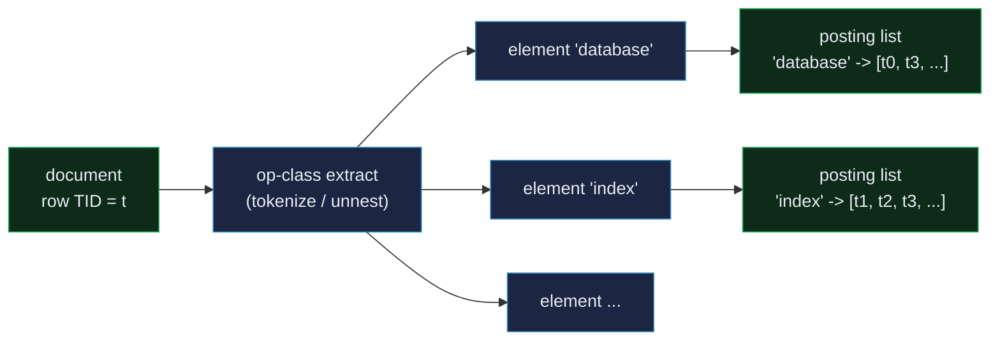
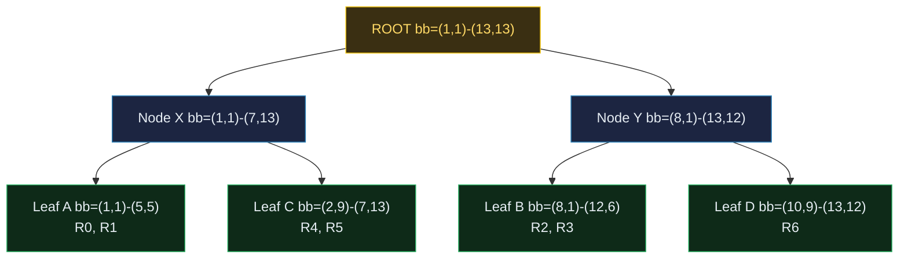

# GIN & GiST — Specialized Indexes for Non-Trivial Data

> A database-internals concept bundle. This guide is the static, rigorous half;
> every number below is printed by the ground-truth
> [`gin_gist.py`](./gin_gist.py) and pasted **verbatim** — never
> hand-computed. The playable companion is [`gin_gist.html`](./gin_gist.html).
>
> Lineage: **inverted files (centuries old / Zobel & Moffat 2006) → GIN
> (PostgreSQL, Bartunov & Sigaev ~2007)** for membership, and **R-tree
> (Guttman 1984) → GiST (Hellerstein, Naughton, Padiou 1995)** for overlap.

---

## 0. The one-paragraph idea

A B-tree assumes **one key per row** and a **total ordering**; a hash index
assumes **equality only**. A great deal of real data fits neither mould:

- a document has **many words** → *"which rows contain the word X?"*
- an array has **many elements** → *"which rows contain element X?"*
- a `jsonb` has **many paths** → *"which rows match this path?"*
- a geometry **overlaps** another → *"which rows intersect this box?"*
- a trigram is **close** to a string → *"which rows are similar to X?"*

PostgreSQL's two **generalized** access methods answer these with **opposite**
strategies:

- **GIN** (*Generalized Inverted Index*) builds the **inverted index** — a map
  from each **element** to the sorted list of row TIDs that contain it. Lookup
  is *"fetch the element's TID list."* This is exactly a search-engine index.
  **Fast lookup, slow insert** (every element must be threaded into its per-key
  posting tree). Used for `tsvector` (full-text), `array`, `jsonb`.
- **GiST** (*Generalized Search Tree*) is a balanced tree where every node
  stores a **union key** summarizing its descendants (e.g. the **bounding box**
  of all geometries below). A query **descends and prunes** any branch whose
  union key cannot match. **Moderate lookup, moderate insert.** Used for
  geometric/spatial, range types, trigram similarity (`pg_trgm`).

> **Analogy.** Want every book that mentions DATABASES:
> - **GIN** is the **card catalogue** — one card per word, listing every book
>   (by shelf number) containing it. *“database AND index”* = pull two cards,
>   find shelf numbers on **both** = a set **intersection**. Filing a new book
>   means writing a card for every word in it (slow insert); lookups are
>   instant.
> - **GiST** is the **map with fold-out regions** — each atlas page draws a
>   **bounding box** around everything beneath it. *“What is at (5,5)?”*
>   descends layer by layer, **skipping** whole subtrees whose box misses the
>   point.

---

## 1. Why they exist — the lineage

| Approach | Core idea | Best for | When to use |
|---|---|---|---|
| **B-tree** | one sorted key per row | ranges, `ORDER BY`, prefix | the default (see [`HEAP_VS_CLUSTERED.md`](./HEAP_VS_CLUSTERED.md)) |
| **Hash** | key → bucket, equality only | `col = v` | pure equality (see [`HASH_INDEX.md`](./HASH_INDEX.md)) |
| **GIN** | element → TID list (inverted) | membership in a set-valued column | full-text, array, jsonb |
| **GiST** | balanced tree of union keys | overlap / containment / distance | geometry, ranges, trigrams |

The lineage insight: GIN and GiST exist because **the query is not on the row's
single value but on a relationship between the row's (complex) value and a
query** — *"does this document contain word W"*, *"does this geometry contain
point P"*. A B-tree cannot index "contains point" (no total order on 2D); a
sequential scan is O(N). GIN trades insert speed for membership lookups; GiST
trades perfect precision for a prunable search.

> **Both are *frameworks*, not indexes.** GIN and GiST know nothing about text,
> geometry, or jsonb. An **operator class (op-class)** plugs in the type
> logic: GIN's op-class supplies **element extraction** (word splitting, array
> unnesting); GiST's op-class supplies **union**, **consistent** (predicate),
> and **penalty** (insertion heuristics). `tsvector_ops`, `array_ops`,
> `gist_geometry_ops`, `gist_trgm_ops` are op-classes; GIN/GiST are the engines.

---

## Part I — GIN (Generalized Inverted Index)

## 2. Build the inverted index — element → posting list

For each row, the op-class **extracts its elements** (words, array items, jsonb
paths). Each element is filed into its **posting list** — the sorted TIDs of
every row containing it. That map **is** the GIN structure. (PG keeps each
posting list in a tiny per-key **posting tree** when long, or inline when
short; a Python sorted list has the same abstract behaviour.)

> From `gin_gist.py` Section A — corpus of 5 documents, TIDs 0..4:

```
doc 0: "the database stores data in pages"
doc 1: "a btree index sorts keys for range queries"
doc 2: "full text search uses an inverted index"
doc 3: "the database index speeds up point lookups"
doc 4: "gin indexes arrays and jsonb documents"
```

> From `gin_gist.py` Section A — the inverted index (30 distinct elements):

| element    | TIDs        |        | element   | TIDs        |
|------------|-------------|--------|-----------|-------------|
| `a`        | `[1]`       |        | `index`     | `[1, 2, 3]` |
| `an`       | `[2]`       |        | `indexes`   | `[4]`       |
| `and`      | `[4]`       |        | `inverted`  | `[2]`       |
| `arrays`   | `[4]`       |        | `jsonb`     | `[4]`       |
| `btree`    | `[1]`       |        | `keys`      | `[1]`       |
| `data`     | `[0]`       |        | `lookups`   | `[3]`       |
| `database` | `[0, 3]`    |        | `pages`     | `[0]`       |
| `documents`| `[4]`       |        | `point`     | `[3]`       |
| `for`      | `[1]`       |        | `queries`   | `[1]`       |
| `full`     | `[2]`       |        | `range`     | `[1]`       |
| `gin`      | `[4]`       |        | `search`    | `[2]`       |
| `in`       | `[0]`       |        | `the`       | `[0, 3]`    |
|            |             |        | `up`        | `[3]`       |
|            |             |        | `uses`      | `[2]`       |

Read it: `database → [0, 3]` means docs 0 and 3 contain `database`; `index →
[1, 2, 3]`. Note `indexes` (doc 4) is a **different token** than `index` — our
literal tokenizer keeps them apart.

> **Pitfall — no stemming.** PostgreSQL full-text search **reduces** each token
> to a **lexeme** via a dictionary (e.g. snowball English: `"indexes" →
> "index"`, `"stores" → "store"`). Our `tokenize()` skips that step so the map
> is literal and transparent. To match PG behaviour, build a `tsvector`
> (`to_tsvector('english', doc)`) and index *that* — the structure below is
> identical, only the dictionary differs.



---

## 3. The AND query — intersect the posting lists

The defining GIN operation: *"rows containing ALL of {w₁, w₂, …}"* = the
**intersection** of the per-element posting lists. Because every list is sorted,
the intersection is a **linear merge** — O(sum of list lengths).

> From `gin_gist.py` Section B — query `['database', 'index']`:

```
Step 1 -- fetch each word's posting list:
  'database' -> TIDs [0, 3]
  'index' -> TIDs [1, 2, 3]

Step 2 -- INTERSECT the lists (sorted-list merge, linear in their size):
  [0, 3]  (intersection)  [1, 2, 3]
  = [3]

RESULT: docs [3] contain BOTH 'database' AND 'index'.
```

For an **OR** query you **union** instead — the per-element lookup is identical,
only the set combiner changes. A second query `['database', 'jsonb']` yields
`[]` (no document has both).

> **Gold check** 🔗: `GIN AND ['database','index'] == [3]`, and the
> **brute-force** scan of every document returns the same `[3]`. Verified in
> Python (`Section B`, `Section GOLD`) and recomputed live in the browser
> (`gin_gist.html` → **check: OK**).


---

## 4. Fast update — the pending list amortizes inserts

Inserting into a posting tree is **expensive**: find the element's tree, insert
the TID, rebalance. **Fast update** (`WITH (fastupdate = on)`, the default)
buffers inserts in an unsorted **pending list** — an O(1) **append** each — and
**flushes the whole batch** in one sorted pass when it reaches the threshold
(`gin_pending_list_limit`, default 4 MB). The win: **one flush costs one
posting-tree descent per *distinct* element in the batch — not one per entry.**

> From `gin_gist.py` Section C — inserting 6 `(element, tid)` pairs with
> repetition (`database`×3, `index`×2, `gin`×1), `pending_threshold = 4`:

| step | (element, tid) | action                         | pending after                              | main posting (after flush)             |
|------|----------------|--------------------------------|--------------------------------------------|----------------------------------------|
| 1    | (database,0)   | inserted(pending=1)            | (database,0)                               | (empty)                                |
| 2    | (index,1)      | inserted(pending=2)            | (database,0), (index,1)                    | (empty)                                |
| 3    | (database,2)   | inserted(pending=3)            | (database,0), (index,1), (database,2)      | (empty)                                |
| 4    | (gin,3)        | inserted+flush(batch=4,distinct=3) | (empty)                                | database:[0, 2], gin:[3], index:[1]    |
| 5    | (index,4)      | inserted(pending=1)            | (index,4)                                  | database:[0, 2], gin:[3], index:[1]    |
| 6    | (database,5)   | inserted(pending=2)            | (index,4), (database,5)                    | database:[0, 2], gin:[3], index:[1]    |

Watch **step 4**: the pending list hits 4 entries → **FLUSH**. The batch sorted
= `[(database,0),(database,2),(gin,3),(index,1)]` — 3 distinct elements →
**3 posting-tree descents**. A naive (`fastupdate=off`) insert would have done
**1 descent per entry = 4**.

> From `gin_gist.py` Section C — the cost comparison (6 inserts):

```
fastupdate=OFF : 6 posting-tree descents (1 per insert)
fastupdate=ON  : 3 descents (1 per distinct element per flush)
ratio          : 0.50x  (the win grows with element repetition + batch size)
```

**The price of fast update:** a lookup must scan **both** the main posting list
**and** the (unsorted, linear) pending list, because un-flushed entries live
only there:

```
query('database'): main=[0, 2] + pending=[5] -> [0, 2, 5]
query('index'):    main=[1]    + pending=[4] -> [1, 4]
query('gin'):      main=[3]    + pending=[]  -> [3]
```

Forcing a final flush (as `VACUUM` does) merges the remaining 2 entries — 2
distinct elements → 2 more descents, total 5. **Scaling:** if all 6 inserts had
been the **same** element, a flush would still cost **1 descent** (1 distinct
element). PG's `gin_pending_list_limit` caps the list so lookups never pay too
much linear pending scan.

> **Gold check** 🔗: the fast-update query (posting ∪ pending) returns the same
> TIDs as a directly-built index. Verified in Python (`Section C`).

### ⚠️ Pitfall — the pending list grows under heavy write load

Splits trigger on the **global** `gin_pending_list_limit`, not per-element. A
write-heavy workload can let the pending list balloon between flushes, so
lookups pay a growing linear pending scan (and results may be slightly stale
until a flush). If your workload is read-heavy after a bulk load, run
`VACUUM` (or set `gin_pending_list_limit` small) to force a flush and collapse
the pending list into the main index.

---

## Part II — GiST (Generalized Search Tree)

## 5. Build the tree — union keys (bounding boxes) nest

Insert 7 rectangles. The op-class groups them into **leaves** (here fanout 2),
and every internal node stores the **bounding box** of its children — the
**union key**. A parent's BB **always encloses** every child's BB. That nesting
is what lets a query prune whole subtrees.

> From `gin_gist.py` Section D — the rectangles (axis-aligned, inclusive bounds):

| rect | bounds            | area |
|------|-------------------|------|
| R0   | (1,1) – (3,3)     | 4    |
| R1   | (2,2) – (5,5)     | 9    |
| R2   | (8,1) – (11,4)    | 9    |
| R3   | (9,3) – (12,6)    | 9    |
| R4   | (2,9) – (4,12)    | 6    |
| R5   | (5,10) – (7,13)   | 6    |
| R6   | (10,9) – (13,12)  | 9    |

> From `gin_gist.py` Section D — the worked GiST tree (3 levels, fanout 2):

```
NODE Root  bb=(1,1)-(13,13)  (union of 2 children)
  -- child key=(1,1)-(7,13) ->
    NODE Node X  bb=(1,1)-(7,13)  (union of 2 children)
      -- child key=(1,1)-(5,5) ->
        LEAF Leaf A  bb=(1,1)-(5,5)   entries: R0 (1,1)-(3,3), R1 (2,2)-(5,5)
      -- child key=(2,9)-(7,13) ->
        LEAF Leaf C  bb=(2,9)-(7,13)  entries: R4 (2,9)-(4,12), R5 (5,10)-(7,13)
  -- child key=(8,1)-(13,12) ->
    NODE Node Y  bb=(8,1)-(13,12) (union of 2 children)
      -- child key=(8,1)-(12,6) ->
        LEAF Leaf B  bb=(8,1)-(12,6)  entries: R2 (8,1)-(11,4), R3 (9,3)-(12,6)
      -- child key=(10,9)-(13,12) ->
        LEAF Leaf D  bb=(10,9)-(13,12) entries: R6 (10,9)-(13,12)
```

> Real GiST insertion uses **op-class pick/split heuristics** (R-tree: least
> enlargement; R*-tree: overlap minimization). The `.py` **bulk-loads** a clean
> clustered tree so the **structure** (union keys) and the **query** (pruning) —
> the GiST essence — stay the focus. The node layout, union-key invariant, and
> descent are identical to a real R-tree.

> **Gold check** 🔗: every parent's BB encloses every child's BB (the nesting
> invariant). Verified across all 4 leaves + 2 internal nodes in Python
> (`Section D`).



---

## 6. The point query — descend, prune by union key

*"Which rectangles contain point P?"* At each node, test the union key: **does
this node's BB contain P?** `YES → descend`; `NO → PRUNE` the whole subtree
(skip every entry beneath it). This is the **consistent** predicate the op-class
supplies.

> From `gin_gist.py` Section E — query point **(4, 4)**:

| node    | kind | key/bb                | contains? | decision |
|---------|------|-----------------------|-----------|----------|
| Root    | node | (1,1) – (13,13)       | yes       | descend  |
| Node X  | node | (1,1) – (7,13)        | yes       | descend  |
| Leaf A  | leaf | (1,1) – (5,5)         | yes       | descend  |
| R0      | leaf | (1,1) – (3,3)         | no        | miss     |
| R1      | leaf | (2,2) – (5,5)         | yes       | **HIT**  |
| Leaf C  | leaf | (2,9) – (7,13)        | no        | **PRUNE**|
| Node Y  | node | (8,1) – (13,12)       | no        | **PRUNE**|

**RESULT: `['R1']`.** Visited **3 of 7** nodes; **PRUNED 2** — `Node Y` (and
both its leaves B, D) were never touched because `(4,4)` is outside Y's box.

> From `gin_gist.py` Section E — query point **(11, 11)** (the mirror case):

| node    | kind | key/bb                | contains? | decision |
|---------|------|-----------------------|-----------|----------|
| Root    | node | (1,1) – (13,13)       | yes       | descend  |
| Node X  | node | (1,1) – (7,13)        | no        | **PRUNE**|
| Node Y  | node | (8,1) – (13,12)       | yes       | descend  |
| Leaf B  | leaf | (8,1) – (12,6)        | no        | **PRUNE**|
| Leaf D  | leaf | (10,9) – (13,12)      | yes       | descend  |
| R6      | leaf | (10,9) – (13,12)      | yes       | **HIT**  |

**RESULT: `['R6']`.** Now `Node X` (and leaves A, C) are pruned — the tree
searches the **right** half instead.

> **Gold check** 🔗: both GiST point queries match a **brute-force** scan of all
> 7 rectangles — `(4,4)→['R1']`, `(11,11)→['R6']`. Verified in Python
> (`Section E`).

**Why this is fast:** a B-tree cannot index *"contains point"* at all (no total
ordering on 2D); a sequential scan is O(N). GiST visits only the nodes whose BB
contains the point — **O(log_F N + matches)** when the data is well-clustered.
The pruning is what turns O(N) into O(log N).

---

## Part III — Choosing

## 7. GIN vs GiST — pick by query shape

> From `gin_gist.py` Section F:

| Aspect               | GIN                              | GiST                                       |
|----------------------|----------------------------------|--------------------------------------------|
| Core idea            | inverted index: element -> TID list | search tree: node stores union key of children |
| Best for             | membership: 'row contains element X' | overlap/containment/distance: 'row overlaps X' |
| Typical types        | tsvector (FTS), array, jsonb     | geometry, range types, pg_trgm             |
| AND of many terms    | INTERSECT posting lists (cheap)  | n/a (each predicate is a separate descent) |
| Nearest-neighbour / distance | no                               | yes (KNN via priority queue over union keys) |
| Lookup cost          | O(log N) per element + TID-list merge | O(log_F N) descent + prune                 |
| Insert cost          | slow per-key (fastupdate amortizes) | moderate (find leaf, update union keys to root) |
| Fast-update / buffer | yes (pending list)               | no direct equivalent                       |
| Index size           | large (one entry per element)    | moderate (one entry per row + union keys)  |

**Rule of thumb:**

- **GIN** — the value is a **set/multiset** and you ask *"does it contain X?"*
  (words in a doc, items in an array, keys in `jsonb`). Build the inverted map;
  intersect posting lists for AND queries.
- **GiST** — the value has **geometry / overlap / distance** and you ask
  *"does it relate to X?"* (rect contains point, range overlaps range, trigram
  similar to string). Build the union-key tree; prune subtrees whose key cannot
  match.

> **Overlap — `pg_trgm`.** Trigram similarity can be indexed **either** way:
> `gin_trgm_ops` (one posting list per trigram) or `gist_trgm_ops` (union of
> trigrams). GIN is usually faster for **exact** trigram membership; GiST
> supports the **KNN** (`<->`) operator for *"most similar"* ordering. The
> choice is query-shape: `LIKE '%foo%'` → GIN; `ORDER BY col <-> 'foo'` → GiST.

Neither GIN nor GiST does what a B-tree does (sorted range scans, `ORDER BY`).
For equality only, a hash index is simpler (see [`HASH_INDEX.md`](./HASH_INDEX.md)).
Each access method is a **tool for a query shape**.

---

## 8. Cheat sheet

| Quantity | Formula | Worked value |
|---|---|---|
| GIN element extraction | op-class: tokenize / unnest / jsonb path | doc → words |
| Posting list | `sorted({ tid : element in row })` | `database → [0, 3]` |
| GIN AND | `∩ posting(wᵢ)` (sorted-list merge) | `[0,3] ∩ [1,2,3] = [3]` |
| GIN OR | `∪ posting(wᵢ)` | — |
| Pending insert | O(1) append | step 1-3 above |
| Flush descent cost | `D` descents = distinct elements in batch | batch of 4 → 3 descents |
| `gin_pending_list_limit` | caps pending list (default 4 MB) | tradeoff insert vs lookup |
| GiST union key | `bb = union(children.keys)` | `Node X = (1,1)-(7,13)` |
| Nesting invariant | `parent.bb ⊇ child.bb` | checked across all nodes |
| `contains_point` | `x0 ≤ x ≤ x1 ∧ y0 ≤ y ≤ y1` | `(4,4) in (2,2)-(5,5)` ✓ |
| GiST descent | if `¬consistent(bb, q)`: prune subtree | `(4,4)` prunes Node Y |
| GiST point lookup | O(log_F N + matches) | 3 of 7 nodes visited |
| KNN (`<->`) | priority queue over union keys | GiST only |

---

## 9. Operations summary (the primitives)

```
GIN_LOOKUP(element):                       GIN_AND(words):
  list = posting_tree[element]               lists = [posting(w) for w in words]
  list += pending_scan(element)  # if fast   intersect sorted lists (linear merge)
  return list

GIN_INSERT(element, tid):                   GIN_FLUSH():
  if fastupdate:                              batch = sort(pending)
    pending.append((element, tid))            distinct = {e for e,_ in batch}
    if len(pending) >= threshold: FLUSH()     for each distinct element:   # 1 descent
  else:                                           extend posting_tree[element]
    posting_tree[element].insert(tid)         pending = []

GIST_POINT_QUERY(node, P):
  if not consistent(node.bb, P): return []    # PRUNE whole subtree
  if node.is_leaf:
    return [entry for entry in node if contains(entry.rect, P)]
  else:
    return concat(GIST_POINT_QUERY(child, P) for child in node)
```

---

## 10. Sources

1. **PostgreSQL source** — `src/backend/access/gin/` (gininsert.c, ginentrypage.c,
   ginget.c, the fast-update pending list) and `src/backend/access/gist/`
   (gist.c, gistget.c, gistutil.c, gistsplit.c).
2. **PostgreSQL docs** — §70 *GIN Indexes* (`storage-gin.html`), §71 *GiST
   Indexes* (`storage-gist.html`), §11.2 *Index Types* (`indexes-types.html`),
   §12 *Full Text Search*, and `gin_pending_list_limit`
   (`functions-admin.html`).
3. **J. M. Hellerstein, J. F. Naughton, P. Padiou**, *Generalized Search Trees
   for Secondary Storage*, SIGMOD 1995 — the GiST paper (generalizes R-trees to
   any op-class supplying union + consistent).
4. **A. Guttman**, *R-trees: A Dynamic Index Structure for Spatial Searching*,
   SIGMOD 1984 — the spatial op-class archetype GiST generalizes.
5. **J. Zobel, A. Moffat**, *Inverted Files for Text Search Engines*, ACM
   Computing Surveys 38(2), 2006 — the inverted-index survey underlying GIN.
6. **O. Bartunov & T. Sigaev** — the PostgreSQL GIN and GiST contributions
   (the `pg_trgm`, `intarray`, `hstore`, and `btree_gist` extensions).

---

### 🔗 Companion files & siblings

- **[`gin_gist.py`](./gin_gist.py)** — ground-truth reference impl (run: `python3 gin_gist.py`).
- **[`gin_gist_output.txt`](./gin_gist_output.txt)** — captured stdout, for auditing this guide without running.
- **[`gin_gist.html`](./gin_gist.html)** — interactive: live GIN inverted-index AND query + GiST spatial tree with click-to-query pruning (**check: OK**).
- 🔗 **[`HASH_INDEX.md`](./HASH_INDEX.md)** — the equality-only access method (the third specialized index).
- 🔗 **[`HEAP_VS_CLUSTERED.md`](./HEAP_VS_CLUSTERED.md)** — the B-tree side of the comparison (sorted ranges, `ORDER BY`).
- 🔗 **[`BTREE.md`](./BTREE.md)** — the B-tree mechanics GIN posting trees and GiST nodes are built on.
- 🔗 **[`LSM_TREE.md`](./LSM_TREE.md)** — another batched-flush structure (the GIN pending list is a mini LSM).

> Part of the database-internals tutorial series. See
> [`HOW_TO_RESEARCH.md`](./HOW_TO_RESEARCH.md) for the bundle workflow. Every
> number in this guide traces to a `> From gin_gist.py Section X:` callout —
> reproduce any of them with `python3 gin_gist.py`.
