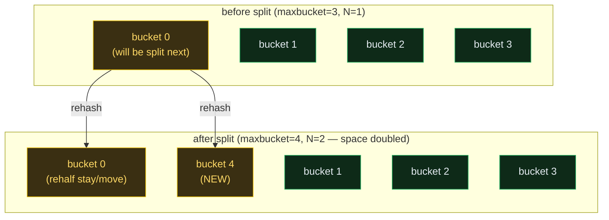

# The Hash Index

> A database-internals concept bundle. This guide is the static, rigorous half;
> every number below is printed by the ground-truth
> [`hash_index.py`](./hash_index.py) and pasted **verbatim** — never
> hand-computed. The playable companion is [`hash_index.html`](./hash_index.html).
>
> Lineage: **static hash (full rehash on resize) → linear hashing (Litwin 1980 /
> Larson 1978, one bucket at a time) → PostgreSQL 10+ crash-safe WAL-logged hash**.

---

## 0. The one-paragraph idea

A **hash index** gives **O(1)** point lookups on equality (`col = v`) by hashing
the key to a 32-bit value and routing to a numbered **bucket**. The price: it
**cannot** do range scans, `ORDER BY`, or prefix matches — those need a B-tree
(see [`HEAP_VS_CLUSTERED.md`](./HEAP_VS_CLUSTERED.md)). The hard part of a hash
index is **growing it**: if you fix the bucket count at N, the table fills up and
you must rebuild the whole thing with 2N buckets — an O(N) freeze that is
unacceptable on a live database. PostgreSQL solves this with **linear hashing**
(Litwin 1980): grow by **one bucket at a time**, rehashing only the items of the
**victim** bucket each split — every other bucket is untouched, so insert stays
**amortized O(1)** forever.

> **Analogy — the coat-check room.** A hash index is a coat-check room with
> numbered hooks. To find Alice's coat you do **not** scan every hook — you hash
> `"alice" → hook #7` and look there only. Static hashing fixes the number of
> hooks forever, so when the room fills you rebuild the *entire wall* with 2×
> hooks and rehang every coat (one giant freeze). Linear hashing adds **one hook
> at a time**: when crowded, take the "next hook in line" (the split pointer),
> add a new hook at the end, and **rehang only the coats on that one old hook** —
> about half move to the new hook, the rest stay. Every other hook is untouched.

---

## 1. Why it exists — the lineage

| Approach | Resize cost | Find a key | When to use |
|---|---|---|---|
| **Static hash** | full O(N) rehash of every key | O(1) avg | only when final size is known |
| **Extendible hashing** (Fagin 1979) | double a *directory* (cheap), no bucket shuffle | O(1) avg | some KV stores; *not* PG |
| **Linear hashing** (Litwin 1980, Larson 1978) | **add ONE bucket, rehash ONE bucket** | O(1) avg | **PostgreSQL hash index** |
| **B-tree** | splits a leaf, never a global resize | O(log N) | ranges, ORDER BY, PK (the default) |

The lineage insight: a hash index's *lookup* has always been O(1); the genuine
research problem was *resizing without freezing*. Linear hashing's cleverness is
that the split pointer makes the "next bucket to split" a deterministic,
sequential walk — so splits spread their cost evenly across inserts.

> **PostgreSQL 10 (2017) made hash indexes crash-safe.** Before v10 the hash
> index had incomplete WAL logging, so a crash could corrupt it; the docs warned
> "prefer B-tree." v10 added full WAL logging and removed the warning. Hash
> indexes are now production-usable but remain rare — B-trees cover most cases.

---

## 2. The hash function — every key becomes a 32-bit `uint32`

PostgreSQL funnels every key type (int, text, bytea, …) through
**`hash_any()`** (`src/backend/access/hash/hashfunc.c`, Jenkins lookup3) and
gets back a 32-bit `uint32`. The index never routes on the raw key — only on the
hash. For this tutorial we use **FNV-1a 32-bit** in place of `hash_any`: same
output range, same avalanche/uniformity — only the *bucket math* below matters,
and that is byte-identical to PG.

> From `hash_index.py` Section A — the 10 worked keys and their hashes:

| key       | hashvalue (FNV-1a) | hashvalue (hex) |
|-----------|--------------------|-----------------|
| alice     |         2267157479 | 0x872213e7        |
| bob       |         2261164244 | 0x86c6a0d4        |
| carol     |         1728614162 | 0x67088f12        |
| dave      |         3496789471 | 0xd06cc5df        |
| eve       |         1537336773 | 0x5ba1e5c5        |
| frank     |         4094485955 | 0xf40ce5c3        |
| grace     |         2621995627 | 0x9c487a6b        |
| heidi     |         1859349638 | 0x6ed36c86        |
| ivan      |         2539416321 | 0x975c6b01        |
| judy      |         2588971191 | 0x9a5090b7        |


---

## 3. The bucket routing — `high_mask` + `low_mask` (the linear-hashing trick)

Bucket selection is **two bit-ANDs** (PG `_hash_hashkey2bucket`, `hashutil.c`):

```
bucket = hashvalue & high_mask
if bucket > maxbucket: bucket &= low_mask     # fall back to the "old" address space
```

Two masks exist because the address space is **always mid-doubling**:

- **`high_mask = 2^(N+1) − 1`** — the *new* address space (post-doubling target).
- **`low_mask  = 2^N − 1`** — the *old* address space (pre-doubling).
- **`maxbucket`** — the highest bucket that actually **exists** right now.

A hash that lands in a bucket number `> maxbucket` is for a bucket that doesn't
exist yet — so you mask it back down to the old space, where a real bucket is
waiting. This is what lets the array grow *incrementally*: most buckets use the
new (larger) space, the not-yet-split ones keep using the old (smaller) one.

> From `hash_index.py` Section A — routing at a mid-growth state
> (`maxbucket=5, low_mask=3, high_mask=7`):

| key       | hashvalue & high_mask | > maxbucket? | final bucket (after & low_mask) |
|-----------|-----------------------|--------------|--------------------|
| alice     |                     7 | yes -> & 0x3 | 3                  |
| bob       |                     4 | no           | 4                  |
| carol     |                     2 | no           | 2                  |
| dave      |                     7 | yes -> & 0x3 | 3                  |
| eve       |                     5 | no           | 5                  |
| frank     |                     3 | no           | 3                  |
| grace     |                     3 | no           | 3                  |
| heidi     |                     6 | yes -> & 0x3 | 2                  |
| ivan      |                     1 | no           | 1                  |
| judy      |                     7 | yes -> & 0x3 | 3                  |

**Read it:** keys whose `& high_mask` is 6 or 7 land in buckets that don't exist
yet (maxbucket=5), so they fall back to `& 3` — they share a bucket with the
0..3 keys until a future split creates their real home.

---

## 4. Linear hashing — grow ONE bucket per split

Each split does **exactly** this (PG `_hash_splitbucket`, `hashpage.c`):

```
new_bucket = maxbucket + 1
victim     = new_bucket & low_mask            # using the OLD low_mask
if new_bucket > high_mask:                    # crossed a power of two
    low_mask  = high_mask                     #   the old "new" becomes the new "old"
    high_mask = new_bucket | low_mask         #   address space doubles
maxbucket = new_bucket
rehash every tuple in `victim`: each goes to bucket_of(key) under the NEW masks
```

The address space (`high_mask + 1`) **doubles only when `maxbucket+1` crosses a
power of two** — i.e. once every `2^N` splits. Between doublings, splits just
extend the bucket count by one and rehash one old bucket.

> From `hash_index.py` Section B — the first 9 splits:

| split # | maxbucket | low_mask | high_mask | # buckets | victim (new_bucket & old low_mask) | address space 2^(N+1) |
|---------|-----------|----------|-----------|-----------|-------------------------------------|------------------------|
| 1       | 1         | 0        | 1         | 2         | new=1, victim=0                  | x2 ->    2^1-1 |
| 2       | 2         | 1        | 3         | 3         | new=2, victim=0                  | x2 ->    2^2-1 |
| 3       | 3         | 1        | 3         | 4         | new=3, victim=1                  |          2^2-1 |
| 4       | 4         | 3        | 7         | 5         | new=4, victim=0                  | x2 ->    2^3-1 |
| 5       | 5         | 3        | 7         | 6         | new=5, victim=1                  |          2^3-1 |
| 6       | 6         | 3        | 7         | 7         | new=6, victim=2                  |          2^3-1 |
| 7       | 7         | 3        | 7         | 8         | new=7, victim=3                  |          2^3-1 |
| 8       | 8         | 7        | 15        | 9         | new=8, victim=0                  | x2 ->    2^4-1 |
| 9       | 9         | 7        | 15        | 10        | new=9, victim=1                  |          2^4-1 |

The victim sequence `0, 0, 1, 2, 0, 3, 4, 1, 2, …` is **Litwin's split pointer
`p` made implicit by the masks** — round-robin through the existing buckets in
the order they'll be split next. Every `2^N` splits the pointer wraps and the
address space doubles.



> **Gold check** 🔗: over 50 splits, `low_mask == 2^N−1`, `high_mask == 2^(N+1)−1`,
> and `low_mask ≤ maxbucket ≤ high_mask` always hold. Verified in Python
> (`Section B`) and in the browser (`hash_index.html` → **check: OK**).

### ⚠️ Pitfall — overflow chains can grow long *between* splits

Splits trigger on the *overall* load factor, not on a single bucket's depth. A
hot bucket (many keys hashing to it) can pile up a long overflow chain **even
while the global load factor is low** — splits eventually relieve it, but in the
meantime lookups on that bucket pay O(chain length). This is why PG caps a
bucket's overflow pages and forces a split if one bucket grows too deep.

---

## 5. Insert — buckets fill, chains form, splits fire

When a key arrives: route to its bucket; if the primary page has room, place it;
otherwise **append an overflow page** to the chain. After every insert, if the
**load factor** (items / (buckets × primary_capacity)) exceeds the fillfactor
(0.75), trigger one split.

> From `hash_index.py` Section C — inserting 10 deterministic keys
> (`primary_capacity=4`, `split_threshold=0.75`):

| step | key     | value | hashvalue  | bucket | action            | post-state                                                   |
|------|---------|-------|------------|--------|-------------------|--------------------------------------------------------------|
| 1    | alice   | 101   | 0x872213e7 | 0      | inserted          | maxbucket=0  low_mask=0  high_mask=0  buckets=1  items=1  load_factor=0.250  splits=0 |
| 2    | bob     | 102   | 0x86c6a0d4 | 0      | inserted          | maxbucket=0  low_mask=0  high_mask=0  buckets=1  items=2  load_factor=0.500  splits=0 |
| 3    | carol   | 103   | 0x67088f12 | 0      | inserted          | maxbucket=0  low_mask=0  high_mask=0  buckets=1  items=3  load_factor=0.750  splits=0 |
| 4    | dave    | 104   | 0xd06cc5df | 0      | inserted+split    | maxbucket=1  low_mask=0  high_mask=1  buckets=2  items=4  load_factor=0.500  splits=1 |
| 5    | eve     | 105   | 0x5ba1e5c5 | 1      | inserted          | maxbucket=1  low_mask=0  high_mask=1  buckets=2  items=5  load_factor=0.625  splits=1 |
| 6    | frank   | 106   | 0xf40ce5c3 | 1      | inserted          | maxbucket=1  low_mask=0  high_mask=1  buckets=2  items=6  load_factor=0.750  splits=1 |
| 7    | grace   | 107   | 0x9c487a6b | 1      | overflow+split    | maxbucket=2  low_mask=1  high_mask=3  buckets=3  items=7  load_factor=0.583  splits=2 |
| 8    | heidi   | 108   | 0x6ed36c86 | 2      | inserted          | maxbucket=2  low_mask=1  high_mask=3  buckets=3  items=8  load_factor=0.667  splits=2 |
| 9    | ivan    | 109   | 0x975c6b01 | 1      | inserted          | maxbucket=2  low_mask=1  high_mask=3  buckets=3  items=9  load_factor=0.750  splits=2 |
| 10   | judy    | 110   | 0x9a5090b7 | 1      | inserted+split    | maxbucket=3  low_mask=1  high_mask=3  buckets=4  items=10  load_factor=0.625  splits=3 |

Watch **step 7**: `grace` lands in bucket 1 which is already full → a new
**overflow page** is created (status `overflow`), and the load factor crosses
0.75 → a **split** fires immediately after (`+split`). Watch **step 10**: the
insert pushes load_factor past 0.75 again; the split doubles the address space
(`low_mask 1→3` because we crossed 3 → 4).

> Final bucket layout after all 10 inserts:

```
bucket 0  (chain=0, pages=1)
    primary  [1/4]:  bob=102
bucket 1  (chain=0, pages=1)
    primary  [2/4]:  eve=105, ivan=109
bucket 2  (chain=0, pages=1)
    primary  [2/4]:  carol=103, heidi=108
bucket 3  (chain=1, pages=2)
    primary  [4/4]:  alice=101, dave=104, frank=106, grace=107
    ovfl1    [1/4]:  judy=110
```

Bucket 3 has a **collision cluster** (alice, dave, frank, grace, judy all route
there) → its primary page is full and `judy` spilled to an **overflow page**.
This is the realistic cost of hashing: even with a uniform hash function,
*some* buckets collide.

---

## 6. Lookup — hash → bucket → primary → overflow chain

```
1. h       = hash_any(key)
2. bucket  = h & high_mask ; if > maxbucket: bucket &= low_mask
3. scan bucket's primary page; if not found, walk the overflow chain
```

The chain walk is **linear** — tuples in a bucket are **not sorted** (unlike a
B-tree leaf), so a miss must scan the whole chain.

> From `hash_index.py` Section D — lookup of `judy` (which lives on overflow
> page 1 of bucket 3):

```
Look up 'judy' (expected value 110):

  1. hashvalue        = hash_any('judy') = 0x9a5090b7
  2. bucket           = 0x9a5090b7 & high_mask (0x00000003) = 3
     > maxbucket (3)? NO -> bucket stays 3
  3. scan bucket 3:
        PRIMARY: alice=101, dave=104, frank=106, grace=107
        OVERFLOW page 1: judy=110   <-- FOUND here

  RESULT: value=110, found on page 2 of bucket 3.
  COST:   scanned 2 page(s); chain length = 1.
```

> **Gold check** 🔗: `lookup('alice') == 101`, `hash=0x872213e7`, `bucket=3`,
> `page=1`, `pages_scanned=1` — verified identically in Python (`Section D`,
> `Section GOLD`) and recomputed live in the browser
> (`hash_index.html` → **check: OK**).

---

## 7. Split — rehash the victim; some tuples stay, some move

When a split fires, the **victim** bucket (= `new_bucket & old low_mask`) is the
one whose tuples *might* now belong in the new bucket. Rehash each tuple under
the **new** masks: about half stay in the victim, the other half move to
`new_bucket`. **Every other bucket is untouched** — that is the linear-hashing
promise.

> From `hash_index.py` Section E — the next split creates bucket 4 and rehashes
> bucket 0 (the only item, `bob`, moves to bucket 4):

```
BEFORE split:
maxbucket=3  low_mask=1  high_mask=3  buckets=4  items=10  load_factor=0.625  splits=3

bucket 0  (chain=0, pages=1)
    primary  [1/4]:  bob=102
... (buckets 1, 2, 3 unchanged) ...

Victim bucket 0 tuples and where they will land after the split:
| key   | hashvalue  | new bucket (after masks update) | moves? |
|-------|------------|----------------------------------|--------|
| bob    | 0x86c6a0d4 | 4                                | moves to 4           |

AFTER split (split_count=4):
maxbucket=4  low_mask=3  high_mask=7  buckets=5  items=10  load_factor=0.500  splits=4
(maxbucket 3->4 crossed the previous high_mask, so the address space DOUBLED: low_mask 3, high_mask 7.)

bucket 0  (chain=0, pages=1)
    primary  [0/4]:  (empty)
... (buckets 1, 2, 3 unchanged) ...
bucket 4  (chain=0, pages=1)
    primary  [1/4]:  bob=102

Rehash summary: of the 1 tuples in old bucket 0, 1 moved to new bucket 4, 0 stayed.
```

The address space doubled because `maxbucket 3 → 4` crossed the previous
`high_mask = 3` (a power of two minus 1). Bucket 0 is now empty — overflow pages
from before the split would also be reclaimed (here there were none).

> **Gold check** 🔗: all 10 keys remain findable after the split — no data lost,
> no routing drift. Verified in Python (`Section E`).

---

## 8. Delete — lazy, no merge

A delete clears the tuple slot **only**. Overflow pages are **not** freed, the
bucket is **not** merged with its split twin, and the masks are **not** shrunk.
Reclamation is deferred to **VACUUM**.

> From `hash_index.py` Section F — deleting `alice` from bucket 3:

```
BEFORE delete:
bucket 3  (chain=1, pages=2)
    primary  [4/4]:  alice=101, dave=104, frank=106, grace=107
    ovfl1    [1/4]:  judy=110

delete('alice') -> found=True

AFTER delete:
bucket 3  (chain=1, pages=2)
    primary  [3/4]:  dave=104, frank=106, grace=107
    ovfl1    [1/4]:  judy=110
```

**Why lazy?** Two reasons:

1. **O(1) deletes.** No merge means no chain rewriting, no page I/O beyond the
   one tuple's slot.
2. **No fight with concurrent splits.** A split might be rehashing this very
   bucket on another backend; lazy delete avoids the locking complexity of
   merging a chain that someone else is walking. VACUUM cleans up later, when
   the chain is quiescent.

---

## 9. Hash vs B-tree — pick by query shape

| Operation / property                  | HASH index          | BTREE index               | Use                       |
|---------------------------------------|---------------------|--------------------------|---------------------------|
| Point equality  (col = v)             | O(1) avg            | O(log N)                 | HASH (faster, smaller)    |
| Range scan  (col BETWEEN a AND b)     | NOT SUPPORTED       | O(log N + k)             | BTREE (hash cannot order) |
| ORDER BY col                          | NOT SUPPORTED       | O(N log N) sort avoided  | BTREE (index is pre-sorted) |
| Prefix match  (col LIKE 'abc%')       | NOT SUPPORTED       | O(log N)                 | BTREE                     |
| UNIQUE / PRIMARY KEY enforcement      | SUPPORTED           | SUPPORTED (default)      | BTREE (PG default for PK) |
| Index size                            | ~hash + TID only    | key + TID + pointers     | HASH (~half the size)     |
| Crash safety (WAL)                    | PG 10+ (2017)       | always                   | both safe; pre-10 hash was not |
| Autovacuum / bloat reclaim            | supported           | supported                | tie                       |

**Rule of thumb:**

- **HASH** — pure equality lookups on a column you never sort or range on
  (session-token UUIDs, hash-partition keys, URL hashes). Smaller index, O(1).
- **BTREE** — everything else (ranges, `ORDER BY`, inequality joins, prefix
  matches, default `PRIMARY KEY`). The default; reach for it unless you can
  articulate *why* hash is better.

> 🔗 For the B-tree side of this comparison — leaf pages, range scans, and the
> `h = ⌈log_F(N/F)⌉` height math — see [`HEAP_VS_CLUSTERED.md`](./HEAP_VS_CLUSTERED.md).

---

## 10. PostgreSQL 10+ — the WAL-logging fix (crash safety)

Pre-10 hash indexes were **unlogged**: their pages were not written to the
write-ahead log, so a crash could leave the index inconsistent with the heap
(tuples present in the heap but missing or misrouted in the index). The PG 10
release (2017) added:

- **Full WAL logging** of every insert, split, and overflow-page extension
  (`hashinsert.c`, `hashpage.c`). Recovery replays them exactly like B-tree
  edits.
- **Crash-safe splits** — the metapage (`hashm_maxbucket`, masks) is logged
  atomically with the bucket-page writes, so a crash mid-split recovers to a
  consistent state.
- The old documentation warning *"hash index operations are not WAL-logged, so
  hash indexes might be unrecoverable after a crash"* was **removed**.

The other PG hash-index details (overflow-page reclamation by VACUUM, the
`hashm_spares[]` array that records overflow-page counts per split level, the
`_hash_getnewbucket` allocation trick) are bookkeeping around the same linear-
hashing skeleton shown here.

---

## 11. Cheat sheet

| Quantity | Formula | Worked value |
|---|---|---|
| Hash | `hash_any(key)` (we use FNV-1a 32-bit) | `alice → 0x872213e7` |
| Bucket routing | `bucket = h & high_mask; if > maxbucket: bucket &= low_mask` | `0x872213e7 & 7 = 7 > 5 → & 3 = 3` |
| `low_mask` | `2^N − 1` (old address space) | N=2 → `3` |
| `high_mask` | `2^(N+1) − 1` (new address space) | N=2 → `7` |
| `maxbucket` | highest existing bucket number | grows by 1 per split |
| Address space doubling | when `maxbucket+1 > high_mask` | at splits 1, 2, 4, 8, … |
| Split victim | `new_bucket & old low_mask` | `4 & 1 = 0` |
| Load factor | `items / (buckets × primary_capacity)` | `7 / (3 × 4) = 0.583` |
| Split trigger | `load_factor > fillfactor` (PG default 0.75) | 0.583 < 0.75 → no split |
| Overflow chain | primary full → new overflow page appended | bucket 3 after 4th collision |
| **Point lookup** | hash + 2 ANDs + linear chain scan | **O(1) avg, O(chain) worst** |
| **Insert** | place + maybe overflow + maybe split | **amortized O(1)** |
| **Delete** | clear tuple slot, no merge | **O(1), lazy** |
| **Range scan** | **not possible** | use B-tree |

---

## 12. Operations summary (the four primitives)

```
LOOKUP(key):                          INSERT(key, value):
  h = hash_any(key)                     b = bucket_of(key)
  b = h & high_mask                     if key in bucket b: update; return
  if b > maxbucket: b &= low_mask       place in first page with room
  for page in bucket b.chain:           if no room: append overflow page
    for (k,v) in page:                  if load_factor > fillfactor: SPLIT()
      if k == key: return v

SPLIT():                              DELETE(key):
  new = maxbucket + 1                    b = bucket_of(key)
  victim = new & low_mask                for page in bucket b.chain:
  if new > high_mask:                      for (k,v) in page:
    low_mask  = high_mask                    if k == key: del; return
    high_mask = new | low_mask          # NO merge, NO shrink -- VACUUM later
  maxbucket = new
  rehash victim's tuples (some stay, some move to `new`)
```

Lookup and insert touch only **one bucket's chain** plus (on insert) at most
**one** extra bucket during a split — never the whole index.

---

## 13. Sources

1. **PostgreSQL source** — `src/backend/access/hash/`:
   `hashfunc.c` (`hash_any`, Jenkins lookup3),
   `hashutil.c` (`_hash_hashkey2bucket`),
   `hashpage.c` (`_hash_splitbucket`, `_hash_addovflpage`, `_hash_getnewbucket`),
   `hashinsert.c` (`_hash_doinsert`);
   and `src/include/access/hash.h` (`HashMetaPageData`: `hashm_maxbucket`,
   `hashm_lowmask`, `hashm_highmask`, `hashm_ffactor`, `hashm_spares[]`).
2. **PostgreSQL docs** — §11.2 *Index Types* (`indexes-types.html`, the hash
   section) and §73.1 *Hash Indexes* (`storage-hash-index.html`).
3. **W. Litwin**, *Linear hashing: a new tool for file and table addressing*,
   VLDB 1980 — the original linear-hashing paper.
4. **P.-A. Larson**, *Dynamic hashing*, Information Processing Letters 8(1),
   1978 — the independent discovery.
5. **R. Fagin, J. Nievergelt, N. Pippenger, H. R. Strong**, *Extendible hashing
   — a fast access method for dynamic files*, ACM TODS 4(3), 1979 — the
   alternative (directory-doubling) scheme PG does *not* use.
6. **PostgreSQL 10 release notes (2017)** — *"Hash indexes are now WAL-logged
   and crash-safe."*

---

### 🔗 Companion files & siblings

- **[`hash_index.py`](./hash_index.py)** — ground-truth reference impl (run: `python3 hash_index.py`).
- **[`hash_index_output.txt`](./hash_index_output.txt)** — captured stdout, for auditing this guide without running.
- **[`hash_index.html`](./hash_index.html)** — interactive hash table (slider for # keys, live splits, overflow chains, load-factor gauge, **check: OK**).
- 🔗 **[`HEAP_VS_CLUSTERED.md`](./HEAP_VS_CLUSTERED.md)** — the B-tree side of the §9 comparison.
- 🔗 **[`FREE_SPACE_MAP.md`](./FREE_SPACE_MAP.md)** — another PG O(log N) lookup structure (max-tree).
- 🔗 **[`OVERFLOW_PAGES.md`](./OVERFLOW_PAGES.md)** — overflow chains in heap pages (TOAST-style).
- 🔗 **[`SLOTTED_PAGE.md`](./SLOTTED_PAGE.md)** — the 8 KB page layout that bucket pages use.

> Part of the database-internals tutorial series. See
> [`HOW_TO_RESEARCH.md`](./HOW_TO_RESEARCH.md) for the bundle workflow. Every
> number in this guide traces to a `> From hash_index.py Section X:` callout —
> reproduce any of them with `python3 hash_index.py`.
