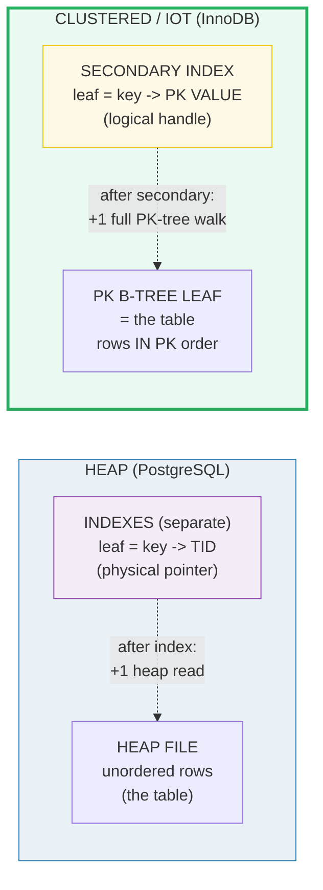
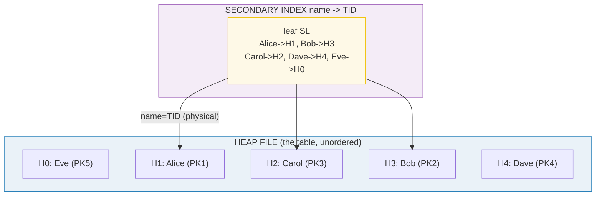
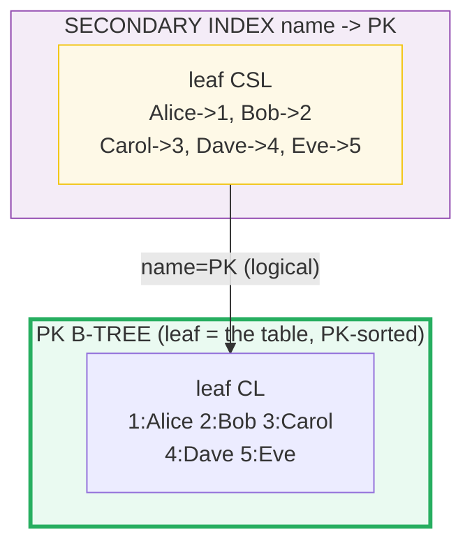
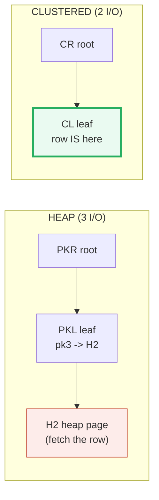
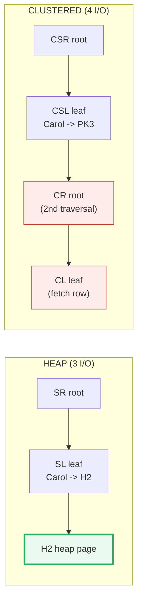
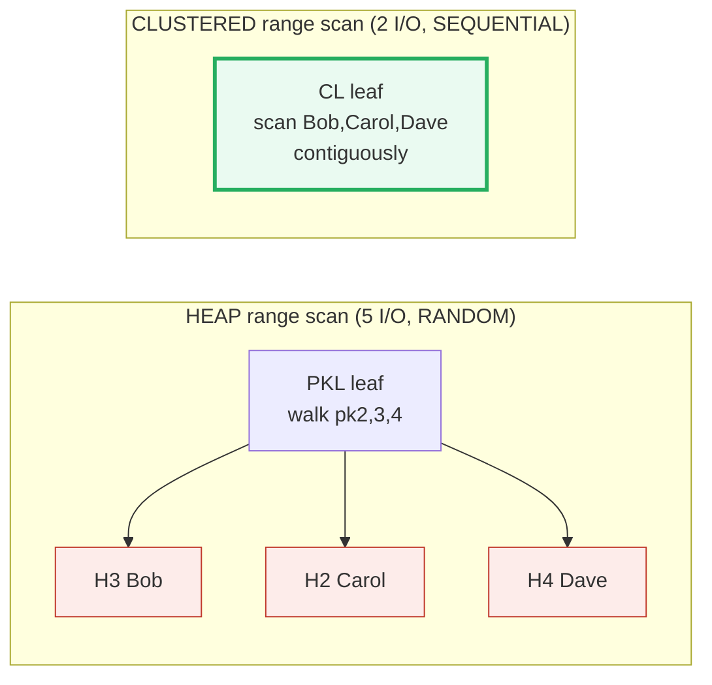
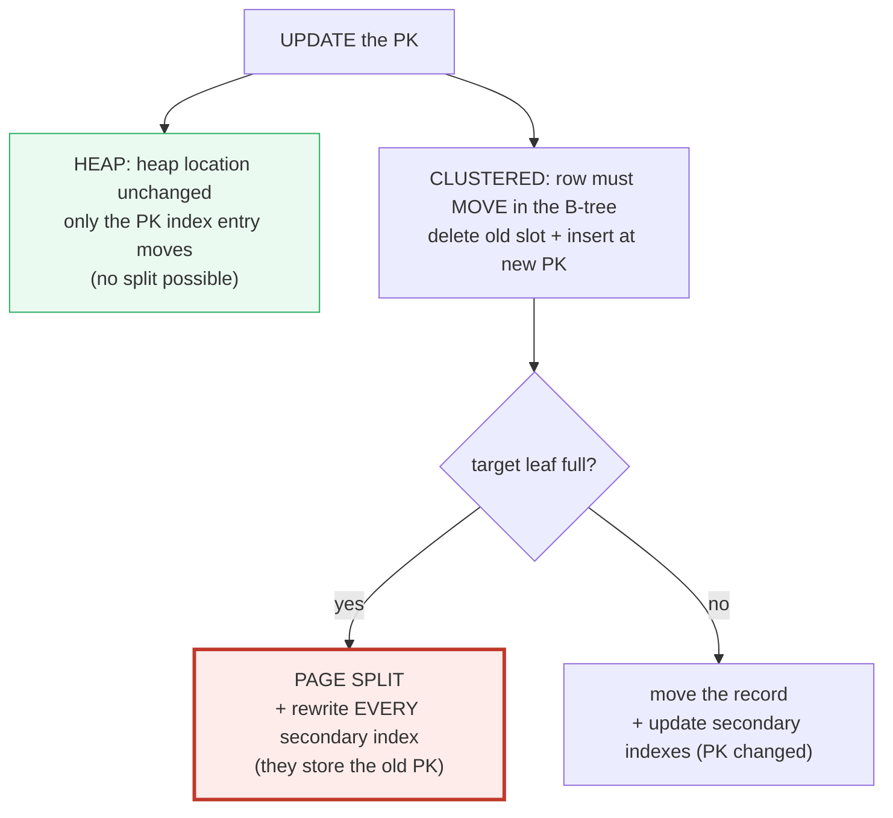
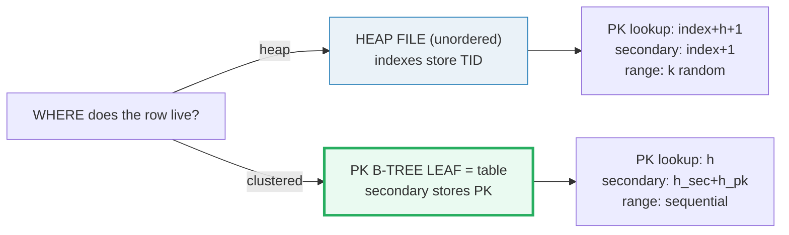

# Heap vs Clustered / Index-Organized Table — A Visual, Worked-Example Guide

> **Companion code:** [`heap_vs_clustered.py`](./heap_vs_clustered.py). **Every
> number, table, and I/O count in this guide is printed by
> `python3 heap_vs_clustered.py`** — change the code, re-run, re-paste. Nothing
> here is hand-computed.
>
> **Live animation:** [`heap_vs_clustered.html`](./heap_vs_clustered.html) — open
> in a browser; it recomputes the access paths in JS with the *identical* model
> and gold-checks against the `.py`.
>
> **Source material:** MySQL Reference Manual §15.22.1 *InnoDB Clustered and
> Secondary Indexes*; §15.3 *InnoDB Table Modes*; PostgreSQL docs §73.3
> *Database Physical Storage* (heap pages, CTIDs); Bayer & McCreight,
> "Organization and Maintenance of Large Ordered Indexes" (1972) for the B-tree;
> Ramakrishnan & Gehrke, *Database Management Systems*, §9.6 *Index-Organized
> Files*.

---

## 0. TL;DR — WHERE does the row physically live?

The single question that separates the two designs:

> *Is the table stored in its OWN file, with indexes **pointing** at rows, or
> **ARE** the rows stored **inside** the primary-key index itself?*



- **Heap (PostgreSQL):** the table is an *unordered* pile of pages. Indexes are
  *separate* structures whose leaves store a **physical address — the TID
  `(page, offset)`** — that says "the row is over THERE". The index never holds
  row data; after using it you make **one more read** into the heap to get the
  columns. *Like a library card catalog: the card gives the shelf number, you
  still walk to the shelf.*
- **Clustered / IOT (MySQL InnoDB):** the table **IS** the primary-key B-tree.
  Rows live **inside** the B-tree *leaf* pages, sorted by PK. A secondary index
  stores the **PK VALUE** (a logical handle), *not* a physical address — because
  rows physically move when the B-tree splits, and the PK is the one thing that
  does not change on a split. *Like an encyclopedia "see also" that gives a topic
  name, not a page number.*

> **One-line definitions:**
> - *heap* — an unordered file of pages holding the table; indexes point at rows
>   by **TID**. (PostgreSQL, DB2-default, Informix.)
> - *clustered table / index-organized table (IOT)* — rows stored **IN** the
>   primary-key B-tree leaves, in PK order; secondary indexes store the **PK**.
>   (MySQL InnoDB — *always* clustered on the PK; SQL Server `CLUSTERED`;
>   Oracle IOT. PostgreSQL does **not** do this.)

### The trade-off, in one line

| Workload | Heap (PostgreSQL) | Clustered (InnoDB) | Winner |
|---|---|---|---|
| PK point lookup | index path **+1 heap read** | row is **in the leaf** | **Clustered** |
| Secondary-index lookup | index path **+1 heap read** | index path **+ full PK-tree walk** | **Heap** |
| PK range scan | **k random** heap reads | **sequential** leaf walk | **Clustered** |
| UPDATE non-key column | new version (MVCC) | **in-place** in leaf | ~Even |
| UPDATE primary key | index entry only | **page split + rewrite all secondary indexes** | **Heap** |

> From `heap_vs_clustered.py` **GOLD block** (canonical index height `h = 2`):
>
> | operation | heap I/O | clustered I/O | winner |
> |---|---|---|---|
> | PK point lookup (3) | 3 | 2 | clustered |
> | secondary lookup | 3 | 4 | heap |
> | PK range scan [2..4] | 5 | 2 | clustered |

### Glossary

| Term | Plain meaning |
|---|---|
| **heap** | an unordered file of fixed-size pages holding the table rows; no sort order |
| **clustered table / IOT** | a table whose rows are stored **in** the PK B-tree leaves, in PK order |
| **TID (CTID)** | the **physical** address of a heap tuple = `(page, offset)`. What a PostgreSQL index leaf stores. Stable only until the row moves |
| **PK value** | the **logical** key of a row. What an InnoDB secondary index leaf stores. Stable across splits |
| **secondary index** | any index that is NOT the table. Heap leaf = `key → TID`; clustered leaf = `key → PK` |
| **page I/O** | reading one page into the buffer pool. We count **distinct** pages per operation (re-read of a page already read this op = cache hit = 0) |
| **page split** | when a B-tree leaf overflows, half its rows move to a new leaf + a separator is pushed to the parent. Costs writes; never happens in a heap |

🔗 *This guide builds on [`SLOTTED_PAGE.md`](./SLOTTED_PAGE.md) (how tuples pack
into a heap page and how a line pointer / TID is the stable address) and
[`TUPLE_FORMAT.md`](./TUPLE_FORMAT.md) (MVCC version chains via `t_ctid`)*.

---

## 1. Key facts & formulas (all asserted in `heap_vs_clustered.py`)

```
heap PK point lookup I/O       = h_pk + 1              (index path + 1 heap read)
clustered PK point lookup I/O  = h_pk                  (row is IN the leaf)
heap secondary lookup I/O      = h_sec + 1             (index path + 1 heap read)
clustered secondary lookup I/O = h_sec + h_pk          (index path + full PK-tree walk)
heap PK range scan (k rows)    = h_pk + k              (k RANDOM heap reads)
clustered PK range scan        = h_pk + O(leaves)      (SEQUENTIAL leaf walk)

GOLD identity (h_pk = h_sec = 2):
   heap (PK + sec) = (h+1) + (h+1) = 2h+2 = 6
   clus (PK + sec) = (h)    + (2h)  = 3h    = 6
   -> EQUAL total work for one PK + one secondary lookup; spent differently.
```

`h` = B-tree height = number of index levels read on a root-to-leaf descent. The
canonical table uses `h = 2` (root + one leaf). The identity holds *specifically*
because `h = 2`; for taller trees the clustered secondary lookup pulls further
ahead in cost (`h_sec + h_pk` grows with both heights).

| Fact | Detail | Source |
|---|---|---|
| PostgreSQL is **always** a heap | "In PostgreSQL... the table itself is stored as a heap... indexes store CTIDs" | PostgreSQL §73.3 |
| InnoDB is **always** clustered on the PK | "Every InnoDB table has a special index called the clustered index... stores the row data" | MySQL §15.22.1 |
| InnoDB secondary indexes store the PK | "Secondary indexes... contain the primary key columns" | MySQL §15.22.2 |
| SQL Server `CLUSTERED` is optional | one clustered index per table; the leaf = the data pages | SQL Server docs |
| A heap **never** page-splits | no order to maintain → rows just append | — |

---

## 2. The HEAP model — Section A output

A heap stores rows in **INSERT order**, with **no** PK sort. The canonical table
inserts `Eve, Alice, Carol, Bob, Dave`, so physical page order is `5,1,3,2,4` —
*not* PK order. Indexes are **separate** files whose leaves store the **TID**.

> From `heap_vs_clustered.py` **Section A** — the heap file + secondary index:
>
> ```
>   HEAP FILE  (the table itself; unordered):
>     page | PK | name  | city    | TID = (page, off)
>     -----|----|-------|---------|-----------------
>     H0   |  5 | Eve   | El Paso | (H0, 0)
>     H1   |  1 | Alice | Austin  | (H1, 0)
>     H2   |  3 | Carol | Cairo   | (H2, 0)
>     H3   |  2 | Bob   | Berlin  | (H3, 0)
>     H4   |  4 | Dave  | Dublin  | (H4, 0)
>
>   SECONDARY INDEX on `name`  (a separate B-tree; leaf = name -> TID):
>     name  | -> TID (heap location)
>     ------|---------------------
>     Alice | H1
>     Bob   | H3
>     Carol | H2
>     Dave  | H4
>     Eve   | H0
>
> [check] heap rows unordered by PK: page order PKs = [5, 1, 3, 2, 4] != sorted [1, 2, 3, 4, 5]  ->  OK
> ```



> 🔗 The **line pointer / TID** is the *stable address* a heap index points at;
> see [`SLOTTED_PAGE.md`](./SLOTTED_PAGE.md) §1. The toy here uses **1 tuple per
> page** (exaggerated) so a range scan's random reads are visible — a real 8 KB
> page holds hundreds of rows, which lowers the I/O *count* but not the random
> *pattern*.

---

## 3. The CLUSTERED / IOT model — Section B output

The **same** 5 rows, but now stored **inside** the PK B-tree leaf, in PK order.
The PK index leaf *is* the table; the secondary index stores the **PK value**.

> From `heap_vs_clustered.py` **Section B** — the clustered PK B-tree + secondary index:
>
> ```
>   PK B-TREE LEAF (page CL) = the table, rows sorted by PK:
>     PK | name  | city
>     ---|-------|---------
>      1 | Alice | Austin
>      2 | Bob   | Berlin
>      3 | Carol | Cairo
>      4 | Dave  | Dublin
>      5 | Eve   | El Paso
>
>   SECONDARY INDEX on `name`  (leaf = name -> PK VALUE, not a TID):
>     name  | -> PK (logical handle)
>     ------|--------------------
>     Alice | 1
>     Bob   | 2
>     Carol | 3
>     Dave  | 4
>     Eve   | 5
>
> [check] clustered leaf is PK-sorted: PKs = [1, 2, 3, 4, 5] == [1, 2, 3, 4, 5]  ->  OK
> ```



> **Why the secondary index stores the PK, not a TID:** a B-tree **split**
> physically moves rows between leaf pages, so a stored TID would instantly go
> stale. The PK never changes on a split, so storing the PK keeps every secondary
> index stable for free. The price is the second tree walk in §4.

---

## 4. PK point lookup — Section C output (clustered wins by 1)

> From `heap_vs_clustered.py` **Section C** — lookup `PK = 3` (Carol):
>
> ```
>   HEAP       : descend PK index  [PKR -> PKL]  ->  TID = H2,
>                 then read heap page H2  ->  row = (3, 'Carol', 'Cairo')
>                 trace: PKR -> PKL -> H2    I/O = 3
>   CLUSTERED  : descend PK B-tree [CR -> CL]  ->  row is IN the leaf
>                 trace: CR -> CL    I/O = 2
>
>   [check] heap_pk_io = 3 == h+1 = 2+1 = 3        OK
>   [check] clus_pk_io = 2 == h   = 2               OK
> ```



The clustered leaf *already* holds the full row, so the descent **ends on the
data**. The heap index leaf carries only `(pk → TID)`, so you **always** pay one
more page read to fetch the columns. **Clustered wins by 1.**

---

## 5. Secondary-index lookup — Section D output (heap wins by 1)

> From `heap_vs_clustered.py` **Section D** — lookup `name = "Carol"`:
>
> ```
>   HEAP       : descend sec index  [SR -> SL]  ->  TID = H2,
>                 then read heap page H2  ->  row = (3, 'Carol', 'Cairo')
>                 trace: SR -> SL -> H2    I/O = 3
>   CLUSTERED  : descend sec index  [CSR -> CSL]  ->  PK = 3,
>                 then re-walk the PK B-tree CR -> CL to fetch the row
>                 trace: CSR -> CSL -> CR -> CL    I/O = 4
>
>   [check] heap_sec_io = 3 == h_sec+1       = 2+1 = 3   OK
>   [check] clus_sec_io = 4 == h_sec+h_pk     = 2+2 = 4   OK
> ```



**Heap wins by 1.** The secondary leaf stores a *physical* TID → one heap read
fetches the row. The clustered secondary leaf stores only the *PK* → it must
launch a **second full PK-tree traversal** (`CR → CL`) to get the row. This is
the hidden cost of "secondary indexes store the PK": **stable on a split, but
each lookup re-walks the PK tree.**

**Who wins when:**
- **Clustered** wins PK-driven workloads (OLTP by id, range scans on PK).
- **Heap** wins when you read through **many** secondary indexes (each dodges the
  second tree walk) and when the **PK is mutable**.

---

## 6. PK range scan — Section E output (clustered wins big; random vs sequential)

> From `heap_vs_clustered.py` **Section E** — range `PK in [2, 4]` (Bob, Carol, Dave):
>
> ```
>   HEAP       : descend PK index [PKR -> PKL], then for EACH row in
>                 range fetch its heap page: H3 -> H2 -> H4
>                 trace: PKR -> PKL -> H3 -> H2 -> H4    I/O = 5
>                 page access order = ['H3', 'H2', 'H4']  -> RANDOM (3,2,4),
>                 non-sequential: adjacent PKs are NOT physically adjacent.
>   CLUSTERED  : descend PK B-tree [CR -> CL]; the rows Bob, Carol, Dave
>                 sit CONTIGUOUSLY in leaf CL -> a single sequential scan.
>                 trace: CR -> CL    I/O = 2
>
>   [check] heap_range_io = 5 == h + k = 2 + 3 = 5          OK
>   [check] clus_range_io = 2 == h       = 2                OK
> ```



**Clustered wins by 3, and the gap widens with range size.** On a heap, every
row is a separate **random** page read — adjacent PKs are scattered across the
heap in *insert* order (here accessed as pages `H3, H2, H4`). On a clustered
table the rows are **physically adjacent** in the leaf, so the scan is
**sequential** (cache-friendly, prefetchable). **This is THE main reason
clustered/IOT tables are preferred for range queries on the PK.**

> The toy uses 1 tuple/page to make the random pattern obvious. With a realistic
> fill (`f` rows/page) the heap range scan reads `ceil(k/f)` *pages* but still in
> **non-sequential** order; the clustered scan reads the rows in one sequential
> sweep of the leaf region.

---

## 7. UPDATE behavior — Section F output

Two cases expose the deepest structural difference.

### Case 1 — UPDATE a non-key column (Carol's city)

- **Heap (PostgreSQL MVCC):** write a brand-new tuple **version** at a fresh heap
  location (new page, new TID); the old version stays with `t_ctid` → new. **1
  heap write.** If no indexed column changed and it fits the page → **HOT**
  update: the old line pointer **REDIRECT**s, **no index touched** 🔗
  ([`SLOTTED_PAGE.md`](./SLOTTED_PAGE.md) §5).
- **Clustered (InnoDB):** PK unchanged → row stays at its leaf position →
  **in-place** update of the record inside leaf `CL`. No split, no movement,
  secondary indexes untouched. **1 write.**

→ **Roughly even** (1 write each); both engines are MVCC (PostgreSQL version
chains in the heap, InnoDB via the undo log).

### Case 2 — UPDATE the primary key (Carol PK 3 → 6)

- **Heap:** the row's **heap location is unaffected** by a PK change — only the
  **PK index entry** changes (delete `pk=3`, insert `pk=6`). **No structural
  change; a heap never page-splits.** Secondary indexes (store TIDs) are
  untouched if HOT, else updated.
- **Clustered:** the PK **IS** the physical position. `3 → 6` means **delete**
  the row from its old leaf slot and **insert** it at the new PK position. If the
  target leaf is full → **page split**. Worse, **every secondary index** that
  stored `PK=3` for this row must be rewritten to `PK=6` (they store the PK!).

> From `heap_vs_clustered.py` **Section F** — split mechanics (capacity-3 leaf):
>
> ```
>   full leaf = [10, 20, 30]
>   insert 25 -> overflow -> merged [10, 20, 25, 30]
>   split -> left [10, 20] | right [25, 30]  (separator 25 up)
>   page WRITES = 3  (rewrite left + new right + parent)
>   + 1 secondary-index update per secondary index on the table
> ```

This is **why InnoDB primary keys should be IMMUTABLE and MONOTONIC** (e.g.
`AUTO_INCREMENT`): appends hit only the rightmost leaf, so splits are rare and
secondary indexes never need rewriting. A mutable/random PK on a clustered table
causes splits **and** cascading secondary-index updates.



---

## 8. The GOLD values (pinned for `heap_vs_clustered.html`)

> From `heap_vs_clustered.py` **GOLD block** (`h = 2`):
>
> ```
>   heap_pk_io=3  clus_pk_io=2  |  heap_sec_io=3  clus_sec_io=4  |  heap_range_io=5  clus_range_io=2
>
>   GOLD identity (one PK + one secondary lookup):
>     heap   total = heap_pk + heap_sec = 3 + 3 = 6
>     clus   total = clus_pk + clus_sec = 2 + 4 = 6
>     -> with h_pk = h_sec = 2: 2(h+1) = 2h+2 = 6  and  3h = 6  -> EQUAL total work, spent differently.
>
>   [check] heap_pk=3 clus_pk=2 heap_sec=3 clus_sec=4 heap_rng=5 clus_rng=2  ->  OK
>   [check] heap(PK+sec)==6 == clus(PK+sec)==6 == 6  ->  OK
> ```
>
> [`heap_vs_clustered.html`](./heap_vs_clustered.html) rebuilds both storage
> models in JS, runs the three operations, and checks all six I/O counts match
> these gold values.

---

## 9. Pitfalls & debugging checklist

| # | Mistake / surprise | Symptom | Reality |
|---|---|---|---|
| 1 | "InnoDB secondary index lookups feel slower than PostgreSQL's" | extra latency on covering-flag misses | They cost a **second PK-tree traversal** — the secondary leaf stores the PK, not a row address. Use a **covering index** to avoid it |
| 2 | Expecting a heap PK range scan to be fast | slow `WHERE pk BETWEEN` | Heap rows are scattered in *insert* order → **random** I/O per row. A heap has **no** PK clustering |
| 3 | Updating an InnoDB PK column → sudden write amplification | index bloat, stalls | The row physically **moves** (maybe a split) and **every** secondary index (which stores the PK) is rewritten. Keep PKs **immutable** |
| 4 | Thinking PostgreSQL has a "clustered index" | confusion with `CLUSTER` command | `CLUSTER` is a **one-time** physical rewrite by an index; PostgreSQL does **not** maintain clustering afterward — it's always a heap |
| 5 | Assuming secondary indexes point at a physical address in InnoDB | wrong mental model for splits | They store the **PK**; that's *why* they survive splits untouched but cost a re-walk on read |
| 6 | "Why does a small InnoDB table read so much on a secondary lookup?" | I/O > expected | `h_sec + h_pk` page reads — two full tree heights, not one. Mitigate with covering indexes |
| 7 | Forgetting a heap **never** splits | wrong cost model for heap updates | Heap updates only ever **append** a new version; no ordering to maintain, no splits |

---

## 10. Cheat sheet



- **Heap (PostgreSQL):** unordered heap file; indexes store **TID** = `(page, off)`.
  Every lookup = index path **+ 1 heap read**. Range scans = **random** I/O per row.
- **Clustered/IOT (InnoDB):** rows **in** the PK B-tree leaf; secondary stores the
  **PK value**. PK lookup = `h` (row in leaf); secondary = `h_sec + h_pk`
  (**re-walks** the PK tree); range scan = **sequential**.
- **GOLD identity (h=2):** one PK + one secondary lookup costs the **same total**
  (6) on both — but clustered spends it on PK lookups, heap on secondary.
- **PK point lookup:** clustered wins (−1). **Secondary lookup:** heap wins (−1).
  **PK range scan:** clustered wins big (sequential vs random).
- **UPDATE non-key:** ~even (1 write each). **UPDATE PK:** heap cheap (index entry
  only); clustered expensive (possible **split** + rewrite **all** secondary
  indexes) → keep InnoDB PKs **immutable & monotonic**.
- A heap **never** page-splits; only ordered structures (clustered tables, all
  B-tree indexes) split.

---

## Sources

1. **MySQL Reference Manual** — §15.22.1 *InnoDB Clustered and Secondary Indexes*:
   *"Every InnoDB table has a special index called the clustered index ...
   Typically, the clustered index is synonymous with the primary key ...
   Clustered index records are stored in order ... Secondary index records
   contain the primary key columns for the row."*
   https://dev.mysql.com/doc/refman/8.0/en/innodb-index-types.html
   - Verified: InnoDB is **always** clustered on the PK; secondary indexes store
     PK columns; clustered records are stored in PK order.
2. **PostgreSQL docs** — §73.3 *Database Physical Storage*: heap pages, item
   identifiers (line pointers), and CTIDs `(block, offset)` as the physical
   tuple address that indexes reference. https://www.postgresql.org/docs/current/storage-page-layout.html
   - Verified: PostgreSQL tables are heaps; indexes store CTIDs; the `CLUSTER`
     command is a one-time rewrite, not maintained clustering.
3. **Bayer & McCreight (1972)**, "Organization and Maintenance of Large Ordered
   Indexes" — the B-tree: ordered, balanced, page-splitting structure that
   underlies both the clustered table and every secondary index here.
4. **Ramakrishnan & Gehrke**, *Database Management Systems*, §9.6 *Index-Organized
   Files*; **Silberschatz/Korth/Sudarshan**, *Database System Concepts*, "Indexing
   and Hashing" (clustered vs. secondary indexes; I/O cost comparison).
5. **Printable model** — `heap_vs_clustered.py` uses 1 tuple/heap-page (noted as
   exaggerated) to expose the random-access pattern of heap range scans; a real
   page holds hundreds of rows (see [`SLOTTED_PAGE.md`](./SLOTTED_PAGE.md)).

---

### 🔗 Companion files & siblings

- **[`heap_vs_clustered.py`](./heap_vs_clustered.py)** — ground-truth reference impl (run: `python3 heap_vs_clustered.py`).
- **[`heap_vs_clustered_output.txt`](./heap_vs_clustered_output.txt)** — captured stdout, for auditing this guide without running.
- **[`heap_vs_clustered.html`](./heap_vs_clustered.html)** — side-by-side interactive with animated access paths and **check: OK**.
- Sibling bundles: [`SLOTTED_PAGE.md`](./SLOTTED_PAGE.md) (the heap page + TID line pointer), [`TUPLE_FORMAT.md`](./TUPLE_FORMAT.md) (MVCC version chains), [`OVERFLOW_PAGES.md`](./OVERFLOW_PAGES.md), [`FREE_SPACE_MAP.md`](./FREE_SPACE_MAP.md).

> Part of the database-internals tutorial series. See [`HOW_TO_RESEARCH.md`](./HOW_TO_RESEARCH.md)
> for the bundle workflow. Every number above traces to a
> `> From heap_vs_clustered.py Section X:` callout.
