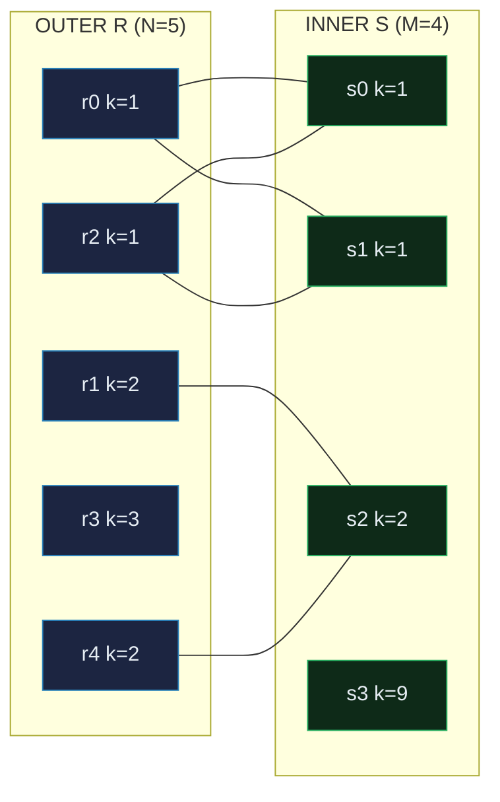
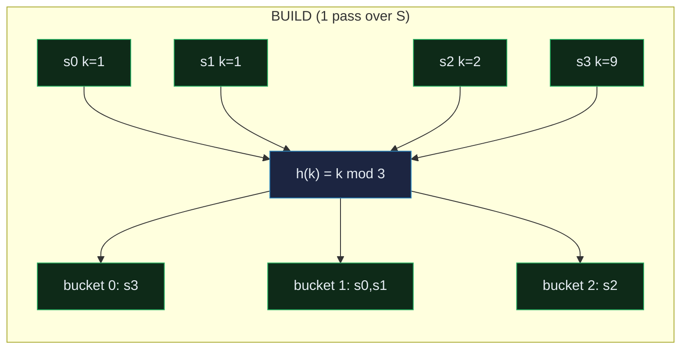
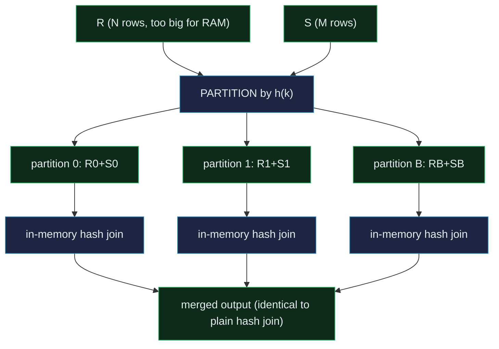

# Physical Join Algorithms

> A database-internals concept bundle. This guide is the static, rigorous half;
> every number below is printed by the ground-truth
> [`join_algorithms.py`](./join_algorithms.py) and pasted **verbatim** — never
> hand-computed. The playable companion is [`join_algorithms.html`](./join_algorithms.html).
>
> Lineage: **Nested Loop (the baseline) → Hash Join (DeWitt, build+probe) →
> Sort-Merge (free if pre-sorted) → Grace/Hybrid Hash (Kitsuregawa 1983 /
> Shapiro 1986, for joins that do not fit in memory)**.

---

## 0. The one-paragraph idea

A JOIN matches rows of two tables on a predicate. The **logical** join
(`R ⋈ S` on `R.k = S.k`) says *what* you want; the **physical** join algorithm
says *how* the executor actually walks the data to produce it. There are three
classics, and every query optimizer picks between them on a cost basis:

- **Nested Loop** — for each outer row, scan the entire inner. **O(N·M)**. Works
  on *any* predicate. Wins when the outer is tiny (or the inner is indexed).
- **Hash Join** — build a hash table on one side, probe with the other. **O(N+M)**.
  Equi-joins only. Wins on large unsorted `=` joins.
- **(Sort-)Merge** — sort both sides on the key, then walk two pointers.
  **O(N+M)** if pre-sorted, **O(N·logN + M·logM + N + M)** otherwise. Wins when
  at least one side is already ordered (B-tree, `ORDER BY`).

The punchline, verified by the gold check in [`join_algorithms.py`](./join_algorithms.py):
**all three produce a byte-identical result for the same inputs.** The optimizer
swaps them freely based on cost — never semantics.

> **Analogy — the hotel clerk.** Table R is a stack of guest envelopes, each
> marked with a room number; table S is a wall of mailboxes labelled by room.
> Deliver every envelope to its mailbox. **Nested Loop**: pick up envelope 1,
> walk the whole wall looking for room 1; then envelope 2, walk the wall again;
> … that is |R|·|S| trips. **Hash Join**: spend one pass building a hash of the
> mailboxes (`hash(room#) → slot`); then every envelope hashes its room# and
> jumps straight to the slot — two passes, |R|+|S|. **Merge Join**: sort both
> stacks by room number, then walk two fingers forward in lockstep — free if
> already sorted.

---

## 1. Why all three exist — the lineage

| Algorithm | Predicate | Best case cost | When the optimizer picks it |
|---|---|---|---|
| **Nested Loop** (classic) | any | N·M | outer is tiny (≤ ~10 rows), or non-equi join |
| **Block Nested Loop** | any | N·M compares, ⌈N/B⌉ inner I/O | outer is medium, inner unindexed, no equi |
| **Indexed Nested Loop** | any (inner indexed) | N·logM | OLTP point-lookup join (small outer, huge indexed inner) |
| **Hash Join** (DeWitt) | `=` only | **N+M** | large equi-join, unsorted — the PG default |
| **Sort-Merge** (pre-sorted) | `=`,`<`,`>` | **N+M** | at least one side is a B-tree / index scan |
| **Sort-Merge** (sort both) | `=`,`<`,`>` | N·logN + M·logM + N+M | need sort anyway (downstream `ORDER BY`) |
| **Grace Hash** (Kitsuregawa 1983) | `=` only | 3·(N+M) I/O | equi-join too big for RAM |
| **Hybrid Hash** (Shapiro 1986) | `=` only | ~2·(N+M) I/O | Grace + keep partition 0 in RAM — what PG actually runs |

The lineage insight: **Nested Loop always works but scales terribly; Hash and
Merge trade a restriction (equi-join) for an asymptotic speedup (N·M → N+M).**
The two refinements (Block NL, Grace/Hybrid Hash) exist to keep the *same*
algorithm working when the data stops fitting in memory.

> 🔗 The reason a hash table can be built at all is the **hash function** —
> see [`HASH_INDEX.md`](./HASH_INDEX.md) for how PostgreSQL's `hash_any` works.
> The reason Merge Join can be "free" is that a **B-tree** returns sorted rows
> — see [`HEAP_VS_CLUSTERED.md`](./HEAP_VS_CLUSTERED.md) and [`BTREE.md`](./BTREE.md).

---

## 2. The inputs — tables R (outer) and S (inner)

The worked example uses deliberately tiny, deterministic tables. They are
chosen to exercise **every edge case**: a duplicate key on both sides (a 2×2
fan-out), an unmatched outer row, and an unmatched inner row.

> From `join_algorithms.py` Section 0 — the inputs:

```
R = [(rid, key)]                              S = [(rid, key)]
------------------------------------------------------------
  r0  key=1                     s0  key=1
  r1  key=2                     s1  key=1
  r2  key=1                     s2  key=2
  r3  key=3                     s3  key=9
  r4  key=2                   
------------------------------------------------------------
```

- key=1 appears **twice on each side** → a 2×2 fan-out (4 output rows).
- key=2 appears twice in R, once in S → 2 output rows.
- key=3 (R only) and key=9 (S only) → no match, drop out.
- **Expected output: 6 joined rows.**



The **gold** set of output pairs (used by every algorithm's correctness check):

> From `join_algorithms.py` Section 0:
> `[check] gold expected pairs (sorted): (r0,s0), (r0,s1), (r1,s2), (r2,s0), (r2,s1), (r4,s2)`

---

## 3. Nested Loop Join — O(N·M)

For each outer row, walk the **entire** inner table once and test every pair.

```
for r in R:            # outer: scan once
    for s in S:        # inner: rescanned N times
        if r.key == s.key: emit(r, s)
```

> From `join_algorithms.py` Section A — the 20 comparisons, traced:

| step | outer r (key) | inner scan | comparisons this row | matched s rows |
|------|---------------|------------|----------------------|----------------|
| 0    | r0 (key=1)       | full (#1)  | 4                      | s0,s1          |
| 1    | r1 (key=2)       | full (#2)  | 4                      | s2             |
| 2    | r2 (key=1)       | full (#3)  | 4                      | s0,s1          |
| 3    | r3 (key=3)       | full (#4)  | 4                      | -              |
| 4    | r4 (key=2)       | full (#5)  | 4                      | s2             |

> **TOTALS: comparisons = 20 (= N·M = 5·4) · inner scans = 5 (= N) · output = 6 rows**

The number that matters is **inner scans = N**: the inner table is read *in
full* once per outer row. If the inner lives on disk and does not fit in the
buffer pool, that is N full table scans — catastrophic.

### 3a. Variant — Block Nested Loop

Instead of rescanning the inner per *row*, chunk the outer into blocks of `B`
rows and scan the inner **once per block**:

> From `join_algorithms.py` Section A — Block NL, block size B=2:

```
chunk outer into ceil(N/B) = ceil(5/2) = 3 blocks:
    block @0: ['r0', 'r1']
    block @2: ['r2', 'r3']
    block @4: ['r4']
-> inner is scanned once PER BLOCK  = 3 times (was 5 for plain NL)
-> comparisons UNCHANGED = 20  (still N*M; we still test every pair)
-> output identical: 6 rows
[check] Block NL output == plain NL output:  OK
```

**Take-away:** Block NL does *not* reduce CPU comparisons (still N·M); it
reduces **I/O on the inner table** — read once per block, not per row. When the
inner is large and on disk, that is the dominant win. The general formula is
**⌈N/B⌉ inner scans** instead of N.

---

## 4. Hash Join — O(N+M)

Two phases. **BUILD** hashes the (smaller) inner table into buckets; **PROBE**
hashes each outer row and looks *only* in its bucket.

> From `join_algorithms.py` Section B — BUILD then PROBE, `h(key) = key mod 3`:

**BUILD** (inner S, M=4 rows → hash table):

```
bucket 0: s3(k=9)
bucket 1: s0(k=1), s1(k=1)
bucket 2: s2(k=2)
build ops = 4  (= M = 4 hashes)
```

**PROBE** (outer R, N=5 rows → lookup):

| outer r (key) | h(key) | bucket contents        | matches      |
|---------------|--------|------------------------|--------------|
| r0 (key=1)       | 1      | s0(k=1), s1(k=1)       | s0,s1        |
| r1 (key=2)       | 2      | s2(k=2)                | s2           |
| r2 (key=1)       | 1      | s0(k=1), s1(k=1)       | s0,s1        |
| r3 (key=3)       | 0      | s3(k=9)                | -            |
| r4 (key=2)       | 2      | s2(k=2)                | s2           |

> **TOTALS: build ops + probe ops = 4+5 = 9 row-touches (= N+M = 9) · in-bucket
> comparisons (collisions) = 7 · output = 6 rows**

Compare to NL's **20** comparisons: Hash Join does **9 row-touches** — less
than half — *and* the gap explodes as the tables grow (see §6). The in-bucket
collisions (7) are tiny relative to N·M and stay small as long as the hash
spreads rows evenly. They only balloon under a **pathologically skewed** key
(e.g. one value covers 90% of rows — the "hot key" failure mode).



---

## 5. (Sort-)Merge Join — sort both, then one merge pass

Two steps. **Sort** both tables on the key (stable sort, so duplicates keep
their order). **Merge** with two pointers `i` (into R) and `j` (into S); when
keys match, expand the **group** on both sides and emit the cartesian product
of the duplicates.

> From `join_algorithms.py` Section C — sort, then merge:

**Step 1 — STABLE-SORT both tables on the join key:**

```
R sorted: (rid=0,k=1), (rid=2,k=1), (rid=1,k=2), (rid=4,k=2), (rid=3,k=3)
S sorted: (rid=0,k=1), (rid=1,k=1), (rid=2,k=2), (rid=3,k=9)
sort comparisons (both sorts combined) = 12
```

**Step 2 — MERGE** with two pointers:

| step | i | j | R[i].key | S[j].key | action                  |
|------|---|---|----------|----------|-------------------------|
| 0    | 0 | 0 | 1        | 1        | emit group (2×2=4 rows) |
| 1    | 2 | 2 | 2        | 2        | emit group (2×1=2 rows) |
| 2    | 4 | 3 | 3        | 9        | R<S → i++ (skip r)      |

> **TOTALS: sort comparisons = 12 · merge advances = 8 · if pre-sorted, sort = 0 → merge = N+M = 9 · output = 6 rows**

The merge step itself is linear (**N+M pointer advances**); the cost is
dominated by the sorts when the inputs are not pre-ordered. **The moment either
side is already sorted** (clustered B-tree, index scan, or an `ORDER BY` the
planner can reuse), the sort is free and the whole join collapses to a single
N+M pass — and the output *comes out sorted for free*, which can eliminate a
downstream `Sort` node. PostgreSQL's `nodeMergejoin` is exactly this two-pointer
merge.

---

## 6. Cost comparison + the optimizer's decision matrix

The closed-form costs (Selinger 1979 / System R cost model). `N=|R|`, `M=|S|`,
`B` = Block-NL block size, `idx` = inner has a B-tree on the join key.

> From `join_algorithms.py` Section D — the cost formulas:

| algorithm              | predicate   | cost (comparisons / I/O)        |
|------------------------|-------------|---------------------------------|
| Nested Loop            | any         | N·M                             |
| Block Nested Loop      | any         | N·M compares, ⌈N/B⌉ inner reads |
| Indexed Nested Loop    | any (idx)   | N·log₂(M)  (one lookup per outer row) |
| Hash Join              | `=` (equi)  | N + M  (+ small collisions)     |
| Merge Join (pre-sorted)| `=`,`<`,`>` | N + M                           |
| Merge Join (sort both) | `=`,`<`,`>` | N·log₂(N) + M·log₂(M) + N + M   |
| Grace Hash Join        | `=` (equi)  | 3·(N+M) I/O  (spill+rewind+reread) |

### 6a. Worked numbers for a sweep of (N, M)

This is the table that shows *why* Hash Join exists. Watch the NL column:

> From `join_algorithms.py` Section D:

| N          | M          | NL = N·M      | Hash = N+M | Merge sorted = N+M | Merge+sort (NlgN+MlgM+N+M) | Indexed NL = N·lgM |
|------------|------------|---------------|------------|---------------------|----------------------------|--------------------|
| 5          | 4          | 20            | 9          | 9                   | 29                         | 10                 |
| 100        | 100        | 10,000        | 200        | 200                 | 1,529                      | 664                |
| 1,000      | 1,000      | 1,000,000     | 2,000      | 2,000               | 21,932                     | 9,966              |
| 10,000     | 10,000     | 100,000,000   | 20,000     | 20,000              | 285,754                    | 132,877            |
| 1,000,000  | 1,000,000  | 1,000,000,000,000 | 2,000,000 | 2,000,000        | 41,863,137                 | 19,931,569         |
| 10         | 1,000,000  | 10,000,000    | 1,000,010  | 1,000,010           | 20,931,612                 | **199**            |
| 1,000,000  | 10         | 10,000,000    | 1,000,010  | 1,000,010           | 20,931,612                 | 3,321,928          |

Three things to read off:

- **At N=M=1M, NL does 10¹² compares** (literally impossible); Hash does 2M.
  That ~6-orders-of-magnitude gap is why hash join exists.
- **Indexed NL wins when N is tiny and M is huge** (last-but-one row: 10 ×
  log₂(1M) ≈ 200). This is the **OLTP point-lookup join**: join a 10-row result
  to a billion-row fact table via its B-tree. No full scan of the fact table.
- **Merge+sort loses to Hash on unsorted data** — the two sorts add N·logN +
  M·logM overhead that Hash never pays. Merge only catches up when a sort is
  *already needed* downstream (so its cost is amortized).

### 6b. The decision matrix — what the optimizer actually picks

> From `join_algorithms.py` Section D:

| situation                                   | cheapest join        | why |
|---------------------------------------------|----------------------|-----|
| small outer, indexed inner (OLTP lookup)    | Indexed Nested Loop  | N·logM ≪ N+M when N is tiny |
| small outer, no index (e.g. < ~10 rows)     | Nested Loop          | building a hash table is not worth the overhead |
| large equi-join, both sides unsorted        | Hash Join            | N+M beats N·M and beats sort+merge |
| one/both sides pre-sorted (B-tree, ORDER BY)| Merge Join           | sort is free → pure N+M, output stays sorted |
| equi-join, hash table bigger than RAM       | Grace / Hybrid Hash  | partition so each piece fits in memory |
| non-equi predicate (`a < b`, `a BETWEEN b`) | Nested Loop          | Hash and Merge **require** equality |
| data already needs sorting downstream       | Sort-Merge           | amortize the sort across join + ORDER BY/GROUP BY |

---

## 7. Grace Hash Join — when the hash table does not fit in memory

Classic in-memory Hash Join assumes the build side fits in RAM. When it does
not, the hash table thrashes the buffer pool. **Grace Hash Join**
(Kitsuregawa, Tanaka, Moto-oka 1983) sidesteps this by **partitioning** both
tables by hash first: rows that could possibly match are guaranteed to land in
the **same partition number** on both sides (both used the same hash function),
so each partition pair can be loaded into memory and joined independently.

> From `join_algorithms.py` Section E — Grace Hash, B=3 partitions, `h(k)=k mod 3`:

**PHASE 1 — PARTITION both tables by hash:**

```
R partitions:
    partition 0: (rid=3,k=3)
    partition 1: (rid=0,k=1), (rid=2,k=1)
    partition 2: (rid=1,k=2), (rid=4,k=2)
S partitions:
    partition 0: (rid=3,k=9)
    partition 1: (rid=0,k=1), (rid=1,k=1)
    partition 2: (rid=2,k=2)
```

**PHASE 2 — JOIN each matching partition pair in memory:**

```
partition 0: |R_b|=1, |S_b|=1  -> in-memory join -> 0 output rows
partition 1: |R_b|=2, |S_b|=2  -> in-memory join -> 4 output rows  (r0,s0), (r0,s1), (r2,s0), (r2,s1)
partition 2: |R_b|=2, |S_b|=1  -> in-memory join -> 2 output rows  (r1,s2), (r4,s2)

sum |R_b| + |S_b| over all partitions = 9  (= N+M = 9; partitioning is lossless)
output rows emitted (all partitions): 6
```

**I/O cost model:** classic Grace Hash does **3 passes** over each side (read to
partition, write partitions out, read partitions back) → **3·(N+M) = 27 I/Os**
on the worked example. **Hybrid Hash** (Shapiro 1986) keeps partition 0 in RAM
during the first pass instead of spilling it — the version every modern DB
actually implements. PostgreSQL's `nodeHashjoin` chooses Hybrid Hash
automatically and can even *recurse* (re-partition) a partition that is still
too big to fit.



---

## 8. The gold check — all three algorithms agree

The correctness invariant. The optimizer picks whichever algorithm is cheapest,
but the **result is byte-identical**. This is what lets a query plan swap
physical joins freely without changing semantics.

> From `join_algorithms.py` GOLD CHECK:

```
Nested Loop  : 6 rows  -> (r0,s0), (r0,s1), (r1,s2), (r2,s0), (r2,s1), (r4,s2)
Hash Join    : 6 rows  -> (r0,s0), (r0,s1), (r1,s2), (r2,s0), (r2,s1), (r4,s2)
Merge Join   : 6 rows  -> (r0,s0), (r0,s1), (r1,s2), (r2,s0), (r2,s1), (r4,s2)
Grace Hash   : 6 rows  -> (r0,s0), (r0,s1), (r1,s2), (r2,s0), (r2,s1), (r4,s2)
expected gold: 6 rows  -> (r0,s0), (r0,s1), (r1,s2), (r2,s0), (r2,s1), (r4,s2)

[check] NL == Hash == Merge == Grace == gold :  OK
[check] all four algorithms agree on the join result:  OK
```

The same six pairs — in particular, the **2×2 fan-out** on key=1 (`(r0,s0),
(r0,s1), (r2,s0), (r2,s1)`) is reproduced by every algorithm. Merge Join gets
it via the group-expansion step; Hash Join gets it because both `s0` and `s1`
land in the same bucket; Grace Hash gets it because both rows of each side land
in partition 1.

---

## 9. Pitfalls

1. **Hash/Merge need equality.** A predicate like `R.x BETWEEN S.lo AND S.hi`
   or `R.x < S.x` **cannot** use Hash or Merge — the optimizer falls back to
   Nested Loop. This is the #1 reason a "should-be-fast" join plan is slow.
2. **Outer-vs-inner choice matters for NL.** Nested Loop rescans the inner N
   times, so the **smaller** table should be outer. The planner decides this
   from row-count estimates; a bad `STATISTICS` target can flip it the wrong way.
3. **Hash Join and skew.** If one key value dominates (e.g. `NULL` fillers,
   a "default" category), the build side's hash table has one giant bucket and
   the probe degrades back toward N·M. Hybrid Hash detects this and spills,
   but the cost spikes.
4. **Merge Join needs the *right* sort order.** "Pre-sorted" means sorted on
   the join key in a compatible direction (`NULLS FIRST/LAST` and `ASC/DESC`
   must match). An index in the wrong order does not help — the planner will
   still add a Sort node.
5. **Indexed Nested Loop hides a random I/O per row.** N B-tree lookups on a
   cold inner table is N random page reads — fine for OLTP (N small),
   catastrophic for analytics (N huge). This is why OLAP queries prefer Hash.
6. **"The optimizer picked Nested Loop" is not always bad.** For a tiny outer
   (a 5-row dimension table), NL beats Hash because building the hash table is
   not worth it. Check `EXPLAIN ANALYZE` for the *actual* row counts, not the
   algorithm name.

---

## 10. Cheat sheet

```
predicate     │ size of inputs          │ pick
──────────────┼─────────────────────────┼──────────────────────────
any           │ tiny outer, indexed S   │ Indexed Nested Loop  (N·logM)
any           │ tiny outer, no index    │ Nested Loop          (N·M, N tiny)
=  (equi)     │ large, unsorted         │ Hash Join            (N+M)
=  (equi)     │ large, one side sorted  │ Merge Join           (N+M)
=  (equi)     │ build side > RAM        │ Grace / Hybrid Hash  (3·(N+M) I/O)
non-equi      │ anything                │ Nested Loop          (only option)
any           │ need ORDER BY after     │ Sort-Merge           (amortize sort)

cost shapes:   NL  N·M        Hash  N+M        Merge  N+M (sorted) or N·logN+M·logM+N+M
```

### The four files in this bundle

| file | role |
|---|---|
| [`join_algorithms.py`](./join_algorithms.py) | ground-truth reference impl; prints every number above |
| [`join_algorithms_output.txt`](./join_algorithms_output.txt) | captured stdout, for auditing the .md without running |
| [`JOIN_ALGORITHMS.md`](./JOIN_ALGORITHMS.md) | this guide (static, rigorous) |
| [`join_algorithms.html`](./join_algorithms.html) | playable companion (recomputes in JS, gold-checked) |

### Sources

- [1] Garcia-Molina, Ullman, Widom, *Database Systems: The Complete Book*, ch. 15–16.
- [2] Ramakrishnan & Gehrke, *Database Management Systems*, ch. 12.
- [3] PostgreSQL source: `src/backend/executor/nodeNestedLoop.c`,
      `nodeHashjoin.c`, `nodeMergejoin.c`.
- [4] P. Selinger, *Access Path Selection in a Relational Database System*,
      SIGMOD 1979 — the cost model every optimizer descends from.
- [5] M. Kitsuregawa, H. Tanaka, T. Moto-oka, *Application of Hash to Data
      Base Machine*, LSD 1983 — Grace Hash Join.
- [6] L. Shapiro, *Join Processing in Database Systems with Large Main
      Memories*, TODS 1986 — Hybrid Hash Join.

🔗 **Cross-references:** [`HASH_INDEX.md`](./HASH_INDEX.md) (the hash function
itself), [`BTREE.md`](./BTREE.md) & [`HEAP_VS_CLUSTERED.md`](./HEAP_VS_CLUSTERED.md)
(why Merge Join can be "free"), [`COVERING_INDEX.md`](./COVERING_INDEX.md)
(Indexed Nested Loop's index side).
