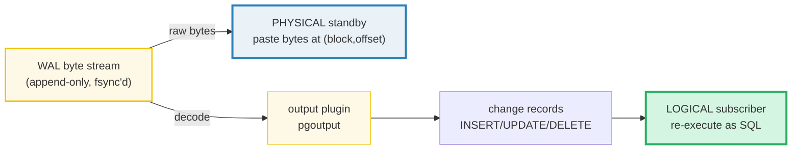
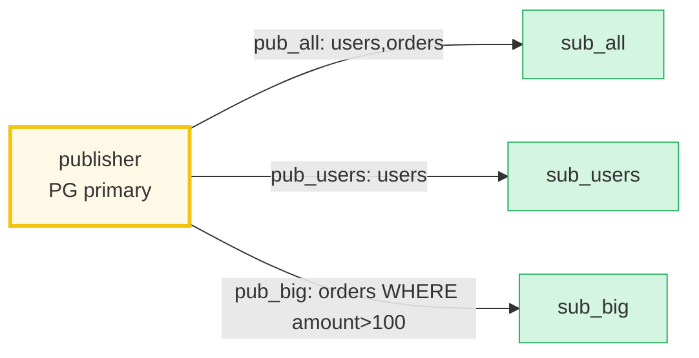

# Logical vs Physical Replication — A Visual, Worked-Example Guide

> **Companion code:** [`logical_vs_physical.py`](./logical_vs_physical.py). **Every
> record, decoded change, table state, and gold value in this guide is printed by
> `python3 logical_vs_physical.py`** — change the code, re-run, re-paste. Nothing
> here is hand-computed.
>
> **Live animation:** [`logical_vs_physical.html`](./logical_vs_physical.html) —
> open in a browser; it rebuilds the *same* workload, runs both pipelines in JS
> (physical byte-replay **and** logical decode/apply), and gold-checks the final
> state against the `.py`.
>
> **Source material:** PostgreSQL docs Ch. 27 *High Availability, Load Balancing,
> and Replication* (§27.2 log-shipping, §27.3 streaming replication), Ch. 31
> *Logical Replication*; PostgreSQL source `src/backend/replication/walreceiver.c`,
> `walsender.c`, `src/backend/replication/logical/` (logical decoding, output
> plugins, worker/apply); Silberschatz/Korth/Sudarshan, *Database System Concepts*
> §19 (Distributed Databases); Kleppmann, *Designing Data-Intensive Applications*,
> Ch. 5 (Replication).

---

## 0. TL;DR — the photocopy vs the dictation

You run a warehouse (the **primary**) and keep a notebook — the **WAL** — of every
change, written *before* the shelf is touched. 🔗 (See
[`WAL_CHECKPOINT.md`](./WAL_CHECKPOINT.md) for how that notebook is built and
recovered.) Now you open a second warehouse (the **standby**) and must keep it in
sync. There are two ways to ship the notebook across town, and they are **not**
two flavours of the same thing:

> **PHYSICAL replication** tears out each notebook page and **faxes the raw bytes**.
> The standby pastes the page into its own notebook, byte-for-byte — identical
> handwriting, ink, page numbers. Exact, fast, dumb — but the two notebooks **must
> use the same page format** (same PG major version, same CPU architecture), or the
> faxed page simply does not fit and the standby is silently corrupt.
>
> **LOGICAL replication** reads each entry aloud as a **sentence** — "insert user
> Ada", "delete order 10", "update order 11 to amount 120". The standby writes it
> down in **its own notebook format**. It can be a newer edition (cross-version),
> a different language (cross-architecture), or care only about some shelves
> (selective / filtered). But someone must **decode** every raw page into a
> sentence first — that is the **output plugin** — and anything that is not a row
> change (DDL, sequences, large objects) is left behind.



- **Physical** = a byte-paster. Consumer needs **identical page layout** (same major
  version + architecture). Produces a **byte-identical** standby. Cannot filter,
  cannot cross versions. 🔗 Same WAL stream described in
  [`WAL_CHECKPOINT.md`](./WAL_CHECKPOINT.md).
- **Logical** = a SQL re-executor. Consumer needs matching **schema** (column
  names/types), **not** matching byte layout. Produces a **row-identical** (but
  byte-different) replica. Can cross versions, architectures, filter tables/columns/rows.
- **Logical decoding** is the bridge: an **output plugin** (`pgoutput` built-in, or
  `test_decoding` for debugging) reads raw WAL records + the catalog and emits
  `{table, op, old, new}` change records.
- **Publication / Subscription** (PG 10+) is the pub/sub layer on top of decoding:
  the publisher `CREATE PUBLICATION` for a set of tables; the subscriber
  `CREATE SUBSCRIPTION` and applies the stream.
- **The gold guarantee** (proven in §7): a logical subscriber's visible **rows**
  equal a physical standby's visible rows, because both derive from the same WAL.

### Why it matters

Physical is the default for **HA failover** and **PITR** — it is exact and can
never conflict (it just pastes bytes). Logical is the only way to do a
**zero-downtime major upgrade** (PG 14 → 16), **selective/CDC** fan-out, or
**cross-platform** replication. Picking the wrong one is expensive: physical across
a version boundary silently corrupts; logical where you needed byte-identity loses
storage-level fidelity and can hit **conflicts** the standby cannot resolve.

---

## 1. The workload (the single source both pipelines consume)

Both paths start from the **same** deterministic WAL stream — 9 row-changes on two
tables (`users`, `orders`) plus 5 `COMMIT` markers. It exercises every operation:

> From `logical_vs_physical.py` `WORKLOAD`:

| LSN | xid  | op     | table  | old     | new                                              |
|-----|------|--------|--------|---------|--------------------------------------------------|
| 1   | 1001 | INSERT | users  | -       | {id=1, name='Ada',   email='ada@x.io'}           |
| 2   | 1001 | INSERT | users  | -       | {id=2, name='Alan',  email='alan@x.io'}          |
| 3   | 1001 | INSERT | users  | -       | {id=3, name='Grace', email='grace@x.io'}         |
| 4   | 1002 | INSERT | orders | -       | {id=10, user_id=1, amount=99}                    |
| 5   | 1002 | INSERT | orders | -       | {id=11, user_id=2, amount=50}                    |
| 6   | 1003 | UPDATE | users  | {id=2}  | {id=2, name='Alan T', email='alan@x.io'}         |
| 7   | 1004 | INSERT | orders | -       | {id=12, user_id=3, amount=250}                   |
| 8   | 1005 | DELETE | users  | {id=1}  | -                                                |
| 9   | 1002 | UPDATE | orders | {id=10} | {id=10, user_id=1, amount=120}                   |
| 10–14 | 1001–1005 | COMMIT | -    | -       | - (transaction boundaries)                       |

> Note the `old` column for UPDATE/DELETE carries only the **primary key** — that
> is the **REPLICA IDENTITY** (default `DEFAULT` = PK). It is what logical decoding
> needs to identify the target row; physical apply ignores it.

Each record is serialized by `encode_physical()` into a byte image whose layout
mirrors a real `RM_HEAP` record (simplified):

```
header[14] : rm  info  xid  relfilenode  lsn        (resource mgr + op + txn + rel + LSN)
loc[6]     : block  offset                            (where on the heap page)
paylen[2]  : length of the PAGE PAYLOAD               (the new-image bytes)
payload    : the new tuple image                      (exactly what the standby pastes)
old_key?   : trailing replica-identity key            (UPDATE/DELETE — output plugin only)
```

Splitting the **new-image** (page payload) from the **old key** (logical metadata)
is the design choice that lets the physical standby stay a dumb byte-paster **and**
lets the output plugin still recover both halves.

---

## 2. Section A — Physical replication: raw bytes, applied verbatim

The primary executes the workload and emits one WAL record per change. Physical
**streaming replication** ships the raw bytes of each record; the standby parses
them just enough to find `(relfilenode, block, offset)` and writes the payload
there. It **never** reads the catalog, **never** parses SQL — it pastes bytes.

> From `logical_vs_physical.py` Section A — first two records on the wire:

```
LSN  1  xid 1001  INSERT users  -> rel 16384 block 0 offset 1  (52 bytes)
0000  0a 00 00 00 03 e9 00 00 40 00 00 00 00 01 00 00   ........@.......
0010  00 00 00 01 00 1e 03 00 69 00 00 00 00 00 00 00   ........i.......
0020  01 01 73 00 03 41 64 61 02 73 00 08 61 64 61 40   ..s..Ada.s..ada@
0030  78 2e 69 6f                                       x.io
```

Decode the header by hand: `0a` = rm `RM_HEAP` (10); `00` = info `INSERT`; the next
4 bytes `00 00 03 e9` = xid 1001; `00 00 40 00` = relfilenode 16384 (`users`);
`00 00 00 01` = LSN 1. Then `00 00 00 00 00 01` = block 0, offset 1. Then `00 1e` =
payload length 30 bytes — the tuple image for `{id=1, name='Ada', email='ada@x.io'}`.
The trailing `03 00 69 ...` is the self-delimiting tuple: 3 columns, then
`(colidx, value)` pairs (`00` `69…` = column 0 / int 1; `01` `73 00 03 Ada` =
column 1 / string "Ada"; `02` `73 00 08 ada@x.io` = column 2).

> From `logical_vs_physical.py` Section A — **byte-level fidelity**:

```
primary  heap fingerprint = 907f19eb7a98f72e
standby  heap fingerprint = 907f19eb7a98f72e
[check] byte-identical heaps? True
```

The fingerprints are SHA-256 over every live heap slot `(rel, block, offset, bytes)`.
They match because the standby wrote the **exact** payload bytes the primary logged,
at the **exact** same `(block, offset)`. That is the whole point of physical
replication: a byte-identical clone.

### The constraint — physical is brittle by construction

> From `logical_vs_physical.py` Section A — compatibility matrix:

| publisher         | standby           | physical OK?     |
|-------------------|-------------------|------------------|
| PG 14 → PG 14     | x86_64 → x86_64   | YES              |
| PG 14 → PG 14     | x86_64 → ARM64    | NO (format drift)|
| PG 14 → PG 16     | x86_64 → x86_64   | NO (format drift)|
| PG 16 → PG 16     | ARM64  → ARM64    | YES              |

Physical replication requires **same PG major version** (the on-disk page layout,
`pg_control` format, and index access-method formats must match) **and** **same CPU
architecture** (endianness, pointer width, alignment). A single bit of format drift
yields a corrupt standby with **no warning**. That gap is exactly what logical
replication fills.

---

## 3. Section B — Logical replication: WAL → output plugin → change records

The **same** WAL records, but now the **output plugin** (`pgoutput`) **decodes**
each one into a logical change record `{table, op, old, new}`. The subscriber
applies these as if it had run the SQL itself.

> From `logical_vs_physical.py` Section B — the decoded change stream:

| LSN | xid  | op     | table  | old     | new                                      |
|-----|------|--------|--------|---------|------------------------------------------|
| 1   | 1001 | INSERT | users  | -       | {id=1, name='Ada', email='ada@x.io'}     |
| 2   | 1001 | INSERT | users  | -       | {id=2, name='Alan', email='alan@x.io'}   |
| 3   | 1001 | INSERT | users  | -       | {id=3, name='Grace', email='grace@x.io'} |
| 4   | 1002 | INSERT | orders | -       | {id=10, user_id=1, amount=99}            |
| 5   | 1002 | INSERT | orders | -       | {id=11, user_id=2, amount=50}            |
| 6   | 1003 | UPDATE | users  | {id=2}  | {id=2, name='Alan T', email='alan@x.io'} |
| 7   | 1004 | INSERT | orders | -       | {id=12, user_id=3, amount=250}           |
| 8   | 1005 | DELETE | users  | {id=1}  | -                                        |
| 9   | 1002 | UPDATE | orders | {id=10} | {id=10, user_id=1, amount=120}           |

> From `logical_vs_physical.py` Section B — what the subscriber reconstructs:

```
SELECT * FROM users ORDER BY pk;
  {id=2, name='Alan T', email='alan@x.io'}
  {id=3, name='Grace', email='grace@x.io'}

SELECT * FROM orders ORDER BY pk;
  {id=10, user_id=1, amount=120}
  {id=11, user_id=2, amount=50}
  {id=12, user_id=3, amount=250}
```

> **Key contrast vs §2:** physical's consumer is a **byte-paster** (needs identical
> page format); logical's consumer is a **SQL executor** (needs matching *schema* —
> column names/types — **not** matching byte layout). So PG 14 → PG 16, x86 → ARM,
> even PG → a non-PG sink, all work.

### How the decoding works

The output plugin reads a record's header to get `relfilenode`, looks it up in the
**catalog** (relation OID → table name + column list + types + PK), then decodes the
payload tuple bytes back into a `{column: value}` row. For UPDATE it decodes both
the new-image (page payload) and the trailing old-key (replica identity); for DELETE
it decodes only the old-key. This catalog consultation is why logical replication is
schema-aware — and why a column-type change on the publisher can break decoding
outright (see §6).

---

## 4. Section C — The Publication / Subscription model

Logical replication is a **pub/sub** system layered on logical decoding. The
publisher offers named **publications** (sets of tables, optionally with column and
row filters since PG 15); subscribers create **subscriptions** that connect and
apply the stream.

```sql
-- on the PUBLISHER (the source DB)
CREATE PUBLICATION pub_all   FOR TABLE users, orders;
CREATE PUBLICATION pub_users FOR TABLE users;
-- PG 15+: column + row filters
CREATE PUBLICATION pub_big   FOR TABLE orders (id, amount) WHERE (amount > 100);

-- on the SUBSCRIBER (the target DB)
CREATE SUBSCRIPTION sub_all CONNECTION 'host=publisher dbname=shop'
                            PUBLICATION pub_all;
```



> From `logical_vs_physical.py` Section C — which of the 9 row-changes each
> subscription receives:

| subscription | publication | carries tables | # changes shipped |
|--------------|-------------|----------------|-------------------|
| sub_all      | pub_all     | users,orders   | 9                 |
| sub_users    | pub_users   | users          | 5                 |
| sub_big      | pub_big     | orders         | 2                 |

> From `logical_vs_physical.py` Section C — the `pub_big` filter at work
> (`orders(id, amount) WHERE amount > 100`):

```
DROP  LSN 4  INSERT {id=10, user_id=1, amount=99}
DROP  LSN 5  INSERT {id=11, user_id=2, amount=50}
SHIP  LSN 7  INSERT {id=12, user_id=3, amount=250}  -> columns filtered to {id=12, amount=250}
SHIP  LSN 9  UPDATE {id=10, user_id=1, amount=120}  -> columns filtered to {id=10, amount=120}
```

Only orders with `amount > 100` ship, and the `user_id` column is stripped
(column filter). **Selective replication is impossible over physical** — physical
ships the whole cluster byte-stream.

---

## 5. Section D — Decision matrix: when to pick which

Pick by **what** you need the replica for, not by preference.

> From `logical_vs_physical.py` Section D:

| need                                | physical            | logical                            | pick    |
|-------------------------------------|---------------------|------------------------------------|---------|
| byte-identical standby              | YES                 | no (rows match, bytes differ)      | physical|
| cross-major-version upgrade         | no (format drift)   | YES                                | logical |
| cross-architecture (x86→ARM)        | no                  | YES                                | logical |
| hot standby / read replica          | YES                 | YES (read-only)                    | either  |
| PITR / point-in-time recovery       | YES (archive WAL)   | no (row stream)                    | physical|
| selective table replication         | no (whole cluster)  | YES                                | logical |
| column / row filtering              | no                  | YES (PG 15+)                       | logical |
| multi-master / bidirectional        | no (single writer)  | YES (with care)                    | logical |
| data federation / fan-out           | no                  | YES (1 → N)                        | logical |
| change data capture (CDC)           | no                  | YES                                | logical |
| zero-downtime major upgrade         | no                  | YES (pg_upgrade --link + logical cutover) | logical |

> **Rule of thumb:** need an **exact clone** or crash recovery → **physical** (fast,
> dumb, exact). Need flexibility, filtering, or version bridging → **logical**
> (smart, schema-aware).

The flagship logical use case is the **zero-downtime major upgrade**: `pg_upgrade
--link` rebuilds the new cluster's catalog in place, then a logical subscription
replays the delta accumulated during the upgrade, and you cut over with seconds of
downtime instead of a full dump/restore.

---

## 6. Section E — Limitations of logical: what is NOT shipped

Logical decoding only understands **row** changes. Everything else is silent:

> From `logical_vs_physical.py` Section E:

| object / change              | replicated? | why / consequence                                                                               |
|------------------------------|-------------|-------------------------------------------------------------------------------------------------|
| DDL / schema changes         | no          | ALTER/CREATE/DROP are NOT decoded. Migrate subscriber schema by hand (or pglogical/londiste). A column-type change can break decoding outright. |
| SEQUENCES                    | no          | nextval/currval are not row changes. Partition the range (setval) or the two nodes WILL collide on INSERT. |
| Large objects (lo_*)         | no          | pg_largeobject writes are not logical change records. (PG 16 added streaming; default setups still skip them.) |
| TRUNCATE (pre-PG 11)         | no          | Supported since PG 11 only; earlier silently dropped it.                                        |
| REPLICA IDENTITY NONE tables | no          | UPDATE/DELETE cannot be decoded without a replica identity (PK or FULL). INSERTs still work.    |
| non-loggable tables          | no          | UNLOGGED and TEMP tables have no WAL → nothing to decode.                                       |
| storage-level details        | n/a         | Byte layout differs by design: different XIDs, offsets, free space, hint bits. That is NOT a bug — it is the point. |

> **The big one: SEQUENCES.** If publisher and subscriber both auto-generate ids,
> they will eventually hand out the **same** id → duplicate-key conflict (§7). Fix:
> on the subscriber, `ALTER SEQUENCE ... INCREMENT BY <big>` and `setval` so the two
> ranges never overlap; or make the subscriber's columns `NOT DEFAULT`.

---

## 7. Section F — Conflicts: when the subscriber cannot apply a change

Physical standbys **never** conflict: they paste bytes, there is no logic to fail.
Logical subscribers **re-execute** the change as SQL, so they **can** fail.

> From `logical_vs_physical.py` Section F — classic conflicts:

| conflict         | trigger                                            | default action   | recovery                                     |
|------------------|----------------------------------------------------|------------------|----------------------------------------------|
| duplicate key    | INSERT of a row already on subscriber              | ERROR (default)  | subscription STOPS; fix the row, then resume |
| missing row      | UPDATE/DELETE of a row absent on subscriber        | ERROR (default)  | subscription STOPS; row deleted/changed locally |
| FK violation     | incoming row references a parent not yet replicated| ERROR (default)  | ordering: replicate parent table BEFORE child |
| unique violation | local unique index rejects the incoming row        | ERROR (default)  | drop conflicting local index or dedupe first |

> From `logical_vs_physical.py` Section F — resolution strategies (PG 17+ adds a
> native conflict detector; older versions need pglogical / app-level handling):

| strategy          | what it does                          | when to use                              |
|-------------------|---------------------------------------|------------------------------------------|
| error (default)   | stop the subscription, alert a human  | correctness first; never lose data silently |
| skip              | log the conflicting change, keep going| best-effort sync; subscriber may permanently diverge |
| last-writer-wins  | apply with ON CONFLICT DO UPDATE      | needs a UNIQUE index + a resolver; bidirectional sync |
| source-wins       | DELETE local + INSERT incoming        | re-converge to publisher state; discards local edits |

> From `logical_vs_physical.py` Section F — concrete conflict simulation:

```
subscriber already has: {id=2, name='LOCAL', email='l@x'}
publisher ships logical change: INSERT users id=2 ...
-> ConflictError: duplicate key on users pk=2
   existing row : {id=2, name='LOCAL', email='l@x'}
   default action: subscription STOPS until resolved.
```

This is **why physical is the default for HA failover** (it cannot conflict) and
logical is chosen only when its flexibility outweighs this risk.

---

## 8. Section G — Gold check: logical decoded state == physical replayed state

Both paths start from the **same** WAL stream. The promise of logical replication:
the decoded change records reconstruct the **same visible table state** as a
byte-faithful physical replay.

> From `logical_vs_physical.py` Section G — row-by-row comparison:

```
table users:
  physical replay rows = 2
  logical  decoded rows = 2
    [OK] phys {id=2, name='Alan T', email='alan@x.io'}
    [OK] phys {id=3, name='Grace', email='grace@x.io'}

table orders:
  physical replay rows = 3
  logical  decoded rows = 3
    [OK] phys {id=10, user_id=1, amount=120}
    [OK] phys {id=11, user_id=2, amount=50}
    [OK] phys {id=12, user_id=3, amount=250}

[check] logical state == physical state (row-by-row)?  True
[check] physical standby byte-identical to primary?    True
```

> From `logical_vs_physical.py` Section G — **gold values pinned for the HTML**:

```
GOLD canonical state string = orders:[[10,1,120],[11,2,50],[12,3,250]]|users:[[2,"Alan T","alan@x.io"],[3,"Grace","grace@x.io"]]
GOLD state sha256[:16]       = 09d09d9720af0b02
GOLD users.rows              = 2
GOLD orders.rows             = 3
GOLD orders.amount SUM       = 420
[check] gold self-consistency (recompute from .py state):  OK
```

[`logical_vs_physical.html`](./logical_vs_physical.html) re-runs the **entire**
workload in JS — `encode_physical` → `apply_physical` → `heap_view` for the physical
path, and `decode_logical` → `apply_logical` for the logical path — then asserts
three invariants: (a) logical visible state == physical visible state, (b) the
canonical state string matches the pinned gold above, (c) the physical standby is
byte-identical to the primary. The green **`check: OK`** badge confirms it.

---

## 9. Pitfalls & gotchas

- **"It works on my machine" cross-version physical.** A PG 14 → PG 16 physical
  standby may *appear* to start, then corrupt. Physical is hard-bound to a single
  major version. Always use logical (or `pg_upgrade`) for version bridges.
- **REPLICA IDENTITY.** With the default (`DEFAULT` = PK), an UPDATE that **changes
  the primary key** cannot be decoded (the old key is needed). Use
  `ALTER TABLE ... REPLICA IDENTITY FULL` for tables whose PKs change.
- **Sequences collide.** The #1 cause of duplicate-key conflicts on subscribers.
  Partition sequence ranges, or disable defaults on the subscriber.
- **Schema drift breaks decoding silently.** Adding a NOT NULL column without a
  default on the subscriber means the next INSERT fails. Replicate DDL out-of-band.
- **Ordering for FKs.** Replicate the parent table in a publication **before** (or
  with) the child, or incoming child rows hit FK violations.
- **Logical is NOT a backup.** It carries no PITR (it is a row stream, not an
  archive), no DDL, no sequences. Keep WAL archiving (physical) for recovery.
- **The "byte-different" surprise is by design.** A logical subscriber's heap has
  different XIDs, offsets, free space, and hint bits than the primary. That is not
  corruption — only the *logical content* is promised to match.

---

## 10. Cheat sheet

| | **Physical** | **Logical** |
|---|---|---|
| ships | raw WAL bytes | decoded change records (INSERT/UPDATE/DELETE) |
| consumer | byte-paster (redo onto pages) | SQL re-executor |
| needs on target | identical page format (version + arch) | matching schema (columns) |
| fidelity | **byte-identical** standby | **row-identical** (bytes differ) |
| cross-version | ✗ | ✓ |
| cross-arch | ✗ | ✓ |
| selective / filtered | ✗ (whole cluster) | ✓ (tables / columns / rows, PG 15+) |
| DDL / sequences / LOs | ✓ (it's just bytes) | ✗ (not row changes) |
| conflicts | impossible | possible (ERROR default, skip in PG 17+) |
| typical use | HA failover, PITR, read replicas | major upgrade, CDC, federation, multi-master |
| PG feature | streaming replication (9.0) | pub/sub + logical decoding (9.4/10.0) |

> **One-line summary:** *Physical clones the bytes; logical clones the meaning.*
> Both consume the same WAL — 🔗 see [`WAL_CHECKPOINT.md`](./WAL_CHECKPOINT.md) for
> how that WAL is written and recovered.

🔗 **Related:** [`WAL_CHECKPOINT.md`](./WAL_CHECKPOINT.md) (the WAL both consume),
[`MVCC.md`](./MVCC.md) (the row versions logical decoding reads).
