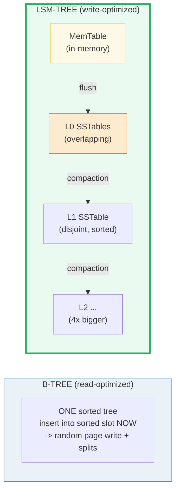
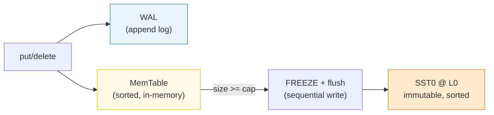
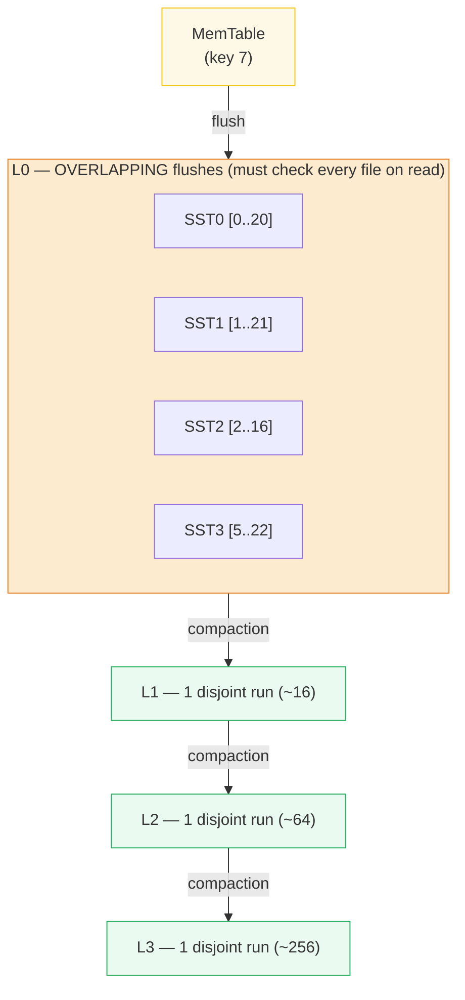
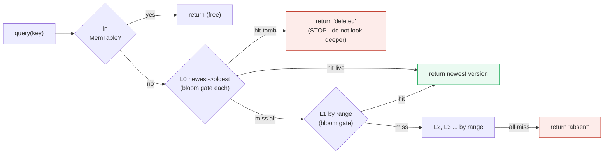
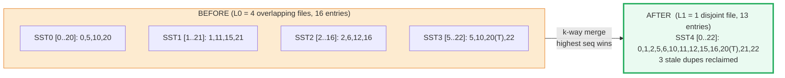
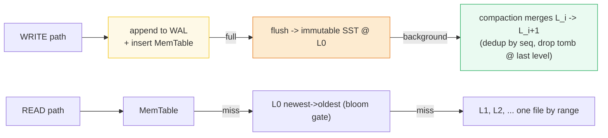

# LSM-tree — A Visual, Worked-Example Guide

> **Companion code:** [`lsm_tree.py`](./lsm_tree.py). **Every number, table, and
> amplification count in this guide is printed by `python3 lsm_tree.py`** —
> change the code, re-run, re-paste. Nothing here is hand-computed.
>
> **Live animation:** [`lsm_tree.html`](./lsm_tree.html) — open in a browser; it
> rebuilds the LSM in JS with the *identical* workload and gold-checks against
> the `.py`.
>
> **Source material:** O'Neil, Cheng, Gawlick, O'Neil, *"The Log-Structured
> Merge Tree"* (SIGMOD 1996); Bloom, *"Space/Time Trade-offs in Hash Coding with
> Allowable Errors"* (1970); Chang et al., *"Bigtable"* (OSDI 2006) for
> SSTables; LevelDB & RocksDB wikis; Kleppmann, *Designing Data-Intensive
> Applications*, Ch.3 *Storage and Retrieval*; Bayer & McCreight (1972) for the
> B-tree (the read-optimized counterpart).

---

## 0. TL;DR — write-optimized vs read-optimized

The single question that separates an LSM-tree from a B-tree:

> *On a write, do we shuffle the data into its sorted slot **now** (B-tree,
> expensive random write) or **later** in a batched background merge (LSM-tree,
> cheap append now, pay sorting during compaction)?*



- **B-tree** (PostgreSQL, InnoDB, SQLite): **one** sorted structure. Each write
  lands in its sorted leaf position **immediately** → a **random-position** page
  write (and occasionally a split). Reads are `O(log_B N)` page reads — one
  root-to-leaf descent. **Read-optimized.** 🔗 See [`HEAP_VS_CLUSTERED.md`](./HEAP_VS_CLUSTERED.md).
- **LSM-tree** (RocksDB, LevelDB, Cassandra, HBase, Bigtable): writes are
  **appended** to an in-memory **MemTable** (mirrored to a Write-Ahead Log);
  when the MemTable fills it is **frozen** into an immutable **SSTable** at L0;
  background **compaction** **merge-sorts** SSTables level by level (L_i → L_{i+1}),
  each level ~`SIZE_RATIO`× larger. **Write-optimized:** writes are always a
  sequential append; the sorting is **deferred + amortized** across thousands of keys.

> **One-line definitions:**
> - *MemTable* — in-memory sorted buffer; every write lands here first.
> - *SSTable* — **immutable** sorted file of `(key, value)`; created by a flush
>   or a compaction.
> - *level (L0..Lmax)* — L0 SSTables **overlap** (multiple flushes cover the same
>   keys); L1+ are **non-overlapping** (compaction sorts them into disjoint runs).
> - *compaction* — background **merge-sort** of one level into the next; drops
>   stale duplicates (highest `op_seq` wins) and tombstones at the last level.
> - *tombstone* — a delete marker (`value = None`); a read that hits one **stops**.

### The trade-off, in three flavors of amplification

| Cost | B-tree | LSM-tree | Winner |
|---|---|---|---|
| **Write amp** (disk writes per logical write) | ~**4×** | ~**T·L** (10–30×, leveling) | **B-tree** |
| **Read amp** (files checked on a point lookup) | `O(log N)` (1 path) | MemTable + every L0 SST + 1/level (**bloom** → ~1) | **B-tree** |
| **Write throughput** (seeks avoided) | random writes | **sequential appends** | **LSM** (10–100×) |
| **Space amp** (stale duplicates on disk) | ~0 (in-place) | until compaction (≤ ~1/T) | **B-tree** |

> From `lsm_tree.py` **Section E** (write amp) and **GOLD** (read amp):
>
> | metric | B-tree | LSM (toy, measured) | LSM (real, steady-state) |
> |---|---|---|---|
> | write amp | ~4× | **3.18×** (tiny toy) | ~10–30× (T=10) |
> | read amp (point, no bloom) | `O(log N)` | **5 files** (key 0, worst case) | 1 + \|L0\| + L |
> | read amp (point, with bloom) | — | **1 SST read** (key 0) | ~1 (amortized) |

### Glossary

| Term | Plain meaning |
|---|---|
| **MemTable** | in-memory sorted buffer (red-black tree / skip list / sorted dict). Every write lands here first; mirrored to the WAL so a crash can replay it |
| **WAL** | Write-Ahead Log. Append-only file recording every put/delete *before* it touches the MemTable. The durability guarantee |
| **SSTable** | Sorted String Table. An **immutable**, sorted, file-resident `(key, value)` list. Carries a min/max key range and a Bloom filter |
| **L0 / L1 / …** | the levels. L0 SSTables **overlap** (flushes cover the same keys); L1+ are **disjoint** (compaction). Each level ~`SIZE_RATIO`× bigger |
| **tombstone** | a DELETE marker (`value = None`). A read that hits one **stops**; dropped only when compacted into the **last** level |
| **op_seq** | monotonic per-operation sequence number. Same key in several SSTs → the **highest** seq is the live version (like MVCC `xmin`/`xmax`) |
| **compaction** | background **merge-sort** of level L (+ existing L+1 run) → one new disjoint SSTable at L+1; drops stale dupes + (at last level) tombstones |
| **bloom filter** | per-SSTable probabilistic set-membership test; answers "could this key be here?" — **no** ⇒ skip the file (no I/O); **maybe** ⇒ read (a false positive just costs 1 extra read) |
| **leveling** | 1 sorted run per level (LevelDB/RocksDB). Write amp ~T·L, low space amp |
| **tiering** | up to T runs per level (Cassandra default). Write amp ~L, higher write throughput, worse read/space amp |

🔗 *This guide contrasts with [`HEAP_VS_CLUSTERED.md`](./HEAP_VS_CLUSTERED.md)
(the B-tree / clustered-table side). For the page-level storage that an SSTable
is built from, see [`SLOTTED_PAGE.md`](./SLOTTED_PAGE.md) and
[`TUPLE_FORMAT.md`](./TUPLE_FORMAT.md).*

---

## 1. Key facts & formulas (all asserted in `lsm_tree.py`)

```
size of level L        = SIZE_RATIO ** L * memtable_capacity       (leveling)
write amp (leveling)   ~ SIZE_RATIO * num_levels                   (O'Neil 1996)
write amp (tiering)    ~ num_levels
write amp (B-tree)     ~ 4                                            (Kleppmann DDIA)
bloom filter FPR       = (1 - e^(-k*n/m))^k   with  k = (m/n)*ln2   (Bloom 1970)
read amp (point, no bloom) = 1 + |L0 files| + (num_levels - 1)
read amp (point, bloom)    ~ 1 + FPR * num_files                     (amortized ~1)
space amp (leveling)       <= ~1/T                                    (bounded by 1 level in flight)

GOLD identity (this toy, no bloom, L0 = 4 overlapping SSTs):
   worst-case point read = MemTable + 4 L0 files = 5 files_checked, 4 sst_reads.
   with a bloom filter   -> 1 sst_read (3 newer blooms say 'not here').
```

| Fact | Detail | Source |
|---|---|---|
| Writes are **sequential appends** | every put goes to WAL + MemTable; SSTables are write-once, never edited | O'Neil 1996; RocksDB wiki |
| L0 SSTables **overlap** | several flushes cover the same keys → reads must check *every* L0 file | LevelDB docs |
| L1+ are **non-overlapping** | compaction produces disjoint key ranges → 1 candidate file per level | O'Neil 1996 |
| A tombstone **stops** the read | hitting a delete marker returns not-found without looking deeper (else a stale older version resurfaces) | RocksDB wiki |
| Tombstones are dropped **only at the last level** | otherwise they'd stop hiding an older live version deeper down | RocksDB wiki |
| Highest `op_seq` wins on merge | compaction keeps the newest version per key (recency resolution) | Bigtable 2006 |

---

## 2. MemTable insert + flush — Section A

A write is appended to the **WAL** (durability) and inserted into the in-memory
**MemTable** (a sorted map). When the MemTable reaches `MEMTABLE_CAPACITY`, it is
**frozen** and **flushed** to a new immutable **SSTable** at L0 — a sequential,
sorted write. **No existing file is touched.**

> From `lsm_tree.py` **Section A** — the MemTable filling, then the flush:
>
> ```
>   op0: put(key=10, value='v10')   memtable = [(10, ('v10', 0))]
>   op1: put(key=0, value='v0')     memtable = [(0, ('v0', 1)), (10, ('v10', 0))]
>   op2: put(key=20, value='v20')   memtable = [(0,..), (10,..), (20, ('v20', 2))]
>   op3: put(key=5, value='v5')     FULL -> FLUSH -> SST0@L0(4 [0..20])
>
>   The flush produced ONE immutable SSTable:  SST0@L0(4 [0..20])
>     min_key=0  max_key=20  entries=4
>     bloom: m=40 bits, k=7 hashes (theory FPR=0.82%)
>     contents (key, value, op_seq):
>       key=  0  value='v0'   seq=1
>       key=  5  value='v5'   seq=3
>       key= 10  value='v10'  seq=0
>       key= 20  value='v20'  seq=2
> ```



> **Why immutable + sorted-on-flush:** immutability means no locks on read (a
> reader just pins a file); sorting makes the file **binary-searchable** and
> lets compaction do a cheap k-way **merge**. The `op_seq` is how compaction
> later decides which version of a key wins.

---

## 3. Level structure — Section B

SSTables live on **levels**. **L0** is the direct output of flushes → its files
**overlap**. **Compaction** merges each level into the next as a single
**non-overlapping** run; each deeper level holds ~`SIZE_RATIO`× more data, which
**amortizes** the merge cost.

> From `lsm_tree.py` **Section B** — level sizes (toy: `MEMTABLE_CAPACITY=4`,
> `SIZE_RATIO=4`, 4 levels):
>
> ```
>   | level | files in leveling | key ranges   | steady-state size (entries) |
>   |-------|-------------------|--------------|------------------------------|
>   | L0    | many (flushed)    | OVERLAPPING  | ~4 x #flushes                |
>   | L1    | 1 sorted run      | disjoint     | ~16                          |
>   | L2    | 1 sorted run      | disjoint     | ~64                          |
>   | L3    | 1 sorted run      | disjoint     | ~256                         |
>
>   Steady-state total ~ 340 entries across 4 levels.
>   (Real system: MemTable ~1M entries, SIZE_RATIO=10, 7 levels L0..L6 ->
>    sizes 1M, 10M, 100M, ..., 10^6 M. Each level 10x the previous.)
>
>   Actual L0 of the canonical build (4 OVERLAPPING SSTables):
>     SST0@L0(4 [0..20]): keys=[0, 5, 10, 20]
>     SST1@L0(4 [1..21]): keys=[1, 11, 15, 21]
>     SST2@L0(4 [2..16]): keys=[2, 6, 12, 16]
>     SST3@L0(4 [5..22]): keys=[5, 10, 20, 22]
>
>   [check] L0 ranges overlap? [(0, 20), (1, 21), (2, 16), (5, 22)] -> True -> OK
> ```



> **Why levels exist:** they **amortize** compaction work. Instead of re-sorting
> the whole database on every write, an LSM only re-merges a *small* level into
> the next-larger one. The geometric size growth means each entry is rewritten
> only ~`SIZE_RATIO` times across its whole lifetime (§6).

---

## 4. Read path — Section C

A point lookup checks, in order, and **stops at the first hit** (live value *or*
tombstone): MemTable → L0 (newest→oldest, **every** file because they overlap) →
L1, L2, … (one file **by range**, because they're disjoint).

> From `lsm_tree.py` **Section C** — point lookups on the canonical build
> (MemTable holds key 7; L0 = 4 overlapping SSTs):
>
> ```
>   | key | value      | reason    | files_checked | sst_reads | bloom_skips |
>   |-----|------------|-----------|---------------|-----------|-------------|
>   |   7 | 'v7'       | memtable  | 1             | 0         | 0           |
>   |   5 | 'v5b'      | sst       | 2             | 1         | 0           |
>   |  10 | 'v10b'     | sst       | 2             | 1         | 0           |
>   |  20 | <absent>   | tombstone | 2             | 1         | 0           |
>   |   0 | 'v0'       | sst       | 5             | 1         | 3           |
>   |  99 | <absent>   | absent    | 5             | 0         | 4           |
> ```



- **key 7** → found in the MemTable (1 check, 0 SST reads).
- **key 5** → found in the **newest** L0 SST; the update `v5b` (seq 12) wins over
  the older `v5` (seq 3) in SST0.
- **key 20** → **tombstone** in the newest L0 SST → **stop**, return deleted.
  *If we kept looking, the old value `v20` in SST0 would resurface — the bug
  tombstones exist to prevent.*
- **key 0** → **worst case:** absent from every newer SST, found only in the
  **oldest** L0 SST. `files_checked=5`. **This** is the cost of L0 overlap: with
  no bloom filter we read every L0 file. (With a bloom: the 3 newer blooms say
  "definitely not 0" → only 1 real SST read. See §8.)
- **key 99** → truly absent → scans MemTable + every L0 file before giving up.

> 🔗 **Read amplification** is the LSM's main read-time weakness vs a B-tree's
> single root-to-leaf path. Bloom filters (§8) and compaction (which empties L0)
> bound it. The gold check proves `query(k) == ground-truth dict` for every key.

---

## 5. Compaction — Section D

Compaction is the background **merge-sort**: read all SSTables at level L *plus*
the existing run at L+1, **merge by key** (highest `op_seq` wins per key),
**drop stale duplicates** (+ tombstones at the last level), write **one** new
non-overlapping SSTable to L+1.

> From `lsm_tree.py` **Section D** — L0 → L1 compaction of the canonical build:
>
> ```
> BEFORE compaction:  L0 = 4 files, 16 physical entries
>     SST0@L0(4 [0..20]): keys=[0, 5, 10, 20]
>     SST1@L0(4 [1..21]): keys=[1, 11, 15, 21]
>     SST2@L0(4 [2..16]): keys=[2, 6, 12, 16]
>     SST3@L0(4 [5..22]): keys=[5, 10, 20, 22]
>
> MERGE-SORT (all L0 + existing L1) -> ONE new SSTable at L1:
>     SST4@L1(13 [0..22])
>     keys=[0, 1, 2, 5, 6, 10, 11, 12, 15, 16, 20, 21, 22]
>
> AFTER compaction:   L0 = 0 files ; L1 = 1 file (13 entries)
>     reclaimed 3 stale entries ...
>
>   Dedup decisions made by the merge (highest op_seq wins):
>     key 5 : SST0 had v5  (seq 3)  vs SST3 had v5b  (seq 12) -> v5b  wins
>     key 10: SST0 had v10 (seq 0)  vs SST3 had v10b (seq 13) -> v10b wins
>     key 20: SST0 had v20 (seq 2)  vs SST3 had <tomb> (seq 14) -> tombstone kept
>            (NOT the last level -> tombstone survives so a deeper v20 stays hidden)
>
>   [check] compact(0): source SSTs=4, output entries=13, reclaimed=3 -> OK
> ```



> **Tombstone lifecycle:** a delete writes a tombstone (newer than the live
> value). Reads stop at it. The tombstone **persists** through L0→L1, L1→L2, …
> and is **physically dropped only** when compacted into the **last** level —
> because only there is there nothing deeper for it to hide. Drop it too early
> and an older live version **resurfaces** (silent correctness bug).

---

## 6. Write amplification — Section E

**Write amplification** = (entries written to disk) ÷ (entries the user wrote).
Each entry is written once on flush (→L0), then **rewritten once per compaction**
as it climbs L0 → L1 → … → Lmax.

> From `lsm_tree.py` **Section E** — measured on the toy (pushed all the way to L3):
>
> ```
>   Toy run (canonical 17 ops, pushed all the way to L3):
>     logical writes (user puts+dels)    = 17
>     entries written on flush (->L0)    = 16
>     entries rewritten by compaction    = 38  (L0->L1, L1->L2, L2->L3)
>     TOTAL physical entry-writes        = 54
>     measured WRITE AMP                 = 54/17 = 3.18x
>
>   Steady-state WRITE AMP (O'Neil 1996 / Kleppmann DDIA Ch.3):
>     B-tree            : ~4x    (1 page write + WAL + occasional splits)
>     LSM tiering       : ~L     (each entry written once per level)
>     LSM leveling      : ~T*L   (each merge rewrites ~(T) existing per new unit)
>
>   | policy            | T  | L | write amp | who uses it            |
>   |-------------------|----|---|-----------|------------------------|
>   | B-tree            | -  | - | ~4x       | PostgreSQL, InnoDB, SQLite |
>   | LSM tiering       | 10 | 4 | ~4x       | Cassandra (default)    |
>   | LSM leveling      | 10 | 4 | ~40x      | RocksDB/LevelDB        |
>   | LSM leveling      | 10 | 3 | ~30x      | RocksDB (tuned, write-heavy) |
> ```


> **The deal:** an LSM does ~5–10× *more total write work* than a B-tree, **but**
> every write is a **sequential append** → ~10–100× better write **throughput**
> (no random seeks). The B-tree pays per-write **seek** latency; the LSM pays it
> back in background CPU+IO during compaction. **Pick LSM for write-heavy,
> B-tree for read-heavy.** For the B-tree side see
> [`HEAP_VS_CLUSTERED.md`](./HEAP_VS_CLUSTERED.md).

---

## 7. Space amplification — Section F

**Space amplification** = (physical bytes on disk) ÷ (logical bytes) − 1.
Updates/deletes never edit old SSTables (immutable) → old versions **stay** on
disk until compaction reclaims them.

> From `lsm_tree.py` **Section F** — before vs after L0→L1 compaction:
>
> ```
> BEFORE compaction (L0 = 4 SSTables):
>     physical entries on disk (all SSTs) = 16
>     unique keys in SSTs                 = 13
>     stale duplicates                    = 3
>     space amplification                 = 3/13 = 23.1%
>     stale entries (each shadowed by a newer version or tombstone):
>       key   5 = 'v5'   in SST0 (newer copy in SST3)
>       key  10 = 'v10'  in SST0 (newer copy in SST3)
>       key  20 = 'v20'  in SST0 (newer copy in SST3)
>
> AFTER L0->L1 compaction:
>     physical entries = 13   (stale duplicates -> 0)
>     space amplification -> ~0%
>
>   WORST-CASE BOUND (leveling): at most ~one level's worth of data is
>   'in flight' during a compaction, so space amp <= ~1/T (~25% here, ~10% for T=10).
>   Tiering can hold up to (T-1) runs per level -> worse space amp.
> ```

> **Worst-case bound (leveling):** at most ~one level's worth of data is "in
> flight" during a compaction, so space amp ≤ ~`1/T` (~10% for `T=10`). **Tiering**
> can hold up to `T−1` runs per level → worse space amp. This is *temporary* —
> compaction always drives it back toward 0.

---

## 8. Bloom filters — Section G

Every SSTable ships with a **Bloom filter** (Bloom 1970) over its keys. Before
reading an SSTable on a point lookup, ask the bloom: *"could this key be here?"*
**No** ⇒ skip the file (no I/O). **Maybe** (a false positive) ⇒ read and find
nothing. The FPR is `p = (1 − e^(−kn/m))^k` with optimal `k = (m/n)·ln2`.

> From `lsm_tree.py` **Section G** — per-SST blooms (10 bits/key) and the
> read-amp reduction:
>
> ```
>   | sst  | keys             | m  | k | theory FPR |
>   |------|------------------|----|---|------------|
>   | SST0 | [0, 5, 10, 20]   | 40 | 7 | 0.82%       |
>   | SST1 | [1, 11, 15, 21]  | 40 | 7 | 0.82%       |
>   | SST2 | [2, 6, 12, 16]   | 40 | 7 | 0.82%       |
>   | SST3 | [5, 10, 20, 22]  | 40 | 7 | 0.82%       |
>
>   Read amplification WITHOUT vs WITH bloom (canonical build):
>     | key | reason    | sst_reads NO bloom | sst_reads WITH bloom | bloom_skips |
>     |-----|-----------|---------------------|----------------------|-------------|
>     |   0 | sst       | 4                   | 1                    | 3           |
>     |  99 | absent    | 4                   | 0                    | 4           |
>     |   5 | sst       | 1                   | 1                    | 0           |
>     |  20 | tombstone | 1                   | 1                    | 0           |
>
>   Empirical FPR on a bigger bloom (n=1000 keys, 10 bits/key, 10000 probes):
>     m=10000, k=7, theory FPR = 0.819%
>     empirical FP = 85/10000 = 0.850%
> ```

> For the worst-case **key 0** (only in the *oldest* L0 SST), the bloom turns
> **4 SST reads into 1**: the 3 newer SSTs' blooms all answer "definitely not 0".
> With ~0.8% FPR, ~99.2% of absent probes are skipped for free.

---

## 9. The GOLD values (pinned for `lsm_tree.html`)

> From `lsm_tree.py` **GOLD block** (canonical build, **no** bloom, L0 = 4 overlapping SSTs):
>
> ```
>   | key | value      | reason    | files_checked | sst_reads |
>   |-----|------------|-----------|---------------|-----------|
>   |   7 | 'v7'       | memtable  | 1             | 0         |
>   |   5 | 'v5b'      | sst       | 2             | 1         |
>   |  10 | 'v10b'     | sst       | 2             | 1         |
>   |  20 | <absent>   | tombstone | 2             | 1         |
>   |   0 | 'v0'       | sst       | 5             | 4         |
>   |  99 | <absent>   | absent    | 5             | 4         |
>
>   GOLD compaction: L0 files 4 -> 0 ; L1 files 0 -> 1 ; L1 entries = 13
>     L1 keys = [0, 1, 2, 5, 6, 10, 11, 12, 15, 16, 20, 21, 22]
>
>   [check] LSM point query == plain-dict ground truth (considering tombstones): OK
>   [check] gold values match pinned expected -> OK
> ```
>
> [`lsm_tree.html`](./lsm_tree.html) rebuilds the canonical LSM in JS from the
> *same* `INSERT_OPS`, runs the read path + compaction, and checks every value
> above (badge: **check: OK**). The headline invariant: **an LSM point query
> returns the same value as a flat dict, tombstones included.**

---

## 10. Pitfalls & debugging checklist

| # | Mistake / surprise | Symptom | Reality |
|---|---|---|---|
| 1 | Stopping the read at the *first* SST without checking recency | stale value returned | Always check **newest→oldest** and keep the **highest `op_seq`**; older SSTs hold superseded versions |
| 2 | Dropping a tombstone before the last level | deleted keys **resurface** with their old value | Keep tombstones until compaction into the **last** level; only there is nothing left to hide |
| 3 | Treating L0 like L1+ on reads (picking one file by range) | missed keys | L0 SSTables **overlap** — you must consider **every** L0 file (or rely on its bloom) |
| 4 | Expecting LSM point reads to be as fast as a B-tree | high p99 latency | Read amp = MemTable + every L0 file + 1/level; mitigate with **bloom filters**, a small L0, and timely compaction. A B-tree's single root-to-leaf path is inherently cheaper per-point |
| 5 | Assuming updates edit SSTables in place | wrong mental model | SSTables are **immutable**; updates create new entries in newer files — the old one stays until compaction (space amp, §7) |
| 6 | Forgetting WAL = durability | data loss on crash after a "successful" write | Every op is appended to the WAL **before** the MemTable; on crash the WAL is replayed. fsync the WAL before acking the write |
| 7 | Compaction falling behind under write pressure | read latency spikes, disk fills (space amp grows) | Compaction is the LSM's Achilles heel — tune `SIZE_RATIO`, level count, and rate-limit writes (RocksDB `write_rate_fsync`) to keep the levels from piling up |
| 8 | Counting write amp as "~1" because writes append | under-provisioned disks | Each byte is rewritten ~once per level (leveling ~T·L ≈ 10–30×); the SSD wears out faster than a B-tree would for the same logical writes |

---

## 11. Cheat sheet



- **Write:** WAL + MemTable (sorted, in-memory) → flush to immutable **L0 SST**
  (sequential) → background **compaction** merge-sorts levels (L_i → L_{i+1}),
  each ~`SIZE_RATIO`× larger. Writes are always **appends**.
- **Read:** MemTable → L0 (**every** file, overlapping) → L1+ (**one** file by
  range, disjoint). **Stop** at first hit — live value *or* tombstone.
- **Compaction:** k-way **merge**, highest `op_seq` wins; **drop stale dupes**;
  **drop tombstones only at the last level**. Reclaims space, empties L0.
- **Amplification:** write amp ~`T·L` (leveling), ~`L` (tiering), B-tree ~4×.
  read amp cut ~to 1 by **bloom filters** (FPR `(1−e^(−kn/m))^k`). space amp ≤ ~`1/T`.
- **Pick LSM** for write-heavy / time-series / large-keyed workloads
  (Cassandra, HBase, RocksDB). **Pick B-tree** for read-heavy / OLTP / point
  queries (PostgreSQL, InnoDB). 🔗 [`HEAP_VS_CLUSTERED.md`](./HEAP_VS_CLUSTERED.md).

---

## Sources

1. **O'Neil, Cheng, Gawlick, O'Neil (1996)**, *"The Log-Structured Merge Tree"*
   (SIGMOD) — the original LSM-tree: in-memory tree + log, multi-level merging,
   write-optimized. Verified: leveling/tiering size ratios, write-amp formulas.
2. **Bloom (1970)**, *"Space/Time Trade-offs in Hash Coding with Allowable
   Errors"* — the Bloom filter; FPR `(1 − e^(−kn/m))^k`, optimal `k = (m/n)·ln2`.
3. **Chang et al. (2006)**, *"Bigtable: A Distributed Storage System for
   Structured Data"* (OSDI) — made SSTables + MemTable + compaction the canonical
   vocabulary for the whole LSM family.
4. **Kleppmann**, *Designing Data-Intensive Applications*, Ch.3 *Storage and
   Retrieval* — SSTables, LSM-trees vs B-trees; write amp ~4× (B-tree) vs
   ~10–30× (LSM); read/space amplification trade-offs.
5. **LevelDB** (Ghemawat & Dean, 2011) and **RocksDB** (Facebook, 2013) wikis —
   leveling compaction, bloom filters per SSTable, tombstone lifecycle, WAL.
6. **Bayer & McCreight (1972)**, *"Organization and Maintenance of Large Ordered
   Indexes"* — the B-tree, the read-optimized counterpart contrasted throughout.
7. **Ramakrishnan & Gehrke**, *Database Management Systems*; **Silberschatz/
   Korth/Sudarshan**, *Database System Concepts* — index cost models.

---

### 🔗 Companion files & siblings

- **[`lsm_tree.py`](./lsm_tree.py)** — ground-truth reference impl (run: `python3 lsm_tree.py`).
- **[`lsm_tree_output.txt`](./lsm_tree_output.txt)** — captured stdout, for auditing this guide without running.
- **[`lsm_tree.html`](./lsm_tree.html)** — interactive with animated write/read/compaction paths and **check: OK**.
- Sibling bundles: [`HEAP_VS_CLUSTERED.md`](./HEAP_VS_CLUSTERED.md) (the B-tree / clustered-table counterpart),
  [`SLOTTED_PAGE.md`](./SLOTTED_PAGE.md) (the page format an SSTable is built from),
  [`TUPLE_FORMAT.md`](./TUPLE_FORMAT.md) (MVCC version chains), [`OVERFLOW_PAGES.md`](./OVERFLOW_PAGES.md),
  [`FREE_SPACE_MAP.md`](./FREE_SPACE_MAP.md), [`PAGE_EVICTION.md`](./PAGE_EVICTION.md).

> Part of the database-internals tutorial series. See [`HOW_TO_RESEARCH.md`](./HOW_TO_RESEARCH.md)
> for the bundle workflow. Every number above traces to a
> `> From lsm_tree.py Section X:` callout.
