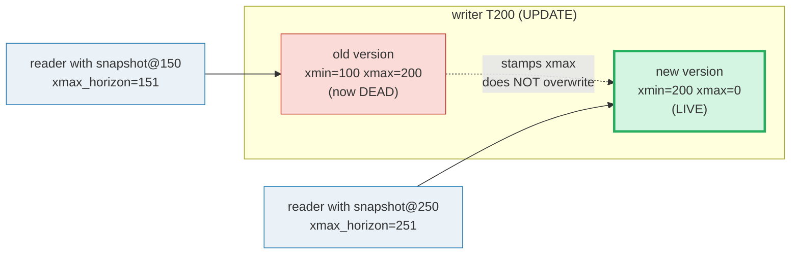
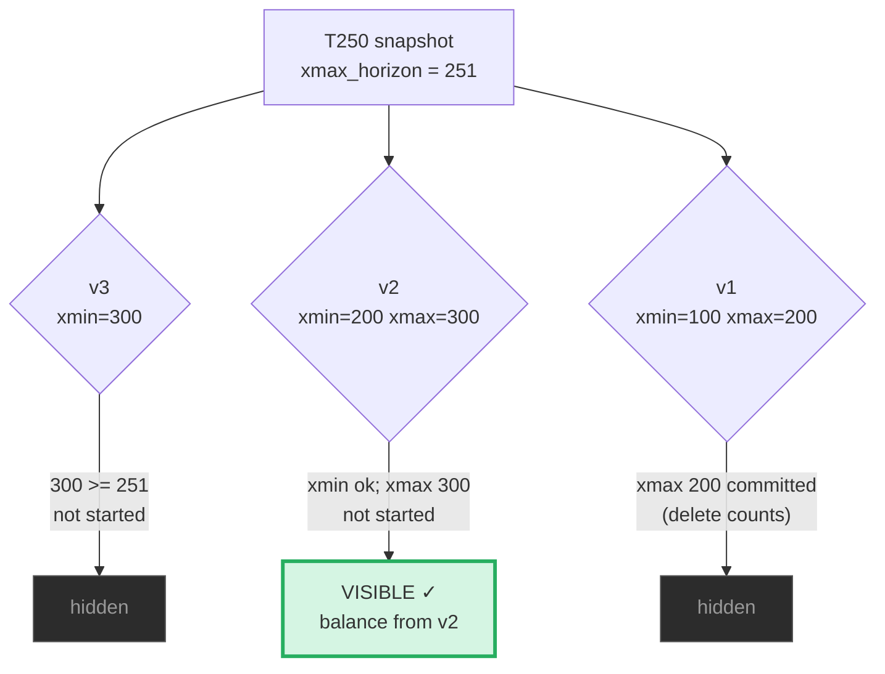
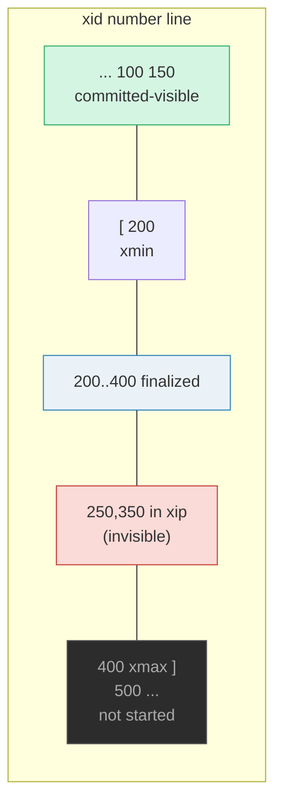
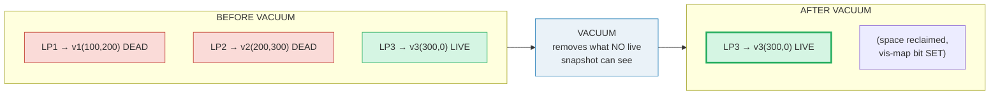
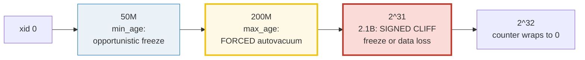

# Multi-Version Concurrency Control (MVCC) — A Visual, Worked-Example Guide

> **Companion code:** [`mvcc.py`](./mvcc.py). **Every visibility decision, snapshot,
> timeline, and threshold in this guide is printed by `python3 mvcc.py`** — change
> the code, re-run, re-paste. Nothing here is hand-computed.
>
> **Live animation:** [`mvcc.html`](./mvcc.html) — open in a browser; it recomputes
> the *same* visibility engine in JS and gold-checks against the `.py`.
>
> **Source material:** PostgreSQL source `src/backend/utils/time/heapam_visibility.c`
> (`HeapTupleSatisfiesMVCC`) & `utils/snapshot.h`; PostgreSQL docs §13.2
> *Transaction Isolation* & §70.4 *Visibility Map* & §25.1.5 *Routine Vacuuming*
> & §73.6 *How VACUUM Works*; Berenson et al., *A Critique of ANSI SQL Isolation
> Levels*, SIGMOD 1995 (snapshot isolation); Bernstein & Goodman, *Concurrency
> Control in Distributed Database Systems*, ACM Comput. Surv. 1981; Silberschatz/
> Korth/Sudarshan, *Database System Concepts* §16.

---

## 0. TL;DR — the row that keeps its old drafts

**MVCC** lets a database run many transactions at once **without readers blocking
writers or writers blocking readers**. The trick: a row is never overwritten in
place. Every `UPDATE`/`DELETE` leaves the **old version on the page** and stamps it
with a transaction ID, then writes a **new version**. Each version carries:

- **`t_xmin`** — the transaction id (xid) that **created** this version (the insert).
- **`t_xmax`** — the xid that **superseded** this version (a later delete/update). `0` = still alive.

A transaction reads a row by walking its **version chain** and picking the **one**
version whose `xmin`/`xmax` match the transaction's **snapshot**. Two concurrent
transactions simply pick *different* versions — they never fight over the same bytes.

> *Think of each row as a **stack of drafts**, not an overwritten value. When you
> UPDATE, the database writes a NEW draft and stamps the OLD draft "superseded by
> transaction X" — but leaves the old draft sitting on the page. A reader walks the
> stack and picks the draft whose stamps match its own snapshot. Two transactions
> running at once just pick DIFFERENT drafts, so they never block each other. The
> cost: old drafts (dead tuples) pile up until **VACUUM** sweeps them away; and the
> 32-bit transaction counter can **wrap around**, so old drafts must be **frozen**
> before their xmin gets reused.*



- **Reader never blocks writer, writer never blocks reader** — they touch different
  drafts. Locks are only taken on write/write conflict, not on read.
- **The version chain** grows with every update; the single visible version is
  chosen by the snapshot (§1).
- **Isolation = snapshot policy**: `READ COMMITTED` re-takes the snapshot per
  statement (§3); `REPEATABLE READ` pins one snapshot for the whole transaction (§4).
- **Dead tuples** (old drafts no snapshot needs) are reclaimed by **VACUUM** (§5).
- **XID wraparound**: the 32-bit counter reuses ids; old tuples are **frozen** first (§6).

### Why it matters

Without MVCC, a single long `SELECT` would block every `UPDATE` on the table (or
read uncommitted/dirty data). MVCC gives you a consistent snapshot **and** full
read/write concurrency. The price you pay — and must actively manage — is **bloat**
(dead tuples) and **wraparound** risk, both solved by a healthy VACUUM/autovacuum.

### Glossary

| Term | Plain meaning |
|---|---|
| **tuple / version** | one draft of a row, at a `(page, offset)` = TID. Carries `t_xmin`, `t_xmax`, data. 🔗 [`TUPLE_FORMAT.md`](./TUPLE_FORMAT.md) |
| **t_xmin** | the xid that **inserted** this version. |
| **t_xmax** | the xid that **superseded** this version (`0` = alive; set = a later delete/update replaced it). |
| **xid** | transaction id — a 32-bit counter assigned in start order. |
| **snapshot** | a transaction's frozen answer to "which transactions count as committed *for me*?" |
| **xmin (snapshot)** | lowest in-progress xid. Every xid `< xmin` is **finalized** (committed/aborted). |
| **xmax (snapshot)** | next xid to be assigned. Every xid `>= xmax` has **not started** → invisible. |
| **xip** | the **in-progress list**: xids in `[xmin, xmax)` still running at snapshot time → invisible. |
| **dead tuple** | a version no live snapshot can ever read again (its xmax is committed-visible to all). |
| **VACUUM** | removes dead tuples, reclaims space, sets the visibility-map bit, **freezes** old xids. 🔗 [`FREE_SPACE_MAP.md`](./FREE_SPACE_MAP.md) |
| **frozen xid** | magic xmin (`FrozenTransactionId == 2`) = "permanently committed". Dodges wraparound. |

---

## 1. Tuple visibility — the `xmin`/`xmax` version chain

A version is **visible** to a snapshot iff:

1. its **inserter** (`xmin`) **committed and is visible** to the snapshot, **and**
2. its **superseder** (`xmax`) is `0`, aborted, or **not yet** committed-visible.

> From `mvcc.py` **Section A** — row 1 has 3 versions (newest → oldest):
>
> ```
> Row 1's version chain (newest -> oldest):
>   Version(tag='alice-v3', xmin=300, xmax=0, payload='v3')
>   Version(tag='alice-v2', xmin=200, xmax=300, payload='v2')
>   Version(tag='alice-v1', xmin=100, xmax=200, payload='v1')
>
> Query transaction = T250 (runs between T200 and T300).
>   snapshot@250 = Snapshot(xmin=250, xmax=251, xip=[])
>   -> every xid < 250 is finalized; 250 is the querier (sees its own
>      writes specially); xids >= 251 (i.e. 300) have NOT STARTED yet,
>      so T300's UPDATE is invisible to T250.
> ```
>
> ```
> Visibility check per version:
>   | version   | xmin | xmin visible? why            | xmax | xmax visible? why            | result   |
>   |-----------|------|------------------------------|------|------------------------------|----------|
>   | alice-v3  | 300  | no  >= xmax (not started)    | 0    | 0 = never superseded         | hidden   |
>   | alice-v2  | 200  | YES committed & < xmax       | 300  | no  >= xmax (not started)    | VISIBLE  |
>   | alice-v1  | 100  | YES committed & < xmax       | 200  | YES committed & < xmax       | hidden   |
>
> For txid=250 the visible version is: Version(tag='alice-v2', xmin=200, xmax=300, payload='v2')
>
> Why v2:  inserter T200 is committed and visible (200 < xmax=251);
>          superseder T300 has NOT STARTED (300 >= xmax=251) so xmax is
>          invisible -> the delete does not count -> v2 is alive.
> [check] visibility(txid=250) -> v2 (alice-v2, xmin=200): OK
> ```

The whole of MVCC is in that one table. T250 sees **v2** because T200's insert is
committed-visible but T300 (the superseder) hadn't started yet, so v2's delete
"doesn't count." Three versions coexist on the page; each concurrent transaction
sees exactly one.



---

## 2. The snapshot — `xmin` horizon, `xmax` horizon, `xip`

A snapshot carves the xid number line into three regions. A transaction's effects
are visible iff it had **committed before** the snapshot was taken.

> From `mvcc.py` **Section B**:
>
> ```
>   xmin : lowest in-progress xid. Every xid < xmin is FINALIZED
>          (committed or aborted) -> its fate is decided.
>   xmax : next xid to be assigned. Every xid >= xmax has NOT STARTED
>          -> its effects are invisible ('not yet').
>   xip  : the in-progress list. xids in [xmin, xmax) still RUNNING at
>          snapshot time -> invisible ('still working').
> ```
>
> ```
> Worked snapshot  S = Snapshot(xmin=200, xmax=400, xip=[250, 350])
> commit log      : committed = [100, 150, 200, 300]
>                   (250, 350 are in xip -> their writes are invisible)
>
> Number line:
>    ... 100  150  [200=xmin ... 250,350 in xip ... 400=xmax]  500 ...
> ```
>
> ```
>   | tuple | xmin | xmin visible? why            | xmax | xmax visible? why            | visible? |
>   |-------|------|------------------------------|------|------------------------------|----------|
>   | p1    | 100  | YES committed & < xmax       | 0    | 0 = never superseded         | YES      |
>   | p2    | 250  | no  in xip (in progress)     | 0    | 0 = never superseded         | no       |
>   | p3    | 350  | no  in xip (in progress)     | 0    | 0 = never superseded         | no       |
>   | p4    | 500  | no  >= xmax (not started)    | 0    | 0 = never superseded         | no       |
>   | p5    | 150  | YES committed & < xmax       | 250  | no  in xip (in progress)     | YES      |
>   | p6    | 200  | YES committed & < xmax       | 300  | YES committed & < xmax       | no       |
>
> -> 2 of 6 probes visible: ['p1', 'p5']
>    p1 : plain live old row.
>    p5 : inserted long ago, but its DELETER (250) is still in progress,
>         so the delete does not count yet -> the row is still visible.
> [check] exactly 2 visible (p1, p5): OK
> ```

**Two subtleties worth memorizing:**

- **p2/p3** — an insert by a transaction still **in xip** is invisible, even though
  the inserter may later commit. You only see committed work.
- **p5** — an old row whose **deleter** is still in xip stays **visible**: the
  delete hasn't "happened" from this snapshot's viewpoint. (This is exactly why a
  long-running transaction blocks VACUUM in §5.)



---

## 3. READ COMMITTED — the non-repeatable read (fresh snapshot per statement)

`READ COMMITTED` takes a **fresh snapshot for every statement**. So a re-read inside
the **same** transaction can return a **different** value if another transaction
committed in between. That is a **non-repeatable read** — legal under READ COMMITTED.

> From `mvcc.py` **Section C** — `accounts(id=1, balance)`, row starts at `v1(balance=100)`:
>
> ```
> Timeline:
>   t0  T500 BEGIN
>   t1  T500 SELECT balance WHERE id=1   (fresh snapshot S1)
>   t2  T501 BEGIN
>   t3  T501 UPDATE balance=200 WHERE id=1;  COMMIT  (writes v2,
>        stamps v1.xmax=501)
>   t4  T500 SELECT balance WHERE id=1   (fresh snapshot S2)
>
>   S1 = Snapshot(xmin=500, xmax=501, xip=[])    (at t1 only 100 committed; 501 not started)
>   S2 = Snapshot(xmin=500, xmax=502, xip=[])    (at t4 501 has started AND committed -> visible)
>
>   read @ t1 : visibility(chain, S1) -> v1, balance = 100
>   read @ t4 : visibility(chain, S2) -> v2, balance = 200
>
> T500 read balance=100 at t1, then balance=200 at t4 -> a
> NON-REPEATABLE READ. Same transaction, same row, two different values,
> because READ COMMITTED re-took the snapshot and T501 slipped in.
> [check] RC: first read 100, second read 200 (non-repeatable): OK
> ```

The key is `S2.xmax = 502 > 501`: by t4, xid 501 has both started **and** committed,
so `committed_visible(501)` flips to true and v2 becomes visible.

```mermaid
sequenceDiagram
  participant T1 as T500 (READ COMMITTED)
  participant DB as version chain
  participant T2 as T501
  T1->>DB: t1 SELECT (snapshot S1, xmax=501) → v1, balance=100
  T2->>DB: t3 UPDATE balance=200 → write v2(501), stamp v1.xmax=501; COMMIT
  Note over DB: chain now: v2(501,0) live, v1(100,501) dead
  T1->>DB: t4 SELECT (FRESH snapshot S2, xmax=502) → v2, balance=200
  Note over T1: NON-REPEATABLE READ (100 → 200)
```

---

## 4. REPEATABLE READ — snapshot isolation (pin one snapshot)

`REPEATABLE READ` takes **one snapshot** at the transaction's first statement and
**reuses** it for every later statement. The snapshot is **pinned**: transactions
that commit later are invisible. Re-reads are therefore repeatable. (PostgreSQL's
REPEATABLE READ is Snapshot Isolation — Berenson 1995.)

> From `mvcc.py` **Section D** — **same timeline** as §3, only the snapshot rule differs:
>
> ```
>   pinned S = Snapshot(xmin=500, xmax=501, xip=[])   (captured at t1; xmax=501 -> 501 is 'not started')
>   under S, committed_visible(501) = (501 < 501)? -> False
>
>   read @ t1 : visibility(chain, S) -> v1, balance = 100
>   read @ t4 : visibility(chain, S) -> v1, balance = 100
>
> At t4 the chain also contains v2(xmin=501), but under the PINNED
> snapshot S, xid 501 is >= xmax (501 >= 501) -> 'not started' -> v2's
> insert is INVISIBLE. v1(xmin=100) is visible and its superseder 501 is
> also invisible -> v1 stays the visible version. T500 sees balance=100
> BOTH times.
> ```
>
> ```
>                   READ COMMITTED (Sec C)   REPEATABLE READ (Sec D)
>   read @ t1      balance = 100                 balance = 100
>   read @ t4      balance = 200                 balance = 100
>   repeatable?    NO  (non-repeatable read)   YES
> [check] RR: both reads 100 (repeatable); only difference from C is the
>        snapshot rule (reuse S vs take fresh S2): OK
> ```

The **entire** difference between §3 and §4 is one line: whether t4 uses a fresh
`S2` (`xmax=502`) or the pinned `S` (`xmax=501`). Under the pinned snapshot, 501 is
still "not started," so v2 stays invisible forever — the old version is **kept
alive** for this transaction by the snapshot. (This is also why a long REPEATABLE
READ transaction pins dead tuples and blocks VACUUM — §5.)

> ⚠ **Write anomaly to know**: Snapshot Isolation prevents non-repeatable reads but
> allows **write skew** (two transactions read overlapping data, both write based on
> the old snapshot, no direct write/write conflict). Preventing write skew requires
> `SERIALIZABLE`, which adds predicate-lock-like SIREAD tracking.

---

## 5. Dead tuple lifecycle — UPDATE bloats, VACUUM reclaims

`UPDATE` never overwrites. It writes a new version and stamps the old version's
`xmax`, leaving the old version on the page. Once **no live snapshot** can need the
old version, it is a **dead tuple**. Dead tuples accumulate = **bloat**. **VACUUM**
removes them, reclaims space, frees line pointers, and sets the visibility-map bit.

> From `mvcc.py` **Section E** — same 3-version chain as §1:
>
> ```
> Removable rule:  dead(v) = not visible under ANY live snapshot.
>
> Case 1 - the only open snapshot is S_now = Snapshot(xmin=301, xmax=301, xip=[]) (sees only v3):
>   | version | xmin | xmax | visible to S_now? | removable? |
>   |---------|------|------|--------------------|------------|
>   | v3      | 300  | 0    | yes                | no         |
>   | v2      | 200  | 300  | no                 | YES        |
>   | v1      | 100  | 200  | no                 | YES        |
>
>   BEFORE VACUUM                 AFTER VACUUM
>   -------------------------     -------------------------
>   line pointers : 3            line pointers : 1
>   dead tuples   : 2            dead tuples   : 0
>   live tuples   : 1            live tuples   : 1
>   free space    : low           free space    : reclaimed
>   vis-map bit   : clear         vis-map bit   : SET (all-visible)
> ```



### Why long-running transactions cause bloat

VACUUM can only remove a tuple that **no open transaction** can still read. A
long-running reader that opened its snapshot **before** an update still sees the
**old** version, so VACUUM must keep it:

> From `mvcc.py` **Section E**, Case 2 — an old snapshot `S_old = Snapshot(xmin=200, xmax=301, xip=[200])` is still open:
>
> ```
>   | version | visible to S_old? | removable now? |
>   |---------|--------------------|----------------|
>   | v3      | yes                | no             |
>   | v2      | no                 | YES            |
>   | v1      | yes                | no             |
>
>   v1 is STILL VISIBLE to S_old (its superseder 200 is in xip -> the
>   delete does not count). So VACUUM MUST RETAIN v1. This is why
>   long-running transactions stall VACUUM and cause bloat: VACUUM can
>   only remove what NO open transaction can still read.
> [check] with S_old open, v1 is retained (not removable): OK
> ```

**Takeaway:** a single `SELECT ... ; <wait an hour> ; ...` or an idle-in-transaction
session holds back the global xmin horizon, preventing VACUUM everywhere and growing
bloat. This is the #1 operational MVCC failure. 🔗 The visibility map VACUUM sets is a
sibling of the free space map in [`FREE_SPACE_MAP.md`](./FREE_SPACE_MAP.md), and is
what [`COVERING_INDEX.md`](./COVERING_INDEX.md) Index-Only Scans depend on.

---

## 6. XID wraparound — freeze old tuples before the counter wraps

Transaction ids are a **32-bit counter** (2³² ≈ 4.3 billion). Eventually it **wraps**
back to 0 and reuses old xids. A tuple stamped `xmin=1000` would then be confused
with a brand-new xid 1000 → visibility silently breaks (**data loss**).

**Defense:** VACUUM **freezes** old tuples first — overwrites their `xmin` with
`FrozenTransactionId` (`== 2`), a marker meaning "committed forever". Once frozen,
the original xid is unreferenced and safe to reuse. XIDs are compared as **signed
32-bit offsets** mod 2³²: an old xid is "older" while `(curr − old) mod 2³² < 2³¹`;
at the **2³¹ cliff** the sign flips and the old tuple looks "in the future".

> From `mvcc.py` **Section F** (oldest unfrozen tuple `xmin = 1000`):
>
> ```
>   |      current_xid | distance = curr-old | vs thresholds                     | action                                          |
>   |------------------|---------------------|-----------------------------------|-------------------------------------------------|
>   |       60,000,000 |          59,999,000 | min_age(50M) <= d < max_age(200M) | normal VACUUM freezes opportunistically         |
>   |      200,001,000 |         200,000,000 | d == max_age(200M)                | FORCED anti-wraparound autovacuum               |
>   |    1,000,000,000 |         999,999,000 | d < 2^31 (still comparable)       | freeze overdue but still safe                   |
>   |    2,147,484,647 |       2,147,483,647 | d == 2^31 - 1 (edge)              | last safe moment - sign about to flip           |
>   |    2,147,484,648 |       2,147,483,648 | d == 2^31 (CLIFF)                 | sign flips: old xid looks 'future' -> DATA LOSS |
>
>   (the FORCED autovacuum at d == max_age(200M) CANNOT be disabled - it
>    runs even if autovacuum is turned off, to prevent wraparound.)
> ```
>
> ```
> If not frozen, after a full wrap the old xid is reused and visibility
> breaks. With freezing, xmin becomes FrozenXid(2) -> always visible:
>
>   current_xid = 5 (just wrapped)
>   distance to xmin=1000 = 4,294,966,301  (>= 2^31 -> sign flip)
>   unfrozen tuple: looks 'in the future' -> INVISIBLE -> data loss
>   frozen tuple:   xmin == 2 -> committed_visible -> True for
>                   ANY snapshot -> SAFE across the wrap.
> [check] committed_visible(FrozenXid=2) == True even with an
>        EMPTY commit log and a wrapped snapshot: OK
> [check] freeze thresholds 50M / 200M, cliff distance == 2^31: OK
> ```

Two PostgreSQL knobs to know (defaults shown):
- `vacuum_freeze_min_age = 50,000,000` — age at which a tuple becomes eligible to be
  frozen during an opportunistic VACUUM.
- `autovacuum_freeze_max_age = 200,000,000` — when the table's **oldest unfrozen**
  xid reaches this age, a **forced, unstoppable** anti-wraparound autovacuum runs,
  *even if autovacuum is disabled*. This is the hard safety net before the 2³¹ cliff.

If a database ever reaches the cliff with unfrozen tuples (e.g. autovacuum disabled
**and** no manual VACUUM **and** counter advanced ~2³¹), PostgreSQL will **shut
itself down** to avoid silent corruption and require single-user manual freeze
repair. Never disable autovacuum.



---

## 7. Cheat sheet

| | rule |
|---|---|
| **visible(version)** | `committed_visible(xmin)` AND (`xmax==0` OR `not committed_visible(xmax)`) |
| **committed_visible(xid)** | `xid < snap.xmax` AND `xid not in snap.xip` AND `xid in commit_log` (or frozen) |
| **READ COMMITTED** | fresh snapshot per statement → non-repeatable reads possible |
| **REPEATABLE READ** | one pinned snapshot → reads repeatable (allows write skew) |
| **dead tuple** | not visible to ANY live snapshot → VACUUM-removable |
| **VACUUM** | remove dead tuples, reclaim space, set vis-map bit, freeze old xids |
| **freeze** | overwrite `xmin` with `FrozenXid(2)` before `(curr−xmin) mod 2³²` hits 2³¹ |
| **anti-wraparound** | forced at `autovacuum_freeze_max_age = 200M`; cannot be disabled |

**Three operational rules:**
1. **Never disable autovacuum** — wraparound corruption is silent and fatal.
2. **No long-running / idle-in-transaction sessions** — they pin the global xmin
   horizon, block VACUUM, and grow bloat for the whole database.
3. **Watch `pg_stat_user_tables`** for `n_dead_tup` and `age(relfrozenxid)`; tune
   `autovacuum_*` per table for write-heavy ones.

### The visibility engine, in one function

```python
def committed_visible(xid, snap, committed):
    if xid == FROZEN_XID:          return True            # forever committed
    if xid >= snap.xmax:           return False           # not started yet
    if xid in snap.xip:            return False           # still running
    return xid in committed                                # finalized -> visible iff committed

def visible(version, snap, committed):
    if not committed_visible(version.xmin, snap, committed): return False
    if version.xmax == 0:                                     return True
    return not committed_visible(version.xmax, snap, committed)
```

**Cross-links:** versions are stored as on-page tuples (🔗 [`TUPLE_FORMAT.md`](./TUPLE_FORMAT.md));
VACUUM's visibility map is a sibling of the free space map (🔗 [`FREE_SPACE_MAP.md`](./FREE_SPACE_MAP.md))
and is what Index-Only Scans depend on (🔗 [`COVERING_INDEX.md`](./COVERING_INDEX.md)).
