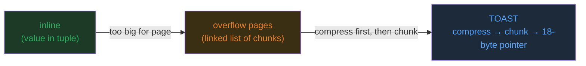
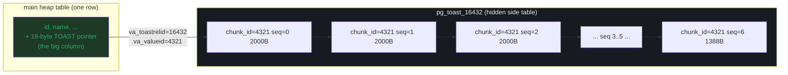

# OVERFLOW_PAGES — TOAST: how a database stores values too big for a page

> A **concept bundle** for database internals. The single source of truth is
> [`overflow_pages.py`](./overflow_pages.py); every number below is printed by it
> and can be audited in [`overflow_pages_output.txt`](./overflow_pages_output.txt).
> Play with it live in [`overflow_pages.html`](./overflow_pages.html).

```
overflow_pages.py   <- ground truth (pure stdlib, deterministic)
overflow_pages_output.txt   <- captured stdout
OVERFLOW_PAGES.md   <- this guide (numbers pasted verbatim from the .py)
overflow_pages.html <- interactive companion (recomputes in JS, gold-checked)
```

---

## 0. The one-paragraph mental model

A database **page** is a fixed-size suitcase (PostgreSQL default **8 KB**). Most
rows fit easily. But one column can hold a **50 KB JSON document**, a **2 MB
image**, or a **100 KB log blob** — you cannot jam that into an 8 KB suitcase,
and even a 3 KB value would crowd out everything else on the page.

**TOAST** (The Oversized-Attribute Storage Technique) is PostgreSQL's answer:

1. **Compress** the value first (pglz) — a free win for repetitive data.
2. If it is **still too big**, **chunk** it into ~2 KB slices and store each
   slice as a row in a hidden side table (`pg_toast_<oid>`).
3. Leave an **18-byte pointer** in the main tuple that says *"my real bytes
   live in TOAST table X, row Y, and are Z bytes long."*

The threshold that triggers all of this is `TOAST_TUPLE_THRESHOLD ≈ 2 KB`.

---

## 1. The lineage — how big-value storage evolved

> From `overflow_pages.py` Section A:

| storage era   | idea                                        | fits in page? |
|---------------|---------------------------------------------|---------------|
| inline        | value jammed into the main tuple            | only if < ~2 KB |
| overflow      | value on linked overflow pages; tuple holds a pointer | yes (pointer) |
| TOAST         | compress first, then chunk into a side table; 18-byte ptr | yes (ptr)     |



- **inline** fails the moment a value exceeds ~2 KB.
- **overflow pages** move the value to a linked list; the main tuple keeps a
  pointer. This is the classic "long field" trick (System R era).
- **TOAST** adds the two innovations: **compress before chunking**, and a
  **side table keyed by `(chunk_id, chunk_seq)`** so chunks are addressable
  and reassemblable in order.

> The threshold is not magic: it is `~MaxHeapTupleSize / 4`, so ~4 toasted
> tuples can still share an 8 KB page with room for the small columns.
> `[check] threshold is ~2 KB: True -> OK`

---

## 2. The ~2 KB threshold

```
TOAST_TUPLE_THRESHOLD = 2000 bytes   (~2 KB)
```

If a whole tuple would exceed this, PostgreSQL's toaster picks the biggest
**varlena** columns (text, bytea, jsonb, …) and toasts them — in decreasing
size order — until the tuple fits. Fixed-size types (int8, float8) are **never**
toasted.

> Real PostgreSQL rounds this to **~2032 bytes** (`MAX_TOAST_TUPLE_SIZE =
> MaxHeapTupleSize/4` for an 8 KB block). This guide uses the commonly cited
> **2000** for clean math; nothing structural changes.

---

## 3. Step 1 — compress (the pglz concept)

Before moving a value out of line, PostgreSQL tries to **shrink** it with
**pglz** (a Lempel-Ziv variant; LZ4 is also available since PG 14). The model
in `overflow_pages.py` is a simplified greedy LZ77. The pglz rule that matters:

> Keep the compressed form **only if it is strictly smaller** than the raw
> value. Otherwise store raw (and toast it raw if still oversized).

> From `overflow_pages.py` Section B (deterministic payloads, same compressor
> the `.html` re-runs):

| pattern       | raw (B) | compressed (B) | ratio  | compressed? | toasted?* |
|---------------|---------|----------------|--------|-------------|-----------|
| repetitive    | 2500    | 67             | 37.31  | yes         | no        |
| text-like     | 2600    | 171            | 15.20  | yes         | no        |
| random (xorshift) | 3000    | 3000           | 1.00   | no          | yes       |

\* "toasted" here = would not fit inline with the base tuple. Repetitive data
shrinks below the threshold and could even stay inline; **random data does not
compress at all** and must be moved out of line in full.

**Lesson:** compression is a free win for repetitive blobs and a no-op for
random blobs. That is *why* TOAST tries **compress FIRST, chunk SECOND** —
compression can collapse the chunk count dramatically (see §7: EXTENDED needs
**7 chunks** vs EXTERNAL's **30** for the same value).

---

## 4. Step 2 — chunk into the TOAST table

After compression, if the value still exceeds the threshold it is sliced into
~2 KB chunks (`TOAST_MAX_CHUNK_SIZE = 2000` bytes of payload each) and each
slice becomes a row in a hidden side table:

```
pg_toast_<oid>
    chunk_id   Oid    -- same for all chunks of ONE value
    chunk_seq  int4   -- 0, 1, 2, ...  (the glue order)
    chunk_data bytea  -- up to TOAST_MAX_CHUNK_SIZE bytes
```

The pinned worked example is a 58 KB semi-structured JSON-ish blob.

> From `overflow_pages.py` Section C — gold payload (58229 raw bytes,
> 13388 after pglz, still > 2000 → **must chunk**):

```
num_chunks = ceil(13388 / 2000) = 7
```

| chunk_id | chunk_seq | chunk_data (B) | full row (B) |
|----------|-----------|----------------|--------------|
| 4321     | 0         | 2000           | 2040         |
| 4321     | 1         | 2000           | 2040         |
| 4321     | 2         | 2000           | 2040         |
| 4321     | 3         | 2000           | 2040         |
| 4321     | 4         | 2000           | 2040         |
| 4321     | 5         | 2000           | 2040         |
| 4321     | 6         | 1388           | 1428         |

> Total chunk storage = sum of full row sizes = **13668 B (13.67 KB)**.
> `[check] num_chunks == ceil(stored/chunk_size) == ceil(13388/2000) == 7: OK`

**Why a side table and not a linked list of overflow pages?** Because chunks
are **addressable by `(chunk_id, chunk_seq)`**, detoasting is a single indexed
range scan (`WHERE chunk_id = … ORDER BY chunk_seq`) rather than N page-to-page
pointer chases. The `(chunk_id, chunk_seq)` index is the whole reason random
access into a toasted value is feasible.



---

## 5. The 18-byte varlena pointer

When a value is toasted, the main tuple **no longer holds the bytes**. It holds
an **18-byte external pointer** — PostgreSQL's on-disk `varatt_external`
representation:

> From `overflow_pages.py` Section D:

| field           | bytes | value (this example)        |
|-----------------|-------|-----------------------------|
| va_header       | 2     | external-marker (on-disk)   |
| va_toastrelid   | 4     | 16432 (pg_toast_16432) |
| va_valueid      | 4     | 4321 (chunk_id for all chunks)  |
| va_size         | 4     | 13388 (compressed, low bit=flag) |
| va_rawsize      | 4     | 58229 (uncompressed len)|
| **TOTAL in tuple** | **18**  | replaces **58229** raw bytes (58.23 KB) |

- `va_toastrelid` → which side table.
- `va_valueid` → which value (the `chunk_id` shared by all its chunks).
- `va_size` → stored length; its **low bit flags whether the value is
  compressed** (this is how detoast knows to decompress).
- `va_rawsize` → original length, needed to allocate the decompression buffer.

> So the **58,229-byte** value is represented in the main tuple by just **18
> bytes** — a **3235×** shrink in the hot path.
> `[check] pointer footprint == 18 bytes: OK`

**The payoff:** `SELECT id, name FROM t` (not projecting the big column) never
follows the pointer and **never pays the chunk-read cost**. That is the entire
point of out-of-line storage — scans that don't need the blob stay fast.

---

## 6. Retrieval — detoasting and its cost

To read a toasted value back, PostgreSQL must:

> From `overflow_pages.py` Section E:

1. read the **18-byte pointer** from the main tuple;
2. fetch **all 7 chunks** `WHERE chunk_id = 4321 ORDER BY chunk_seq` —
   *this is the expensive part*;
3. concatenate `chunk_data` in `chunk_seq` order;
4. if `va_size` says compressed → **pglz-decompress** the glued bytes.

> Round-trip check: detoasted bytes == original raw bytes? **True**
> original 58229 B → recovered 58229 B → **7 chunk reads** (often 7 random I/Os
> if not cached). `[check] detoast round-trip == raw: OK`

**Cost model:** detoasting a value split across **N** chunks is **N** index
lookups + **N** page reads in `pg_toast_<oid>`, plus one decompress (if
compressed). For a value that fanned out into many chunks this is dramatically
more expensive than reading an inline value.

> This is exactly why **EXTERNAL** (no compression) can be **slower to read**
> than **EXTENDED** (compress first → fewer chunks), even though EXTERNAL skips
> the decompress step: **more chunks = more reads.** See §7.

---

## 7. The four TOAST strategies

Each column has a **strategy** (`attstorage`). The four values:

> From `overflow_pages.py` Section F:

| strategy | code | compress? | out-of-line? | typical use                     | resulting storage        |
|----------|------|-----------|--------------|---------------------------------|--------------------------|
| PLAIN    | 0    | no        | no           | fixed-size types, small varlena | inline, always           |
| EXTERNAL | 1    | no        | yes          | blob columns where decompress cost matters more than size | out-of-line, uncompressed |
| EXTENDED | 2    | yes       | yes          | **DEFAULT** for most varlena (text, bytea, jsonb) | compress, then out-of-line if still big |
| MAIN     | 3    | yes       | last resort  | values you want inline if at all possible | compress; keep inline; move out-of-line only if forced |

Same gold payload (raw=58229 B, pglz=13388 B) under each strategy:

| strategy | bytes in main tuple | chunks | detoast reads | notes                       |
|----------|---------------------|--------|---------------|-----------------------------|
| PLAIN    | 58229               | 0      | 0             | raw inline; bloats every scan |
| EXTERNAL | 18                  | 30     | 30            | raw -> out-of-line          |
| EXTENDED | 18                  | 7      | 7             | compressed -> out-of-line   |
| MAIN     | 13388               | 0      | 0             | compressed inline (forced)  |

- **PLAIN** is shown for contrast: a 58 KB value inline is impossible (PG would
  refuse the tuple).
- **EXTENDED vs EXTERNAL** is the headline tradeoff: compression cuts the chunk
  count from **30 → 7**, so EXTENDED reads back in **7** chunk I/Os vs
  **30** — even though EXTENDED also pays one decompress. For most data,
  fewer chunks wins.
- **MAIN** tries to keep the value **inline** (compressed); it only overflows
  as a last resort. Useful for medium values you read often and want to keep on
  the hot page.

> **EXTENDED is the default and almost always right.** Use **EXTERNAL** only for
> blobs that are already compressed (JPEG, PNG, zstd output) where pglz would do
> nothing but the column is read often.

---

## 8. Worked example — the full pipeline, end to end

The pinned payload (semi-structured JSON-ish log lines, deterministic) traced
through every stage:

> From `overflow_pages.py` Gold Values:

| stage                | value                            |
|----------------------|----------------------------------|
| raw payload          | 58229 B (58.23 KB)               |
| after pglz           | 13388 B (compressed = true)      |
| num_chunks           | 7 (= ceil(13388 / 2000))         |
| pointer in main tuple| 18 B                             |
| detoast chunk reads  | 7                                |
| **total storage**    | **13746 B (13.75 KB)**           |

**Storage accounting** (the formula the `.html` gold-checks):

```
total_storage = BASE_TUPLE_BYTES
              + TOAST_POINTER_BYTES
              + Σ_chunks (CHUNK_ROW_OVERHEAD + len(chunk_data))

13746 = 60 + 18 + (6 × (40 + 2000)) + (40 + 1388)
      = 60 + 18 + 12240 + 1428
```

> `[check] num_chunks == ceil(stored/chunk_size): OK`
> `[check] pointer == 18 bytes: OK`
> `[check] total_storage == base + pointer + sum(chunk rows): OK`
> `[check] detoast(raw) == payload: OK`

---

## 9. Pitfalls & sharp edges

1. **Random data defeats TOAST compression.** Already-compressed blobs (images,
   encrypted data, zstd output) will not shrink under pglz. They still get
   chunked — into **many** chunks. Prefer **EXTERNAL** for these so you at least
   skip the wasted compress attempt, and consider storing them outside the DB.
2. **Detoasting is N reads, not 1.** A value fanned across 30 chunks costs ~30
   indexed reads on every `SELECT` that needs it. Compression (EXTENDED)
   reduces N directly.
3. **`SELECT *` pays for blobs you didn't want.** Because detoast is lazy per
   column, listing only the columns you need avoids the pointer chase entirely.
4. **TOAST tables are hidden but real.** `pg_toast_<oid>` takes space, needs
   vacuuming, and shows up in `pg_total_relation_size` — not
   `pg_relation_size`. A "small" table can have a huge TOAST footprint.
5. **The 18-byte pointer is per value, not per row.** A row with 5 toasted
   columns carries 5 pointers (each pointing into the same side table, distinct
   `va_valueid`s).
6. **`MAIN` can still overflow.** "Try to keep inline" means *try* — if the
   compressed value still won't fit with the rest of the tuple, MAIN falls back
   to out-of-line just like EXTENDED.

---

## 10. Cheat sheet

```
CONSTANTS (this guide; real PG values in parens)
  TOAST_TUPLE_THRESHOLD = 2000    (~2032 = MaxHeapTupleSize/4)
  TOAST_MAX_CHUNK_SIZE  = 2000    (~1996)
  TOAST_POINTER_BYTES   = 18      (varlena hdr 2 + varatt_external 16)
  CHUNK_ROW_OVERHEAD    = 40      (line ptr 4 + tup hdr 24 + ids 8 + bytea hdr 4)

PIPELINE
  raw value
    -> pglz compress           (keep only if strictly smaller)
    -> still > 2000?  chunk into ceil(len/2000) slices
    -> each slice = 1 row in pg_toast_<oid> (chunk_id, chunk_seq, chunk_data)
    -> main tuple keeps an 18-byte varlena pointer

DETOAST
  read 18-byte pointer
  -> fetch N chunks WHERE chunk_id=? ORDER BY chunk_seq   (N reads)
  -> glue
  -> pglz decompress if flagged

STORAGE
  total = base_tuple + 18 + Σ_chunks(40 + len(chunk_data))

STRATEGIES (attstorage)
  PLAIN    0  inline, never toast
  EXTERNAL 1  out-of-line, NO compress   (already-compressed blobs)
  EXTENDED 2  compress THEN out-of-line  (DEFAULT)  <-- usually pick this
  MAIN     3  compress, keep inline, overflow only as last resort
```

---

## 11. Cross-references 🔗

- Ground truth: [`overflow_pages.py`](./overflow_pages.py) ·
  captured output: [`overflow_pages_output.txt`](./overflow_pages_output.txt) ·
  interactive: [`overflow_pages.html`](./overflow_pages.html)
- **Source material:** PostgreSQL `src/backend/access/heap/tuptoaster.c`,
  `src/include/access/htup_details.h` (the `varatt_external` struct,
  `TOAST_TUPLE_THRESHOLD`, `TOAST_MAX_CHUNK_SIZE`); PostgreSQL docs §73.2
  "Database Physical Storage" — TOAST.
- Companion concepts (other bundles in `db/`): page layout & tuple structure,
  B-tree index pages, FSM/free-space management.

> Every number in this guide traces to a `> From overflow_pages.py Section X:`
> callout. Reproduce any of them with `python3 overflow_pages.py`.
