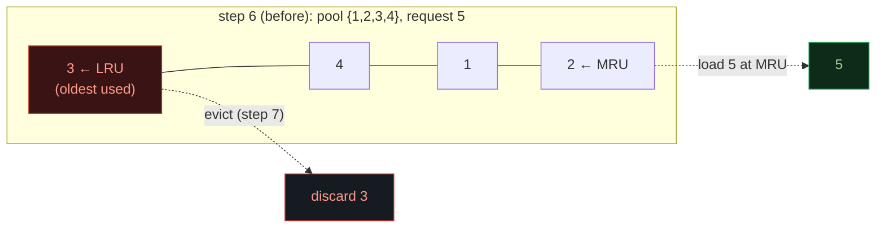
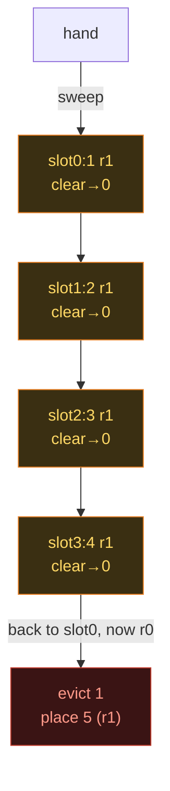
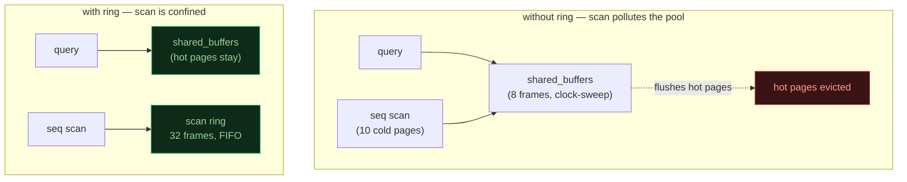

# Page Eviction — Buffer-Pool Replacement Policies

> A database-internals concept bundle. This guide is the static, rigorous half;
> every number below is printed by the ground-truth
> [`page_eviction.py`](./page_eviction.py) and pasted **verbatim** — never
> hand-computed. The playable companion is
> [`page_eviction.html`](./page_eviction.html).
>
> Lineage: **RANDOM → FIFO → LRU → CLOCK (2nd chance) → LRU-K**.

---

## 0. The one-paragraph idea

Disk is ~1000× slower than RAM, so every database keeps a small **buffer pool**
of *N* page-frames in RAM (PostgreSQL: `shared_buffers`, default 128 MB ≈ 16k
pages of 8 KB). When a requested page is already in the pool it's a **hit**;
otherwise it's a **miss** (a *fault*) and the page must be read from disk. When
the pool is **full** and a new page must be loaded, a resident page must be
**evicted**. Picking *who* to evict is the whole art of a cache: evict a page
that is about to be re-read and you pay an extra disk I/O; evict a page never
read again and you paid nothing.

The four real algorithms are each a different bet about *which* page is least
likely to be needed soon:

1. **LRU** — evict the page whose **last use** is oldest. Excellent, but needs a
   recency order updated on *every* access.
2. **CLOCK** (second chance) — a 1-bit approximation of LRU: each page has a
   *reference bit*; a sweeping *hand* gives bit=1 pages a second chance and
   evicts the first bit=0 page. Cheap (1 bit + a hand). What OSes and
   PostgreSQL actually run.
3. **LRU-K** — track the last **K** access *times* per page; evict the page
   whose *K*-th-most-recent access is oldest ("backward K-distance"). Resists
   one-shot scans polluting the cache (O'Neil 1993).
4. **OPT (Belady MIN)** — the theoretical optimum: evict the page whose *next*
   use is farthest in the future. Needs the future, so it's **unrealizable** —
   but no online policy can beat it, so it's the lower bound on faults.

> **Analogy — the librarian's desk.** The desk holds N open books (the buffer
> pool). A new question arrives: if the book is on the desk, great (hit). If
> not, you fetch it from the stacks (a slow miss) and must close one desk book
> to make room (an eviction). FIFO closes the book opened longest ago; LRU
> closes the one last *read* longest ago; CLOCK just glances at a "recently
> used?" sticky note on each book; LRU-K remembers *how many times* you've
> reached for each.

---

## 1. Why it exists — the lineage

| Policy | Eviction rule | Cost per access | Quality |
|---|---|---|---|
| **RANDOM** | a random frame | nothing | a baseline nobody ships |
| **FIFO** (Belady 1966) | oldest-**loaded** | a queue | poor; suffers Belady's anomaly |
| **LRU** (Mattson+ 1972) | oldest-**used** | recency update every access | good; optimal among future-blind policies |
| **CLOCK** (2nd chance) | first bit=0 the hand reaches | set 1 bit on use; hand sweep on miss | ≈ LRU, cheap; what real systems run |
| **LRU-K** (O'Neil 1993) | oldest *K*-th access | last-K times per page | resists scan pollution |
| **OPT / MIN** (Mattson+ 1972) | farthest *next* use | **needs the future** | unbeatable lower bound |

The whole lineage is the story of getting "almost LRU quality at almost FIFO
cost". CLOCK drops LRU's expensive sorted-recency list down to **one bit per
page**; LRU-K adds a little history back to beat CLOCK on scan-heavy workloads.

---

## 2. LRU — evict the least-recently-used

The deterministic worked example uses a **4-frame** pool and the classic
reference string `[1,2,3,4,1,2,5,1,2,3,4,5]` (the Belady-anomaly string). Every
policy in this guide runs on byte-identical inputs.

> From `page_eviction.py` Section A — LRU step-by-step:

```
| step | access | result | buffer (LRU -> MRU)        | evicted |
|------|--------|--------|----------------------------|---------|
|  1   |   1    | miss  | 1                          | -       |
|  2   |   2    | miss  | 1  2                       | -       |
|  3   |   3    | miss  | 1  2  3                    | -       |
|  4   |   4    | miss  | 1  2  3  4                 | -       |
|  5   |   1    | HIT   | 2  3  4  1                 | -       |
|  6   |   2    | HIT   | 3  4  1  2                 | -       |
|  7   |   5    | miss  | 4  1  2  5                 | 3       |
|  8   |   1    | HIT   | 4  2  5  1                 | -       |
|  9   |   2    | HIT   | 4  5  1  2                 | -       |
|  10  |   3    | miss  | 5  1  2  3                 | 4       |
|  11  |   4    | miss  | 1  2  3  4                 | 5       |
|  12  |   5    | miss  | 2  3  4  5                 | 1       |

LRU: 4 hits / 12 accesses = hit rate 33.3%  (8 faults -> 8 disk reads).
```

The buffer is shown **LRU → MRU** (left = evict next, right = most recently
used). On each access the page moves to the MRU end. At step 7 the pool is full
of `{1,2,3,4}` and page 5 is requested: the LRU page **3** (last used at step 3)
is evicted. Pages **1** and **2** keep getting refreshed (steps 5, 6, 8, 9) so
they survive — that recency refresh on *hits* is precisely what FIFO lacks.



> **Gold check** 🔗: LRU = **4 hits** (steps 5, 6, 8, 9). Verified identically in
> Python (`Section A`) and in the browser (`page_eviction.html` → **check: OK**).

---

## 3. CLOCK (second chance) — 1 reference bit + a sweeping hand

Each frame carries a **reference bit** (0 or 1). The frames form a ring and a
**hand** rotates around it:

- **HIT** → set the page's reference bit = 1. The hand does **not** move.
- **MISS** → sweep the hand: if it points at a page with **bit=1**, clear it to
  0 (a "second chance") and advance; if **bit=0**, **evict** it, place the new
  page there with bit=1, and advance past it.

> From `page_eviction.py` Section B — CLOCK step-by-step (ring = `slot:page(rbit)`,
> `←hand` marks the hand, "sweep" lists frames passed/cleared):

```
| step | access | result | ring (slot:page(rbit))                          | hand | sweep                              | evicted |
|  4   |   4    | miss  | [0]1(r1) <-hand  [1]2(r1)  [2]3(r1)  [3]4(r1)   |  0   | -                                  | -       |
|  5   |   1    | HIT   | [0]1(r1) <-hand  [1]2(r1)  [2]3(r1)  [3]4(r1)   |  0   | -                                  | -       |
|  6   |   2    | HIT   | [0]1(r1) <-hand  [1]2(r1)  [2]3(r1)  [3]4(r1)   |  0   | -                                  | -       |
|  7   |   5    | miss  | [0]5(r1)  [1]2(r0) <-hand  [2]3(r0)  [3]4(r0)   |  1   | cleared 0,1,2,3 then evict slot0:1 | 1       |
|  8   |   1    | miss  | [0]5(r1)  [1]1(r1)  [2]3(r0) <-hand  [3]4(r0)   |  2   | evict slot1:2                      | 2       |
| ...  |  ...   | ...   | ...                                            | ...  | ...                                | ...     |

CLOCK: 2 hits / 12 accesses = hit rate 16.7%  (10 faults).
```

> **Why CLOCK ties FIFO here (only 2 hits).** At step 7 *every* frame's reference
> bit is still 1 — pages 1 and 2 were just hit at steps 5–6, and pages 3 and 4
> were freshly loaded. The hand therefore sweeps **all four** frames, clearing
> every bit, and then evicts page **1** — exactly FIFO's oldest-loaded choice.
> The "second chance" gave *no one* a second chance, because nobody's bit had
> **decayed** to 0 yet. On longer reference strings the bits decay between uses
> and CLOCK pulls ahead of FIFO toward LRU quality.



The whole algorithm is **one bit per page + a hand index** — no recency list, no
per-access reordering. That cheapness is why CLOCK (and PostgreSQL's
clock-sweep variant with a usage counter) is what ships in practice.

---

## 4. LRU-K (K=2) — evict the page whose 2nd-to-last use is oldest

LRU-K keeps the **last K access *times*** of every page and evicts the resident
page whose **K-th-most-recent access** is oldest:

```
backward K-distance(page) = now - (K-th most recent access time)
victim = the resident page with the LARGEST backward K-distance
```

A page seen fewer than K times has K-distance = **∞** (a "new" page → evicted
first). Two extra rules from O'Neil's paper [3] matter here:

- **Persistent history** — the last-K list *survives* eviction. A page touched
  twice, then evicted, then re-requested is **not** treated as brand-new: it
  already has history, so it's protected. This is what resists scan pollution.
- Ties (incl. the ∞ "new" ties) → oldest *first* access → lowest page id.

> From `page_eviction.py` Section C — on each miss the candidate
> `backward-K-distances` are shown (`kth` = the 2nd-to-last access tick, `d` =
> backward distance; `-inf`/`inf` = page seen fewer than K times):

```
| step | access | result | evicted | candidate backward-K-distances (page: history -> kth, dist)        |
|  7   |   5    | miss  | 3       | 1:[1,5] kth=1 d=6  2:[2,6] kth=2 d=5  3:[3] kth=-inf d=inf  4:[4] kth=-inf d=inf |
|  10  |   3    | miss  | 4       | 1:[5,8] kth=5 d=5  2:[6,9] kth=6 d=4  4:[4] kth=-inf d=inf  5:[7] kth=-inf d=inf |
|  11  |   4    | miss  | 5       | 1:[5,8] kth=5 d=6  2:[6,9] kth=6 d=5  3:[3,10] kth=3 d=8  5:[7] kth=-inf d=inf |
|  12  |   5    | miss  | 3       | 1:[5,8] kth=5 d=7  2:[6,9] kth=6 d=6  3:[3,10] kth=3 d=9  4:[4,11] kth=4 d=8 |

LRU-2: 4 hits / 12 accesses = hit rate 33.3%  (8 faults).
```

The telling moment is **step 11**: plain LRU would evict page **3**, but LRU-2
remembers page 3 was used at step 10 (history `[3,10]`, recent 2nd access),
so it instead evicts page **5** — seen only once (K-distance = ∞). The
persistent history is exactly the feature that makes LRU-K ignore a one-shot
scanning page even after it has come and gone.

> **Gold check** 🔗: LRU-2 = **4 hits**. Verified identically in Python (`Section
> C`) and in the browser (`page_eviction.html` → **check: OK**).

---

## 5. Hit-rate comparison + the Belady optimal lower bound

Running all five policies on the **same** string with **4 frames**:

> From `page_eviction.py` Section D:

```
| policy | hits | faults (= disk reads) | hit rate |
|--------|------|-----------------------|----------|
| FIFO   | 2    | 10                    | 16.7%    |
| CLOCK  | 2    | 10                    | 16.7%    |
| LRU    | 4    | 8                     | 33.3%    |
| LRU-2  | 4    | 8                     | 33.3%    |
| OPT    | 6    | 6                     | 50.0%    |
```

- **FIFO/CLOCK (2)** are worst here. CLOCK ties FIFO because of the all-bits-set
  sweep in Section 3; on richer strings it sits between FIFO and LRU.
- **LRU / LRU-2 (4)** keep the repeatedly-used pages 1 and 2 alive.
- **OPT (6)** is the ceiling: with 4 frames you simply *cannot* do better than 6
  hits on this string. No real (online) policy can beat MIN — it is the
  yardstick, not a deployable algorithm.

### ⚠️ Belady's anomaly — more frames can mean *more* faults

FIFO is the policy that breaks the intuition "a bigger cache is always at least
as good". On **this very string**, FIFO faults go **9 → 10** when the pool grows
from **3 → 4 frames** — i.e. giving FIFO a bigger cache makes it **worse** [1]:

```
FIFO, 3 frames: 3 hits  / 9 faults   (1,2,3,4,1,2,5,1,2,3,4,5)
FIFO, 4 frames: 2 hits  / 10 faults   <- MORE frames, MORE faults!
```

LRU and OPT are immune: they have the **stack property** (the set of pages an
N-frame run keeps is always a subset of the (N+1)-frame run's), which
guarantees more frames never hurt [2].

---

## 6. Dirty pages — eviction can cost an extra WRITE

A page loaded for reading is **clean**. A page **modified** in RAM is **dirty**:
evicting it forces a **flush** (one extra disk WRITE) before the frame can be
reused; a clean eviction is free. So two pools with identical *hit rates* can
have very different *I/O cost* if one dirties more pages.

Running LRU on the same string, but with each access typed R (read) or W
(write dirties the page):

> From `page_eviction.py` Section E:

```
| step | access | op | result | evicted | dirty? | running reads | running writes |
|  7   |   5    | W  | miss  | 3       | flush  | 5             | 1              |
|  9   |   2    | R  | HIT   | -       | -      | 5             | 1              |
|  10  |   3    | W  | miss  | 4       | clean  | 6             | 1              |
|  11  |   4    | R  | miss  | 5       | flush  | 7             | 2              |
|  12  |   5    | R  | miss  | 1       | flush  | 8             | 3              |

Totals: 8 disk READS (the faults) + 3 disk WRITES (dirty evictions) = 11 I/Os.
```

An **all-read** workload with the *same* LRU policy would fault 8 times (8 reads)
but pay **zero** eviction writes — no page is ever dirty. The 3 writes here are
pure **write-amplification** from dirtying pages 1, 3, 5 and then evicting them
before the next checkpoint. This is why real engines flush dirty pages from a
**background** process (the checkpointer / background writer) rather than at
eviction time: amortise the writes off the foreground query, so evictions can
usually reuse an already-clean frame.

---

## 7. PostgreSQL specifics — the scan ring protects the cache

A sequential scan can touch **millions** of pages once each. If those pages
entered the shared buffer pool and competed under the normal clock-sweep, one
big scan would **flush the whole cache**, evicting the genuinely hot pages.
PostgreSQL prevents this with a **scan ring** — a small private set of frames,
reused **FIFO**, that the scan reads into *instead of* the main pool [4]:

| Ring | Size | Pages (8 KB) | Used for |
|---|---|---|---|
| bulk-**read** | 256 KB | 32 | seq scans that don't fit in cache |
| bulk-**write** | 16 MB | 2048 | `COPY`, `CREATE TABLE AS`, materialised views |
| **vacuum** | 256 KB | 32 | autovacuum |

A toy illustration (8-frame pool, hot pages {1,2}, a 10-page scan, then the hot
pages are touched again):

> From `page_eviction.py` Section F:

```
WITHOUT a ring (scan enters the pool, LRU):
    step 8: pool full of {1,2,100..105}
    step 9..12: scan 106..109 evicts 1, then 2, then 100, then 101
    step 13,14: re-access 1, 2  ->  BOTH MISS
    -> after the scan the hot pages have been evicted: 0/2 hits.

WITH a 2-frame ring (scan pages go into the ring, FIFO):
    main pool only ever holds the hot pages {1,2}; the scan's 10 pages
    cycle through the 2-frame ring and never touch the pool.
    -> the hot re-accesses are 2/2 hits.

PUNCHLINE: hot-set hit rate after the scan = 0% (no ring) vs 100% (ring).
```



The ring confines a terabyte-sized scan to 32 frames (256 KB) in real
PostgreSQL, leaving the rest of `shared_buffers` intact. Note PostgreSQL's buffer
replacement is itself a **clock-sweep with a `usage_count` (0–5)** — a CLOCK
descendant that adds a coarse *frequency* signal on top of the single reference
bit, rather than strict LRU-K.

---

## 8. Cheat sheet

| Quantity | Rule | Worked value |
|---|---|---|
| Pool size | *N* frames | 4 |
| Reference string | SEQ | `[1,2,3,4,1,2,5,1,2,3,4,5]` |
| Hit rate | `hits / accesses` | LRU 4/12 = 33.3% |
| Fault rate | `1 − hit rate` (= disk reads) | LRU 8/12 = 66.7% |
| **LRU** victim | oldest **last use** | evicts 3,4,5,1 |
| **CLOCK** victim | first frame the hand reaches with **ref bit = 0** | evicts 1,2,3,4,5,1 |
| **LRU-K** victim | largest **backward K-distance** (`now − Kth-last`); <K accesses → ∞ | evicts 3,4,5,3 |
| **OPT/MIN** victim | farthest **next use** (never → ∞) | evicts 4,1,... → 6 hits |
| Belady anomaly | FIFO: more frames *can* mean more faults | FIFO 3→4 frames: 9→10 faults |
| Dirty eviction cost | 1 read (fault) + 1 write (flush) vs clean's 1 read | 8 reads + 3 writes here |
| PG bulk-read ring | 256 KB = 32 pages, FIFO | confines seq scans |

---

## 9. Algorithms side by side (the two primitives)

```
LRU on access(p):                    CLOCK on access(p):
  touch p's recency = now              if p resident: bit[p]=1; return
  if p not resident:                   if p not resident:
    if full: evict min recency           if free frame: take it (bit=1)
    load p                                 else sweep hand:
                                            while bit[hand]==1: clear; advance
                                          evict hand; place p (bit=1); advance
```

LRU updates state on **every** access; CLOCK updates state only on a **miss**
(the bit set on a hit is a single store). LRU-K replaces "min recency" with
"min K-th-last access" over a persistent per-page history. MIN replaces it with
"max next use" — the same skeleton, three different keys.

---

## 10. Sources

1. **Belady**, "A Study of Replacement Algorithms for Virtual-Storage Computer",
   *IBM Systems Journal* 5(2), 1966 — FIFO and the anomaly that bears his name.
2. **Mattson, Gecsei, Slutz, Traiger**, "Evaluation Techniques for Storage
   Hierarchies", *IBM Systems Journal* 9(2), 1972 — LRU, the stack property, and
   the optimal **MIN** algorithm (proven unbeatable by any online policy).
3. **O'Neil, O'Neil, Weikum**, "The LRU-K Page Replacement Algorithm", *SIGMOD*
   1993 — backward K-distance, persistent history, the correlated-reference
   pitfall. Motivated frequency-aware replacement (2Q, ARC, etc.).
4. **PostgreSQL source** — `src/backend/storage/buffer/README`, `bufmgr.c`,
   `ring.c`: clock-sweep with `usage_count` (0–5); scan rings of 256 KB / 16 MB.
5. **Tanenbaum & Bos**, *Modern Operating Systems* — CLOCK / second chance.

---

### 🔗 Companion files & siblings

- **[`page_eviction.py`](./page_eviction.py)** — ground-truth reference impl (run: `python3 page_eviction.py`).
- **[`page_eviction_output.txt`](./page_eviction_output.txt)** — captured stdout, for auditing this guide without running.
- **[`page_eviction.html`](./page_eviction.html)** — interactive buffer pool (algorithm switch LRU/CLOCK/LRU-2, frame slider, animated clock hand, hit-rate meter, **check: OK**).

> Part of the database-internals tutorial series. See
> [`HOW_TO_RESEARCH.md`](./HOW_TO_RESEARCH.md) for the bundle workflow.
