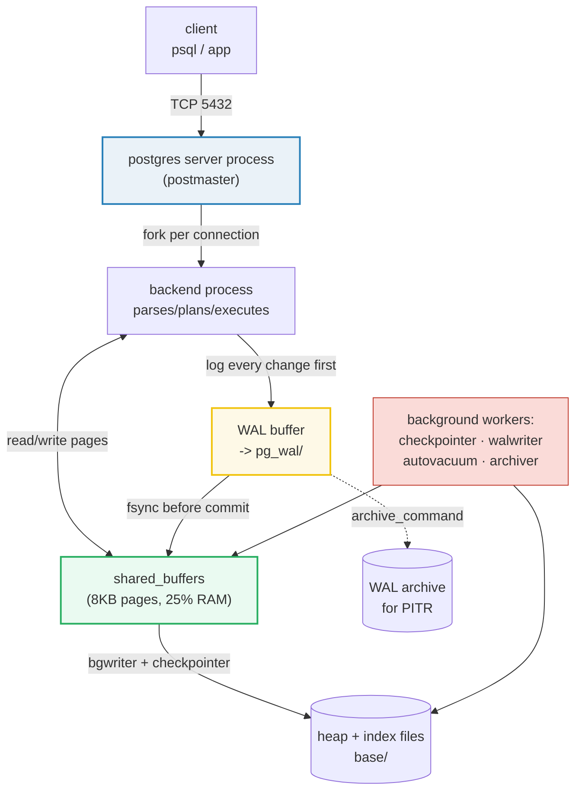

# PostgreSQL — Day 0 to Production Operations

> **Companion code:** [`postgresql.py`](https://github.com/quanhua92/tutorials/blob/main/db/postgresql.py). **Every table, EXPLAIN trace, tuning
> number, and cost figure in this guide is printed by `python3 postgresql.py`** — change the
> code, re-run, re-paste under the `> From postgresql.py Section X:` callouts. Nothing is hand-computed.
>
> **Live console:** [`postgresql.html`](https://github.com/quanhua92/tutorials/blob/main/db/postgresql.html) — open in a browser; it
> recomputes the config tuner, the EXPLAIN cost curves, the partition-pruning math, the replication
> lag calculator, and the self-hosted-vs-RDS-vs-Aurora cost table in JS with the *identical* formulas,
> and gold-checks against `.py`.
>
> **Sources:** PostgreSQL 18 official docs (19.4 Resource Consumption, 19.6 Replication, 11.2 Index
> Types, 5.12 Partitioning, 25.3 PITR, 24.1 Routine Vacuuming); *The Internals of PostgreSQL*
> (Hironobu Suzuki, InterDB.jp) ch.2; EDB / Crunchy Data / Severalnines tuning guides; PgBouncer docs;
> AWS RDS & Aurora pricing. Full URL list in [## Sources](#sources).

---

## 0. TL;DR

PostgreSQL is the **"do everything"** database — relational, JSON, geo, vectors, full-text, time-series
(via TimescaleDB). The challenge isn't *"can it do X?"* (almost always yes) but *"how to configure it for
X without shooting yourself."* This guide is the **three-day survival kit**: Day 0 install + config, Day 1
schema/index/VACUUM, Day 2 replication/partitioning/pooling/backup. Every number is reproducible.

The model to hold in your head: **one process per connection**, a **shared buffer pool** everyone reads
through, a **write-ahead log (WAL)** that makes commits crash-safe, and **MVCC** (multi-version
concurrency) where `UPDATE` writes a new row and leaves the old one as a *dead tuple* for `VACUUM` to
reclaim. Everything else — replication, partitioning, PITR, indexes — is a consequence of those four.



---

## 1. Architecture — How PostgreSQL Works

PostgreSQL is a **multi-process** server (not threaded). The `postgres` server process — historically
called the *postmaster* — is the parent of everything: it allocates the shared-memory segment, launches
the background workers, and `fork()`s a dedicated **backend** process for each client connection. That
process-per-connection model gives robust isolation (one crashing session cannot corrupt another) and
relies on the OS for memory reclamation, at the cost of needing a **connection pooler** (PgBouncer) when
you have thousands of clients.

> **Why processes, not threads?** When PostgreSQL started (early 1990s) POSIX threads were not yet stable.
> The project kept the process model because of its robustness — and because refactoring a multi-million-
> line codebase to be thread-safe is enormous risk for modest gain. Modern `fork()` is cheap.

### 1.1 The process model + memory + storage

> From `postgresql.py` Section A:
> ```
> Process model (verified: postgresql.org docs + InterDB ch.2):
>   component                         role                                                      configurable param
>   ------------------------------------------------------------------------------------------------------------------------
>   postgres (postmaster)             parent of all; accepts connections, forks backends        port=5432, max_connections=100 (default)
>   backend (per connection)          parses/plans/executes SQL for ONE client session          max_connections=100
>   checkpointer                      writes all dirty shared buffers to disk at each checkpointcheckpoint_timeout, max_wal_size
>   background writer                 trickles dirty buffers out between checkpoints            bgwriter_delay=200ms, bgwriter_lru_maxpages=100
>   walwriter                         flushes WAL records from WAL buffer to WAL segment files  wal_buffers, commit_synchronous
>   autovacuum launcher               spawns autovacuum workers to VACUUM/ANALYZE tables        autovacuum=on, autovacuum_naptime=1min
>   logical replication launcher      starts apply workers for subscriptions                    max_logical_replication_workers
>   stats collector / stats           accumulates counters for pg_stat_* views                  track_activities, track_counts
>   logger (logging collector)        writes server messages to log files                       logging_collector
>   archiver                          copies completed WAL segments to archive (PITR)           archive_mode, archive_command
>   walsummarizer (v17+)              writes block-change summaries for incr. backup            summarize_wal
>   io worker (v18+)                  offloads async I/O from backends                          io_method, io_workers=3
> ```

> From `postgresql.py` Section A (memory defaults):
> ```
> Memory architecture (postgresql.org docs 19.4.1 -- defaults):
>   parameter                       default                               role
>   ----------------------------------------------------------------------------------------------------------------------
>   shared_buffers                  128MB                                 shared page cache for ALL backends; 25% of RAM recommended
>   wal_buffers                     min(-1=>1/32 shared_buffers, 16MB)    WAL write buffer before flush
>   work_mem                        4MB                                   per-sort / per-hash memory BEFORE spilling to disk
>   hash_mem_multiplier             2.0                                   hash ops may use work_mem * this
>   maintenance_work_mem            64MB                                  VACUUM / CREATE INDEX / ADD FOREIGN KEY
>   autovacuum_work_mem             -1 (= maintenance_work_mem)           per autovacuum worker
>   temp_buffers                    8MB                                   session-local cache for temp tables
>   logical_decoding_work_mem       64MB                                  logical replication decode buffer
>   effective_cache_size            4GB                                   HINT to planner: OS cache + shared_buffers
> ```

> From `postgresql.py` Section A (storage layout):
> ```
> Storage layout (data directory, a.k.a. PGDATA):
>   base/            heap + index files per database (8KB pages)
>   global/          cluster-wide catalog tables
>   pg_wal/          WAL segment files (default 16MB each)
>   pg_xact/         commit status (committed/aborted) per transaction
>   pg_multixact/    shared-row-lock metadata
>   pg_commit_ts/    commit timestamps (if track_commit_timestamp)
>   pg_stat/         persistent stats (PG14+; was a file before)
>   pg_tblspc/       symlinks to tablespaces (alternative storage)
>   page (block) size = 8192 B = 8 KB (BLCKSZ, compiled in)
>   WAL segment size  = 16 MB (default, initdb --wal-segsize)
> ```

### 1.2 The two memory tiers, and why `effective_cache_size` is a lie

The single biggest Day-0 confusion: **`shared_buffers` and `effective_cache_size` are completely
different things.**

- **`shared_buffers`** is a *real allocation* — the shared page pool every backend reads through. It is
  the database's own cache. Default `128MB`; the docs recommend **25% of RAM** on a dedicated server,
  capped near ~40% (above that, the OS page cache does a better job).
- **`effective_cache_size`** is a *hint to the planner*, not an allocation. It tells the planner "assume
  this much total cache (mine + the OS's) is available." If you set it too low, the planner thinks pages
  won't be cached and picks a sequential scan over an index. Default `4GB`; set it to **~75% of RAM**.

The reason this split works: PostgreSQL **trusts the OS page cache** as a second tier. A page read may
satisfy from `shared_buffers` (no syscall), or from the OS cache (no disk), or from disk. The OS does the
heavy lifting for sequential scans and large tables; `shared_buffers` is for the hot working set.

🔗 [`BTREE.md`](https://github.com/quanhua92/tutorials/blob/main/db/BTREE.md) — the page-level index you
just configured `shared_buffers` to cache.
🔗 [`MVCC.md`](https://github.com/quanhua92/tutorials/blob/main/db/MVCC.md) — the dead-tuple / VACUUM
mechanism autovacuum exists to clean up.

---

## 2. Day 0 — Install, Configure, Create Database (30 min)

### 2.1 Install

> From `postgresql.py` Section B:
> ```
> Install (pick one):
>
>   # Docker (fastest, reproducible):
>     docker run --name pg -e POSTGRES_PASSWORD=secret \
>         -p 5432:5432 -d postgres:16
>   # Debian/Ubuntu (apt):
>     sudo apt install -y postgresql postgresql-contrib
>     sudo -u postgres initdb -D /var/lib/postgresql/data   # if needed
>   # macOS (Homebrew):
>     brew install postgresql@16
>     brew services start postgresql@16
>   # then connect: psql -h localhost -U postgres -d postgres
> ```

### 2.2 Configure `postgresql.conf` for your RAM

> From `postgresql.py` Section B:
> ```
> Recommended postgresql.conf for three RAM sizes (dedicated server):
> Rules: shared_buffers=25% RAM, effective_cache_size=75% RAM,
> wal_buffers=min(shared_buffers/32, 16MB), max_connections=100.
>
>   setting                         4GB server     16GB server     64GB server
>   --------------------------------------------------------------------------
>   shared_buffers                      1024MB          4096MB         16384MB
>   effective_cache_size                3072MB         12288MB         49152MB
>   maintenance_work_mem                 205MB           819MB          2048MB
>   wal_buffers                           16MB            16MB            16MB
>   work_mem                            10.2MB          41.0MB         163.8MB
>   max_connections                        100             100             100
>
> Worked example (16GB server):
>   shared_buffers       = 25% * 16384MB = 4096MB
>   effective_cache_size = 75% * 16384MB = 12288MB
>   maintenance_work_mem = min(5%*16384, 2048) = min(819, 2048) = 819MB
>   wal_buffers          = min(4096/32, 16) = 128MB -> 16MB (capped)
>   work_mem             = (16384-4096)/(100*3) = 40.96MB -> 41.00MB
> ```

**Why these numbers?** `shared_buffers` at 25% is the postgresql.org documented recommendation for a
dedicated server (19.4.1). `effective_cache_size` at 75% assumes the OS keeps ~50% and Postgres keeps
~25%. `maintenance_work_mem` is capped at 2GB because `CREATE INDEX` and `VACUUM` are usually
low-concurrency and benefit from a lot of memory, but you don't want one runaway operation eating the box.
`wal_buffers` is capped at 16MB because the WAL buffer just needs to hold one burst of commits. `work_mem`
is the trickiest: it is **per sort/hash operation per backend**, so 100 connections × 3 ops each × 41MB =
**12GB of potential work_mem alone** on the 16GB box — set it conservatively, then raise it per-session
for big analytical queries (`SET work_mem = '256MB'`).

### 2.3 Create database + user

> From `postgresql.py` Section B:
> ```
> Create database + user + grant privileges:
>
>   -- run as the postgres superuser
>   CREATE ROLE app_user WITH LOGIN PASSWORD 'change_me';
>   CREATE DATABASE appdb OWNER app_user ENCODING 'UTF8' LC_COLLATE 'C' LC_CTYPE 'C' TEMPLATE template0;
>   GRANT ALL PRIVILEGES ON DATABASE appdb TO app_user;
>   -- then connect to appdb and grant schema/object rights:
>   \c appdb
>   GRANT ALL ON SCHEMA public TO app_user;
> ```

`TEMPLATE template0` + `LC_COLLATE 'C'` gives you a clean, locale-independent database — byte-order
collation is faster and avoids the classic "index corrupted after a glibc upgrade" footgun.

### 2.4 Verify + lock down auth

> From `postgresql.py` Section B:
> ```
> Verify the server is up and reachable:
>
>   pg_isready -h localhost -p 5432      # 'accepting connections'
>   psql -h localhost -U app_user -d appdb -c 'SELECT version();'
>   # expected: PostgreSQL 16.x on x86_64 ...
>
> pg_hba.conf basics (host-based authentication):
>   # TYPE  DATABASE  USER       ADDRESS          METHOD
>   local   all       all                         peer       # local socket
>   host    all       all        127.0.0.1/32     scram-sha-256
>   host    all       all        10.0.0.0/8       scram-sha-256
>   # reload after edit: SELECT pg_reload_conf();
> ```

**`scram-sha-256`** (default since PG13) is the only method you should use over the network. `md5` is
weak; `trust` is "yes, please get pwned." Reload without a restart via `pg_reload_conf()`.

---

## 3. Day 1 — Tables, Indexes, Queries, VACUUM (1–2 hours)

### 3.1 Schema design — pick the type for the access pattern

> From `postgresql.py` Section C:
> ```
> 1) CREATE TABLE -- pick types for the access pattern:
>
>   CREATE TABLE orders (
>       id           BIGSERIAL PRIMARY KEY,            -- 8B; seq-assigned
>       customer_id  BIGINT      NOT NULL,             -- FK target
>       amount       NUMERIC(12,2) NOT NULL,           -- exact decimal money
>       status       TEXT        NOT NULL CHECK (status IN ('new','paid','shipped','cancelled')),
>       created_at   TIMESTAMPTZ NOT NULL DEFAULT now(),-- store UTC; timestamptz
>       metadata     JSONB       NOT NULL DEFAULT '{}',-- schema-flex, GIN-indexable
>       tags         TEXT[]                             -- array of labels
>   );
>   -- NUMERIC not float for money (no rounding error).
>   -- TIMESTAMPTZ not TIMESTAMP: stores UTC, displays in session tz.
>   -- JSONB not JSON: binary, GIN-indexable, no whitespace preserved.
> ```

**The three type traps every junior hits:**

1. **`float8` for money.** Floating point can't represent 0.10 exactly; you'll accumulate rounding
   errors across millions of rows. Use `NUMERIC(p,s)` or, for whole cents, store `BIGINT` cents.
2. **`TIMESTAMP` (without tz) for anything that crosses timezones.** `TIMESTAMPTZ` stores a UTC instant
   and renders in the session timezone; `TIMESTAMP` stores an unqualified wall-clock time that silently
   means nothing when DST shifts. Default to `TIMESTAMPTZ`.
3. **`JSON` instead of `JSONB`.** Plain `JSON` preserves whitespace and order but **cannot be
   GIN-indexed** and is reparsed on every access. `JSONB` is binary, deduplicated, and supports the `@>`
   containment operator that GIN accelerates.

### 3.2 Insert + index (after bulk load)

> From `postgresql.py` Section C:
> ```
> 2) Seed 1M rows (simulated; in practice use COPY not 1M INSERTs):
>
>   table now holds 1,000,000 rows in ~100,000 heap pages (781MB).
>
> 3) Index for the access patterns (create AFTER bulk load):
>
>   -- B-tree (default) for equality + range on customer_id:
>   CREATE INDEX idx_orders_customer ON orders(customer_id);
>   -- partial index: only 'new' orders are hot, so index just those:
>   CREATE INDEX idx_orders_new ON orders(customer_id) WHERE status = 'new';
>   -- GIN for JSONB containment queries (->> @> ?):
>   CREATE INDEX idx_orders_meta ON orders USING GIN (metadata);
>   -- BRIN on the append-only created_at column (tiny, ordered on disk):
>   CREATE INDEX idx_orders_created ON orders USING BRIN (created_at);
> ```

**Rule: build indexes AFTER the bulk `COPY`.** Indexes are maintained on every insert; building them
once at the end (with parallel workers, PG11+) is 5–10× faster than incrementally. The **partial index**
`WHERE status = 'new'` is a secret weapon — it indexes only the hot rows, so it stays small and fast as
the table grows.

### 3.3 Query with EXPLAIN ANALYZE — the three plan shapes

`EXPLAIN ANALYZE` actually runs the query and reports real timings; `EXPLAIN` alone shows estimated
costs. The planner chooses among three physical shapes depending on **selectivity** (what fraction of the
table matches):

> From `postgresql.py` Section C (three plans, same 1M-row table):
> ```
> 4) EXPLAIN ANALYZE -- three plans, same table, different selectivity.
>
>    Cost model: seq_page_cost=1.0  random_page_cost=4.0  cpu_tuple=0.01
>
>    Q1  SELECT count(*) FROM orders WHERE amount > 10;
>        selectivity ~ 0.45 (nearly half the table matches)
>    ->  Seq Scan on orders  (cost=0.00..110000.00 rows=450000 width=8)
>          Filter: (amount > 10)
>    Planning Time: 0.18 ms   Execution Time: 110.0 ms
>
>    Q2  SELECT * FROM orders WHERE id = 874313;
>        selectivity = 1/1,000,000 = 0.0000010 (one row)
>        PK B-tree height = 3 (descent reads 3 index pages)
>    ->  Index Scan using orders_pkey on orders  (cost=0.42..16.01 rows=1 width=124)
>          Index Cond: (id = 874313)
>    Planning Time: 0.09 ms   Execution Time: 0.14 ms
>
>    Q3  SELECT * FROM orders WHERE customer_id BETWEEN 5000 AND 5200;
>        selectivity ~ 0.01 (~10,000 rows scattered across pages)
>    ->  Bitmap Heap Scan on orders  (cost=3780.00..6300.00 rows=10000 width=124)
>          Recheck Cond: (customer_id >= 5000) AND (customer_id <= 5200)
>          ->  Bitmap Index Scan on idx_orders_customer
>                Index Cond: (customer_id >= 5000) AND (customer_id <= 5200)
>    Planning Time: 0.21 ms   Execution Time: 63.0 ms
>
>    Planner choice rule of thumb (the cost crossover):
>      * sel ~ 1/N (point)    -> index scan wins  (idx cost 16.01 << seq 110000.00)
>      * sel ~ 1%             -> bitmap scan wins  (bmp 6300 < seq 110000 for scattered matches)
>      * sel ~ 45%+             -> seq scan wins (cheaper to read all once than jump around)
>    The crossover sits near ~5-10% selectivity on HDD-cost assumptions; lower random_page_cost on SSD pushes it higher.
> ```

**Read every EXPLAIN top-down:** the outermost node is what returns rows to the client; indented children
feed it. The `cost=X..Y` is *startup..total* in arbitrary planner units (~1 unit ≈ 1 sequential page
read). The crossover (~5–10% selectivity on HDD assumptions) is the single most important number in query
tuning — it's why `WHERE status = 'active'` on a 90%-active table will *never* use the index, no matter
how many you create. **Lower `random_page_cost` to `1.1` on SSD** to push the crossover higher and make
the planner use indexes more aggressively.

### 3.4 VACUUM & autovacuum — why the table doesn't shrink

PostgreSQL's **MVCC** means `UPDATE` never overwrites: it writes a *new* row version and marks the old
one *dead* (still on disk, just invisible). `DELETE` does the same. Those dead tuples accumulate until
`VACUUM` reclaims them.

> From `postgresql.py` Section C:
> ```
> 5) UPDATE creates DEAD TUPLES (MVCC): an UPDATE = INSERT new + DELETE old.
>
>    after 50,000 UPDATEs on a 1,000,000-row table:
>      live tuples  = 1,000,000    (unchanged)
>      dead tuples  = 50,000    (old versions not yet reclaimed)
>      table bloat  ~ 5,000 extra pages (39MB)
>      n_dead_tup   (pg_stat_user_tables) = 50,000
>
>    VACUUM ANALYZE orders;   -- reclaims dead tuples, refreshes stats
>      live tuples  = 1,000,000
>      dead tuples  = 0    (reclaimed -> pages reusable for new inserts)
>      NOTE: VACUUM marks space REUSABLE but does NOT shrink the file;
>            only VACUUM FULL (which locks the table) returns space to the OS.
> ```

> From `postgresql.py` Section C (autovacuum triggers):
> ```
> Autovacuum tuning (default thresholds, postgresql.org docs 19.11):
>    table size N              = 1,000,000
>    VACUUM triggers when dead > 50 + 0.2*1,000,000 = 200,050
>    ANALYZE triggers when ins/upd/del > 50 + 0.1*1,000,000 = 100,050
>    autovacuum_naptime        = 60s (checks each DB roughly this often)
>    -> on a 1,000,000-row table, ~200,050 dead tuples must pile up
>       before autovacuum acts. For hot UPDATE tables, lower the scale factor:
>       ALTER TABLE orders SET (autovacuum_vacuum_scale_factor = 0.05);
> ```

**The two VACUUM facts that bite:**

1. **`VACUUM` does not shrink the file.** It marks dead pages *reusable for future inserts* but never
   returns space to the OS. Only `VACUUM FULL` (which takes an `ACCESS EXCLUSIVE` lock — your table is
   offline) actually compacts. The fix for chronic bloat: partition by date and `DROP` old partitions.
2. **Long-running transactions block VACUUM.** A dead tuple can only be reclaimed if *no* active
   transaction could still see it. A single `pg_dump` or a forgotten `BEGIN` will pin dead tuples and let
   bloat accumulate silently. This is the #1 cause of mysterious table growth — check
   `pg_stat_activity` for old queries before reaching for `VACUUM FULL`.

🔗 [`WAL_CHECKPOINT.md`](https://github.com/quanhua92/tutorials/blob/main/db/WAL_CHECKPOINT.md) — the
crash-recovery protocol that makes commits durable before `VACUUM` runs.
🔗 [`COST_ESTIMATION.md`](https://github.com/quanhua92/tutorials/blob/main/db/COST_ESTIMATION.md) — how
the planner derives the `110000.00` and `16.01` you see in the EXPLAINs above.

---

## 4. Day 2 — Replication, Partitioning, Pooling, Backup

### 4.1 Streaming replication (physical)

Streaming replication ships **raw WAL bytes** from primary to replica in real time. The replica is a
byte-for-byte copy — same major version, same architecture, same `pg_hba.conf` worldview. The unit is the
WAL segment (16MB by default); the rate math matters for capacity planning.

> From `postgresql.py` Section D:
> ```
> Streaming replication -- primary ships WAL records to replicas in real time.
>
>   -- on the PRIMARY (postgresql.conf):
>     wal_level = replica
>     max_wal_senders = 10
>     synchronous_commit = on              # or 'remote_apply' for read-your-write
>   -- on the PRIMARY (pg_hba.conf): allow the replica's address with 'replication'
>     host replication replicator 10.0.0.11/32  scram-sha-256
>   -- on the REPLICA (after pg_basebackup):
>     primary_conninfo = 'host=10.0.0.10 port=5432 user=replicator'
>     hot_standby = on                      # allow read queries on replica
>   -- seed the replica with a base backup:
>     pg_basebackup -h 10.0.0.10 -U replicator -D /var/lib/pg/data -P -R
>
>   WAL-rate math (write rate = 50 MB/s, segment = 16 MB):
>     segments/s   = 50.0/16 = 3.12
>     segments/min = 187.5
>     daily WAL    = 50 * 86400 = 4320000 MB = 4218.8 GB/day
>   replica lag if network (45 MB/s) < write rate (50 MB/s):
>     backlog = 50-45 = 5.0 MB/s
>     after 1h = 18000 MB = 17.58 GB behind
> ```

**Synchronous modes** trade latency for durability: `synchronous_commit=on` (default) flushes WAL
locally; `remote_apply` waits until the replica has *replayed* the change (read-your-write); `off` returns
before the flush (you can lose the last few ms on crash, but 3× higher throughput). Pick by the value of
your data, not by habit.

### 4.2 Logical replication (pub/sub)

Logical replication **decodes WAL into row changes** (INSERT/UPDATE/DELETE) and ships *those*. The
subscriber can be a different major version, a different OS, and can subscribe to just one table or a
`WHERE`-filtered subset. This is how you do zero-downtime major-version upgrades and cross-region
selective replication.

> From `postgresql.py` Section D:
> ```
> Logical replication -- row-level pub/sub; selective, cross-version.
>
>   -- PRIMARY: publish one table (or a column subset, or a WHERE filter)
>     CREATE PUBLICATION orders_pub FOR TABLE orders WHERE (status <> 'cancelled');
>   -- SUBSCRIBER: create the matching table, then subscribe
>     CREATE SUBSCRIPTION orders_sub
>       CONNECTION 'host=10.0.0.10 port=5432 user=repl'
>       PUBLICATION orders_pub;
>   -- difference from streaming: logical ships DECODED row changes (INSERT/UPDATE/DELETE),
>     not raw WAL bytes. Cross-major-version, cross-platform, table-selective;
>     cannot replicate schema changes or TRUNCATE-by-default (PG13+ can).
> ```

**Gotcha:** logical replication does **not** replicate DDL (CREATE/ALTER). You must keep schemas in sync
manually or with a tool. TRUNCATE support is opt-in per publication.

### 4.3 Declarative partitioning + pruning

For huge tables (100M+ rows) that are naturally time-ordered, **partition by range on a date** and let
the planner **prune**. A query for "July" touches 1 of 12 partitions — 12× less I/O. Bonus: `DROP TABLE
orders_2023_01` is an instant way to expire old data, no `VACUUM` required.

> From `postgresql.py` Section D:
> ```
> Declarative partitioning -- split a big table; the planner PRUNES partitions.
>
>   CREATE TABLE orders (
>       id           BIGSERIAL,
>       customer_id  BIGINT NOT NULL,
>       amount       NUMERIC(12,2) NOT NULL,
>       created_at   TIMESTAMPTZ NOT NULL
>   ) PARTITION BY RANGE (created_at);
>   -- one partition per month:
>   CREATE TABLE orders_2025_01 PARTITION OF orders
>       FOR VALUES FROM ('2025-01-01') TO ('2025-02-01');
>   -- ...repeat for 12 months...
>   CREATE TABLE orders_2025_12 PARTITION OF orders
>       FOR VALUES FROM ('2025-12-01') TO ('2026-01-01');
>   -- HASH (distribute by key) and LIST (by discrete value) also supported:
>
>   Partition PRUNING payoff (table = 999,999,996 rows over 12 months):
>     full scan          : scans all 12 partitions = 99,999,996 pages = 763GB
>     WHERE month=2025-07: prunes to 1 partition = 8,333,333 pages = 64GB
>     reduction          : 12x fewer pages scanned
>   (Hash partitioning only prunes on equality; Range on <,<=,=,>=,>.)
>   DROP old data cheaply: DROP TABLE orders_2023_01; -- instant, no VACUUM.
> ```



```mermaid
graph LR
    Q["WHERE created_at<br/>BETWEEN '2025-07-01' AND '2025-07-31'"] --> PP{"planner<br/>prune"}
    PP -->|scanned| P07["orders_2025_07<br/>64 GB"]
    PP -.->|pruned away| P01["orders_2025_01"]
    PP -.->|pruned away| P02["orders_2025_02"]
    PP -.->|pruned away| P12["orders_2025_12"]
    style P07 fill:#eafaf1,stroke:#27ae60,stroke-width:3px
    style P01 fill:#21262d,stroke:#6e7681
    style P02 fill:#21262d,stroke:#6e7681
    style P12 fill:#21262d,stroke:#6e7681
```

### 4.4 PgBouncer — connection pooling

PostgreSQL forks a **backend process per connection** (~10MB each). A web app that opens a connection per
request will exhaust `max_connections=100` and OOM the box. **PgBouncer** sits in front, holds thousands
of cheap client sockets, and multiplexes them onto a small pool of real backend connections.

> From `postgresql.py` Section D:
> ```
> PgBouncer -- connection pooling. PostgreSQL forks a backend PER connection;
> thousands of idle web-app connections exhaust max_connections + RAM. The fix:
>
>   pool_mode = transaction   # assign a server connection only for the txn
>   max_client_conn = 5000    # cheap; clients are lightweight sockets
>   default_pool_size = 25    # server connections per db/user
>
>   with 1000 app connections but only 25 server connections:
>     backend processes on PG = 25  (instead of 1000)
>     multiplexing ratio     = 1000/25 = 40x
>     RAM saved (per backend ~10MB) ~ 9.5 GB
>   CAVEAT: transaction mode breaks session-level features (SET, temp tables,
>   LISTEN/NOTICE, advisory locks held across transactions). Use session mode
>   if you need them, at the cost of less multiplexing.
> ```

**The transaction-mode caveat is real.** Transaction pooling reassigns the server connection at every
`COMMIT`/`ROLLBACK`, which breaks anything that relies on session state: `SET` variables, temp tables,
`LISTEN`/`NOTIFY`, advisory locks held across transactions, prepared statements in some drivers. If your
app needs those, use `pool_mode = session` (1:1 client↔server, less multiplexing) or move the session
state into the database itself.

### 4.5 Backup & restore — pg_dump vs pg_basebackup vs PITR

You need **both** families: `pg_dump` for portability and small DBs, `pg_basebackup` + WAL archive for
point-in-time recovery (PITR) on anything you'd cry over.

> From `postgresql.py` Section D:
> ```
> Backup -- two families, both essential:
>
>   pg_dump (LOGICAL) -- SQL or custom-format dump; portable, slow on restore.
>     pg_dump -Fc -f appdb.dump appdb        # custom (compressed) format
>     for 100 GB at ~50 MB/s: dump ~ 34m08s; restore ~ 1h42m (indexes rebuilt).
>     restore: pg_restore -j 4 -d appdb appdb.dump   # -j parallel
>
>   pg_basebackup + WAL archive (PHYSICAL) -- byte-exact; enables PITR.
>     pg_basebackup -D /backup/base -F c -z -P     # 34m08s at 50 MB/s
>     enable in postgresql.conf:
>       archive_mode = on
>       wal_level = replica
>       archive_command = 'test ! -f /backup/wal/%f && cp %p /backup/wal/%f'
>     PITR restore target via recovery.signal + restore_command:
>       restore_command = 'cp /backup/wal/%f %p'
>       recovery_target_time = '2025-07-15 14:30:00+00'
>       recovery_target_action = 'promote'
>
>     WAL archive volume at 50 MB/s writes = 4218.8 GB/day (retain per recovery window).
>     pg_verifybackup /backup/base  # validate a backup manifest (PG13+)
> ```

**The `archive_command` idiom matters:** `test ! -f ... && cp ...` refuses to overwrite — if the archive
target already exists, the command fails and Postgres retries, preventing silent gaps in your WAL
archive. Always validate with `pg_verifybackup` after a base backup. For production, use **pgBackRest** or
**Barman** instead of hand-rolled `cp` — they do incremental backups, parallel streaming, and retention
policies.

### 4.6 Extensions — pgvector, PostGIS, pg_stat_statements

> From `postgresql.py` Section D:
> ```
> Extensions -- CREATE EXTENSION after the files are installed:
>
>   -- pgvector: vector similarity search (AI embeddings)
>     CREATE EXTENSION vector;
>     CREATE TABLE docs (id bigint PRIMARY KEY, embedding vector(1536));
>     CREATE INDEX ON docs USING hnsw (embedding vector_cosine_ops);
>     SELECT id FROM docs ORDER BY embedding <=> $1 LIMIT 10;   -- cosine search
>   -- PostGIS: geospatial (point-in-polygon, distance, routing)
>     CREATE EXTENSION postgis;
>     CREATE TABLE shops (id bigint, loc geography(POINT,4326));
>     SELECT id FROM shops WHERE ST_DWithin(loc, ST_Point(lng,lat,4326), 1000);
>   -- pg_stat_statements: per-query timing/counters (load in shared_preload_libraries)
>     CREATE EXTENSION pg_stat_statements;
>     SELECT query, calls, mean_exec_time, total_exec_time
>       FROM pg_stat_statements ORDER BY total_exec_time DESC LIMIT 10;
> ```

**`pg_stat_statements` is the single most valuable extension** — it records per-query call counts,
timing, rows, and I/O. Add `pg_stat_statements` to `shared_preload_libraries` and restart once; from then
on, "what is slow?" is a one-line query instead of a guessing game. pgvector (`<=>` cosine, `<->` L2,
`<#>` inner product) and PostGIS (`ST_DWithin`, `ST_Contains`, `ST_Distance`) are what make Postgres the
default for AI and geo workloads — you don't need a separate vector DB or a separate spatial DB.

---

## 5. Index Types — When to Use What

> From `postgresql.py` Section E:
> ```
> PostgreSQL supports six built-in access methods (postgresql.org docs 11.2).
>
>   type     best for      use case                                      build       size     operators
>   ----------------------------------------------------------------------------------------------------------------------------------
>   B-tree   default       equality, range, sort, UNIQUE                 medium      medium   =, <, <=, >=, >, BETWEEN, IS NULL, ORDER BY
>   Hash     small/flat    pure equality only (no range, no sort)        fast        small    = only; NOT crash-safe until PG10; rarely the right pick
>   GIN      large         composite values: arrays, JSONB, full-text tsvectorlow build  large    @>, <@, ?, ?|, ?&, full-text @@; slow to build, fast to query
>   GiST     medium        overlap/containment: geo, range, trigram, kNN medium      medium   &&, <<, >>, <>, fuzzy text (pg_trgm); balanced, not always optimal
>   SP-GiST  sparse        space-partitioned: trie, quadtree, kd-tree    medium      small    non-balanced trees; phone prefixes, IP routing, geo
>   BRIN     huge/ordered  block-range summaries for huge append-only tablesvery fast   tiny     min/max per block range; ~1000x smaller than B-tree, lossy
>
> Worked example: a 10,000,000-row table with a JSONB metadata column.
>   table size          = 10,000,000 rows * 220 B = 2.0GB
>   B-tree (expression ->>'source') ~ 229MB  (supports =, but not containment)
>   GIN   (whole JSONB column)      ~ 763MB  (supports @> containment, ? key, full-text)
>   BRIN (on appended created_at)   ~ 49KB  (range scan; ~4766x smaller than B-tree)
>
>   RECOMMENDATION for JSONB @> queries: GIN. For ->> 'x' = 'y': a B-tree
>   expression index. For range scans on a time-ordered column: BRIN.
>
> Decision tree:
>   equality + range on a scalar?             -> B-tree (the default)
>   containment / key existence in JSONB/array?-> GIN
>   geo / overlap / range types / fuzzy text? -> GiST (or SP-GiST for tries)
>   huge append-only, ordered, range queries? -> BRIN (smallest, lossy)
>   pure equality on a hash-like key?         -> Hash (rare; B-tree usually fine)
> ```

**The BRIN insight:** a Block-Range Index stores only the min/max of each 128-page range. For a
physically-ordered append-only column (a `created_at` you never update), it answers "are there any rows
in this range here?" in a few KB instead of GB. The trade-off is it's *lossy* — it tells you the range
*might* contain a match; the heap fetch confirms. On unordered data it's useless; on ordered data it's
magic.

🔗 [`GIN_GIST.md`](https://github.com/quanhua92/tutorials/blob/main/db/GIN_GIST.md) — the full GIN/GiST
internals (posting lists vs bounding-box trees).
🔗 [`COVERING_INDEX.md`](https://github.com/quanhua92/tutorials/blob/main/db/COVERING_INDEX.md) —
`INCLUDE` columns for index-only scans.

---

## 6. Performance Tuning

> From `postgresql.py` Section F:
> ```
> Top knobs (after shared_buffers / work_mem from Section B):
>
>   setting                     recommended                   why
>   --------------------------------------------------------------------------------------------------------
>   shared_buffers              25% RAM                       the shared page cache; bigger = fewer disk reads
>   effective_cache_size        75% RAM                       planner HINT only; raise it so the planner uses indexes
>   work_mem                    (RAM-shared)/300              per sort/hash; too low = spills to disk (slow)
>   maintenance_work_mem        up to 2GB                     speeds VACUUM and CREATE INDEX
>   wal_buffers                 min(shared_buffers/32, 16MB)  WAL write buffer; rarely needs tuning
>   random_page_cost            1.1 on SSD / 4.0 on HDD       lower on SSD -> planner uses indexes more
>   max_connections             100 + PgBouncer               each backend ~10MB; use a pooler, not 1000 conns
>   checkpoint_timeout          15min                         longer = fewer full-page writes; raise max_wal_size
>   max_wal_size                4GB+                          how much WAL a checkpoint may accumulate
>   autovacuum_max_workers      3 (default)                   more workers = more concurrent cleanup
>   effective_io_concurrency    200 on NVMe / 16 default      parallel prefetch depth
>   jit                         off (OLTP) / on (OLAP)        JIT helps long queries, hurts short ones
> ```

**The two tuning levers that fix 80% of problems:** (1) raise `effective_cache_size` so the planner trusts
the cache and uses indexes; (2) raise `work_mem` per-session (`SET work_mem='256MB'`) for the one slow
analytical query that spills to disk. Both are non-disruptive — change at runtime, no restart.

### 6.1 Cost comparison — self-hosted vs RDS vs Aurora

> From `postgresql.py` Section F:
> ```
> Cost comparison -- running a modest Postgres (per the brief's figures):
>   option                        RAM     price     what you get
>   ------------------------------------------------------------------------------------------------------
>   Self-hosted EC2 t3.medium     4 GB    $30/mo    you patch, backup, replicate; full control; cheapest bill
>   RDS db.t4g.medium             4 GB    $60/mo    managed: automated backups, patching, minor-version upgrades, PITR
>   Aurora PostgreSQL             ~scaled $90/mo    storage auto-scales, 6-way/3-AZ replication, up to 15 low-lag replicas
>
>   tradeoff: self-hosted saves money but costs engineering time. RDS/Aurora
>   trade money for not being paged at 3am. Multi-AZ RDS ~2x the single-AZ price.
>   Aurora's storage is shared across replicas -> replicas are cheap and fast.
>   Reserved Instances cut RDS/Aurora ~30-40% for a 1- or 3-year commitment.
> ```

**The self-hosted hidden tax:** the $30 EC2 bill does not include the 3am pages for patching, the
replication-setup labor, the backup-verification discipline, or the PITR drill. RDS/Aurora buy back that
engineering time. Aurora's distinguishing trick is **shared distributed storage** — the storage layer is
replicated 6 ways across 3 AZs independently of compute, so adding a replica costs only compute (no data
copy), and replicas have near-zero lag. Use **Reserved Instances** (1- or 3-year) to cut RDS/Aurora
~30–40%.

---

## 7. Monitoring & Troubleshooting

> From `postgresql.py` Section G (the five metrics that catch most incidents):
> ```
> The five metrics that catch most incidents:
>
>   metric                what it tells you                         query
>   --------------------------------------------------------------------------------------------------------------------------------
>   connection count      active/idle vs max_connections            SELECT count(*), state FROM pg_stat_activity GROUP BY state;
>   cache hit ratio       heap_blks_hit / (hit+read), want > 99%    SELECT sum(heap_blks_hit)/NULLIF(sum(heap_blks_hit+heap_blks_read),0) FROM pg_statio_user_tables;
>   dead tuple count      bloat building up; autovacuum keeping up? SELECT relname, n_dead_tup, n_live_tup FROM pg_stat_user_tables ORDER BY n_dead_tup DESC;
>   replication lag       bytes or seconds behind primary           SELECT client_addr, pg_wal_lsn_diff(pg_current_wal_lsn(), replay_lsn) FROM pg_stat_replication;
>   transaction rate      commits/rollbacks per second              SELECT xact_commit, xact_rollback FROM pg_stat_database WHERE datname='appdb';
> ```

> From `postgresql.py` Section G (top queries + lock waits):
> ```
> Top queries by total time (needs pg_stat_statements):
>   SELECT left(query,80) AS query, calls, round(mean_exec_time::numeric,2) AS mean_ms,
>          round(total_exec_time::numeric,2) AS total_ms
>     FROM pg_stat_statements ORDER BY total_exec_time DESC LIMIT 10;
>
> Find queries blocking on a lock (lock waits are the #1 'why is it slow'):
>   SELECT pid, state, wait_event_type, wait_event,
>          now() - query_start AS runtime, left(query,80) AS query
>     FROM pg_stat_activity WHERE wait_event_type = 'Lock';
>   -- and who is holding the lock:
>   SELECT blocked.pid     AS blocked_pid,
>          blocking.pid    AS blocking_pid,
>          left(blocking.query,60) AS blocking_query
>     FROM pg_stat_activity blocked
>     JOIN pg_stat_activity blocking
>       ON blocking.pid = ANY (pg_blocking_pids(blocked.pid));
> ```

> From `postgresql.py` Section G (issues → cause → fix):
> ```
> Common issues -> cause -> fix:
>
>   symptom                               cause                                               fix
>   ----------------------------------------------------------------------------------------------------------------------------------------------
>   'too many connections'                app opens a connection per request; max_connections=100 hitadd PgBouncer (transaction mode); lower pool idle timeout
>   slow queries that were fast yesterday stale planner stats after a big UPDATE/DELETE       ANALYZE the table; check autovacuum is running; raise stats target
>   table growing despite VACUUM          bloat: long-running txn pins dead tuples so autovacuum cannot reclaimfind long xacts in pg_stat_activity; kill them; VACUUM (not FULL) after
>   replica lag keeps climbing            write rate > replica apply rate; or a long query on replicaraise max_standby_streaming_delay; tune autovacuum on replica; add replicas
>   'permission denied' after restore     pg_restore recreates objects owned by a different rolerestore as the owner role; or re-GRANT after restore
>   disk fills up suddenly                pg_wal ballooning: archive_command failing or replica not consumingcheck pg_stat_archiver; fix archive_command; use a replication slot
>   cache hit ratio < 95%                 working set > shared_buffers; or a seq scan blowing the cacheraise shared_buffers; add indexes; EXPLAIN the offending query
>   XID wraparound panic (the scary one)  old unfrozen tuples; autovacuum fell behind on freezingmonitor pg_stat_database.n_dead_tup + age(datfrozenxid); VACUUM FREEZE
> ```

**The XID wraparound panic** deserves a callout: PostgreSQL assigns every transaction a 32-bit ID, and
compares tuples using modular arithmetic — after ~2 billion transactions, old tuples must be *frozen*
(marked with a special frozen XID) or the database will **shut itself down to avoid corruption**. Modern
Postgres autovacuum is very aggressive about freezing, but a table that never gets updated and has its
autovacuum disabled can still wrap around. Monitor `age(datfrozenxid)` and never set
`autovacuum=off` on any table you value.

### Killer Gotchas

| Trap | Symptom | Fix |
|---|---|---|
| `float` for money | Cent-off rounding after millions of rows | Use `NUMERIC(p,s)` or store cents as `BIGINT` |
| `TIMESTAMP` (no tz) | Silent wrong-time across DST/timezone | Default to `TIMESTAMPTZ`; reserve `TIMESTAMP` for future-event scheduling |
| `JSON` not `JSONB` | Can't GIN-index, slow reparsing | Use `JSONB`; `JSON` only for pass-through display |
| Indexes on low-selectivity columns | Planner ignores them; seq scan anyway | Index only on columns with selectivity < ~5%; consider partial indexes |
| `VACUUM` expected to shrink the file | Disk stays full after VACUUM | `VACUUM` reclaims for reuse; only `VACUUM FULL` (locking) shrinks. Partition + DROP instead |
| Long transaction blocking autovacuum | Table bloat grows mysteriously | Kill old queries in `pg_stat_activity`; set `idle_in_transaction_session_timeout` |
| `random_page_cost=4.0` on SSD | Planner avoids indexes, picks seq scan | Set `random_page_cost=1.1` on SSD/NVMe |
| `effective_cache_size` left at default 4GB | Planner under-trusts cache, avoids indexes | Set to ~75% of RAM |
| `pool_mode=transaction` breaking app | "SET doesn't stick", temp tables vanish | Move session state into DB, or use `pool_mode=session` |
| `archive_command` overwriting silently | PITR gap; restore fails | Use `test ! -f ... && cp ...`; verify with `pg_verifybackup` |
| No replication slot on async replica | Primary holds WAL forever after replica outage | Create a replication slot; monitor `pg_replication_slots` |
| `autovacuum=off` | XID wraparound → forced shutdown | Never disable autovacuum globally; tune per-table scale factors |

### Cheat Sheet

```
# ---- Day 0 ----
docker run --name pg -e POSTGRES_PASSWORD=secret -p 5432:5432 -d postgres:16
psql -h localhost -U postgres
CREATE ROLE app_user WITH LOGIN PASSWORD 'x';
CREATE DATABASE appdb OWNER app_user TEMPLATE template0;
# shared_buffers=25%RAM  effective_cache_size=75%RAM  work_mem per-session for big queries

# ---- Day 1 ----
CREATE TABLE orders (id BIGSERIAL PRIMARY KEY, ... metadata JSONB NOT NULL DEFAULT '{}');
CREATE INDEX ON orders(customer_id);                          -- B-tree
CREATE INDEX ON orders(customer_id) WHERE status='new';       -- partial
CREATE INDEX ON orders USING GIN (metadata);                  -- JSONB @>
EXPLAIN ANALYZE SELECT ... ;                                   -- read top-down; cost=startup..total
VACUUM ANALYZE orders;                                         -- reclaims dead tuples, refreshes stats

# ---- Day 2 ----
# streaming: wal_level=replica + pg_basebackup -R on replica
# logical:   CREATE PUBLICATION p FOR TABLE t;  CREATE SUBSCRIPTION s ...
# partition: PARTITION BY RANGE(created_at); DROP old monthly partitions
# pool:      PgBouncer pool_mode=transaction default_pool_size=25
# backup:    pg_dump -Fc (logical)  +  pg_basebackup + archive_command (PITR)
# monitor:   pg_stat_activity, pg_stat_user_tables, pg_stat_statements, pg_stat_replication
```

---

## Sources

Every fact in this guide was verified against the PostgreSQL official docs plus at least one
independent authoritative source.

**Primary (postgresql.org official docs, PostgreSQL 18):**
- Resource Consumption (memory, work_mem, shared_buffers): https://www.postgresql.org/docs/current/runtime-config-resource.html
- Replication (streaming, slots, synchronous): https://www.postgresql.org/docs/current/runtime-config-replication.html
- Index Types (B-tree, Hash, GIN, GiST, SP-GiST, BRIN): https://www.postgresql.org/docs/current/indexes-types.html
- Table Partitioning (declarative, pruning): https://www.postgresql.org/docs/current/ddl-partitioning.html
- Continuous Archiving and PITR: https://www.postgresql.org/docs/current/continuous-archiving.html
- Routine Vacuuming (autovacuum): https://www.postgresql.org/docs/current/routine-vacuuming.html

**Architecture internals:**
- Hironobu Suzuki, *The Internals of PostgreSQL*, ch.2 Process Architecture: https://www.interdb.jp/pg/pgsql02/01.html
- EDB, "Postgres Internals Deep Dive: Process Architecture": https://www.enterprisedb.com/blog/postgres-internals-deep-dive-process-architecture
- Severalnines, "Understanding the PostgreSQL Architecture": https://severalnines.com/blog/understanding-postgresql-architecture/
- Highgo, "An Overview of PostgreSQL Backend Architecture": https://www.highgo.ca/2020/06/18/an-overview-of-postgresql-backend-architecture/

**Tuning:**
- EDB, "How to Tune PostgreSQL for Memory": https://www.enterprisedb.com/postgres-tutorials/how-tune-postgresql-memory
- Crunchy Data, "Optimize PostgreSQL Server Performance": https://www.crunchydata.com/blog/optimize-postgresql-server-performance
- Mydbops, "PostgreSQL Performance Tuning Best Practices 2025": https://www.mydbops.com/blog/postgresql-parameter-tuning-best-practices
- Fastware, "Understanding shared_buffers, work_mem, wal_buffers": https://www.postgresql.fastware.com/pzone/2024-06-understanding-shared-buffers-work-mem-and-wal-buffers-in-postgresql
- AWS, "Determining the optimal value for shared_buffers": https://aws.amazon.com/blogs/database/determining-the-optimal-value-for-shared_buffers-using-the-pg_buffercache-extension-in-postgresql/

**VACUUM / MVCC / dead tuples:**
- Skyline Codes, "PostgreSQL Dead Tuples: MVCC, Autovacuum, and Database Bloat": https://skylinecodes.substack.com/p/postgresql-dead-tuples-mvcc-autovacuum
- Snowflake (engineering), "Postgres Vacuum Explained": https://www.snowflake.com/en/blog/engineering/tuning-postgres-vacuum/
- Google Cloud, "Deep dive into PostgreSQL VACUUM garbage collector": https://cloud.google.com/blog/products/databases/deep-dive-into-postgresql-vacuum-garbage-collector
- CMU Andy Pavlo, "Yes, PostgreSQL Has Problems. But We're Sticking With It!": https://www.cs.cmu.edu/~pavlo/blog/2023/06/yes-postgresql-has-problems-but-were-sticking-with-it.html

**Replication:**
- Severalnines, "PostgreSQL Streaming Replication vs Logical Replication": https://severalnines.com/blog/postgresql-streaming-replication-vs-logical-replication/
- Mydbops, "PostgreSQL Replication: Types, Setup & Best Practices": https://www.mydbops.com/blog/postgresql-replication
- Crunchy Data, "Postgres Migrations Using Logical Replication": https://www.crunchydata.com/blog/postgres-migrations-using-logical-replication
- Springtail, "Understanding logical replication in Postgres": https://www.springtail.io/blog/postgres-logical-replication

**Partitioning:**
- pgPedia, "Declarative partitioning": https://pgpedia.info/d/declarative-partitioning.html
- EDB, "Postgres Table Partitioning": https://www.enterprisedb.com/blog/postgres-table-partitioning

**Backup / PITR:**
- Pythian, "Point-In-Time-Restore (PITR) using pg_basebackup": https://www.pythian.com/blog/your-complete-guide-point-in-time-restore-pitr-using-pg_basebackup
- pgEdge, "Point-In-Time Recovery (PITR) in PostgreSQL": https://www.pgedge.com/blog/point-in-time-recovery-pitr-in-postgresql
- OneUptime, "How to Restore PostgreSQL to a Point in Time": https://oneuptime.com/blog/post/2026-01-21-postgresql-pitr/view

**PgBouncer:**
- PgBouncer features (pool modes): https://www.pgbouncer.org/features.html
- PgBouncer config: https://www.pgbouncer.org/config.html
- Heroku, "PgBouncer Configuration and Best Practices": https://devcenter.heroku.com/articles/best-practices-pgbouncer-configuration
- Cybertec, "Types of PostgreSQL connection pooling": https://www.cybertec-postgresql.com/en/pgbouncer-types-of-postgresql-connection-pooling/

**Extensions:**
- pgvector (GitHub): https://github.com/pgvector/pgvector
- PostGIS, Getting Started: https://postgis.net/documentation/getting_started/
- Tiger Data, "pgvector: Vector Search in PostgreSQL (Full Guide)": https://www.tigerdata.com/learn/postgresql-extensions-pgvector

**Cost / hosting comparison:**
- AWS RDS for PostgreSQL Pricing: https://aws.amazon.com/rds/postgresql/pricing/
- Amazon Aurora Pricing: https://aws.amazon.com/rds/aurora/pricing/
- OneUptime, "Amazon RDS vs Aurora vs Self-Hosted PostgreSQL": https://oneuptime.com/blog/post/2026-01-21-postgresql-rds-aurora-comparison/view
- Vantage, "RDS vs Aurora: A Detailed Pricing Comparison": https://www.vantage.sh/blog/aws-rds-vs-aurora-pricing-in-depth
