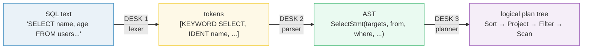

# SQL Query Parsing — Lexer → Parser → Logical Plan: A Visual, Worked-Example Guide

> **Companion code:** [`query_parsing.py`](./query_parsing.py). **Every token,
> AST node, and plan node in this guide is printed by
> `python3 query_parsing.py`** — change the code, re-run, re-paste. Nothing
> here is hand-computed.
>
> **Live animation:** [`query_parsing.html`](./query_parsing.html) — open in a
> browser; it re-runs the lexer, parser, and planner in JS on an editable SQL
> box, with the *identical* pipeline and a gold-check badge against the `.py`.
>
> **Source material:** Aho et al., *Compilers: Principles, Techniques, and
> Tools* (the Dragon Book) §4 *Syntax Analysis*; Silberschatz/Korth/Sudarshan,
> *Database System Concepts* §16 *Query Processing* & §17 *Query Optimization*;
> PostgreSQL docs §52.1 *Parser Overview* (`scan.l` / `gram.y`); Selinger
> 1979 *Access Path Selection in a Relational Database Management System*
> (System R); Graefe 1993/1995 *Volcano/Cascades*.

---

## 0. TL;DR — the mailroom with three desks

A SQL string lands like a handwritten letter. **Three desks** process it in
order, each turning its input into a more structured form:



- **Lexer (Desk 1):** splits raw text into typed **tokens** — labelled slips
  (`KEYWORD`, `IDENT`, `NUMBER`, `STRING`, `OP`, `PUNCT`). No meaning yet, just
  classified words.
- **Parser (Desk 2):** reads tokens left-to-right, checks them against the SQL
  **grammar**, and builds an **AST** — a tree of typed nodes
  (`SelectStmt`, `Column`, `BinaryOp`, …) that captures *structure*.
- **Planner (Desk 3):** reorganizes the AST into a **logical plan tree** in
  relational order (`FROM` → `WHERE` → `GROUP BY` → `HAVING` → `SELECT` →
  `ORDER BY` → `LIMIT`). Each stage becomes a plan node *wrapping* the previous
  one, so `FROM` is the **leaf** and the final clause is the **root**.

> *Picture a mailroom. The **lexer** slices the letter into word-slips and
> stamps each with a type. The **parser** checks the slips obey the grammar of a
> request and assembles them into a structured **order form** (the AST). The
> **planner** turns that order form into a **data-flow worksheet** — "scan this
> shelf, keep these, sort by name" — with the source at the bottom and the
> output at the top. The worksheet (logical plan) is later handed to the
> optimizer, which picks the actual tools (physical plan, §4).*

### Why the plan is a tree and not a list

Every plan node has **inputs** (children) and produces an **output** relation.
A `Filter` takes rows in, keeps the ones matching its predicate, emits the rest
— so it sits *on top of* its input source. Nesting the stages inside-out
(`FROM` leaf, `LIMIT` root) is what makes it a tree, and lets the optimizer
later **swap or move subtrees** (e.g. push the `Filter` below the `Join`).

### Glossary

| Term | Plain meaning |
|---|---|
| **token** | a labelled slip from the lexer. Has a `type` (`KEYWORD`, `IDENT`, `NUMBER`, `STRING`, `OP`, `PUNCT`) and a `value` (the lexeme). |
| **lexeme** | the raw substring a token came from (`SELECT`, `25`, `age`). |
| **keyword** | a reserved word the grammar treats specially (`SELECT`, `FROM`, `WHERE`, `JOIN`, `ON`, `GROUP`, `BY`, `ORDER`, `LIMIT`, `IN`, …). Matched case-insensitively, normalized to UPPER. |
| **identifier** | a user-defined name (table or column). Not a keyword. Case preserved. |
| **literal** | a concrete value token: `NUMBER` (`25`, `3.14`) or `STRING` (`'alice'`). |
| **grammar** | the recursive rules defining valid SQL. Enforced by the parser; a violation is a **syntax error**. |
| **AST** | Abstract Syntax Tree — the structural, in-memory form of the query once tokens pass the grammar. Typed node objects. |
| **logical plan** | the data-flow tree the **planner** builds from the AST. Leaves are `Scan`s; root is the final operator (`Limit`/`Sort`/`Project`). |
| **plan node** | `LogicalScan`, `LogicalFilter`, `LogicalJoin`, `LogicalAggregate`, `LogicalSort`, `LogicalProject`, `LogicalLimit`, `SubqueryScan`. Often called an "operator" in the literature. 🔗 [`JOIN`](./HASH_INDEX.md) algorithms live one layer down (physical). |
| **correlation** | a subquery that references a column from the **outer** query. Cannot be run once — must be re-evaluated per outer row, or **decorrelated** into a join (§5). |
| **round-trip** | `serialize(AST)` → SQL′, then `tokenize(SQL′)` must reproduce the canonical token sequence. Proves the AST is lossless (§6). |

---

## 1. Section A — the lexer (SQL text → tokens)

> *Desk 1: one deterministic left-to-right scan. Emits a `Token` per lexical
> unit. Keywords upper-cased; identifiers keep their case; literals keep their
> text.*

The lexer recognizes six token classes by the **first character** it sees:

| first char | token type | example |
|---|---|---|
| letter / `_` → word in `KEYWORDS` | `KEYWORD` | `SELECT`, `FROM`, `WHERE` |
| letter / `_` → word not reserved | `IDENT` | `name`, `users`, `age` |
| digit | `NUMBER` | `25`, `3.14` |
| `'` | `STRING` | `'alice'` (until closing `'`; `''` is an escaped quote) |
| `= ! < > + - * / %` | `OP` | `>`, `<=`, `!=` (two-char ops matched first) |
| `, ( ) . ;` | `PUNCT` | `,`, `(`, `)` |

Whitespace and `--` line comments are skipped — they carry no meaning.

### The worked example

> From `query_parsing.py` Section A — token stream for
> `SELECT name, age FROM users WHERE age > 25 ORDER BY name`:

```
| # | type     | value          |
|---|----------|----------------|
| 0  | KEYWORD  | SELECT         |
| 1  | IDENT    | name           |
| 2  | PUNCT    | ,              |
| 3  | IDENT    | age            |
| 4  | KEYWORD  | FROM           |
| 5  | IDENT    | users          |
| 6  | KEYWORD  | WHERE          |
| 7  | IDENT    | age            |
| 8  | OP       | >              |
| 9  | NUMBER   | 25             |
| 10 | KEYWORD  | ORDER          |
| 11 | KEYWORD  | BY             |
| 12 | IDENT    | name           |
```

Token-type tally for this query:

| type | count |
|---|---|
| `KEYWORD` | 5 |
| `IDENT` | 5 |
| `PUNCT` | 1 |
| `OP` | 1 |
| `NUMBER` | 1 |

**Two-character operators are matched before their one-char prefixes** — `!=`
is a single `OP` token, not `!` followed by `=`. The lexer peeks two chars
ahead for `!= <> <= >= ||` first.

> `[check]` token count == 13 : **OK**
> `[check]` every `KEYWORD` token value is in the reserved set : **OK**

---

## 2. Section B — the parser (tokens → AST)

> *Desk 2: **recursive descent** — one function per grammar rule, top-down,
> no backtracking on the LL(1) fragments we support. Output: a typed AST.*

The grammar fragment (full version in `query_parsing.py`, `class Parser`):

```
select_stmt := SELECT [DISTINCT] select_list
               FROM table_ref { , table_ref | join_clause }
               [WHERE expr]
               [GROUP BY expr_list]
               [HAVING expr]
               [ORDER BY order_list]
               [LIMIT number]

expr        := or_expr
or_expr     := and_expr { OR and_expr }
and_expr    := not_expr { AND not_expr }
not_expr    := [NOT] comparison
comparison  := additive [ (=|!=|<>|<|>|<=|>=) additive ]
             | additive [NOT] IN ( select_stmt | expr_list )
additive    := multiplicative { (+|-) multiplicative }
multiplicative := primary { (*|/|%) primary }
primary     := number | string | NULL
             | ident [. ident]           -- column, maybe qualified
             | ident ( [expr_list|*] )   -- function call
             | ( expr )
```

**Precedence is encoded by the call chain**: `or_expr` → `and_expr` →
`not_expr` → `comparison` → `additive` → `multiplicative` → `primary`. The
*lower* in the chain, the *tighter* it binds. So `a OR b AND c` parses as
`a OR (b AND c)` (AND binds tighter), matching SQL semantics.

### The AST tree

> From `query_parsing.py` Section B — the typed AST for the demo query:

```
└─ SelectStmt targets=[2] from where order_by=[1]
   ├─ SelectItem(Column(name))
   │  └─ Column(name)
   ├─ SelectItem(Column(age))
   │  └─ Column(age)
   ├─ TableRef(users)
   ├─ BinaryOp(>)
   │  ├─ Column(age)
   │  └─ Literal(NUMBER:25)
   └─ OrderItem(ASC)
      └─ Column(name)
```

Note how **syntax becomes structure**: the comma in `name, age` is gone — it's
now two sibling `SelectItem` nodes. The `>` operator is a `BinaryOp` with a
`Column` left and a `Literal` right. The `ASC` (default, since the user wrote
bare `ORDER BY name`) is materialized as an `OrderItem` with direction `ASC`.

`SelectStmt` field summary:

| field | value |
|---|---|
| `distinct` | `False` |
| `targets` | `[Column(name), Column(age)]` |
| `from_clause` | `TableRef(users)` |
| `where` | `BinaryOp(>)` |
| `group_by` | `-` (none) |
| `having` | `None` |
| `order_by` | `[OrderItem(ASC)]` |
| `limit` | `None` |

> `[check]` WHERE is `BinaryOp('>')` with `Literal('25')` on the right : **OK**

**Why recursive descent and not a parser generator?** For a teaching impl it's
readable — the grammar *is* the code. Production databases (PostgreSQL) use
**flex/bison** (`scan.l` + `gram.y`) for the same reason speed and
shift/reduce-conflict resolution matter at scale, but the *output* — a parse
tree — is the same concept.

---

## 3. Section C — the logical plan (AST → plan tree)

> *Desk 3: reorganize the AST into a **data-flow tree** following the relational
> order. The plan says WHAT each stage computes; the optimizer later decides
> HOW (§4).*

### The fixed relational order

The planner applies the relational-algebra order, each stage wrapping the last:

| SQL clause | relational op | plan node | role |
|---|---|---|---|
| `FROM` / `JOIN` | base relation(s) | `Scan`, `Join` | source rows (the **leaves**) |
| `WHERE` | selection σ | `Filter` | keep rows where predicate holds |
| `GROUP BY` | aggregation γ | `Aggregate` | collapse rows into groups |
| `HAVING` | selection on groups | `Filter` | keep groups where predicate holds |
| `SELECT` | projection π | `Project` | pick/rename output columns |
| `ORDER BY` | sort | `Sort` | order the rows |
| `LIMIT` | cap | `Limit` | keep first N rows |

### The plan tree

> From `query_parsing.py` Section C — logical plan for the demo query:

```
Sort(name ASC)
└─ Project[out=name, age]
   └─ Filter[WHERE](age > 25)
      └─ Scan(table=users)
```

Reading top-down (data flows **up** from the leaf):

| node | what it does |
|---|---|
| `Sort(name ASC)` | order the surviving rows by `name` |
| `Project(name, age)` | emit only these two columns |
| `Filter(age > 25)` | keep rows where the predicate holds |
| `Scan(users)` | read the `users` table (the leaf source) |

> `[check]` plan shape == `Sort > Project > Filter > Scan` : **OK**

### The inversion: SQL is left-to-right, the plan is bottom-up

SQL lists clauses `SELECT … FROM … WHERE …`, but the plan nests `FROM` at the
**bottom** because data flows *up* from the source. This inversion is the #1
thing that confuses newcomers reading their first `EXPLAIN` output: the
**first** word you wrote (`SELECT`) is the **last** operator to run
(`Project`, near the root); the **second** word (`FROM`) is the **first**
(`Scan`, the leaf).

---

## 4. Section D — logical vs physical (WHAT vs HOW)

> *The **logical** plan says WHAT to compute in relational-algebra terms. The
> **physical** plan says HOW — which algorithm implements each node. One
> logical operator can map to SEVERAL physical operators; the cost-based
> optimizer picks the cheapest (Selinger 1979 / System R; Graefe 1993 /
> Cascades).*

### The mapping table

> From `query_parsing.py` Section D — logical operators and their physical
> alternatives:

| logical node | physical alternatives |
|---|---|
| `LogicalScan` | `SeqScan`, `IndexScan`, `IndexOnlyScan`, `BitmapHeapScan` 🔗 [`BTREE.md`](./BTREE.md) |
| `LogicalFilter` | `Filter` (in-memory), `BitmapIndexScan` (pushed) |
| `LogicalJoin` | `NestedLoopJoin`, `HashJoin`, `MergeJoin` |
| `LogicalAggregate` | `HashAggregate`, `GroupAggregate` (sorted input) |
| `LogicalSort` | `QuickSort` (in-memory), `ExternalMergeSort` (on disk) 🔗 [`PAGE_EVICTION.md`](./PAGE_EVICTION.md) (sort spills pages) |
| `LogicalProject` | `Result` (projection), projection folded into child op |
| `LogicalLimit` | `Limit` (stop after N rows) |

### Worked mapping for the Section C plan

> From `query_parsing.py` Section D — one plausible physical choice per node
> (the *real* choice depends on statistics, indexes, and cost parameters):

| logical plan node | example physical pick | why |
|---|---|---|
| `Sort(name ASC)` | `QuickSort` | result set fits in `work_mem` |
| `Project[out=name, age]` | `Result` | just drops/renames columns |
| `Filter[WHERE](age > 25)` | `Filter` | predicate applied row-by-row after scan |
| `Scan(table=users)` | `SeqScan` | no useful index on `age` |

> `[check]` logical root type is stable across runs : **OK**

**Key point:** the LOGICAL tree is **optimizer-invariant** (a property of the
query); the PHYSICAL tree changes with data, indexes, and cost parameters. This
is why `EXPLAIN` (physical) can differ for the same SQL under different
`work_mem`, `enable_hashjoin`, or table statistics. 🔗 The cost model feeds the
[`WAL_CHECKPOINT`](./WAL_CHECKPOINT.md) and buffer-pipeline story
([`PAGE_EVICTION.md`](./PAGE_EVICTION.md)) — sort spills and hash joins
allocate buffer pages.

---

## 5. Section E — subquery handling (`IN (SELECT …)` → `SubqueryScan`)

> *A subquery in `WHERE` nests a `SelectStmt` inside the outer one. The planner
> wraps it as a `SubqueryScan`. Whether it's **correlated** decides whether it
> runs once (uncorrelated → decorrelate to a semi-join) or per outer row
> (correlated → re-execute or decorrelate into a join).*

### Input

```sql
SELECT * FROM users WHERE id IN (SELECT user_id FROM orders)
```

### The AST (nested `SelectStmt`)

> From `query_parsing.py` Section E — note the `InExpr` holding an inner
> `SelectStmt`:

```
└─ SelectStmt targets=[1] from where
   ├─ SelectItem(Star(*))
   │  └─ Star(*)
   ├─ TableRef(users)
   └─ InExpr(subquery)
      ├─ Column(id)
      └─ SelectStmt targets=[1] from
         ├─ SelectItem(Column(user_id))
         │  └─ Column(user_id)
         └─ TableRef(orders)
```

### Correlation analysis

| outer tables | inner references outer column? | classification |
|---|---|---|
| `{'users'}` | `False` | **uncorrelated** |

This example is **uncorrelated** — the subquery's `user_id` comes entirely from
`orders`, with no reference to the outer `users`. So the planner can run it
**once**, materialize the result, and reuse it — typically rewritten
(**decorrelated**) into a **Hash Semi-Join**:

```
Filter(id IN (subquery))   ==>   SemiJoin(users, subquery, on id = user_id)
```

A **SemiJoin** emits an outer row iff it has ≥1 matching inner row, then *stops
probing* that row (no row duplication, unlike an inner join).

### The plan trees

> From `query_parsing.py` Section E — the subquery plan (wrapped in
> `SubqueryScan`):

```
SubqueryScan(uncorrelated)
└─ Project[out=user_id]
   └─ Scan(table=orders)
```

> From `query_parsing.py` Section E — the full outer plan, with the `IN`
> predicate carried by `Filter`:

```
Project[out=*]
└─ Filter[WHERE](id IN (SELECT user_id FROM orders))
   └─ Scan(table=users)
```

> `[check]` WHERE is `InExpr` with a `SelectStmt` subquery, uncorrelated :
> **OK**

### What changes if it IS correlated?

A correlated variant, e.g.

```sql
SELECT * FROM users u
WHERE u.id IN (SELECT user_id FROM orders o WHERE o.total > u.min_spend)
```

references `u.min_spend` from the outer query. The subquery **cannot** be run
once — it depends on the outer row. Two outcomes:

1. **Re-evaluate per outer row** (naive, O(outer × inner)) — correct but slow.
2. **Decorrelate** into a join — the optimizer rewrites
   `IN (SELECT … WHERE o.total > u.min_spend)` into a `SemiJoin` with the
   extra predicate folded into the join condition, recovering set-at-a-time
   execution. This is one of the most valuable transformations in a modern
   optimizer (the Volcano/Cascades framework makes it a tree rewrite).

---

## 6. Section F — the gold check (round-trip fixed point)

> *The AST serializer produces a **canonical** SQL string. The gold check is a
> **fixed-point test**: parse the canonical SQL, re-serialize, and verify the
> result is byte-identical AND the AST is structurally unchanged. That proves
> the AST captured the query with zero information loss.*

```
canon1 = serialize(parse(tokenize(sql)))
canon2 = serialize(parse(tokenize(canon1)))
PASS   <=>  canon1 == canon2  AND  ast_signature(AST1) == ast_signature(AST2)
```

### Results across six query shapes

> From `query_parsing.py` Section F:

| name | fixed-point | AST equal | canon1 tokens | canon2 tokens |
|---|---|---|---|---|
| `simple` | OK | yes | 14 | 14 |
| `join` | OK | yes | 24 | 24 |
| `agg` | OK | yes | 31 | 31 |
| `not_in` | OK | yes | 14 | 14 |
| `subquery` | OK | yes | 13 | 13 |
| `distinct` | OK | yes | 9 | 9 |

> `[check]` GOLD: all 6 queries are round-trip fixed points : **OK**

### Canonical normalization (not a loss)

The canonical form may differ from the user's original SQL, but only by
**normalization** — and the canonical form round-trips perfectly:

| original fragment | canonical fragment | why |
|---|---|---|
| `users u` (bare alias) | `users AS u` | parser records the alias either way |
| `ORDER BY name` (no direction) | `name ASC` | `ASC` is the documented default |
| nested comparison | parens only when precedence demands | minimal, unambiguous |

For the demo query:

```
original : SELECT name, age FROM users WHERE age > 25 ORDER BY name
canonical: SELECT name, age FROM users WHERE age > 25 ORDER BY name ASC
```

### Why a fixed-point check (not raw token equality)?

A user's original SQL may contain redundant parens, implicit defaults, or
stylistic choices the AST does **not** record (because they don't change
semantics). Demanding `tokenize(serialize(ast)) == tokenize(original)` would
reject correct, lossless parsing. The fixed-point test on the *canonical* form
is the rigorous statement: **once canonicalized, the round-trip is stable** —
the same tokens, the same AST, every time. `ast_signature` (a structural walk
**independent** of `to_sql`) confirms the equivalence at the tree level, so we
are not just trusting the serializer to verify itself.

---

## 7. Cheat sheet

```
SQL text
   │  lexer        (scan.l in PostgreSQL)
   ▼
tokens   ── parser (gram.y) ──▶  AST (SelectStmt tree)
                                   │  planner / analyzer
                                   ▼
                        logical plan tree   (relational algebra)
                          Scan → Filter → Aggregate → Project → Sort → Limit
                                   │  optimizer (cost-based)
                                   ▼
                        physical plan       (actual algorithms)
                          SeqScan, HashJoin, QuickSort, ...
```

| stage | input | output | failure mode |
|---|---|---|---|
| **lexer** | SQL text | token list | `SyntaxError: unexpected char` |
| **parser** | token list | AST | `SyntaxError: expected …, got …` |
| **planner** | AST | logical plan tree | (semantic errors, e.g. unknown column) |
| **optimizer** | logical plan | physical plan | picks a bad plan (stats-dependent) |

**One-line mental model:** *the lexer labels words, the parser checks grammar
and builds structure, the planner reorganizes that structure into a bottom-up
data-flow tree — and the round-trip proves nothing was lost along the way.*

---

## 🔗 Cross-references

- [`BTREE.md`](./BTREE.md) — the index a `Scan` may become an `IndexScan` of.
- [`COVERING_INDEX.md`](./COVERING_INDEX.md) — when `Scan` becomes an
  `IndexOnlyScan` (the `Project` columns are already in the leaf).
- [`HASH_INDEX.md`](./HASH_INDEX.md) — one access path the optimizer may pick
  for an equality `Filter`.
- [`PAGE_EVICTION.md`](./PAGE_EVICTION.md) / [`WAL_CHECKPOINT.md`](./WAL_CHECKPOINT.md)
  — where `Sort`/`HashJoin` buffer spills go when they exceed `work_mem`.
- [`HEAP_VS_CLUSTERED.md`](./HEAP_VS_CLUSTERED.md) — the physical storage a
  `Scan` reads from.

---

*Every table and tree above is pasted verbatim from
`python3 query_parsing.py`. Re-run after editing the `.py` and re-paste.*
