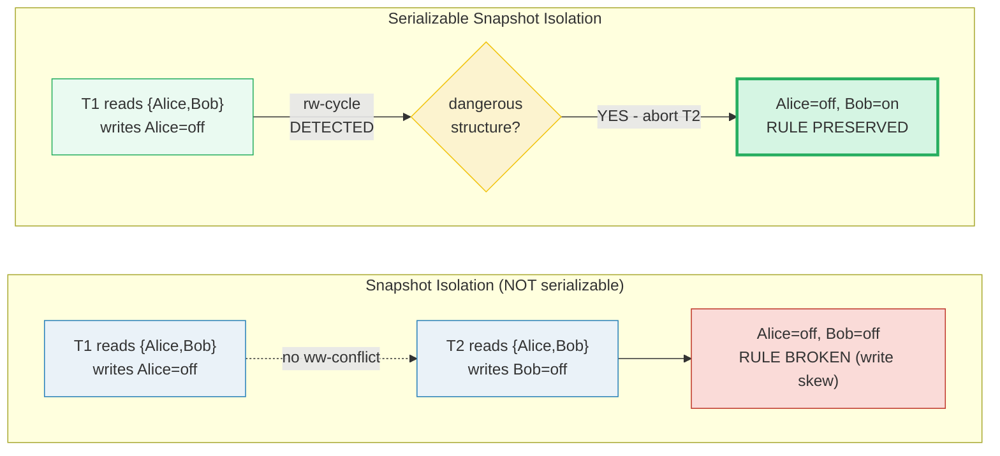
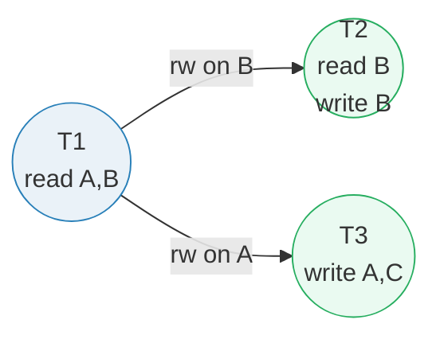
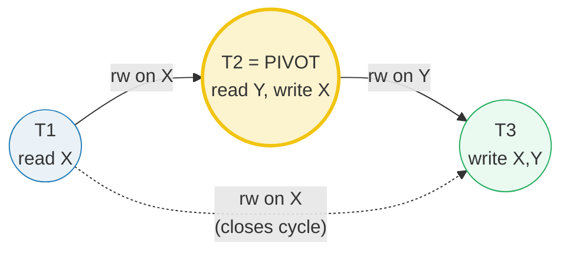
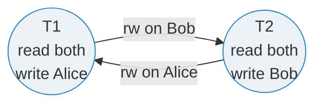

# Serializable Snapshot Isolation (SSI) — A Visual, Worked-Example Guide

> **Companion code:** [`serializable_ssi.py`](./serializable_ssi.py). **Every
> graph, dangerous structure, and abort decision in this guide is printed by
> `python3 serializable_ssi.py`** — change the code, re-run, re-paste. Nothing
> here is hand-computed.
>
> **Live visualization:** [`serializable_ssi.html`](./serializable_ssi.html) —
> open in a browser; it recomputes the dependency graph and the write-skew
> detection in JS with the *identical* logic and gold-checks against the `.py`.
>
> **Source material:** Cahill, *Serializable Isolation for Snapshot Databases*
> (PhD, UQ 2008); Fekete, Liarokapis, O'Neil, O'Neil, Shasha, *Serializable
> Snapshot Isolation: A Reductive Analysis* (VLDB 2005); Berenson et al., *A
> Critique of ANSI SQL Isolation Levels* (SIGMOD 1995); Bernstein & Goodman,
> *Concurrency Control in Distributed Database Systems* (ACMCS 1981);
> PostgreSQL docs §13.2 *Transaction Isolation* (SERIALIZABLE == SSI since 9.1).

---

## 0. TL;DR — snapshot isolation that actually serializes

**Snapshot Isolation (SI)** gives every transaction a frozen snapshot, so reads
never see concurrent writes and **first-committer-wins** kills lost updates.
That blocks almost everything — **except write skew**, the one anomaly where two
transactions each read overlapping data, each writes a *different* row, and the
combination silently breaks an application invariant. SI is therefore **not
serializable**.

**Serializable Snapshot Isolation (SSI)** = SI + a tiny read-write dependency
graph + one cheap rule. SSI records every read as a non-blocking **SIREAD lock**
(a *tripwire*), draws an `rw`-edge whenever a write later hits a tripwire, and
watches for the **dangerous structure**: a *pivot* transaction sitting in the
middle of two consecutive `rw`-edges (`Ti -rw-> Tj -rw-> Tk`). Fekete et al.
(2005) proved that *every* non-serializable cycle under SI contains exactly that
shape — so SSI never hunts the full cycle, just the kink, and aborts **one** of
the three transactions the instant it would complete.

> *Two doctors share night call; the rule is "at least one must stay on call."
> Each, seeing two on call, decides to go off and writes **their own** row. They
> never write the same row, so SI's first-committer-wins never fires — both
> commit, and now nobody is on call. SSI sees the two read-write dependencies
> (`T1 read Bob` ↔ `T2 read Alice`), recognizes the 2-transaction rw-cycle as a
> dangerous structure, and **aborts one doctor before the bad state is
> visible**. That is the entire algorithm: snapshots for speed, tripwires for
> safety, one abort for correctness.*



- **SI (PostgreSQL `REPEATABLE READ`)** — fast snapshots, blocks dirty read,
  non-repeatable read, phantom, and lost update, but **allows write skew**.
- **SSI (PostgreSQL `SERIALIZABLE`)** — everything SI does **plus** write-skew
  prevention and true serial equivalence, paid for in a higher abort rate (§5).
- **The lineage** (🔗 builds on isolation theory): `snapshot reads (SI, fast but
  skew-prone)` → `SIREAD tripwires (record reads without blocking)` →
  `dangerous-structure detection (abort one)` → **SSI = true serializability**.

### Why it matters

Write skew is the reason a "correct-looking" `REPEATABLE READ` transaction can
still corrupt data: constraint-checking reads that don't lock, followed by
non-overlapping writes. Under SSI the doctors-on-call, the
"transfer-then-overdraft", and the "unique-name" anomalies are all caught
*without* the app adding `SELECT ... FOR UPDATE` locks. The price is throughput:
under heavy contention SSI's abort tax can dominate (§5).

### Glossary

| Term | Plain meaning |
|---|---|
| **snapshot (SI)** | a transaction's frozen DB view as of its start instant. Reads never see concurrent writes. PostgreSQL's `REPEATABLE READ` == SI. |
| **rw-conflict** (antidependency) | reader `R` read item `D`, writer `W` wrote `D`, and `R`'s snapshot missed `W`'s write. Drawn `R -rw-> W`. The **only** edge type SI ignores and SSI must watch. |
| **ww-conflict** (lost update) | two transactions wrote the same item. SI resolves it by **first-committer-wins** (loser aborts) — no edge to watch. |
| **SIREAD lock** | a **non-blocking tripwire** recording "T read D" (point) or "T read range `[lo,hi)`" (from an index scan). It never waits a writer; it only seeds the dependency graph. |
| **dangerous structure** | a pivot `Tj` with an **incoming** rw edge (Ti read what Tj wrote) **and** an **outgoing** rw edge (Tj read what Tk wrote): `Ti -rw-> Tj -rw-> Tk`. Necessary for any non-serializable cycle under SI. |
| **pivot (Tj)** | the middle transaction of a dangerous structure. SSI picks a victim from `{Ti, Tj, Tk}` to break the kink. |
| **serialization graph (SG)** | the directed graph of all rw/ww/wr edges. **A cycle in the SG ⇔ a non-serializable history.** |

---

## 1. The dependency graph — nodes = transactions, edges = conflicts

SSI maintains exactly one small directed graph as transactions run: **nodes are
concurrent transactions**, **edges are data conflicts**. Only two flavors
matter:

- **`rw` (antidependency):** reader `R` read `D`, writer `W` wrote `D` — the one
  SI misses and SSI must watch.
- **`ww` (lost update):** both wrote `D` — SI's first-committer-wins already
  handles it, so SSI does **not** even draw the edge.

> From `serializable_ssi.py` **Section A**:
>
> ```
> Transactions:
>   T1: reads=['A', 'B'], writes={}
>   T2: reads=['B'], writes=['B']
>   T3: reads={}, writes=['A', 'C']
>
> rw-antidependencies (reader -rw-> writer, on item):
>   T1 -rw-> T2   on B
>   T1 -rw-> T3   on A
> ww-conflicts (first, second, on item):
>   (none)
>
> graph summary: 3 nodes, 2 rw edge(s) (watched by SSI), 0 ww edge(s).
> ```



**Read it as:** `T1`'s reads of `A` and `B` are both *vulnerable* — `T3`
overwrites `A`, `T2` overwrites `B`. If anything closes a path back to `T1`,
you have a cycle. No `ww`-edge here because no two transactions wrote the same
item; had `T2` and `T3` both written, say, `C`, first-committer-wins would have
resolved it before SSI ever needed to look.

> 🔗 This is the **read-write dependency graph** Bernstein & Goodman (1981)
> formalize: a history is serializable **iff its SG is acyclic**. SSI's whole
> trick (§2) is detecting *almost* a cycle cheaply.

---

## 2. The dangerous structure — `Ti -rw-> Tj -rw-> Tk`

Fekete et al. (2005) proved the theorem SSI runs on:

> **Under Snapshot Isolation, every cycle in the serialization graph contains a
> pivot `Tj` with an incoming `rw` edge AND an outgoing `rw` edge.**

So SSI never looks for full cycles (too expensive — `O(edges³)`). It watches for
the **2-edge kink** through a pivot and aborts one transaction the moment that
kink would complete.

> From `serializable_ssi.py` **Section B**:
>
> ```
>   T1: reads=['X'], writes={}
>   T2: reads=['Y'], writes=['X']
>   T3: reads={}, writes=['X', 'Y']
>
> rw-antidependencies (reader -rw-> writer, on item):
>   T1 -rw-> T2   on X
>   T1 -rw-> T3   on X
>   T2 -rw-> T3   on Y
>
> dangerous structures detected: 1
>   T1 -rw[X]-> PIVOT T2 -rw[Y]-> T3
>
> SSI action: abort ONE transaction to break the kink -> victim = T2
> ```



**`T2` is the pivot:** it is the **writer** in `T1 -rw-> T2` (on `X`) *and* the
**reader** in `T2 -rw-> T3` (on `Y`). The bonus edge `T1 -rw-> T3` (both touch
`X`) is the third edge that would *close* a cycle. SSI doesn't wait for that —
the kink alone is enough to act. The deterministic victim policy aborts `T2`
(the highest-order pivot; equivalent to Cahill's "abort the late committer").

---

## 3. Write skew — SI lets it through, SSI catches it  [GOLD]

The classic anomaly. Two doctors, rule: **at least one must be on call**. Both
read both rows (see two on call), both decide to go off call, but each writes
**its own** row. There is **no `ww`-conflict** (different rows), so SI's
first-committer-wins never triggers.

> From `serializable_ssi.py` **Section C**:
>
> ```
>   T1: reads=['Alice', 'Bob'], writes=['Alice']
>   T2: reads=['Alice', 'Bob'], writes=['Bob']
>
> (1) UNDER SNAPSHOT ISOLATION (PostgreSQL REPEATABLE READ):
> rw-antidependencies (reader -rw-> writer, on item):
>   T1 -rw-> T2   on Bob
>   T2 -rw-> T1   on Alice
>   -> no ww-conflict, so first-committer-wins never triggers.
>   -> SI does NOT look at rw edges at all. Both commit.
>   final state: Alice=off, Bob=off  -> rule satisfied? NO <<< WRITE SKEW
>
> (2) UNDER SERIALIZABLE SSI:
>   dangerous structures detected: 2
>   T1 -rw[Bob]-> PIVOT T2 -rw[Alice]-> T1  [L==Tk: 2-txn rw-cycle]
>   T2 -rw[Alice]-> PIVOT T1 -rw[Bob]-> T2  [L==Tk: 2-txn rw-cycle]
>
>   SSI aborts T2; T1 commits.
>   final state: Alice=off, Bob=on  -> rule satisfied? YES
>
> GOLD (pinned for serializable_ssi.html):
>   rw edges in write-skew graph           = 2
>   dangerous structures detected          = 2
>   distinct pivots flagged                = ['T1', 'T2']
>   SI result rule-satisfied              = False
>   SSI result rule-satisfied             = True
>   SSI victim                            = T2
>
> [check] GOLD: SSI detects write-skew dangerous structure, SI does not -> OK
> ```



The two `rw`-edges form a **2-transaction cycle** (`L == Tk`). Both `T1` *and*
`T2` are detected as pivots — this is the unmistakable **write-skew signature**.
SI ignores `rw`-edges entirely, so the anomaly slips through; SSI feeds them
into the dangerous-structure detector and aborts `T2` **before** the invariant
is broken. Same edges, opposite outcomes — that gap *is* serializability.

> **Gold check:** `dangerous_structures()` on the write-skew graph returns 2
> structures (pivots `{T1, T2}`), `SI result rule-satisfied = False`,
> `SSI result rule-satisfied = True`. The `.html` recomputes this and asserts
> the badge.

---

## 4. SIREAD locks — the non-blocking tripwires

A **SIREAD lock** does **not** block anyone. It just *records* "transaction `T`
read this." When a later write hits the recorded read, SSI draws an `rw`-edge
and re-checks for a dangerous structure. Contrast this with `SELECT ... FOR
UPDATE`, which *waits* a writer — SSI never waits, it only remembers.

| Granularity | Origin | Lock shape |
|---|---|---|
| **POINT** | a row read by TID | `(T, item)` |
| **RANGE** | an index / predicate scan | `(T, [lo, hi))` |
| **RELATION** | a seqscan with **no usable index** | whole table (coarse → many spurious edges) |

> From `serializable_ssi.py` **Section D**:
>
> ```
> T1:  SELECT * FROM accounts WHERE balance BETWEEN 100 AND 200
>        -> index range scan -> SIREAD RANGE lock [100, 200)
> T1:  SELECT balance FROM accounts WHERE id = 'A'
>        -> POINT read on 'A' -> SIREAD POINT lock ('A')
>
> SIREAD lock table after T1's reads:
>   RANGE [100, 200) held by T1
>   POINT 'A' held by T1
>
> T2:  INSERT INTO accounts VALUES (..., balance=150)
>        150 in [100,200)? yes -> trips T1's range lock.
>        -> draw edge T1 -rw-> T2  (range[100,200))
>
> T3:  UPDATE accounts SET balance = -50 WHERE id = 'A'
>        write on 'A' trips T1's POINT lock on 'A'.
>        -> draw edge T1 -rw-> T3  (point:A)
> ```

**Why granularity matters:** an index lets PostgreSQL record a *tight* range
lock; without an index it must seqscan and lock the **entire relation**, which
generates spurious `rw`-edges and unnecessary aborts. This is why
`SERIALIZABLE` workloads need indexes — a missing index turns a surgical
tripwire into a tripwire over the whole table. 🔗 Index mechanics live in
[`BTREE.md`](./BTREE.md) / [`btree.py`](./btree.py).

---

## 5. Performance overhead — the throughput trade-off

SSI is SI plus bookkeeping: one SIREAD lock per read, dependency edges, and a
check at commit. The CPU/storage overhead is modest. The **real** cost is
**aborts**: the more concurrent transactions touch overlapping data, the more
dangerous structures form, the more SSI rolls back.

Deterministic model (per-pair rw-overlap probability `p_rw = r·w/K`; a
transaction is a *pivot* iff it has both an incoming and an outgoing rw edge):

```
P(in)  = 1 - (1-p_rw)^(N-1)        # prob txn has an incoming rw edge
abort_fraction ~= P(in)*P(out)     # prob txn is a PIVOT -> aborted
T_SI  = T0                         # commits all - fast but WRONG on write skew
T_SSI = T0 * (1 - abort_fraction)  # correct, pays the abort tax
```

> From `serializable_ssi.py` **Section E** (`N=20`, `r=2`, `w=1`, `T0=1000`):
>
> | keyspace K | p_rw=r·w/K | P(incoming) | abort_fraction | T_SSI (txns/s) | vs SI |
> |---|---|---|---|---|---|
> | 1000 | 0.0020 | 0.037 | 0.001 | 998.6 | 99.9% |
> | 500 | 0.0040 | 0.073 | 0.005 | 994.6 | 99.5% |
> | 200 | 0.0100 | 0.174 | 0.030 | 969.8 | 97.0% |
> | 100 | 0.0200 | 0.319 | 0.102 | 898.4 | 89.8% |
> | 50 | 0.0400 | 0.540 | 0.291 | 708.9 | 70.9% |
> | 20 | 0.1000 | 0.865 | 0.748 | 251.9 | 25.2% |
> | 10 | 0.2000 | 0.986 | 0.971 | 28.6 | 2.9% |

- **Low contention (`K=1000`):** SSI keeps ~99.9% of SI throughput — almost
  free, and now actually serializable.
- **High contention (`K=10`):** the abort fraction hits ~0.97 and SSI throughput
  collapses to ~3% of SI. SSI is a **poor fit for hot-key write-heavy** work.
- SI's bigger number is a **lie** there — it includes the write-skew anomalies
  SSI prevents. Apples-to-apples, SSI trades throughput for correctness.

**Rule of thumb:** use `SERIALIZABLE` when conflicts are rare and *correctness
is cheaper than app-level locking*; fall back to explicit row locks or
`REPEATABLE READ` when contention is high. PostgreSQL's SSI also caps the
bookkeeping with `max_pred_locks_per_transaction`.

---

## 6. The isolation-level hierarchy — `RU < RC < RR(SI) < SER(SSI)`

Each level prevents a **superset** of the anomalies below it. PostgreSQL maps
the SQL-standard names onto real implementations: `Read Uncommitted` is treated
as `Read Committed`; `Repeatable Read` **is** Snapshot Isolation; and
`Serializable` **is** SSI.

> From `serializable_ssi.py` **Section F** (1 = prevented, 0 = possible):
>
> | anomaly | RU | RC | RR(=SI) | SER(=SSI) |
> |---|:--:|:--:|:--:|:--:|
> | dirty read | 0 | 1 | 1 | 1 |
> | non-repeatable read | 0 | 0 | 1 | 1 |
> | phantom read | 0 | 0 | 1 | 1 |
> | lost update (ww) | 0 | 0 | 1 | 1 |
> | **write skew (rw)** | 0 | 0 | **0** | **1** |

The **single row** that separates SI from SSI is **write skew**: `RR`/SI cannot
stop it; only `SER`/SSI can. Every other anomaly is already `1` at `RR`, because
SI's snapshot plus first-committer-wins handle dirty reads, phantoms, and lost
updates.

> **SQL-standard caveat:** ANSI `Repeatable Read` need *not* prevent phantoms
> (the standard is weaker), but PostgreSQL's `RR` is actually SI, which **does**
> prevent them. Only `SERIALIZABLE` is guaranteed anomaly-free across **all**
> implementations.

---

## 7. Pitfalls & cheat sheet

**Pitfalls**

1. **"My `REPEATABLE READ` transaction is safe."** — It isn't, if it reads a
   value, decides, and writes a *different* row based on it. That is write skew
   (§3). Use `SERIALIZABLE` or add a conflicting write / `SELECT ... FOR UPDATE`
   to force a `ww`/blocking edge SI will catch.
2. **Missing index under `SERIALIZABLE`.** — A seqscan forces a **whole-relation
   SIREAD lock** → spurious `rw`-edges → spurious aborts (§4). Index every
   predicate column.
3. **Long-running serializable transactions.** — They accumulate SIREAD locks and
   *force aborts on everyone else*. Keep them short.
4. **Treating SSI aborts as rare under contention.** — The abort fraction grows
   ~quadratically with conflict density (§5). Retries must be built into the
   app (catch `40001 serialization_failure`).
5. **Confusing "pivot" with "the bad guy."** — SSI may abort *any* of `Ti, Tj,
   Tk`; the victim is a bookkeeping choice, not the transaction that "caused"
   the anomaly.

**Cheat sheet**

```
SI  (PG REPEATABLE READ) : snapshot reads + first-committer-wins.
                           Blocks dirty/non-repeatable/phantom/lost-update.
                           LEAKS write skew  -> NOT serializable.
SSI (PG SERIALIZABLE)    : SI + SIREAD locks + dangerous-structure detection.
                           rw-edge: reader R read D, writer W wrote D  (R -rw-> W)
                           dangerous structure: Ti -rw-> Tj -rw-> Tk  (Tj = pivot)
                           on detection: abort ONE of {Ti,Tj,Tk}. -> serializable.
cost model               : T_SSI = T0 * (1 - pivot_prob); pivot_prob ~ (rw-overlap)^2.
swap to SERIALIZABLE when correctness < app-locking cost AND contention is low.
```

🔗 Sibling concepts: storage layouts [`HEAP_VS_CLUSTERED`](./HEAP_VS_CLUSTERED.md),
[`SLOTTED_PAGE`](./SLOTTED_PAGE.md); access paths [`BTREE`](./BTREE.md),
[`COVERING_INDEX`](./COVERING_INDEX.md),
[`FREE_SPACE_MAP`](./FREE_SPACE_MAP.md).
