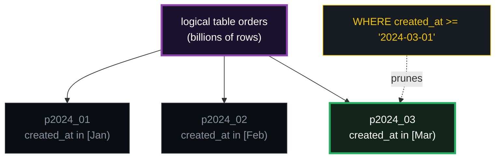
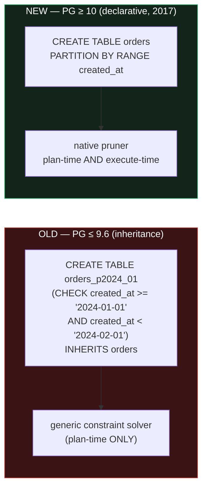
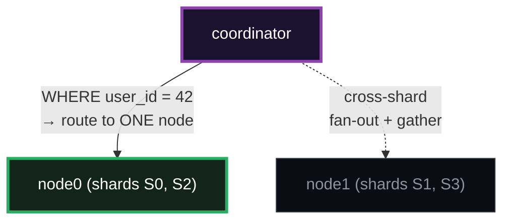

# Partitioning &amp; Sharding — A Visual, Worked-Example Guide

> **Companion code:** [`sharding_partitioning.py`](./sharding_partitioning.py). **Every
> table, routing trace, pruning decision, and distributed plan in this guide is
> printed by `python3 sharding_partitioning.py`** — change the code, re-run,
> re-paste. Nothing here is hand-computed.
>
> **Live animation:** [`sharding_partitioning.html`](./sharding_partitioning.html) —
> open in a browser; it re-runs the routing, pruning, and sharding math in JS
> with the *identical* FNV-1a hash and gold-checks against the `.py`.
>
> **Source material:** PostgreSQL docs §5.11 *Table Partitioning* &amp; §73
> *Internals*; Citus Data, *"Scaling out Postgres with Citus"*; Sugu
> Sougoumarane, *"Vitess: Scaling MySQL"* (2018); Google *Spanner* (OSDI 2012);
> Silberschatz/Korth/Sudarshan, *Database System Concepts* §17; Kleppmann,
> *Designing Data-Intensive Applications*, Ch.6 *Partitioning*.

---

## 0. TL;DR — the library with the sliding drawer stacks

A **partitioned table** is one logical table physically split into several
smaller tables ("partitions"), each holding a **slice** of the rows defined by
the **partition key**. The split is *declared up front*, so the query planner
can **prune**: a `WHERE` on the partition key lets the executor **skip** whole
partitions it can prove are empty for that query.

> *Imagine one library drawer with 4 billion cards. The B-tree index 🔗 still
> finds a card in O(log N), but maintaining, backing up, or scanning that one
> giant drawer is painful. So you **saw the drawer into thinner drawers**, each
> holding a contiguous slice of the cards. RANGE = saw by date; LIST = saw by
> region; HASH = saw by `hash(id) mod N`. Because the saw marks are declared,
> a query only opens the drawers whose slice could hold matches.*



- **Partition** = one physical piece. Same schema as the parent; its own file/segment.
- **Partition key** = the column the saw cuts along (`created_at`, `region`, `user_id`).
- **Pruning** = excluding partitions that provably hold no matching rows. **This
  is the entire reason partitioning pays off** — without it you'd still scan
  everything.
- **Sharding** = partitioning's twin that lives on **multiple machines**. Same
  math, but each partition ("shard") sits on a different **node**, so now
  *network fan-out* and *gather merges* enter the picture.

> From `sharding_partitioning.py` **intro**:
>
> ```
> PARTITIONING = sawing one drawer into slices. PRUNING = only opening the
> slice that could hold the answer. SHARDING = the same slices, but each on
> a different NODE, so a single-shard query touches ONE machine.
> ```

### The three strategies at a glance

| strategy | splits by | prunes on | best for | pitfall |
|---|---|---|---|---|
| **RANGE** | contiguous intervals of an *ordered* key `[lo, hi)` | `&lt;`, `&gt;=`, `BETWEEN` | time-series, rolling windows | hot latest partition; must add new partitions |
| **LIST**  | explicit set of enumerated values | `=`, `IN (...)` | multi-tenant / geo | needs a DEFAULT for new values |
| **HASH**  | `hash(key) % modulus == remainder` | **equality only** | uniform spread of an unordered id | cannot prune ranges; skew if key is biased |

---

## 1. RANGE partitioning — saw by an ordered key

```sql
CREATE TABLE orders (id int, created_at date, amount int)
  PARTITION BY RANGE (created_at);
CREATE TABLE p2024_01 PARTITION OF orders FOR VALUES FROM ('2024-01-01') TO ('2024-02-01');
CREATE TABLE p2024_02 PARTITION OF orders FOR VALUES FROM ('2024-02-01') TO ('2024-03-01');
CREATE TABLE p2024_03 PARTITION OF orders FOR VALUES FROM ('2024-03-01') TO ('2024-04-01');
```

Each partition owns a **half-open interval** `[lo, hi)`. A row routes to the
partition whose interval contains its `created_at`.

> From `sharding_partitioning.py` **Section A** (6 deterministic rows):
>
> | id | created_at | amount | &rarr; partition |
> |---|---|---|---|
> | 1  | 2024-01-05 | 100 | p2024_01 |
> | 2  | 2024-01-28 | 200 | p2024_01 |
> | 3  | 2024-02-03 | 150 | p2024_02 |
> | 4  | 2024-02-25 | 300 | p2024_02 |
> | 5  | 2024-03-02 | 250 | p2024_03 |
> | 6  | 2024-03-30 | 400 | p2024_03 |
>
> ```
> p2024_01  [2024-01-01 .. 2024-02-01): 2 rows -> ids [1, 2]
> p2024_02  [2024-02-01 .. 2024-03-01): 2 rows -> ids [3, 4]
> p2024_03  [2024-03-01 .. 2024-04-01): 2 rows -> ids [5, 6]
> TOTAL: 6 rows across 3 partitions
> ```

**Why RANGE:** time-series and rolling windows. Detaching a whole month is
`DROP TABLE p2024_01` — **O(1)**, no `DELETE`, no vacuum bloat. A B-tree lookup 🔗
([BTREE.md](./BTREE.md)) is still O(log N), but N is now ~⅓ of the table, so
caches stay hot. This is the strategy behind most event/log/audit tables.

---

## 2. LIST partitioning — saw by an enumerated value

```sql
CREATE TABLE users (user_id int, region text, name text)
  PARTITION BY LIST (region);
CREATE TABLE p_us   PARTITION OF users FOR VALUES IN ('US');
CREATE TABLE p_eu   PARTITION OF users FOR VALUES IN ('EU');
CREATE TABLE p_apac PARTITION OF users FOR VALUES IN ('APAC');
```

> From `sharding_partitioning.py` **Section B**:
>
> | user_id | region | name | &rarr; partition |
> |---|---|---|---|
> | 10 | US   | Ada      | p_us   |
> | 11 | EU   | Alan     | p_eu   |
> | 12 | APAC | Grace    | p_apac |
> | 13 | US   | Linus    | p_us   |
> | 14 | EU   | Dijkstra | p_eu   |
>
> ```
> p_us   in {US}:   2 users -> [10, 13]
> p_eu   in {EU}:   2 users -> [11, 14]
> p_apac in {APAC}: 1 user  -> [12]
> ```

**Why LIST:** multi-tenant and geo workloads. Each region's data is **physically
isolated** — ideal for data-residency ("EU data must stay in EU"). A row whose
`region` matches no list value would **error** without a `DEFAULT` partition.

---

## 3. HASH partitioning — saw by `hash(key) % modulus`

```sql
CREATE TABLE events (user_id int, payload text)
  PARTITION BY HASH (user_id);
CREATE TABLE ph0 PARTITION OF events FOR VALUES WITH (MODULUS 4, REMAINDER 0);
CREATE TABLE ph1 PARTITION OF events FOR VALUES WITH (MODULUS 4, REMAINDER 1);
CREATE TABLE ph2 PARTITION OF events FOR VALUES WITH (MODULUS 4, REMAINDER 2);
CREATE TABLE ph3 PARTITION OF events FOR VALUES WITH (MODULUS 4, REMAINDER 3);
```

The **assignment rule** is the thing to internalize: partition `p` owns rows
where `hash(key) % modulus == p` (this is PostgreSQL's
`satisfies_hash_partition(modulus, remainder)`). With equal-width partitions,
`modulus == N` and a row lands in partition `hash(key) % N`.

> *This guide's `hash` is a 32-bit **FNV-1a** of `str(key)`, chosen because it
> is deterministic and trivially portable to JS so the `.html` can gold-check
> byte-for-byte. Real PostgreSQL uses a type-specific hash; the
> modulus/remainder rule is identical.*

> From `sharding_partitioning.py` **Section C** (14 ids):
>
> | user_id | hash(user_id) | % 4 | &rarr; partition |
> |---|---|---|---|
> | 1    | 0873244444 | 0 | ph0 |
> | 2    | 0923577301 | 1 | ph1 |
> | 3    | 0906799682 | 2 | ph2 |
> | 4    | 0822911587 | 3 | ph3 |
> | 5    | 0806133968 | 0 | ph0 |
> | 6    | 0856466825 | 1 | ph1 |
> | 7    | 0839689206 | 2 | ph2 |
> | 8    | 1024243015 | 3 | ph3 |
> | 9    | 1007465396 | 0 | ph0 |
> | 10   | 0468396612 | 0 | ph0 |
> | **42**   | **2279835011** | **3** | **ph3** |
> | 100  | 1731450012 | 0 | ph0 |
> | 1000 | 0580373188 | 0 | ph0 |
> | 9999 | 0042784521 | 1 | ph1 |
>
> ```
> Distribution (the whole point of HASH - even spread):
>   ph0  rem=0:  6 rows  ############################
>   ph1  rem=1:  3 rows  ##############
>   ph2  rem=2:  2 rows  #########
>   ph3  rem=3:  3 rows  ##############
> Skew check: max=6, min=2, max/min ratio = 3.00
> ```

**Why HASH:** an unordered id (a `uuid`, a surrogate key) spreads evenly across
N partitions with no hot spot — perfect for write-scaling. The **cost**: hash is
**not monotonic**, so a range predicate (`user_id &lt; 100`) cannot be pruned (§4).
An **equality** predicate (`user_id = 42`) *can* — we know its hash, so it
routes to exactly one partition. With only 14 small ids the skew ratio looks
high (3.0); across millions of ids the law of large numbers pulls `max/min`
toward 1.

---

## 4. Partition pruning — skip partitions the WHERE rules out

Pruning asks one question per partition: *"could my slice contain a matching
row?"* If no, the executor never opens it. The math is plain **interval/set
intersection**:

| strategy | predicate | keep partition if… |
|---|---|---|
| RANGE | `key &gt;= lo_q AND key &lt; hi_q` | `part_lo &lt; hi_q AND part_hi &gt; lo_q` (interval overlap) |
| LIST  | `key IN (S)`                      | `part_set ∩ S ≠ ∅` |
| HASH  | `key = v`                         | `remainder == hash(v) % modulus` — **exactly one** |
| HASH  | `key &lt; v` (range)              | **cannot prune** — hash is not monotonic → keep all |

> From `sharding_partitioning.py` **Section D**:
>
> ```
> 1) RANGE table, WHERE created_at >= '2024-03-01'
>    partitions scanned: p2024_03   [1/3]
>    SKIP p2024_01  SKIP p2024_02  KEEP  p2024_03
>
> 2) LIST table, WHERE region = 'EU'
>    partitions scanned: p_eu   [1/3]
>    SKIP p_us  KEEP  p_eu  SKIP p_apac
>
> 3) HASH table, WHERE user_id = 42   (equality is decisive)
>    partitions scanned: ph3   [1/4]
>    hash(42)=2279835011, % 4 = 3
>    SKIP ph0  SKIP ph1  SKIP ph2  KEEP  ph3
>
> 4) HASH table, WHERE user_id < 100   (inequality on a HASH key)
>    partitions scanned: ph0, ph1, ph2, ph3   [4/4]
>    hash is NOT monotonic -> cannot prune -> scan ALL
> ```

**Rule of thumb:** pruning works when the partition key's *order or set* is
queryable. RANGE prunes ranges; LIST prunes `IN`/eq; HASH prunes **only**
equality. Plan a range scan on a hash key and you fan out everywhere — so hash
keys are chosen for *point lookups* and *even write distribution*, never for
range scans.

---

## 5. Constraint exclusion (old) vs declarative pruning (new)

Two mechanisms, same goal (skip partitions), **different engines**:



- **OLD** (`constraint_exclusion`): child tables `INHERIT` the parent, each with
  a `CHECK` constraint. The planner's *generic* constraint solver excludes
  children whose `CHECK` contradicts `WHERE`. Must be enabled; **plan-time only**.
- **NEW** (declarative, PostgreSQL 10, 2017): native partition *descriptors*
  drive a dedicated pruner. Fast, and runs at **both plan time and execute
  time** (the latter is "runtime pruning").

> From `sharding_partitioning.py` **Section E** — the killer difference:
>
> ```
> [constant WHERE]  created_at >= '2024-03-01'
>     declarative  -> scan p2024_03   [1/3]
>     constraint   -> scan p2024_03   [1/3]
>     -> same set
>
> [prepared $1 (runtime)]  PREPARE q ... WHERE created_at >= $1;  EXECUTE q('2024-03-01');
>     declarative  -> scan p2024_03   [1/3]
>     constraint   -> scan p2024_01, p2024_02, p2024_03   [3/3]
>     -> DIFFERENT (declarative prunes, old does not)
> ```

**Why this matters:** with a prepared statement (the norm in any connection
pool), the old planner sees `$1` as *unknown at plan time* and scans **all**
children on every execution. Declarative pruning **re-prunes at execute time**
with the bound value → still 1 partition. On a 100-partition time-series table
that is a **100× speedup** for every cached plan. This single gap is what made
declarative partitioning worth shipping in PG 10.

---

## 6. Distributed sharding — Citus / Vitess

**Sharding = partitioning, but each partition lives on a NODE.** Almost always
HASH by a *shard key* (tenant_id, user_id). The new costs are **network
fan-out** and **merging** results across nodes.



This guide's cluster: **4 equal-width hash shards** dividing the 2³² hash space,
**round-robin placed** on 2 worker nodes:

> From `sharding_partitioning.py` **Section F**:
>
> ```
> S0=[0..1,073,741,824)            ->  node0
> S1=[1,073,741,824..2,147,483,648)->  node1
> S2=[2,147,483,648..3,221,225,472)->  node0
> S3=[3,221,225,472..4,294,967,296)->  node1
> node0: shards [0, 2]    node1: shards [1, 3]
> ```

### (1) Single-shard query (shard key in WHERE)

```sql
SELECT * FROM events WHERE user_id = 42;
```
> ```
> route: hash(42)=2279835011  ->  S2=[2,147,483,648..3,221,225,472)  ->  node0
> plan:  Custom Scan (Citus Router Select)
>          -> Seq Scan on events_2   (node0 only)
> fan-out: 1 node touched. ZERO cross-node traffic.
> ```

The hash **is** the address. One node, no fan-out — the 95% case that makes
sharded OLTP fast.

### (2) Cross-shard aggregate → Gather

```sql
SELECT count(*) FROM events;
```
> ```
> plan:  Hash Aggregate (distributed)
>          -> Seq Scan on node0  ->  partial count = 2
>          -> Seq Scan on node1  ->  partial count = 2
>        Gather (sum)  ->  4
> fan-out: ALL 2 nodes; coordinator SUMS partial counts.
> ```

Each node computes a **partial** aggregate; the coordinator combines them
(`sum`, `count`, `min`/`max`). `avg = sum/count` — both halves gathered.

### (3) Cross-shard `ORDER BY ... LIMIT` → Gather Merge

```sql
SELECT * FROM events ORDER BY amount DESC LIMIT 3;
```
> ```
> node0 stream (sorted DESC): [100, 80, 50]
> node1 stream (sorted DESC): [200, 90, 40]
> Gather Merge (k-way merge of sorted streams) -> [200, 100, 90, 80, 50, 40]
> Top-3: [200, 100, 90]
> COST: O(total) merge, NO resort — each node kept its index 🔗
> ```

Each node sorts **locally** (its B-tree index 🔗 may already deliver sorted
output). The coordinator does a **k-way merge** of the sorted streams — O(total)
work, **no resort**. This is why sharded `ORDER BY LIMIT` stays cheap.

### (4) Cross-shard joins — co-located vs broadcast

| join shape | what happens | data moved |
|---|---|---|
| both tables sharded by **same key**, joined on it | **co-located**: join runs locally on each node | **0 rows** |
| one table **not** sharded by the join key | **broadcast**: copy the small table to every node, then local hash join | 1× the small table |
| both sharded by **different** keys | **repartition**: shuffle both by the join key | up to both tables |

**The design lever:** pick the shard key so most queries stay **single-shard**
and most joins stay **co-located**.

---

## 7. Sharding vs partitioning — the one-paragraph summary

| | partitioning | sharding |
|---|---|---|
| lives on | **one machine** | **many nodes** |
| new cost | none (still local I/O) | **network fan-out**, gather, 2PC |
| query routing | planner opens the right file | coordinator routes to the right **node** |
| sweet spot | manageability (drop old months), cache locality | horizontal write scale, multi-tenant isolation |
| same math? | yes — RANGE / LIST / HASH, pruning identical | yes — plus gather-merge for cross-shard ORDER BY |

A partition is a **file on one box**; a shard is a **file on a node**. The
slicing math is identical; once you cross the network, query routing, gather
merges, and co-located joins become the dominant cost.

---

## 8. The gold check (what the `.html` replays)

The canonical invariant: **a row INSERTed via routing must be findable by a
query whose pruning keeps exactly that one partition.**

> From `sharding_partitioning.py` **GOLD CHECK**:
>
> ```
> [RANGE]   INSERT id=99 created_at=2024-03-15 -> p2024_03
>           SELECT ... WHERE created_at >= '2024-03-15' prunes to ['p2024_03']
>           [check] routing covers the inserted partition? OK
>
> [HASH]    INSERT user_id=42 -> ph3
>           hash(42) = 2279835011 ; 2279835011 % 4 = 3 (remainder of ph3)
>           SELECT ... WHERE user_id = 42 prunes to ['ph3']
>           [check] exactly one partition AND it matches the INSERT? OK
>
> GOLD scalar (pinned for sharding_partitioning.html):
>    stable_hash(42) = 2279835011
>    stable_hash(42) % 4 = 3
>    partition = ph3
>
> [check] GOLD overall: OK   (insert routing == query pruning, all types)
> ```

The HTML recomputes `stableHash(42)` in JS and shows the **`check: OK`** badge
when it reproduces `2279835011`, `%4 = 3`, route `ph3`.

---

## 9. Common pitfalls

1. **Forgetting a DEFAULT partition** (LIST/RANGE). A row whose key matches no
   partition *errors the INSERT*. Add `PARTITION ... DEFAULT` to catch strays.
2. **Hash keys for range scans.** `WHERE created_at BETWEEN ...` is fine on a
   RANGE table; the same predicate on a HASH table fans out to **all** partitions.
3. **Hot latest partition (RANGE).** All new writes hit the current month — one
   partition bears the full write load. Hash mitigates this for pure write scale.
4. **Non-partition-key queries.** `WHERE non_pkey = ...` cannot prune and scans
   every partition. Put a **global index** on the hot non-partition keys, or
   re-examine the partitioning choice.
5. **Picking the wrong shard key.** A shard key that isn't in most queries' WHERE
   turns every query into a full fan-out + gather. The shard key should be the
   most common *equality* filter (usually `tenant_id`/`user_id`).
6. **Unique constraints must include the partition key.** Postgres can't enforce
   a unique index across partitions unless it's partitioned by (some superset
   of) the uniqueness columns.
7. **Old `constraint_exclusion` on prepared statements.** It can't runtime-prune
   `$1` (§5). Use declarative partitioning; it's been the default since PG 10.

---

## 10. Cheat sheet

```
PARTITION BY   RANGE(key)      slices [lo,hi)        prunes  <, >=, BETWEEN
               LIST(key)       slices by value set   prunes  =, IN
               HASH(key)       hash(key) % N == p    prunes  = ONLY  (no ranges)

prune(p, q):
  RANGE : keep iff part_lo < q_hi  AND  part_hi > q_lo     (interval overlap)
  LIST  : keep iff part_set ∩ q_set ≠ ∅
  HASH  : key = v  -> exactly ONE partition, hash(v) % N
          key < v  -> keep ALL  (hash not monotonic)

declarative (PG≥10): plan-time + EXECUTE-time pruning ($1 works)
constraint excl (≤9.6): plan-time only -> prepared $1 scans ALL children

sharding = partitions on NODES:
  single-shard (shard key in WHERE) -> 1 node, 0 fan-out
  cross-shard count(*)              -> fan-out N, Gather (sum partials)
  cross-shard ORDER BY LIMIT        -> fan-out N, Gather Merge (k-way, no resort)
  co-located join (same shard key)  -> 0 rows moved, runs per node
  broadcast join (small table)      -> 1× copy of small table to every node
```

---

### 🔗 Companion files &amp; siblings

- **[`sharding_partitioning.py`](./sharding_partitioning.py)** — ground-truth reference impl (run: `python3 sharding_partitioning.py`).
- **[`sharding_partitioning_output.txt`](./sharding_partitioning_output.txt)** — captured stdout, for auditing this guide without running.
- **[`sharding_partitioning.html`](./sharding_partitioning.html)** — interactive routing / pruning / sharding with **check: OK** badge.
- Sibling bundles: [`BTREE.md`](./BTREE.md) (the index *inside* each partition),
  [`HEAP_VS_CLUSTERED.md`](./HEAP_VS_CLUSTERED.md) (what an index points at),
  [`FREE_SPACE_MAP.md`](./FREE_SPACE_MAP.md) (per-partition free space),
  [`MVCC.md`](./MVCC.md) (visibility, which spans all partitions),
  [`WAL_CHECKPOINT.md`](./WAL_CHECKPOINT.md) (durability of every partition).

> Part of the database-internals tutorial series. See
> [`HOW_TO_RESEARCH.md`](./HOW_TO_RESEARCH.md) for the bundle workflow. Every
> number above traces to a `> From sharding_partitioning.py Section X:` callout.
