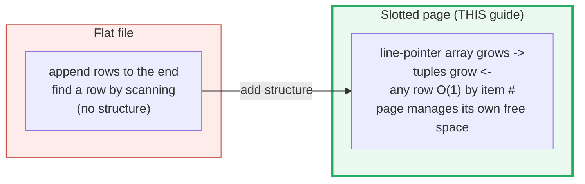
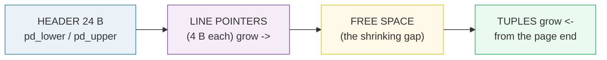
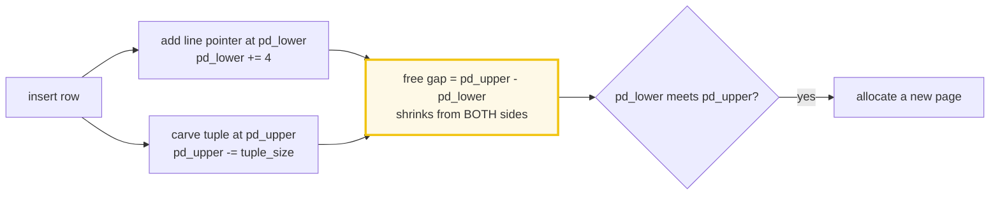
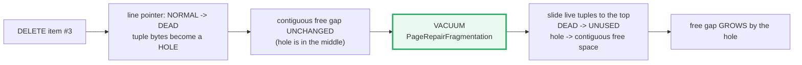
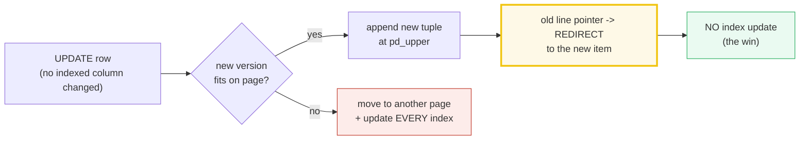
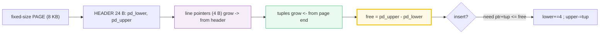

# Slotted Page (PostgreSQL Heap Storage) — A Visual, Worked-Example Guide

> **Companion code:** [`slotted_page.py`](./slotted_page.py). **Every number and
> byte-offset map in this guide is printed by `python3 slotted_page.py`** — change
> the code, re-run, re-paste. Nothing here is hand-computed.
>
> **Live animation:** [`slotted_page.html`](./slotted_page.html) — open in a
> browser; it recomputes the layout in JS with the *identical* logic and
> gold-checks against the `.py`.
>
> **Source material:** PostgreSQL `src/include/storage/bufpage.h`
> (`PageHeaderData`, `ItemIdData`), `src/include/access/htup_details.h`
> (`HeapTupleHeaderData`); Silberschatz/Korth/Sudarshan, *Database System
> Concepts* ("Storage and File Structure").

---

## 0. TL;DR — the shelf that fills from BOTH ends

### Read this first — why a "page" is not just a flat file

A table is not one big append-only file. It is split into thousands of
**fixed-size blocks called pages** (PostgreSQL's default = **8192 bytes = 8 KB**).
Each page is a tiny self-contained shelf that manages its own free space.

The problem a page must solve: rows have **different sizes**, they are
**inserted, deleted, and updated** constantly, and any row must be findable by its
position (**item number**) in O(1) without scanning. The solution is the
**slotted page**:





```
low addresses ------------------------------------------------> high addresses
+---------+------+------+------+----------------+------+------+------+
| HEADER  | LP#1 | LP#2 | LP#3 |     FREE       | Tup3 | Tup2 | Tup1 |
+---------+------+------+------+----------------+------+------+------+
0        24                                  pd_upper           PAGE_SIZE
            pd_lower -->                     <--- pd_upper
            (grows ->)                       (<- grows)
```

- **Insert:** add a line pointer on the left, drop the tuple on the right, the
  free gap shrinks from both sides. They meet → page full.
- **Find:** jump to line pointer #N, read its `(offset, length)`, fetch the bytes.
- **Why tuples can MOVE:** the line pointer is the **stable address** (indexes
  point at a `(page, item-number)` pair). An update can rewrite the tuple
  elsewhere and just re-point its line pointer.

> **One-line definition:** a *slotted page* stores a small **header**, an array of
> **line pointers** (4 B each) growing forward, and the **tuple data** growing
> backward from the page end — the gap between them is the **free space**. This is
> the fundamental storage unit in PostgreSQL, MySQL/InnoDB, DB2, Oracle, …

### Glossary

| Term | Plain meaning |
|---|---|
| **page (block)** | a fixed-size chunk of disk, the unit of I/O. PostgreSQL = 8192 B |
| **page header** | the 24-byte `PageHeaderData` at the start: `pd_lower`/`pd_upper` cursors, the page LSN, a checksum |
| **line pointer** | a 4-byte `(offset, length, flags)` triple (`ItemIdData`). Numbered 1..N (1-based `OffsetNumber`). The **stable address** of a row |
| **tuple** | a stored row = tuple header + column values; lives at the far end, grows backward |
| **`pd_lower`** | offset = end of the line-pointer array = **start** of free space |
| **`pd_upper`** | offset = start of the tuple area = **end** of free space |
| **free space** | the contiguous gap `[pd_lower, pd_upper)` |
| **`lp_flags`** | 2-bit line-pointer state: `0=UNUSED, 1=NORMAL, 2=REDIRECT, 3=DEAD` |
| **HOT update** | Heap-Only Tuples: an on-page, no-index UPDATE — the old line pointer **REDIRECT**s to the new version |

---

## 1. Key facts (all asserted in `slotted_page.py`)

| Quantity | Value | Source |
|---|---|---|
| default page size (`BLCKSZ`) | **8192 bytes** (8 KB) | `pg_config`, PostgreSQL docs |
| `PageHeaderData` | **24 bytes** | `bufpage.h`: `pd_lsn`(8)+`checksum`(2)+`flags`(2)+`pd_lower`(2)+`pd_upper`(2)+`pd_special`(2)+`pagesize_version`(2)+`pd_prune_xid`(4) |
| `ItemIdData` (line pointer) | **4 bytes** | `lp_off:15 + lp_flags:2 + lp_len:15` = 32 bits |
| `lp_flags` states | UNUSED / NORMAL / REDIRECT / DEAD | 2 bits → 4 states |
| `HeapTupleHeaderData` | **23 bytes** (→ 24 aligned) | `htup_details.h` |
| heap "special area" | **0 bytes** (`pd_special == page_size`) | only index pages (B-tree, GiST) use the page tail |

> The printable simulation in this bundle uses a **128-byte** page with the
> **identical** structure (header 24 B, line pointer 4 B; only the toy tuple
> header is shrunk to 4 B so several rows fit). Every byte offset below is real.

### Key formulas (derived and asserted in Section E)

```
usable space      = page_size - header_size
free space now    = pd_upper - pd_lower
max tuples (size) = floor( (page_size - header_size) / (ip_size + tuple_size) )
INVARIANT         page_size == header + line_pointers + live_tuples + holes + free
                  (verified after EVERY operation in the .py -> the gold check)
```

---

## 2. The layout — Section A output

> From `slotted_page.py` **Section A** — canonical 5-tuple page
> (`page=128, header=24, ip=4, tuple_hdr=4`):
>
> ```
> byte-offset map  (page_size=128, pd_lower=44, pd_upper=88, free=44):
>   [   0..  24)  HEADER   PageHeaderData (24 B): pd_lower, pd_upper, LSN, ...
>   [  24..  28)  LP[1 ]   NORMAL   -> tuple[ 119.. 128) "Alice" (9 B)
>   [  28..  32)  LP[2 ]   NORMAL   -> tuple[ 112.. 119) "Bob" (7 B)
>   [  32..  36)  LP[3 ]   NORMAL   -> tuple[ 103.. 112) "Carol" (9 B)
>   [  36..  40)  LP[4 ]   NORMAL   -> tuple[  95.. 103) "Dave" (8 B)
>   [  40..  44)  LP[5 ]   NORMAL   -> tuple[  88..  95) "Eve" (7 B)
>   [  44..  88)  FREE     contiguous gap (44 B)   <- pd_lower .. pd_upper
>   [  88..  95)  TUPLE    item #5 "Eve" (7 B)  [hdr 4 + payload 3]
>   [  95.. 103)  TUPLE    item #4 "Dave" (8 B)  [hdr 4 + payload 4]
>   [ 103.. 112)  TUPLE    item #3 "Carol" (9 B)  [hdr 4 + payload 5]
>   [  112.. 119)  TUPLE    item #2 "Bob" (7 B)  [hdr 4 + payload 3]
>   [  119.. 128)  TUPLE    item #1 "Alice" (9 B)  [hdr 4 + payload 5]
>   [check] ... hdr(24) + ptr(20) + tup(40) + hole(0) + free(44) = 128 == page_size(128)  ->  OK
> ```

Read the tuple side **bottom-to-top**: tuples fill from the **end** of the page
backward (Eve was inserted last → closest to the free gap), while line pointers
fill from the header **forward**. The free gap is the meat in the sandwich.

---

## 3. The two-sided growth — Section B output

Each insert costs **one line pointer (4 B)** carved out of `pd_lower`, **plus the
tuple** carved out of `pd_upper`. The two cursors chase each other across the page:

> From `slotted_page.py` **Section B**:
>
> ```
> legend:  H=header  i=line pointer  .=free  T=tuple
>
> insert #1 "Alice" ... lower=28, upper=119, free=91
>   HHHHHHHHHHHii...........................................TTTT
> insert #2 "Bob"   ... lower=32, upper=112, free=80
>   HHHHHHHHHHHiiii.....................................TTTTTTTT
> insert #3 "Carol" ... lower=36, upper=103, free=67
>   HHHHHHHHHHHiiiiii...............................TTTTTTTTTTTT
> insert #4 "Dave"  ... lower=40, upper=95,  free=55
>   HHHHHHHHHHHiiiiiiii..........................TTTTTTTTTTTTTTT
> insert #5 "Eve"   ... lower=44, upper=88,  free=44
>   HHHHHHHHHHHiiiiiiiiii....................TTTTTTTTTTTTTTTTTTT
> ```
>
> Final: `lower=44, upper=88, free=44`; `[check] ... total = 128 == page_size  ->  OK`.



When `pd_lower >= pd_upper` there is no room for *both* a new pointer and a new
tuple → the page is full and PostgreSQL allocates a fresh page.

---

## 4. Delete + VACUUM reclaim — Section C output

A delete flips the line pointer `NORMAL → DEAD`; the tuple bytes become a **hole**.
Crucially, the **contiguous free gap does NOT grow** unless the dead tuple sat
right next to it. Reclaiming a middle hole needs a **compaction** — what `VACUUM`'s
`PageRepairFragmentation` does.

> From `slotted_page.py` **Section C** — delete item #3 ("Carol"), then compact:
>
> **After delete** (free gap unchanged; a 9-B hole appears):
> ```
>   [  32..  36)  LP[3 ]   DEAD     -> hole [ 103.. 112) (dead, 9 B)
>   ...
>   [ 103.. 112)  HOLE     dead bytes (9 B)  dead tuple (hole)
>   [check] ... hdr(24) + ptr(20) + tup(31) + hole(9) + free(44) = 128  ->  OK
>   contiguous free gap: 44 -> 44 B  (UNCHANGED)
>   total reclaimable:   44 (gap) + 9 (holes) = 53 B
> ```
>
> **After VACUUM compact** (live tuples slid to the top; the hole flowed into the gap):
> ```
>   [  32..  36)  LP[3 ]   UNUSED   -> (reclaimable slot)
>   ...
>   [  44..  97)  FREE     contiguous gap (53 B)   <- pd_lower .. pd_upper
>   [check] ... hdr(24) + ptr(20) + tup(31) + hole(0) + free(53) = 128  ->  OK
>   contiguous free gap: 44 -> 53 B  (GREW by the hole)
> ```



> 🔗 **Two notions of "free":** the **contiguous gap** `[pd_lower, pd_upper)` is
> what a new insert can use immediately; **dead holes** are reclaimable only after
> VACUUM compacts. A line-pointer slot is NOT freed when its row dies (only
> **trailing** unused slots drop, so `pd_lower` rarely shrinks) — dead middle slots
> are reused by later inserts.

---

## 5. HOT update (Heap-Only Tuples) — Section D output

An `UPDATE` that **(a)** keeps the new row on the **same page** and **(b)** changes
no indexed column is a **HOT** update: the new version is simply appended, and the
OLD line pointer becomes a **REDIRECT** to it. **No index is touched** — every
index still points at the old `(page, item)`, and a sequential scan follows the
redirect chain for free.

> From `slotted_page.py` **Section D** — update item #2 "Bob"(7 B) → "Bobby"(9 B):
>
> ```
> Before update (3 tuples):  lower=36, upper=103, free=67
>
> After HOT update:          lower=40, upper=94, free=54
>   [  28..  32)  LP[2 ]   REDIRECT -> REDIRECT to item #4
>   [  36..  40)  LP[4 ]   NORMAL   -> tuple[  94.. 103) "Bobby" (9 B)
>   [  94.. 103)  TUPLE    item #4 "Bobby" (9 B)
>   [ 112.. 119)  HOLE     dead bytes (7 B)  redirect dead bytes
>   [check] ... hdr(24) + ptr(16) + tup(27) + hole(7) + free(54) = 128  ->  OK
>
>   HOT redirect chain:  item #2  --REDIRECT-->  item #4 ("Bobby")
>   indexes still point at item #2; they are NEVER updated.
>   old "Bob" bytes [112..119) are now a dead hole (7 B) - reclaimed by next VACUUM.
> ```



If the new version does **not** fit on the page, the update is **not** HOT: the row
moves to another page and **every** index on the table needs a new `(page, item)`
entry. HOT exists to dodge exactly that cost.

---

## 6. Max tuples per page — Section E output

For uniformly-sized rows, each row costs one 4-B line pointer **plus** its tuple,
so a page holds at most:

```
max_tuples = floor( (page_size - header_size) / (ip_size + tuple_size) )
```

> From `slotted_page.py` **Section E** — tiny 128-B page (toy tuple-hdr = 4):
>
> | payload | tuple = hdr+payload | ip+tuple | max tuples | free left |
> |---|---|---|---|---|
> | 3 | 7 | 11 | 9 | 5 |
> | 5 | 9 | 13 | 8 | 0 |
> | 12 | 16 | 20 | 5 | 4 |
> | 20 | 24 | 28 | 3 | 20 |
>
> Real PostgreSQL 8 KB page (tuple-hdr = 24):
>
> | payload (B) | tuple = 24+payload | ip+tuple | max tuples | rows/MiB |
> |---|---|---|---|---|
> | 0 | 24 | 28 | 291 | 37248 |
> | 8 | 32 | 36 | 226 | 28928 |
> | 40 | 64 | 68 | 120 | 15360 |
> | 100 | 124 | 128 | 63 | 8064 |
> | 232 | 256 | 260 | 31 | 3968 |
> | 1000 | 1024 | 1028 | 7 | 896 |
>
> ```
> [check] tiny page, tuple=9 B:  8 tuples  (fills the 128-B page exactly)  OK
> [check] 8 KB page, tuple=32 B: 226 tuples                               OK
> [check] 8 KB page, tuple=256 B: 31 tuples                               OK
> ```

Big picture: small rows pack **hundreds** per 8 KB page; a 1 KB row fits only ~7.
Row width directly sets table size and scan cost — which is why DBAs watch tuple
width and why PostgreSQL stores **TOAST** pointers for oversized values. The
formula is an **upper bound**: real capacity is slightly lower due to `MAXALIGN`
padding on tuple headers and free-space fragmentation from deletes.

---

## 7. The GOLD value (pinned for `slotted_page.html`)

> From `slotted_page.py` **GOLD block** — the canonical 5-tuple page:
>
> ```
> dims:        page_size=128  header=24  ip=4  tuple_hdr=4
> payloads:    ['Alice', 'Bob', 'Carol', 'Dave', 'Eve']
> tuple sizes: [9, 7, 9, 8, 7]
> pd_lower:    44
> pd_upper:    88
> free_space:  44
> partition:   header=24 + pointers=20 + tuples=40 + holes=0 + free=44 = 128
> [check] gold invariant total == page_size (128):      OK
> [check] gold free_space == 44  (the .html gold scalar):      OK
> ```
>
> [`slotted_page.html`](./slotted_page.html) rebuilds this exact page in JS and
> checks `free == 44 && total == 128 && pd_lower == 44 && pd_upper == 88`.

---

## 8. Pitfalls & debugging checklist

| # | Mistake / surprise | Symptom | Reality |
|---|---|---|---|
| 1 | "I deleted rows but the page didn't get free space back" | `pgstattuple` shows lots of `dead_tuple_len` | Deletes make **holes**, not contiguous free space; `VACUUM` compacts |
| 2 | Expecting `pd_lower` to shrink after deletes | It doesn't | Only **trailing** unused line-pointer slots drop; middle dead slots are reused |
| 3 | "My UPDATE caused index bloat" | Index grew even though the row is small | The update spilled off the page → not HOT → index entries added |
| 4 | Assuming all rows are 8 KB-aligned | Wildly wrong tuple counts | Use the Section E formula with the **real** tuple width (incl. 23–24 B header) |
| 5 | Forgetting the special area | Off-by-N on index pages | Heap pages have **no** special area; B-tree/GiST pages reserve the page **tail** |
| 6 | Treating the line pointer as the row | Stale data | A line pointer can REDIRECT; always follow the chain to the live tuple |

---

## 9. Cheat sheet



- **Lineage:** flat file → slotted page (the universal row-store storage unit).
- **Page = 8192 B; header = 24 B; line pointer = 4 B; tuple header ≈ 24 B.**
- **Two-ended fill:** line pointers grow from `pd_lower`, tuples from `pd_upper`;
  `free = pd_upper − pd_lower`.
- **Line pointer = stable address.** Indexes point at `(page, item#)`; tuples can move.
- **Delete = DEAD hole** (not contiguous free space); **VACUUM** compacts to reclaim it.
- **HOT update:** on-page, no-index UPDATE → old line pointer **REDIRECT**s to the new version.
- **Capacity:** `max_tuples = floor((page − header) / (ip + tuple))` — an upper bound.
- **Invariant:** `page == header + pointers + live_tuples + holes + free` (the gold check).

---

## Sources

- **PostgreSQL source** — `src/include/storage/bufpage.h`
  (`PageHeaderData`: 8+2+2+2+2+2+2+4 = **24 bytes**; `ItemIdData`:
  `lp_off:15, lp_flags:2, lp_len:15` = **4 bytes**; `LP_UNUSED..LP_DEAD`).
  `src/include/access/htup_details.h` (`HeapTupleHeaderData` = **23 bytes**).
  https://github.com/postgres/postgres
  - Verified: default `BLCKSZ = 8192`; heap pages set `pd_special = page_size`
    (no special area); `PageRepairFragmentation` (VACUUM) slides live tuples and
    reclaims trailing unused line pointers.
- **HOT (Heap-Only Tuples)** — PostgreSQL 8.2 release notes; Linnakangas.
  "When an UPDATE changes no indexed column, the new tuple is placed in the same
  page and the old line pointer is set to REDIRECT, avoiding index updates."
  https://www.postgresql.org/docs/current/storage-hot.html
- **Textbook treatment** — Silberschatz, Korth, Sudarshan, *Database System
  Concepts*, "Storage and File Structure" (slotted-page structure); Garcia-Molina,
  Ullman, Widom, *Database System Implementation*.
- **Printable simulation** — `slotted_page.py` uses a 128-byte page with identical
  structure (header 24 B, line pointer 4 B; toy tuple header 4 B) so every byte
  offset is visible. All real-8 KB numbers are computed in Section E.
