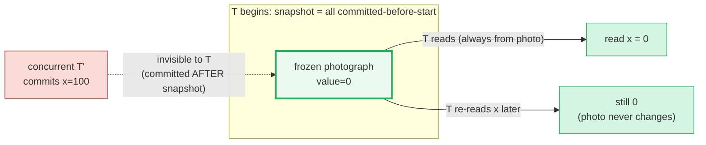
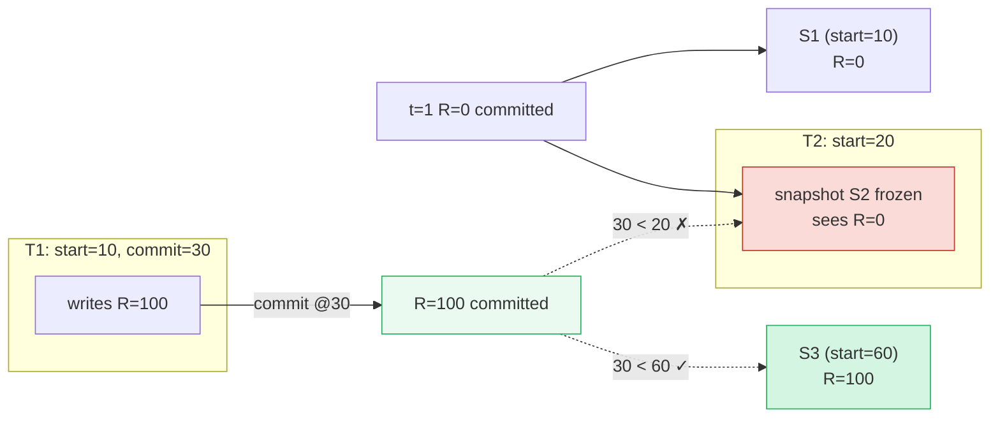
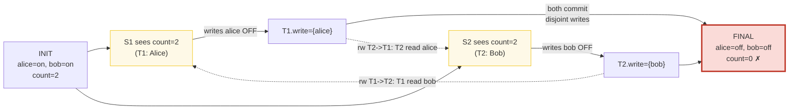
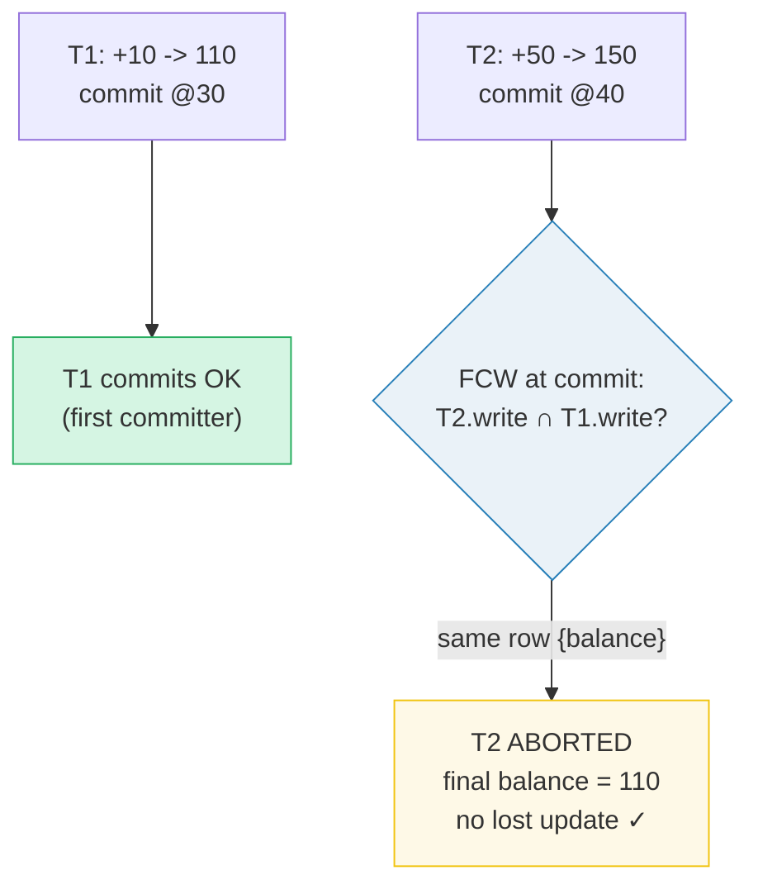

# Snapshot Isolation (SI) — A Visual, Worked-Example Guide

> **Companion code:** [`snapshot_isolation.py`](./snapshot_isolation.py). **Every
> timeline, conflict trace, and anomaly number in this guide is printed by
> `python3 snapshot_isolation.py`** — change the code, re-run, re-paste. Nothing
> here is hand-computed.
>
> **Live animation:** [`snapshot_isolation.html`](./snapshot_isolation.html) —
> open in a browser; it replays the write-skew scenario and re-runs the
> write-skew detector in JS with the *identical* logic, gold-checked against the
> `.py`.
>
> **Source material:** Berenson et al., *A Critique of ANSI SQL Isolation
> Levels* (1995); Cahill, *Serializable Isolation for Snapshot Databases*
> (SIGMOD 2008, SSI); PostgreSQL docs §13.2 *Transaction Isolation*; Kleppmann,
> *Designing Data-Intensive Applications* Ch. 7; Silberschatz/Korth/Sudarshan,
> *Database System Concepts* §14.

---

## 0. TL;DR — the photograph taken at the front door

Under **Snapshot Isolation (SI)**, the moment a transaction `T` **begins**, the
database hands it a **snapshot**: a frozen photograph of every value that was
**committed before** `T` started. Every read `T` does — no matter how long it
runs — is answered from that one photograph.

> *Think of a database with a wall clock of "logical time" `t`. When a
> transaction walks in at time `t`, it gets a **photograph** of the whole
> database taken at that instant — every committed value. It then reads only
> from that frozen photo. So it never sees an uncommitted ("dirty") value, a
> value that changes mid-transaction, or a row that pops in/out of a predicate.
> But because the photo is **frozen at the door**, two transactions that walk in
> at overlapping times hold **different photos**. If they each write a
> **different** row based on what their own photo showed, they can quietly break
> a rule that spanned both rows — the **write skew** anomaly. Neither saw the
> other's write, so neither aborts. That is the one crack SI leaves open, and the
> reason PostgreSQL's `REPEATABLE READ` (= SI) is still one step short of true
> `SERIALIZABLE`.*



- **What SI prevents:** dirty read, non-repeatable read, phantom, lost update
  (via first-committer-wins). The snapshot is frozen → re-reads never change →
  no non-repeatable/phantom.
- **What SI allows:** **write skew** — the one anomaly whose writes touch
  *disjoint* rows, so the conflict detector never sees it (§2). This is the
  entire gap between SI and true Serializability (§5).
- **Where you meet it:** PostgreSQL's `REPEATABLE READ` **is** Snapshot Isolation
  (the SQL-standard name is looser than what PG delivers). PostgreSQL's
  `SERIALIZABLE` is SSI, which closes the write-skew gap (§5).

### Glossary

| Term | Plain meaning |
|---|---|
| **snapshot** | the frozen photograph handed to `T` at `BEGIN` = every value committed strictly before `T.start`. `T` reads only from it. |
| **logical time `t`** | a single increasing integer "tick". Each `BEGIN`, write, and `COMMIT` happens at a distinct tick (deterministic model). |
| **version / MVCC** | the database keeps multiple committed **versions** of a row (one per writer's commit time). A snapshot picks the newest version with `commit_time < snapshot_time`. 🔗 [`HEAP_VS_CLUSTERED.md`](./HEAP_VS_CLUSTERED.md) covers tuple versions; the visibility map in [`COVERING_INDEX.md`](./COVERING_INDEX.md) is the MVCC companion. |
| **visibility rule** | "`Tj` sees `Ti`'s writes" ⟺ `Ti` committed **before** `Tj` started (`Ti.commit < Tj.start`). Read-your-own-writes: `T` always sees its own writes. |
| **read set** | the rows `T` read (or that a predicate `T` ran **matched**). Carries the "T relied on these values" information. |
| **write set** | the rows `T` wrote/updated. |
| **WW conflict** | write-write conflict — two txns wrote the **same** row. |
| **rw conflict** | read-write conflict — `Ti` wrote a row that `Tj` had **read** (`Tj`'s read is now stale vs `Ti`'s committed write). |
| **first-committer-wins (FCW)** | at `COMMIT`, if any concurrent committed txn wrote a row in `T`'s write set, `T` is **aborted**. Stops lost updates on a row. Only fires on **same-row** writes; disjoint writes are ignored. |
| **write skew** | two **concurrent** txns with an rw-conflict in **both** directions (T1 read what T2 wrote AND T2 read what T1 wrote) but with **disjoint** writes (so FCW never fires). The anomaly SI allows; Serializable (SSI) prevents it. |
| **Read Committed (RC)** | each statement sees the latest committed value at that moment → no dirty read, but a value *can* change between two reads of the same row. PostgreSQL's default. |
| **Serializable (SSI)** | true serializability. PostgreSQL `SERIALIZABLE` = **SSI** (Serializable Snapshot Isolation, Cahill 2008): tracks rw-conflicts to catch write skew and abort one txn. |

---

## 1. SI basics — the frozen snapshot, visibility timeline

A snapshot is fixed at `BEGIN`. Consider one row `R`, initialized to `0` at
`t=1`. `T1` begins at `t=10`, writes `R=100`, and commits at `t=30`. `T2` begins
at `t=20` — **before** `T1` commits — so its snapshot is blind to `T1`'s write
even though `T1` commits before `T2` finishes reading.

> From `snapshot_isolation.py` **Section A**:
>
> ```
> EVENT TIMELINE (logical time t ->):
>
>   t=1   T_init COMMITS  : R = 0
>   t=10  T1 BEGIN        : snapshot S1 (sees R=0)
>   t=15  T1 writes R=100 : in T1 workspace (visible to T1, blind to T2)
>   t=20  T2 BEGIN        : snapshot S2 (sees R=0; T1 NOT committed yet)
>   t=30  T1 COMMITS      : R=100 now committed
>   t=40  T2 reads R      : still 0 (S2 frozen at t=20, before T1 commit)
>   t=50  T2 COMMITS      : (T2 wrote nothing)
>   t=60  T3 BEGIN        : snapshot S3 (sees R=100; T1 committed @30<60)
> ```
>
> ```
> SNAPSHOT VISIBILITY (value of R each txn sees at BEGIN):
>
>   | txn | start | snapshot sees R= | reason                                 |
>   |-----|-------|------------------|----------------------------------------|
>   | T1  |    10 |                0 | latest committed R@1=0 (1 < 10)            |
>   | T2  |    20 |                0 | T1 uncommitted at 20 -> snapshot blind    |
>   | T3  |    60 |              100 | T1 committed @30=100 (30 < 60)            |
>
> KEY POINT: T2 re-reads R at t=40 and STILL sees 0, even though T1
> committed R=100 at t=30. T2's snapshot is frozen at its BEGIN (t=20).
> This is exactly how SI blocks non-repeatable reads and phantoms -
> and it is also exactly why write skew can hide between snapshots (Section B).
> ```

The visibility rule is the whole engine:

```
Tj sees Ti  <=>  Ti.commit is not None  AND  Ti.commit < Tj.start
```

`T2` (start=20) is blind to `T1` (commit=30) because `30 < 20` is false. But
`T3` (start=60) sees `T1` because `30 < 60`. This single rule explains every SI
guarantee *and* its one hole:

- **No dirty read** — uncommitted values never enter a snapshot (`Ti.commit` is
  `None`).
- **No non-repeatable read / phantom** — the snapshot is frozen, so a re-read or
  predicate re-scan always returns the *same* set, even as other txns commit.
- **Write skew can hide** — `T1` and `T2` each see a *consistent* but *different*
  frozen photo, and nothing compares what each *wrote* against what the other
  *read* (§2).



---

## 2. Write skew — the two doctors (the anomaly SI allows)

This is the canonical example. Two doctors, Alice and Bob, are both on call. The
**business rule: at least one doctor must be on call at all times.** Both start
transactions to check themselves out for a break.

> From `snapshot_isolation.py` **Section B**:
>
> ```
> Table doctors(name, on_call). INITIAL: Alice on-call, Bob on-call.
> BUSINESS RULE: at least 1 doctor must be on call at all times.
>
> t=1    INITIAL: alice=on_call, bob=on_call  (count=2)
> t=10  T1 (Alice's shift) BEGIN -> snapshot S1: count = 2
> t=10  T2 (Bob's shift)   BEGIN -> snapshot S2: count = 2
>         (both snapshots see BOTH on-call; rule '>=1' looks satisfied)
>
> t=15   T1: count==2 (>=1) -> safe to go off-call
>            UPDATE doctors SET on_call=false WHERE name='alice'
> t=15   T2: count==2 (>=1) -> safe to go off-call
>            UPDATE doctors SET on_call=false WHERE name='bob'
>
> t=20   T1 COMMITS. FCW check on {alice}: no concurrent committed
>        write to alice -> COMMIT OK.
> t=30   T2 COMMITS. FCW check on {bob} vs T1's {alice}:
>        DISJOINT write sets -> no WW conflict -> COMMIT OK.
>
> FINAL committed state: alice_on_call=False, bob_on_call=False
>        on-call count = 0
>
> RULE '>=1 on call'  ==>  0  ==>  VIOLATED  <== WRITE SKEW ANOMALY
> ```

Each transaction read `count == 2` (the rule looked satisfied), then set **its
own** row off-call. They wrote **disjoint** rows (`alice` vs `bob`), so
first-committer-wins saw no overlap and let both commit. Final on-call count:
**0**. The rule is broken, yet SI never aborted anyone.

**Why SI misses it:** `T1` and `T2` never wrote the *same* row, so there is no
write-write conflict for FCW to catch. The danger lives in the **read**-write
dependencies: `T1` read `bob` (then `T2` wrote `bob`), and `T2` read `alice`
(then `T1` wrote `alice`) — a **bidirectional rw-conflict**. SI does not track
reads, so it sees nothing. SSI does track them, and this bidirectional pattern is
exactly what it aborts (§5).



> **The tell-tale pattern:** two concurrent txns, disjoint writes, but each wrote
> a row the *other* read. That bidirectional rw-conflict **is** write skew.

---

## 3. First-committer-wins — SI *does* prevent lost updates

SI is not defenseless: it prevents **lost updates** on the **same** row. Two
transactions both read `balance = 100` and both write it. The second to commit is
**aborted**, so neither write silently overwrites the other.

> From `snapshot_isolation.py` **Section C**:
>
> ```
> Account balance. INITIAL: balance = 100. Two deposits concurrently.
>
> t=1    INITIAL balance = 100
> t=10   T1 BEGIN: reads balance = 100 (snapshot S1)
> t=20   T2 BEGIN: reads balance = 100 (snapshot S2; T1 NOT committed -> still sees 100)
>        T1 wants balance += 10  -> 110
>        T2 wants balance += 50  -> 150
>
> t=30   T1 COMMITS balance=110. FCW check {balance}: no concurrent
>        committed write -> COMMIT OK.
> t=40   T2 tries COMMIT. FCW check {balance} vs T1's {balance}:
>        SAME row -> WW conflict -> T2 ABORTED  (blocker = T1).
>
> FINAL committed balance = 110
> T2's write was DISCARDED. No lost update: T1's +10 survived, and the
> client for T2 must RETRY (it will re-read 110 and write 160). SI's FCW
> turns a silent lost update into an explicit ABORT.
> ```

At commit, FCW compares `T2`'s write set `{balance}` against every transaction
that committed *during* `T2`'s lifetime. `T1` committed at `30` (after `T2`
started at `20`) and also wrote `{balance}` → **WW conflict** → `T2` aborted.

**The crucial contrast with §2:** here both txns wrote the **same** row, so FCW
fires. In the doctors case the writes were **disjoint**, so FCW stayed silent and
write skew slipped through. The rule is precise:

> FCW aborts `T` ⟺ some concurrently-committed txn wrote a row in `T`'s **write
> set**. Disjoint writes → never aborts, even when the logic that *produced* the
> writes was mutually dependent.



---

## 4. SI vs Read Committed — which anomalies each prevents

`READ COMMITTED` (PostgreSQL's default) takes a fresh snapshot per *statement*,
so a value can change between two reads. SI takes one snapshot per
*transaction*. The difference is exactly non-repeatable read, phantom, and lost
update:

> From `snapshot_isolation.py` **Section D** (`P` = prevents, `A` = allows):
>
> ```
> | anomaly            | Read Committed | Snapshot Isolation |
> |--------------------|:--------------:|:-------------------:|
> | Dirty read         |       P        |          P          |
> | Non-repeatable     |       A        |          P          |
> | Phantom            |       A        |          P          |
> | Write skew         |       A        |          A          |
> | Lost update        |       A        |          P          |
>
> DETAIL:
>   Dirty read         RC=P SI=P  -  RC/SI read only committed versions
>   Non-repeatable     RC=A SI=P  -  RC re-reads latest -> value can change
>   Phantom            RC=A SI=P  -  RC predicate re-scan sees new rows
>   Write skew         RC=A SI=A  -  disjoint writes slip past FCW (Section B)
>   Lost update        RC=A SI=P  -  SI FCW aborts the second same-row writer
>
> Read Committed prevents 1/5 anomalies.
> Snapshot Isolation prevents 4/5 anomalies.
> ```

| Anomaly | What happens | Read Committed | Snapshot Isolation |
|---|---|:---:|:---:|
| **Dirty read** | read another txn's *uncommitted* write | **P** | **P** |
| **Non-repeatable read** | re-read the same row → different value | A | **P** |
| **Phantom** | predicate re-scan → rows appear/disappear | A | **P** |
| **Write skew** | two disjoint writes based on stale reads | A | A |
| **Lost update** | two writes to the same row, one silently lost | A | **P** |

SI is **strictly stronger** than RC (it adds 3 preventions on top of RC's one),
and the single remaining hole is **write skew** — the gateway to §5.

> **Note on read skew (A5A):** SI *also* prevents read skew (reading an
> inconsistent `x,y` pair across a concurrent commit) because the snapshot is a
> single consistent point. RC allows it. The five anomalies above are the
> requested core set; read skew is the same family as write skew's stablemate.

---

## 5. SI vs Serializable — write skew is the gap SSI closes

The **only** anomaly that separates SI from true Serializability is write skew.
PostgreSQL's `SERIALIZABLE` is **SSI** (Serializable Snapshot Isolation), which
records predicate reads and looks for the bidirectional rw-conflict that *is*
write skew.

> From `snapshot_isolation.py` **Section E** (`P` = prevents, `A` = allows):
>
> ```
> | anomaly            | Snapshot Isolation | Serializable (SSI) |
> |--------------------|:------------------:|:-------------------:|
> | Dirty read         |         P          |          P          |
> | Non-repeatable     |         P          |          P          |
> | Phantom            |         P          |          P          |
> | Write skew         |         A          |          P          |
> | Lost update        |         P          |          P          |
>
> Snapshot Isolation prevents 4/5; Serializable prevents 5/5.
> The ONLY difference is WRITE SKEW. SI permits it; SSI detects it.
>
> HOW SSI CATCHES WRITE SKEW (Cahill 2008):
>   SSI records every predicate read as a 'SIREAD'. When a txn commits,
>   SSI looks for rw-conflicts that form a DANGEROUS STRUCTURE:
>     T1 read-then-T2-wrote  (rw T1->T2)   AND
>     T2 read-then-T1-wrote  (rw T2->T1)
>   = a bidirectional rw-conflict = write skew. SSI ABORTS one of them.
>
>   In the doctors example (Section B):
>     T1 read {alice,bob}, wrote {alice}  ->  rw T2->T1 (T2 read alice)
>     T2 read {alice,bob}, wrote {bob}    ->  rw T1->T2 (T1 read bob)
>   SSI sees the bidirectional conflict and aborts (say) T2, so Bob
>   stays on call and the rule holds. SI does NOT record predicate reads,
>   so it sees nothing and lets both commit -> count=0.
>
> POSTGRESQL MAPPING (docs 13.2, verified):
>   READ UNCOMMITTED  ~ behaves like READ COMMITTED
>   READ COMMITTED    = statement-level snapshot
>   REPEATABLE READ   = Snapshot Isolation  <-- this file
>   SERIALIZABLE      = SSI (Serializable Snapshot Isolation)
> ```

**How SSI closes the gap:** SSI turns every predicate read into a **SIREAD
lock**. When a transaction commits, SSI scans for a **dangerous structure** — a
pair of rw-conflicts running in **both directions** between two concurrent
transactions (T1 read-then-T2-wrote AND T2 read-then-T1-wrote). That structure
*is* write skew; SSI aborts one transaction to break it. In the doctors case, it
would abort (say) `T2`, so Bob stays on call and the rule holds. SI does not
record reads, so it sees nothing → count=0.

| Isolation level | PostgreSQL name | Mechanism | Write skew? |
|---|---|:---:|:---:|
| Read Committed | `READ COMMITTED` (default) | per-statement snapshot | A |
| Snapshot Isolation | `REPEATABLE READ` | per-transaction snapshot + FCW | **A** |
| Serializable | `SERIALIZABLE` | SI + SSI rw-conflict tracking | **P** |

> **PostgreSQL gotcha:** SQL's `REPEATABLE READ` is *weaker* than what PostgreSQL
> delivers. The standard only requires preventing dirty + non-repeatable reads;
> PostgreSQL's `REPEATABLE READ` additionally prevents phantoms and lost updates
> (it is full SI). So **PostgreSQL `REPEATABLE READ` == Snapshot Isolation**,
> which is strictly between the SQL-standard `REPEATABLE READ` and true
> `SERIALIZABLE`.

---

## 6. Gold check — write-skew detection (re-implemented in JS)

The `.html` re-implements SSI's bidirectional rw-conflict test and gold-checks it
against the `.py`. The detector is the whole story distilled to one predicate:

> From `snapshot_isolation.py` **GOLD**:
>
> ```
> The detector re-implements SSI's bidirectional rw-conflict test:
>
>   write_skew(a,b) =  concurrent(a,b)
>                   AND (a.write & b.write) == {}      [disjoint -> FCW misses]
>                   AND (a.write & b.read)  != {}      [rw a->b]
>                   AND (b.write & a.read)  != {}      [rw b->a]
>
> | scenario            | concurrent | WW conflict | rw a->b | rw b->a | WRITE SKEW? |
> |---------------------|:----------:|:-----------:|:-------:|:-------:|:-----------:|
> | doctors (alice/bob) |    yes     |     no      |   yes   |   yes   |     YES     |
> | counter (balance)   |    yes     |     yes     |   yes   |   yes   |     no      |
> | independent (p/q)   |    yes     |     no      |   no    |   no    |     no      |
>
> GOLD values (pinned for snapshot_isolation.html):
>   doctors   : write_skew=True  ww=False
>   counter   : write_skew=False  ww=True   (FCW aborts, not skew)
>   independent: write_skew=False  ww=False   (clean, no conflict)
>   anomalies prevented: RC=1, SI=4, SER=5
>   final on-call count (doctors, SI) = 0
>   final balance (counter, SI FCW)   = 110
> ```

Three scenarios triangulate the detector:

1. **Doctors** → `WRITE SKEW: YES`. Disjoint writes (`{alice}` vs `{bob}`), but
   rw-conflicts both ways. This is the anomaly; SI lets it through.
2. **Counter** → `no`. Same-row writes (`{balance}`) → **WW conflict** → FCW
   aborts the second. rw both ways, but the WW conflict disqualifies it from
   being write skew.
3. **Independent** → `no`. Totally disjoint reads and writes → no conflict at
   all, both commit cleanly.

> **Decision recipe:** to spot a write skew, ask three questions of two
> concurrent transactions: (1) do they write *disjoint* rows? (2) did each write
> a row the *other* read? If both are yes → write skew, and only SSI catches it.

---

## 7. Pitfalls & cheat sheet

**Pitfalls:**
- **"`REPEATABLE READ` is serializable."** — Not in general, and not in
  PostgreSQL. PostgreSQL `REPEATABLE READ` = SI, which still allows write skew.
  Only PostgreSQL `SERIALIZABLE` (= SSI) is anomaly-free.
- **"First-committer-wins prevents all conflicts."** — It prevents only
  **same-row** (write-write) conflicts. Write skew writes **disjoint** rows, so
  FCW never fires. Disjoint writes are exactly what slips through.
- **"A constraint that holds for every transaction holds for the result."** —
  False under SI for constraints that span multiple rows (like "≥1 on call").
  Each txn alone satisfies the rule; the *combination* violates it. This is the
  heart of write skew.
- **"Snapshot == latest value."** — A snapshot is the latest value *committed
  before BEGIN*. A txn can hold a stale snapshot for arbitrarily long, and
  FCW/SSI — not the read path — are what catch the resulting conflicts.
- **Forgetting read-your-own-writes:** within a transaction you *do* see your own
  uncommitted writes; the snapshot is frozen only for *other* transactions'
  effects.

**Cheat sheet:**

| | Read Committed | Snapshot Isolation (PG `REPEATABLE READ`) | Serializable (PG `SERIALIZABLE` = SSI) |
|---|:---:|:---:|:---:|
| snapshot scope | per statement | per transaction | per transaction |
| dirty read | **P** | **P** | **P** |
| non-repeatable read | A | **P** | **P** |
| phantom | A | **P** | **P** |
| lost update | A | **P** (FCW) | **P** (FCW) |
| **write skew** | A | **A** | **P** (SSI) |
| prevents (of 5) | 1 | 4 | 5 |
| cost | lowest | medium | highest (rw tracking + aborts) |

**Pick the level in 2 questions:**
1. Can a stale read lead two txns to write *different* rows in a way that breaks
   a multi-row rule (on-call, uniqueness-per-group, budget-left)? → you have a
   write-skew risk; use `SERIALIZABLE` (or an explicit constraint / `SELECT ...
   FOR UPDATE`).
2. Only need each read to be self-consistent within one transaction, with no
   cross-row rule? → `REPEATABLE READ` (= SI) is enough, and faster.

**Cross-links:** the snapshot relies on per-row MVCC versions — see
[`HEAP_VS_CLUSTERED.md`](./HEAP_VS_CLUSTERED.md) for tuple versioning 🔗 and the
visibility map in [`COVERING_INDEX.md`](./COVERING_INDEX.md) for how MVCC
visibility interacts with index-only scans 🔗.
