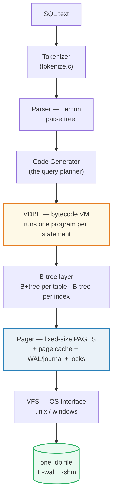
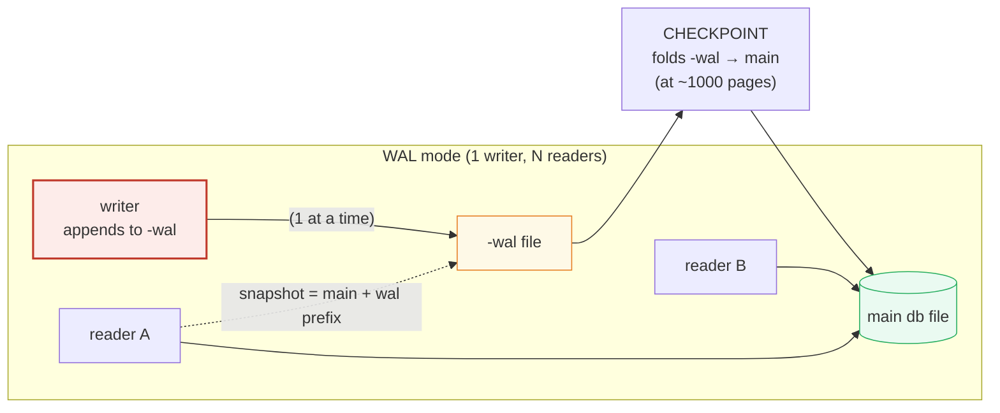

# SQLite — Day 0 to Production Operations

> The **zero-server, one-file, ACID database**. This guide walks the *operations*
> arc: create + tune (Day 0) → tables/indexes/FTS5/JSON (Day 1) → concurrency,
> backup, Litestream replication, and the Postgres-migration decision (Day 2).
> Every number, EXPLAIN plan, and PRAGMA value below is printed by ONE runnable
> file — run it and compare.

**Run it yourself:** `python3 db/sqlite.py` (stdlib `sqlite3` only, no deps)
**Prerequisites:** none — Python 3.8+ ships SQLite. `sqlite3` CLI optional.
**Companion:** [sqlite.py](https://github.com/quanhua92/tutorials/blob/main/db/sqlite.py) · interactive [sqlite.html](https://github.com/quanhua92/tutorials/blob/main/db/sqlite.html) · [sqlite_output.txt](https://github.com/quanhua92/tutorials/blob/main/db/sqlite_output.txt)

## 0. TL;DR

> SQLite is the most deployed database engine in the world — it is in every phone,
> every browser, every app. The question is never *"is SQLite production-ready?"*
> but *"is my workload SQLite-suitable?"*

The whole concept is one design choice: **the file IS the database**. Your process
links the engine in-process (`sqlite3_open()`) and owns a single ordinary file.
There is no server, no port, no network, no login. That gives you:

- **Embedded** — no server to install/admin; ships inside your app binary.
- **Zero-config** — create a file, run SQL. No users, roles, or config files.
- **One writer, many readers** — in WAL mode the file is the lock; reads never block.
- **Bounded by one host** — max ~281 TB in one file, no clustering.

**Rule of thumb:** SQLite for app/device-local, read-mostly, single-writer workloads;
PostgreSQL when you need many concurrent writers, network clients, or HA.

## 1. Architecture — how SQLite works

SQLite does **not** interpret SQL line-by-line. It **compiles** each statement into
a bytecode *program* and runs that program on the **VDBE** virtual machine — the same
trick the JVM pulls, just in-process and tiny. Tables and indexes are each a separate
B-tree, all stored as pages in the *same* one file.



**What "the database" actually is** — the comparison that frames everything:

> From sqlite.py Section A:
> ```
> | property          | SQLite            | PostgreSQL        | MySQL (InnoDB)    |
> |-------------------|-------------------|-------------------|-------------------|
> | runs as a server? | NO (in-process)   | YES (postmaster)  | YES (mysqld)      |
> | network protocol? | NO (library call) | YES (libpq/TCP)   | YES (TCP/socket)  |
> | storage           | 1 file (+wal/shm) | a directory tree  | a directory tree  |
> | users / roles     | filesystem perms  | full GRANT system | full GRANT system |
> | writers at once   | 1 (always)        | many (MVCC)       | many (MVCC)       |
> | readers @ write   | many (WAL)        | many (MVCC)       | many (MVCC)       |
> | install/config    | link the library  | run a server      | run a server      |
> | typical deploy    | app/device-local  | client/server     | client/server     |
> [check] engine is in-process (no server) - import sqlite3 links the lib: OK
> [check] a 'database' is a file path, not a host:port: OK
> ```

🔗 [BTREE.md](https://github.com/quanhua92/tutorials/blob/main/db/BTREE.md) — SQLite's tables and indexes ARE B+trees/B-trees; the page-split/merge mechanics shown there are exactly what the Pager stores.

## 2. Day 0 — create a database & configure (5 minutes)

### Create
```bash
sqlite3 app.db            # create + open a file DB (also: :memory:)
python3 -c "import sqlite3; sqlite3.connect('app.db')"
```

### Essential PRAGMAs

PRAGMAs are SQLite-specific knobs (not standard SQL). **Order matters**: `page_size`
must be set on an *empty* db (before any `CREATE TABLE`), and you **cannot** change
`page_size` once in WAL mode. `foreign_keys` is **OFF by default** — set it right
after connect (it is a no-op inside a transaction).

> From sqlite.py Section B:
> ```
>   PRAGMA page_size=4096            -> 4096  (powers of 2: 512..65536)
>      the on-disk block size. Set BEFORE creating tables; smaller pages
>      = finer-grained writes, larger pages = shallower B-trees.
> 
>   PRAGMA journal_mode=WAL          -> wal  (was DELETE by default)
>      the default journal_mode is DELETE (rollback journal). WAL gives
>      many readers + 1 writer at once and fewer fsync()s. WAL mode is
>      PERSISTENT (survives close/reopen). WAL does NOT work on a network
>      filesystem (it needs shared memory on one host).
> 
>   PRAGMA synchronous=NORMAL        -> 1  (0=OFF,1=NORMAL,2=FULL,3=EXTRA)
>      FULL fsync()s the WAL on every COMMIT (safest, slowest). NORMAL
>      fsync()s only at checkpoint -> far faster; risks losing the last
>      txn on power loss but NOT corrupting the db. WAL+NORMAL is the
>      standard production combo. OFF risks CORRUPTION - avoid.
> 
>   PRAGMA cache_size=-8000          -> -8000  (= 8,192,000 B in page cache)
>      POSITIVE N = N pages cached; NEGATIVE N = abs(N*1024) bytes. The
>      default is -2000 (~2 MB). Bigger cache = fewer disk reads. Session
>      only (resets on reopen). Negative form scales auto with page_size.
> 
>   PRAGMA mmap_size=268435456       -> 268,435,456  (256 MB)
>      memory-map the db file for reads (0 = off). Helps read-heavy/analytic
>      workloads by avoiding read() syscalls; no effect on writes.
> 
>   PRAGMA temp_store=MEMORY         -> 2  (0=DEFAULT,1=FILE,2=MEMORY)
>      put temp B-trees (ORDER BY/GROUP BY spills) in RAM, not a temp file.
> 
>   PRAGMA foreign_keys=ON           -> 1  (DEFAULT is 0 = OFF!)
>      SQLite does NOT enforce FKs unless you turn this on per-connection.
>      A no-op inside a transaction, so set it right after connect.
> 
>   PRAGMA busy_timeout=5000         -> 5000  (milliseconds)
>      how long to retry on SQLITE_BUSY before giving up. Essential when
>      more than one connection may write.
> [check] journal_mode=WAL returned 'wal': OK
> [check] page_size is 4096 (default block): OK
> [check] synchronous=NORMAL encodes as 1: OK
> [check] cache_size -8000 => negative=kibibyte form: OK
> [check] temp_store=MEMORY encodes as 2: OK
> [check] foreign_keys enabled (1): OK
> ```

**Performance impact** (what each knob trades):

| PRAGMA | Default | Production | What you trade |
|---|---|---|---|
| `journal_mode` | `DELETE` | `WAL` | WAL = readers don't block the writer; needs shared memory (1 host) |
| `synchronous` | `FULL` | `NORMAL` | speed vs. losing the *last* txn on power loss (never corruption) |
| `cache_size` | `-2000` (~2 MB) | `-8000`..`-200000` | RAM for fewer disk reads |
| `mmap_size` | `0` | `256 MB`+ | address space for zero-syscall reads |
| `foreign_keys` | `OFF` | `ON` | safety; off is a footgun |

### PRAGMA quick-start configs (copy-paste, on a fresh connection)

```sql
-- (a) application database (the common case)
PRAGMA journal_mode=WAL;
PRAGMA synchronous=NORMAL;
PRAGMA cache_size=-8000;        -- ~8 MB
PRAGMA temp_store=MEMORY;
PRAGMA foreign_keys=ON;
PRAGMA busy_timeout=5000;

-- (b) analytics / read-mostly (big cache + mmap)
PRAGMA journal_mode=WAL;
PRAGMA synchronous=NORMAL;
PRAGMA cache_size=-200000;      -- ~200 MB
PRAGMA mmap_size=4294967296;    -- 4 GB mmap

-- (c) embedded / single-process (no shared memory needed)
PRAGMA journal_mode=WAL;
PRAGMA locking_mode=EXCLUSIVE;  -- no shm file; one owner only
PRAGMA synchronous=NORMAL;
PRAGMA temp_store=MEMORY;
```

## 3. Day 1 — tables, indexes, FTS5, JSON, CRUD

### Schema design (SQLite-specific tips)
- `INTEGER PRIMARY KEY` is an **alias for the implicit `rowid`** — a lookup by it
  is a B+tree key search, the fastest path. Don't waste it.
- Storage classes are dynamic (`INTEGER`, `REAL`, `TEXT`, `BLOB`, `NULL`); declared
  type is "type affinity", not a hard constraint.
- `UNIQUE` and `PRIMARY KEY` create **implicit indexes** (`sqlite_autoindex_*`).
- Use `executemany()` + one transaction for bulk inserts, or every row is fsync'd.

### EXPLAIN QUERY PLAN — the 3 access patterns you must recognize

The plan tells you *how* the query runs. The headline word is what matters:
`SCAN` (reads every row) vs `SEARCH … USING INDEX` (descends an index) vs
`SEARCH … USING COVERING INDEX` (index-only, table never touched).

> From sqlite.py Section C:
> ```
>   A. full scan (no index on bio):
>      SELECT id,bio FROM users WHERE bio LIKE '%sqlite%'
>      -> SCAN users
>      SCAN = reads EVERY row. On 1000 rows that is 1000 rows examined.
> 
>   B. index search (idx_users_score):
>      SELECT id FROM users WHERE score=4.17
>      -> SEARCH users USING COVERING INDEX idx_users_score (score=?)
>      SEARCH USING INDEX = descends the index B-tree to matching keys.
> 
>   C. covering index (idx_users_cov) - index-only scan:
>      SELECT score,name FROM users WHERE score BETWEEN 10 AND 20
>      -> SEARCH users USING COVERING INDEX idx_users_cov (score>? AND score<?)
>      COVERING INDEX = the index has every column the query needs, so
>      the table is never touched (no 'rowid' lookup per match).
> ```

A `SCAN → SEARCH` flip in the plan **is** the signal an index helped — and it is
deterministic, unlike a stopwatch. The demo's 10,000-row table shows it cleanly:

> From sqlite.py Section C (scan vs index):
> ```
>   10,000 rows, WHERE kind='c'  (no index on kind):
>      -> SCAN events
>      matches=2016, but the engine examines ALL 10,000 rows.
>   after CREATE INDEX idx_events_kind(kind):
>      -> SEARCH events USING INDEX idx_events_kind (kind=?)
>      now only ~2016 rows are fetched via the index. A SCAN -> SEARCH
>      flip in EXPLAIN QUERY PLAN is the real signal an index helped.
> ```

🔗 [COVERING_INDEX.md](https://github.com/quanhua92/tutorials/blob/main/db/COVERING_INDEX.md) and [BTREE.md](https://github.com/quanhua92/tutorials/blob/main/db/BTREE.md) — the index mechanics behind `SEARCH USING COVERING INDEX`.

### FTS5 full-text search

`FTS5` is a virtual-table module that builds an **inverted index** (term → rowids).
`MATCH` is far faster than `LIKE '%x%'` on large text, and ranking is free via `bm25`
(the `rank` column sorts by relevance — smaller is better).

```sql
CREATE VIRTUAL TABLE docs USING fts5(title, body);
INSERT INTO docs(title,body) VALUES('doc0','sqlite is a self-contained ...');

-- search + rank by bm25 (built-in):
SELECT title, rank FROM docs
 WHERE docs MATCH 'sqlite OR wal'
 ORDER BY rank;
-- helper functions: bm25(), highlight(), snippet()
```

> From sqlite.py Section C:
> ```
>   CREATE VIRTUAL TABLE docs USING fts5(title, body);
>   query: SELECT title,rank FROM docs WHERE docs MATCH 'sqlite OR wal'
>          ORDER BY rank;   -- rank sorts by bm25 relevance (smaller=better)
>      doc5   rank=-1.064
>      doc0   rank=-1.022
>      doc9   rank=-1.022
>      doc10  rank=-1.022
>      doc4   rank=-0.983
>      doc1   rank=-0.947
>   FTS5 builds an inverted index (term -> rowids). MATCH is far faster
>   than LIKE '%x%' on large text. highlight()/snippet()/bm25() are built-in.
> ```
> [check] FTS5 MATCH returned ranked hits: OK

### JSON support

JSON is **built into modern SQLite** (no separate extension). Store JSON in a `TEXT`
column, read fields with `json_extract`, and **index an expression** (a json path) so
filtered reads become index-backed:

```sql
CREATE TABLE config(id INTEGER PRIMARY KEY, payload TEXT);
INSERT INTO config(payload) VALUES('{"feature":"a","version":4,"enabled":false}');
SELECT json_extract(payload,'$.version');                 -- 4
-- index a JSON path expression:
CREATE INDEX idx_cfg_ver ON config(json_extract(payload,'$.version'));
SELECT id FROM config WHERE json_extract(payload,'$.version')=5;
-- -> SEARCH config USING COVERING INDEX idx_cfg_ver (<expr>=?)
```

## 4. Day 2 — concurrency, backup, Litestream, migration

### WAL mode & concurrency



- **Rollback journal (`DELETE` mode):** a writer EXCLUSIVE-locks the file; readers wait.
- **WAL mode:** writers *append* to `-wal`; readers read main + a WAL prefix. So
  **readers never block writers, writers never block readers — but there is exactly ONE writer.**
- A reader's view is frozen at transaction start (snapshot isolation):

> From sqlite.py Section D:
> ```
>   reader saw 500 rows before AND 500 during an uncommitted write
>      (snapshot isolation: the reader's view is frozen at txn start).
> ```

### `BEGIN IMMEDIATE` vs `BEGIN DEFERRED`

| | DEFERRED (default) | IMMEDIATE |
|---|---|---|
| write lock taken | on the **first write** | at **`BEGIN`** |
| contention surfaces | at **COMMIT** (after all the work) | **immediately** (`SQLITE_BUSY`) |
| use when | read-mostly, rarely writes | the txn **will** write (fail fast) |

> From sqlite.py Section D (write contention):
> ```
>   w2 got: OperationalError: database is locked
>   Fix: set PRAGMA busy_timeout=N (retry N ms), or retry the txn in a loop,
>   or use BEGIN IMMEDIATE so the contention surfaces at the start.
>   Practical max concurrent WRITERS = 1. Concurrent READERS: effectively
>   unbounded (limited by file descriptors / OS).
> ```
> [check] second concurrent writer hit SQLITE_BUSY: OK

🔗 [WAL_CHECKPOINT.md](https://github.com/quanhua92/tutorials/blob/main/db/WAL_CHECKPOINT.md) — the STEAL/NO-FORCE + ARIES crash-recovery model SQLite's Pager also implements; `synchronous=NORMAL` fsyncs only at checkpoint.

### Backup strategies

- **Online Backup API** (`sqlite3.backup()` / `.backup`) — safe **while the db is in
  use**; copies page-by-page following the WAL.
- **Plain file copy** — only after you fold the WAL in: `PRAGMA wal_checkpoint(TRUNCATE);`
  then copy the main file.

> From sqlite.py Section D:
> ```
>   conn.backup(dst) copied the live db page-by-page -> 16,384 B.
>   The Online Backup API is SAFE while the db is in use (it follows WAL).
>   ...
>   estimate for a 1 GB db = 262,144 pages (@4096 B) copied in
>   ~5.1 s at 200 MB/s sequential I/O (illustrative).
> ```

### Litestream — continuous S3 replication

Litestream runs as a **separate sidecar process**. It tails the `-wal` file and ships
new frames to object storage on an interval (default ~1 s). On disaster you
`litestream restore` a fresh replica. **RPO ≈ the sync interval ≈ 1 s.**

Why it works so cleanly: SQLite is one file and the WAL is append-only → shipping the
WAL *is* shipping committed transactions. No triggers, no binlog rigging.

```yaml
# litestream.yml
dbs:
  - path: /var/app/app.db
    replicas:
      - type: s3
        bucket: my-db-backups
        path:   app.db
        sync-interval: 1s   # controls RPO
```

### When to migrate to PostgreSQL

> From sqlite.py Section D:
> ```
>   +---------------------------------------+----------------+
>   | requirement                           | stay SQLite?   |
>   +---------------------------------------+----------------+
>   | >1 concurrent writer (writes overlap) | NO -> Postgres |
>   | clients on DIFFERENT hosts (network)  | NO -> Postgres |
>   | data > ~1 TB on one host              | maybe Postgres|
>   | built-in streaming replication / HA   | NO -> Postgres |
>   | advanced planner / parallel queries   | NO -> Postgres |
>   | fine-grained users / roles / GRANT    | NO -> Postgres |
>   | app/device-local, read-mostly, <1 TB  | YES (SQLite)   |
>   | zero-admin embedded / edge            | YES (SQLite)   |
>   +---------------------------------------+----------------+
> ```

**Migration checklist:**
1. `sqlite3 app.db .schema > schema.sql` — dump schema
2. fix dialect: `INTEGER PRIMARY KEY` → `SERIAL/BIGSERIAL`; drop PRAGMAs;
   `->`/`->>` → Postgres JSON ops
3. `sqlite3 app.db .dump > data.sql` (or CSV per table) — export data
4. `psql -f schema.sql && psql -f data.sql` — load
5. point the app at Postgres (one writer → many writers)
6. cutover + keep the SQLite file as a cold backup

## 5. Limits & storage

> From sqlite.py Section E:
> ```
> | limit                  | value                          | note                       |
> |------------------------|--------------------------------|----------------------------|
> | max string / BLOB      | 1,000,000,000 bytes (~1 GB)     | SQLITE_MAX_LENGTH          |
> | max columns per table  | 2000                   | up to 32767 compile-time   |
> | max pages              | 4,294,967,294 (2^32-2)         | SQLITE_MAX_PAGE_COUNT      |
> | max db size @65536 pg  | 281,474,976,579,584 B (~281 TB) | 65536 * max_pages          |
> | max db size @4096 pg   | 17,592,186,036,224 B (~17.5 TB)| default page_size          |
> | max rows per table     | 2^64 (theoretical)             | 281 TB is hit first        |
> | max attached databases | 10 (125 hard max)              | ATTACH                     |
> | page_size options      | 512 .. 65536 (powers of 2)     | default 4096               |
> ```

**Storage identity:** `database file size = page_size × page_count` (exactly).

> From sqlite.py Section E (real measurement, 10,000 rows × 5 columns):
> ```
>      page_size      = 4096 B
>      page_count     = 103  (0 on the freelist)
>      file on disk   = 421,888 B
>      page_size*page_count = 421,888 B == file size: yes
>      bytes/row      ~ 42.2
> 
>   project 1,000,000 rows of the same 5-column shape:
>      ~42.2 B/row * 1,000,000 / 4096 -> ~10,300 pages
>      -> ~42,188,800 B (40.2 MB) on disk.
> ```
> [check] file size == page_size * page_count (storage identity): OK

## 6. Performance — SQLite vs PostgreSQL

> From sqlite.py Section F:
> ```
> | workload                         | SQLite   | Postgres | winner    |
> |----------------------------------|----------|----------|-----------|
> | single-row PK lookup (in-process)|  ~1x     |  ~3-5x   | SQLite    |
> | bulk INSERT (1 txn)              |  ~1x     |  ~1-2x   | tie/SQLite|
> | read-only scan, 1 conn           |  ~1x     |  ~2x     | SQLite    |
> | 100 concurrent writers           |  serial  |  parallel| Postgres  |
> | cross-host clients               |  N/A     |  yes     | Postgres  |
> | full-text search                 |  FTS5    |  ts/GIN  | both ok   |
>   (Absolute ms depend on hardware; the DIRECTION is what matters.)
> ```

**SQLite wins:** embedded/app-local (no IPC), read-heavy (~100:1), < ~1 TB, single writer.
**PostgreSQL wins:** many concurrent writers (real parallel writes via MVCC),
network clients, complex analytics (sophisticated planner + parallel query),
built-in streaming replication / HA, fine-grained auth.

🔗 [LSM_TREE.md](https://github.com/quanhua92/tutorials/blob/main/db/LSM_TREE.md) — the other single-file embedded engine family; B-tree (SQLite) vs LSM (Cassandra/RocksDB) write-amplification tradeoffs.
🔗 [DATABASES.md](https://github.com/quanhua92/tutorials/blob/main/db/DATABASES.md) — the five DB families overview; SQLite is the embedded/file family.

## 7. Use cases & ecosystem

> From sqlite.py Section G:
> ```
> | use case              | why SQLite                                   | example apps            |
> |-----------------------|----------------------------------------------|------------------------|
> | app-local database    | ships in the app, no server to run           | iOS/Android apps       |
> | desktop apps          | one file, zero config, ACID                  | browsers, editors      |
> | analytics / OLAP      | read a file, big cache+mmap; (DuckDB cousin) | ad-hoc data files      |
> | testing               | fast, disposable, file-per-test              | CI test databases      |
> | edge / IoT            | tiny footprint, embedded                     | routers, sensors       |
> | configuration storage | ACID replacement for JSON/INI                | tools, daemons         |
> | application file fmt  | a .sqlite file IS the document               | design/finance files   |
> | website (read-mostly) | litestream-backed, single-node               | docs sites, blogs      |
> ```

**Ecosystem:** DB Browser for SQLite (GUI) · **litestream** (WAL→S3/GCS/Azure) ·
**rqlite** (Raft consensus over SQLite → HA) · **dqlite** (distributed SQLite, Canonical) ·
**Turso / libSQL** (SQLite fork with edge replication + HTTP API) · **DuckDB** (SQLite's analytical, columnar cousin).

### Killer gotchas

| Trap | Symptom | Fix |
|---|---|---|
| `foreign_keys` is **OFF by default** | FKs silently not enforced; orphans accumulate | `PRAGMA foreign_keys=ON;` right after connect (no-op inside a txn) |
| **One writer, ever** | second writer gets `SQLITE_BUSY: database is locked` | `PRAGMA busy_timeout=…`; `BEGIN IMMEDIATE`; serialize writes; or move to Postgres |
| `page_size` after tables | change is ignored | set on an **empty** db; **cannot** change in WAL mode |
| `synchronous=OFF` | **corruption** on power loss (not just data loss) | keep `NORMAL` or `FULL`; never `OFF` in production |
| WAL over a **network filesystem** | random corruption / errors (NFS/SMB) | WAL needs shared memory on one host — use a local disk |
| WAL grows unbounded | `-wal` file balloons, reads slow | a long-lived reader blocks checkpoint; ensure reader gaps or run `wal_checkpoint(TRUNCATE)` |
| autocommit per insert | bulk load is 1000× slower (fsync per row) | wrap in one `BEGIN … COMMIT` / use `executemany` |
| `LIKE '%x%'` | always a full `SCAN`, no index | use **FTS5** (or a trigram tokenizer) for substring search |
| Opening the same file from many processes | lock contention / `SQLITE_BUSY` bursts | connection pool *within one process*; for multi-process writes, queue them |
| `.dump` ≠ live state on a WAL db | backup misses un-checkpointed changes | `PRAGMA wal_checkpoint(TRUNCATE)` first, or use the **Online Backup API** |

### Cheat sheet

```bash
# CLI
sqlite3 app.db                       # open / create
sqlite3 app.db ".schema"             # show schema
sqlite3 app.db ".dump"               # full SQL dump
sqlite3 app.db ".backup app.db.bak"  # online backup
sqlite3 :memory: "SELECT sqlite_version();"
```

```sql
-- Day 0 knobs (set before any CREATE TABLE / outside a txn)
PRAGMA page_size=4096;          -- empty db only
PRAGMA journal_mode=WAL;        -- many readers + 1 writer
PRAGMA synchronous=NORMAL;      -- WAL+NORMAL = the production combo
PRAGMA cache_size=-8000;        -- ~8 MB
PRAGMA temp_store=MEMORY;
PRAGMA foreign_keys=ON;         -- OFF by default!
PRAGMA busy_timeout=5000;

-- introspect
PRAGMA table_info(t);
PRAGMA index_list(t);
EXPLAIN QUERY PLAN SELECT ...;  -- SCAN vs SEARCH vs COVERING
PRAGMA page_count;              -- db file size = page_size * this
PRAGMA wal_checkpoint(TRUNCATE);-- fold -wal into the main db
PRAGMA integrity_check;

-- patterns
CREATE TABLE t(id INTEGER PRIMARY KEY, name TEXT);  -- id = rowid alias
CREATE INDEX idx ON t(name);                        -- b-tree
CREATE INDEX idx ON t(name, extra);                 -- covering
CREATE INDEX idx ON t(lower(name));                 -- expression
CREATE VIRTUAL TABLE d USING fts5(body);            -- full-text
SELECT ... FROM d WHERE d MATCH 'sqlite' ORDER BY rank;
SELECT json_extract(col,'$.k') FROM t;              -- built-in JSON

-- concurrency
BEGIN IMMEDIATE;   -- grab the write lock NOW (fail fast); then COMMIT
```

## Sources

Primary (official SQLite documentation — every claim verified against these):
- SQLite Architecture (Tokenizer → Parser → Code Generator → VDBE → B-Tree → Pager → VFS): https://www.sqlite.org/arch.html
- Limits (max BLOB 1,000,000,000 B; max columns 2000; max pages 4,294,967,294; max DB ~281 TB): https://www.sqlite.org/limits.html
- Write-Ahead Logging (many readers + 1 writer; auto-checkpoint at 1000 pages; `synchronous` FULL/NORMAL; persistent; not over network FS): https://www.sqlite.org/wal.html
- PRAGMA reference (`cache_size` negative=kibibytes; `foreign_keys` OFF by default; `journal_mode`; `synchronous` 0/1/2/3): https://www.sqlite.org/pragma.html
- Transactions (`BEGIN DEFERRED` default; `BEGIN IMMEDIATE` takes the write lock early; `EXCLUSIVE` == `IMMEDIATE` in WAL): https://www.sqlite.org/lang_transaction.html
- FTS5 (`CREATE VIRTUAL TABLE … USING fts5()`; `MATCH`; `ORDER BY rank`; `bm25()`/`highlight()`/`snippet()`): https://www.sqlite.org/fts5.html
- Query Planner & EXPLAIN QUERY PLAN: https://www.sqlite.org/eqp.html
- Atomic Commit In SQLite: https://www.sqlite.org/atomiccommit.html

Secondary (corroborating):
- Litestream — continuous SQLite WAL replication to S3/GCS/Azure (sidecar process, ~1 s RPO): https://litestream.io/  ·  https://github.com/benbjohnson/litestream
- SQLite Internals: Pages & B-trees (B+tree for tables, B-tree for indexes): https://fly.io/blog/sqlite-internals-btree/
- SQLite Internals book (Compiler Alchemy): https://www.compileralchemy.com/books/sqlite-internals/
- Deep Dive into SQLite's Internal Architecture (DEV): https://dev.to/lovestaco/deep-dive-into-sqlites-internal-architecture-2fjl
- HN discussion: "SQLite has six layers: SQL parser → query planner → VDBE → B-tree → pager → OS": https://news.ycombinator.com/item?id=47136553
