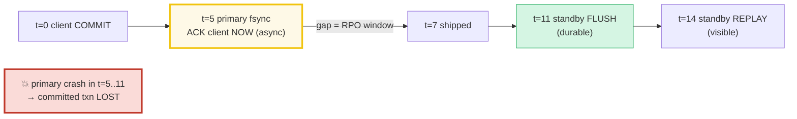
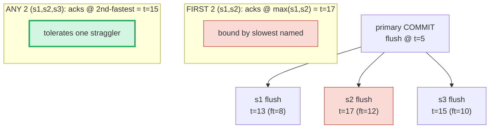
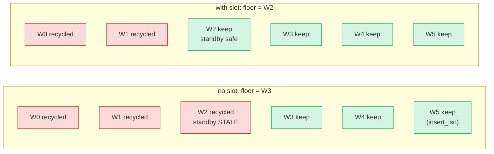
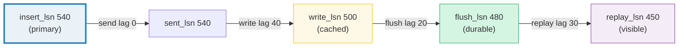
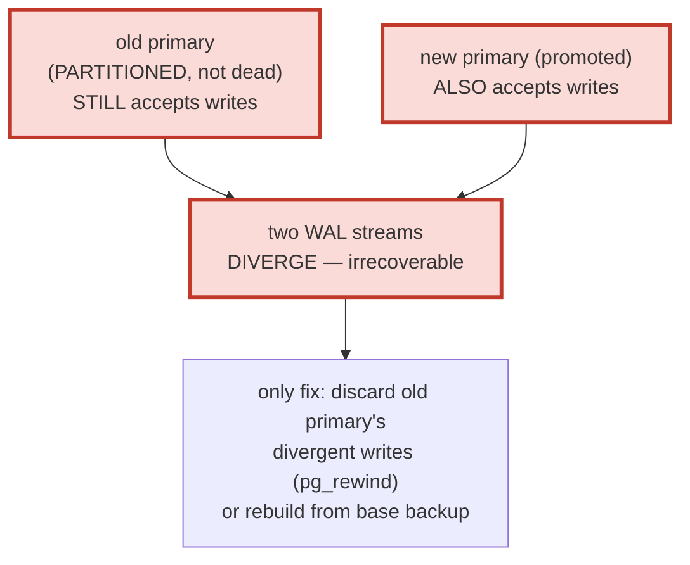

# Streaming Replication — A Visual, Worked-Example Guide

> **Companion code:** [`streaming_replication.py`](./streaming_replication.py).
> **Every timeline, latency, quorum, and LSN in this guide is printed by
> `python3 streaming_replication.py`** — change the code, re-run, re-paste.
> Nothing here is hand-computed.
>
> **Live animation:** [`streaming_replication.html`](./streaming_replication.html)
> — open in a browser; it rebuilds the *same* timelines, quorum check, slot
> model, and lag waterfall in JS, gold-checked against the `.py`.
>
> **Source material:** PostgreSQL docs §27.2 *Streaming Replication*, §27.4
> *High Availability, Load Balancing, and Replication*, §27.2.5 *Replication
> Slots*; `src/backend/replication/walsender.c`, `walreceiver.c`,
> `syncrep.c` (sync-quorum logic); Ongaro & Ousterhout, *In Search of an
> Understandable Consensus Algorithm (Raft)*, ATC 2014 (arXiv:1409.4265) — the
> leader-ships-log + quorum-commit shape; Kleppmann, *Designing Data-Intensive
> Applications* Ch. 5 (Replication); Silberschatz/Korth/Sudarshan, *Database
> System Concepts* §19 (Distributed Databases).

---

## 0. TL;DR — the office with two identical ledgers

A single database machine will eventually die. But you already have the
perfect, ordered description of every change it has ever made: the **WAL**
(🔗 [`WAL_CHECKPOINT.md`](./WAL_CHECKPOINT.md)). The cheapest durable
high-availability trick is therefore to **ship that WAL to a second machine
continuously and have it replay it** — no application logic, no distributed
transactions, just "send the log, apply the log."

> **Streaming replication = the primary pushes WAL records to standby(s) over a
> TCP connection the instant they are produced; each standby writes, flushes,
> and replays them to stay a byte-identical hot copy.** The only design knob is
> *when the primary tells the client "committed"*: immediately (async, fast,
> small data-loss window) or after a standby confirms flush (sync, zero loss,
> round-trip latency).

If you keep a branch office that copies the head office's ledger line-by-line
over a phone call as it is written, then a fire in the head office is no
disaster *if the branch caught up*. Async replication is "tell the client done
the moment the head office writes it"; sync is "wait until the branch confirms
its copy is flushed too."

> *Think of it as: the primary appends to its WAL and **fsync**'s it; a
> **walsender** process streams those bytes over TCP; a **walreceiver** on the
> standby writes them, **flush**'s them (durability), and **replays** them
> (visibility). **Async** acks the client at the local fsync; **sync** acks only
> after the standby's flush is confirmed. A **replication slot** is a bookmark
> that stops the primary erasing WAL the standby still needs. **Failover**
> promotes a standby to primary — and must **fence** the old one or both accept
> writes and diverge (split-brain).*


- **async commit latency = `primary_flush`** — the standby is *not* on the path
  (lowest latency, but a data-loss window).
- **sync commit latency = `primary_flush + max(standby_flush_times)`** — the
  primary waits for the required standby/standbys to confirm **flush**.
- **`synchronous_standby_names`** chooses the rule: a single name, `FIRST n`
  (priority order), or `ANY n` (quorum).
- **`flush_lsn`** is what unblocks a sync commit (durable on the standby), not
  `write_lsn` (cached) and not `replay_lsn` (visible).
- **replication slot** keeps WAL the standby needs from being recycled.
- **failover** promotes a standby; **fencing/STONITH** prevents split-brain.

### Why it matters

Without streaming, recovery from a dead primary means restoring from last
night's backup + replaying today's WAL — minutes to hours of downtime and
potential data loss back to the last backup. With streaming replication a
standby is at most **milliseconds** behind, so promoting it is a near-instant
failover with (in sync mode) **zero** committed-data loss. This is the
foundation of every Postgres HA stack (Patroni, repmgr, Stolon).

### Glossary

| Term | Plain meaning |
|---|---|
| **WAL** | append-only, `fsync`'d log of every modification — the cargo streaming ships. 🔗 [`WAL_CHECKPOINT.md`](./WAL_CHECKPOINT.md) |
| **LSN** | Log Sequence Number — monotonic position into the WAL. "How far along" each side is. |
| **primary / standby** | the writer vs the read-only replay copy. A promoted standby becomes a primary. |
| **walsender** | primary-side process that streams WAL over one TCP connection to one standby. |
| **walreceiver** | standby-side process that receives the stream. |
| **async (mode)** | primary acks COMMIT at the LOCAL fsync. Standby catch-up is best-effort → RPO risk. |
| **sync (mode)** | primary waits for N standbys to confirm WAL **flush** before acking COMMIT. |
| **flush_lsn** | how far the standby has DURABLY flushed received WAL. Sync commit waits for this. |
| **replay_lsn** | how far the standby has APPLIED the WAL (visible to reads). `replay_lsn ≤ flush_lsn`. |
| **sent/write/flush/replay_lsn** | the four `pg_stat_replication` markers — monotone descending. |
| **synchronous_standby_names** | the GUC naming sync standbys + rule: `s1`, `FIRST n (...)`, or `ANY n (...)`. |
| **replication slot** | durable named bookmark (`restart_lsn`) per standby; prevents WAL recycling past it. |
| **restart_lsn** | the slot's bookmark — oldest LSN the standby still needs. |
| **failover / promote** | turn a standby into a primary (`pg_promote`): finish replay, open read-write. |
| **split-brain** | two nodes both acting primary → divergent WAL, irrecoverable. Prevented by fencing. |

---

## 1. Async replication — ack now, ship later (the data-loss window)

In **async** mode the primary acks the COMMIT to the client the instant its
*own* WAL is flushed. Shipping to the standby happens in parallel but is **not**
on the commit path. If the standby is behind and the primary dies, committed
transactions the standby never received are **lost**.

> From `streaming_replication.py` **Section A**:
>
> ```
> Model: primary_flush = 5 ms ; standby s1 with
>   ship = 2, flush = 4, ack = 2 (unused in async), replay = 3 ms.
>
>   | t (ms) | where     | event                                          |
>   |--------|-----------|------------------------------------------------|
>   |      0  | client    | COMMIT issued                                  |
>   |      5  | primary   | WAL flush (fsync) done -> ACK CLIENT 'committed' |  <- client told 'done' HERE (async)
>   |      7  | standby   | WAL record received over TCP                   |
>   |     11  | standby   | WAL flushed to disk (durable on standby)       |
>   |     14  | standby   | WAL replayed onto data pages (visible)         |
>
> DATA-LOSS WINDOW (RPO) = [t=5 (client acked), t=11 (standby durable)]  =  6 ms wide.
> ```

The **data-loss window (RPO)** is the gap between the local ack and the
standby's durable flush. A crash of the primary inside that window loses a
transaction the client was already told succeeded:

> From `streaming_replication.py` **Section A** — crash probes:
>
> ```
>   | crash at t | committed on primary? | on standby? | outcome          |
>   |------------|-----------------------|-------------|------------------|
>   | t=6        | yes (acked)           | NO (not shipped yet)      | DATA LOSS       |  <- loss
>   | t=8        | yes (acked)           | in OS cache, not fsync'd  | AT RISK         |
>   | t=12       | yes (acked)           | yes (flushed)             | SAFE (no loss)  |
>   | t=15       | yes (acked)           | yes (flushed, replayed)   | SAFE + readable |
> ```



**Lesson:** async gives the lowest commit latency (5 ms = primary only) but a
non-trivial RPO. Sync mode (§2) closes the window by putting the standby *on*
the commit path.

---

## 2. Sync replication — wait for standby flush before ack

In **sync** mode the primary does **not** ack the COMMIT until the required
standby/standbys confirm they have **flushed** the WAL (`flush_lsn >= commit
LSN`). The client pays the round-trip; in exchange there is no data-loss window
— at ack time the commit is durable on **both** sides. Configured by
`synchronous_standby_names`.

> From `streaming_replication.py` **Section B**:
>
> ```
>   synchronous_standby_names = 's1'
>   primary_flush = 5 ms ; s1 flush_time = ship(2) + flush(4) + ack(2) = 8 ms
>
>   | t (ms) | where     | event                                          |
>   |--------|-----------|------------------------------------------------|
>   |      0  | client    | COMMIT issued                                  |
>   |      5  | primary   | WAL flushed LOCALLY (not yet acked)            |
>   |      7  | standby   | s1 received the WAL record                     |
>   |     11  | standby   | s1 FLUSHED WAL (flush_lsn >= commit LSN)       |
>   |     13  | primary   | s1's flush ack arrives                         |
>   |     13  | primary   | -> ACK CLIENT 'committed' (sync wait over)     |  <- client told 'done' HERE (sync)
>
> sync commit latency = primary_flush + flush_time(s1) = 5 + 8 = 13 ms
>   latency cost vs async = 13 - 5 = 8 ms (the round-trip tax for zero RPO).
> ```

### The gold-check formula

> From `streaming_replication.py` **Section B / GOLD**:
>
> ```
> GOLD-CHECK: latency (13) == primary_flush (5) + max(standby_flush_times=[8]) (8) == 13: OK
> ```

**Sync commit latency = `primary_flush + max(standby_flush_times)`**, where
`standby_flush_time = ship + flush + ack` per standby. This is the central
invariant this bundle pins and re-checks in JS.

### Why *flush*, not write or replay?

Postgres sync replication waits for the standby's WAL to be **durable**
(`flush_lsn`), so a standby crash right after the ack cannot lose the commit.
Waiting for **replay** (visible) would be stricter and slower; waiting for mere
**write** (OS cache) would be unsafe. 🔗 The flush semantics are the same
`fsync` durability as the primary's own commit (see
[`WAL_CHECKPOINT.md`](./WAL_CHECKPOINT.md) §1 — "commit = the COMMIT record's
fsync").

---

## 3. Quorum commit — `ANY n` vs `FIRST n`

With multiple sync standbys the question is **which** acks to wait for.
`synchronous_standby_names` offers two rules:

- **`FIRST n (s1, s2, s3)`** — wait for the **first n standbys in this order**,
  always `s1..sn`, regardless of who is fastest.
- **`ANY n (s1, s2, s3)`** — wait for **any n** of the named set to reply: a
  **quorum**.

> From `streaming_replication.py` **Section C** — standby flush times:
>
> ```
>   | standby | ship | flush | ack | flush_time |
>   |---------|------|-------|-----|------------|
>   | s1      | 2    | 4     | 2   | 8          |
>   | s2      | 3    | 6     | 3   | 12         |
>   | s3      | 2    | 6     | 2   | 10         |
> ```

> From `streaming_replication.py` **Section C** — latency per mode:
>
> ```
>   | synchronous_standby_names | rule         | wait on        | latency |
>   |---------------------------|--------------|----------------|---------|
>   | FIRST 1 (s1, s2, s3)      | max(first 1) | s1 (max=8)     | 5+8 = 13  |
>   | ANY 1 (s1, s2, s3)        | 1-th fastest | s1 (nth=8)     | 5+8 = 13  |
>   | FIRST 2 (s1, s2, s3)      | max(first 2) | s1,s2 (max=12) | 5+12 = 17  |
>   | ANY 2 (s1, s2, s3)        | 2-th fastest | s1,s3 (nth=10) | 5+10 = 15  |
>   | FIRST 3 (s1, s2, s3)      | max(first 3) | s1,s2,s3 (max=12) | 5+12 = 17  |
>   | ANY 3 (s1, s2, s3)        | 3-th fastest | s1,s3,s2 (nth=12) | 5+12 = 17  |
> ```

### FIRST 2 vs ANY 2 — the headline contrast

> From `streaming_replication.py` **Section C**:
>
> ```
> FIRST 2 (s1, s2, s3): waits for s1 and s2 -> max(8,12) = 12 -> latency 17 ms. Bound by s2 (the slow one).
> ANY   2 (s1, s2, s3): waits for any 2     -> 2nd-smallest of [8, 12, 10] = 10 -> latency 15 ms. s3 (10) replies before s2 (12), so ANY is FASTER.
>
>   -> ANY 2 (15 ms) beats FIRST 2 (17 ms) by 2 ms: a quorum
>      tolerates one slow/hot standby; FIRST does not.
> ```



**The trade-off:** `ANY n` is faster and tolerates a slow/hot standby, but it
lets *any* n standbys hold the commit — so a failover to the one standby that
had **not** yet acked could still lose it. `FIRST n` guarantees the *named
priority* standbys have it (you know exactly which copies are durable). This is
the same quorum-vs-priority tension as Raft's leader-replication
(Ongaro & Ousterhout 2014), which uses a majority quorum (an "ANY" rule).

---

## 4. Replication slots — don't recycle WAL the standby needs

Without a slot, the primary recycles old WAL segments based **only** on its own
checkpoint horizon (keep the last few). A standby that disconnects or falls
behind can need a segment the primary has already erased → the standby goes
**stale** and must be rebuilt from a base backup. A **replication slot** fixes
this: the primary tracks the standby's `restart_lsn` and refuses to recycle WAL
at or before it.

> From `streaming_replication.py` **Section D**:
>
> ```
> Model: WAL segments W0..W5 (100 LSNs each); primary insert_lsn = 540 (in W5).
> Primary recycle policy: keep the last 3 segments (W3..W5); recycle older.
>
> Standby 'app_slot' restart_lsn = 220 (in W2).
>
> Case 1 - NO slot (primary recycles by policy only):
>   floor = W3 (LSN 300); recycle ['W0', 'W1', 'W2']; keep ['W3', 'W4', 'W5']
>   standby needs W2 (restart_lsn 220); W2 is RECYCLED -> STALE (needs base backup)
>
> Case 2 - WITH slot 'app_slot' (restart_lsn pinned at 220):
>   floor = W2 (LSN 200); recycle ['W0', 'W1']; keep ['W2', 'W3', 'W4', 'W5']
>   standby needs W2; W2 is KEPT -> standby can stream from here
>
>   | config    | floor | recycled | standby W2 status      |
>   |-----------|-------|----------|------------------------|
>   | no slot   | W3    | W0,W1,W2 | STALE (data loss) |
>   | with slot | W2    | W0,W1    | kept (safe) |
> ```



### The slot advances

A slot is a moving bookmark. As the standby replays, its `restart_lsn` moves
forward, and the recycle floor follows it:

> From `streaming_replication.py` **Section D**:
>
> ```
> SLOT ADVANCES as the standby replays (restart_lsn moves forward):
>   after replay, app_slot restart_lsn -> 350 (W3); floor -> W3; now W2 can be recycled (standby moved past it).
> ```

Once the standby's `restart_lsn` passes the policy floor, the floor snaps back
to the policy and the now-unneeded segments are recycled. **Caveat:** a slot
that points at a *dead* standby pins WAL forever → disk fills up. Unused slots
must be dropped (`pg_drop_replication_slot`). 🔗 The slot's retention floor is
the mirror image of the checkpoint's redo point ([`WAL_CHECKPOINT.md`](./WAL_CHECKPOINT.md)
§3): the checkpoint bounds how far *back the primary itself* replays; the slot
bounds how far back it *keeps* WAL for others.

---

## 5. Lag monitoring — the sent/write/flush/replay waterfall

`pg_stat_replication` exposes **four** progress markers per standby. They are
monotone descending (each `<=` the previous) and together form the **lag
waterfall** — each gap is a different kind of slowness you can act on.

> From `streaming_replication.py` **Section E**:
>
> ```
>   | marker        | LSN | meaning                                       |
>   |---------------|-----|-----------------------------------------------|
>   | insert_lsn (P)| 540 | primary's current WAL position (the source)  |
>   | sent_lsn      | 540 | primary has PUSHED this far over TCP         |
>   | write_lsn     | 500 | standby has WRITTEN this far (not fsync'd)   |
>   | flush_lsn     | 480 | standby has FLUSHED this far (durable)       |
>   | replay_lsn    | 450| standby has REPLAYED this far (visible)     |
> ```

> From `streaming_replication.py` **Section E** — the waterfall:
>
> ```
>   | segment        | from      | to        | gap (LSN) | what is slow        |
>   |----------------|-----------|-----------|-----------|---------------------|
>   | send   lag     | insert    | sent      |    0      | walsender / network|
>   | write  lag     | sent      | write     |   40      | standby I/O write   |
>   | flush  lag     | write     | flush     |   20      | standby fsync       |
>   | replay lag     | flush     | replay    |   30      | standby apply (CPU) |
>   | TOTAL          | insert    | replay    |   90      | end-to-end lag      |
>
> Monotonicity MUST hold (an invariant pg_stat_replication relies on):
>   insert(540) >= sent(540) >= write(500) >= flush(480) >= replay(450)  -> OK
> ```



Read it as a diagnostic: **send lag** → walsender/network; **write lag** →
standby I/O; **flush lag** → standby `fsync` (this is the gap sync replication
closes — `flush_lsn` is what unblocks a COMMIT); **replay lag** → standby apply
CPU (the read-staleness a read query sees). The total end-to-end lag is the sum
of the gaps (here `0+40+20+30 = 90` LSN).

---

## 6. Failover & split-brain — promote a standby

When the primary dies, you **promote** a standby (`pg_promote`): it finishes
replaying any buffered WAL, flips itself to read-write, and becomes the new
primary. The danger is **split-brain**: if the old primary is not actually dead
(just partitioned) and **both** accept writes, the two WAL streams diverge and
cannot be reconciled. HA stacks (Patroni + etcd) **fence** the old primary
(STONITH) so only one primary ever exists.

> From `streaming_replication.py` **Section F** — the failover timeline:
>
> ```
>   | t (ms) | event                                                   |
>   |--------|---------------------------------------------------------|
>   |     0   | primary becomes unreachable (detected by heartbeat timeout) |
>   |     0   | standby's walreceiver notices the connection dropped    |
>   |    10   | failover manager (Patroni) acquires the etcd leader lease |
>   |    10   | Patroni runs pg_promote on the chosen standby           |
>   |    12   | standby finishes replaying any buffered WAL             |
>   |    12   | standby flips to read-write = NEW PRIMARY               |
>   |    15   | DNS / connection pooler repoints clients to the new primary |
>   |    15   | old primary is FENCED (STONITH) - kernel panic / power off |
> ```

### Split-brain — what happens without fencing



The old primary is only **partitioned** (network split), not dead; it keeps
accepting writes from clients that can still reach it, while the promoted
standby also accepts writes. Two primaries → two WAL streams → **divergence**.
On heal, the old primary's WAL cannot be merged; the only safe recovery is to
**discard** its divergent writes (`pg_rewind`) or rebuild it from a base backup.

**Mitigations:**

- **Fencing / STONITH** — the failover manager kills the old primary (kernel
  panic, IPMI power-cycle) *before* promoting, so it cannot accept writes. The
  standard Postgres HA approach (Patroni, repmgr).
- **Consensus quorum** — Patroni uses etcd/Raft so only **one** primary wins the
  lease; a partitioned old primary loses the lease and demotes itself. This is
  the **same** quorum idea as §3's `ANY n`.
- **Sync replication** — if the new primary was a SYNC standby, its data is a
  superset of what the old primary committed, so promotion loses no committed
  transactions.

---

## 7. Cheat sheet

| | rule |
|---|---|
| **async latency** | `primary_flush` (standby not on the path) |
| **sync latency** | `primary_flush + max(standby_flush_times)` |
| **standby_flush_time** | `ship + flush + ack` per standby |
| **sync ack condition** | `flush_lsn(s) >= commit_lsn` for each required standby |
| **`FIRST n`** | wait for first n named → latency = `primary_flush + max(first n)` |
| **`ANY n`** | quorum → latency = `primary_flush + n-th smallest flush_time` |
| **wait for flush** | durable on standby (not `write`, not `replay`) |
| **data-loss window** | `[async_ack, standby_flush)` → the RPO |
| **monotone LSNs** | `insert >= sent >= write >= flush >= replay` |
| **slot** | pins `restart_lsn`; recycle floor = `max(policy, min(slot.restart_lsn))` |
| **failover** | promote = finish replay → read-write; **fence** the old primary |
| **split-brain** | two primaries → divergent WAL; prevent with STONITH + quorum lease |

### The streaming engine, in one sketch

```python
def commit_async(txn):
    wal.append_flush(txn.commit_record)     # local fsync
    client.ack("committed")                 # standby ships in parallel, best-effort

def commit_sync(txn, standbys, rule):
    commit_lsn = wal.append_flush(txn.commit_record)   # local fsync
    while not rule.satisfied(commit_lsn, standbys):     # FIRST n / ANY n
        wait_for_next(standby_flush_acks)
        # satisfied when flush_lsn(s) >= commit_lsn for the rule's required set
    client.ack("committed")                 # durable on primary + required standbys

def recycle_wal(policy_floor, slots):
    floor = max(policy_floor, min(s.restart_lsn for s in slots))  # slot protects
    for seg in wal.segments_before(floor): wal.remove(seg)
```

**Three operational rules:**
1. **Pick the mode from your RPO.** Async if you can tolerate seconds of
   potential loss and want minimum latency; sync (even `ANY 1`) if you cannot.
2. **Always use a replication slot** for a standby you want to keep — otherwise a
   disconnected standby goes stale the moment the primary recycles past it. (But
   **drop** slots for standbys you retire, or they pin WAL and fill the disk.)
3. **Never run a manual failover without fencing.** Without STONITH/quorum lease,
   a partitioned old primary turns into split-brain and irrecoverable divergence.
   Use Patroni/etcd (or equivalent) — it is the same quorum idea as `ANY n`.

**Cross-links:** streaming ships the WAL produced by
🔗 [`WAL_CHECKPOINT.md`](./WAL_CHECKPOINT.md) (the redo/commit/fflush semantics
there are exactly what a sync standby confirms); the quorum commit shape is the
database analogue of Raft consensus; MVCC visibility on a standby is governed by
the same snapshot rules as 🔗 [`MVCC.md`](./MVCC.md) and
🔗 [`SNAPSHOT_ISOLATION.md`](./SNAPSHOT_ISOLATION.md).
