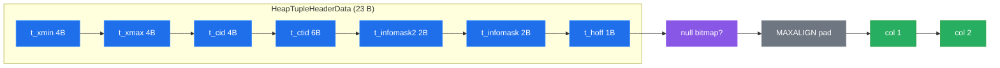
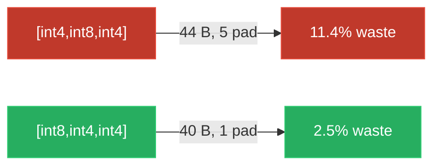

# TUPLE_FORMAT — How PostgreSQL serializes one row to bytes

> A concept bundle. Ground truth: [`tuple_format.py`](./tuple_format.py) ·
> Captured output: [`tuple_format_output.txt`](./tuple_format_output.txt) ·
> Interactive companion: [`tuple_format.html`](./tuple_format.html).
> Every number below is printed by `python3 tuple_format.py`; none are hand-computed.

---

## 0. The one-minute mental model

A row on disk is **not** "the columns, concatenated." It is:

```
┌─────────────────────────── HeapTupleHeaderData (23 B) ───────────────────────────┐
│ t_xmin(4) t_xmax(4) t_cid(4) t_ctid(6) t_infomask2(2) t_infomask(2) t_hoff(1)   │
├───────────────────────────────────┬──────────────┬───────────────────────────────┤
│ [null bitmap, only if HASNULL]    │ [MAXALIGN pad]│  col1  [pad]  col2  [pad] …  │
└───────────────────────────────────┴──────────────┴───────────────────────────────┘
 0                                23            t_hoff=24                         total
```

Three things to internalize before reading further:

1. **There is always a 23-byte tag glued to the front.** It is the row's MVCC identity (`t_xmin`/`t_xmax`), its self/forward pointer (`t_ctid`), and metadata flags. You pay it even for a 1-column row.
2. **Padding bytes are real.** Each column is placed at the next offset that is a multiple of its *alignment*. The gap in between holds nothing — it is wasted space.
3. **Column ORDER changes the total size.** Putting the 8-byte-aligned `bigint` before the 4-byte `integer` can delete padding bytes entirely. §4 shows a 4-byte/row difference that becomes **38 MiB at 10 M rows**.

---

## 1. The 23-byte header (HeapTupleHeaderData)

From PostgreSQL source `src/include/access/htup_details.h`:

| field | offset | size | meaning |
|---|---|---|---|
| `t_xmin` | 0 | 4 | transaction id that **inserted** this row |
| `t_xmax` | 4 | 4 | transaction id that **deleted/locked** it (`0` or `HEAP_XMAX_INVALID` ⇒ alive) |
| `t_cid` / `t_xvac` | 8 | 4 | command id inside the inserting xact (union with old-style VACUUM FULL xid) |
| `t_ctid` | 12 | 6 | `ItemPointerData`: 4 B block + 2 B offset → self, or **newer** version after UPDATE |
| `t_infomask2` | 18 | 2 | low 11 bits = number of attributes; high bits = flags |
| `t_infomask` | 20 | 2 | flags: `HEAP_HASNULL` (0x0001), `HEAP_HASVARWIDTH` (0x0002), `HEAP_XMAX_INVALID` (0x0800), … |
| `t_hoff` | 22 | 1 | **byte where column data begins** (= `MAXALIGN(23 + bitmap)`) |
| **total** | | **23** | |

Then an optional null bitmap, then `MAXALIGN` padding to reach `t_hoff`, then the columns.

> **Why this matters for MVCC.** `t_xmin`/`t_xmax`/`t_cid` are what make a row *versioned*. An `UPDATE` writes a NEW row with a fresh `t_xmin` and stamps the old row's `t_ctid` to point at the new one — a linked list of versions inside the heap. 🔗 This is the foundation of snapshot isolation; see a future `mvcc` bundle.



---

## 2. Fixed-length columns & alignment (typalign)

> From `tuple_format.py` **Section A:**

| type        | typlen | typalign | bytes needed |
|-------------|--------|----------|--------------|
| bool        |      1 |        1 |            1 |
| smallint    |      2 |        2 |            2 |
| integer     |      4 |        4 |            4 |
| bigint      |      8 |        8 |            8 |
| double      |      8 |        8 |            8 |
| timestamp   |      8 |        8 |            8 |
| date        |      4 |        4 |            4 |

Each column is placed at the next offset that is a multiple of `typalign`, inserting **padding** before it. Packing `[integer, bigint, integer]` with no NULLs:

> From `tuple_format.py` Section A (region table):

```
 off   len  kind    label                     note
----  ----  ------  ------------------------  ----
   0    23  header  HeapTupleHeaderData       (t_xmin..t_hoff)
  23     1  hpad    MAXALIGN padding          pad header to 8
  24     4  data    a (integer)
  28     4  pad     pad b                     align 8B
  32     8  data    b (bigint)
  40     4  data    c (integer)

bytes wasted on padding: 5 / 44  (11.4%)
[check] t_hoff==24 and total==44:  OK
```

- `t_hoff = 24`: the 23-byte header needs **1 byte** of `MAXALIGN` (8) padding.
- `b (bigint)` lands at offset 32, not 28, because `28 % 8 ≠ 0`. The 4 bytes at 28–31 are wasted.

---

## 3. Variable-length columns (varlena) — 1B vs 4B headers, TOAST

`text`, `varchar`, `bytea`, `bpchar` have `typlen = -1`: the value carries its own length in a header.

> From `tuple_format.py` Section B (header rule):

| payload chars | total bytes | header | header byte (LE) | align |
|---------------|-------------|--------|------------------|-------|
|             2 |           3 |      1 | 0x07             |     1 |
|             5 |           6 |      1 | 0x0d             |     1 |
|           126 |         127 |      1 | 0xff             |     1 |
|           127 |         131 |      4 | 0c 02 00 00      |     4 |
|           128 |         132 |      4 | 10 02 00 00      |     4 |
|           200 |         204 |      4 | 30 03 00 00      |     4 |

- **1-byte header** when `total ≤ 127`: `header = (total_len << 1) | 0x01`. **No alignment** — this exemption is the single biggest space-saver in a row.
- **4-byte header** otherwise: `header = (total_len << 2)` little-endian; aligns to 4 bytes (`'i'`).

**TOAST** — a varlena larger than ~2 KiB is *moved out of the tuple* (into the `pg_toast` table) and replaced by a fixed **18-byte pointer**:

```
 1 B : 0x01 marker (VARATT_IS_1B_E)
 1 B : tag  (18 = VARTAG_ON_DISK)
16 B : varatt_external { va_rawsize(4), va_extinfo(4),
                         va_valueid(4), va_tableoid(4) }   little-endian
= 18 bytes, no matter how huge the real value.
```

> From `tuple_format.py` Section B: `[check] a 5000-char text -> in-tuple pointer is 18 bytes (modeled): OK` and `[check] total_size==42: OK`.

### ⚠️ Pitfall: "I stored a 5-char string and it took 6 bytes"
Yes — the 1-byte length header is included. `"hello"` is `len=5` but `6 bytes` on disk (header `0x0d`, then `68 65 6c 6c 6f`). The header byte's top 7 bits are the length, bottom bit is the "short" flag.

---

## 4. Alignment waste — column ORDER matters

Same columns, same values, **different order → different size**.

> From `tuple_format.py` Section D — **BAD order** `[int4, int8, int4]` → **44 bytes** (5 padding, 11.4%):

```
  off   len  kind    label
    0    23  header  HeapTupleHeaderData
   23     1  hpad    MAXALIGN padding
   24     4  data    x (integer)
   28     4  pad     pad y            ← 4 bytes wasted: int8 wants an 8B boundary
   32     8  data    y (bigint)
   40     4  data    z (integer)
  bytes wasted on padding: 5 / 44  (11.4%)
```

> From `tuple_format.py` Section D — **GOOD order** `[int8, int4, int4]` → **40 bytes** (1 padding, 2.5%):

```
  off   len  kind    label
    0    23  header  HeapTupleHeaderData
   23     1  hpad    MAXALIGN padding
   24     8  data    y (bigint)       ← offset 24 already 8-aligned, no pad
   32     4  data    x (integer)
   36     4  data    z (integer)
  bytes wasted on padding: 1 / 40  (2.5%)
```

> `[check] BAD==44, GOOD==40, delta==4: OK`. At **10,000,000 rows** that 4-byte/row gap is **38 MiB** of pure padding.

**Rule of thumb:** declare columns in **descending alignment** — 8-byte (`bigint`, `double`, `timestamp`) first, then 4-byte (`integer`, `real`, `date`), then 2-byte (`smallint`), then 1-byte (`bool`, `"char"`). Put `text`/`varchar` where their 1-byte headers won't disrupt the 8-byte columns. (Note: column order is mostly cosmetic for performance — Postgres reads by attribute number — but it does change on-disk size.)



---

## 5. NULLs — the bitmap, 0 data bytes

A `NULL` column stores **nothing** in the data area. Its presence/absence is a single **bit** in the null bitmap (1 byte per 8 columns), which exists only when `HEAP_HASNULL` is set.

> From `tuple_format.py` Section C — `[integer, bigint, integer]` with the middle one `NULL`:

```
 off   len  kind    label                     note
   0    23  header  HeapTupleHeaderData       (t_xmin..t_hoff)
  23     1  bitmap  NULL bitmap               1 bit/col; 1=present 0=NULL
  24     4  data    a (integer)
  28     0  null    b                         NULL: 0 data bytes
  28     4  data    c (integer)
bytes wasted on padding: 0 / 32  (0.0%)
null bitmap byte = 0x05  (bit0=a present, bit2=c present, bit1=b NULL)
[check] bitmap byte==0x05 and total==32:  OK
```

Two surprises:

1. **`t_hoff` is still 24.** With ≤ 8 columns the 1-byte bitmap pads into the same `MAXALIGN` chunk as the header — so for small tables, the bitmap costs zero header overhead.
2. **The `bigint` simply disappears.** NULL `b` consumes 0 bytes (offset 28 is reused by `c`). A row of all-NULLs is just `header + bitmap`.

---

## 6. Worked example — byte-for-byte (the gold-check row)

```sql
CREATE TABLE t(a int, b text, c bigint, d boolean);
INSERT INTO t VALUES (42, 'hello', 9999999999, true);
```

> From `tuple_format.py` Section E (layout + hex dump):

```
 off   len  kind    label
   0    23  header  HeapTupleHeaderData
  23     1  hpad    MAXALIGN padding
  24     4  data    a (integer)          →  42        = 2a 00 00 00
  28     6  data    b (text)             →  'hello'   = 0d 68 65 6c 6c 6f
  34     6  pad     pad c                ←  6 bytes wasted: int8 wants 8B boundary
  40     8  data    c (bigint)           →  9999999999 = ff e3 0b 54 02 00 00 00
  48     1  data    d (bool)             →  true       = 01
bytes wasted on padding: 7 / 49  (14.3%)
```

Full on-disk bytes (little-endian, `t_xmin=1000`, `t_ctid=(0,1)`):

```
0000  e8 03 00 00 00 00 00 00 00 00 00 00 00 00 00 00  |................|
0010  01 00 04 00 02 08 18 00 2a 00 00 00 0d 68 65 6c  |........*....hel|
0020  6c 6f 00 00 00 00 00 00 ff e3 0b 54 02 00 00 00  |lo.........T....|
0030  01                                               |.|
```

Decoding the header: `t_xmin = 0x000003e8 = 1000`, `t_xmax = 0` (deleted by no one), `t_cid = 0`, `t_ctid block = 0` + `offset = 1`, `t_infomask2 = 4` (4 columns), `t_infomask = 0x0802` = `HEAP_XMAX_INVALID | HEAP_HASVARWIDTH`, `t_hoff = 0x18 = 24`.

> **GOLD:** `total tuple size = 49 bytes`, `t_hoff = 24`. This is the value [`tuple_format.html`](./tuple_format.html) recomputes in JS and gold-checks.

---

## 7. Cheat sheet

| want | formula |
|---|---|
| header size | `23` bytes always |
| null bitmap | `(natts + 7) // 8`, only if any NULL |
| data start | `t_hoff = MAXALIGN(23 + bitmap_bytes)` |
| column offset | `align_to(prev_offset, typalign)` |
| 1B varlena header | `(total_len << 1) \| 0x01`, total ≤ 127, **no align** |
| 4B varlena header | `(total_len << 2)` LE, align 4 |
| TOAST pointer | `18` bytes: `0x01` + tag `18` + 16 B external |
| NULL | 0 data bytes; a cleared bit in the bitmap |
| order columns | descending alignment (8B → 4B → 2B → 1B) to minimize padding |

---

## 8. Pitfalls

- **Don't assume `SELECT` returns bytes in this order.** This is the *on-disk* layout. Postgres copies columns out into a `Datum` array on read; attribute order in your result follows column definition order, not byte offsets.
- **`t_ctid` ≠ primary key.** It is the *physical* location (block, offset). After an `UPDATE` it points to the **new** version, forming the row-version chain.
- **`HEAP_HASNULL` off ⇒ no bitmap at all.** A table with no NULLs ever stores zero bitmap bytes — the "1 bit per column" cost only materializes once a NULL appears.
- **Alignment is platform-dependent.** `MAXALIGN` is 8 on 64-bit, 4 on 32-bit builds. The numbers here assume 64-bit.
- **TOAST threshold is a *tuple budget*, not a single-value limit.** Postgres tries to compress before TOASTing; a 2 KiB value may compress in place rather than go off-page.

---

## 9. References

- PostgreSQL source: [`htup_details.h`](https://github.com/postgres/postgres/blob/master/src/include/access/htup_details.h) (HeapTupleHeaderData), [`postgres.h`](https://github.com/postgres/postgres/blob/master/src/include/postgres.h) (varlena macros), [`varatt.h`](https://github.com/postgres/postgres/blob/master/src/include/varatt.h) (TOAST pointer).
- PostgreSQL docs: [Ch. 73 Database Physical Storage](https://www.postgresql.org/docs/current/storage-page-layout.html).
- Ramakrishnan & Gehrke, *Database Management Systems*, Ch. 9.
- Kleppmann, *Designing Data-Intensive Applications*, Ch. 3 (Storage and Retrieval).

---

🔗 *Part of the `db/` concept-bundle series. Sibling bundles (planned): `heap_page` (how tuples pack into an 8 KiB page), `mvcc` (how `t_xmin`/`t_xmax` build snapshots), `btree` (index pages).*
